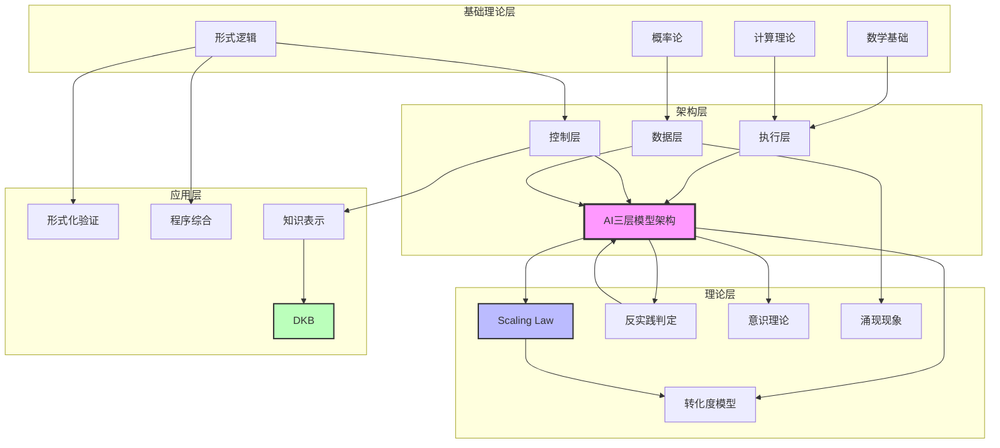
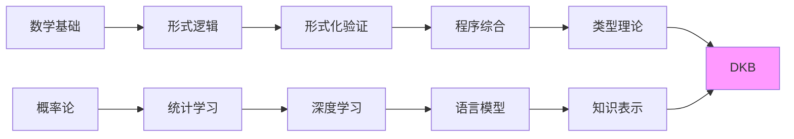
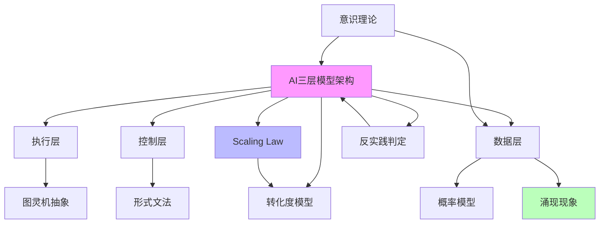
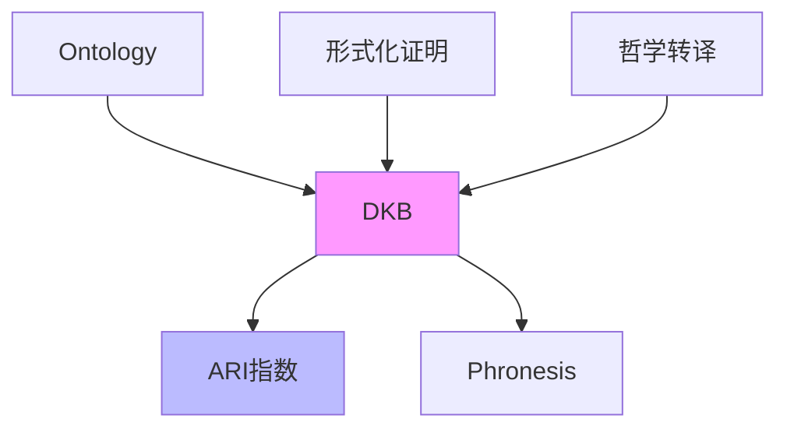
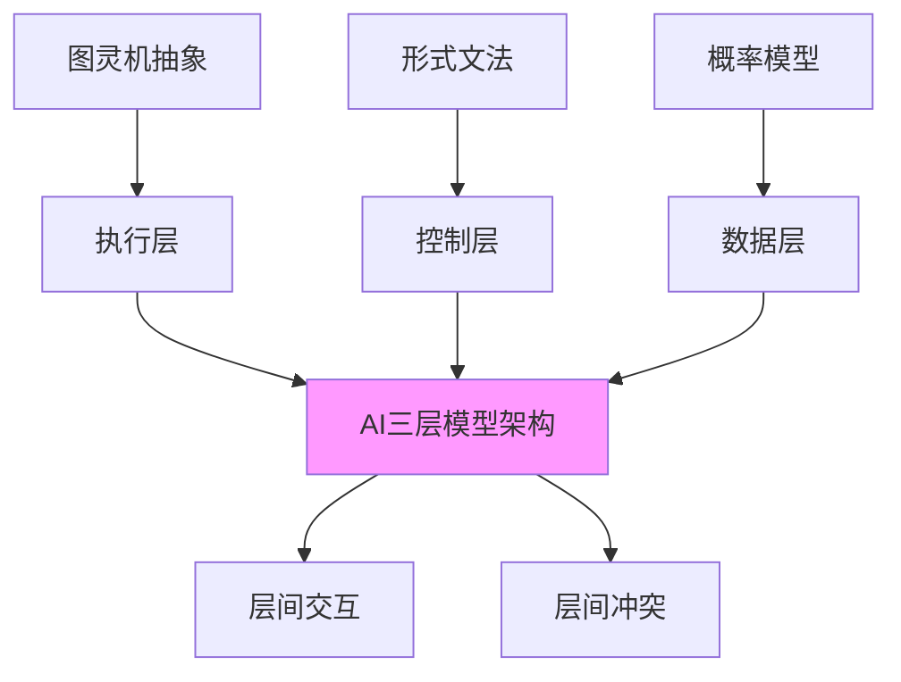
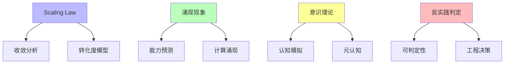
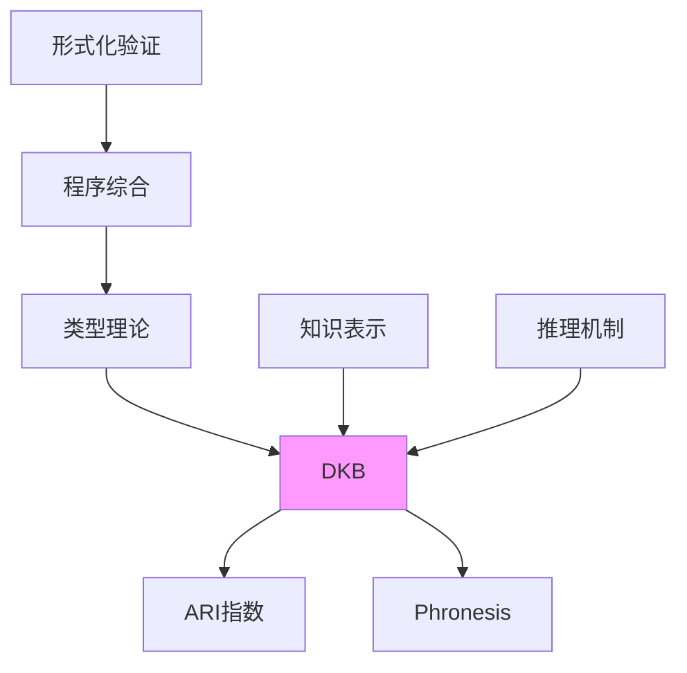

# 概念依赖关系图

**创建日期**：2025-11-10
**最后更新**：2025-11-10
**维护者**：FormalAI项目组
**文档版本**：v1.0
**状态**：🔄 持续更新中

---

## 📋 执行摘要

本文档提供FormalAI项目核心概念的完整依赖关系图，包括：

1. **概念依赖关系总览**
2. **按模块分类的依赖关系**
3. **按主题分类的依赖关系**
4. **依赖强度分析**
5. **依赖关系矩阵**

---

## 一、概念依赖关系总览

### 1.1 核心概念依赖图



---

## 二、按模块分类的依赖关系

### 2.1 docs模块概念依赖



**依赖关系说明**：

- **形式化验证** 依赖 **形式逻辑** 和 **数学基础**
- **程序综合** 依赖 **形式化验证**
- **类型理论** 依赖 **形式逻辑** 和 **程序综合**
- **DKB** 依赖 **类型理论** 和 **知识表示**

### 2.2 concepts模块概念依赖



**依赖关系说明**：

- **AI三层模型架构** 是核心基础，其他概念都依赖它
- **Scaling Law** 依赖 **三层模型** 的性能分析
- **转化度模型** 依赖 **Scaling Law** 和 **三层模型**
- **反实践判定** 依赖 **三层模型** 的可判定性分析
- **涌现现象** 依赖 **数据层** 的概率模型
- **意识理论** 依赖 **三层模型** 和 **数据层**

### 2.3 Philosophy模块概念依赖



**依赖关系说明**：

- **DKB** 依赖 **Ontology** 作为语义内核
- **ARI指数** 依赖 **DKB** 的完整性
- **Phronesis** 依赖 **DKB** 的History层

---

## 三、按主题分类的依赖关系

### 3.1 架构主题依赖关系



### 3.2 理论主题依赖关系



### 3.3 应用主题依赖关系



---

## 四、依赖强度分析

### 4.1 依赖强度分类

| 依赖强度 | **定义** | **示例** |
|---------|---------|---------|
| **🔴 强依赖** | 概念A是概念B的必要条件，无A则B无法存在 | 执行层 → 数据层（数据层依赖执行层计算） |
| **🟠 中依赖** | 概念A显著影响概念B的实现或理解 | 控制层 → 数据层（控制层约束数据层输出） |
| **🟡 弱依赖** | 概念A为概念B提供理论支撑或参考 | Scaling Law → 三层模型（理论支撑） |
| **🟢 关联** | 概念A与概念B相关，但无直接依赖 | 意识理论 ↔ 涌现现象（相关但独立） |

### 4.2 核心概念依赖强度矩阵

| 概念A | 概念B | **依赖强度** | **依赖类型** | **说明** |
|------|------|------------|------------|---------|
| **数据层** | **执行层** | 🔴 强 | 实现依赖 | 数据层依赖执行层计算 |
| **控制层** | **数据层** | 🟠 中 | 约束依赖 | 控制层约束数据层输出 |
| **Scaling Law** | **三层模型** | 🟡 弱 | 理论支撑 | Scaling Law解释三层模型性能 |
| **转化度模型** | **Scaling Law** | 🟡 弱 | 评估依赖 | 转化度模型评估Scaling Law成熟度 |
| **反实践判定** | **三层模型** | 🟠 中 | 应用依赖 | 反实践判定应用于三层模型分析 |
| **意识理论** | **三层模型** | 🟡 弱 | 理论分析 | 意识理论分析三层模型认知能力 |
| **涌现现象** | **数据层** | 🔴 强 | 机制依赖 | 涌现现象依赖数据层概率模型 |
| **DKB** | **Ontology** | 🔴 强 | 结构依赖 | DKB依赖Ontology作为语义内核 |
| **ARI指数** | **DKB** | 🔴 强 | 计算依赖 | ARI指数依赖DKB的完整性 |

---

## 五、依赖关系矩阵

### 5.1 完整依赖关系矩阵

| 概念 | **执行层** | **控制层** | **数据层** | **Scaling Law** | **转化度** | **反实践** | **意识** | **涌现** | **DKB** |
|------|-----------|-----------|-----------|----------------|-----------|-----------|---------|---------|---------|
| **执行层** | - | 🟡 | 🔴 | 🟢 | 🟢 | 🟡 | 🟢 | 🟢 | 🟢 |
| **控制层** | 🟡 | - | 🟠 | 🟢 | 🟢 | 🟡 | 🟢 | 🟢 | 🟢 |
| **数据层** | 🔴 | 🟠 | - | 🟡 | 🟢 | 🟡 | 🟡 | 🔴 | 🟢 |
| **Scaling Law** | 🟢 | 🟢 | 🟡 | - | 🟡 | 🟢 | 🟢 | 🟡 | 🟢 |
| **转化度** | 🟢 | 🟢 | 🟢 | 🟡 | - | 🟢 | 🟢 | 🟢 | 🟢 |
| **反实践** | 🟡 | 🟡 | 🟡 | 🟢 | 🟢 | - | 🟢 | 🟢 | 🟢 |
| **意识** | 🟢 | 🟢 | 🟡 | 🟢 | 🟢 | 🟢 | - | 🟡 | 🟢 |
| **涌现** | 🟢 | 🟢 | 🔴 | 🟡 | 🟢 | 🟢 | 🟡 | - | 🟢 |
| **DKB** | 🟢 | 🟢 | 🟢 | 🟢 | 🟢 | 🟢 | 🟢 | 🟢 | - |

**图例**：

- 🔴 强依赖
- 🟠 中依赖
- 🟡 弱依赖
- 🟢 关联

---

## 六、依赖路径分析

### 6.1 关键依赖路径

**路径1：基础理论 → 架构 → 应用**

```
数学基础 → 形式逻辑 → 形式化验证 → 程序综合 → DKB
```

**路径2：架构 → 理论 → 评估**

```
AI三层模型 → Scaling Law → 转化度模型
```

**路径3：数据层 → 涌现 → 能力**

```
数据层（概率模型） → 涌现现象 → 能力预测
```

**路径4：架构 → 判定 → 工程**

```
AI三层模型 → 反实践判定 → 工程决策
```

### 6.2 依赖路径重要性

| 路径 | **重要性** | **应用场景** |
|------|-----------|------------|
| **路径1** | 🔴 高 | 形式化方法应用 |
| **路径2** | 🔴 高 | 性能评估和优化 |
| **路径3** | 🟠 中 | 能力预测和规划 |
| **路径4** | 🟠 中 | 工程安全和决策 |

---

## 七、依赖关系验证

### 7.1 依赖关系检查清单

- [ ] 所有强依赖关系已明确标注
- [ ] 依赖关系方向正确（A → B 表示A依赖B）
- [ ] 无循环依赖（强依赖不应形成环）
- [ ] 依赖强度分类准确
- [ ] 依赖关系矩阵完整

### 7.2 依赖关系一致性验证

- [ ] 跨模块依赖关系一致
- [ ] 依赖关系与概念定义一致
- [ ] 依赖关系与映射关系一致

---

## 八、参考文档

### 8.1 相关文档

- [PROJECT_CONCEPT_SYSTEM.md](./PROJECT_CONCEPT_SYSTEM.md) - 项目概念体系
- [PROJECT_CROSS_MODULE_MAPPING.md](./PROJECT_CROSS_MODULE_MAPPING.md) - 跨模块映射
- [CONCEPT_DEFINITION_INDEX.md](./CONCEPT_DEFINITION_INDEX.md) - 概念定义索引

### 8.2 概念定义文档

- [concepts/01-AI三层模型架构/README.md](./concepts/01-AI三层模型架构/README.md) - 三层模型架构
- [concepts/03-Scaling Law与收敛分析/README.md](./concepts/03-Scaling Law与收敛分析/README.md) - Scaling Law
- [concepts/06-AI反实践判定系统/README.md](./concepts/06-AI反实践判定系统/README.md) - 反实践判定

---

**最后更新**：2025-11-10
**维护者**：FormalAI项目组
**文档版本**：v1.0（初始版本 - 创建概念依赖关系图）
