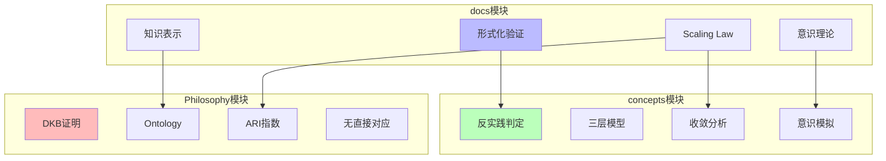

# 跨模块核心概念对比矩阵

**创建日期**：2025-11-10
**最后更新**：2025-11-10
**维护者**：FormalAI项目组
**文档版本**：v1.0
**状态**：🔄 持续更新中

---

## 📋 执行摘要

本文档提供FormalAI项目跨模块（docs、concepts、Philosophy）核心概念的系统化对比矩阵，包括：

1. **DKB vs AI三层模型架构对比矩阵**
2. **Ontology概念跨模块对比矩阵**
3. **形式化方法跨模块对比矩阵**
4. **意识理论跨模块对比矩阵**
5. **Scaling Law跨模块对比矩阵**
6. **知识表示跨模块对比矩阵**

---

## 一、DKB vs AI三层模型架构对比矩阵

### 1.1 架构对比

| 维度 | **DKB架构** | **AI三层模型架构** | **映射关系** |
|------|------------|------------------|------------|
| **架构层次** | 四层：Ontology、Logic、History、应用层 | 三层：执行层、控制层、数据层 | 不同抽象层级 |
| **Ontology层** | 业务对象、链接、属性的语义网络 | 对应控制层（形式语言模型） | 语义统一 |
| **Logic层** | 逻辑工具层，函数、动作、自动化 | 对应控制层（形式语言模型） | 逻辑工具 |
| **History层** | 决策历史层，捕获Phronesis | 无直接对应 | DKB特有 |
| **执行机制** | 应用层执行 | 执行层（图灵计算模型） | 计算执行 |
| **数据机制** | Ontology数据存储 | 数据层（数学概率模型） | 数据表示 |

### 1.2 功能对比

| 功能 | **DKB** | **AI三层模型** | **差异分析** |
|------|---------|---------------|------------|
| **语义统一** | Ontology层实现 | 控制层部分实现 | DKB更系统化 |
| **决策支持** | History层捕获决策历史 | 无直接对应 | DKB特有 |
| **知识复用** | Phronesis机制 | 数据层概率模型 | 不同机制 |
| **计算能力** | 依赖外部计算 | 执行层提供 | AI三层更完整 |
| **学习能力** | History层闭环学习 | 数据层训练 | 不同学习方式 |

---

## 二、Ontology概念跨模块对比矩阵

### 2.1 定义对比

| 模块 | **Ontology定义** | **形式化表述** | **应用场景** |
|------|----------------|--------------|------------|
| **docs** | 知识表示的形式化方法 | $\text{Ontology} = (C, R, A)$ | 知识图谱、语义网络 |
| **concepts** | 业务对象、链接、属性的语义网络 | $\text{Ontology} = \{o_i | o_i = (id_i, attrs_i, links_i)\}$ | AI框架分析 |
| **Philosophy** | 业务语义空间，消除语义鸿沟 | $\text{Ontology} = \text{SemanticSpace}$ | DKB架构、商业论证 |

### 2.2 功能对比

| 功能维度 | **docs模块** | **concepts模块** | **Philosophy模块** |
|---------|-------------|-----------------|-------------------|
| **主要用途** | 知识表示理论 | AI框架批判 | 商业决策支持 |
| **技术实现** | 知识图谱、RDF | 语义网络分析 | Palantir Foundry |
| **理论深度** | 形式化理论 | 批判性分析 | 实践应用 |
| **关联概念** | 知识表示、推理 | 三层模型、框架批判 | DKB、ARI指数 |

---

## 三、形式化方法跨模块对比矩阵

### 3.1 方法对比

| 方法 | **docs模块** | **concepts模块** | **Philosophy模块** |
|------|-------------|-----------------|-------------------|
| **形式化验证** | 系统满足规范证明 | 反实践判定 | DKB形式化证明 |
| **程序综合** | 从规范生成程序 | 理论化改进方法 | 无直接对应 |
| **类型理论** | 类型系统保证正确性 | 控制层形式语言 | Logic层类型系统 |
| **证明系统** | 交互式/自动化证明 | 形式证明索引 | DKB公理体系 |

### 3.2 应用场景对比

| 场景 | **docs应用** | **concepts应用** | **Philosophy应用** |
|------|-------------|-----------------|-------------------|
| **系统验证** | 程序正确性验证 | 反实践判定 | DKB系统验证 |
| **理论构建** | 形式化理论框架 | 科学理论框架 | 哲学转译 |
| **工程实践** | 软件开发 | AI系统分析 | 企业决策支持 |

---

## 四、意识理论跨模块对比矩阵

### 4.1 理论框架对比

| 理论 | **docs模块** | **concepts模块** | **Philosophy模块** |
|------|-------------|-----------------|-------------------|
| **IIT** | 整合信息理论 | 意识理论框架之一 | 无直接对应 |
| **GWT** | 全局工作空间理论 | 意识理论框架之一 | 无直接对应 |
| **预测处理** | 预测误差最小化 | 意识理论框架之一 | 无直接对应 |
| **功能主义** | 功能等价 | 意识理论框架之一 | 无直接对应 |

### 4.2 研究重点对比

| 研究重点 | **docs模块** | **concepts模块** | **Philosophy模块** |
|---------|-------------|-----------------|-------------------|
| **理论框架** | 意识理论综述 | 意识问题分析 | 无直接对应 |
| **实证研究** | 意识实验设计 | 非意识证据 | 无直接对应 |
| **应用场景** | 认知架构设计 | AI意识模拟 | 无直接对应 |

---

## 五、Scaling Law跨模块对比矩阵

### 5.1 定义对比

| 模块 | **Scaling Law定义** | **形式化表述** | **应用场景** |
|------|-------------------|--------------|------------|
| **docs** | 参数规模与性能关系 | $L(N) = a \cdot N^{-\alpha}$ | 模型性能预测 |
| **concepts** | 收敛分析理论 | $L(N) = a \cdot N^{-\alpha}$ | 收敛层级分析 |
| **Philosophy** | ARI指数关联 | $\text{ARI} = f(\text{语义对齐}, \text{逻辑封装}, \text{行动闭环})$ | AI就绪度评估 |

### 5.2 应用对比

| 应用维度 | **docs模块** | **concepts模块** | **Philosophy模块** |
|---------|-------------|-----------------|-------------------|
| **性能预测** | 模型规模规划 | 收敛时间预测 | AI就绪度评估 |
| **理论分析** | 缩放定律理论 | 收敛驱动力分析 | 商业价值分析 |
| **工程实践** | 训练资源配置 | 收敛策略制定 | 企业AI战略 |

---

## 六、知识表示跨模块对比矩阵

### 6.1 方法对比

| 方法 | **docs模块** | **concepts模块** | **Philosophy模块** |
|------|-------------|-----------------|-------------------|
| **知识图谱** | 图结构表示 | 无直接对应 | Ontology实现 |
| **Ontology** | 形式化本体 | 业务语义网络 | DKB核心层 |
| **语义网络** | 概念关系网络 | 三层模型分析 | 业务语义空间 |
| **向量表示** | 嵌入向量 | 数据层嵌入 | 无直接对应 |

### 6.2 应用场景对比

| 场景 | **docs应用** | **concepts应用** | **Philosophy应用** |
|------|-------------|-----------------|-------------------|
| **知识存储** | 知识库构建 | 无直接对应 | Ontology层存储 |
| **知识推理** | 逻辑推理 | 控制层推理 | Logic层推理 |
| **知识复用** | 知识共享 | 无直接对应 | History层复用 |

---

## 七、跨模块概念映射关系图

---

## 八、使用指南

### 8.1 按概念查找

- **DKB相关** → 矩阵1.1, 1.2
- **Ontology相关** → 矩阵2.1, 2.2
- **形式化方法** → 矩阵3.1, 3.2
- **意识理论** → 矩阵4.1, 4.2
- **Scaling Law** → 矩阵5.1, 5.2
- **知识表示** → 矩阵6.1, 6.2

### 8.2 按应用场景

- **架构设计** → 矩阵1.1, 1.2
- **理论分析** → 矩阵2.1, 3.1, 4.1, 5.1
- **工程实践** → 矩阵3.2, 5.2, 6.2
- **跨模块整合** → 矩阵7（映射关系图）

---

## 九、参考文档

### 9.1 内部参考文档

- [PROJECT_CROSS_MODULE_MAPPING.md](./PROJECT_CROSS_MODULE_MAPPING.md) - 跨模块映射文档
- [concepts/CONCEPTS_COMPARISON_MATRIX.md](./concepts/CONCEPTS_COMPARISON_MATRIX.md) - Concepts模块对比矩阵
- [Philosophy/model/03-概念多维对比矩阵.md](./Philosophy/model/03-概念多维对比矩阵.md) - Philosophy模块对比矩阵

### 9.2 项目计划文档

- [PROJECT_COMPREHENSIVE_PLAN.md](./PROJECT_COMPREHENSIVE_PLAN.md) - 项目全面计划
- [PROJECT_CONCEPT_SYSTEM.md](./PROJECT_CONCEPT_SYSTEM.md) - 项目概念体系

---

**最后更新**：2025-11-10
**维护者**：FormalAI项目组
**文档版本**：v1.0（初始版本 - 创建跨模块核心概念对比矩阵）
