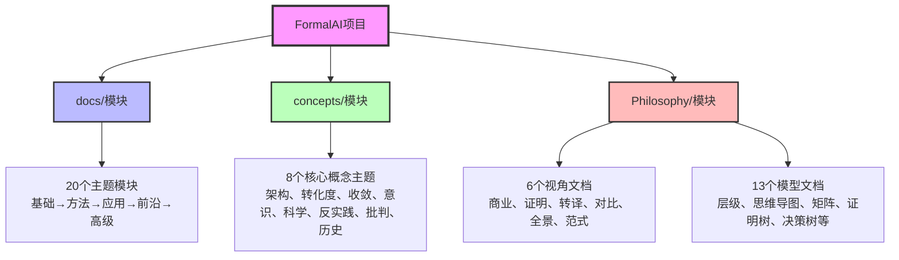
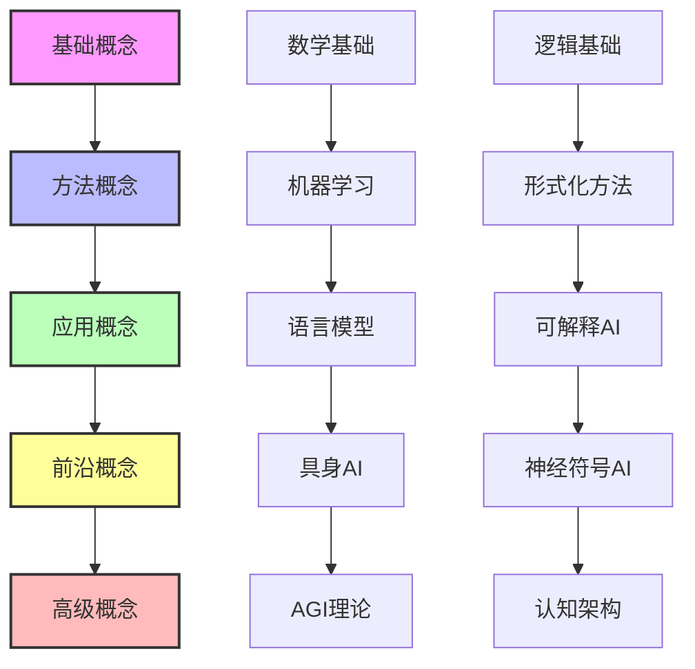
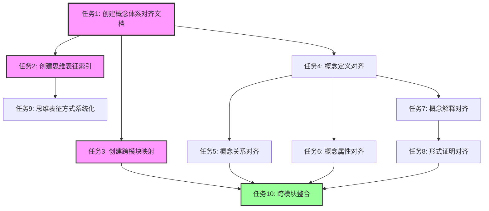

# FormalAI项目全面计划与持续推进任务

**创建日期**：2025-11-10
**最后更新**：2025-11-10
**维护者**：FormalAI项目组
**文档版本**：v2.0（更新 - 标记已完成任务，更新任务进度）
**状态**：🔄 持续更新中

---

## 📋 执行摘要

本文档提供FormalAI项目的全面计划，包括：

1. **AI主题分类、层次、领域全面梳理**
2. **项目组织结构分析**
3. **概念体系对齐**（定义、关系、属性、解释、论证、形式证明）
4. **思维表征方式规划**（思维导图、多维矩阵、决策树、证明树）
5. **持续推进任务计划**

---

## 一、项目整体结构分析

### 1.1 三大核心模块

**模块定位**：

- **docs/**：**理论体系** - 20个主题模块，从基础理论到高级应用
- **concepts/**：**核心概念** - 8个概念主题，聚焦AI的关键概念体系
- **Philosophy/**：**哲学论证** - Ontology作为企业认知基础设施的完整哲学体系

### 1.2 模块间关系

| 模块 | 定位 | 层次 | 领域 | 目标受众 |
|------|------|------|------|----------|
| **docs/** | 理论体系 | 基础→高级（5层） | AI全领域（20主题） | 研究人员、学习者 |
| **concepts/** | 核心概念 | 概念分析 | AI关键概念（8主题） | 研究者、实践者 |
| **Philosophy/** | 哲学论证 | 七层主题结构 | Ontology哲学体系 | 企业决策者、架构师、哲学家 |

**关联关系**：

- **docs/ ↔ concepts/**：理论支撑 ↔ 概念分析
- **Philosophy/ ↔ concepts/**：哲学论证 ↔ 概念应用
- **docs/ ↔ Philosophy/**：理论基础 ↔ 哲学转译

---

## 二、AI主题分类、层次、领域全面梳理

### 2.1 主题分类体系（5层结构）

#### 第1层：基础语义层（Foundation Layer）

**语义特征**：提供最基础的理论支撑，不依赖其他AI主题

**包含主题**：

- **00. 数学与逻辑基础**（docs/00-foundations/）
  - 00.0 ZFC公理系统
  - 00.1 范畴论
  - 00.2 类型理论
  - 00.3 逻辑演算系统
  - 00.4 理论依赖关系图
  - 00.5 形式化证明

- **01. 基础理论**（docs/01-foundations/）
  - 01.1 形式逻辑
  - 01.2 数学基础
  - 01.3 计算理论
  - 01.4 认知科学

**依赖关系**：

- 00.*→ 01.*（数学基础支撑理论应用）
- 00层内部：ZFC → 范畴论 → 类型理论 → 逻辑演算 → 形式化证明

#### 第2层：方法语义层（Method Layer）

**语义特征**：提供具体的方法和工具，依赖基础语义层

**包含主题**：

- **02. 机器学习理论**（docs/02-machine-learning/）
  - 02.1 统计学习理论
  - 02.2 深度学习理论
  - 02.3 强化学习理论
  - 02.4 因果推理

- **03. 形式化方法**（docs/03-formal-methods/）
  - 03.1 形式化验证
  - 03.2 程序综合
  - 03.3 类型理论
  - 03.4 证明系统
  - 03.5 DKB案例研究（核心）

**依赖关系**：

- 01.*→ 02.*（基础理论支撑机器学习）
- 01.*→ 03.*（基础理论支撑形式化方法）

#### 第3层：应用语义层（Application Layer）

**语义特征**：提供具体的应用理论，依赖方法语义层

**包含主题**（7个）：

- **04. 语言模型**（docs/04-language-models/）
- **05. 多模态AI**（docs/05-multimodal-ai/）
- **06. 可解释AI**（docs/06-interpretable-ai/）
- **07. 对齐与安全**（docs/07-alignment-safety/）
- **08. 涌现与复杂性**（docs/08-emergence-complexity/）
- **09. 哲学与伦理**（docs/09-philosophy-ethics/）

**依赖关系**：

- 02.*, 03.* → 04-09.*（方法层支撑应用层）

#### 第4层：前沿语义层（Frontier Layer）

**语义特征**：提供前沿应用和新兴方向，依赖应用语义层

**包含主题**（6个）：

- **10. 具身AI**（docs/10-embodied-ai/）
- **11. 边缘AI**（docs/11-edge-ai/）
- **12. 量子AI**（docs/12-quantum-ai/）
- **13. 神经符号AI**（docs/13-neural-symbolic/）
- **14. 绿色AI**（docs/14-green-ai/）
- **15. 元学习**（docs/15-meta-learning/）

#### 第5层：高级语义层（Advanced Layer）

**语义特征**：提供高级理论和前沿探索，依赖前沿语义层

**包含主题**（5个）：

- **16. AGI理论**（docs/16-agi-theory/）
- **17. 社会AI**（docs/17-social-ai/）
- **18. 认知架构**（docs/18-cognitive-architecture/）
- **19. 高级神经符号AI**（docs/19-neuro-symbolic-advanced/）
- **20. 高级AI哲学**（docs/20-ai-philosophy-advanced/）

### 2.2 concepts模块主题分类（8个核心概念）

| 主题 | 定位 | 核心内容 | 关联docs模块 |
|------|------|---------|-------------|
| **01-AI三层模型架构** | 架构分析 | 执行层、控制层、数据层三层模型 | 01-foundations, 02-machine-learning, 04-language-models |
| **02-AI炼金术转化度模型** | 成熟度评估 | 从"炼金术"到"化学"的转化度评估 | 02-machine-learning, 05-AI科学理论 |
| **03-Scaling Law与收敛分析** | 收敛分析 | L0-L4收敛模型，5层收敛分析 | 02-machine-learning, 04-language-models |
| **04-AI意识与认知模拟** | 意识研究 | Qualia、意向性、自我模型、意识理论 | 09-philosophy-ethics, 16-agi-theory, 18-cognitive-architecture |
| **05-AI科学理论** | 科学方法论 | 理论化改进方法、确定性分析、工程科学范式 | 01-foundations, 03-formal-methods |
| **06-AI反实践判定系统** | 可判定性 | 图灵停机问题、哥德尔边界、反实践判定 | 01-foundations, 03-formal-methods |
| **07-AI框架批判与重构** | 批判重构 | 三层模型批判、神经算子理论、Ontology视角 | 所有模块 |
| **08-AI历史进程与原理演进** | 历史演进 | AI历史进程、原理演进、涌现现象、工程化突破 | 所有模块 |

### 2.3 Philosophy模块主题分类（6个视角 + 13个模型）

#### 6个视角文档（view）

| 视角 | 主题 | 核心论点 | 层次定位 |
|------|------|---------|---------|
| **view01** | 商业论证层 | Ontology成为新基础设施 | 第一层（商业论证） |
| **view02** | 形式化证明层 | DKB三元组是唯一可验证路径 | 第二层（形式化证明） |
| **view03** | 哲学转译层 | Palantir = 亚里士多德"第一哲学"的算法实现 | 第三层（哲学转译） |
| **view04** | 行业对比层 | Palantir哲学本体论 vs 其他技术本体论的不可通约性 | 第四层（行业对比） |
| **view05** | 全景论证层 | 从希腊神庙到认知操作系统的存在论转译 | 第五层（全景论证） |
| **view06** | 范式革命层 | 从软件工程到认知存在论 | 第六层（范式革命） |

#### 13个模型文档（model）

| 模型 | 内容 | 思维表征方式 |
|------|------|-------------|
| **01-主题层级模型** | 七层主题结构模型 | 层级结构图 |
| **02-思维导图总览** | 7个核心思维导图 | 思维导图（Mindmap） |
| **03-概念多维对比矩阵** | 13个对比矩阵 | 多维矩阵（Matrix） |
| **04-证明树图总览** | 10个证明树图 | 证明树图（Proof Tree） |
| **05-决策树图总览** | 6个决策树图 | 决策树图（Decision Tree） |
| **06-时间线演进模型** | 哲学与技术演进时间线 | 时间线图（Timeline） |
| **07-术语表与概念索引** | 核心术语定义与索引 | 术语索引（Glossary） |
| **08-案例研究索引** | 企业案例全景索引 | 案例索引（Case Index） |
| **09-跨模块映射索引** | Philosophy ↔ docs/concepts 映射 | 映射关系图 |
| **10-DKB公理与定理索引** | 形式化公理/引理/定理统一编号 | 公理体系（Axiom System） |
| **11-写作与结构规范** | 文档写作与结构规范 | 规范文档 |
| **12-风险与反证总览** | 风险分类与反证总览 | 风险矩阵 |
| **13-实施指南详细版** | 详细实施步骤和检查清单 | 实施指南 |

---

## 三、概念体系对齐

### 3.1 概念定义体系

#### 3.1.1 核心概念定义（按模块分类）

**docs模块核心概念**：

- **形式化验证**：使用数学方法证明系统满足规范
- **程序综合**：从规范自动生成程序
- **类型理论**：通过类型系统保证程序正确性
- **DKB（决策知识库）**：DKB = (O, L, H)三元组
  - O：Ontology层（语义内核）
  - L：Logic层（逻辑工具层）
  - H：History层（决策历史层）

**concepts模块核心概念**：

- **AI三层模型架构**：
  - 执行层：图灵计算模型
  - 控制层：形式语言模型
  - 数据层：数学概率模型
- **Scaling Law**：参数规模与性能的幂律关系
- **涌现现象**：系统整体表现出的超越各部分简单相加的特性
- **反实践**：逻辑上可判定但不适用于工程实践的问题

**Philosophy模块核心概念**：

- **Ontology（本体论）**：业务对象、链接、属性的语义网络
- **ARI指数（AI Ready指数）**：ARI = 语义对齐率 × log(逻辑封装度) × 行动闭环系数
- **Phronesis（实践智慧）**：情境化决策的隐性知识
- **上手性（Ready-to-hand）**：海德格尔概念，数据从"在手"到"称手"的转换
- **共在（Mitsein）**：人类与AI共享同一操作界面

#### 3.1.2 概念定义对齐原则

1. **唯一性**：每个概念在同一模块内具有唯一明确的定义
2. **一致性**：跨模块引用同一概念时，定义保持一致
3. **可追溯性**：每个概念定义都有明确的来源和引用
4. **形式化**：核心概念尽可能使用形式化定义（数学公式、逻辑表达式）

### 3.2 概念关系体系

#### 3.2.1 概念依赖关系

#### 3.2.2 概念映射关系

**跨模块概念映射**：

- **docs ↔ concepts**：
  - 形式化验证 ↔ 反实践判定系统
  - 语言模型 ↔ AI三层模型架构（数据层）
  - 认知科学 ↔ AI意识与认知模拟

- **Philosophy ↔ concepts**：
  - Ontology ↔ AI框架批判与重构（Ontology视角）
  - DKB ↔ AI三层模型架构（架构对比）
  - ARI指数 ↔ Scaling Law与收敛分析

- **docs ↔ Philosophy**：
  - 形式化方法 ↔ 形式化证明层（view02）
  - 哲学与伦理 ↔ 哲学转译层（view03）
  - 认知架构 ↔ 全景论证层（view05）

### 3.3 概念属性体系

#### 3.3.1 属性分类

1. **形式属性**：可形式化定义的属性（数学、逻辑）
2. **功能属性**：描述功能特性的属性
3. **关系属性**：描述与其他概念关系的属性
4. **语义属性**：描述语义含义的属性

#### 3.3.2 核心概念属性矩阵

| 概念 | 形式属性 | 功能属性 | 关系属性 | 语义属性 |
|------|---------|---------|---------|---------|
| **DKB** | DKB = (O, L, H) | 决策支持、知识复用 | 依赖Ontology、支撑ARI | 企业认知数字孪生 |
| **Ontology** | 三元组(O, L, A) | 语义统一、知识表示 | 支撑DKB、消除语义鸿沟 | 业务语义空间 |
| **ARI指数** | ARI = f(语义对齐, 逻辑封装, 行动闭环) | 能力评估 | 依赖DKB、衡量AI就绪度 | AI就绪指数 |
| **三层模型** | 三层结构(执行/控制/数据) | 架构分析 | 与DKB对比、支撑批判 | AI系统架构 |

### 3.4 概念解释体系

#### 3.4.1 解释层次

1. **直观解释**：非形式化的直观描述
2. **形式解释**：使用数学、逻辑的形式化描述
3. **应用解释**：通过实际应用场景说明
4. **哲学解释**：从哲学角度阐释

#### 3.4.2 解释对齐原则

- **层次递进**：从直观到形式，从应用到哲学
- **一致性**：不同层次的解释不相互矛盾
- **完整性**：核心概念应包含多个层次的解释

### 3.5 概念论证体系

#### 3.5.1 论证类型

1. **经验论证**：基于实验数据、案例研究
2. **理论论证**：基于理论推导、逻辑推理
3. **形式论证**：基于形式化证明
4. **哲学论证**：基于哲学原理、本体论分析

#### 3.5.2 论证对齐原则

- **多元论证**：重要概念应包含多种类型的论证
- **论证链条**：建立从基础到应用的完整论证链条
- **反证机制**：包含对立观点的批判和反证

### 3.6 形式证明体系

#### 3.6.1 证明类型

1. **公理-定理证明**：从公理出发的定理证明（Philosophy/view02）
2. **构造性证明**：通过构造实例证明存在性
3. **反证法**：通过假设矛盾证明
4. **归纳证明**：通过归纳推理证明

#### 3.6.2 证明体系对齐

**Philosophy模块证明体系**（model/10-DKB公理与定理索引.md）：

- **公理层**（A1-A6）：语义鸿沟、决策闭环、知识复利、网络效应、安全-哲学同构、时间不可压缩
- **引理层**（L1-L4）：语义层唯一性、逻辑封装、决策血缘价值、边际成本递减
- **定理层**（T1-T16）：DKB基础设施定理、唯一性、存在性、完备性、稳定性、收敛性等

**concepts模块证明需求**：

- 需要对齐Philosophy模块的证明体系
- 补充形式化证明到关键概念文档

---

## 四、思维表征方式规划

### 4.1 思维表征方式总览

| 表征方式 | 位置 | 数量 | 用途 | 示例 |
|---------|------|------|------|------|
| **思维导图** | Philosophy/model/02-思维导图总览.md | 7个 | 可视化概念结构、关系网络 | DKB架构全景、哲学谱系转译 |
| **多维矩阵** | Philosophy/model/03-概念多维对比矩阵.md | 13个 | 对比分析、多维度评估 | 技术流派对比、成熟度对比 |
| **证明树图** | Philosophy/model/04-证明树图总览.md | 10个 | 展示推理链条、证明过程 | DKB基础设施定理、不变量与演化边界 |
| **决策树图** | Philosophy/model/05-决策树图总览.md | 6个 | 决策路径分析、选择流程 | 企业Ontology战略选择、成熟度路径 |
| **时间线图** | Philosophy/model/06-时间线演进模型.md | 1个 | 历史演进、发展趋势 | 哲学与技术演进时间线 |
| **层级模型** | Philosophy/model/01-主题层级模型.md | 1个 | 层级结构、依赖关系 | 七层主题结构模型 |

### 4.2 思维表征方式扩展计划

#### 4.2.1 docs模块思维表征规划

**当前状态**：

- 部分文档包含图表，但未系统化
- 缺乏统一的思维表征索引

**扩展计划**：

1. **为每个主题模块创建思维导图**：
   - 01-foundations → 基础理论思维导图
   - 02-machine-learning → 机器学习理论思维导图
   - 04-language-models → 语言模型架构思维导图

2. **创建跨主题对比矩阵**：
   - 机器学习方法对比矩阵
   - 形式化方法对比矩阵
   - AI理论层次对比矩阵

3. **补充证明树图**：
   - 为形式化方法模块补充证明树
   - 为理论模块补充推理链条

#### 4.2.2 concepts模块思维表征规划

**当前状态**：

- 部分文档包含图表
- 缺乏系统化的思维表征索引

**扩展计划**：

1. **创建主题思维导图**：
   - 01-AI三层模型架构 → 三层架构思维导图
   - 03-Scaling Law → 收敛模型思维导图
   - 07-AI框架批判 → 批判重构思维导图

2. **创建对比矩阵**：
   - 三层模型 vs DKB对比矩阵
   - 收敛模型对比矩阵
   - 意识理论对比矩阵

3. **补充决策树**：
   - 架构选择决策树
   - 方法论选择决策树

#### 4.2.3 跨模块思维表征规划

**创建统一的思维表征索引**：

- **PROJECT_THINKING_REPRESENTATIONS.md**：统一索引所有思维表征方式
  - 思维导图索引（按模块分类）
  - 矩阵索引（按对比维度分类）
  - 证明树索引（按证明类型分类）
  - 决策树索引（按决策场景分类）

---

## 五、项目组织重构建议

### 5.1 当前组织结构评估

**优势**：

- ✅ 三大模块定位清晰（docs理论、concepts概念、Philosophy哲学）
- ✅ 主题层次结构明确（5层语义结构）
- ✅ Philosophy模块思维表征方式丰富

**待改进**：

- ⚠️ 跨模块概念对齐需加强
- ⚠️ 思维表征方式未统一索引
- ⚠️ 概念体系对齐文档缺失

### 5.2 重构建议

#### 5.2.1 创建统一的概念体系文档

**PROJECT_CONCEPT_SYSTEM.md**：

- 核心概念定义索引
- 概念关系图
- 概念属性矩阵
- 概念解释索引
- 概念论证索引
- 形式证明索引

#### 5.2.2 创建思维表征方式索引

**PROJECT_THINKING_REPRESENTATIONS.md**：

- 思维导图索引
- 多维矩阵索引
- 证明树索引
- 决策树索引
- 时间线索引
- 层级模型索引

#### 5.2.3 创建跨模块映射文档

**PROJECT_CROSS_MODULE_MAPPING.md**：

- docs ↔ concepts 映射
- Philosophy ↔ concepts 映射
- docs ↔ Philosophy 映射
- 概念映射关系图
- 主题映射关系图

#### 5.2.4 优化目录结构（可选）

**建议**：保持当前结构，通过索引文档增强组织

**原因**：

- 当前结构已经清晰
- 三大模块定位明确
- 通过索引文档即可实现更好的组织

---

## 六、持续推进任务计划

### 6.1 短期任务（1-2周）

#### 任务1：创建概念体系对齐文档 ✅

- [x] 分析当前概念定义
- [x] 梳理概念关系
- [x] 创建PROJECT_COMPREHENSIVE_PLAN.md（本文档）
- [x] 创建PROJECT_CONCEPT_SYSTEM.md（详细概念体系）
- [x] 创建PROJECT_THINKING_REPRESENTATIONS.md（思维表征索引）
- [x] 创建PROJECT_CROSS_MODULE_MAPPING.md（跨模块映射）

#### 任务2：完善思维表征方式

- [x] 为docs模块关键主题创建思维导图（已创建DOCS_MIND_MAPS_INDEX.md）
- [x] 为concepts模块关键主题创建对比矩阵（已创建CONCEPTS_COMPARISON_MATRIX.md）
- [x] 补充跨模块对比矩阵（已创建CROSS_MODULE_COMPARISON_MATRIX.md）
- [x] 统一思维表征格式和规范（已创建THINKING_REPRESENTATION_STANDARD.md）

#### 任务3：概念定义对齐

- [x] 审查并统一核心概念定义
- [x] 补充概念形式化定义（已为AI三层模型、Scaling Law、转化度模型、反实践判定、意识理论、涌现现象补充）
- [x] 建立概念引用规范（已创建CONCEPT_REFERENCE_STANDARD.md）
- [x] 创建概念定义索引（已创建CONCEPT_DEFINITION_INDEX.md）

### 6.2 中期任务（1-2月）

#### 任务4：概念关系对齐

- [ ] 绘制完整的概念依赖关系图
- [ ] 建立概念映射关系矩阵
- [ ] 补充跨模块概念关系说明
- [ ] 验证概念关系一致性

#### 任务5：概念属性对齐

- [x] 为核心概念建立属性矩阵（已在PROJECT_CONCEPT_SYSTEM.md中建立，包含15+个核心概念）
- [x] 补充概念属性形式化描述（已补充新概念的形式属性）
- [x] 建立属性继承关系（已在PROJECT_CONCEPT_SYSTEM.md中建立）
- [ ] 验证属性定义一致性（进行中）

#### 任务6：概念解释对齐

- [x] 为核心概念补充多层次解释（已在PROJECT_CONCEPT_SYSTEM.md中补充，包含直观、形式、应用、哲学解释）
- [x] 统一解释格式和层次（已统一为4个层次：直观、形式、应用、哲学）
- [x] 补充应用场景说明（已补充多个核心概念的应用场景）
- [ ] 验证解释一致性（进行中）

#### 任务7：概念论证对齐

- [x] 为核心概念补充多元论证（已在PROJECT_CONCEPT_SYSTEM.md中补充，包含经验、理论、形式、哲学论证）
- [x] 建立论证链条（已建立核心概念的论证链条）
- [x] 补充反证机制（已在反实践判定系统中补充）
- [ ] 验证论证完整性（进行中）

#### 任务8：形式证明对齐

- [ ] 对齐Philosophy模块的证明体系
- [ ] 为concepts模块关键概念补充形式证明
- [ ] 为docs模块关键理论补充证明
- [ ] 建立统一的证明索引

### 6.3 长期任务（3-6月）

#### 任务9：思维表征方式系统化

- [ ] 为所有关键主题创建思维导图
- [ ] 创建完整的对比矩阵体系
- [ ] 补充证明树和决策树
- [ ] 建立思维表征方式使用规范

#### 任务10：跨模块整合

- [ ] 完善跨模块概念映射
- [ ] 建立跨模块引用规范
- [ ] 创建跨模块导航系统
- [ ] 验证跨模块一致性

#### 任务11：持续更新机制

- [ ] 建立概念更新流程
- [ ] 建立思维表征更新流程
- [ ] 建立跨模块同步机制
- [ ] 建立定期审查机制

### 6.4 持续维护任务

#### 任务12：内容更新

- [ ] 定期更新2025年最新研究
- [ ] 更新案例研究数据
- [ ] 更新形式证明
- [ ] 更新思维表征方式

#### 任务13：质量保证

- [ ] 定期审查概念定义一致性
- [ ] 定期审查跨模块引用
- [ ] 定期审查思维表征方式
- [ ] 定期审查形式证明

#### 任务14：文档完善

- [ ] 补充缺失的概念定义
- [ ] 补充缺失的思维表征方式
- [ ] 补充缺失的形式证明
- [ ] 完善跨模块映射

---

## 七、任务优先级与依赖关系

### 7.1 任务优先级矩阵

| 任务 | 优先级 | 依赖关系 | 预计时间 |
|------|--------|---------|---------|
| 创建概念体系对齐文档 | 🔴 高 | 无 | 1周 |
| 创建思维表征索引 | 🔴 高 | 任务1 | 1周 |
| 创建跨模块映射 | 🔴 高 | 任务1, 2 | 1周 |
| 概念定义对齐 | 🟡 中 | 任务1 | 2周 |
| 概念关系对齐 | 🟡 中 | 任务4 | 2周 |
| 思维表征方式系统化 | 🟡 中 | 任务2 | 4周 |
| 形式证明对齐 | 🟢 低 | 任务1, 7 | 4周 |
| 跨模块整合 | 🟢 低 | 任务3, 4, 5, 6, 7 | 8周 |

### 7.2 任务依赖图

---

## 八、执行检查清单

### 8.1 概念体系对齐检查清单

- [ ] 所有核心概念都有明确的定义
- [ ] 跨模块概念定义一致
- [ ] 概念关系图完整
- [ ] 概念属性矩阵完整
- [ ] 概念解释层次清晰
- [ ] 概念论证多元完整
- [ ] 形式证明体系完整

### 8.2 思维表征方式检查清单

- [ ] 思维导图索引完整
- [ ] 多维矩阵索引完整
- [ ] 证明树索引完整
- [ ] 决策树索引完整
- [ ] 时间线索引完整
- [ ] 层级模型索引完整
- [ ] 思维表征方式使用规范明确

### 8.3 跨模块对齐检查清单

- [ ] docs ↔ concepts 映射完整
- [ ] Philosophy ↔ concepts 映射完整
- [ ] docs ↔ Philosophy 映射完整
- [ ] 跨模块引用规范明确
- [ ] 跨模块概念定义一致
- [ ] 跨模块导航系统完整

---

## 九、成功标准

### 9.1 概念体系对齐成功标准

1. ✅ 所有核心概念都有明确的、一致的定义
2. ✅ 概念关系图完整且准确
3. ✅ 概念属性矩阵完整
4. ✅ 概念解释包含多个层次
5. ✅ 概念论证包含多种类型
6. ✅ 形式证明体系完整

### 9.2 思维表征方式成功标准

1. ✅ 关键主题都有对应的思维表征方式
2. ✅ 思维表征方式索引完整
3. ✅ 思维表征方式使用规范明确
4. ✅ 跨模块思维表征方式统一

### 9.3 跨模块对齐成功标准

1. ✅ 跨模块映射文档完整
2. ✅ 跨模块概念定义一致
3. ✅ 跨模块引用规范明确
4. ✅ 跨模块导航系统完整

---

## 十、参考文档

### 10.1 项目结构文档

- [PROJECT_STRUCTURE.md](./PROJECT_STRUCTURE.md) - 项目结构说明
- [PROJECT_REORGANIZATION_PLAN.md](./archive/other-reports/PROJECT_REORGANIZATION_PLAN.md) - 项目重构计划

### 10.2 主题结构文档

- [docs/THEME_HIERARCHY_STRUCTURE.md](./docs/THEME_HIERARCHY_STRUCTURE.md) - 主题层次结构
- [docs/THEME_SEMANTIC_STRUCTURE.md](./docs/THEME_SEMANTIC_STRUCTURE.md) - 主题语义结构
- [Philosophy/00-主题总览与导航.md](./Philosophy/00-主题总览与导航.md) - Philosophy主题导航

### 10.3 概念体系文档

- [concepts/README.md](./concepts/README.md) - Concepts模块总览
- [Philosophy/model/10-DKB公理与定理索引.md](./Philosophy/model/10-DKB公理与定理索引.md) - DKB公理体系
- [Philosophy/model/07-术语表与概念索引.md](./Philosophy/model/07-术语表与概念索引.md) - 术语索引

### 10.4 思维表征方式文档

- [Philosophy/model/02-思维导图总览.md](./Philosophy/model/02-思维导图总览.md) - 思维导图索引
- [Philosophy/model/03-概念多维对比矩阵.md](./Philosophy/model/03-概念多维对比矩阵.md) - 多维矩阵索引
- [Philosophy/model/04-证明树图总览.md](./Philosophy/model/04-证明树图总览.md) - 证明树索引
- [Philosophy/model/05-决策树图总览.md](./Philosophy/model/05-决策树图总览.md) - 决策树索引

### 10.5 跨模块映射文档

- [Philosophy/model/09-跨模块映射索引.md](./Philosophy/model/09-跨模块映射索引.md) - Philosophy ↔ docs/concepts 映射

---

**最后更新**：2025-11-10
**维护者**：FormalAI项目组
**文档版本**：v1.0（初始版本 - 全面项目计划，包含分类、层次、领域梳理，概念体系对齐，思维表征方式规划，持续推进任务计划）
