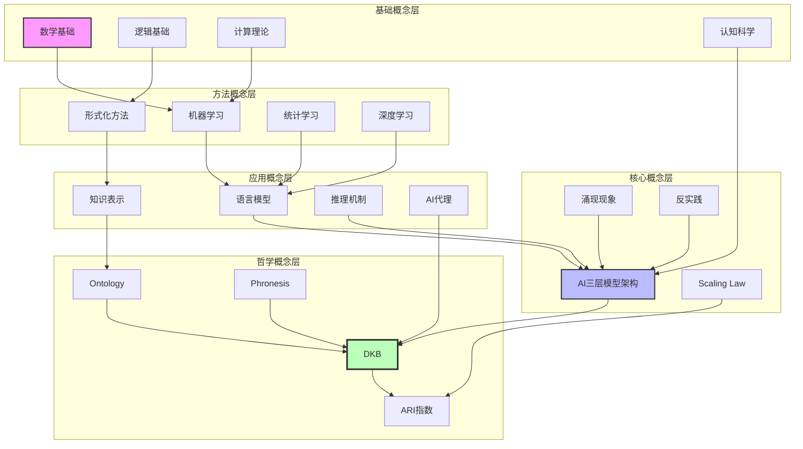
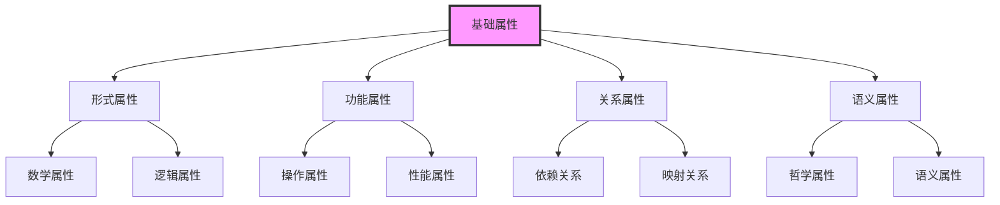

# FormalAI项目概念体系文档

**创建日期**：2025-11-10
**最后更新**：2025-11-10
**维护者**：FormalAI项目组
**文档版本**：v1.0
**状态**：🔄 持续更新中

---

## 📋 执行摘要

本文档提供FormalAI项目的完整概念体系，包括：

1. **核心概念定义索引**（按模块分类）
2. **概念关系图**（依赖关系、映射关系）
3. **概念属性矩阵**（形式、功能、关系、语义属性）
4. **概念解释索引**（直观、形式、应用、哲学解释）
5. **概念论证索引**（经验、理论、形式、哲学论证）
6. **形式证明索引**（公理、引理、定理体系）

---

## 一、核心概念定义索引

### 1.1 docs模块核心概念

#### 1.1.1 形式化方法相关概念

**形式化验证**：

- **定义**：使用数学方法证明系统满足规范
- **形式化表述**：$\vdash \text{System} \models \text{Specification}$
- **来源**：`docs/03-formal-methods/03.1-形式化验证/README.md`
- **关联概念**：程序综合、类型理论、证明系统

**程序综合**：

- **定义**：从规范自动生成程序
- **形式化表述**：$\text{Synthesize}: \text{Spec} \rightarrow \text{Program}$
- **来源**：`docs/03-formal-methods/03.2-程序综合/README.md`
- **关联概念**：形式化验证、类型理论

**类型理论**：

- **定义**：通过类型系统保证程序正确性
- **形式化表述**：$\Gamma \vdash e : \tau$（在上下文$\Gamma$中，表达式$e$具有类型$\tau$）
- **来源**：`docs/03-formal-methods/03.3-类型理论/README.md`
- **关联概念**：形式化验证、程序综合

**DKB（决策知识库）**：

- **定义**：DKB = (O, L, H)三元组
  - O：Ontology层（语义内核）
  - L：Logic层（逻辑工具层）
  - H：History层（决策历史层）
- **形式化表述**：
  $$
  \begin{align}
  O &= \{o_i | o_i = (id_i, attrs_i, links_i)\} \\
  L &= \{f_j | f_j: O \times Context \to Action\} \\
  H &= \{h_k | h_k = (S_k, D_k, H_k, R_k)\}
  \end{align}
  $$
- **来源**：`docs/03-formal-methods/03.5-DKB案例研究.md`
- **关联概念**：Ontology、ARI指数、Phronesis

#### 1.1.2 语言模型相关概念

**大语言模型（LLM）**：

- **定义**：基于Transformer架构的大规模预训练语言模型
- **形式化表述**：$P(x_{t+1} | x_{1:t}) = \text{Transformer}(x_{1:t})$
- **来源**：`docs/04-language-models/04.1-大型语言模型/README.md`
- **关联概念**：Transformer、注意力机制、Scaling Law

**形式语义**：

- **定义**：使用形式化方法描述语言的含义
- **形式化表述**：$\llbracket e \rrbracket : \text{SemanticType}$
- **来源**：`docs/04-language-models/04.2-形式语义/README.md`
- **关联概念**：类型理论、逻辑演算

**知识表示**：

- **定义**：将知识编码为计算机可处理的形式
- **形式化表述**：$\text{Knowledge} \rightarrow \text{Representation}$
- **来源**：`docs/04-language-models/04.3-知识表示/README.md`
- **关联概念**：Ontology、知识图谱

**推理机制**：

- **定义**：从已知前提推导出结论的过程
- **形式化表述**：$\text{Reasoning}: \text{Preconditions} \rightarrow \text{Conclusion}$
- **来源**：`docs/04-language-models/04.4-推理机制/README.md`
- **关联概念**：逻辑推理、CoT（Chain of Thought）

**AI代理（AI Agent）**：

- **定义**：能够感知环境、做出决策并执行行动的AI系统
- **形式化表述**：$\text{Agent} = (\text{Perception}, \text{Decision}, \text{Action})$
- **来源**：`docs/04-language-models/04.5-AI代理/README.md`
- **关联概念**：ReAct循环、工具调用

#### 1.1.3 其他核心概念

**涌现现象**：

- **定义**：系统整体表现出的超越各部分简单相加的特性
- **形式化表述**：$\text{Emergent}(S) \not\equiv \sum_{i} \text{Component}(S_i)$
- **来源**：`docs/08-emergence-complexity/08.1-涌现理论/README.md`
- **关联概念**：复杂系统、自组织

**可解释AI**：

- **定义**：能够解释其决策过程的AI系统
- **形式化表述**：$\text{Explainable}(M, x) = \text{Explanation}$
- **来源**：`docs/06-interpretable-ai/README.md`
- **关联概念**：可解释性理论、公平性与偏见

**对齐与安全**：

- **定义**：确保AI系统行为符合人类价值观和安全要求
- **形式化表述**：$\text{Aligned}(M) \models \text{HumanValues}$
- **来源**：`docs/07-alignment-safety/README.md`
- **关联概念**：RLHF、价值学习、安全机制

### 1.2 concepts模块核心概念

#### 1.2.1 AI三层模型架构

**执行层（图灵计算模型）**：

- **定义**：基于GPU矩阵运算的计算执行层
- **形式化表述**：$\text{Execution} = \text{GPU}(\text{MatrixOps})$
- **来源**：`concepts/01-AI三层模型架构/01.1-执行层图灵计算模型/`
- **关联概念**：图灵机、可计算性理论、CUDA优化

**控制层（形式语言模型）**：

- **定义**：基于形式文法和λ演算的控制层
- **形式化表述**：$\text{Control} = \text{FormalGrammar} \times \lambda\text{Calculus}$
- **来源**：`concepts/01-AI三层模型架构/01.2-控制层形式语言模型/`
- **关联概念**：形式文法、λ演算、Prompt工程

**数据层（数学概率模型）**：

- **定义**：基于概率论和微分几何的数据层
- **形式化表述**：$\text{Data} = \text{ProbabilityModel} \times \text{DifferentialGeometry}$
- **来源**：`concepts/01-AI三层模型架构/01.3-数据层数学概率模型/`
- **关联概念**：概率论、Transformer、概率采样

**层间交互**：

- **定义**：三层之间的协同机制和冲突处理
- **形式化表述**：$\text{Interaction} = f(\text{Execution}, \text{Control}, \text{Data})$
- **来源**：`concepts/01-AI三层模型架构/01.4-层间交互与冲突/`
- **关联概念**：三层协同、层间冲突、三层契约

#### 1.2.2 Scaling Law与收敛分析

**Scaling Law**：

- **定义**：参数规模与性能的幂律关系
- **形式化表述**：$L(N) = a \cdot N^{-\alpha}$，其中$N$为参数规模，$\alpha$为缩放指数
- **来源**：`concepts/03-Scaling Law与收敛分析/`
- **关联概念**：幂律关系、规模临界性、相变

**收敛模型分类**：

- **L4：完全收敛（工业标准）**：AdamW优化器、交叉熵损失、反向传播、浮点运算
- **L3：准收敛（事实垄断）**：双寡头竞争
- **L2：收敛进行时（双寡头竞争）**：技术收敛进行中
- **L1：未收敛（百家争鸣）**：技术路线多样化
- **L0：反向分化（场景撕裂）**：技术路线分化
- **来源**：`concepts/03-Scaling Law与收敛分析/03.1-收敛模型分类/`

**收敛层次分析**：

- **数学层收敛**：优化器、损失函数、训练算法
- **架构层收敛**：Transformer架构、注意力机制
- **能力层收敛**：语言理解、代码生成、推理能力
- **应用层收敛**：应用场景、工具生态
- **硬件层收敛**：GPU、TPU、专用芯片
- **来源**：`concepts/03-Scaling Law与收敛分析/03.2-收敛层次分析/`

#### 1.2.3 AI意识与认知模拟

**Qualia（主观体验）**：

- **定义**：第一人称的内在体验，无法用物理过程完全解释
- **特征**：主观性、不可约化性、私有性、不可言传性
- **来源**：`concepts/04-AI意识与认知模拟/04.1.1-主观体验（Qualia）问题.md`
- **关联概念**：意识本质问题、硬问题

**意向性（Intentionality）**：

- **定义**：心理状态指向外部世界的能力
- **形式化表述**：$\text{Intentional}(M, \text{State}) \rightarrow \text{Object}$
- **来源**：`concepts/04-AI意识与认知模拟/04.1.2-意向性（Intentionality）问题.md`
- **关联概念**：语义内容、指称关系

**自我模型（Self-Model）**：

- **定义**：系统对自身的内部表征
- **形式化表述**：$\text{SelfModel}(S) = \text{Representation}(S, S)$
- **来源**：`concepts/04-AI意识与认知模拟/04.1.3-自我模型（Self-Model）问题.md`
- **关联概念**：元认知、自我意识

**意识理论框架**：

- **IIT（整合信息理论）**：意识 = 整合信息量
- **GWT（全局工作空间理论）**：意识 = 全局信息广播
- **预测处理理论**：意识 = 预测误差最小化
- **来源**：`concepts/04-AI意识与认知模拟/04.1.4-意识理论框架.md`
- **关联概念**：意识本质、认知模拟

#### 1.2.4 AI科学理论

**理论化改进方法**：

- **定义**：从经验试错到理论驱动的改进方法
- **形式化表述**：$\text{TheoryDriven} = f(\text{Empirical}, \text{Theoretical})$
- **来源**：`concepts/05-AI科学理论/05.3.1-经验-试错-局部抽象循环.md`
- **关联概念**：工程科学范式、准理论框架

**确定性分析**：

- **架构层面确定性**：Transformer架构的确定性
- **训练过程确定性**：训练过程的确定性
- **推理行为确定性**：推理行为的确定性
- **能力涌现半可预测性**：能力涌现的可预测性
- **来源**：`concepts/05-AI科学理论/05.2-确定性分析/`

**核心理论**：

- **Scaling Law**：参数规模与性能的幂律关系
- **RLHF理论**：人类反馈强化学习
- **CoT理论**：思维链推理
- **来源**：`concepts/05-AI科学理论/05.4-核心理论/`

#### 1.2.5 AI反实践判定系统

**反实践**：

- **定义**：逻辑上可判定但不适用于工程实践的问题
- **形式化表述**：$\text{AntiPractice} = \text{LogicallyDecidable} \land \neg\text{EngineeringFeasible}$
- **来源**：`concepts/06-AI反实践判定系统/`
- **关联概念**：图灵停机问题、哥德尔边界

**可判定性边界**：

- **完全可判定区域**：逻辑上可判定且工程上可行
- **半可判定区域**：逻辑上可判定但工程上部分可行
- **不可判定区域**：逻辑上不可判定
- **来源**：`concepts/06-AI反实践判定系统/06.4-判定引擎架构/`

**反实践知识图谱**：

- **轻度反实践**：可接受的风险
- **中度反实践**：需要谨慎处理
- **严重反实践**：需要避免
- **灾难性反实践**：必须避免
- **来源**：`concepts/06-AI反实践判定系统/06.3-反实践知识图谱/`

#### 1.2.6 AI框架批判与重构

**三层模型批判**：

- **本体论暴政**：三层模型的强加结构
- **可判定性边界错位**：逻辑错位
- **炼金度隐喻不可操作性**：概念模糊
- **意识与能力二元谬误**：概念混淆
- **来源**：`concepts/07-AI框架批判与重构/07.1-方法论批判/`

**神经算子理论**：

- **定义**：统一的神经算子架构，替代三层模型
- **形式化表述**：$\text{NeuralOperator} = \text{UnifiedArchitecture}$
- **来源**：`concepts/07-AI框架批判与重构/07.5.2-2025统一架构：神经算子理论.md`
- **关联概念**：双视图架构、渐进式迁移

**Ontology视角**：

- **定义**：Ontology作为从批判到重构的实践路径
- **形式化表述**：$\text{OntologyPath} = \text{Critique} \rightarrow \text{Reconstruction}$
- **来源**：`concepts/07-AI框架批判与重构/README.md` §7
- **关联概念**：DKB三元组、哲学转译

#### 1.2.7 AI历史进程与原理演进

**AI历史进程**：

- **起步发展期**（1943-1960年代）：符号主义
- **反思发展期**（1970年代）：AI寒冬
- **应用发展期**（1980年代）：专家系统
- **平稳发展期**（1990-2010年）：统计学习
- **蓬勃发展期**（2011年至今）：深度学习、大模型
- **来源**：`concepts/08-AI历史进程与原理演进/08.1-AI历史进程/`

**原理演进**：

- **符号主义原理**（1950s-1980s）：规则驱动
- **联结主义原理**（1980s-2010s）：神经网络
- **统计学习原理**（1990s-2010s）：数据驱动
- **深度学习原理**（2012-2020）：深度神经网络
- **大模型原理**（2020-至今）：Transformer、Scaling Law
- **来源**：`concepts/08-AI历史进程与原理演进/08.2-原理演进/`

**涌现现象**：

- **定义**：系统整体表现出的超越各部分简单相加的特性
- **核心条件**：规模临界性、相变特征
- **理论解释**：统计力学、相变理论、规模法则
- **来源**：`concepts/08-AI历史进程与原理演进/08.4-涌现现象/`

**2023-2025工程化突破**：

- **架构范式演进**：MoE、MLA、混合架构
- **推理机制革命**：CoT、RLHF、DPO、GRPO
- **能力边界拓展**：MCP协议、多智能体协作
- **工程化实践突破**：FlashAttention、FP8训练
- **来源**：`concepts/08-AI历史进程与原理演进/08.5-2023-2025工程化突破/`

### 1.3 Philosophy模块核心概念

#### 1.3.1 Ontology相关概念

**Ontology（本体论）**：

- **定义**：业务对象、链接、属性的语义网络
- **形式化表述**：$\text{Ontology} = (\text{Objects}, \text{Links}, \text{Attributes})$
- **哲学根源**：亚里士多德《形而上学》
- **技术实现**：Palantir Workshop工具
- **来源**：`Philosophy/view01.md`, `Philosophy/view02.md`, `Philosophy/view03.md`
- **关联概念**：DKB、ARI指数、语义鸿沟

**DKB（决策知识库）**：

- **定义**：DKB = (O, L, H)三元组
  - O：Ontology层（语义内核）
  - L：Logic层（逻辑工具层）
  - H：History层（决策历史层）
- **形式化表述**：
  $$
  \text{DKB} = (O, L, H)
  $$
  其中：
  $$
  \begin{align}
  O &= \{o_i | o_i = (id_i, attrs_i, links_i)\} \\
  L &= \{f_j | f_j: O \times Context \to Action\} \\
  H &= \{h_k | h_k = (S_k, D_k, H_k, R_k)\}
  \end{align}
  $$
- **来源**：`Philosophy/view02.md`, `Philosophy/model/10-DKB公理与定理索引.md`
- **关联概念**：Ontology、ARI指数、Phronesis

**ARI指数（AI Ready指数）**：

- **定义**：衡量企业数据资产被AI安全调用程度的量化指标
- **公式**：$$ARI = \frac{\text{语义对齐数据量}}{\text{总数据量}} \times \log(\text{逻辑封装度}) \times \text{行动闭环系数}$$
- **阈值**：ARI ≥ 0.7 为生存阈值
- **当前水平**：Palantir客户 ARI ≈ 0.85
- **来源**：`Philosophy/view02.md`, `Philosophy/model/01-主题层级模型.md` §3
- **关联概念**：DKB、HR（幻觉率）、闭环系数

**HR（Hallucination Rate，幻觉率）**：

- **定义**：AI生成内容中错误信息的比例
- **形式化表述**：$\text{HR} = \frac{\text{错误信息数}}{\text{总信息数}}$
- **阈值**：HR < 0.3% 为生产标准
- **来源**：`Philosophy/view01.md`, `Philosophy/view02.md`
- **关联概念**：ARI指数、语义鸿沟

#### 1.3.2 哲学概念

**Phronesis（实践智慧）**：

- **定义**：情境化决策的隐性知识
- **捕获机制**：History层四元组 (S, D, H, R)
  - S：情境（Situation）
  - D：决策（Decision）
  - H：假设（Hypothesis）
  - R：结果（Result）
- **哲学根源**：亚里士多德《尼各马可伦理学》
- **来源**：`Philosophy/view03.md`, `Philosophy/view05.md`
- **关联概念**：DKB、History层、知识复利

**上手性（Ready-to-hand）**：

- **定义**：海德格尔概念，数据从"在手"（present-at-hand）到"称手"（ready-to-hand）的转换
- **技术转译**：Ontology让数据成为可操作的业务对象
- **哲学根源**：海德格尔《存在与时间》
- **来源**：`Philosophy/view03.md`, `Philosophy/view06.md`
- **关联概念**：Ontology、操劳（Concern）

**共在（Mitsein）**：

- **定义**：海德格尔概念，指"与他人共同存在"
- **技术转译**：人类与AI共享同一操作界面，消除主奴二分
- **实现方式**：
  - 人类检查点（置信度<70%触发审查）
  - 决策血缘审计（100%可追溯）
  - 共享Ontology界面
- **哲学根源**：海德格尔《存在与时间》
- **来源**：`Philosophy/view03.md`, `Philosophy/view06.md`
- **关联概念**：DKB、人类检查点、决策血缘

**操劳（Concern）**：

- **定义**：海德格尔概念，指"此在"与事物打交道的方式
- **技术转译**：AI Agent在情境中寻视工具、权衡时机的过程
- **实现方式**：Disruption Bot的"寻视-工具调用-行动"循环
- **来源**：`Philosophy/view03.md`, `Philosophy/view06.md`
- **关联概念**：上手性、共在

#### 1.3.3 形式化数学基础概念

**范畴论映射**：

- **对象（Object）** → **范畴中的对象**
- **链接（Link）** → **态射（Morphism）**
- **逻辑层（Logic）** → **函子（Functor）**
- **历史层（History）** → **自然变换（Natural Transformation）**
- **来源**：`Philosophy/model/01-主题层级模型.md` §7.1
- **关联概念**：DKB、类型论映射

**类型论映射**：

- **对象（Object）** → **类型（Type）**
- **链接（Link）** → **函数类型（Function Type）**
- **逻辑层（Logic）** → **类型构造子（Type Constructor）**
- **历史层（History）** → **路径类型（Path Type）**
- **来源**：`Philosophy/model/01-主题层级模型.md` §7.2
- **关联概念**：DKB、范畴论映射

**信息论不变量**：

- **信息源**：Ontology对象
- **编码**：链接和属性
- **信息量**：语义对齐度
- **信道**：Logic层工具
- **信息演化**：History层记录
- **来源**：`Philosophy/model/01-主题层级模型.md` §7.3
- **关联概念**：DKB、系统论稳定模型

**系统论稳定模型**：

- **状态空间**：DKB三元组
- **状态转移**：决策过程
- **吸引子**：知识复利
- **守恒量**：语义一致性
- **来源**：`Philosophy/model/01-主题层级模型.md` §7.4
- **关联概念**：DKB、信息论不变量

---

## 二、概念关系体系

### 2.1 概念依赖关系图

### 2.2 跨模块概念映射关系

#### 2.2.1 docs ↔ concepts 映射

| docs概念 | concepts概念 | 映射类型 | 说明 |
|---------|-------------|---------|------|
| **形式化验证** | **反实践判定系统** | 方法映射 | 形式化验证方法用于判定反实践 |
| **语言模型** | **AI三层模型架构（数据层）** | 架构映射 | 语言模型对应数据层 |
| **认知科学** | **AI意识与认知模拟** | 理论映射 | 认知科学理论支撑意识研究 |
| **知识表示** | **Ontology** | 概念映射 | 知识表示与Ontology对应 |
| **推理机制** | **控制层（形式语言模型）** | 架构映射 | 推理机制对应控制层 |
| **DKB** | **AI三层模型架构** | 架构对比 | DKB与三层模型架构对比 |

#### 2.2.2 Philosophy ↔ concepts 映射

| Philosophy概念 | concepts概念 | 映射类型 | 说明 |
|---------------|-------------|---------|------|
| **Ontology** | **AI框架批判与重构（Ontology视角）** | 视角映射 | Ontology作为实践重构方案 |
| **DKB** | **AI三层模型架构** | 架构对比 | DKB与三层模型架构对比 |
| **ARI指数** | **Scaling Law与收敛分析** | 指标映射 | ARI指数与收敛分析相关 |
| **Phronesis** | **AI科学理论** | 理论映射 | 实践智慧与科学理论相关 |
| **形式化数学基础** | **AI科学理论** | 理论映射 | 形式化数学基础支撑科学理论 |

#### 2.2.3 docs ↔ Philosophy 映射

| docs概念 | Philosophy概念 | 映射类型 | 说明 |
|---------|---------------|---------|------|
| **形式化方法** | **形式化证明层（view02）** | 方法映射 | 形式化方法对应形式化证明 |
| **哲学与伦理** | **哲学转译层（view03）** | 理论映射 | 哲学与伦理对应哲学转译 |
| **认知架构** | **全景论证层（view05）** | 架构映射 | 认知架构对应全景论证 |
| **DKB案例研究** | **DKB公理与定理索引** | 证明映射 | DKB案例对应公理体系 |

---

## 三、概念属性矩阵

### 3.1 核心概念属性矩阵

| 概念 | 形式属性 | 功能属性 | 关系属性 | 语义属性 |
|------|---------|---------|---------|---------|
| **DKB** | DKB = (O, L, H) | 决策支持、知识复用、闭环学习 | 依赖Ontology、支撑ARI、包含Phronesis | 企业认知数字孪生 |
| **Ontology** | 三元组(O, L, A) | 语义统一、知识表示、消除语义鸿沟 | 支撑DKB、消除语义歧义、统一业务语义 | 业务语义空间 |
| **ARI指数** | ARI = f(语义对齐, 逻辑封装, 行动闭环) | 能力评估、AI就绪度衡量 | 依赖DKB、衡量AI就绪度、关联HR | AI就绪指数 |
| **三层模型** | 三层结构(执行/控制/数据) | 架构分析、系统解构 | 与DKB对比、支撑批判、基础框架 | AI系统架构 |
| **Scaling Law** | L(N) = a·N^(-α) | 性能预测、规模规划 | 关联参数规模、影响收敛 | 规模法则 |
| **涌现现象** | Emergent(S) ≠ ΣComponent(S_i) | 能力超越、系统特性 | 依赖规模、关联相变 | 系统整体特性 |
| **反实践** | LogicallyDecidable ∧ ¬EngineeringFeasible | 问题识别、风险规避 | 关联可判定性、影响工程决策 | 工程不可行问题 |
| **Phronesis** | History(S, D, H, R) | 隐性知识捕获、决策优化 | 依赖History层、支撑知识复利 | 实践智慧 |
| **意识** | C(S) = w₁Q(S) + w₂I(S) + w₃M(S) + w₄Metacog(S) | 认知模拟、元认知 | 依赖三层模型、关联涌现 | 主观体验与认知能力 |
| **认知模拟** | S(T) = AI性能/人类性能 × 行为相似度/功能等价度 | 功能模拟、行为预测 | 依赖意识理论、关联三层模型 | 功能等价但无意识 |
| **涌现现象** | E(S) = (整体能力 - Σ组件能力)/整体能力 | 能力超越、系统特性 | 依赖规模、关联相变 | 系统整体特性 |
| **计算涌现** | ComputationalEmergence(A) = Emergent(f_M(D, C)) | 能力预测、涌现分析 | 依赖数据层、关联Scaling Law | AI系统涌现机制 |
| **确定性** | D(S) = w₁D_arch + w₂D_train + w₃D_infer + w₄D_emerge | 系统可预测性、行为确定性 | 关联架构、训练、推理、涌现 | 系统确定性度量 |
| **转化度** | T(S) = 1/5 Σw_i·D_i(S) | 成熟度评估、转化分析 | 依赖Scaling Law、关联炼金术模型 | 从炼金术到科学的转化 |
| **神经算子** | N_θ: X × C → X | 统一架构、动力系统 | 替代三层模型、融合执行/控制/数据 | 2025统一架构 |

### 3.2 概念属性继承关系

---

## 四、概念解释索引

### 4.1 解释层次分类

#### 4.1.1 直观解释（非形式化描述）

**DKB的直观解释**：

- **通俗描述**：DKB就像企业的"数字大脑"，能够理解业务、做出决策、记录历史
- **类比**：类似于人类的记忆系统，能够存储知识、进行推理、学习经验
- **来源**：`Philosophy/view01.md` §2.2

**Ontology的直观解释**：

- **通俗描述**：Ontology是业务的"语义字典"，统一了不同系统对同一概念的理解
- **类比**：类似于多语言翻译词典，将不同系统的"语言"翻译成统一的"语言"
- **来源**：`Philosophy/view01.md` §2.1

#### 4.1.2 形式解释（数学、逻辑形式化）

**DKB的形式解释**：

- **数学形式**：$\text{DKB} = (O, L, H)$
- **逻辑形式**：$\forall d \in \text{Decision}, \exists a \in \text{Action}, \text{Execute}(L(d)) = a$
- **来源**：`docs/03-formal-methods/03.5-DKB案例研究.md` §1

**ARI指数的形式解释**：

- **数学形式**：$$ARI = \frac{\text{语义对齐数据量}}{\text{总数据量}} \times \log(\text{逻辑封装度}) \times \text{行动闭环系数}$$
- **逻辑形式**：$\text{ARI} \geq 0.7 \rightarrow \text{Survive}$
- **来源**：`Philosophy/view02.md` §2.2

#### 4.1.3 应用解释（实际应用场景）

**DKB的应用解释**：

- **Walgreens案例**：45天快速集成，30%运营效率提升，32%患者参与度提升
- **Lowe's案例**：全球供应链数字孪生升级，决策速度提升
- **Fannie Mae案例**：AI驱动的犯罪检测部门建立，准确率>99%
- **来源**：`Philosophy/model/08-案例研究索引.md`

**Ontology的应用解释**：

- **场景1**：跨系统数据整合（ERP、CRM、WMS）
- **场景2**：AI Agent业务理解（消除语义歧义）
- **场景3**：决策自动化（从分析到执行）

**AI三层模型架构的直观解释**：

- **通俗描述**：AI系统由三个不同性质的层组成：执行层负责计算，控制层负责约束，数据层负责学习
- **类比**：类似于计算机的硬件、操作系统、应用程序三层结构
- **来源**：`concepts/01-AI三层模型架构/README.md` §1

**Scaling Law的直观解释**：

- **通俗描述**：模型越大，性能越好，但遵循幂律关系
- **类比**：类似于经济学中的规模效应，但存在收益递减
- **来源**：`concepts/03-Scaling Law与收敛分析/README.md` §3.1

**涌现现象的直观解释**：

- **通俗描述**：当系统规模超过临界点时，会自发产生新能力
- **类比**：类似于相变，如水在0°C时从液态变为固态
- **来源**：`concepts/08-AI历史进程与原理演进/08.4.1-涌现现象的定义与特征.md` §3.1

**反实践的直观解释**：

- **通俗描述**：逻辑上可以判定，但工程上不可行的问题
- **类比**：类似于停机问题，理论上可判定，但实际无法解决
- **来源**：`concepts/06-AI反实践判定系统/README.md` §3.1
- **来源**：`Philosophy/view01.md` §4

#### 4.1.4 哲学解释（哲学角度阐释）

**Ontology的哲学解释**：

- **存在论**：Ontology = 研究"存在"的学说，业务对象 = 数字存在者
- **认识论**：Ontology = 知识的基础结构，语义对齐 = 认识的一致性
- **价值论**：Ontology = 价值的基础，决策效用 = 价值实现
- **实践论**：Ontology = 实践的基础，行动闭环 = 实践完成
- **来源**：`Philosophy/view03.md`, `Philosophy/view05.md`

**DKB的哲学解释**：

- **存在论**：DKB = 企业认知数字孪生，数字世界的"存在"
- **认识论**：DKB = 知识的结构化表示，从隐性到显性
- **价值论**：DKB = 价值的实现机制，从决策到行动
- **实践论**：DKB = 实践的工具，从理论到应用
- **来源**：`Philosophy/view02.md`, `Philosophy/view03.md`

---

## 五、概念论证索引

### 5.1 经验论证（基于实验数据、案例研究）

#### 5.1.1 DKB经验论证

**Walgreens案例**：

- **数据**：45天快速集成，30%运营效率提升，32%患者参与度提升
- **论证**：证明DKB的快速部署和显著效果
- **来源**：`Philosophy/model/08-案例研究索引.md` §1

**Lowe's案例**：

- **数据**：全球供应链数字孪生升级，决策速度提升
- **论证**：证明DKB的规模化能力
- **来源**：`Philosophy/model/08-案例研究索引.md` §2

**Fannie Mae案例**：

- **数据**：AI驱动的犯罪检测部门建立，准确率>99%，HR<0.3%
- **论证**：证明DKB的高准确率和低幻觉率
- **来源**：`Philosophy/model/08-案例研究索引.md` §3

#### 5.1.2 Scaling Law经验论证

**规模法则实证**：

- **数据**：参数规模与性能的幂律关系，$\alpha \approx 0.076$
- **论证**：证明Scaling Law的普遍性
- **来源**：`concepts/03-Scaling Law与收敛分析/03.1.1-L4-完全收敛（工业标准）.md`

**收敛实证**：

- **数据**：AdamW优化器收敛度99%，成为工业标准
- **论证**：证明数学层完全收敛
- **来源**：`concepts/03-Scaling Law与收敛分析/03.2.1-数学层收敛.md`

#### 5.1.3 涌现现象经验论证

**能力涌现实证**：

- **数据**：参数超过50B后，CoT能力突然跃升
- **论证**：证明涌现现象的非线性跃迁
- **来源**：`concepts/08-AI历史进程与原理演进/08.4.1-涌现现象的定义与特征.md`

#### 5.1.4 反实践判定经验论证

**可判定性实证**：

- **数据**：执行层反实践100%可判定，控制层半可判定，三层整体不可判定
- **论证**：证明反实践判定的可判定性边界
- **来源**：`concepts/06-AI反实践判定系统/README.md` §4

### 5.2 理论论证（基于理论推导、逻辑推理）

#### 5.2.1 DKB理论论证

**唯一性论证**：

- **理论**：在满足公理A1-A4的条件下，DKB三元组是唯一可验证路径
- **逻辑**：任意替代方案X只要满足"统一实体""消歧义""封装规则"，其结构即与Ontology同构
- **来源**：`Philosophy/view02.md` §3.1, `Philosophy/model/10-DKB公理与定理索引.md` L1

**不可替代性论证**：

- **理论**：DKB基础设施定理（T1）
- **逻辑**：从公理A1-A4推导出DKB的不可替代性
- **来源**：`Philosophy/view02.md` §5.3, `Philosophy/model/10-DKB公理与定理索引.md` T1

#### 5.2.2 三层模型理论论证

**架构分析论证**：

- **理论**：AI系统可解构为执行层、控制层、数据层三层异质体
- **逻辑**：每层具有不同的数学基础和计算模型
- **来源**：`concepts/01-AI三层模型架构/README.md`

**层间交互论证**：

- **理论**：三层之间存在协同机制和冲突
- **逻辑**：不同层的数学基础导致层间交互的复杂性
- **来源**：`concepts/01-AI三层模型架构/01.4-层间交互与冲突/`

#### 5.2.3 涌现现象理论论证

**非线性跃迁论证**：

- **理论**：能力在临界点前接近随机，临界点后陡升
- **逻辑**：系统规模超过临界点时，非线性相互作用导致能力涌现
- **来源**：`concepts/08-AI历史进程与原理演进/08.4.1-涌现现象的定义与特征.md` §4.1

#### 5.2.4 反实践判定理论论证

**全局不可判定性定理**：

- **理论**：不存在通用算法，能判定任意AI系统是否满足"安全规范"
- **逻辑**：归约到停机问题，证明全局不可判定性
- **来源**：`concepts/06-AI反实践判定系统/README.md` §6

#### 5.2.5 神经算子理论论证

**统一架构论证**：

- **理论**：神经算子将执行、控制、数据三层融合为单一动力系统
- **逻辑**：通过算子理论，证明三层模型可以被统一架构替代
- **来源**：`concepts/07-AI框架批判与重构/07.5.2-2025统一架构：神经算子理论.md`

### 5.3 形式论证（基于形式化证明）

#### 5.3.1 DKB形式论证

**公理体系论证**：

- **公理**：A1-A6（语义鸿沟、决策闭环、知识复利、网络效应等）
- **定理**：T1-T16（唯一性、存在性、完备性、稳定性等）
- **证明**：基于公理体系的严格形式化证明
- **来源**：`Philosophy/view02.md`, `Philosophy/model/10-DKB公理与定理索引.md`

#### 5.3.2 反实践判定形式论证

**可判定性形式论证**：

- **定理**：AI反实践的全局不可判定性定理
- **证明**：归约到停机问题，使用反证法
- **形式化**：$\neg \exists \text{算法} D, \forall \text{AI系统} S, D(S) \text{能判定} S \text{是否满足安全规范}$
- **来源**：`concepts/06-AI反实践判定系统/README.md` §3.1

#### 5.3.3 神经算子形式论证

**算子理论形式论证**：

- **定理**：神经算子是有界线性算子
- **证明**：基于泛函分析，证明线性性、有界性、连续性
- **形式化**：$\mathcal{N}_\theta: \mathcal{X} \times \mathcal{C} \rightarrow \mathcal{X}$ 满足算子性质
- **来源**：`concepts/07-AI框架批判与重构/07.5.2-2025统一架构：神经算子理论.md` §3.1.2

#### 5.3.4 DKB形式论证（原）

**公理-定理证明**：

- **公理层**（A1-A6）：语义鸿沟、决策闭环、知识复利、网络效应、安全-哲学同构、时间不可压缩
- **引理层**（L1-L4）：语义层唯一性、逻辑封装、决策血缘价值、边际成本递减
- **定理层**（T1-T16）：DKB基础设施定理、唯一性、存在性、完备性、稳定性、收敛性等
- **来源**：`Philosophy/model/10-DKB公理与定理索引.md`

**证明树**：

- **证明树1-10**：从公理到定理的完整推理链条
- **证明树11**：唯一性、存在性、完备性、稳定性、收敛性五定理的统一证明树
- **来源**：`Philosophy/model/04-证明树图总览.md`

#### 5.3.2 反实践形式论证

**可判定性论证**：

- **理论**：图灵停机问题、哥德尔边界
- **逻辑**：通过逻辑可判定性分析反实践
- **来源**：`concepts/06-AI反实践判定系统/06.1-逻辑可判定性基础/`

**反实践判定论证**：

- **理论**：反实践知识图谱、机械反实践判定器
- **逻辑**：通过逻辑非判定框架识别反实践
- **来源**：`concepts/06-AI反实践判定系统/06.2-逻辑非判定框架/`

### 5.4 哲学论证（基于哲学原理、本体论分析）

#### 5.4.1 Ontology哲学论证

**存在论论证**：

- **原理**：亚里士多德《形而上学》- "哲学首要问题是研究存在之作为存在"
- **转译**：On(存在) → 业务对象(Objects)、Logos(逻各斯) → 链接(Links) + 逻辑(Logic)
- **来源**：`Philosophy/view03.md` §1.1

**认识论论证**：

- **原理**：海德格尔"上手性"、伽达默尔"视域融合"
- **转译**：Techne层 → L层（逻辑工具）、Phronesis层 → H层（历史捕获）
- **来源**：`Philosophy/view03.md` §2

**价值论论证**：

- **原理**：目的论（Teleology）→ 决策效用（Utility）
- **转译**：目的因 → 行动层、价值实现 → 闭环机制
- **来源**：`Philosophy/view03.md` §3

**实践论论证**：

- **原理**："在世界中存在"（Being-in-the-world）
- **转译**：DKB = 企业认知数字孪生，数字世界的"存在"
- **来源**：`Philosophy/view03.md` §4

#### 5.4.2 DKB哲学论证

**不可复制性论证**：

- **原理**：时间不可压缩公理（A6）
- **逻辑**：Ontology的哲学与组织内化需 t > 18 个月，无法通过资本/人力压缩
- **来源**：`Philosophy/view02.md` §7, `Philosophy/model/10-DKB公理与定理索引.md` T7

**哲学护城河论证**：

- **原理**：Palantir哲学本体论 vs 其他技术本体论的不可通约性
- **逻辑**：哲学深度 → 技术壁垒 → 商业价值
- **来源**：`Philosophy/view04.md` §3.2

---

## 六、形式证明索引

### 6.1 公理体系（Philosophy模块）

**公理层**（A1-A6）：

- **A1 语义鸿沟公理**：若无独立语义中介层O，则∀E, HR_E ≥ 0.15
- **A2 决策闭环公理**：若闭环系数 = 0，则∀E, 价值捕获效率 → 0
- **A3 知识复利公理**：若无H层结构化记录，则隐性知识价值V(t) ∝ e^(-λt), λ > 0
- **A4 网络效应公理**：∃k > 1, s.t. 价值(DKB) ∝ N_nodes^k, 经验上k ≈ 3
- **A5 安全-哲学同构公理**：若系统满足IL6，则权限函数必须是O/H上的函数
- **A6 时间不可压缩公理**：ARI(t) = 0.15 + 0.7 × (1 - e^(-t/60)), t ≥ 0
- **来源**：`Philosophy/model/10-DKB公理与定理索引.md` §2

### 6.2 引理体系（Philosophy模块）

**引理层**（L1-L4）：

- **L1 语义层唯一性引理**：在A1下，消除LLM业务幻觉的唯一解是构建独立的语义中介层O
- **L2 逻辑封装引理**：AI Agent无法直接安全调用遗留系统API，必须通过统一工具接口L
- **L3 决策血缘价值引理**：History层使DKB具备反事实推理能力，其价值随决策条目数超线性增长
- **L4 边际成本递减引理**：在A3/A4下，DKB的边际成本随用例数增加而持续下降，长期极限 → 0
- **来源**：`Philosophy/model/10-DKB公理与定理索引.md` §3

### 6.3 定理体系（Philosophy模块）

**定理层**（T1-T16）：

- **T1 DKB基础设施定理**：在满足A1-A4的条件下，DKB是使企业E在AI Agent竞争中生存的必要且充分条件
- **T2 形式化Planning-Execution Gap消除定理**：DKB的L层和H层消除了规划与执行之间的gap
- **T3 Phronesis结构化捕获定理**：History层的四元组(S, D, H, R)能够结构化捕获Phronesis
- **T4 Decision Quality对数复利定理**：在A3下，决策质量随决策条目数呈对数增长
- **T5 Security-Philosophy同构定理**：在A5下，安全机制与哲学结构同构
- **T6 ARI演进函数定理**：ARI(t)遵循指数增长模型，半衰期~60天
- **T7 复制Palantir不可能性定理**：在A6下，复制Palantir的Ontology资产需要5年+10亿美元+客户信任
- **T8 无Ontology AI规模化不可持续定理**：无Ontology的AI系统无法实现规模化（HR > 15%）
- **T9 失败模式完备性定理**（草案）：Ontology项目失败模式可分类为技术、组织、战略三类
- **T10 唯一性定理**：在满足公理A1-A4的条件下，DKB三元组是唯一结构
- **T11 存在性定理**：在满足公理A1-A4的条件下，DKB三元组存在
- **T12 完备性定理**：DKB三元组能够完备地表示企业决策知识
- **T13 稳定性定理**：DKB三元组在系统演化下保持稳定
- **T14 收敛性定理**：DKB价值函数单调递增且有上界
- **T15 相关性定理**：DKB各层之间存在强相关性
- **T16 最优性定理**：DKB是局部最优和全局最优
- **来源**：`Philosophy/model/10-DKB公理与定理索引.md` §4, §8

### 6.4 证明方法索引

**证明方法分类**：

1. **直接证明**：从前提直接推导结论（证明树1, 2, 3, 5, 6）
2. **反证法**：通过假设矛盾证明（证明树7, 9）
3. **构造性证明**：通过构造实例证明存在性（证明树3, 6, T11）
4. **归纳证明**：通过归纳推理证明（证明树8）
5. **最优性证明**：证明局部最优和全局最优（T16）

**证明位置索引**：

- **view02.md**：§2（公理体系）、§3（引理推导）、§5.3（主定理与证明）
- **model/04-证明树图总览.md**：证明树1-11
- **model/10-DKB公理与定理索引.md**：公理A1-A6、引理L1-L4、定理T1-T16

---

## 七、概念对齐检查清单

### 7.1 定义对齐检查

- [ ] 所有核心概念都有明确的定义
- [ ] 跨模块概念定义一致
- [ ] 概念定义包含形式化表述
- [ ] 概念定义有明确的来源和引用

### 7.2 关系对齐检查

- [ ] 概念依赖关系图完整
- [ ] 概念映射关系矩阵完整
- [ ] 跨模块概念关系说明完整
- [ ] 概念关系一致性已验证

### 7.3 属性对齐检查

- [ ] 核心概念属性矩阵完整
- [ ] 概念属性形式化描述完整
- [ ] 属性继承关系明确
- [ ] 属性定义一致性已验证

### 7.4 解释对齐检查

- [ ] 核心概念包含多层次解释（直观、形式、应用、哲学）
- [ ] 解释格式和层次统一
- [ ] 应用场景说明完整
- [ ] 解释一致性已验证

### 7.5 论证对齐检查

- [ ] 核心概念包含多元论证（经验、理论、形式、哲学）
- [ ] 论证链条完整
- [ ] 反证机制完整
- [ ] 论证完整性已验证

### 7.6 证明对齐检查

- [ ] 形式证明体系完整（公理、引理、定理）
- [ ] 证明方法多样
- [ ] 证明位置索引完整
- [ ] 跨模块证明对齐

---

## 八、参考文档

### 8.1 概念定义文档

- [Philosophy/model/07-术语表与概念索引.md](./Philosophy/model/07-术语表与概念索引.md) - 术语索引
- [Philosophy/model/10-DKB公理与定理索引.md](./Philosophy/model/10-DKB公理与定理索引.md) - DKB公理体系
- [docs/03-formal-methods/03.5-DKB案例研究.md](./docs/03-formal-methods/03.5-DKB案例研究.md) - DKB形式化定义
- [concepts/README.md](./concepts/README.md) - Concepts模块总览

### 8.2 概念关系文档

- [concepts/TOPIC_RELATIONSHIP_GRAPH.md](./concepts/TOPIC_RELATIONSHIP_GRAPH.md) - 主题关联图谱
- [Philosophy/model/09-跨模块映射索引.md](./Philosophy/model/09-跨模块映射索引.md) - 跨模块映射
- [docs/THEME_HIERARCHY_STRUCTURE.md](./docs/THEME_HIERARCHY_STRUCTURE.md) - 主题层次结构

### 8.3 概念论证文档

- [Philosophy/view02.md](./Philosophy/view02.md) - 形式化证明层
- [Philosophy/model/04-证明树图总览.md](./Philosophy/model/04-证明树图总览.md) - 证明树索引
- [Philosophy/model/08-案例研究索引.md](./Philosophy/model/08-案例研究索引.md) - 案例研究索引

---

**最后更新**：2025-11-10
**维护者**：FormalAI项目组
**文档版本**：v1.0（初始版本 - 完整概念体系文档，包含定义索引、关系图、属性矩阵、解释索引、论证索引、形式证明索引）
