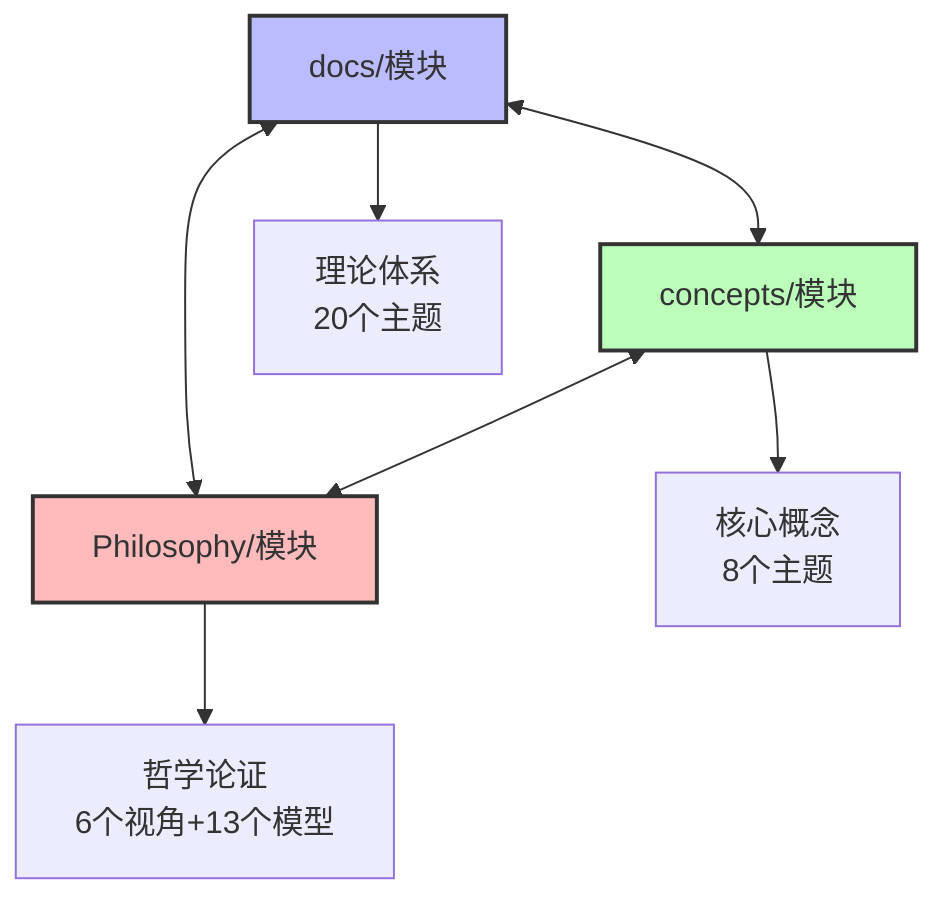
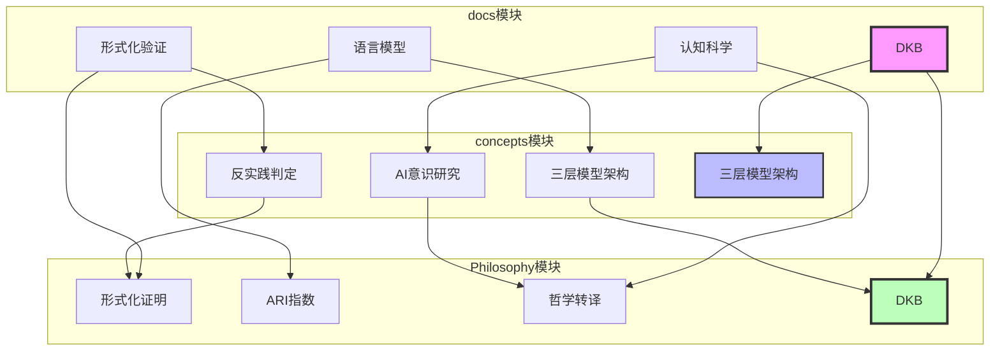
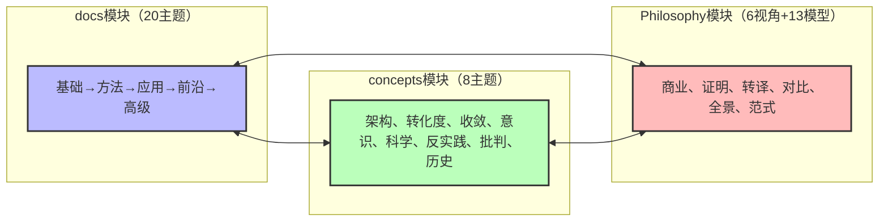
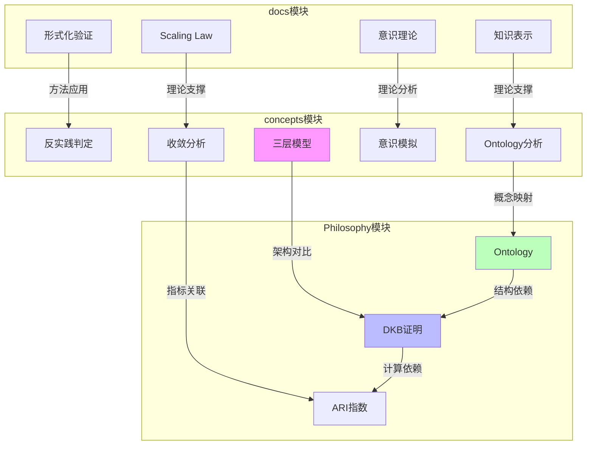

# FormalAI项目跨模块映射文档

**创建日期**：2025-11-10
**最后更新**：2025-11-10
**维护者**：FormalAI项目组
**文档版本**：v1.0
**状态**：🔄 持续更新中

---

## 📋 执行摘要

本文档提供FormalAI项目跨模块映射关系，包括：

1. **docs ↔ concepts 映射**
2. **Philosophy ↔ concepts 映射**
3. **docs ↔ Philosophy 映射**
4. **概念映射关系图**
5. **主题映射关系图**

---

## 一、跨模块映射总览

### 1.1 三大模块映射关系

### 1.2 映射类型分类

| 映射类型 | 说明 | 示例 |
|---------|------|------|
| **直接引用** | 一个模块直接引用另一个模块的内容 | docs/03.5-DKB案例研究 ↔ Philosophy/view02 |
| **等价主题** | 不同模块中讨论相同主题 | docs/09-philosophy-ethics ↔ Philosophy/view03 |
| **概念映射** | 不同模块中同一概念的不同表述 | docs/DKB ↔ Philosophy/DKB ↔ concepts/三层模型 |
| **理论支撑** | 一个模块为另一个模块提供理论支撑 | docs/01-foundations → concepts/01-三层模型架构 |

---

## 二、docs ↔ concepts 映射

### 2.1 主题映射关系

| docs主题 | concepts主题 | 映射类型 | 说明 |
|---------|-------------|---------|------|
| **01-foundations** | **01-AI三层模型架构** | 理论支撑 | 基础理论支撑架构分析 |
| **02-machine-learning** | **01-AI三层模型架构（数据层）** | 架构映射 | 机器学习对应数据层 |
| **02-machine-learning** | **02-AI炼金术转化度模型** | 理论映射 | 机器学习理论支撑转化度评估 |
| **02-machine-learning** | **03-Scaling Law与收敛分析** | 理论映射 | 机器学习理论支撑收敛分析 |
| **03-formal-methods** | **06-AI反实践判定系统** | 方法映射 | 形式化方法用于反实践判定 |
| **03-formal-methods** | **05-AI科学理论** | 理论映射 | 形式化方法支撑科学理论 |
| **04-language-models** | **01-AI三层模型架构（数据层）** | 架构映射 | 语言模型对应数据层 |
| **04-language-models** | **03-Scaling Law与收敛分析** | 理论映射 | 语言模型支撑收敛分析 |
| **09-philosophy-ethics** | **04-AI意识与认知模拟** | 理论映射 | 哲学与伦理支撑意识研究 |
| **16-agi-theory** | **04-AI意识与认知模拟** | 理论映射 | AGI理论支撑意识研究 |
| **18-cognitive-architecture** | **04-AI意识与认知模拟** | 理论映射 | 认知架构支撑意识研究 |

### 2.2 概念映射关系

| docs概念 | concepts概念 | 映射关系 |
|---------|-------------|---------|
| **形式化验证** | **反实践判定** | 方法应用 |
| **程序综合** | **理论化改进方法** | 方法应用 |
| **类型理论** | **形式语言模型（控制层）** | 理论支撑 |
| **DKB** | **AI三层模型架构** | 架构对比 |
| **语言模型** | **数据层（数学概率模型）** | 架构对应 |
| **知识表示** | **Ontology** | 概念对应 |
| **推理机制** | **控制层（形式语言模型）** | 架构对应 |
| **认知科学** | **AI意识与认知模拟** | 理论支撑 |

---

## 三、Philosophy ↔ concepts 映射

### 3.1 主题映射关系

| Philosophy视角 | concepts主题 | 映射类型 | 说明 |
|---------------|-------------|---------|------|
| **view01（商业论证）** | **03-Scaling Law与收敛分析** | 指标映射 | ARI指数与收敛分析 |
| **view02（形式化证明）** | **05-AI科学理论** | 理论映射 | 形式化证明支撑科学理论 |
| **view02（形式化证明）** | **06-AI反实践判定系统** | 方法映射 | 形式化方法用于反实践判定 |
| **view03（哲学转译）** | **04-AI意识与认知模拟** | 理论映射 | 哲学转译支撑意识研究 |
| **view04（行业对比）** | **07-AI框架批判与重构** | 视角映射 | 行业对比支撑框架批判 |
| **view06（范式革命）** | **07-AI框架批判与重构** | 视角映射 | 范式革命支撑框架批判 |
| **view06（范式革命）** | **01-AI三层模型架构** | 架构对比 | 范式革命批判三层模型 |

### 3.2 概念映射关系

| Philosophy概念 | concepts概念 | 映射关系 |
|---------------|-------------|---------|
| **Ontology** | **AI框架批判与重构（Ontology视角）** | 视角应用 |
| **DKB** | **AI三层模型架构** | 架构对比 |
| **ARI指数** | **Scaling Law与收敛分析** | 指标关联 |
| **Phronesis** | **AI科学理论** | 理论关联 |
| **形式化数学基础** | **AI科学理论** | 理论支撑 |

---

## 四、docs ↔ Philosophy 映射

### 4.1 主题映射关系

| docs主题 | Philosophy视角 | 映射类型 | 说明 |
|---------|---------------|---------|------|
| **03-formal-methods** | **view02（形式化证明层）** | 方法映射 | 形式化方法对应形式化证明 |
| **03.5-DKB案例研究** | **view02（形式化证明层）** | 直接引用 | DKB案例研究引用view02 |
| **03.5-DKB案例研究** | **model/10-DKB公理与定理索引** | 直接引用 | DKB案例研究引用公理体系 |
| **04-language-models** | **view01（商业论证层）** | 指标映射 | ARI/HR评估指标 |
| **09-philosophy-ethics** | **view03（哲学转译层）** | 理论映射 | 哲学与伦理对应哲学转译 |
| **09-philosophy-ethics** | **view05（全景论证层）** | 理论映射 | 哲学与伦理对应全景论证 |
| **16-agi-theory** | **view05（全景论证层）** | 理论映射 | AGI理论对应全景论证 |
| **18-cognitive-architecture** | **view05（全景论证层）** | 架构映射 | 认知架构对应全景论证 |
| **20-ai-philosophy-advanced** | **view03（哲学转译层）** | 理论映射 | 高级AI哲学对应哲学转译 |

### 4.2 概念映射关系

| docs概念 | Philosophy概念 | 映射关系 |
|---------|---------------|---------|
| **形式化验证** | **形式化证明（view02）** | 方法对应 |
| **程序综合** | **形式化证明（view02）** | 方法对应 |
| **DKB** | **DKB（view02）** | 直接对应 |
| **知识表示** | **Ontology** | 概念对应 |
| **认知架构** | **全景论证（view05）** | 架构对应 |

---

## 五、概念映射关系图

### 5.1 核心概念映射图

### 5.2 主题映射关系图

---

## 六、跨模块导航路径

### 6.1 从docs到concepts

**路径1：形式化方法 → 反实践判定**

1. `docs/03-formal-methods/03.1-形式化验证/` → 形式化验证方法
2. `concepts/06-AI反实践判定系统/` → 反实践判定应用

**路径2：语言模型 → 三层模型架构**

1. `docs/04-language-models/04.1-大型语言模型/` → 语言模型理论
2. `concepts/01-AI三层模型架构/01.3-数据层/` → 数据层架构

### 6.2 从Philosophy到concepts

**路径1：Ontology视角 → 框架批判**

1. `Philosophy/view01.md` → Ontology商业论证
2. `concepts/07-AI框架批判与重构/README.md` §7 → Ontology视角

**路径2：DKB形式化 → 三层模型对比**

1. `Philosophy/view02.md` → DKB形式化证明
2. `concepts/01-AI三层模型架构/` → 三层模型架构对比

### 6.3 从docs到Philosophy

**路径1：形式化方法 → 形式化证明**

1. `docs/03-formal-methods/03.1-形式化验证/` → 形式化验证方法
2. `Philosophy/view02.md` → 形式化证明层

**路径2：哲学与伦理 → 哲学转译**

1. `docs/09-philosophy-ethics/09.1-AI哲学/` → AI哲学理论
2. `Philosophy/view03.md` → 哲学转译层

---

## 七、跨模块概念关系详细说明

### 7.1 核心概念跨模块关系

#### 7.1.1 DKB vs AI三层模型架构

**关系类型**：架构对比与映射

**详细说明**：

- **DKB架构**：四层结构（Ontology、Logic、History、应用层）
- **AI三层模型**：三层结构（执行层、控制层、数据层）
- **映射关系**：
  - DKB的Ontology层 ↔ AI三层模型的控制层（语义统一）
  - DKB的Logic层 ↔ AI三层模型的控制层（逻辑工具）
  - DKB的History层 ↔ 无直接对应（DKB特有）
  - DKB的应用层 ↔ AI三层模型的执行层（计算执行）

**依赖关系**：

- DKB依赖Ontology作为语义内核（🔴 强依赖）
- AI三层模型依赖执行层提供计算能力（🔴 强依赖）
- 两者在语义统一和逻辑工具方面有相似性（🟡 弱关联）

#### 7.1.2 Ontology概念跨模块关系

**关系类型**：概念映射与理论支撑

**详细说明**：

- **docs模块**：Ontology作为知识表示的形式化方法
- **concepts模块**：Ontology作为业务语义网络，用于AI框架分析
- **Philosophy模块**：Ontology作为业务语义空间，消除语义鸿沟

**依赖关系**：

- Philosophy的Ontology → DKB的Ontology层（🔴 强依赖）
- docs的知识表示 → concepts的Ontology分析（🟡 弱依赖）
- concepts的Ontology → Philosophy的Ontology（🟠 中依赖）

#### 7.1.3 Scaling Law跨模块关系

**关系类型**：理论支撑与应用

**详细说明**：

- **docs模块**：Scaling Law作为模型性能预测理论
- **concepts模块**：Scaling Law作为收敛分析理论
- **Philosophy模块**：Scaling Law与ARI指数关联

**依赖关系**：

- concepts的Scaling Law → docs的模型性能预测（🟡 弱依赖）
- concepts的Scaling Law → Philosophy的ARI指数（🟡 弱依赖）
- concepts的收敛分析 → concepts的Scaling Law（🟠 中依赖）

#### 7.1.4 形式化方法跨模块关系

**关系类型**：方法应用与理论支撑

**详细说明**：

- **docs模块**：形式化验证、程序综合、类型理论
- **concepts模块**：反实践判定、理论化改进方法
- **Philosophy模块**：DKB形式化证明、公理体系

**依赖关系**：

- docs的形式化验证 → concepts的反实践判定（🟠 中依赖）
- docs的程序综合 → concepts的理论化改进方法（🟡 弱依赖）
- docs的类型理论 → concepts的控制层形式语言（🟡 弱依赖）
- Philosophy的形式化证明 → docs的形式化验证（🟡 弱依赖）

#### 7.1.5 意识理论跨模块关系

**关系类型**：理论分析与应用

**详细说明**：

- **docs模块**：意识理论综述、认知架构设计
- **concepts模块**：意识问题分析、非意识证据、认知模拟
- **Philosophy模块**：无直接对应（但哲学转译层涉及意识问题）

**依赖关系**：

- concepts的意识理论 → docs的认知架构设计（🟡 弱依赖）
- concepts的认知模拟 → docs的意识理论（🟡 弱依赖）
- Philosophy的哲学转译 → concepts的意识理论（🟢 关联）

### 7.2 概念关系强度分析

#### 7.2.1 强依赖关系（🔴）

| 概念A | 概念B | **模块** | **说明** |
|------|------|-----------|---------|
| **数据层** | **执行层** | concepts | 数据层依赖执行层计算 |
| **DKB** | **Ontology** | Philosophy → concepts | DKB依赖Ontology作为语义内核 |
| **ARI指数** | **DKB** | Philosophy | ARI指数依赖DKB的完整性 |
| **涌现现象** | **数据层** | concepts | 涌现现象依赖数据层概率模型 |

#### 7.2.2 中依赖关系（🟠）

| 概念A | 概念B | **模块** | **说明** |
|------|------|-----------|---------|
| **控制层** | **数据层** | concepts | 控制层约束数据层输出 |
| **反实践判定** | **三层模型** | concepts | 反实践判定应用于三层模型分析 |
| **形式化验证** | **反实践判定** | docs → concepts | 形式化方法用于反实践判定 |

#### 7.2.3 弱依赖关系（🟡）

| 概念A | 概念B | **模块** | **说明** |
|------|------|-----------|---------|
| **Scaling Law** | **三层模型** | concepts | Scaling Law解释三层模型性能 |
| **转化度模型** | **Scaling Law** | concepts | 转化度模型评估Scaling Law成熟度 |
| **意识理论** | **三层模型** | concepts | 意识理论分析三层模型认知能力 |

### 7.3 跨模块概念关系图

---

## 八、参考文档

### 7.1 跨模块映射文档

- [Philosophy/model/09-跨模块映射索引.md](./Philosophy/model/09-跨模块映射索引.md) - Philosophy ↔ docs/concepts 映射

### 7.2 项目计划文档

- [PROJECT_COMPREHENSIVE_PLAN.md](./PROJECT_COMPREHENSIVE_PLAN.md) - 项目全面计划
- [PROJECT_CONCEPT_SYSTEM.md](./PROJECT_CONCEPT_SYSTEM.md) - 概念体系文档
- [PROJECT_THINKING_REPRESENTATIONS.md](./PROJECT_THINKING_REPRESENTATIONS.md) - 思维表征索引

---

**最后更新**：2025-11-10
**维护者**：FormalAI项目组
**文档版本**：v1.0（初始版本 - 跨模块映射文档，包含docs↔concepts、Philosophy↔concepts、docs↔Philosophy映射）
