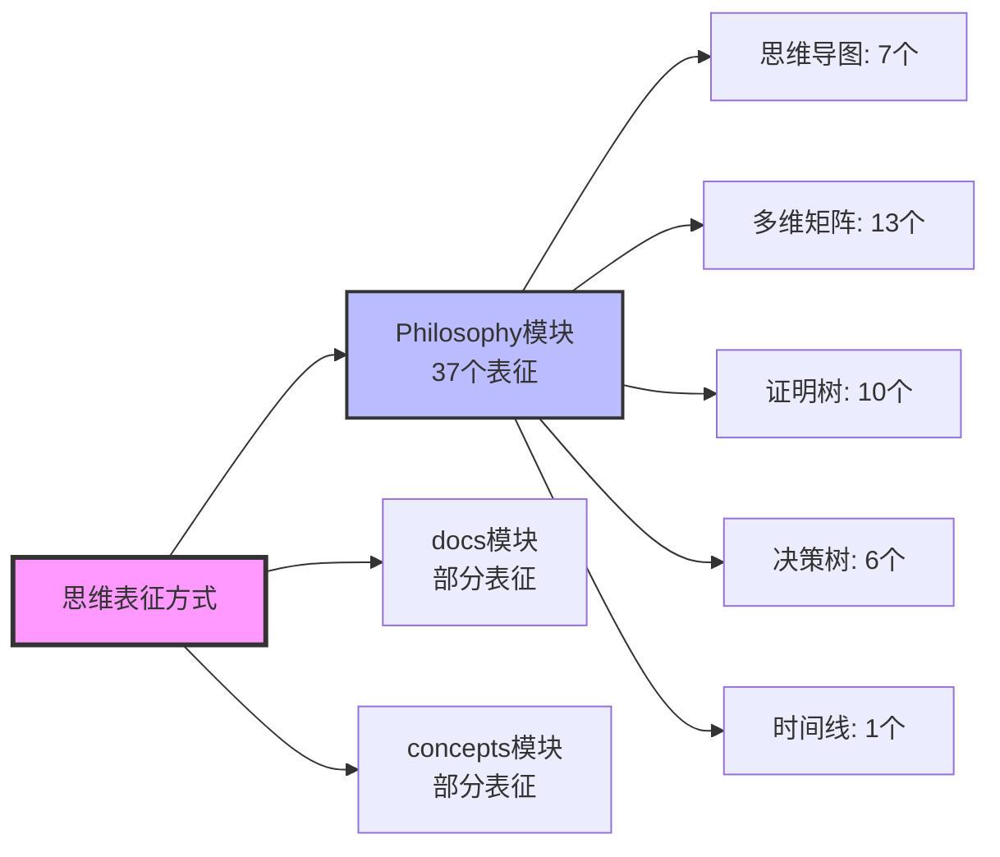

# FormalAI项目思维表征方式索引

**创建日期**：2025-11-10  
**最后更新**：2025-11-10  
**维护者**：FormalAI项目组  
**文档版本**：v1.0  
**状态**：🔄 持续更新中

---

## 📋 执行摘要

本文档提供FormalAI项目所有思维表征方式的统一索引，包括：
1. **思维导图索引**（按模块分类）
2. **多维矩阵索引**（按对比维度分类）
3. **证明树索引**（按证明类型分类）
4. **决策树索引**（按决策场景分类）
5. **时间线索引**（按时间维度分类）
6. **层级模型索引**（按层级结构分类）

---

## 一、思维表征方式总览

### 1.1 思维表征方式分类

| 表征方式 | 数量 | 主要位置 | 用途 | 特点 |
|---------|------|---------|------|------|
| **思维导图** | 7个 | Philosophy/model/02-思维导图总览.md | 可视化概念结构、关系网络 | 直观、全面 |
| **多维矩阵** | 13个 | Philosophy/model/03-概念多维对比矩阵.md | 对比分析、多维度评估 | 系统、量化 |
| **证明树图** | 10个 | Philosophy/model/04-证明树图总览.md | 展示推理链条、证明过程 | 逻辑、严密 |
| **决策树图** | 6个 | Philosophy/model/05-决策树图总览.md | 决策路径分析、选择流程 | 实用、清晰 |
| **时间线图** | 1个 | Philosophy/model/06-时间线演进模型.md | 历史演进、发展趋势 | 时序、演进 |
| **层级模型** | 1个 | Philosophy/model/01-主题层级模型.md | 层级结构、依赖关系 | 结构、系统 |

### 1.2 思维表征方式分布

---

## 二、思维导图索引

### 2.1 Philosophy模块思维导图（7个）

#### 2.1.1 核心思维导图列表

| 编号 | 名称 | 来源 | 用途 | 位置 |
|------|------|------|------|------|
| **思维导图1** | DKB架构全景 | view01 §2.2, view02 §6.1 | 可视化DKB四层结构 | `Philosophy/model/02-思维导图总览.md` §3 |
| **思维导图2** | 哲学谱系转译 | view03 §1.1, view05 §1.1 | 可视化哲学转译过程 | `Philosophy/model/02-思维导图总览.md` §4 |
| **思维导图3** | IT技术哲学四重结构 | view06 §1.1 | 可视化IT技术哲学结构 | `Philosophy/model/02-思维导图总览.md` §5 |
| **思维导图4** | 实践智慧(Phronesis)捕获机制 | view03 §2.1, view05 §3.1 | 可视化Phronesis捕获 | `Philosophy/model/02-思维导图总览.md` §6 |
| **思维导图5** | IT行业Ontology决策模型全景 | view04 §2.2 | 可视化决策模型 | `Philosophy/model/02-思维导图总览.md` §7 |
| **思维导图6** | IT行业哲学化人才需求 | view06 §4.5 | 可视化人才需求 | `Philosophy/model/02-思维导图总览.md` §8 |
| **思维导图7** | 信息-表征-意义-转换的统一视角系统图 | model/01 §7, model/03 矩阵11 | 可视化统一视角 | `Philosophy/model/02-思维导图总览.md` §9 |
| **思维导图8** | 2025年最新技术发展全景 | model/06, model/08 | 可视化2025年最新发展 | `Philosophy/model/02-思维导图总览.md` §10 |

#### 2.1.2 思维导图使用指南

**按主题查找**：
- **DKB架构** → 思维导图1
- **哲学转译** → 思维导图2
- **IT技术哲学** → 思维导图3
- **实践智慧** → 思维导图4
- **决策模型** → 思维导图5
- **人才需求** → 思维导图6
- **统一视角** → 思维导图7
- **最新发展** → 思维导图8

**按应用场景**：
- **企业战略规划** → 思维导图1, 5
- **技术架构设计** → 思维导图1, 3
- **哲学研究** → 思维导图2, 7
- **人才规划** → 思维导图6
- **趋势分析** → 思维导图8

### 2.2 docs模块思维导图（规划中）

**当前状态**：部分文档包含图表，但未系统化

**扩展计划**：
1. **01-foundations** → 基础理论思维导图
2. **02-machine-learning** → 机器学习理论思维导图
3. **03-formal-methods** → 形式化方法思维导图
4. **04-language-models** → 语言模型架构思维导图
5. **09-philosophy-ethics** → 哲学与伦理思维导图
6. **16-agi-theory** → AGI理论思维导图
7. **18-cognitive-architecture** → 认知架构思维导图

### 2.3 concepts模块思维导图（规划中）

**当前状态**：部分文档包含图表，但未系统化

**扩展计划**：
1. **01-AI三层模型架构** → 三层架构思维导图
2. **03-Scaling Law与收敛分析** → 收敛模型思维导图
3. **04-AI意识与认知模拟** → 意识理论思维导图
4. **07-AI框架批判与重构** → 批判重构思维导图

---

## 三、多维矩阵索引

### 3.1 Philosophy模块多维矩阵（13个）

#### 3.1.1 核心矩阵列表

| 编号 | 名称 | 来源 | 用途 | 位置 |
|------|------|------|------|------|
| **矩阵1** | Ontology能力维度对比 | view01 §2.1 | 对比Ontology能力维度 | `Philosophy/model/03-概念多维对比矩阵.md` §3 |
| **矩阵2** | 四种AI架构的完备性对比 | view02 §6.2 | 对比AI架构完备性 | `Philosophy/model/03-概念多维对比矩阵.md` §4 |
| **矩阵3** | 有无Ontology的AI应用差异 | view01 §4.1 | 对比应用差异 | `Philosophy/model/03-概念多维对比矩阵.md` §5 |
| **矩阵4** | 全球智能决策平台竞争态势 | view01 §6.1 | 对比竞争态势 | `Philosophy/model/03-概念多维对比矩阵.md` §6 |
| **矩阵5** | 五大哲学模型对比 | view05 §2.1 | 对比哲学模型 | `Philosophy/model/03-概念多维对比矩阵.md` §7 |
| **矩阵6** | 五种IT哲学范式对比 | view06 §2.1 | 对比IT哲学范式 | `Philosophy/model/03-概念多维对比矩阵.md` §8 |
| **矩阵7** | 企业规模与战略选择 | view01 §9.2 | 对比战略选择 | `Philosophy/model/03-概念多维对比矩阵.md` §9 |
| **矩阵8** | A/B测试对比（Ontology vs RAG） | view02 §8.1 | 对比A/B测试结果 | `Philosophy/model/03-概念多维对比矩阵.md` §10 |
| **矩阵9** | 风险与反证矩阵 | view01 §7.1 | 对比风险与反证 | `Philosophy/model/03-概念多维对比矩阵.md` §11 |
| **矩阵10** | 后现代/建构主义哲学视角对比 | view05 §3.2 | 对比后现代视角 | `Philosophy/model/03-概念多维对比矩阵.md` §12 |
| **矩阵11** | 范畴论/类型论等哲科模型与DKB Ontology对比 | model/01 §7 | 对比形式化数学基础 | `Philosophy/model/03-概念多维对比矩阵.md` §13 |
| **矩阵12** | 五阶段成熟度对比 | view01 §5.1 | 对比成熟度阶段 | `Philosophy/model/03-概念多维对比矩阵.md` §14 |
| **矩阵13** | 成熟度模型对比 | EKG/MM标准 | 对比成熟度模型 | `Philosophy/model/03-概念多维对比矩阵.md` §15 |

#### 3.1.2 矩阵分类

**技术能力对比**（矩阵1-3）：
- 矩阵1：Ontology能力维度对比
- 矩阵2：四种AI架构的完备性对比
- 矩阵3：有无Ontology的AI应用差异

**竞争与战略对比**（矩阵4, 7, 12, 13）：
- 矩阵4：全球智能决策平台竞争态势
- 矩阵7：企业规模与战略选择
- 矩阵12：五阶段成熟度对比
- 矩阵13：成熟度模型对比

**哲学理论对比**（矩阵5, 6, 10, 11）：
- 矩阵5：五大哲学模型对比
- 矩阵6：五种IT哲学范式对比
- 矩阵10：后现代/建构主义哲学视角对比
- 矩阵11：范畴论/类型论等哲科模型对比

**实证验证**（矩阵8）：
- 矩阵8：A/B测试对比（Ontology vs RAG）

**风险分析**（矩阵9）：
- 矩阵9：风险与反证矩阵

### 3.2 docs模块多维矩阵（规划中）

**扩展计划**：
1. **机器学习方法对比矩阵**：统计学习 vs 深度学习 vs 强化学习
2. **形式化方法对比矩阵**：形式化验证 vs 程序综合 vs 类型理论
3. **AI理论层次对比矩阵**：基础理论 vs 方法理论 vs 应用理论

### 3.3 concepts模块多维矩阵（规划中）

**扩展计划**：
1. **三层模型 vs DKB对比矩阵**：架构对比
2. **收敛模型对比矩阵**：L0-L4收敛模型对比
3. **意识理论对比矩阵**：IIT vs GWT vs 预测处理理论

---

## 四、证明树索引

### 4.1 Philosophy模块证明树（10个）

#### 4.1.1 核心证明树列表

| 编号 | 名称 | 来源 | 对应定理 | 位置 |
|------|------|------|---------|------|
| **证明树1** | 竞争本质的转移 | view01 §1.1 | - | `Philosophy/model/04-证明树图总览.md` §3 |
| **证明树2** | Ontology构建"不可复制"的竞争优势 | view01 §3.2 | - | `Philosophy/model/04-证明树图总览.md` §4 |
| **证明树3** | Ontology价值的形式化推导 | view02 §5.3 | T1 | `Philosophy/model/04-证明树图总览.md` §5 |
| **证明树4** | Palantir哲学模型的不可通约性 | view04 §3.2 | T7 | `Philosophy/model/04-证明树图总览.md` §6 |
| **证明树5** | Ontology投资的非线性回报 | view01 §5.2 | T4 | `Philosophy/model/04-证明树图总览.md` §7 |
| **证明树6** | IT技术哲学从公理到应用 | view06 §3.1 | - | `Philosophy/model/04-证明树图总览.md` §8 |
| **证明树7** | 反证法 - 假设竞争对手可复制Palantir | view02 §7.1 | T7 | `Philosophy/model/04-证明树图总览.md` §9 |
| **证明树8** | Ontology项目失败模式总树 | view01 §7.1 | T9 | `Philosophy/model/04-证明树图总览.md` §10 |
| **证明树9** | 对立假设的集中反证 | view02 §7.2 | T8 | `Philosophy/model/04-证明树图总览.md` §11 |
| **证明树10** | 不变量与演化边界的数学结构 | model/01 §7 | A1, A3, L1, T1 | `Philosophy/model/04-证明树图总览.md` §12 |
| **证明树11** | 唯一性、存在性、完备性、稳定性、收敛性五定理的统一证明树 | view02 §5.3 | T10-T14 | `Philosophy/model/04-证明树图总览.md` §13 |

#### 4.1.2 证明树分类

**按证明类型**：
- **竞争分析** → 证明树1, 2
- **形式化证明** → 证明树3, 6, 10, 11
- **哲学论证** → 证明树4, 7
- **数学结构** → 证明树10, 11
- **商业价值** → 证明树5
- **风险/反证** → 证明树8, 9

**按应用场景**：
- **战略决策** → 证明树1, 2, 5
- **技术架构** → 证明树3, 6
- **学术研究** → 证明树4, 7, 10, 11
- **风险评估** → 证明树8, 9

**按证明方法**：
- **直接证明** → 证明树1, 2, 3, 5, 6
- **反证法** → 证明树7, 9
- **构造性证明** → 证明树3, 6
- **统一证明** → 证明树11

### 4.2 docs模块证明树（规划中）

**扩展计划**：
1. **形式化验证模块** → 形式化验证证明树
2. **程序综合模块** → 程序综合证明树
3. **类型理论模块** → 类型理论证明树

### 4.3 concepts模块证明树（规划中）

**扩展计划**：
1. **AI科学理论** → 理论化改进方法证明树
2. **AI反实践判定系统** → 可判定性证明树
3. **Scaling Law与收敛分析** → 收敛性证明树

---

## 五、决策树索引

### 5.1 Philosophy模块决策树（6个）

#### 5.1.1 核心决策树列表

| 编号 | 名称 | 来源 | 用途 | 位置 |
|------|------|------|------|------|
| **决策树1** | 企业选择Ontology与否的战略后果 | view01 §3.1 | 战略选择 | `Philosophy/model/05-决策树图总览.md` §3 |
| **决策树2** | 企业如何选择Ontology路径 | view04 §2.2 | 技术路径选择 | `Philosophy/model/05-决策树图总览.md` §4 |
| **决策树3** | 企业哲学立场的战略选择 | view05 §3.1 | 哲学立场选择 | `Philosophy/model/05-决策树图总览.md` §5 |
| **决策树4** | Ontology投资失败模式分析 | view01 §7.1 | 风险规避 | `Philosophy/model/05-决策树图总览.md` §6 |
| **决策树5** | Ontology成熟度五阶段路径 | view01 §5.1 | 实施路径 | `Philosophy/model/05-决策树图总览.md` §7 |
| **决策树6** | Ontology的"赢者通吃"机制 | view01 §6.2 | 竞争分析 | `Philosophy/model/05-决策树图总览.md` §8 |

#### 5.1.2 决策树分类

**按决策类型**：
- **战略选择** → 决策树1, 2, 3
- **风险规避** → 决策树4
- **实施路径** → 决策树5
- **竞争分析** → 决策树6

**按企业角色**：
- **CEO/战略层** → 决策树1, 3, 6
- **CTO/技术层** → 决策树2, 5
- **项目经理** → 决策树4, 5

**按决策流程**：
1. **识别当前状态** → 决策树5（确定成熟度阶段）
2. **评估选择路径** → 决策树1, 2, 3（分析不同方案）
3. **规避失败风险** → 决策树4（识别常见陷阱）
4. **理解竞争格局** → 决策树6（分析市场动态）

### 5.2 docs模块决策树（规划中）

**扩展计划**：
1. **架构选择决策树**：选择AI架构的决策流程
2. **方法选择决策树**：选择机器学习方法的决策流程
3. **理论选择决策树**：选择理论框架的决策流程

### 5.3 concepts模块决策树（规划中）

**扩展计划**：
1. **架构选择决策树**：三层模型 vs 神经算子理论
2. **方法论选择决策树**：经验试错 vs 理论驱动
3. **收敛模型选择决策树**：L0-L4收敛模型选择

---

## 六、时间线索引

### 6.1 Philosophy模块时间线（1个）

**时间线演进模型**：
- **内容**：哲学与技术演进时间线
- **分段**：
  - 第一段：哲学史演进（公元前6世纪 - 20世纪）
  - 第二段：计算机科学演进（1950s - 2000s）
  - 第三段：Palantir演进（2003 - 2025）
  - 第四段：未来演进预测（2025 - 2030）
- **位置**：`Philosophy/model/06-时间线演进模型.md`

### 6.2 docs模块时间线（规划中）

**扩展计划**：
1. **AI理论发展时间线**：从基础理论到高级理论的发展
2. **技术演进时间线**：从符号主义到深度学习的演进
3. **应用发展时间线**：从简单应用到复杂应用的发展

### 6.3 concepts模块时间线（规划中）

**扩展计划**：
1. **AI历史进程时间线**：AI发展的历史进程
2. **原理演进时间线**：AI原理的演进过程
3. **工程化突破时间线**：2023-2025年工程化突破

---

## 七、层级模型索引

### 7.1 Philosophy模块层级模型（1个）

**主题层级模型**：
- **内容**：七层主题结构模型
- **层级**：
  - 第一层：哲学基础层（存在论、认识论、价值论、实践论）
  - 第二层：技术架构层（DKB三元组、能力维度）
  - 第三层：评估指标层（ARI指数、幻觉率）
  - 第四层：实施路径层（五阶段成熟度、时间-价值函数）
  - 第五层：竞争格局层（技术流派对比、市场集中度）
  - 第六层：形式化证明层（公理体系、定理体系）
  - 第七层：形式化数学基础层（范畴论/类型论/信息论/系统论映射）
- **位置**：`Philosophy/model/01-主题层级模型.md`

### 7.2 docs模块层级模型（已有）

**主题层次结构**：
- **内容**：5层语义结构
- **层级**：
  - 第1层：基础语义层（00-01）
  - 第2层：方法语义层（02-03）
  - 第3层：应用语义层（04-09）
  - 第4层：前沿语义层（10-15）
  - 第5层：高级语义层（16-20）
- **位置**：`docs/THEME_HIERARCHY_STRUCTURE.md`

### 7.3 concepts模块层级模型（规划中）

**扩展计划**：
1. **概念层级模型**：8个核心概念主题的层级关系
2. **主题依赖层级**：主题之间的依赖关系层级

---

## 八、思维表征方式使用规范

### 8.1 思维导图使用规范

**格式要求**：
- 使用Mermaid mindmap语法
- 根节点使用`root((...))`
- 子节点使用缩进表示层级
- 关键概念使用`**...**`标记

**内容要求**：
- 包含核心概念和关系
- 突出关键差异化点
- 标注来源和关联文档

### 8.2 多维矩阵使用规范

**格式要求**：
- 使用Markdown表格格式
- 表头清晰标注对比维度
- 使用符号标记（✅、⚠️、❌、⭐等）

**内容要求**：
- 对比维度明确
- 数据准确、来源可追溯
- 包含关键洞察和发现

### 8.3 证明树使用规范

**格式要求**：
- 使用Mermaid graph语法
- 使用subgraph组织证明结构
- 使用样式突出关键节点

**内容要求**：
- 证明逻辑清晰
- 标注对应公理/引理/定理
- 包含证明方法和验证步骤

### 8.4 决策树使用规范

**格式要求**：
- 使用Mermaid graph语法
- 使用条件节点（`{...}`）表示判断
- 使用样式标记最优路径

**内容要求**：
- 决策逻辑清晰
- 包含关键数据和证据
- 标注来源和关联文档

---

## 九、思维表征方式扩展计划

### 9.1 短期扩展（1-2周）

1. **为docs模块关键主题创建思维导图**（7个）
2. **为concepts模块关键主题创建对比矩阵**（3个）
3. **统一思维表征格式和规范**

### 9.2 中期扩展（1-2月）

1. **为所有关键主题创建思维导图**
2. **创建完整的对比矩阵体系**
3. **补充证明树和决策树**
4. **建立思维表征方式使用规范**

### 9.3 长期扩展（3-6月）

1. **为所有主题创建思维表征方式**
2. **建立跨模块思维表征方式统一索引**
3. **创建思维表征方式自动生成工具**

---

## 十、参考文档

### 10.1 思维表征方式文档

- [Philosophy/model/02-思维导图总览.md](./Philosophy/model/02-思维导图总览.md) - 思维导图索引
- [Philosophy/model/03-概念多维对比矩阵.md](./Philosophy/model/03-概念多维对比矩阵.md) - 多维矩阵索引
- [Philosophy/model/04-证明树图总览.md](./Philosophy/model/04-证明树图总览.md) - 证明树索引
- [Philosophy/model/05-决策树图总览.md](./Philosophy/model/05-决策树图总览.md) - 决策树索引
- [Philosophy/model/06-时间线演进模型.md](./Philosophy/model/06-时间线演进模型.md) - 时间线索引
- [Philosophy/model/01-主题层级模型.md](./Philosophy/model/01-主题层级模型.md) - 层级模型索引

### 10.2 项目计划文档

- [PROJECT_COMPREHENSIVE_PLAN.md](./PROJECT_COMPREHENSIVE_PLAN.md) - 项目全面计划
- [PROJECT_CONCEPT_SYSTEM.md](./PROJECT_CONCEPT_SYSTEM.md) - 概念体系文档

---

**最后更新**：2025-11-10  
**维护者**：FormalAI项目组  
**文档版本**：v1.0（初始版本 - 完整思维表征方式索引，包含思维导图、多维矩阵、证明树、决策树、时间线、层级模型索引）
