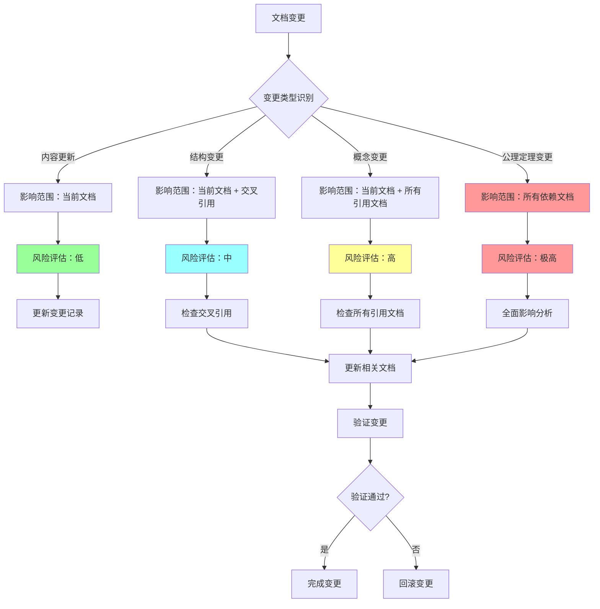

# Philosophy模块变更影响分析机制

**创建日期**：2025-01-XX
**版本**：v1.0.0
**状态**：已完成

---

## 📊 概述

本文档定义了Philosophy模块的变更影响分析机制，用于追踪文档变更、分析变更影响范围、评估变更风险，确保文档维护的质量和一致性。

---

## 一、变更追踪机制

### 1.1 变更类型分类

| 变更类型 | 说明 | 影响范围 | 风险等级 |
|---------|------|----------|----------|
| **内容更新** | 更新文档内容，不改变结构 | 当前文档 | 低 |
| **结构变更** | 修改文档结构（章节、目录） | 当前文档 + 交叉引用 | 中 |
| **概念变更** | 修改核心概念定义 | 当前文档 + 所有引用文档 | 高 |
| **公理/定理变更** | 修改公理或定理 | 所有依赖文档 | 极高 |
| **跨模块整合** | 添加跨模块引用 | 当前文档 + 目标模块 | 中 |
| **版本升级** | 语义化版本号变更 | 所有相关文档 | 中 |

### 1.2 变更记录格式

```markdown
## 变更记录

**变更日期**：2025-01-XX
**变更类型**：内容更新 / 结构变更 / 概念变更 / 公理定理变更 / 跨模块整合 / 版本升级
**变更文件**：`path/to/file.md`
**变更版本**：v1.0.0 → v1.1.0
**变更描述**：简要描述变更内容
**影响范围**：
- 直接影响：列出直接受影响的文档
- 间接影响：列出间接受影响的文档
**风险评估**：低 / 中 / 高 / 极高
**验证状态**：待验证 / 已验证 / 验证失败
```

---

## 二、变更影响分析流程

### 2.1 变更影响分析流程图



### 2.2 变更影响分析步骤

1. **变更识别**
   - 识别变更类型
   - 确定变更文件
   - 记录变更内容

2. **影响范围分析**
   - 分析直接影响的文档
   - 分析间接影响的文档
   - 识别跨模块影响

3. **风险评估**
   - 评估变更风险等级
   - 识别潜在问题
   - 制定应对策略

4. **变更执行**
   - 执行文档变更
   - 更新相关文档
   - 更新交叉引用

5. **验证检查**
   - 验证变更正确性
   - 检查交叉引用完整性
   - 验证文档一致性

---

## 三、变更影响分析工具

### 3.1 变更追踪脚本

**文件**：`scripts/track_changes.py`

**功能**：

- 追踪文档变更（Git diff）
- 识别变更类型
- 分析影响范围
- 生成变更报告

**使用方法**：

```bash
# 追踪所有变更
python scripts/track_changes.py --path Philosophy

# 追踪特定文件的变更
python scripts/track_changes.py --file Philosophy/model/01-主题层级模型.md

# 生成变更报告
python scripts/track_changes.py --path Philosophy --report
```

### 3.2 影响分析脚本

**文件**：`scripts/analyze_change_impact.py`

**功能**：

- 分析变更影响范围
- 识别受影响的文档
- 评估变更风险
- 生成影响分析报告

**使用方法**：

```bash
# 分析特定变更的影响
python scripts/analyze_change_impact.py --file Philosophy/model/01-主题层级模型.md

# 分析所有变更的影响
python scripts/analyze_change_impact.py --path Philosophy
```

### 3.3 交叉引用检查脚本

**文件**：`scripts/check_cross_references.py`

**功能**：

- 检查交叉引用完整性
- 识别断开的链接
- 验证引用有效性

**使用方法**：

```bash
# 检查所有交叉引用
python scripts/check_cross_references.py --path Philosophy

# 检查特定文件的交叉引用
python scripts/check_cross_references.py --file Philosophy/model/01-主题层级模型.md
```

---

## 四、变更影响分析规则

### 4.1 内容更新规则

**影响范围**：当前文档

**检查项**：

- [ ] 更新"最后更新"标记
- [ ] 检查版本号是否需要更新
- [ ] 验证内容一致性

**风险评估**：低

### 4.2 结构变更规则

**影响范围**：当前文档 + 所有交叉引用

**检查项**：

- [ ] 更新目录结构
- [ ] 检查所有交叉引用是否有效
- [ ] 更新相关文档的引用
- [ ] 验证锚点链接

**风险评估**：中

### 4.3 概念变更规则

**影响范围**：当前文档 + 所有引用该概念的文档

**检查项**：

- [ ] 识别所有引用该概念的文档
- [ ] 更新所有引用文档
- [ ] 检查概念一致性
- [ ] 更新术语索引

**风险评估**：高

### 4.4 公理/定理变更规则

**影响范围**：所有依赖该公理/定理的文档

**检查项**：

- [ ] 识别所有依赖文档
- [ ] 检查证明是否仍然有效
- [ ] 更新所有相关证明
- [ ] 验证逻辑一致性

**风险评估**：极高

### 4.5 跨模块整合规则

**影响范围**：当前文档 + 目标模块文档

**检查项**：

- [ ] 验证目标模块文档存在
- [ ] 检查引用路径正确性
- [ ] 更新目标模块的交叉引用索引
- [ ] 验证跨模块引用完整性

**风险评估**：中

---

## 五、变更影响分析报告

### 5.1 报告格式

```markdown
# 变更影响分析报告

**报告日期**：2025-01-XX
**变更文件**：`path/to/file.md`
**变更类型**：内容更新 / 结构变更 / 概念变更 / 公理定理变更 / 跨模块整合 / 版本升级
**变更版本**：v1.0.0 → v1.1.0

## 变更内容

简要描述变更内容

## 影响范围分析

### 直接影响
- 文档1：影响原因
- 文档2：影响原因

### 间接影响
- 文档3：影响原因
- 文档4：影响原因

## 风险评估

**风险等级**：低 / 中 / 高 / 极高

**潜在问题**：
- 问题1
- 问题2

**应对策略**：
- 策略1
- 策略2

## 验证检查

- [ ] 变更正确性验证
- [ ] 交叉引用完整性检查
- [ ] 文档一致性验证
- [ ] 逻辑正确性验证

## 变更状态

- [ ] 待执行
- [ ] 执行中
- [ ] 已完成
- [ ] 已回滚
```

### 5.2 报告生成

使用脚本自动生成变更影响分析报告：

```bash
# 生成变更影响分析报告
python scripts/analyze_change_impact.py --file Philosophy/model/01-主题层级模型.md --report
```

---

## 六、变更影响分析检查清单

### 6.1 变更前检查

- [ ] 确定变更类型
- [ ] 识别影响范围
- [ ] 评估变更风险
- [ ] 制定变更计划
- [ ] 备份相关文档

### 6.2 变更中检查

- [ ] 执行文档变更
- [ ] 更新相关文档
- [ ] 更新交叉引用
- [ ] 更新版本号
- [ ] 更新"最后更新"标记

### 6.3 变更后检查

- [ ] 验证变更正确性
- [ ] 检查交叉引用完整性
- [ ] 验证文档一致性
- [ ] 运行自动化检查脚本
- [ ] 生成变更影响分析报告
- [ ] 更新CHANGELOG.md

---

## 七、变更影响分析最佳实践

### 7.1 变更前准备

1. **充分理解变更内容**
   - 明确变更目的
   - 理解变更影响
   - 评估变更风险

2. **制定变更计划**
   - 列出变更步骤
   - 识别影响范围
   - 制定应对策略

3. **备份相关文档**
   - 备份变更文档
   - 备份相关文档
   - 创建Git分支

### 7.2 变更执行

1. **逐步执行变更**
   - 先执行低风险变更
   - 再执行高风险变更
   - 及时验证变更结果

2. **及时更新相关文档**
   - 更新交叉引用
   - 更新相关文档
   - 更新索引文档

3. **持续验证**
   - 验证变更正确性
   - 检查文档一致性
   - 运行自动化检查

### 7.3 变更后维护

1. **生成变更报告**
   - 记录变更内容
   - 记录影响范围
   - 记录验证结果

2. **更新文档索引**
   - 更新导航文档
   - 更新索引文档
   - 更新交叉引用索引

3. **持续监控**
   - 监控文档一致性
   - 检查交叉引用完整性
   - 定期运行自动化检查

---

## 八、变更影响分析示例

### 8.1 示例1：内容更新

**变更文件**：`Philosophy/view01.md`

**变更类型**：内容更新

**变更内容**：更新Palantir财报数据

**影响范围**：

- 直接影响：`Philosophy/view01.md`
- 间接影响：无

**风险评估**：低

**验证检查**：

- [x] 更新"最后更新"标记
- [x] 验证数据准确性
- [x] 检查版本号

### 8.2 示例2：结构变更

**变更文件**：`Philosophy/model/01-主题层级模型.md`

**变更类型**：结构变更

**变更内容**：添加新章节"§8 形式化验证"

**影响范围**：

- 直接影响：`Philosophy/model/01-主题层级模型.md`
- 间接影响：所有引用该文档的文档

**风险评估**：中

**验证检查**：

- [x] 更新目录结构
- [x] 检查所有交叉引用
- [x] 更新相关文档的引用
- [x] 验证锚点链接

### 8.3 示例3：概念变更

**变更文件**：`Philosophy/model/01-主题层级模型.md`

**变更类型**：概念变更

**变更内容**：修改DKB定义

**影响范围**：

- 直接影响：`Philosophy/model/01-主题层级模型.md`
- 间接影响：所有引用DKB概念的文档（约20个文档）

**风险评估**：高

**验证检查**：

- [x] 识别所有引用DKB的文档
- [x] 更新所有引用文档
- [x] 检查概念一致性
- [x] 更新术语索引

### 8.4 示例4：公理变更

**变更文件**：`Philosophy/model/10-DKB公理与定理索引.md`

**变更类型**：公理定理变更

**变更内容**：修改公理A1

**影响范围**：

- 直接影响：`Philosophy/model/10-DKB公理与定理索引.md`
- 间接影响：所有依赖公理A1的定理和证明（约15个文档）

**风险评估**：极高

**验证检查**：

- [x] 识别所有依赖文档
- [x] 检查证明是否仍然有效
- [x] 更新所有相关证明
- [x] 验证逻辑一致性

---

## 九、变更影响分析工具集成

### 9.1 Git集成

使用Git追踪文档变更：

```bash
# 查看变更
git diff Philosophy/

# 查看变更统计
git diff --stat Philosophy/

# 查看变更历史
git log --oneline Philosophy/
```

### 9.2 自动化检查集成

将变更影响分析集成到自动化检查流程：

```bash
# 运行所有检查
python scripts/check_all.py --path Philosophy

# 运行变更影响分析
python scripts/analyze_change_impact.py --path Philosophy
```

### 9.3 CI/CD集成

在CI/CD流程中集成变更影响分析：

```yaml
# .github/workflows/change_impact_analysis.yml
name: Change Impact Analysis
on:
  pull_request:
    paths:
      - 'Philosophy/**'
jobs:
  analyze:
    runs-on: ubuntu-latest
    steps:
      - uses: actions/checkout@v2
      - name: Analyze Change Impact
        run: |
          python scripts/analyze_change_impact.py --path Philosophy --report
```

---

## 十、变更影响分析更新日志

- **2025-01-XX**：初始版本创建
  - 定义变更类型分类
  - 建立变更影响分析流程
  - 创建变更影响分析工具
  - 制定变更影响分析规则

---

**最后更新**：2025-01-XX
**维护者**：FormalAI项目组
**版本**：v1.0.0
