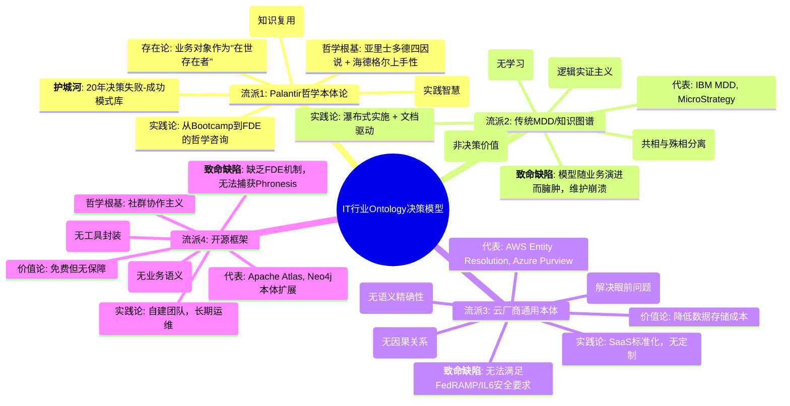
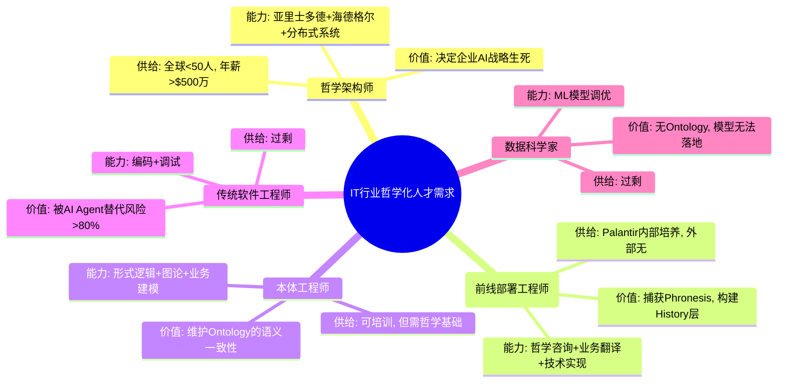
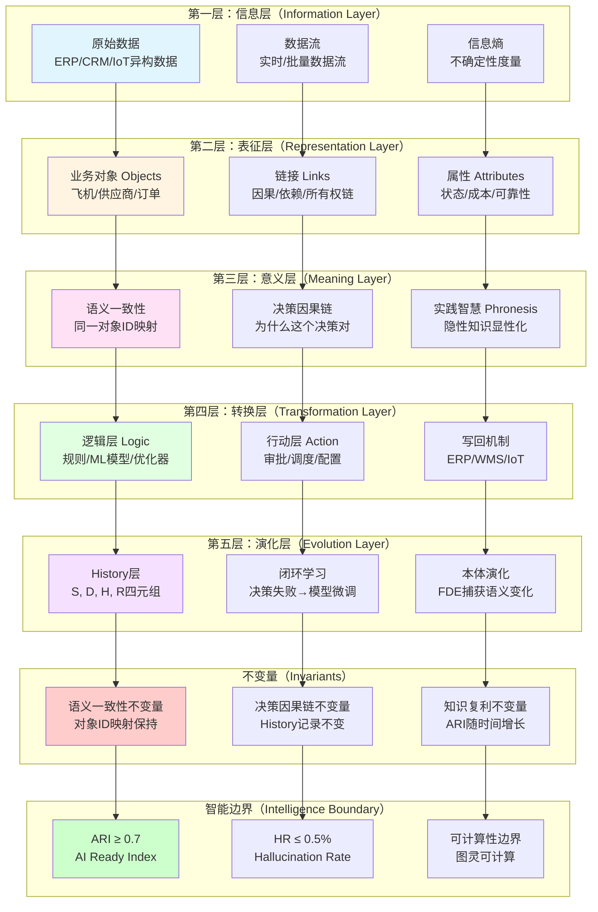
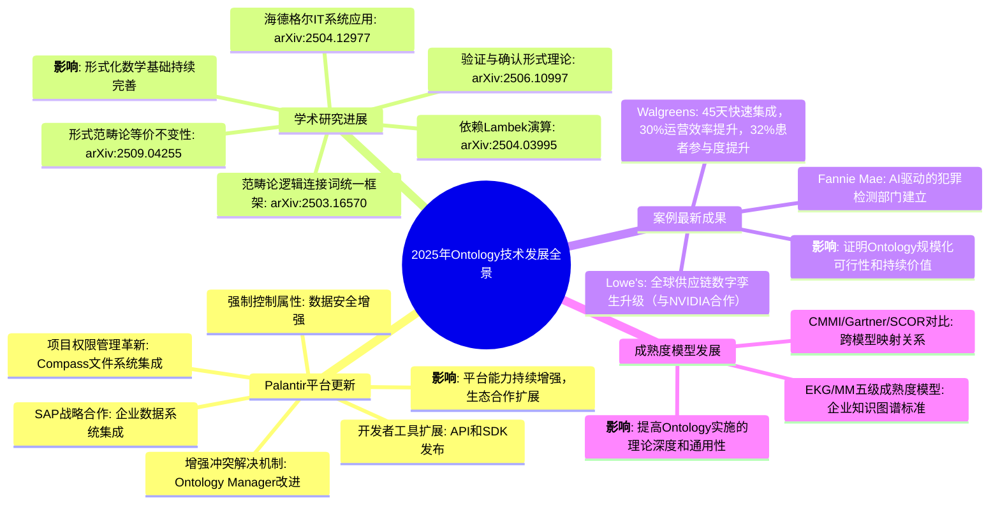

# 思维导图总览：Ontology哲学体系的可视化表征

## 二、目录

- [思维导图总览：Ontology哲学体系的可视化表征](#思维导图总览ontology哲学体系的可视化表征)
  - [二、目录](#二目录)
  - [🗺️ 思维导图索引](#️-思维导图索引)
  - [📊 核心思维导图1：DKB架构全景](#-核心思维导图1dkb架构全景)
  - [🏛️ 核心思维导图2：哲学谱系转译](#️-核心思维导图2哲学谱系转译)
  - [🔧 核心思维导图3：IT技术哲学四重结构](#-核心思维导图3it技术哲学四重结构)
  - [🎯 核心思维导图4：实践智慧(Phronesis)捕获机制](#-核心思维导图4实践智慧phronesis捕获机制)
  - [🌐 核心思维导图5：IT行业Ontology决策模型全景](#-核心思维导图5it行业ontology决策模型全景)
  - [🧠 核心思维导图6：IT行业哲学化人才需求](#-核心思维导图6it行业哲学化人才需求)
  - [🔬 核心思维导图7：信息-表征-意义-转换的统一视角系统图](#-核心思维导图7信息-表征-意义-转换的统一视角系统图)
  - [📐 思维导图使用指南](#-思维导图使用指南)
    - [1. 按主题查找](#1-按主题查找)
    - [2. 按应用场景](#2-按应用场景)
    - [3. 导出格式](#3-导出格式)

---

## 🗺️ 思维导图索引

本文档整合所有view文件中的思维导图，提供统一的可视化导航。

> **新增内容**：**核心思维导图7（信息-表征-意义-转换的统一视角系统图）**展示了DKB Ontology如何将信息、表征、意义、转换统一在数学结构中，对应 `model/01` §7（第七层：形式化数学基础层）和 `model/03` 矩阵11（范畴论/类型论等哲科模型对比）。

---

## 📊 核心思维导图1：DKB架构全景

**来源**：view01 §2.2, view02 §6.1

```mermaid
mindmap
  root((决策知识库 = 企业认知数字孪生))
    语义层(Semantic Layer)"知识表示"
      业务对象(Objects): 客户/订单/设备/风险事件
      关系图谱(Links): 因果链/依赖链/所有权链
      属性体系(Attributes): 状态/成本/可靠性评分
      **核心差异化**: 包含"不可见知识"如"该供应商虽低效但是唯一国内源"

    逻辑层(Logic Layer)"知识计算"
      规则引擎: 合规规则/审批流
      ML模型: 预测模型/优化器
      AI Agent: Disruption Bot/Ask Adam
      **核心差异化**: 逻辑资产自动封装为LLM可调用的"工具"

    行动层(Action Layer)"知识变现"
      决策记录: 谁+何时+为什么+结果
      写回机制: ERP/WMS/IoT系统
      权限管控: 对象级+字段级+动作级
      **核心差异化**: 人类与AI共享同一操作界面

    进化层(Evolution Layer)"知识生长"
      闭环学习: 决策失败自动反馈模型
      因果推理: 识别"低成本≠高价值"的乘数效应
      模拟推演: 飓风场景下的供应链重配置
      **核心差异化**: 从"互联网文本训练"转向"企业决策历史训练"
```

---

## 🏛️ 核心思维导图2：哲学谱系转译

**来源**：view03 §1.1, view05 §1.1

```mermaid
mindmap
  root((本体论 Ontology: 研究"存在"的学说))
    古典哲学
      巴门尼德: "存在者存在，非存在者不存在" → 唯一不变的本原
      亚里士多德《形而上学》: "哲学首要问题是研究存在之作为存在" → 实体(ousia)与偶性
      柏拉图: 理念世界(eidos) vs 现象世界 → 共相与殊相

    经院哲学
      郭克兰纽(17世纪): 首次提出"Ontology"术语
      笛卡尔: "我思故我在" → 主体性转向

    现代哲学
      黑格尔: 绝对精神的辩证运动 → 历史与逻辑的统一
      海德格尔《存在与时间》: "此在(Dasein)"在世界中存在 → 实践哲学的兴起

    Palantir转译
      on(存在) → 业务对象(Objects): 客户、订单、飞机
      logos(逻各斯) → 链接(Links) + 逻辑(Logic): 因果关系、依赖关系
      ousia(实体本质) → 属性(Properties): 状态、成本、可靠性评分
      实践智慧(Phronesis) → 行动(Actions): 审批、调度、配置
```

---

## 🔧 核心思维导图3：IT技术哲学四重结构

**来源**：view06 §1.1

```mermaid
mindmap
  root((IT技术哲学: 四重结构模型))

    本体论层 (Ontology: IT系统如何"存在")
      传统: 代码=语法树(分析哲学) "程序是形式逻辑的符号串"
      革命: 系统=在世存在者(现象学) "软件是此在(Dasein)的筹划"

      Palantir转译
        对象(Object): 不是数据库行, 是"操劳"中遭遇的业务实体
        链接(Link): 不是外键, 是"因缘联络"(Bewandtnis)
        行动(Action): 不是函数调用, 是"让可能性显现"
        **算法实现**: 对象-链接-行动三元组 = 筹划的数据结构

    认识论层 (Epistemology: IT如何"认知")
      传统: 知识=确定规则(专家系统) "IF-THEN-ELSE = 演绎逻辑"
      革命: 知识=实践智慧(Phronesis) "情境判断无法编码, 只能历史化"

      Palantir转译
        Techne层: 可封装逻辑(ML模型/规则引擎)
        Phronesis层: History捕获人类例外判断(S, D, H, R)
        Learning: RLHF将例外转化为新Techne
        **算法实现**: 四元组日志 + 反馈闭环

    价值论层 (Axiology: IT如何"增值")
      传统: 价值=成本节约(工具理性) "ROI=(收入-成本)/成本"
      革命: 价值=知识复利(存在论价值) "效用=log(知识复用度)"

      Palantir转译
        操作层: 效率(时间↓)
        战术层: 韧性(风险↓)
        战略层: 演化(能力↑)
        **算法实现**: 决策效用 = f(正确率, 速度, 风险, 复用)

    实践论层 (Praxiology: IT如何"实践")
      传统: 开发=瀑布/敏捷(工程方法) "需求→设计→编码→测试"
      革命: 实践=筹划-操劳-共在循环(诠释学) "Bootcamp-FDE-History = 诠释学循环"

      Palantir转译
        Bootcamp: 5天让客户"看见"自己的业务筹划
        FDE: 6-24个月嵌入, "翻译"隐性知识
        History: 每次决策反哺本体, 实现诠释学循环
        **算法实现**: ARI(t) = 0.15 + 0.7·(1-e^{-t/60})
```

---

## 🎯 核心思维导图4：实践智慧(Phronesis)捕获机制

**来源**：view03 §2.2

```mermaid
mindmap
  root((实践智慧 Phronesis: 情境化决策))
    Techne 技艺层
      规则引擎: "IF 库存<100 THEN 触发补货"
      ML模型: "预测未来30天需求 = f(历史销量, 促销)"
      优化器: "最小化总成本 = 运输成本 + 仓储成本"
      **特征**: 可编码、可复用、可自动化

    Phronesis 智慧层
      隐性知识: "该供应商虽低效但是唯一国内源"
      时机判断: "飓风预警时提前2天调拨库存，而非等官方通知"
      伦理权衡: "优先保障医疗物资，即使利润较低"
      **特征**: 难编码、依赖经验、需人类判断

    Palantir融合机制
      History捕获: 每次人类决策记录为(情境, 判断, 结果)
      RLHF微调: 将Phronesis转化为Techne的"例外规则"
      置信度阈值: Phronesis保留区（置信度<70%→人类审查）
      **哲学意义**: 实践智慧的"半衰期"从2年延长至∞（知识库永生）
```

---

## 🌐 核心思维导图5：IT行业Ontology决策模型全景

**来源**：view04 §1.1



---

## 🧠 核心思维导图6：IT行业哲学化人才需求

**来源**：view05 §6.2



---

## 🔬 核心思维导图7：信息-表征-意义-转换的统一视角系统图

**来源**：用户需求（本体论作为组织整体内部信息、表征、意义、转换的统一视角），矩阵11的扩展

> 目的：展示 DKB Ontology 如何将 **信息（Information）**、**表征（Representation）**、**意义（Meaning）**、**转换（Transformation）** 统一在一个数学结构中，并揭示这些维度如何共同演化，形成组织的"智能边界"。



**关键映射关系**：

1. **信息 → 表征**：原始数据（I1）通过 Ontology 建模转化为业务对象（R1），数据流（I2）转化为链接（R2），信息熵（I3）转化为属性（R3）。**不变量**：语义一致性（同一对象在不同系统中的ID映射保持）。

2. **表征 → 意义**：业务对象（R1）通过属性+链接赋予"是什么"和"为什么重要"的意义（M1），链接（R2）形成决策因果链（M2），属性（R3）捕获实践智慧（M3）。**不变量**：决策因果链（History层记录的不变关系）。

3. **意义 → 转换**：语义一致性（M1）通过逻辑层（T1）转换为可执行函数，决策因果链（M2）通过行动层（T2）转换为决策操作，实践智慧（M3）通过写回机制（T3）转换为系统状态更新。**不变量**：知识复利（ARI随时间增长）。

4. **转换 → 演化**：逻辑层（T1）通过History层（E1）记录决策历史，行动层（T2）通过闭环学习（E2）优化模型，写回机制（T3）通过本体演化（E3）捕获业务语义变化。**不变量**：所有不变量在演化过程中保持。

5. **不变量 → 智能边界**：语义一致性不变量（INV1）定义 ARI ≥ 0.7 的边界，决策因果链不变量（INV2）定义 HR ≤ 0.5% 的边界，知识复利不变量（INV3）定义可计算性边界。**智能边界** = 可被图灵模型和IT技术基础设施演化的不变量集合。

**与哲科模型的对应**：

- **范畴论**：信息层 = 原始范畴，表征层 = 对象，意义层 = 态射，转换层 = 函子，演化层 = 自然变换，不变量 = 范畴不变量
- **类型论**：信息层 = 原始类型，表征层 = 类型，意义层 = 项，转换层 = 函数类型，演化层 = 路径类型，不变量 = 类型等价
- **信息论**：信息层 = 信息源，表征层 = 编码，意义层 = 信息量，转换层 = 信道，演化层 = 信息演化，不变量 = 信息不变量
- **系统论**：信息层 = 输入，表征层 = 状态空间，意义层 = 系统功能，转换层 = 状态转移，演化层 = 系统演化，不变量 = 守恒量

---

## 📐 思维导图使用指南

### 1. 按主题查找

- **DKB架构** → 思维导图1
- **哲学转译** → 思维导图2
- **技术哲学** → 思维导图3
- **实践智慧** → 思维导图4
- **行业对比** → 思维导图5
- **人才需求** → 思维导图6

### 2. 按应用场景

- **企业决策** → 思维导图1 + 思维导图5
- **技术架构** → 思维导图1 + 思维导图3
- **哲学研究** → 思维导图2 + 思维导图4
- **人才规划** → 思维导图6
- **统一视角** → 思维导图7（信息-表征-意义-转换）

### 3. 导出格式

所有思维导图支持：

- Mermaid格式（可直接渲染）
- 可导出为PNG/SVG
- 可导入XMind/MindManager

---

## 🎯 核心思维导图8：2025年最新技术发展全景（新增）

**来源**：整合2025年最新技术发展和案例研究

> **目的**：展示2025年Ontology技术的最新发展，包括Palantir平台更新、学术研究进展、案例最新成果，为时间线演进模型提供最新数据支撑。



**关键洞察**：

1. **平台能力持续增强**：2025年Palantir平台的更新主要集中在权限管理、冲突解决、生态合作等方面，体现了平台的持续演进能力。

2. **形式化数学基础完善**：2025年学术研究在范畴论、类型论、形式化验证等方面取得重要进展，为DKB Ontology提供了更严格的数学基础。

3. **案例价值持续验证**：Walgreens、Lowe's、Fannie Mae等案例的最新成果证明了Ontology的持续价值和规模化可行性。

4. **理论深度提升**：EKG/MM等成熟度模型的发展提高了Ontology实施的理论深度和与行业标准的可比性。

**对应文档**：
- `model/06-时间线演进模型.md` §3（Palantir演进第三段：规模化阶段）
- `model/08-案例研究索引.md` §1-3（核心案例最新进展）
- `model/01-主题层级模型.md` §7（形式化数学基础层）
- `model/03-概念多维对比矩阵.md` 矩阵13（成熟度模型对比）

---

**最后更新**：2025-12-XX
**维护者**：FormalAI项目组
