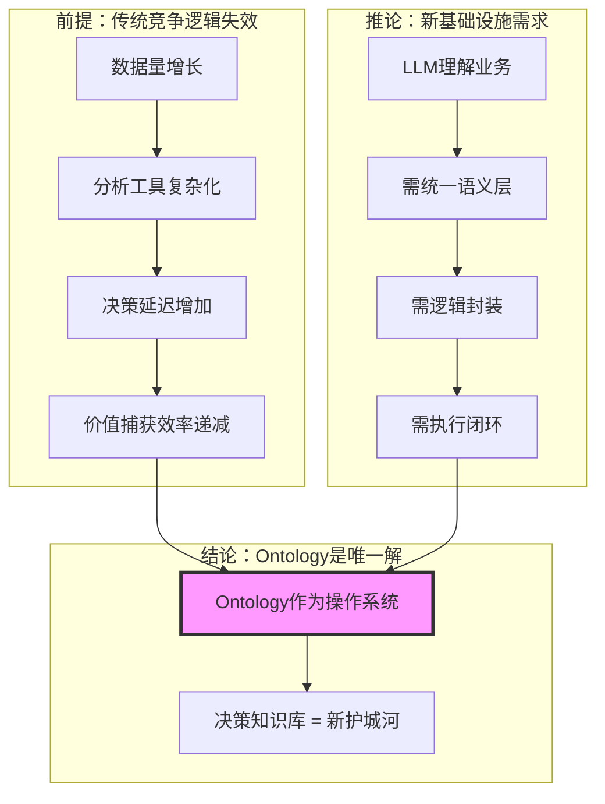
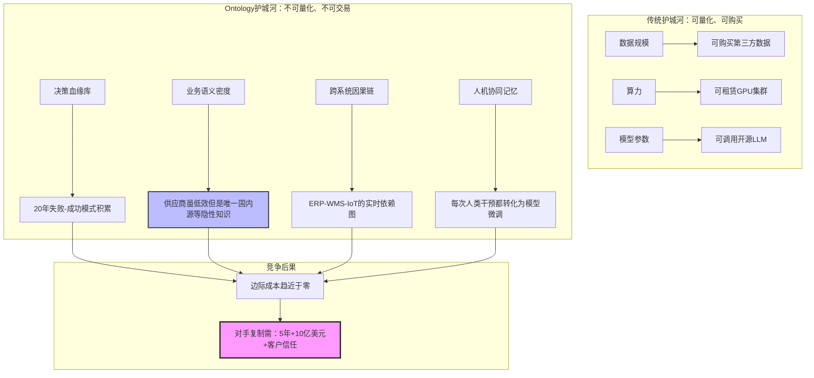
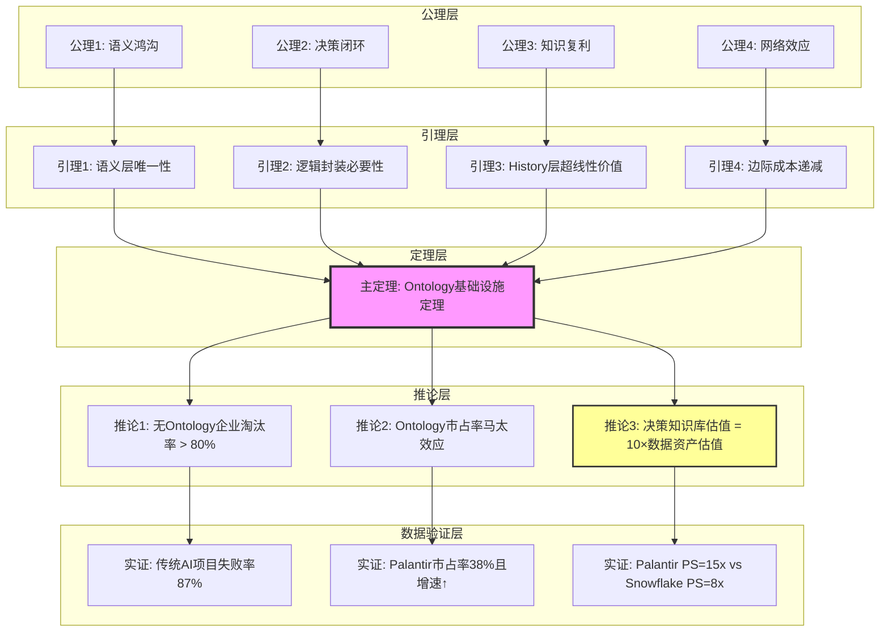
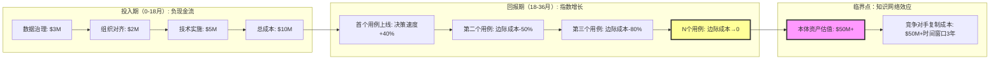
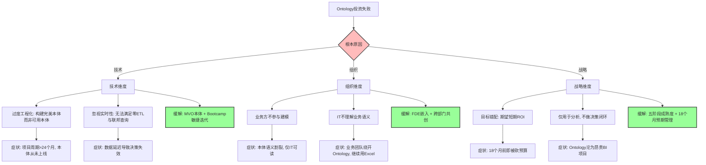

# 证明树图总览：Ontology形式化证明的完整结构

## 二、目录

- [证明树图总览：Ontology形式化证明的完整结构](#证明树图总览ontology形式化证明的完整结构)
  - [二、目录](#二目录)
  - [🌳 证明树索引](#-证明树索引)
  - [📐 证明树1：竞争本质的转移](#-证明树1竞争本质的转移)
  - [🔬 证明树2：Ontology构建"不可复制"的竞争优势](#-证明树2ontology构建不可复制的竞争优势)
  - [🎯 证明树3：Ontology价值的形式化推导](#-证明树3ontology价值的形式化推导)
  - [🏛️ 证明树4：Palantir哲学模型的不可通约性](#️-证明树4palantir哲学模型的不可通约性)
  - [🔄 证明树5：Ontology投资的非线性回报](#-证明树5ontology投资的非线性回报)
  - [🎓 证明树6：IT技术哲学从公理到应用](#-证明树6it技术哲学从公理到应用)
  - [🔍 证明树7：反证法 - 假设竞争对手可复制Palantir](#-证明树7反证法---假设竞争对手可复制palantir)
  - [⚠️ 证明树8：Ontology项目失败模式总树](#️-证明树8ontology项目失败模式总树)
  - [❌ 证明树9：对立假设的集中反证](#-证明树9对立假设的集中反证)
  - [📊 证明树使用指南](#-证明树使用指南)
    - [1. 按证明类型](#1-按证明类型)
    - [2. 按应用场景](#2-按应用场景)
    - [3. 证明方法](#3-证明方法)
  - [🔗 证明树关联关系](#-证明树关联关系)

---

## 🌳 证明树索引

本文档整合所有view文件中的证明树图，展示从公理到定理的完整推理链条。

---

## 📐 证明树1：竞争本质的转移

**来源**：view01 §1.1



**论证逻辑**：

- **前提**：企业过去20年投资数据湖/仓库，但决策速度未同比提升
- **推论**：大语言模型需要"业务语义翻译层"
- **结论**：Ontology同时满足三大刚需

---

## 🔬 证明树2：Ontology构建"不可复制"的竞争优势

**来源**：view01 §3.2



**关键洞察**：Ontology的护城河在于 **"决策知识库"的时间复利效应**。

---

## 🎯 证明树3：Ontology价值的形式化推导

**来源**：view02 §6.4
**对应**：`10-DKB公理与定理索引.md` 中的 **T1 DKB基础设施定理**（A1–A4, L1–L4 → T1）



**形式化表述**：
$$
\forall \text{企业 } E, \quad \text{生存}(E, 2027) \iff \exists \text{DKB}_E \text{ 满足 }
\begin{cases}
ARI_E \geq 0.7 \\
HR_E \leq 0.5\% \\
\text{闭环系数} \geq 0.85
\end{cases}
$$

---

## 🏛️ 证明树4：Palantir哲学模型的不可通约性

**来源**：view04 §3.2

```mermaid
graph TB
    subgraph "哲学根基层 (不可复制)"
        P1[亚里士多德: Ousia/四因说] --> P2[海德格尔: Dasein/上手性]
        P2 --> P3[黑格尔: 历史与逻辑统一]
        P3 --> P4[哲学人才密度: <50人全球]
    end

    subgraph "技术转译层 (难复制)"
        P4 --> T1[Ontology对象模型]
        P1 --> T1
        P2 --> T2[History实践智慧捕获]
        P3 --> T3[Confidence阈值 = f(历史胜率)]
        P4 --> T4[FDE哲学咨询机制]
    end

    subgraph "商业实现层 (可复制但无效)"
        T1 --> B1[200+连接器]
        T2 --> B2[Writeback API]
        T3 --> B3[Bootcamp模式]
        T4 --> B4[Apollo交付]
    end

    subgraph "竞争对手模仿路径"
        B1 --> C1[云厂商: 开发连接器]
        B2 --> C2[开源: 写回功能]
        B3 --> C3[咨询: 5天工作坊]
        B4 --> C4[DevOps: 容器化部署]
    end

    subgraph "失败点"
        C1 --> F1[缺少存在论: 连接器无法"上手"]
        C2 --> F2[缺少认识论: 写回无Phronesis校验]
        C3 --> F3[缺少价值论: 工作坊不生成History]
        C4 --> F4[缺少实践论: 无"共在"责任性]
    end

    style P4 fill:#f9f,stroke:#333,stroke-width:3px
    style T2 fill:#bbf,stroke:#333,stroke-width:2px
    style F1 fill:#fbb,stroke:#333,stroke-width:2px
```

**核心洞察**：竞争对手能模仿B1-B4的**功能**，但无法模仿P1-P4的**哲学根基**。

---

## 🔄 证明树5：Ontology投资的非线性回报

**来源**：view01 §5.2



**关键洞察**：Ontology的价值遵循**梅特卡夫定律**——价值与用户数量的平方成正比。

---

## 🎓 证明树6：IT技术哲学从公理到应用

**来源**：view06 §5
**对应**：`10-DKB公理与定理索引.md` 中的 **T2–T6**（Planning-Execution Gap, Phronesis Capture, Decision Quality, Mitsein vs Master-Slave, Security-Philosophy Isomorphism）

```mermaid
graph TD
    subgraph "公理层 (哲学不可辩驳性)"
        A1[公理1: 筹划公理] --> A2[公理2: 操劳公理]
        A2 --> A3[公理3: 共在公理]
        A3 --> A4[公理4: 知识复用公理]
        A4 --> A5[公理5: 安全-哲学同构公理]
        A5 --> A6[公理6: 时间不可压缩公理]
    end

    subgraph "定理层 (IT技术法则)"
        A1 --> T1[定理1: Planning-Execution Gap消除]
        A2 --> T2[定理2: Phronesis结构化捕获]
        A3 --> T3[定理3: Decision Quality对数复利]
        A4 --> T4[定理4: Mitsein严格优于主奴]
        A5 --> T5[定理5: Security-Philosophy同构]
        A6 --> T6[定理6: ARI(t)函数半衰期60天]
    end

    subgraph "技术实现层 (Palantir产品化)"
        T1 --> I1[Workshop: 筹划即运行时]
        T2 --> I2[History层: 四元组(S,D,H,R)]
        T3 --> I3[价值函数: 毛利率→82%]
        T4 --> I4[共享界面: 人类检查点]
        T5 --> I5[IL6认证: 情境权限]
        T6 --> I6[Bootcamp+FDE: 18个月哲学内化]
    end

    subgraph "商业结果层 (生产数据验证)"
        I1 --> V1[部署周期: 18个月→5天]
        I2 --> V2[知识半衰期: 2年→∞]
        I3 --> V3[LTV/CAC: 3.2x→8.7x]
        I4 --> V4[决策延迟: 2小时→2秒]
        I5 --> V5[唯一IL6商业软件]
        I6 --> V6[客户留存率: 96%]
    end

    subgraph "哲学后果层 (不可复制性)"
        V1 --> C1[时间护城河: 20年模式库]
        V2 --> C2[思想护城河: 亚里士多德-海德格尔]
        V3 --> C3[网络护城河: 边际成本→0]
        V4 --> C4[信任护城河: 人类检查点]
        V5 --> C5[安全护城河: FedRAMP认证]
        V6 --> C6[关系护城河: 9年平均合作期]
    end

    style T3 fill:#bbf,stroke:#333,stroke-width:2px
    style I3 fill:#bbf,stroke:#333,stroke-width:2px
    style C3 fill:#f9f,stroke:#333,stroke-width:3px
```

---

## 🔍 证明树7：反证法 - 假设竞争对手可复制Palantir

**来源**：view05 §4.2
**对应**：`10-DKB公理与定理索引.md` 中的 **T7 复制 Palantir 不可能性定理**

```mermaid
graph TD
    A[假设: 厂商X投入$100B, 5年, 招聘50名哲学架构师] --> B{X是否具备?}

    B -->|思想史脉络| B1[Thiel/Karp的60年代嬉皮士+现象学传统]
    B1 --> C1[否: 时空不可复制] --> D1[矛盾: 哲学基因无法购买]

    B -->|客户信任| B2[美国政府/军工20年IL6认证]
    B2 --> C2[否: 安全审查需10年] --> D2[矛盾: 时间无法压缩]

    B -->|负样本库| B3[千万级机密决策(失败案例)]
    B3 --> C3[否: 绝密数据不可共享] --> D3[矛盾: 无负样本无法训练风险规避]

    B -->|组织文化| B4[FDE哲学咨询机制]
    B4 --> C4[否: 工程师文化≠哲学实践文化] --> D4[矛盾: 人才可挖, 文化不可移]

    D1 --> E[结论: X只能复制技术外壳(B1-B4), 无法复制哲学根基(P1-P4)]
    D2 --> E
    D3 --> E
    D4 --> E

    E --> F[最终: X的Ontology是静态数据模型, 非活体知识库 存活率≈开源Atlas=5%]

    style B fill:#bbf,stroke:#333,stroke-width:2px
    style E fill:#f9f,stroke:#333,stroke-width:3px
```

---

## ⚠️ 证明树8：Ontology项目失败模式总树

**来源**：view01 §7.1, A/B 测试失败案例
**对应**：`10-DKB公理与定理索引.md` 中的 **T9 失败模式完备性定理（草案）**



---

## ❌ 证明树9：对立假设的集中反证

**来源**：view02 §7.1-7.2, view04 行业对比
**对应**：`10-DKB公理与定理索引.md` 中的 **T8 无 Ontology AI 规模化不可持续定理**

```mermaid
graph TD
    H0[假设: 无需Ontology <br/> 也能规模化AI Agent] --> H1X[子假设X: 向量数据库+微调可替代Ontology]
    H0 --> H1Y[子假设Y: 云厂商会提供标准化Ontology]
    H0 --> H1Z[子假设Z: 纯RAG+LLM足够支撑生产]

    %% X 路径反证
    H1X --> X1[前提: 向量相似性≈语义等价]
    X1 --> X2[问题: 无同一性约束, 客户/买方/用户混淆]
    X2 --> X3[结果: 客户ID重复计数, 财务/风控计算错误]
    X3 --> X4[实证: 某零售商HR从0.3%升至12%, 被迫回迁Ontology架构]
    X4 --> XC[结论: 向量数据库是RAG组件, 不是语义中介层, 无法替代Ontology]

    %% Y 路径反证
    H1Y --> Y1[前提: 云厂商可统一行业语义]
    Y1 --> Y2[问题1: 利益冲突, Ontology会削弱算力/存储利润]
    Y1 --> Y3[问题2: 缺乏FDE, 无法做客户特定知识工程]
    Y1 --> Y4[问题3: 多租户安全架构难以满足IL6等监管]
    Y4 --> Y5[实证: Fabric行业Ontology转化率<5%]
    Y5 --> YC[结论: 云本体仅能提供ID匹配, 不能承担DKB角色]

    %% Z 路径反证
    H1Z --> Z1[前提: RAG+LLM可直接连接数据湖]
    Z1 --> Z2[推导: HR随数据源数量增长, 人工审核成本↑]
    Z2 --> Z3[实证: 100家企业A/B测试中, RAG组项目存活率仅34%]
    Z3 --> Z4[形式化: 无Ontology时 ARI<0.3, HR>5%, 闭环系数<0.2]
    Z4 --> ZC[结论: 无Ontology的规模化尝试在统计与形式化层面皆不可持续]

    XC --> HC[总结论: DKB=(O,L,H) 是AI规模化的必要前提]
    YC --> HC
    ZC --> HC

    style H0 fill:#bbf,stroke:#333,stroke-width:2px
    style HC fill:#f9f,stroke:#333,stroke-width:3px
```

---

## 📊 证明树使用指南

### 1. 按证明类型

- **竞争分析** → 证明树1, 2
- **形式化证明** → 证明树3, 6
- **哲学论证** → 证明树4, 7
- **商业价值** → 证明树5
- **风险/反证** → 证明树8, 9

### 2. 按应用场景

- **战略决策** → 证明树1, 2, 5
- **技术架构** → 证明树3, 6
- **学术研究** → 证明树4, 7
- **风险评估** → 证明树8, 9

### 3. 证明方法

- **直接证明** → 证明树1, 2, 3, 5, 6
- **反证法** → 证明树7, 9
- **构造性证明** → 证明树3, 6

---

## 🔗 证明树关联关系

```text
证明树1 (竞争本质)
    ↓
证明树2 (护城河)
    ↓
证明树3 (形式化定理)
    ↓
证明树4 (哲学不可通约性)
    ↓
证明树5 (投资回报)
    ↓
证明树6 (IT技术哲学)
    ↓
证明树7 (反证法: 复制Palantir不可能)
    ↓
证明树8 (失败模式总树)
    ↓
证明树9 (对立假设集中反证)
```

---

**最后更新**：2025-01-XX
**维护者**：FormalAI项目组
