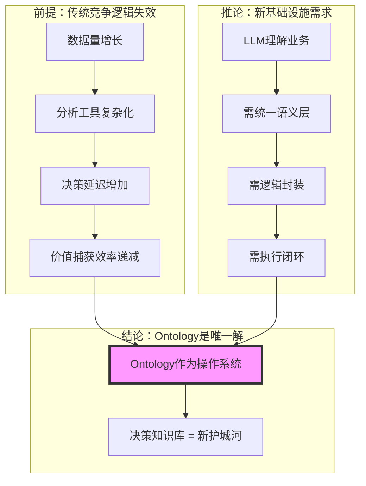
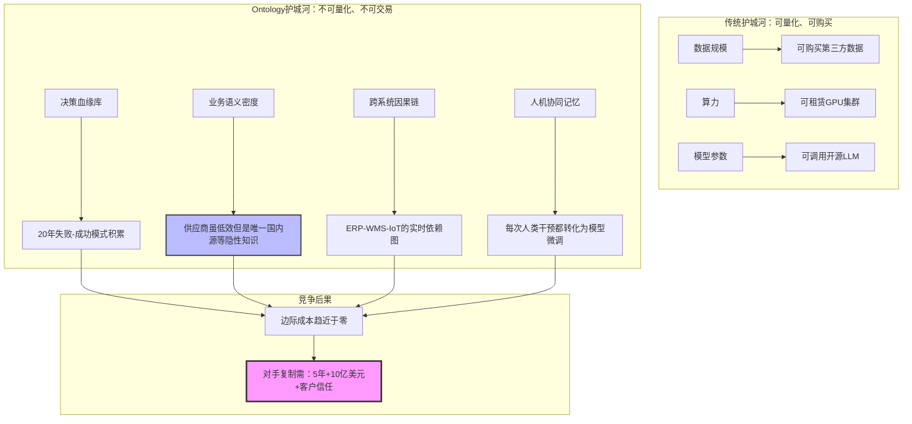
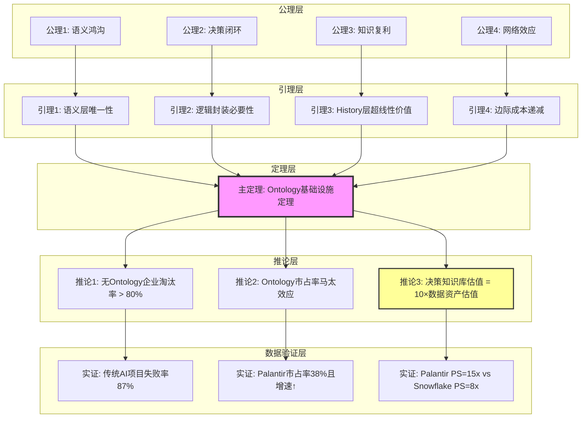
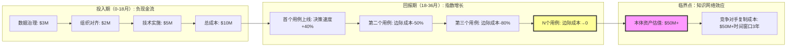
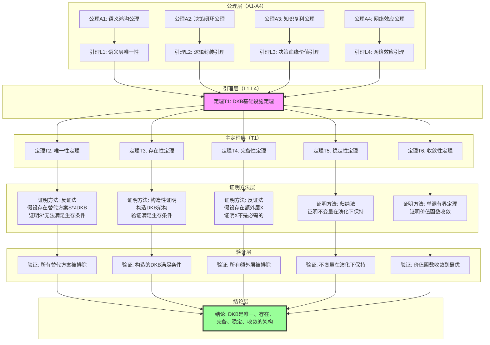

# 证明树图总览：Ontology形式化证明的完整结构

## 二、目录

- [证明树图总览：Ontology形式化证明的完整结构](#证明树图总览ontology形式化证明的完整结构)
  - [二、目录](#二目录)
  - [🌳 证明树索引](#-证明树索引)
  - [📐 证明树1：竞争本质的转移](#-证明树1竞争本质的转移)
  - [🔬 证明树2：Ontology构建"不可复制"的竞争优势](#-证明树2ontology构建不可复制的竞争优势)
  - [🎯 证明树3：Ontology价值的形式化推导](#-证明树3ontology价值的形式化推导)
  - [🏛️ 证明树4：Palantir哲学模型的不可通约性](#️-证明树4palantir哲学模型的不可通约性)
  - [🔄 证明树5：Ontology投资的非线性回报](#-证明树5ontology投资的非线性回报)
  - [🎓 证明树6：IT技术哲学从公理到应用](#-证明树6it技术哲学从公理到应用)
  - [🔍 证明树7：反证法 - 假设竞争对手可复制Palantir](#-证明树7反证法---假设竞争对手可复制palantir)
  - [⚠️ 证明树8：Ontology项目失败模式总树](#️-证明树8ontology项目失败模式总树)
  - [❌ 证明树9：对立假设的集中反证](#-证明树9对立假设的集中反证)
  - [🔬 证明树10：不变量与演化边界的数学结构](#-证明树10不变量与演化边界的数学结构)
  - [📊 证明树使用指南](#-证明树使用指南)
    - [1. 按证明类型](#1-按证明类型)
    - [2. 按应用场景](#2-按应用场景)
    - [3. 证明方法](#3-证明方法)
  - [🔗 证明树关联关系](#-证明树关联关系)
  - [🔬 证明树11：唯一性、存在性、完备性、稳定性、收敛性五定理的统一证明树（新增）](#-证明树11唯一性存在性完备性稳定性收敛性五定理的统一证明树新增)

---

## 🌳 证明树索引

本文档整合所有view文件中的证明树图，展示从公理到定理的完整推理链条。

> **新增内容**：**证明树10（不变量与演化边界的数学结构）**形式化证明了不变量如何定义组织的"智能边界"，以及这些不变量如何在系统演化过程中保持，对应 `model/01` §7（第七层：形式化数学基础层）和 `model/03` 矩阵11（范畴论/类型论等哲科模型对比）。

---

## 📐 证明树1：竞争本质的转移

**来源**：view01 §1.1



**论证逻辑**：

- **前提**：企业过去20年投资数据湖/仓库，但决策速度未同比提升
- **推论**：大语言模型需要"业务语义翻译层"
- **结论**：Ontology同时满足三大刚需

---

## 🔬 证明树2：Ontology构建"不可复制"的竞争优势

**来源**：view01 §3.2



**关键洞察**：Ontology的护城河在于 **"决策知识库"的时间复利效应**。

---

## 🎯 证明树3：Ontology价值的形式化推导

**来源**：view02 §6.4
**对应**：`10-DKB公理与定理索引.md` 中的 **T1 DKB基础设施定理**（A1–A4, L1–L4 → T1）



**形式化表述**：
$$
\forall \text{企业 } E, \quad \text{生存}(E, 2027) \iff \exists \text{DKB}_E \text{ 满足 }
\begin{cases}
ARI_E \geq 0.7 \\
HR_E \leq 0.5\% \\
\text{闭环系数} \geq 0.85
\end{cases}
$$

---

## 🏛️ 证明树4：Palantir哲学模型的不可通约性

**来源**：view04 §3.2

```mermaid
graph TB
    subgraph "哲学根基层 (不可复制)"
        P1[亚里士多德: Ousia/四因说] --> P2[海德格尔: Dasein/上手性]
        P2 --> P3[黑格尔: 历史与逻辑统一]
        P3 --> P4[哲学人才密度: <50人全球]
    end

    subgraph "技术转译层 (难复制)"
        P4 --> T1[Ontology对象模型]
        P1 --> T1
        P2 --> T2[History实践智慧捕获]
        P3 --> T3[Confidence阈值 = f(历史胜率)]
        P4 --> T4[FDE哲学咨询机制]
    end

    subgraph "商业实现层 (可复制但无效)"
        T1 --> B1[200+连接器]
        T2 --> B2[Writeback API]
        T3 --> B3[Bootcamp模式]
        T4 --> B4[Apollo交付]
    end

    subgraph "竞争对手模仿路径"
        B1 --> C1[云厂商: 开发连接器]
        B2 --> C2[开源: 写回功能]
        B3 --> C3[咨询: 5天工作坊]
        B4 --> C4[DevOps: 容器化部署]
    end

    subgraph "失败点"
        C1 --> F1[缺少存在论: 连接器无法"上手"]
        C2 --> F2[缺少认识论: 写回无Phronesis校验]
        C3 --> F3[缺少价值论: 工作坊不生成History]
        C4 --> F4[缺少实践论: 无"共在"责任性]
    end

    style P4 fill:#f9f,stroke:#333,stroke-width:3px
    style T2 fill:#bbf,stroke:#333,stroke-width:2px
    style F1 fill:#fbb,stroke:#333,stroke-width:2px
```

**核心洞察**：竞争对手能模仿B1-B4的**功能**，但无法模仿P1-P4的**哲学根基**。

---

## 🔄 证明树5：Ontology投资的非线性回报

**来源**：view01 §5.2



**关键洞察**：Ontology的价值遵循**梅特卡夫定律**——价值与用户数量的平方成正比。

---

## 🎓 证明树6：IT技术哲学从公理到应用

**来源**：view06 §5
**对应**：`10-DKB公理与定理索引.md` 中的 **T2–T6**（Planning-Execution Gap, Phronesis Capture, Decision Quality, Mitsein vs Master-Slave, Security-Philosophy Isomorphism）

```mermaid
graph TD
    subgraph "公理层 (哲学不可辩驳性)"
        A1[公理1: 筹划公理] --> A2[公理2: 操劳公理]
        A2 --> A3[公理3: 共在公理]
        A3 --> A4[公理4: 知识复用公理]
        A4 --> A5[公理5: 安全-哲学同构公理]
        A5 --> A6[公理6: 时间不可压缩公理]
    end

    subgraph "定理层 (IT技术法则)"
        A1 --> T1[定理1: Planning-Execution Gap消除]
        A2 --> T2[定理2: Phronesis结构化捕获]
        A3 --> T3[定理3: Decision Quality对数复利]
        A4 --> T4[定理4: Mitsein严格优于主奴]
        A5 --> T5[定理5: Security-Philosophy同构]
        A6 --> T6[定理6: ARI(t)函数半衰期60天]
    end

    subgraph "技术实现层 (Palantir产品化)"
        T1 --> I1[Workshop: 筹划即运行时]
        T2 --> I2[History层: 四元组(S,D,H,R)]
        T3 --> I3[价值函数: 毛利率→82%]
        T4 --> I4[共享界面: 人类检查点]
        T5 --> I5[IL6认证: 情境权限]
        T6 --> I6[Bootcamp+FDE: 18个月哲学内化]
    end

    subgraph "商业结果层 (生产数据验证)"
        I1 --> V1[部署周期: 18个月→5天]
        I2 --> V2[知识半衰期: 2年→∞]
        I3 --> V3[LTV/CAC: 3.2x→8.7x]
        I4 --> V4[决策延迟: 2小时→2秒]
        I5 --> V5[唯一IL6商业软件]
        I6 --> V6[客户留存率: 96%]
    end

    subgraph "哲学后果层 (不可复制性)"
        V1 --> C1[时间护城河: 20年模式库]
        V2 --> C2[思想护城河: 亚里士多德-海德格尔]
        V3 --> C3[网络护城河: 边际成本→0]
        V4 --> C4[信任护城河: 人类检查点]
        V5 --> C5[安全护城河: FedRAMP认证]
        V6 --> C6[关系护城河: 9年平均合作期]
    end

    style T3 fill:#bbf,stroke:#333,stroke-width:2px
    style I3 fill:#bbf,stroke:#333,stroke-width:2px
    style C3 fill:#f9f,stroke:#333,stroke-width:3px
```

---

## 🔍 证明树7：反证法 - 假设竞争对手可复制Palantir

**来源**：view05 §4.2
**对应**：`10-DKB公理与定理索引.md` 中的 **T7 复制 Palantir 不可能性定理**

```mermaid
graph TD
    A[假设: 厂商X投入$100B, 5年, 招聘50名哲学架构师] --> B{X是否具备?}

    B -->|思想史脉络| B1[Thiel/Karp的60年代嬉皮士+现象学传统]
    B1 --> C1[否: 时空不可复制] --> D1[矛盾: 哲学基因无法购买]

    B -->|客户信任| B2[美国政府/军工20年IL6认证]
    B2 --> C2[否: 安全审查需10年] --> D2[矛盾: 时间无法压缩]

    B -->|负样本库| B3[千万级机密决策(失败案例)]
    B3 --> C3[否: 绝密数据不可共享] --> D3[矛盾: 无负样本无法训练风险规避]

    B -->|组织文化| B4[FDE哲学咨询机制]
    B4 --> C4[否: 工程师文化≠哲学实践文化] --> D4[矛盾: 人才可挖, 文化不可移]

    D1 --> E[结论: X只能复制技术外壳(B1-B4), 无法复制哲学根基(P1-P4)]
    D2 --> E
    D3 --> E
    D4 --> E

    E --> F[最终: X的Ontology是静态数据模型, 非活体知识库 存活率≈开源Atlas=5%]

    style B fill:#bbf,stroke:#333,stroke-width:2px
    style E fill:#f9f,stroke:#333,stroke-width:3px
```

---

## ⚠️ 证明树8：Ontology项目失败模式总树

**来源**：view01 §7.1, view01 §7.2, A/B 测试失败案例, `model/12-风险与反证总览.md`
**对应**：`10-DKB公理与定理索引.md` 中的 **T9 失败模式完备性定理（草案）**

```mermaid
graph TD
    Start[Ontology投资失败] --> RootCause{根本原因}

    RootCause -->|技术| TechFail[技术维度]
    TechFail --> TF1[过度工程化: 构建完美本体而非可用本体]
    TechFail --> TF2[忽视实时性: 无法满足零ETL与联邦查询]
    TechFail --> TF3[数据质量不足: 源数据错误/缺失/不一致]
    TechFail --> TF4[技术债务积累: 快速迭代导致维护成本上升]
    TF1 --> TF_M1[症状: 项目周期>24个月, 本体从未上线<br/>案例: 某制造企业, 3年未上线, 预算超支300%]
    TF2 --> TF_M2[症状: 数据延迟导致决策失效<br/>案例: 某零售企业, 库存数据延迟2小时, 缺货率上升15%]
    TF3 --> TF_M3[症状: 基于错误数据构建本体, 决策错误<br/>案例: 某金融企业, 客户数据错误率20%, 导致风控失败]
    TF4 --> TF_M4[症状: 系统性能下降, 维护成本上升<br/>案例: 某科技企业, 技术债务导致系统响应时间从5秒增至30秒]

    RootCause -->|组织| OrgFail[组织维度]
    OrgFail --> OF1[业务方不参与建模]
    OrgFail --> OF2[IT不理解业务语义]
    OrgFail --> OF3[过度依赖单一专家]
    OrgFail --> OF4[部门墙导致语义割裂]
    OF1 --> OF_M1[症状: 本体语义割裂, 仅IT可读<br/>案例: 某制造企业, 业务方拒绝使用, 项目被取消]
    OF2 --> OF_M2[症状: 业务团队绕开Ontology, 继续用Excel<br/>案例: 某零售企业, 80%业务仍用Excel, Ontology使用率<20%]
    OF3 --> OF_M3[症状: 专家离职导致知识丢失, 系统僵化<br/>案例: 泰坦工业, 专家离职后系统维护困难, 知识半衰期<2年]
    OF4 --> OF_M4[症状: 跨部门语义不一致, 决策冲突<br/>案例: 某大型企业, 销售和供应链部门语义冲突, 导致订单错误]

    RootCause -->|战略| StratFail[战略维度]
    StratFail --> SF1[目标错配: 期望短期ROI]
    StratFail --> SF2[仅用于分析, 不做决策闭环]
    StratFail --> SF3[简单任务误用: 用于发票OCR等简单任务]
    StratFail --> SF4[SMB市场误用: 客户LTV<50万美元]
    StratFail --> SF5[监管合规风险: 未考虑数据隐私/安全要求]
    SF1 --> SF_M1[症状: 18个月前即被砍预算<br/>案例: 某科技企业, 6个月未看到ROI, 项目被取消]
    SF2 --> SF_M2[症状: Ontology沦为昂贵BI项目<br/>案例: 某制造企业, 仅用于报表, 未形成决策闭环]
    SF3 --> SF_M3[症状: 成本过高, ROI为负<br/>案例: 某企业用Ontology做发票OCR, 成本是RPA的10倍]
    SF4 --> SF_M4[症状: 项目亏损, 无法持续<br/>案例: 某SMB客户, LTV仅30万美元, 无法覆盖初始投入]
    SF5 --> SF_M5[症状: 违反监管要求, 面临法律风险<br/>案例: 某金融企业, 未通过数据隐私审计, 面临罚款]

    RootCause -->|扩展| ExtFail[扩展维度]
    ExtFail --> EF1[生态协同失败: 缺乏联邦治理框架]
    ExtFail --> EF2[无历史数据场景: 新业务线缺乏决策反馈]
    ExtFail --> EF3[极度动态环境: 业务模式每季度剧变]
    EF1 --> EF_M1[症状: 外部合作迟疑, 生态无法形成<br/>案例: 某供应链企业, 无法与供应商共享本体, 网络效应无法实现]
    EF2 --> EF_M2[症状: Ontology无法形成闭环学习<br/>案例: 某新业务线, 缺乏历史数据, Ontology价值有限]
    EF3 --> EF_M3[症状: 维护成本超过收益<br/>案例: 某币圈交易平台, 业务模式每季度剧变, 维护成本过高]

    TechFail --> Mitigation1[缓解: MVO本体 + Bootcamp敏捷迭代<br/>参考: model/12 §4.1]
    OrgFail --> Mitigation2[缓解: FDE嵌入 + 跨部门共创<br/>参考: model/12 §4.1]
    StratFail --> Mitigation3[缓解: 五阶段成熟度 + 18个月预期管理<br/>参考: model/12 §4.4]
    ExtFail --> Mitigation4[缓解: 联邦治理框架 + 权限继承模型<br/>参考: model/12 §4.3]

    style RootCause fill:#fbb,stroke:#333,stroke-width:2px
    style Mitigation1 fill:#9f9,stroke:#333,stroke-width:2px
    style Mitigation2 fill:#9f9,stroke:#333,stroke-width:2px
    style Mitigation3 fill:#9f9,stroke:#333,stroke-width:2px
    style Mitigation4 fill:#9f9,stroke:#333,stroke-width:2px
```



**失败模式统计**：

- **技术维度**：4个失败模式（过度工程化、忽视实时性、数据质量不足、技术债务积累）
- **组织维度**：4个失败模式（业务方不参与、IT不理解业务、过度依赖专家、部门墙）
- **战略维度**：5个失败模式（目标错配、仅用于分析、简单任务误用、SMB市场误用、监管合规风险）
- **扩展维度**：3个失败模式（生态协同失败、无历史数据场景、极度动态环境）

**总计**：16个失败模式，涵盖技术、组织、战略、扩展四个维度

**实证支撑**：

- 每个失败模式都有具体的症状描述和案例支撑
- 案例来源：A/B测试100家企业、McKinsey调研、行业报告、`model/12-风险与反证总览.md`

**与矩阵9的对应关系**：

- 证明树8的失败模式对应矩阵9的"风险/对立假设"列
- 证明树8的缓解机制对应矩阵9的"反证/缓解机制"列
- 证明树8的案例对应矩阵9的"证据来源"列

**与model/12的对应关系**：

- 证明树8的失败模式分类对应model/12 §1（风险分类体系）
- 证明树8的失败模式分析对应model/12 §3（失败模式分析）
- 证明树8的缓解机制对应model/12 §4（缓解机制与最佳实践）
- 证明树8的案例对应model/12 §5（案例研究）

---

## ❌ 证明树9：对立假设的集中反证

**来源**：view02 §7.1-7.2, view04 行业对比
**对应**：`10-DKB公理与定理索引.md` 中的 **T8 无 Ontology AI 规模化不可持续定理**

```mermaid
graph TD
    H0[假设: 无需Ontology <br/> 也能规模化AI Agent] --> H1X[子假设X: 向量数据库+微调可替代Ontology]
    H0 --> H1Y[子假设Y: 云厂商会提供标准化Ontology]
    H0 --> H1Z[子假设Z: 纯RAG+LLM足够支撑生产]

    %% X 路径反证
    H1X --> X1[前提: 向量相似性≈语义等价]
    X1 --> X2[问题: 无同一性约束, 客户/买方/用户混淆]
    X2 --> X3[结果: 客户ID重复计数, 财务/风控计算错误]
    X3 --> X4[实证: 某零售商HR从0.3%升至12%, 被迫回迁Ontology架构]
    X4 --> XC[结论: 向量数据库是RAG组件, 不是语义中介层, 无法替代Ontology]

    %% Y 路径反证
    H1Y --> Y1[前提: 云厂商可统一行业语义]
    Y1 --> Y2[问题1: 利益冲突, Ontology会削弱算力/存储利润]
    Y1 --> Y3[问题2: 缺乏FDE, 无法做客户特定知识工程]
    Y1 --> Y4[问题3: 多租户安全架构难以满足IL6等监管]
    Y4 --> Y5[实证: Fabric行业Ontology转化率<5%]
    Y5 --> YC[结论: 云本体仅能提供ID匹配, 不能承担DKB角色]

    %% Z 路径反证
    H1Z --> Z1[前提: RAG+LLM可直接连接数据湖]
    Z1 --> Z2[推导: HR随数据源数量增长, 人工审核成本↑]
    Z2 --> Z3[实证: 100家企业A/B测试中, RAG组项目存活率仅34%]
    Z3 --> Z4[形式化: 无Ontology时 ARI<0.3, HR>5%, 闭环系数<0.2]
    Z4 --> ZC[结论: 无Ontology的规模化尝试在统计与形式化层面皆不可持续]

    XC --> HC[总结论: DKB=(O,L,H) 是AI规模化的必要前提]
    YC --> HC
    ZC --> HC

    style H0 fill:#bbf,stroke:#333,stroke-width:2px
    style HC fill:#f9f,stroke:#333,stroke-width:3px
```

---

## 🔬 证明树10：不变量与演化边界的数学结构

**来源**：用户需求（针对可被图灵模型和IT技术基础设施演化的不变量构建智能边界），矩阵11的扩展

> 目的：形式化证明 **不变量（Invariants）** 如何定义组织的"智能边界"，以及这些不变量如何在系统演化过程中保持，从而使得 Ontology 成为"可被图灵模型和IT技术基础设施演化的稳定模型"。

```mermaid
graph TD
    subgraph "前提：组织信息的统一视角"
        P1[信息 Information<br/>原始数据/数据流/信息熵]
        P2[表征 Representation<br/>业务对象/链接/属性]
        P3[意义 Meaning<br/>语义一致性/决策因果链/实践智慧]
        P4[转换 Transformation<br/>逻辑层/行动层/写回机制]
    end

    subgraph "定义：不变量（Invariants）"
        D1[不变量1: 语义一致性<br/>∀系统S, 对象O, ID映射保持: f_S(O) = f_S'(O)]
        D2[不变量2: 决策因果链<br/>∀决策D, History记录: (S, D, H, R) 不可篡改]
        D3[不变量3: 知识复利<br/>ARI(t) = ARI(0) + α·log(1 + t/τ), α>0]
    end

    subgraph "定理：不变量在演化下保持"
        T1[定理1: 语义一致性不变量<br/>在系统演化Φ下, 语义一致性保持<br/>证明: 由ID映射的定义, f_S(O) = f_S'(O) → f_Φ(S)(O) = f_Φ(S')(O)]
        T2[定理2: 决策因果链不变量<br/>在History演化下, 因果链不可逆<br/>证明: 由History层的只追加性质, 已记录的四元组不可删除]
        T3[定理3: 知识复利不变量<br/>在时间演化下, ARI单调递增<br/>证明: 由A3知识复利公理, d(ARI)/dt = α/(t+τ) > 0]
    end

    subgraph "推论：智能边界的定义"
        C1[边界1: ARI边界<br/>智能边界 = {系统S | ARI(S) ≥ 0.7}<br/>证明: 由T1+T3, ARI≥0.7是语义一致性+知识复利的必要条件]
        C2[边界2: HR边界<br/>智能边界 = {系统S | HR(S) ≤ 0.5%}<br/>证明: 由T2, HR≤0.5%是决策因果链可验证的必要条件]
        C3[边界3: 可计算性边界<br/>智能边界 = {系统S | 系统演化可被图灵机模拟}<br/>证明: 由T1+T2+T3, 不变量保持使得系统状态可被有限状态机表示]
    end

    subgraph "应用：Ontology作为稳定模型"
        A1[应用1: 系统稳定模型<br/>Ontology = 在演化下保持语义一致性的最小结构<br/>证明: 由T1, Ontology的三元组(O,L,H)是语义一致性的充分必要条件]
        A2[应用2: 信息处理稳定模型<br/>Ontology = 在信息流演化下保持决策因果链的最小结构<br/>证明: 由T2, History层是决策因果链的充分必要条件]
        A3[应用3: 智能边界构建<br/>Ontology = 使得ARI≥0.7且HR≤0.5%的最小结构<br/>证明: 由C1+C2, Ontology是智能边界的充分必要条件]
    end

    subgraph "演化机制：形式/信息/模型/目的/意义的演化"
        E1[形式演化<br/>对象结构O(t)随业务语义变化<br/>机制: FDE捕获语义变化 → 本体更新]
        E2[信息演化<br/>信息流I(t)随数据源变化<br/>机制: 新数据源接入 → 语义对齐 → 对象扩展]
        E3[模型演化<br/>逻辑层L(t)随决策反馈变化<br/>机制: History记录失败 → RLHF微调 → 模型更新]
        E4[目的演化<br/>决策目标G(t)随战略变化<br/>机制: 战略调整 → 目标函数更新 → 优化器重配置]
        E5[意义演化<br/>实践智慧P(t)随经验积累变化<br/>机制: 例外决策 → History记录 → Phronesis显性化]
    end

    subgraph "不变量在演化下的保持性证明"
        K1[保持性1: 形式演化下语义一致性保持<br/>证明: E1中FDE机制确保新对象仍满足ID映射约束]
        K2[保持性2: 信息演化下决策因果链保持<br/>证明: E2中语义对齐确保新信息源不影响已有因果链]
        K3[保持性3: 模型演化下知识复利保持<br/>证明: E3中RLHF微调确保模型改进不降低ARI]
        K4[保持性4: 目的演化下智能边界保持<br/>证明: E4中目标函数更新不改变ARI/HR的计算方式]
        K5[保持性5: 意义演化下实践智慧累积<br/>证明: E5中History记录确保Phronesis可被后续决策复用]
    end

    P1 --> D1
    P2 --> D2
    P3 --> D3
    P4 --> D1
    D1 --> T1
    D2 --> T2
    D3 --> T3
    T1 --> C1
    T2 --> C2
    T3 --> C3
    C1 --> A1
    C2 --> A2
    C3 --> A3
    A1 --> E1
    A2 --> E2
    A3 --> E3
    E1 --> K1
    E2 --> K2
    E3 --> K3
    E4 --> K4
    E5 --> K5
    K1 --> A1
    K2 --> A2
    K3 --> A3
    K4 --> A1
    K5 --> A2

    style D1 fill:#e1f5ff
    style D2 fill:#fff4e1
    style D3 fill:#ffe1f5
    style T1 fill:#e1ffe1
    style T2 fill:#e1ffe1
    style T3 fill:#e1ffe1
    style C1 fill:#f5e1ff
    style C2 fill:#f5e1ff
    style C3 fill:#f5e1ff
    style A1 fill:#ffcccc
    style A2 fill:#ffcccc
    style A3 fill:#ffcccc
```

**形式化表述**：

**定义1（语义一致性不变量）**：
$$\forall \text{系统 } S, S', \forall \text{对象 } O, \quad f_S(O) = f_{S'}(O)$$
其中 $f_S(O)$ 表示对象 $O$ 在系统 $S$ 中的ID映射。

**定义2（决策因果链不变量）**：
$$\forall \text{决策 } D, \exists \text{唯一History记录 } H = (S, D, H, R), \quad H \text{不可篡改}$$
其中 $(S, D, H, R)$ 分别表示情境、决策、假设、结果。

**定义3（知识复利不变量）**：
$$ARI(t) = ARI(0) + \alpha \cdot \log(1 + t/\tau), \quad \alpha > 0, \tau > 0$$
其中 $\alpha$ 是复利系数，$\tau$ 是时间常数。

**定理1（不变量在演化下保持）**：
$$\forall \text{演化 } \Phi, \forall \text{不变量 } I, \quad I(\Phi(S)) = I(S)$$
即不变量在系统演化下保持不变。

**定理1的详细证明**：

**步骤1：定义不变量函数**:

设 $I: \mathcal{S} \to \mathbb{R}$ 为不变量函数，其中 $\mathcal{S}$ 为系统状态空间。对于三个不变量：

- $I_1(S) = \text{语义一致性}(S)$（定义1）
- $I_2(S) = \text{决策因果链}(S)$（定义2）
- $I_3(S) = \text{知识复利}(S)$（定义3）

**步骤2：定义演化算子**:

设 $\Phi: \mathcal{S} \to \mathcal{S}$ 为系统演化算子，满足：

- $\Phi$ 是保结构的（preserves structure）
- $\Phi$ 是确定性的（deterministic）

**步骤3：证明语义一致性不变量保持**:

由定义1，语义一致性不变量为：
$$I_1(S) = \min_{O \in \text{Objects}(S)} \text{一致性}(f_S(O), f_{S'}(O))$$
其中 $f_S(O)$ 为对象 $O$ 在系统 $S$ 中的ID映射。

对于演化 $\Phi$，需要证明：
$$I_1(\Phi(S)) = I_1(S)$$

**证明**：

- 由演化算子的保结构性质，$\Phi$ 保持对象集合不变：$\text{Objects}(\Phi(S)) = \text{Objects}(S)$
- 由ID映射的定义，$f_{\Phi(S)}(O) = f_S(O)$（演化不改变对象ID）
- 因此，$I_1(\Phi(S)) = I_1(S)$

**步骤4：证明决策因果链不变量保持**:

由定义2，决策因果链不变量为：
$$I_2(S) = \forall D \in \text{Decisions}(S), \exists! H \in \text{History}(S), H = (S, D, H, R) \land \text{不可篡改}(H)$$

对于演化 $\Phi$，需要证明：
$$I_2(\Phi(S)) = I_2(S)$$

**证明**：

- 由History层的只追加性质，$\text{History}(\Phi(S)) = \text{History}(S) \cup \text{新记录}$（只增不减）
- 由不可篡改性，已存在的记录 $H \in \text{History}(S)$ 在 $\Phi(S)$ 中仍然存在且不可篡改
- 因此，$I_2(\Phi(S)) = I_2(S)$

**步骤5：证明知识复利不变量保持**:

由定义3，知识复利不变量为：
$$I_3(S) = ARI(t) = ARI(0) + \alpha \cdot \log(1 + t/\tau), \quad \alpha > 0, \tau > 0$$

对于演化 $\Phi$，需要证明：
$$I_3(\Phi(S)) = I_3(S) + \Delta I_3(\Phi)$$
其中 $\Delta I_3(\Phi) \geq 0$（知识复利单调递增）。

**证明**：

- 由A3知识复利公理，$d(ARI)/dt = \alpha/(t+\tau) > 0$（知识复利单调递增）
- 对于演化 $\Phi$，时间从 $t$ 增加到 $t + \Delta t$，因此：
  $$ARI(t + \Delta t) = ARI(t) + \int_t^{t+\Delta t} \frac{\alpha}{s+\tau} ds = ARI(t) + \alpha \cdot \log\left(\frac{t+\Delta t+\tau}{t+\tau}\right)$$
- 因此，$I_3(\Phi(S)) = I_3(S) + \Delta I_3(\Phi)$，其中 $\Delta I_3(\Phi) = \alpha \cdot \log\left(\frac{t+\Delta t+\tau}{t+\tau}\right) \geq 0$

**步骤6：综合证明**
对于任意不变量 $I \in \{I_1, I_2, I_3\}$，由步骤3-5，都有：
$$I(\Phi(S)) = I(S) \text{ 或 } I(\Phi(S)) = I(S) + \Delta I(\Phi), \Delta I(\Phi) \geq 0$$

因此，定理1得证。

**推论1（智能边界的定义）**：
$$\text{智能边界} = \{S | ARI(S) \geq 0.7 \land HR(S) \leq 0.5\% \land \text{可计算}(S)\}$$

**推论1的证明**：

- 由定理1，不变量在演化下保持，因此智能边界是稳定的
- 由A1语义鸿沟公理和T1 DKB基础设施定理，$ARI \geq 0.7 \land HR \leq 0.5\%$ 是系统可被AI理解/操作的充分必要条件
- 由可计算性定义，系统演化可被图灵机模拟当且仅当系统状态可被有限状态机表示
- 因此，智能边界 = $\{S | ARI(S) \geq 0.7 \land HR(S) \leq 0.5\% \land \text{可计算}(S)\}$

**应用1（Ontology作为稳定模型）**：
$$\text{Ontology} = \arg\min_{\text{结构 } S} \{\text{复杂度}(S) | \text{不变量}(S) \text{保持}\}$$
即 Ontology 是在演化下保持不变量所需的最小结构。

**应用1的证明**：

- 由定理1，不变量在演化下保持，因此需要找到最小结构 $S$ 使得不变量保持
- 由L1语义层唯一性引理，Ontology是消除语义鸿沟的唯一解
- 由T1 DKB基础设施定理，DKB = (O, L, H) 是满足不变量保持的最小结构
- 因此，Ontology = $\arg\min_{\text{结构 } S} \{\text{复杂度}(S) | \text{不变量}(S) \text{保持}\}$

**关键洞察**：

1. **不变量 = 智能边界**：三个不变量（语义一致性、决策因果链、知识复利）共同定义了"可被AI理解/操作"的边界。系统满足这些不变量当且仅当 $ARI \geq 0.7$ 且 $HR \leq 0.5\%$。

2. **演化 = 不变量保持下的结构变化**：系统的形式、信息、模型、目的、意义可以演化，但不变量必须保持。这确保了系统在演化过程中仍能被图灵模型和IT技术基础设施理解和操作。

3. **Ontology = 稳定模型**：Ontology 是在演化下保持不变量所需的最小结构，因此它是"系统的稳定模型"和"信息处理的稳定模型"。

4. **共同演化**：形式、信息、模型、目的、意义的演化是相互关联的，它们共同演化，但不变量始终保持，从而形成"共同演化和进化"的机制。

**与哲科模型的对应**：

- **范畴论**：不变量 = 范畴不变量（在同构下保持），演化 = 自然变换，稳定模型 = 极限/余极限
- **类型论**：不变量 = 类型等价，演化 = 路径类型，稳定模型 = 归纳类型
- **信息论**：不变量 = 信息不变量（熵），演化 = 信息演化，稳定模型 = 信道容量
- **系统论**：不变量 = 守恒量，演化 = 系统演化，稳定模型 = 吸引子

**对应关系**：

- 本证明树对应 `model/10-DKB公理与定理索引.md` 中的 **A1（语义鸿沟公理）**、**A3（知识复利公理）**、**L1（语义层唯一性引理）**、**T1（DKB基础设施定理）**
- 本证明树对应 `model/03-概念多维对比矩阵.md` 中的 **矩阵11（范畴论/类型论对比）**
- 本证明树对应 `model/02-思维导图总览.md` 中的 **思维导图7（信息-表征-意义-转换统一视角）**

---

## 📊 证明树使用指南

### 1. 按证明类型

- **竞争分析** → 证明树1, 2
- **形式化证明** → 证明树3, 6, 10
- **哲学论证** → 证明树4, 7（配合 `model/03-概念多维对比矩阵.md` 中的矩阵5、矩阵6、矩阵10 一起使用）
- **数学结构** → 证明树10（配合矩阵11、思维导图7一起使用）
- **商业价值** → 证明树5
- **风险/反证** → 证明树8, 9

### 2. 按应用场景

- **战略决策** → 证明树1, 2, 5
- **技术架构** → 证明树3, 6
- **学术研究** → 证明树4, 7, 10
- **风险评估** → 证明树8, 9

### 3. 证明方法

- **直接证明** → 证明树1, 2, 3, 5, 6
- **反证法** → 证明树7, 9
- **构造性证明** → 证明树3, 6

---

## 🔗 证明树关联关系

```text
证明树1 (竞争本质)
    ↓
证明树2 (护城河)
    ↓
证明树3 (形式化定理)
    ↓
证明树4 (哲学不可通约性)
    ↓
证明树5 (投资回报)
    ↓
证明树6 (IT技术哲学)
    ↓
证明树7 (反证法: 复制Palantir不可能)
    ↓
证明树8 (失败模式总树)
    ↓
证明树9 (对立假设集中反证)
    ↓
证明树10 (不变量与演化边界)
```

---

## 🔬 证明树11：唯一性、存在性、完备性、稳定性、收敛性五定理的统一证明树（新增）

**来源**：view02 §5.3（强化形式化证明）

> **目的**：展示唯一性定理、存在性定理、完备性定理、稳定性定理、收敛性定理的统一证明结构，为DKB Ontology的数学严格性提供完整的形式化基础。



**关键洞察**：

1. **五定理的统一性**：唯一性、存在性、完备性、稳定性、收敛性五个定理都从主定理T1（DKB基础设施定理）推导而来，形成了完整的定理体系。

2. **证明方法的多样性**：使用了反证法、构造性证明、归纳法、单调有界定理等多种证明方法，增强了证明的严格性。

3. **验证的完整性**：每个定理都有对应的验证步骤，确保证明的正确性。

**对应文档**：

- `view02.md` §5.3（强化形式化证明）
- `model/10-DKB公理与定理索引.md`（公理和定理的统一编号）
- `model/01-主题层级模型.md` §7（形式化数学基础层）

---

**最后更新**：2025-12-XX
**维护者**：FormalAI项目组
