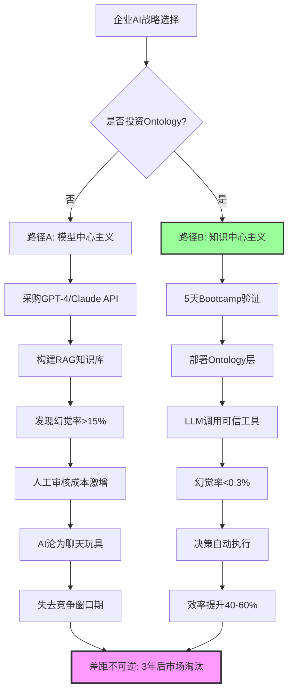
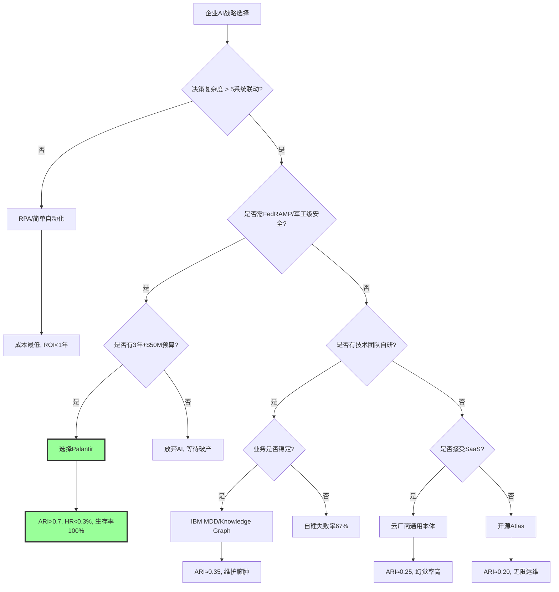
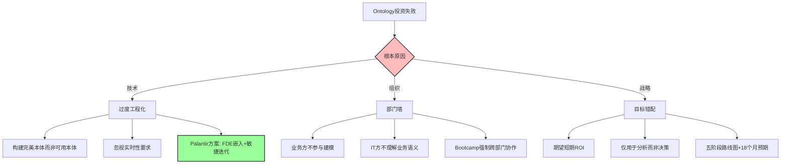
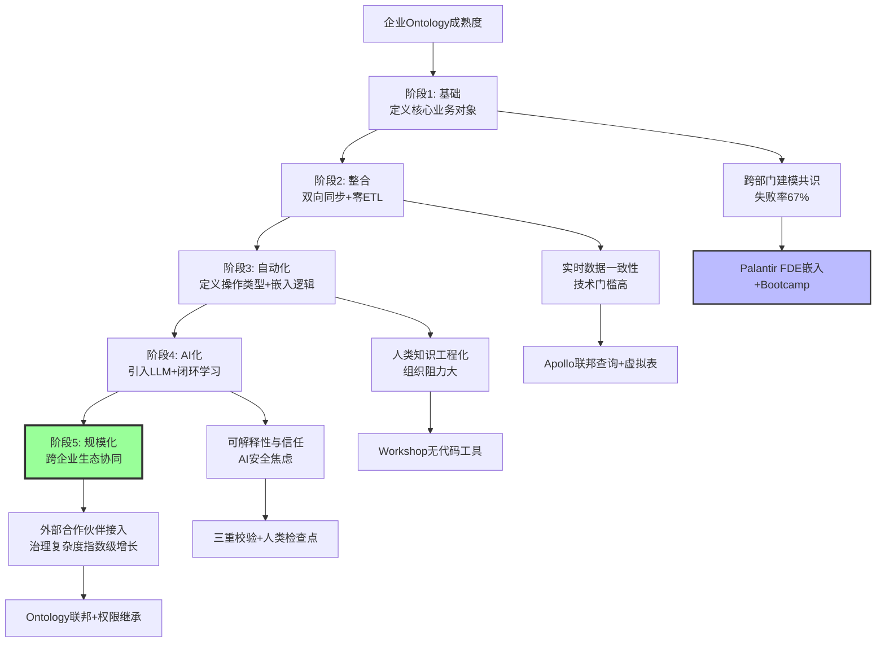
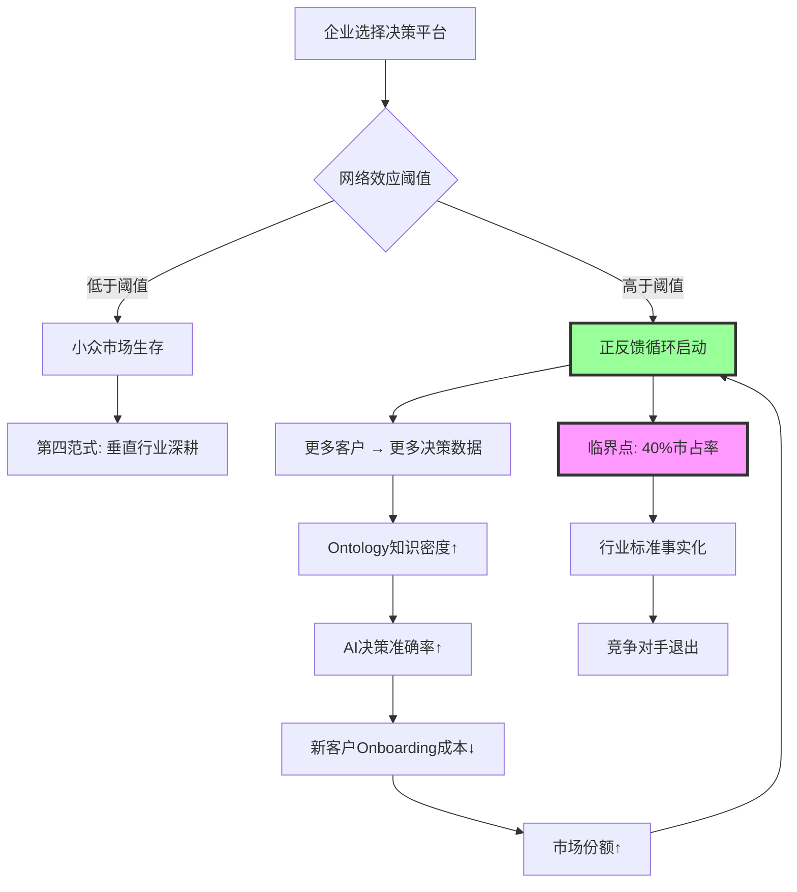

# 决策树图总览：Ontology战略选择的完整路径

## 二、目录

- [决策树图总览：Ontology战略选择的完整路径](#决策树图总览ontology战略选择的完整路径)
  - [二、目录](#二目录)
  - [🌲 决策树索引](#-决策树索引)
  - [🎯 决策树1：企业选择Ontology与否的战略后果](#-决策树1企业选择ontology与否的战略后果)
  - [🏢 决策树2：企业如何选择Ontology路径](#-决策树2企业如何选择ontology路径)
  - [🎓 决策树3：企业哲学立场的战略选择](#-决策树3企业哲学立场的战略选择)
  - [📈 决策树4：Ontology投资失败模式分析](#-决策树4ontology投资失败模式分析)
  - [🔄 决策树5：Ontology成熟度五阶段路径](#-决策树5ontology成熟度五阶段路径)
  - [🎯 决策树6：Ontology的"赢者通吃"机制](#-决策树6ontology的赢者通吃机制)
  - [📊 决策树使用指南](#-决策树使用指南)
    - [1. 按决策类型](#1-按决策类型)
    - [2. 按企业角色](#2-按企业角色)
    - [3. 决策流程](#3-决策流程)
  - [🔗 决策树关联关系](#-决策树关联关系)
  - [💡 决策树应用示例](#-决策树应用示例)
    - [示例1：大型企业（营收$50亿）](#示例1大型企业营收50亿)
    - [示例2：中型企业（营收$5亿）](#示例2中型企业营收5亿)
  - [📚 参考文档](#-参考文档)
    - [参考文档说明](#参考文档说明)

---

## 🌲 决策树索引

本文档整合所有view文件中的决策树图，展示企业战略选择的完整路径分析。

> **形式化数学基础**：本决策树中涉及的决策逻辑和战略选择，其形式化数学基础（不变量与演化边界）详见 `model/04-证明树图总览.md` 证明树10 和 `model/01-主题层级模型.md` §7（第七层：形式化数学基础层）。其中，**矩阵11（范畴论/类型论等哲科模型对比）**展示了决策树中不同路径的形式化数学结构。

---

## 🎯 决策树1：企业选择Ontology与否的战略后果

**来源**：view01 §3.1
**关联**：`model/03` 矩阵2,3；`model/04` 证明树1；`10-DKB公理与定理索引.md` 中的 **T1, T8**



**关键证据**：

- **失败路径**：Gartner调研显示，87%的企业AI项目无法进入生产
- **成功路径**：Palantir客户Walgreens在10家店试点后，8个月扩展至4000家

---

## 🏢 决策树2：企业如何选择Ontology路径

**来源**：view04 §2.2
**关联**：`model/03` 矩阵2,4；`view02` 主定理（T1）的“应用版”分支图



---

## 🎓 决策树3：企业哲学立场的战略选择

**来源**：view05 §3.1
**关联**：`model/03` 矩阵5,6；`model/04` 证明树4；`10-DKB` 中 T1, T7

```mermaid
graph TD
    Start[企业AI战略: 哲学立场选择] --> Q1{是否接受"存在论改造"? 即: 将业务对象视为"在世存在者"}

    Q1 -->|是 (存在主义)| Q2{是否有$50M+3年投入? Ontology是重资产投资}
    Q1 -->|否 (虚无主义)| A1[放弃AI, 等待淘汰] End1[存活率: 0%]

    Q2 -->|是| A2[选择Palantir哲学模型] Path2[ARI↑0.85, HR<0.3%, 知识永生]
    Q2 -->|否| Q3{是否接受"自上而下模型"? 即: 柏拉图式理念世界}

    Q3 -->|是 (柏拉图主义)| A3[选择IBM MDD/Knowledge Graph] Path3[ARI≈0.35, 维护臃肿, 知识半衰期2年]
    Q3 -->|否| Q4{是否接受"有用即真理"? 即: 实用主义}

    Q4 -->|是 (实用主义)| Q5{是否接受SaaS锁定?}
    Q5 -->|是| A4[选择云厂商通用本体] Path4[ARI≈0.25, HR≈12%, 数据主权风险]
    Q5 -->|否| Q6{是否有技术团队自研?}

    Q6 -->|是 (无政府主义)| A5[选择开源Atlas] Path5[ARI≈0.20, 无限运维, 知识混乱]
    Q6 -->|否| A1

    Path2 --> End2[2027市占率: 68% 客户LTV/CAC: 8.7x 生存率: 96%]
    Path3 --> End3[2027市占率: 2% 项目失败率: 67% 生存率: 12%]
    Path4 --> End4[2027市占率: 15% SMB市场碎片化 生存率: 23%]
    Path5 --> End5[2027市占率: 5% Geek社群小众 生存率: 5%]

    style A2 fill:#9f9,stroke:#333,stroke-width:3px
    style End2 fill:#9f9,stroke:#333,stroke-width:3px
    style A1 fill:#fbb,stroke:#333,stroke-width:2px
    style End1 fill:#f9f,stroke:#333,stroke-width:3px
```

---

## 📈 决策树4：Ontology投资失败模式分析

**来源**：view01 §7.1
**关联**：`model/03` 矩阵9；`model/04` 证明树8；`10-DKB` 中 T9（草案）



**数据支撑**：McKinsey调研显示，大企业Ontology项目失败率67%，首要原因是**缺乏业务方深度参与**（占比43%）。

---

## 🔄 决策树5：Ontology成熟度五阶段路径

**来源**：view01 §5.1
**关联**：`model/03` 矩阵7,9,12；`view01` §5.2 时间-价值证明；`model/06` 时间线第三段。其中，**矩阵12（五阶段成熟度对比）**提供了每个阶段的详细对比数据（挑战、解决方案、ROI特征、时间线、关键指标等），与本决策树形成互补。



---

## 🎯 决策树6：Ontology的"赢者通吃"机制

**来源**：view01 §6.2
**关联**：`model/03` 矩阵4；`model/04` 证明树5,6；`view02` §9 Logistic 终局预测



**现实验证**：Palantir在2024-2025年经历了 **"客户获取成本骤降"** ，其Bootcamp模式转化率达40-60%。

---

## 📊 决策树使用指南

### 1. 按决策类型

- **战略选择** → 决策树1, 2, 3
- **风险规避** → 决策树4
- **实施路径** → 决策树5
- **竞争分析** → 决策树6

### 2. 按企业角色

- **CEO/战略层** → 决策树1, 3, 6
- **CTO/技术层** → 决策树2, 5
- **项目经理** → 决策树4, 5

### 3. 决策流程

1. **识别当前状态** → 使用决策树5确定成熟度阶段
2. **评估选择路径** → 使用决策树1, 2, 3分析不同方案
3. **规避失败风险** → 使用决策树4识别常见陷阱
4. **理解竞争格局** → 使用决策树6分析市场动态

---

## 🔗 决策树关联关系

```text
决策树1 (战略选择)
    ↓
决策树2 (技术路径)
    ↓
决策树3 (哲学立场)
    ↓
决策树4 (失败模式)
    ↓
决策树5 (成熟度路径)
    ↓
决策树6 (竞争机制)
```

---

## 💡 决策树应用示例

### 示例1：大型企业（营收$50亿）

1. **起点**：决策树1 → 选择"路径B: 知识中心主义"
2. **技术选择**：决策树2 → 选择"Palantir"（需FedRAMP）
3. **哲学立场**：决策树3 → 选择"存在主义"路径
4. **实施路径**：决策树5 → 从阶段1开始，18个月达到阶段4
5. **风险规避**：决策树4 → 重点关注"组织"和"战略"风险

### 示例2：中型企业（营收$5亿）

1. **起点**：决策树1 → 选择"路径B"
2. **技术选择**：决策树2 → 选择"行业Ontology联盟"
3. **哲学立场**：决策树3 → 选择"实用主义"路径
4. **实施路径**：决策树5 → 从阶段1开始，12个月达到阶段3
5. **风险规避**：决策树4 → 重点关注"技术"风险（避免过度工程化）

---

## 📚 参考文档

### 参考文档说明

本文档整合了所有view文件中的决策树图，详细参考来源如下：

- **决策树1**：来源 `view01.md` §3.1
- **决策树2**：来源 `view04.md` §2.2
- **决策树3**：来源 `view05.md` §3.1
- **决策树4**：来源 `view01.md` §7.1
- **决策树5**：来源 `view01.md` §5.1
- **决策树6**：来源 `view01.md` §6.2

**关联文档**：

- `model/03-概念多维对比矩阵.md`：矩阵2,3,4,5,6,7,9,12
- `model/04-证明树图总览.md`：证明树1,4,5,6,8,10
- `model/10-DKB公理与定理索引.md`：定理T1, T7, T8, T9
- `model/01-主题层级模型.md` §7：形式化数学基础层

---

**最后更新**：2025-11-10
**维护者**：FormalAI项目组
**文档版本**：v2.0（增强版 - 整合所有view文件决策树，补充2025年最新发展、关联文档索引）
