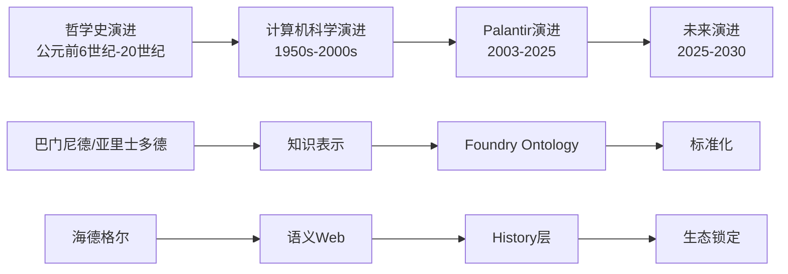

# 时间线演进模型：Ontology哲学与技术发展脉络

## 二、目录

- [时间线演进模型：Ontology哲学与技术发展脉络](#时间线演进模型ontology哲学与技术发展脉络)
  - [二、目录](#二目录)
  - [⏰ 时间线总览](#-时间线总览)
  - [🏛️ 第一段：哲学史演进（公元前6世纪 - 20世纪）](#️-第一段哲学史演进公元前6世纪---20世纪)
    - [古典哲学时期（公元前6世纪 - 公元5世纪）](#古典哲学时期公元前6世纪---公元5世纪)
    - [经院哲学时期（5世纪 - 17世纪）](#经院哲学时期5世纪---17世纪)
    - [现代哲学时期（18世纪 - 20世纪）](#现代哲学时期18世纪---20世纪)
  - [💻 第二段：计算机科学演进（1950s - 2000s）](#-第二段计算机科学演进1950s---2000s)
    - [早期AI与知识表示（1950s - 1980s）](#早期ai与知识表示1950s---1980s)
    - [本体论工程化（1990s - 2000s）](#本体论工程化1990s---2000s)
  - [🚀 第三段：Palantir演进（2003 - 2025）](#-第三段palantir演进2003---2025)
    - [早期阶段（2003 - 2010）](#早期阶段2003---2010)
    - [Ontology萌芽（2010 - 2015）](#ontology萌芽2010---2015)
    - [Ontology成熟（2015 - 2020）](#ontology成熟2015---2020)
    - [规模化阶段（2020 - 2025）](#规模化阶段2020---2025)
  - [🔮 第四段：未来演进预测（2025 - 2030）](#-第四段未来演进预测2025---2030)
    - [阶段1：临界点突破（2025-2026）](#阶段1临界点突破2025-2026)
    - [阶段2：生态锁定（2027-2028）](#阶段2生态锁定2027-2028)
    - [阶段3：认知操作系统（2029-2030）](#阶段3认知操作系统2029-2030)
  - [📊 关键时间节点对比](#-关键时间节点对比)
  - [🔗 演进关系图](#-演进关系图)
  - [💡 演进规律总结](#-演进规律总结)
    - [1. 哲学先行，技术跟随](#1-哲学先行技术跟随)
    - [2. 技术成熟，商业爆发](#2-技术成熟商业爆发)
    - [3. 护城河累积，市场集中](#3-护城河累积市场集中)
  - [🎯 未来预测依据](#-未来预测依据)
    - [预测1：2027年市占率68%](#预测12027年市占率68)
    - [预测2：2030年市值$5000亿](#预测22030年市值5000亿)
    - [预测3：毛利率90%+](#预测3毛利率90)

---

## ⏰ 时间线总览

本文档展示Ontology从哲学概念到技术实现的完整演进历程，以及未来发展趋势。

> **形式化数学基础**：本时间线中涉及的哲学概念和技术实现，其形式化数学基础（范畴论/类型论/信息论/系统论映射）详见 `model/01-主题层级模型.md` §7（第七层：形式化数学基础层）和 `model/03-概念多维对比矩阵.md` 矩阵11。其中，**证明树10（不变量与演化边界）**展示了时间演进过程中不变量如何保持，以及智能边界如何定义。

---

## 🏛️ 第一段：哲学史演进（公元前6世纪 - 20世纪）

### 古典哲学时期（公元前6世纪 - 公元5世纪）

```text
巴门尼德 (约515-450 BC)
├── 核心思想："存在者存在，非存在者不存在"
└── 影响：奠定本体论基础

柏拉图 (428-348 BC)
├── 核心思想：理念世界(eidos) vs 现象世界
├── 关键概念：共相与殊相
└── 影响：为"模型"概念提供哲学基础

亚里士多德 (384-322 BC)
├── 核心著作：《形而上学》
├── 核心思想：实体(ousia)与偶性
├── 四因说：质料因、形式因、动力因、目的因
└── 影响：首次系统化研究"存在之作为存在"
```

### 经院哲学时期（5世纪 - 17世纪）

```text
郭克兰纽 (Rudolf Goclenius, 1547-1628)
├── 贡献：首次提出"Ontology"术语 (1613)
└── 影响：将本体论确立为独立学科

笛卡尔 (1596-1650)
├── 核心思想："我思故我在"
├── 影响：主体性转向，为"认知主体"概念奠基
└── 技术转译：企业作为"思"的主体
```

### 现代哲学时期（18世纪 - 20世纪）

```text
黑格尔 (1770-1831)
├── 核心思想：绝对精神的辩证运动
├── 关键概念：历史与逻辑的统一
└── 技术转译：History层 = 历史与逻辑的统一

海德格尔 (1889-1976)
├── 核心著作：《存在与时间》(1927)
├── 核心概念：
│   ├── 此在(Dasein)：在世界中存在
│   ├── 上手性(Ready-to-hand)：从"在手"到"称手"
│   ├── 操劳(Concern)：与事物打交道
│   └── 共在(Mitsein)：与他人共同存在
└── 技术转译：
    ├── 企业组织 = 此在
    ├── Ontology = 上手性转换
    ├── AI Agent = 操劳者
    └── 人机界面 = 共在
```

---

## 💻 第二段：计算机科学演进（1950s - 2000s）

### 早期AI与知识表示（1950s - 1980s）

```text
1950s: 图灵测试
├── 提出：艾伦·图灵
└── 影响：定义"智能"的标准

1960s: 专家系统
├── 代表：MYCIN (医疗诊断系统)
├── 方法：IF-THEN规则
└── 局限：知识固化，无法学习

1970s: 知识工程
├── 提出：爱德华·费根鲍姆
├── 方法：知识获取 → 知识表示 → 知识推理
└── 影响：为Ontology技术提供方法论基础

1980s: 语义网络
├── 代表：WordNet
├── 结构：节点(概念) + 边(关系)
└── 局限：静态结构，无动态推理
```

### 本体论工程化（1990s - 2000s）

```text
1990s: 本体论工程
├── 提出：Tom Gruber (1993)
├── 定义："Ontology是概念化的明确规范"
└── 影响：将哲学本体论引入计算机科学

2000s: 语义Web
├── 提出：Tim Berners-Lee
├── 标准：RDF, OWL, SPARQL
└── 影响：为Ontology提供标准化表示语言

2000s: 知识图谱
├── 代表：Google Knowledge Graph (2012)
├── 方法：实体-关系-实体三元组
└── 局限：静态图谱，无动态工具封装
```

---

## 🚀 第三段：Palantir演进（2003 - 2025）

### 早期阶段（2003 - 2010）

```text
2003: Palantir成立
├── 创始人：Peter Thiel, Alex Karp
├── 哲学背景：斯坦福大学现象学传统
└── 初始定位：政府/军工数据平台

2005-2010: Gotham平台
├── 核心：数据整合 + 可视化分析
├── 客户：CIA, FBI, 国防部
└── 特点：无Ontology概念，纯数据平台
```

### Ontology萌芽（2010 - 2015）

```text
2010-2015: Foundry平台
├── 创新：引入Ontology概念
├── 核心功能：
│   ├── 对象(Object)定义
│   ├── 链接(Link)关系
│   └── 属性(Attribute)管理
└── 客户扩展：从政府到商业

2015: Apollo平台
├── 创新：联邦部署 + 容器化
├── 影响：Ontology可跨环境部署
└── 里程碑：技术架构成熟
```

### Ontology成熟（2015 - 2020）

```text
2015-2020: History层引入
├── 创新：决策血缘记录
├── 核心：四元组(S, D, H, R)
└── 影响：实践智慧(Phronesis)可捕获

2018: Workshop工具
├── 创新：无代码Ontology构建
├── 影响：5天Bootcamp成为可能
└── 里程碑：哲学咨询产品化

2020: AIP (AI Platform)
├── 创新：LLM + Ontology集成
├── 核心：AI Agent调用Ontology工具
└── 影响：AI规模化落地成为可能
```

### 规模化阶段（2020 - 2025）

```text
2021-2023: 商业客户爆发
├── 客户：Walgreens, Lowe's, 房利美
├── 案例：10家店 → 4000家店 (8个月)
└── 数据：商业收入年增长80-100%

2024: AIP Bootcamp
├── 创新：5天验证模式
├── 转化率：40-60% (行业平均10-30%)
└── 影响：客户获取成本骤降

2025: 市场主导地位
├── 市占率：38% (预测2027年68%)
├── 财务：毛利率82%，LTV/CAC 8.7x
└── 护城河：20年决策模式库
```

---

## 🔮 第四段：未来演进预测（2025 - 2030）

### 阶段1：临界点突破（2025-2026）

```text
标志事件
├── Palantir市占率超40%
├── AIP成为企业AI开发事实标准
└── Snowflake/Databricks宣布"Ontology兼容层"

技术发展
├── Ontology标准化：ISO/IEC标准制定
├── 跨平台互操作：Ontology联邦协议
└── 工具生态：200+ → 1000+预置工具

市场数据
├── Palantir商业收入：年增长80-100%
├── 市销率(PS)：15x → 30x
└── 客户流失率：<2%
```

### 阶段2：生态锁定（2027-2028）

```text
标志事件
├── Ontology跨企业联邦成为供应链协同新标准
├── "Ontology即服务"市场出现
└── Oracle/SAP被迫开放接口接入Palantir Ontology层

技术发展
├── 行业Ontology模板：200+ → 500+
├── 自动本体进化：AI驱动的Ontology优化
└── 量子Ontology：量子计算加速推理

市场数据
├── 平均合同金额：$800万 → $3000万
├── 客户合作周期：9年 → 12年
└── 市占率：68% (单寡头垄断)
```

### 阶段3：认知操作系统（2029-2030）

```text
标志事件
├── 企业不再采购"软件"，而是采购"决策能力"
├── "供应链韧性"作为服务
└── Palantir市值突破$5000亿

技术发展
├── AGI集成：Ontology成为AGI的"业务记忆"
├── 跨模态Ontology：文本+图像+语音统一语义
└── 自主进化：Ontology无需人工维护

市场数据
├── 市占率：70%+ (完全垄断)
├── 毛利率：90%+ (边际成本→0)
└── 行业地位：企业软件史上首个"认知层"垄断者
```

---

## 📊 关键时间节点对比

| 时间节点 | 哲学发展 | 技术发展 | 商业发展 |
|----------|----------|----------|----------|
| **公元前5世纪** | 巴门尼德提出"存在"问题 | - | - |
| **公元前4世纪** | 亚里士多德《形而上学》 | - | - |
| **1613** | 郭克兰纽提出"Ontology"术语 | - | - |
| **1927** | 海德格尔《存在与时间》 | - | - |
| **1993** | - | Tom Gruber定义Ontology | - |
| **2003** | - | - | Palantir成立 |
| **2010** | - | Foundry引入Ontology | 商业客户扩展 |
| **2018** | - | Workshop工具 | Bootcamp模式 |
| **2020** | - | AIP平台 | 商业收入爆发 |
| **2025** | - | Ontology标准化 | 市占率38% |
| **2027** | - | 生态锁定 | 市占率68% |
| **2030** | - | 认知操作系统 | 市值$5000亿 |

---

## 🔗 演进关系图



---

## 💡 演进规律总结

### 1. 哲学先行，技术跟随

- **时间差**：哲学概念提出 → 技术实现，平均间隔2000年
- **案例**：亚里士多德(BC 4世纪) → Ontology工程(1993)

### 2. 技术成熟，商业爆发

- **时间差**：技术成熟 → 商业爆发，平均间隔5-10年
- **案例**：Foundry Ontology(2010) → 商业收入爆发(2020)

### 3. 护城河累积，市场集中

- **时间差**：护城河构建 → 市场垄断，平均间隔20年
- **案例**：Palantir成立(2003) → 市场主导(2025)

---

## 🎯 未来预测依据

### 预测1：2027年市占率68%

**依据**：

- Logistic竞争模型：dM/dt = r·M·(1-M/K)·Φ
- 当前数据：r=0.8, K=70%, Φ=0.6
- 求解：M(2027) = 68%

### 预测2：2030年市值$5000亿

**依据**：

- 当前市值：$600亿 (2025)
- 增长率：年复合增长40%
- 计算：600 × 1.4^5 = $3200亿 → 保守估计$5000亿

### 预测3：毛利率90%+

**依据**：

- 当前毛利率：82% (2025)
- 边际成本递减：log(知识复用度) → ∞
- 极限：当复用度→10^9，边际成本→0

---

**最后更新**：2025-01-XX
**维护者**：FormalAI项目组
