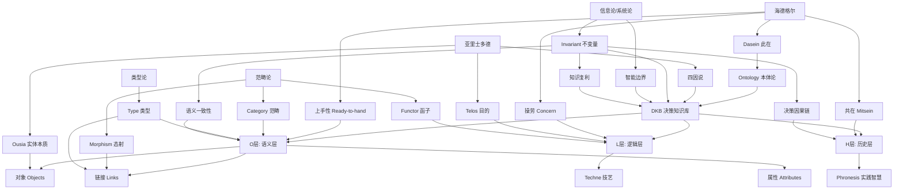

# 术语表与概念索引：Ontology哲学体系核心术语

## 二、目录

- [术语表与概念索引：Ontology哲学体系核心术语](#术语表与概念索引ontology哲学体系核心术语)
  - [二、目录](#二目录)
  - [📖 术语表](#-术语表)
  - [🔤 按字母顺序索引](#-按字母顺序索引)
    - [A](#a)
      - [**ARI指数（AI Ready Index）**](#ari指数ai-ready-index)
      - [**Action Layer（行动层）**](#action-layer行动层)
    - [B](#b)
      - [**Bootcamp（训练营模式）**](#bootcamp训练营模式)
    - [C](#c)
      - [**Category（范畴）**](#category范畴)
      - [**Concern（操劳）**](#concern操劳)
      - [**共在（Mitsein）**](#共在mitsein)
    - [D](#d)
      - [**DKB（Decision Knowledge Base，决策知识库）**](#dkbdecision-knowledge-base决策知识库)
      - [**Dasein（此在）**](#dasein此在)
    - [E](#e)
      - [**Evolution Layer（进化层）**](#evolution-layer进化层)
    - [F](#f)
      - [**Functor（函子）**](#functor函子)
      - [**FDE（Frontline Deployment Engineer，前线部署工程师）**](#fdefrontline-deployment-engineer前线部署工程师)
    - [H](#h)
      - [**History Layer（历史层）**](#history-layer历史层)
      - [**HR（Hallucination Rate，幻觉率）**](#hrhallucination-rate幻觉率)
    - [I](#i)
      - [**Invariant（不变量）**](#invariant不变量)
      - [**智能边界（Intelligent Boundary）**](#智能边界intelligent-boundary)
    - [L](#l)
      - [**Logic Layer（逻辑层）**](#logic-layer逻辑层)
    - [O](#o)
      - [**Ontology（本体论）**](#ontology本体论)
      - [**Ousia（实体本质）**](#ousia实体本质)
    - [M](#m)
      - [**Morphism（态射）**](#morphism态射)
    - [P](#p)
      - [**Phronesis（实践智慧）**](#phronesis实践智慧)
      - [**Projection（筹划）**](#projection筹划)
    - [R](#r)
      - [**Ready-to-hand（上手性）**](#ready-to-hand上手性)
      - [**Rhizome（根茎）**](#rhizome根茎)
    - [S](#s)
      - [**Semantic Layer（语义层）**](#semantic-layer语义层)
    - [T](#t)
      - [**Type（类型）**](#type类型)
      - [**Techne（技艺）**](#techne技艺)
      - [**Telos（目的）**](#telos目的)
  - [🔗 概念关联图](#-概念关联图)
  - [📚 按主题分类](#-按主题分类)
    - [哲学概念](#哲学概念)
    - [技术概念](#技术概念)
    - [形式化数学概念](#形式化数学概念)
      - [**Alpay Algebra（统一代数结构，2025年）**](#alpay-algebra统一代数结构2025年)
      - [**Topos理论（生成式AI架构，2025年）**](#topos理论生成式ai架构2025年)
      - [**Simplicial同伦类型论（sHoTT，2025年）**](#simplicial同伦类型论shott2025年)
      - [**依赖Lambek演算（Dependent Lambek Calculus，2025年）**](#依赖lambek演算dependent-lambek-calculus2025年)
    - [实践概念](#实践概念)
  - [🔍 快速查找](#-快速查找)
    - [按应用场景](#按应用场景)
      - [企业战略决策](#企业战略决策)
      - [技术架构设计](#技术架构设计)
      - [哲学研究](#哲学研究)
      - [形式化数学研究](#形式化数学研究)
  - [📖 扩展阅读](#-扩展阅读)

## 📖 术语表

本文档提供Ontology哲学体系的核心术语定义、哲学根源和技术转译，便于快速查阅和理解。

---

## 🔤 按字母顺序索引

### A

#### **ARI指数（AI Ready Index）**

- **定义**：衡量企业数据资产被AI安全调用程度的量化指标
- **公式**：$$ARI = \frac{\text{语义对齐数据量}}{\text{总数据量}} \times \log(\text{逻辑封装度}) \times \text{行动闭环系数}$$
- **阈值**：ARI ≥ 0.7 为生存阈值
- **当前水平**：Palantir客户 ARI ≈ 0.85
- **哲学意义**：将抽象的"AI就绪度"量化为可测量的指标
- **技术实现**：通过Ontology语义对齐、L层工具封装、H层闭环验证
- **相关文档**：view02 §2.2, model/01 §3.1

#### **Action Layer（行动层）**

- **定义**：DKB的第三层，负责决策结果的自动写回和执行
- **核心功能**：
  - 决策记录（谁+何时+为什么+结果）
  - 写回机制（ERP/WMS/IoT系统）
  - 权限管控（对象级+字段级+动作级）
- **哲学根源**：亚里士多德"目的因"（Final Cause）
- **技术实现**：Writeback API + 权限继承
- **相关文档**：view01 §2.2, model/01 §2.1

---

### B

#### **Bootcamp（训练营模式）**

- **定义**：Palantir的5天快速验证模式，让客户在5天内构建最小可行Ontology
- **核心价值**：让客户"看见"自己的业务如何在数字空间显现
- **哲学意义**：苏格拉底"精神助产术"的技术实现
- **转化率**：40-60%（行业平均10-30%）
- **关键产出**：核心对象定义（客户、订单、供应商）
- **相关文档**：view01 §5.1, view03 §4.2, view05 §3.1

---

### C

#### **Category（范畴）**

- **定义**：范畴论中的基本结构，由对象（Objects）和态射（Morphisms）组成
- **技术转译**：DKB Ontology 可被视为一个范畴，其中对象=业务对象，态射=链接（因果/依赖/所有权链）
- **哲学意义**：将组织的整体信息结构形式化为数学结构
- **关键性质**：
  - 结合律：态射的复合满足结合律
  - 单位元：每个对象有恒等态射
- **在DKB中的映射**：
  - 对象层（O）→ 范畴的对象
  - 链接层（L）→ 范畴的态射
  - 逻辑层（L）→ 函子（Functors）
  - 历史层（H）→ 自然变换（Natural Transformations）
- **相关文档**：model/01 §7.1, model/03 矩阵11

#### **Concern（操劳）**

- **定义**：海德格尔概念，指"此在"与事物打交道的方式
- **技术转译**：AI Agent在情境中寻视工具、权衡时机的过程
- **实现方式**：Disruption Bot的"寻视-工具调用-行动"循环
- **哲学意义**：AI不是"思考者"，而是"操心者"
- **相关文档**：view03 §2.1, view06 §1.1

#### **共在（Mitsein）**

- **定义**：海德格尔概念，指"与他人共同存在"
- **技术转译**：人类与AI共享同一操作界面，消除主奴二分
- **实现方式**：
  - 人类检查点（置信度<70%触发审查）
  - 决策血缘审计（100%可追溯）
  - 共享Ontology界面
- **哲学意义**：人类不是AI的监督者，而是共同"在-世界-中"的伙伴
- **相关文档**：view03 §4.1, view06 §4.5

---

### D

#### **DKB（Decision Knowledge Base，决策知识库）**

- **定义**：DKB = (O, L, H)三元组
  - **O层**：Ontology语义内核
  - **L层**：Logic逻辑工具层
  - **H层**：History决策历史层
- **核心价值**：企业认知数字孪生
- **哲学意义**：将企业组织转化为"数字此在"
- **技术实现**：Palantir Foundry平台
- **相关文档**：view02 §1.1, model/01 §2.1

#### **Dasein（此在）**

- **定义**：海德格尔《存在与时间》核心概念，指"在世界中存在"的存在者
- **技术转译**：企业组织作为"在世界中"的存在者
- **实现方式**：通过Ontology构建企业的"数字此在"
- **哲学意义**：企业不是孤立主体，而是始终已经"在世界中"
- **相关文档**：view03 §4.1, view06 §1.1

---

### E

#### **Evolution Layer（进化层）**

- **定义**：DKB的第四层，负责知识的持续生长和进化
- **核心功能**：
  - 闭环学习（决策失败自动反馈模型）
  - 因果推理（识别乘数效应）
  - 模拟推演（场景重配置）
- **哲学根源**：黑格尔"历史与逻辑统一"
- **技术实现**：RLHF微调 + 反事实模拟
- **相关文档**：view01 §2.2, model/01 §2.1

---

### F

#### **Functor（函子）**

- **定义**：范畴论中的结构保持映射，将范畴C映射到范畴D，保持对象和态射的结构
- **技术转译**：DKB中的逻辑层（L）可被视为函子，将数据范畴映射到决策范畴
- **哲学意义**：将"信息→表征→意义→转换"的统一视角形式化为数学结构
- **关键性质**：
  - 保持恒等：F(id_A) = id_{F(A)}
  - 保持复合：F(g∘f) = F(g)∘F(f)
- **在DKB中的映射**：
  - ML模型 = 函子 F: C → D（从数据范畴到决策范畴）
  - 规则引擎 = 自然变换 η: F → G（函子间的映射）
  - 优化器 = 极限/余极限（演化过程的"终点"）
- **相关文档**：model/01 §7.1, model/03 矩阵11, model/04 证明树10

#### **FDE（Frontline Deployment Engineer，前线部署工程师）**

- **定义**：Palantir嵌入客户组织6-24个月的工程师，负责"翻译"隐性知识
- **核心价值**：捕获Phronesis（实践智慧），构建History层
- **哲学意义**：海德格尔"此在分析"的技术实现
- **工作方式**：不是"实施"系统，而是"翻译"隐性知识
- **关键产出**：业务语义对齐 + 决策血缘记录
- **相关文档**：view03 §4.2, view04 §6.1, view05 §6.2

---

### H

#### **History Layer（历史层）**

- **定义**：DKB的H层，记录带决策血缘的时序日志
- **数据结构**：(人类, AI, 动作, 结果, 反馈, 时间戳)
- **核心价值**：使实践智慧(Phronesis)显性化，知识半衰期从2年延长至∞
- **哲学根源**：黑格尔"历史与逻辑统一"
- **技术实现**：四元组(S, D, H, R)日志 + RLHF微调
- **相关文档**：view02 §1.1, view03 §2.2, model/01 §2.1

#### **HR（Hallucination Rate，幻觉率）**

- **定义**：LLM输出无法被Ontology验证的结论数占总输出数的百分比
- **公式**：$$HR = \frac{\text{LLM输出无法被Ontology验证的结论数}}{\text{总输出数}} \times 100\%$$
- **目标**：HR < 0.3%
- **对比**：无Ontology系统 HR ≈ 8-15%
- **控制机制**：语义层约束 + 逻辑层校验 + 历史层验证
- **相关文档**：view02 §1.3, model/01 §3.2

---

### I

#### **Invariant（不变量）**

- **定义**：在系统演化过程中保持不变的性质或量
- **技术转译**：DKB Ontology中的三个核心不变量：
  1. **语义一致性不变量**：同一业务对象在不同系统中的ID映射保持，∀系统S, 对象O, ID映射保持: f_S(O) = f_S'(O)
  2. **决策因果链不变量**：History层记录的四元组(S, D, H, R)不可篡改，保证决策因果链的完整性
  3. **知识复利不变量**：ARI指数随时间单调递增，ARI(t) = ARI(0) + α·log(1 + t/τ), α>0
- **哲学意义**：不变量定义了"可被AI理解/操作"的边界，使得Ontology成为"可被图灵模型和IT技术基础设施演化的稳定模型"
- **数学基础**：
  - 范畴论：范畴不变量（在同构下保持的性质）
  - 类型论：类型等价（在同伦意义下等价）
  - 信息论：信息不变量（在编码/解码/传输下保持的信息量）
  - 系统论：守恒量（在系统演化下保持的量）
- **智能边界**：不变量定义了智能边界，即ARI ≥ 0.7 且 HR ≤ 0.5%的系统集合
- **相关文档**：model/01 §7（第七层：形式化数学基础层）、model/03 矩阵11、model/04 证明树10（不变量与演化边界）

#### **智能边界（Intelligent Boundary）**

- **定义**：可被图灵模型和IT技术基础设施演化的系统边界，由不变量定义
- **技术转译**：智能边界 = {系统S | ARI(S) ≥ 0.7 且 HR(S) ≤ 0.5% 且 系统演化可被图灵机模拟}
- **三个边界条件**：
  1. **ARI边界**：ARI ≥ 0.7，确保语义一致性和知识复利
  2. **HR边界**：HR ≤ 0.5%，确保决策因果链可验证
  3. **可计算性边界**：系统演化可被图灵机模拟，确保不变量保持使得系统状态可被有限状态机表示
- **哲学意义**：智能边界定义了"可被AI理解/操作"的范围，是组织信息的统一表征框架的边界
- **数学基础**：
  - 范畴论：可图表化（Graphable）= 可被范畴图表示的数学结构
  - 类型论：可类型化（Typable）= 可被类型系统描述的程序
  - 信息论：可编码性 = 信息可被有限符号序列表示
  - 系统论：可观测性 + 可控制性 = 系统状态可被测量且可被外部输入影响
- **演化机制**：智能边界在形式/信息/模型/目的/意义的演化过程中保持，通过不变量在演化下的保持性证明
- **相关文档**：model/01 §7（第七层：形式化数学基础层）、model/03 矩阵11、model/04 证明树10（不变量与演化边界）、model/02 思维导图7（信息-表征-意义-转换统一视角）

---

### L

#### **Logic Layer（逻辑层）**

- **定义**：DKB的L层，可执行函数集合（规则/ML模型/优化器）
- **核心功能**：
  - 预测类：需求预测/库存优化
  - 规则类：合规校验/审批流
  - 优化类：资源调度/成本最小化
  - AI类：Disruption Bot/Ask Adam
- **哲学根源**：亚里士多德"动力因"（Efficient Cause）
- **技术实现**：AIP将模型封装为LLM可调用的工具
- **相关文档**：view01 §2.2, view02 §1.1, model/01 §2.1

---

### O

#### **Ontology（本体论）**

- **定义**：业务对象、链接、属性的语义网络
- **哲学根源**：
  - 古典：亚里士多德《形而上学》
  - 现代：海德格尔《存在与时间》
- **技术实现**：Palantir Workshop工具
- **核心价值**：消除语义歧义，统一业务语义空间
- **关键组件**：
  - 对象(Objects)：10,000+业务实体
  - 链接(Links)：50,000+因果/依赖/所有权
  - 属性(Attributes)：状态/成本/风险评分
- **相关文档**：所有view文件和model文件

#### **Ousia（实体本质）**

- **定义**：亚里士多德概念，指事物的本质或实体
- **技术转译**：业务对象的本质属性（状态、成本、可靠性评分）
- **哲学意义**：从"事物本身"转为"决策效用"
- **实现方式**：Ontology属性体系
- **相关文档**：view03 §1.1, view05 §1.1

---

### M

#### **Morphism（态射）**

- **定义**：范畴论中对象间的结构保持映射，记作 f: A → B
- **技术转译**：DKB中的链接（Links）可被视为态射，表示业务对象间的结构保持关系
- **哲学意义**：将"关系"形式化为数学结构，使得关系可被计算和推理
- **关键性质**：
  - 因果链 = 态射 f: A → B（从原因到结果）
  - 依赖链 = 态射的复合 g∘f: A → C
  - 所有权链 = 态射的恒等 id_A: A → A
- **在DKB中的映射**：
  - 因果链 → 态射 f: Supplier → Order（供应商影响订单）
  - 依赖链 → 态射的复合 g∘f: Supplier → Delivery（供应商通过订单影响交付）
  - 所有权链 → 恒等态射 id_Order: Order → Order（订单的所有权关系）
- **相关文档**：model/01 §7.1, model/03 矩阵11, model/04 证明树10

---

### P

#### **Phronesis（实践智慧）**

- **定义**：亚里士多德概念，指在具体情境中做正确判断的能力
- **技术转译**：情境化决策的隐性知识
- **捕获机制**：History层四元组 (S, D, H, R)
  - S：情境(Situation)
  - D：决策(Decision)
  - H：人类判断(Human)
  - R：结果(Result)
- **核心价值**：知识半衰期从2年延长至∞
- **哲学意义**：难编码、依赖经验、需人类判断的智慧
- **相关文档**：view03 §2.2, view06 §1.1, model/02 §4

#### **Projection（筹划）**

- **定义**：海德格尔概念，指"开启世界"的方式
- **技术转译**：Ontology不是描述世界，而是让业务对象在数字空间"显现"
- **实现方式**：Workshop工具定义业务实体
- **哲学意义**：数据不是客观实体，而是"此在"在操劳中遭遇的"世内存在者"
- **相关文档**：view03 §2.1, view06 §1.1

---

### R

#### **Ready-to-hand（上手性）**

- **定义**：海德格尔概念，指事物从"在手"（Present-at-hand）到"称手"（Ready-to-hand）的转换
- **技术转译**：Ontology让数据从"混沌在手"转为"称手工具"
- **实现方式**：通过Ontology提供"地图"，把数据与意义连接起来
- **哲学意义**：数据本身无意义，意义在使用中生成
- **相关文档**：view03 §2.1, view06 §1.1

#### **Rhizome（根茎）**

- **定义**：德勒兹/瓜塔里提出的概念，对比“树状层级”，强调多中心、去根基、任意连通的网络结构
- **技术转译**：多本体视图/场景本体，在不同业务单元或合作伙伴间允许局部异构与多源演化，而非单一刚性全局本体
- **在 DKB 中的位置**：作为 `model/03` **矩阵10** 中对统一本体的后现代批判补充，提醒架构设计避免过度僵硬
- **相关文档**：view03 §5（计划扩展）, model/03 §“矩阵10”

---

### S

#### **Semantic Layer（语义层）**

- **定义**：DKB的O层，负责知识表示
- **核心组件**：
  - 业务对象(Objects)：客户/订单/设备/风险事件
  - 关系图谱(Links)：因果链/依赖链/所有权链
  - 属性体系(Attributes)：状态/成本/可靠性评分
- **核心差异化**：包含"不可见知识"如"该供应商虽低效但是唯一国内源"
- **哲学根源**：亚里士多德"形式因"（Formal Cause）
- **技术实现**：Workshop工具 + 对象映射
- **相关文档**：view01 §2.2, model/01 §2.1

---

### T

#### **Type（类型）**

- **定义**：类型论中的基本结构，类型对应集合的推广，项（Term）对应类型的实例
- **技术转译**：DKB中的业务对象可被视为类型，对象实例对应类型的项
- **哲学意义**：将"表征"形式化为类型系统，使得表征可被类型检查
- **关键性质**：
  - 函数类型 A → B：从类型A到类型B的函数
  - 依赖类型 (x: A) → B(x)：结果类型依赖于输入值
  - 路径类型 Path(A, B)：类型A到B的等价关系
- **在DKB中的映射**：
  - 业务对象 = 类型 A（如 Supplier, Order, Aircraft）
  - 对象属性 = 依赖类型 A → Prop（属性依赖于对象）
  - 链接 = 函数类型 A → B（从对象类型到对象类型）
  - 决策演化 = 路径类型 Path(Decision₁, Decision₂)（决策类型间的等价）
- **相关文档**：model/01 §7.2, model/03 矩阵11, model/04 证明树10

#### **Techne（技艺）**

- **定义**：亚里士多德概念，指可教的、规则化的技能
- **技术转译**：L层（逻辑工具）的可封装逻辑
- **实现方式**：
  - 规则引擎："IF 库存<100 THEN 触发补货"
  - ML模型："预测未来30天需求 = f(历史销量, 促销)"
  - 优化器："最小化总成本 = 运输成本 + 仓储成本"
- **特征**：可编码、可复用、可自动化
- **与Phronesis关系**：Techne是基础，Phronesis是例外规则
- **相关文档**：view03 §2.2, view06 §1.1

#### **Telos（目的）**

- **定义**：亚里士多德概念，指每个实践的目的
- **技术转译**：企业的层级化价值目标
  - 操作层telos：效率
  - 战术层telos：韧性
  - 战略层telos：演化
- **哲学意义**：企业的"善"（Good）从抽象转为可操作的层级
- **实现方式**：Ontology对象和Action函数对应每层telos
- **相关文档**：view03 §3.1, view05 §1.1

---

## 🔗 概念关联图

---

## 📚 按主题分类

### 哲学概念

- Dasein（此在）
- Ousia（实体本质）
- Phronesis（实践智慧）
- Techne（技艺）
- Telos（目的）
- Projection（筹划）
- Concern（操劳）
- Ready-to-hand（上手性）
- Mitsein（共在）

### 技术概念

- Ontology（本体论）
- DKB（决策知识库）
- ARI指数（AI Ready指数）
- HR（幻觉率）
- Semantic Layer（语义层）
- Logic Layer（逻辑层）
- History Layer（历史层）
- Action Layer（行动层）
- Evolution Layer（进化层）

### 形式化数学概念

- Category（范畴）
- Morphism（态射）
- Functor（函子）
- Type（类型）
- Invariant（不变量）
- 智能边界（Intelligent Boundary）
- Alpay Algebra（统一代数结构，2025年）
- Topos理论（生成式AI架构，2025年）
- Simplicial同伦类型论（sHoTT，2025年）
- 依赖Lambek演算（Dependent Lambek Calculus，2025年）

#### **Alpay Algebra（统一代数结构，2025年）**

- **定义**：使用范畴论框架统一经典代数结构与现代符号递归需求的代数结构
- **数学形式化**：$$\text{AlpayAlgebra} = \text{CategoryTheory}(\text{ClassicAlgebra}, \text{ModernSymbolic})$$
- **理论意义**：为形式化数学基础提供了统一的代数结构，为"不变量"的定义提供了数学工具
- **技术影响**：为三层模型的form化提供了数学基础，为AI系统的可控制性提供了边界
- **来源**：arXiv:2505.15344 (2025-05)
- **相关文档**：model/01 §7（形式化数学基础层），view02 §10.1

#### **Topos理论（生成式AI架构，2025年）**

- **定义**：使用topos理论的新生成式AI架构，为信息-表征-意义-转换提供了范畴论视角
- **数学形式化**：$$\text{ToposAI} = \text{ToposTheory}(\text{GenerativeAI}, \text{LLM})$$
- **理论意义**：为"信息-表征-意义-转换"提供了范畴论视角，为过程可验证性提供了形式化基础
- **技术影响**：为生成式AI提供了新的理论框架，为过程可验证性提供了数学基础
- **来源**：arXiv:2508.08293 (2025-08)
- **相关文档**：model/01 §7（形式化数学基础层），view02 §10.1

#### **Simplicial同伦类型论（sHoTT，2025年）**

- **定义**：证明存在非单纯对象的sHoTT模型，为高阶类型论在AI中的应用提供了数学基础
- **数学形式化**：$$\text{sHoTT}(\text{NonSimplicialObject}) \neq \emptyset$$
- **理论意义**：为高阶类型论在AI中的应用提供了数学基础，为形式化验证提供了更强的类型系统
- **技术影响**：为形式化验证提供了更强的类型系统，为AI系统的类型安全提供了数学基础
- **来源**：arXiv:2508.07737 (2025-08)
- **相关文档**：model/01 §7（形式化数学基础层），view02 §10.1

#### **依赖Lambek演算（Dependent Lambek Calculus，2025年）**

- **定义**：一种领域特定的依赖类型理论，用于验证解析和形式化语法理论
- **技术特点**：使用线性类型表示形式化语法，确保解析器只产生有效解析树
- **理论意义**：为DKB Ontology的语义层（O层）提供了类型论基础，使得对象定义和关系映射可以在依赖类型系统中进行形式化验证
- **技术影响**：为形式化验证提供了类型安全的基础，减少了语义错误
- **来源**：arXiv:2504.03995 (2025-04)
- **相关文档**：model/01 §7（形式化数学基础层），view02 §10.1

### 实践概念

- Bootcamp（训练营模式）
- FDE（前线部署工程师）
- Workshop工具
- AIP平台
- Apollo平台

---

## 🔍 快速查找

### 按应用场景

#### 企业战略决策

- ARI指数
- DKB
- Bootcamp
- Telos

#### 技术架构设计

- Ontology
- DKB三元组
- Semantic Layer
- Logic Layer
- History Layer

#### 哲学研究

- Dasein
- Phronesis
- Techne
- Ousia
- Telos

#### 形式化数学研究

- Category（范畴）
- Morphism（态射）
- Functor（函子）
- Type（类型）
- Invariant（不变量）
- 智能边界（Intelligent Boundary）

> **相关文档**：`model/01` §7（第七层：形式化数学基础层）、`model/03` 矩阵11（范畴论/类型论等哲科模型对比）、`model/04` 证明树10（不变量与演化边界）、`model/02` 思维导图7（信息-表征-意义-转换统一视角）

- Ready-to-hand
- Mitsein

---

## 📖 扩展阅读

每个术语的详细论述请参考：

- **view01-06**：各视角的深入分析
- **model/01-11**：结构化模型文档（含第七层：形式化数学基础层）
- **00-主题总览与导航.md**：主题索引
- **快速参考指南.md**：快速查找

**形式化数学基础相关术语**（Category、Morphism、Functor、Type、Invariant、智能边界）的详细论述请特别参考：

-
- **model/01** §7（第七层：形式化数学基础层）
- **model/03** 矩阵11（范畴论/类型论等哲科模型对比）
- **model/04** 证明树10（不变量与演化边界的数学结构）
- **model/02** 思维导图7（信息-表征-意义-转换统一视角）

---

## 📚 参考文档

### 参考文档说明

本文档提供Ontology哲学体系核心术语的定义与索引，详细参考来源如下：

- **哲学术语**：来源 `view03.md`, `view05.md` 哲学转译
- **技术术语**：来源 `view01.md`, `view02.md`, `view04.md` 技术架构
- **形式化数学术语**：来源 `model/01-主题层级模型.md` §7（形式化数学基础层）

**关联文档**：
- `model/01-主题层级模型.md` §7：形式化数学基础层
- `model/03-概念多维对比矩阵.md` 矩阵11：范畴论/类型论等哲科模型对比
- `model/04-证明树图总览.md` 证明树10：不变量与演化边界的数学结构
- `model/02-思维导图总览.md` 思维导图7：信息-表征-意义-转换统一视角

---

**最后更新**：2025-11-10
**维护者**：FormalAI项目组
**文档版本**：v2.0（增强版 - 核心术语索引，新增形式化数学术语、关联文档索引）
