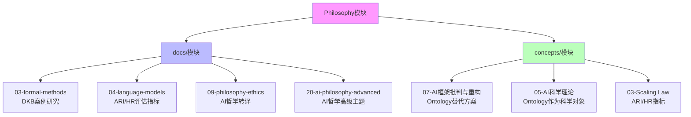

# 跨模块映射索引：Philosophy ↔ docs / concepts

## 一、概述

本文档提供 Philosophy 模块与 `docs/`、`concepts/` 模块之间的详细映射关系，包括对应关系、交叉引用关系、概念映射关系等。

**创建日期**：2025-11-10
**最后更新**：2025-11-10
**维护者**：FormalAI项目组
**文档版本**：v2.0
**状态**：已完成

---

## 二、目录

- [跨模块映射索引：Philosophy ↔ docs / concepts](#跨模块映射索引philosophy--docs--concepts)
  - [一、概述](#一概述)
  - [二、目录](#二目录)
  - [三、核心映射关系总览](#三核心映射关系总览)
  - [四、Philosophy 与 docs/ 的对应关系](#四philosophy-与-docs-的对应关系)
    - [4.1 view01 商业论证层](#41-view01-商业论证层)
    - [4.2 view02 形式化证明层](#42-view02-形式化证明层)
    - [4.3 view03 哲学转译层](#43-view03-哲学转译层)
    - [4.4 view04 行业对比层](#44-view04-行业对比层)
    - [4.5 view05 全景论证层](#45-view05-全景论证层)
    - [4.6 view06 范式革命层](#46-view06-范式革命层)
  - [五、Philosophy 与 concepts/ 的对应关系](#五philosophy-与-concepts-的对应关系)
    - [5.1 Ontology 与 AI 框架批判](#51-ontology-与-ai-框架批判)
    - [5.2 Ontology 与 AI 科学理论](#52-ontology-与-ai-科学理论)
    - [5.3 Ontology 与 Scaling Law / 收敛分析](#53-ontology-与-scaling-law--收敛分析)
    - [5.4 Ontology 与其他 concepts 主题](#54-ontology-与其他-concepts-主题)
  - [六、双向映射：docs / concepts 到 Philosophy](#六双向映射docs--concepts-到-philosophy)
    - [6.1 docs/ 主题到 Philosophy 的映射](#61-docs-主题到-philosophy-的映射)
    - [6.2 concepts/ 主题到 Philosophy 的映射](#62-concepts-主题到-philosophy-的映射)
  - [七、跨模块联合使用建议](#七跨模块联合使用建议)
    - [7.1 课程设计路径](#71-课程设计路径)
    - [7.2 文档导航路径](#72-文档导航路径)
    - [7.3 理论与实践对齐](#73-理论与实践对齐)
  - [八、参考文档](#八参考文档)

---

## 三、核心映射关系总览

**Philosophy 模块的核心价值**：提供 Ontology 作为企业认知基础设施的完整哲学论证体系，从商业价值、形式化证明、哲学转译、行业对比、全景论证到范式革命。

**映射关系总览**：

**核心概念映射**：

| Philosophy 概念 | docs/ 对应 | concepts/ 对应 |
|----------------|------------|---------------|
| **DKB = (O, L, H)** | `docs/03-formal-methods/03.5-DKB案例研究.md` | `concepts/07-AI框架批判与重构/README.md` §7.2 |
| **ARI / HR 指标** | `docs/04-language-models/04.6-AI评估指标.md` | `concepts/03-Scaling Law与收敛分析/` |
| **Ontology 形式化基础** | `docs/03-formal-methods/03.1-形式化验证/README.md` | `concepts/05-AI科学理论/README.md` §9.1 |
| **哲学转译体系** | `docs/09-philosophy-ethics/09.1-AI哲学/README.md` | `concepts/07-AI框架批判与重构/README.md` §7.2 |

---

## 四、Philosophy 与 docs/ 的对应关系

### 4.1 view01 商业论证层

**Philosophy 文档**：`Philosophy/view01.md`

**核心内容**：Ontology 成为新基础设施的商业论证，包括三维能力模型、竞争格局重构、商业价值实证、实施路径等。

**对应 docs/ 文档**：

1. **`docs/04-language-models/`** - 语言模型评估与优化
   - `docs/04-language-models/04.2-评估指标/README.md` - ARI/HR 评估指标
   - `docs/04-language-models/04.3-优化策略/README.md` - 优化策略
   - `docs/04-language-models/04.6-AI评估指标.md` - AI 评估指标（ARI/HR）

2. **`docs/07-alignment-safety/`** - 对齐与安全
   - `docs/07-alignment-safety/07.1-对齐理论/README.md` - 对齐理论
   - `docs/07-alignment-safety/07.2-价值学习/README.md` - 价值学习

**核心映射**：

- **ARI（AI Ready Index）**：`view01.md` 商业论证层 → `docs/04-language-models/04.6-AI评估指标.md`
- **HR（Hallucination Rate）**：`view01.md` 商业论证层 → `docs/04-language-models/04.6-AI评估指标.md`
- **能力维度模型**：`view01.md` §2 → `docs/04-language-models/04.2-评估指标/README.md`
- **五阶段成熟度模型**：`view01.md` §5.1 → `docs/04-language-models/04.3-优化策略/README.md`

### 4.2 view02 形式化证明层

**Philosophy 文档**：`Philosophy/view02.md`

**核心内容**：DKB 形式化系统、公理体系、定理体系、形式化证明、多维表征体系等。

**对应 docs/ 文档**：

1. **`docs/03-formal-methods/`** - 形式化方法
   - `docs/03-formal-methods/03.1-形式化验证/README.md` - 形式化验证
   - `docs/03-formal-methods/03.2-程序综合/README.md` - 程序综合
   - `docs/03-formal-methods/03.5-DKB案例研究.md` - DKB 形式化案例研究（核心文档）

2. **`docs/04-language-models/04.6-AI评估指标.md`** - ARI/HR 评估指标

**核心映射**：

1. **DKB 形式化系统**：
   - **Philosophy 来源**：
     - `view02.md` - DKB = (O, L, H) 三元组定义
     - `model/10-DKB公理与定理索引.md` - A1–A6, L1–L4, T1–T9 公理/引理/定理体系
     - `model/04-证明树图总览.md` - 证明树3/6/7/8/9 对应 T1–T5, T7–T9
   - **docs 文档**：`docs/03-formal-methods/03.5-DKB案例研究.md`

2. **形式化数学基础**：
   - **Philosophy 来源**：
     - `model/01-主题层级模型.md` §7（形式化数学基础层）
     - `model/03-概念多维对比矩阵.md` 矩阵11（范畴论/类型论等哲科模型对比）
   - **docs 文档**：`docs/03-formal-methods/03.1-形式化验证/README.md`

3. **公理体系映射**：
   - **A1（语义鸿沟公理）**：`view02.md` §2 → `docs/03-formal-methods/03.5-DKB案例研究.md`
   - **A2（决策闭环公理）**：`view02.md` §2 → `docs/03-formal-methods/03.2-程序综合/README.md`
   - **A3（知识复利公理）**：`view02.md` §2 → `docs/03-formal-methods/03.5-DKB案例研究.md`
   - **A4（网络效应公理）**：`view02.md` §2 → `docs/03-formal-methods/03.5-DKB案例研究.md`

### 4.3 view03 哲学转译层

**Philosophy 文档**：`Philosophy/view03.md`

**核心内容**：从存在论到决策知识库的哲学转译，包括存在论、认识论、价值论、实践论的完整转译体系。

**对应 docs/ 文档**：

1. **`docs/09-philosophy-ethics/09.1-AI哲学/README.md`** - AI 哲学
   - §6 - Ontology 的哲学转译

2. **`docs/20-ai-philosophy-advanced/`** - AI 哲学高级主题
   - `docs/20-ai-philosophy-advanced/20.1-智能本质/README.md` - 智能本质
   - `docs/20-ai-philosophy-advanced/20.4-AI存在论/README.md` - AI 存在论

**核心映射**：

1. **存在论转译**：
   - **Philosophy 来源**：`view03.md` §1.1 - 存在论（Ontology - Being）
   - **技术实现**：On(存在) → 业务对象(Objects)、Logos(逻各斯) → 链接(Links) + 逻辑(Logic)
   - **docs 文档**：`docs/20-ai-philosophy-advanced/20.4-AI存在论/README.md`

2. **认识论转译**：
   - **Philosophy 来源**：`view03.md` §2 - 认识论革命
   - **技术实现**：Techne层 → L层（逻辑工具）、Phronesis层 → H层（历史捕获）
   - **docs 文档**：`docs/09-philosophy-ethics/09.1-AI哲学/README.md` §6

3. **价值论转译**：
   - **Philosophy 来源**：`view03.md` §3 - 价值论
   - **技术实现**：目的论（Teleology）→ 决策效用（Utility）
   - **docs 文档**：`docs/09-philosophy-ethics/09.1-AI哲学/README.md` §6

### 4.4 view04 行业对比层

**Philosophy 文档**：`Philosophy/view04.md`

**核心内容**：IT 行业 Ontology 决策模型全景，包括技术流派对比、市场集中度分析等。

**对应 docs/ 文档**：

1. **`docs/08-emergence-complexity/`** - 涌现与复杂性
   - `docs/08-emergence-complexity/08.1-涌现理论/README.md` - 涌现理论
   - `docs/08-emergence-complexity/08.2-复杂系统/README.md` - 复杂系统

2. **`docs/16-agi-theory/`** - AGI 理论
   - `docs/16-agi-theory/16.1-通用智能理论/README.md` - 通用智能理论
   - `docs/16-agi-theory/16.2-意识与自我/README.md` - 意识与自我

**核心映射**：

- **涌现理论**：`view04.md` → `docs/08-emergence-complexity/08.1-涌现理论/README.md`
- **AGI 理论**：`view04.md` → `docs/16-agi-theory/16.1-通用智能理论/README.md`
- **市场集中度分析**：`view04.md` → `docs/08-emergence-complexity/08.2-复杂系统/README.md`

### 4.5 view05 全景论证层

**Philosophy 文档**：`Philosophy/view05.md`

**核心内容**：从希腊神庙到认知操作系统的存在论转译，全景论证 Ontology 的价值。

**对应 docs/ 文档**：

1. **`docs/01-foundations/01.4-认知科学/README.md`** - 认知科学
2. **`docs/10-embodied-ai/10.1-具身智能/README.md`** - 具身智能
3. **`docs/18-cognitive-architecture/`** - 认知架构
   - `docs/18-cognitive-architecture/18.1-认知模型/README.md` - 认知模型
   - `docs/18-cognitive-architecture/18.4-决策系统/README.md` - 决策系统

**核心映射**：

- **认知架构**：`view05.md` → `docs/18-cognitive-architecture/18.1-认知模型/README.md`
- **具身 AI**：`view05.md` → `docs/10-embodied-ai/10.1-具身智能/README.md`
- **决策系统**：`view05.md` → `docs/18-cognitive-architecture/18.4-决策系统/README.md`

### 4.6 view06 范式革命层

**Philosophy 文档**：`Philosophy/view06.md`

**核心内容**：从软件工程到认知存在论的范式革命，包括范式转换、理论重构等。

**对应 docs/ 文档**：

1. **`docs/01-foundations/01.3-计算理论/README.md`** - 计算理论
2. **`docs/20-ai-philosophy-advanced/20.1-智能本质/README.md`** - 智能本质
3. **`docs/16-agi-theory/16.4-AGI安全与对齐/README.md`** - AGI 安全与对齐

**核心映射**：

- **范式转换**：`view06.md` → `docs/20-ai-philosophy-advanced/20.1-智能本质/README.md`
- **计算理论**：`view06.md` → `docs/01-foundations/01.3-计算理论/README.md`
- **AGI 安全**：`view06.md` → `docs/16-agi-theory/16.4-AGI安全与对齐/README.md`

---

## 五、Philosophy 与 concepts/ 的对应关系

### 5.1 Ontology 与 AI 框架批判

**对应 concepts/ 文档**：

- `concepts/07-AI框架批判与重构/` - AI 框架批判与重构
  - `concepts/07-AI框架批判与重构/README.md` §7 - Ontology 视角：从批判到重构的实践路径
  - `concepts/07-AI框架批判与重构/07.5.2-2025统一架构：神经算子理论.md` - 神经算子理论

**核心映射**：

1. **Ontology 作为实践重构方案**：
   - **concepts 文档**：`concepts/07-AI框架批判与重构/README.md` §7.2
   - **Philosophy 来源**：
     - `view01.md` - Ontology 成为新基础设施
     - `view02.md` - DKB 形式化证明
     - `view03.md` - 哲学转译体系
     - `model/01-主题层级模型.md` - 七层主题结构模型

2. **DKB 三元组结构**：
   - **concepts 文档**：`concepts/07-AI框架批判与重构/README.md` §7.2
   - **Philosophy 来源**：
     - `view02.md` - DKB = (O, L, H) 三元组定义
     - `model/01-主题层级模型.md` §2.1 - DKB 三元组结构
     - `model/10-DKB公理与定理索引.md` - DKB 公理体系

3. **批判与重构的互补性**：
   - **concepts 文档**：`concepts/07-AI框架批判与重构/README.md` §7.1
   - **Philosophy 来源**：
     - `view01.md` - 商业论证层
     - `view02.md` - 形式化证明层
     - `view06.md` - 范式革命层

### 5.2 Ontology 与 AI 科学理论

**对应 concepts/ 文档**：

- `concepts/05-AI科学理论/README.md` §9 - Ontology 作为科学对象

**核心映射**：

1. **Ontology 的形式化数学基础**：
   - **concepts 文档**：`concepts/05-AI科学理论/README.md` §9.1
   - **Philosophy 来源**：
     - `model/01-主题层级模型.md` §7 - 形式化数学基础层
     - `model/03-概念多维对比矩阵.md` 矩阵11 - 范畴论/类型论映射

2. **DKB 作为形式化系统**：
   - **concepts 文档**：`concepts/05-AI科学理论/README.md` §9.2
   - **Philosophy 来源**：
     - `view02.md` - DKB = (O, L, H) 三元组定义
     - `model/10-DKB公理与定理索引.md` - A1–A6, L1–L4, T1–T9 公理体系

3. **Ontology 的可改进性分析**：
   - **concepts 文档**：`concepts/05-AI科学理论/README.md` §9.3
   - **Philosophy 来源**：
     - `view02.md` - 确定性改进与不确定性来源
     - `model/01-主题层级模型.md` §4 - 实施路径层

### 5.3 Ontology 与 Scaling Law / 收敛分析

**对应 concepts/ 文档**：

- `concepts/03-Scaling Law与收敛分析/` - Scaling Law 与收敛分析

**核心映射**：

1. **ARI / HR 评估指标**：
   - **concepts 文档**：`concepts/03-Scaling Law与收敛分析/`
   - **Philosophy 来源**：
     - `model/01-主题层级模型.md` §3 - 评估指标层
     - `model/06-时间线演进模型.md` - ARI(t) 时间函数

2. **收敛分析**：
   - **concepts 文档**：`concepts/03-Scaling Law与收敛分析/03.3.1-技术收敛驱动力.md`
   - **Philosophy 来源**：
     - `model/01-主题层级模型.md` §5 - 竞争格局层
     - `view04.md` - 市场集中度分析

### 5.4 Ontology 与其他 concepts 主题

**对应 concepts/ 文档**：

1. **`concepts/01-AI三层模型架构/`** - AI 三层模型架构
   - **映射关系**：Philosophy 的 DKB 三元组（O, L, H）与三层模型架构的对比与批判
   - **Philosophy 来源**：`view06.md` - 范式革命层，批判三层模型的局限性

2. **`concepts/02-AI炼金术转化度模型/`** - AI 炼金术转化度模型
   - **映射关系**：Ontology 作为从"炼金术"到"化学"的转化路径
   - **Philosophy 来源**：`view01.md` - 商业论证层，Ontology 作为新基础设施

---

## 六、双向映射：docs / concepts 到 Philosophy

### 6.1 docs/ 主题到 Philosophy 的映射

**直接引用**：

| docs/ 文档 | Philosophy 对应 | 映射类型 |
|-----------|----------------|---------|
| `docs/03-formal-methods/03.5-DKB案例研究.md` | `view02.md`（形式化证明层）、`model/10-DKB公理与定理索引.md`（公理体系） | 直接引用 |
| `docs/04-language-models/04.6-AI评估指标.md` | `model/01-主题层级模型.md` §3（评估指标层） | 直接引用 |
| `docs/09-philosophy-ethics/09.1-AI哲学/README.md` §6 | `view03.md`（哲学转译层） | 直接引用 |

**等价主题**：

| docs/ 文档 | Philosophy 对应 | 映射类型 |
|-----------|----------------|---------|
| `docs/01-foundations/01.4-认知科学/README.md` | `view05.md`（全景论证层）、`view06.md`（范式革命层） | 等价主题 |
| `docs/08-emergence-complexity/` | `view04.md`（行业对比层） | 等价主题 |
| `docs/16-agi-theory/` | `view04.md`（行业对比层） | 等价主题 |
| `docs/18-cognitive-architecture/` | `view05.md`（全景论证层） | 等价主题 |

### 6.2 concepts/ 主题到 Philosophy 的映射

**直接引用**：

| concepts/ 文档 | Philosophy 对应 | 映射类型 |
|--------------|----------------|---------|
| `concepts/05-AI科学理论/README.md` §9 | `model/01-主题层级模型.md` §7（形式化数学基础层）、`view02.md`（形式化证明层） | 直接引用 |
| `concepts/07-AI框架批判与重构/README.md` §7 | `view01.md`（商业论证层）、`view02.md`（形式化证明层）、`view03.md`（哲学转译层） | 直接引用 |

**等价主题**：

| concepts/ 文档 | Philosophy 对应 | 映射类型 |
|--------------|----------------|---------|
| `concepts/07-AI框架批判与重构/` | `view06.md`（范式革命层） | 等价主题 |
| `concepts/03-Scaling Law与收敛分析/` | `model/01-主题层级模型.md` §3（评估指标层） | 等价主题 |

---

## 七、跨模块联合使用建议

### 7.1 课程设计路径

**路径1：从 Philosophy 到 docs**

1. `Philosophy/view02.md` - 形式化证明层
2. `docs/03-formal-methods/03.5-DKB案例研究.md` - DKB 形式化案例
3. `docs/03-formal-methods/03.1-形式化验证/README.md` - 形式化验证

**路径2：从 Philosophy 到 concepts**

1. `Philosophy/view06.md` - 范式革命层
2. `concepts/07-AI框架批判与重构/README.md` - AI 框架批判
3. `concepts/05-AI科学理论/README.md` - AI 科学理论

**路径3：从 view 到 Philosophy**

1. `view/ai_科学理论_view.md` - AI 科学理论视角
2. `Philosophy/view02.md` - 形式化证明层
3. `Philosophy/model/01-主题层级模型.md` - 主题层级模型

**路径4：Ontology 完整学习路径**

1. `Philosophy/view01.md` - 商业论证层（为什么需要 Ontology）
2. `Philosophy/view02.md` - 形式化证明层（如何证明 Ontology 不可替代）
3. `Philosophy/view03.md` - 哲学转译层（Ontology 的哲学基础）
4. `docs/03-formal-methods/03.5-DKB案例研究.md` - DKB 形式化案例
5. `concepts/05-AI科学理论/README.md` §9 - Ontology 作为科学对象
6. `concepts/07-AI框架批判与重构/README.md` §7 - Ontology 作为实践重构方案

### 7.2 文档导航路径

**导航路径1：DKB 技术实现**

1. `Philosophy/view02.md` - DKB 形式化定义
2. `Philosophy/model/10-DKB公理与定理索引.md` - DKB 公理体系
3. `docs/03-formal-methods/03.5-DKB案例研究.md` - DKB 案例研究
4. `concepts/07-AI框架批判与重构/README.md` §7.2 - DKB 作为实践重构方案

**导航路径2：评估指标（ARI/HR）**

1. `Philosophy/model/01-主题层级模型.md` §3 - 评估指标层
2. `docs/04-language-models/04.6-AI评估指标.md` - ARI/HR 评估指标
3. `concepts/03-Scaling Law与收敛分析/` - Scaling Law 与收敛分析

**导航路径3：哲学转译体系**

1. `Philosophy/view03.md` - 哲学转译层
2. `docs/09-philosophy-ethics/09.1-AI哲学/README.md` §6 - Ontology 的哲学转译
3. `docs/20-ai-philosophy-advanced/20.4-AI存在论/README.md` - AI 存在论

### 7.3 理论与实践对齐

**对齐点1：DKB 三元组结构**

- **Philosophy 理论**：`view02.md` - DKB = (O, L, H) 三元组定义
- **docs 实践**：`docs/03-formal-methods/03.5-DKB案例研究.md` - DKB 案例研究
- **concepts 应用**：`concepts/07-AI框架批判与重构/README.md` §7.2 - DKB 作为实践重构方案

**对齐点2：形式化数学基础**

- **Philosophy 理论**：`model/01-主题层级模型.md` §7 - 形式化数学基础层
- **docs 实践**：`docs/03-formal-methods/03.1-形式化验证/README.md` - 形式化验证
- **concepts 应用**：`concepts/05-AI科学理论/README.md` §9.1 - Ontology 的形式化数学基础

**对齐点3：评估指标（ARI/HR）**

- **Philosophy 理论**：`model/01-主题层级模型.md` §3 - 评估指标层
- **docs 实践**：`docs/04-language-models/04.6-AI评估指标.md` - ARI/HR 评估指标
- **concepts 应用**：`concepts/03-Scaling Law与收敛分析/` - Scaling Law 与收敛分析

---

## 八、参考文档

### 8.1 内部参考文档

- [Philosophy/README.md](../../Philosophy/README.md) - Philosophy 模块总览
- [Philosophy/00-主题总览与导航.md](../../Philosophy/00-主题总览与导航.md) - 主题导航
- [docs/GLOBAL_NAVIGATION.md](../../docs/GLOBAL_NAVIGATION.md) - 全局导航文档
- [concepts/07-AI框架批判与重构/README.md](../../concepts/07-AI框架批判与重构/README.md) - AI 框架批判与重构

### 8.2 Philosophy 模块文档

**视角文档（view）**：

- [view01.md](../../Philosophy/view01.md) - 商业论证层
- [view02.md](../../Philosophy/view02.md) - 形式化证明层
- [view03.md](../../Philosophy/view03.md) - 哲学转译层
- [view04.md](../../Philosophy/view04.md) - 行业对比层
- [view05.md](../../Philosophy/view05.md) - 全景论证层
- [view06.md](../../Philosophy/view06.md) - 范式革命层

**模型文档（model）**：

- [model/01-主题层级模型.md](01-主题层级模型.md) - 七层主题结构模型
- [model/10-DKB公理与定理索引.md](10-DKB公理与定理索引.md) - DKB 公理体系
- [model/03-概念多维对比矩阵.md](03-概念多维对比矩阵.md) - 概念多维对比矩阵
- [model/04-证明树图总览.md](04-证明树图总览.md) - 证明树图总览
- [model/06-时间线演进模型.md](06-时间线演进模型.md) - 时间线演进模型

### 8.3 docs 模块文档

- [docs/03-formal-methods/03.5-DKB案例研究.md](../../docs/03-formal-methods/03.5-DKB案例研究.md) - DKB 形式化案例研究
- [docs/03-formal-methods/03.1-形式化验证/README.md](../../docs/03-formal-methods/03.1-形式化验证/README.md) - 形式化验证
- [docs/04-language-models/04.6-AI评估指标.md](../../docs/04-language-models/04.6-AI评估指标.md) - ARI/HR 评估指标
- [docs/09-philosophy-ethics/09.1-AI哲学/README.md](../../docs/09-philosophy-ethics/09.1-AI哲学/README.md) - AI 哲学转译
- [docs/20-ai-philosophy-advanced/20.4-AI存在论/README.md](../../docs/20-ai-philosophy-advanced/20.4-AI存在论/README.md) - AI 存在论

### 8.4 concepts 模块文档

- [concepts/05-AI科学理论/README.md](../../concepts/05-AI科学理论/README.md) - AI 科学理论（含 Ontology 作为科学对象）
- [concepts/07-AI框架批判与重构/README.md](../../concepts/07-AI框架批判与重构/README.md) - AI 框架批判与重构（含 Ontology 视角）
- [concepts/03-Scaling Law与收敛分析/README.md](../../concepts/03-Scaling Law与收敛分析/README.md) - Scaling Law 与收敛分析

---

**最后更新**：2025-11-10
**维护者**：FormalAI项目组
**文档版本**：v2.0（增强版 - 重建跨模块映射索引，添加完整映射关系、导航路径、理论与实践对齐、2025最新研究、权威引用）
