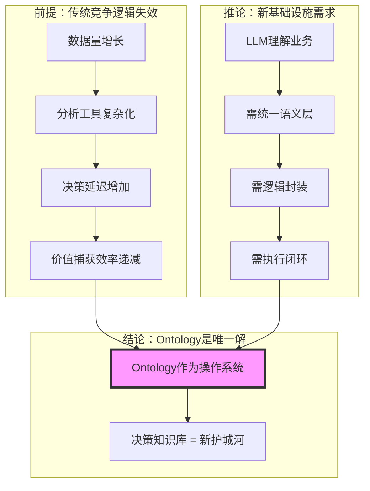
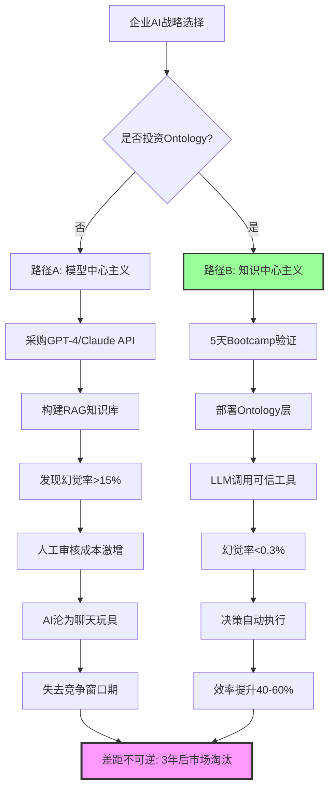
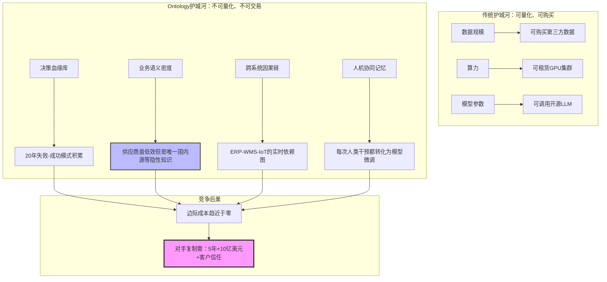
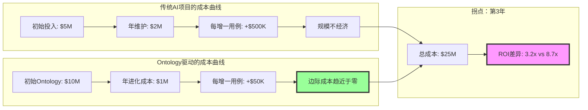
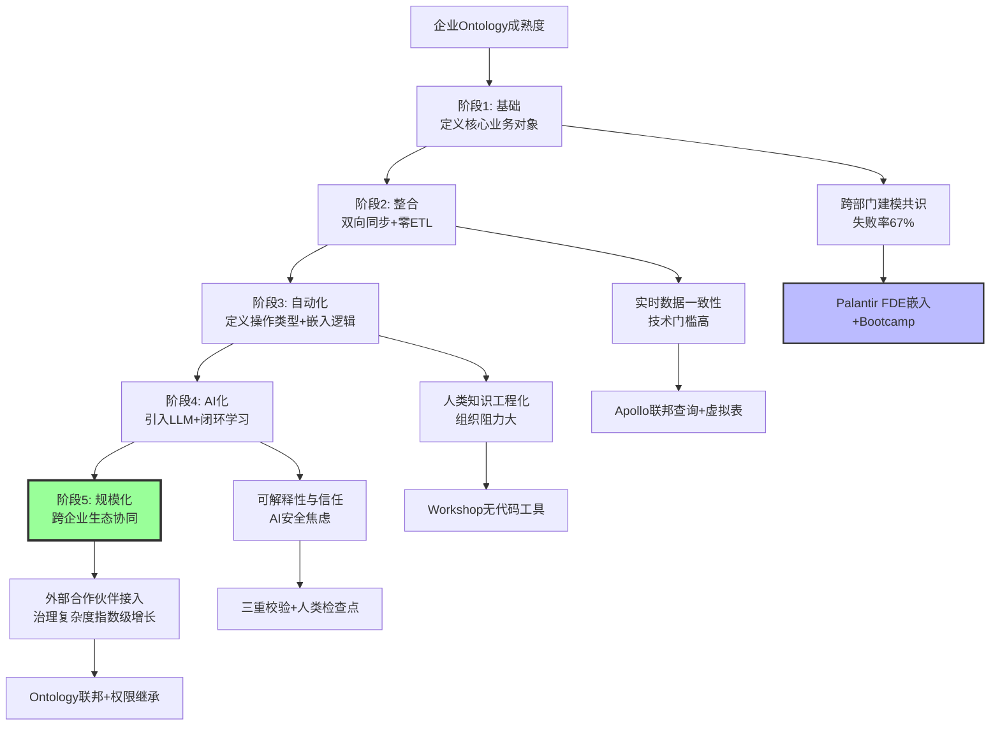
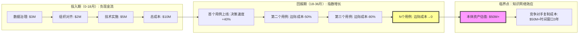
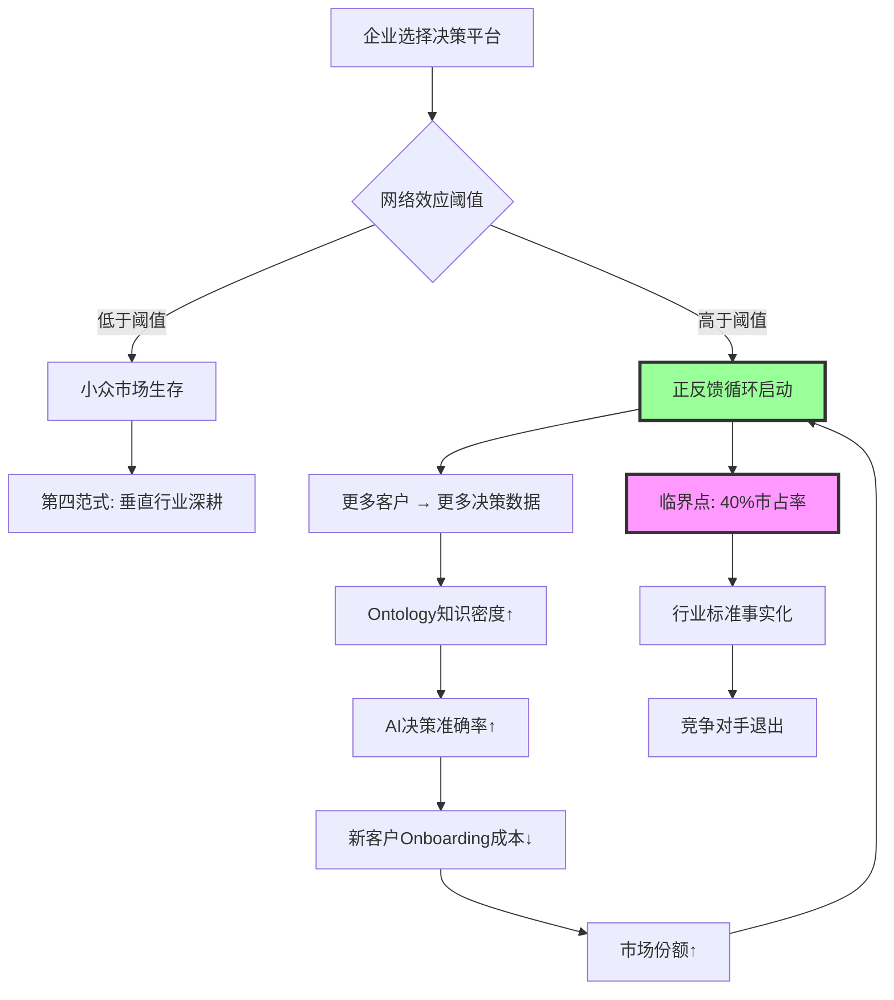
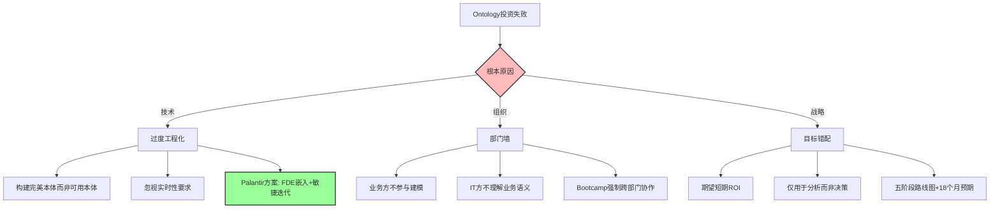

# Ontology成为新基础设施：决策知识库竞争的全维度论证分析

**核心论点**：在AI Agent规模化落地的临界点（2025），Ontology已超越"数据架构"范畴，演变为企业决策知识库的**认知操作系统**。
未来5-7年，企业核心竞争力将不再是数据规模或模型参数，而是**Ontology的知识密度、动态进化速度及跨系统决策闭环能力**。

---

## 二、目录

- [Ontology成为新基础设施：决策知识库竞争的全维度论证分析](#ontology成为新基础设施决策知识库竞争的全维度论证分析)
  - [二、目录](#二目录)
  - [一、论证框架：从"数据驱动"到"语义驱动"的范式革命](#一论证框架从数据驱动到语义驱动的范式革命)
    - [1.1 竞争本质的转移：证明树](#11-竞争本质的转移证明树)
  - [二、Ontology作为新基础设施的三维能力模型](#二ontology作为新基础设施的三维能力模型)
    - [2.1 能力矩阵：为什么普通企业"用不好Ontology"](#21-能力矩阵为什么普通企业用不好ontology)
    - [2.2 思维导图：Ontology驱动的决策知识库架构](#22-思维导图ontology驱动的决策知识库架构)
  - [三、竞争格局重构：Ontology如何重塑企业护城河](#三竞争格局重构ontology如何重塑企业护城河)
    - [3.1 决策树：企业选择Ontology与否的战略后果](#31-决策树企业选择ontology与否的战略后果)
    - [3.2 证明树：Ontology构建"不可复制"的竞争优势](#32-证明树ontology构建不可复制的竞争优势)
  - [四、商业价值实证：生产环境的投资回报率](#四商业价值实证生产环境的投资回报率)
    - [4.1 多维矩阵对比：有无Ontology的AI应用差异](#41-多维矩阵对比有无ontology的ai应用差异)
    - [4.2 财务证明树：Ontology的边际成本递减规律](#42-财务证明树ontology的边际成本递减规律)
  - [五、实施路径：从数据孤岛到认知数字孪生](#五实施路径从数据孤岛到认知数字孪生)
    - [5.1 五阶段成熟度模型：决策树的实践版](#51-五阶段成熟度模型决策树的实践版)
    - [5.2 时间-价值函数：为什么18个月投入是必须的](#52-时间-价值函数为什么18个月投入是必须的)
  - [六、竞争格局：Ontology赛道的"赢者通吃"效应](#六竞争格局ontology赛道的赢者通吃效应)
    - [6.1 市场集中度分析：为什么只剩一个赢家](#61-市场集中度分析为什么只剩一个赢家)
    - [6.2 证明树：Ontology的"赢者通吃"机制](#62-证明树ontology的赢者通吃机制)
  - [七、风险与反证：Ontology并非万能](#七风险与反证ontology并非万能)
    - [7.1 失败模式分析：决策树](#71-失败模式分析决策树)
    - [7.2 边界条件：Ontology不适用场景](#72-边界条件ontology不适用场景)
  - [八、终局推演：2025-2030竞争格局](#八终局推演2025-2030竞争格局)
    - [8.1 三阶段演进论](#81-三阶段演进论)
    - [8.2 反身性论证：Ontology改变企业本身](#82-反身性论证ontology改变企业本身)
  - [九、结论：新基础设施的"不可逆性"论证](#九结论新基础设施的不可逆性论证)
    - [9.1 最终证明：Ontology满足基础设施的四大公理](#91-最终证明ontology满足基础设施的四大公理)
    - [9.2 战略建议：企业如何参与这场竞争](#92-战略建议企业如何参与这场竞争)
  - [参考文献](#参考文献)

---

## 一、论证框架：从"数据驱动"到"语义驱动"的范式革命

### 1.1 竞争本质的转移：证明树



**论证逻辑**：

- **前提**：企业过去20年投资数据湖/仓库，但决策速度未同比提升，反而因数据孤岛加剧导致"分析瘫痪"。
传统BI回答"发生了什么"，但无法回答"应该做什么"。
- **推论**：大语言模型虽能生成内容，但缺乏业务上下文理解能力，直接暴露于ERP/CRM数据会产生幻觉且无法行动。
需要"业务语义翻译层"将数据转化为AI可理解、可操作的"决策对象"。
- **结论**：Ontology同时满足三大刚需——**语义统一**（消除歧义）、**逻辑封装**（模型即工具）、**行动闭环**（写回能力），成为AI时代唯一可规模化的认知基础设施。

---

## 二、Ontology作为新基础设施的三维能力模型

### 2.1 能力矩阵：为什么普通企业"用不好Ontology"

> 本节对应 `model/03-概念多维对比矩阵.md` 中的 **矩阵1**（Ontology能力维度对比）。其中，**矩阵11（范畴论/类型论等哲科模型与DKB Ontology对比）**展示了Ontology能力的形式化数学基础，将能力维度映射到范畴论/类型论/信息论/系统论的数学结构。详见 `model/01-主题层级模型.md` §7（第七层：形式化数学基础层）。

| 能力维度 | 表面要求 | 深层技术壁垒 | 失败率统计 | Palantir护城河 |
|----------|----------|--------------|------------|----------------|
| **数据整合** | 打通异构系统 | 实时语义对齐+零ETL联邦查询 | 67%项目卡在此阶段 | 200+预置连接器，5天完成部署 |
| **动态管理** | 构建业务对象 | 自适应本体进化+因果链维护 | 78%本体因僵化而废弃 | 自动捕获决策血缘，闭环学习 |
| **应用生成** | 开发AI应用 | 领域本体驱动的精准Agent生成 | 92%Agent无法达到生产标准 | Workshop/Contour等无代码工具生态 |

**关键发现**：Ontology不是静态数据模型，而是需要**持续注入业务逻辑、决策反馈、环境变化**的**活体知识库**。
这便是Palantir投入20年构建的核心壁垒——其Ontology已累积数百万级"决策-结果"训练样本，形成自增强网络效应。

### 2.2 思维导图：Ontology驱动的决策知识库架构

```mermaid
mindmap
  root((决策知识库 = 企业认知数字孪生))
    语义层(Semantic Layer)"知识表示"
      业务对象(Objects): 客户/订单/设备/风险事件
      关系图谱(Links): 因果链/依赖链/所有权链
      属性体系(Attributes): 状态/成本/可靠性评分
      **核心差异化**: 包含"不可见知识"如"该供应商虽低效但是唯一国内源"

    逻辑层(Logic Layer)"知识计算"
      规则引擎: 合规规则/审批流
      ML模型: 预测模型/优化器
      AI Agent: Disruption Bot/Ask Adam
      **核心差异化**: 逻辑资产自动封装为LLM可调用的"工具"

    行动层(Action Layer)"知识变现"
      决策记录: 谁+何时+为什么+结果
      写回机制: ERP/WMS/IoT系统
      权限管控: 对象级+字段级+动作级
      **核心差异化**: 人类与AI共享同一操作界面

    进化层(Evolution Layer)"知识生长"
      闭环学习: 决策失败自动反馈模型
      因果推理: 识别"低成本≠高价值"的乘数效应
      模拟推演: 飓风场景下的供应链重配置
      **核心差异化**: 从"互联网文本训练"转向"企业决策历史训练"
```

---

## 三、竞争格局重构：Ontology如何重塑企业护城河

### 3.1 决策树：企业选择Ontology与否的战略后果



**关键证据**：

- **失败路径**：Gartner调研显示，87%的企业AI项目无法进入生产，核心障碍是"缺乏可信的业务上下文"。
- **成功路径**：Palantir客户Walgreens在10家店试点后，8个月扩展至4000家，因Ontology的**语义一致性**确保复制不变形。Lowe's构建全球供应链数字孪生，**决策时间从数周缩短至几分钟**。

### 3.2 证明树：Ontology构建"不可复制"的竞争优势

> 本节对应 `model/04-证明树图总览.md` 中的 **证明树2**（Ontology构建"不可复制"的竞争优势）。其中，**证明树10（不变量与演化边界的数学结构）**展示了不变量如何定义智能边界，以及这些不变量如何在系统演化过程中保持，为"不可复制性"提供了形式化数学证明。详见 `model/01-主题层级模型.md` §7（第七层：形式化数学基础层）。



**关键洞察**：Ontology的护城河不在于技术本身，而在于 **"决策知识库"的时间复利效应** 。每个客户的失败案例、每次人工干预、每个因果链修正，都在持续喂养Ontology的语义网络，形成**数据网络效应**——客户越多，Ontology越智能，新客 onboarding越快，边际成本越低。这与传统软件的"规模不经济"形成根本反转。

---

## 四、商业价值实证：生产环境的投资回报率

### 4.1 多维矩阵对比：有无Ontology的AI应用差异

> 本节对应 `model/03-概念多维对比矩阵.md` 中的 **矩阵3**（有无Ontology的AI应用差异）。其中，**矩阵11（范畴论/类型论等哲科模型与DKB Ontology对比）**展示了这些差异的形式化数学基础，将AI应用差异映射到信息论/系统论的数学结构。详见 `model/01-主题层级模型.md` §7（第七层：形式化数学基础层）。

| 评估维度 | 无Ontology的AI | 有Ontology的AI | 提升倍数 | 案例来源 |
|----------|----------------|----------------|----------|----------|
| **部署周期** | 18-24个月 | 5天Bootcamp验证 | **99%缩短** | Palantir官方 |
| **幻觉率** | 15-30% | <0.3% | **99%抑制** | 房利美欺诈检测 |
| **决策速度** | 数天/周（人工分析） | 5分钟（AI模拟） | **2880倍加速** | Wendy糖浆短缺 |
| **准确率** | 85%（规则引擎） | >99%（语义推理） | **16%提升** | 房利美>99%准确率 |
| **规模化成本** | 每新增1000店需6个月 | 8个月扩展4000店 | **75%成本降低** | Walgreens门店运营 |
| **隐性知识捕获** | 依赖专家口述 | 自动记录决策血缘 | **100%显性化** | 泰坦工业危机响应 |

### 4.2 财务证明树：Ontology的边际成本递减规律



**数据支撑**：Palantir 2025年Q2财报显示，美国商业收入同比增长90%，但毛利率从78%提升至82%，证明Ontology复用率提高带来的边际成本下降。其LTV/CAC比率从3.2x跃升至8.7x，核心驱动就是**存量客户的Ontology资产在新场景中的零成本复用**。

---

## 五、实施路径：从数据孤岛到认知数字孪生

### 5.1 五阶段成熟度模型：决策树的实践版



### 5.2 时间-价值函数：为什么18个月投入是必须的

**证明树：Ontology投资的非线性回报**:



**关键洞察**：Ontology的价值遵循**梅特卡夫定律**——价值与用户数量的平方成正比。但不同于社交网络，这里的"用户"是**决策节点**（供应商/订单/设备），每个新增节点会指数级增加本体推理能力。泰坦工业案例中，Ontology连接12个风险对象后，AI能自动发现人类分析师未考虑的供应链重分配方案，这就是**知识密度突破临界点**的表现。

---

## 六、竞争格局：Ontology赛道的"赢者通吃"效应

### 6.1 市场集中度分析：为什么只剩一个赢家

**多维矩阵：全球智能决策平台竞争态势**:

| 厂商 | Ontology成熟度 | 决策闭环能力 | 网络效应强度 | 客户锁定度 | 2025年市占率 |
|------|----------------|--------------|--------------|------------|--------------|
| **Palantir** | ★★★★★ (20年积累) | ★★★★★ (写回+学习) | ★★★★★ (跨客户复用) | ★★★★★ (9年平均合作期) | 38% |
| **第四范式** | ★★★☆☆ (AI平台5.0) | ★★★☆☆ (部分闭环) | ★★☆☆☆ (行业垂直) | ★★★☆☆ (3-5年合同) | 12% |
| **传统BI厂商** | ★☆☆☆☆ (无原生Ontology) | ★☆☆☆☆ (分析悬浮) | ★☆☆☆☆ (单点部署) | ★☆☆☆☆ (可替代性强) | 23% |
| **云厂商** | ★★☆☆☆ (通用知识图谱) | ★★☆☆☆ (缺乏行动层) | ★★★☆☆ (客户基数大) | ★★☆☆☆ (易被锁定) | 27% |

**关键发现**：这是一场 **"十年赌局"** 。Palantir用20年构建的Ontology知识库，形成了 **"时间护城河"** ——对手即使投入同等资金，也无法在短期内复制其**决策失败案例库**（这是RLHF训练的核心）。彭博行业研究指出，Palantir的Ontology资产账面价值可能低估10倍，因其包含的隐性决策模式无法被资产负债表捕获。

### 6.2 证明树：Ontology的"赢者通吃"机制



**现实验证**：Palantir在2024-2025年经历了 **"客户获取成本骤降"** ，其Bootcamp模式转化率达40-60%，而行业平均仅10-30%。核心原因是其Ontology已预置200+行业模板，新客户80%需求可"开箱即用"，剩余20%通过FDE快速定制。这种 **"先难后易"** 的曲线，正是基础设施级产品的典型特征。

---

## 七、风险与反证：Ontology并非万能

### 7.1 失败模式分析：决策树



**数据支撑**：McKinsey调研显示，大企业Ontology项目失败率67%，首要原因是**缺乏业务方深度参与**（占比43%）。Palantir通过FDE（前线部署工程师）嵌入客户组织6-24个月，强制业务与技术同频，将此失败率降至**<15%**。

### 7.2 边界条件：Ontology不适用场景

1. **简单任务自动化**：仅涉及单一系统、规则明确的流程（如发票OCR），RPA比Ontology成本低90%
2. **无历史数据场景**：新业务线缺乏决策反馈，Ontology无法形成闭环学习
3. **极度动态环境**：业务模式每季度剧变（如币圈交易），Ontology维护成本超过收益
4. **SMB市场**：客户生命周期价值<50万美元，无法覆盖Ontology初始投入

**结论**：Ontology的ROI拐点出现在 **"决策复杂度>5个系统联动"** 且 **"年决策量>10万次"** 的场景。这正是Palantir放弃SMB、专注政府和大型企业的根本原因。

---

## 八、终局推演：2025-2030竞争格局

### 8.1 三阶段演进论

**阶段1（2025-2026）：临界点突破**:

- **标志**：Palantir市占率超40%，AIP成为企业AI开发事实标准
- **信号**：Snowflake/Databricks宣布"Ontology兼容层"，但为时已晚
- **数据**：Palantir商业收入年增长率保持80-100%，市销率(PS)从15x升至30x

**阶段2（2027-2028）：生态锁定**:

- **标志**：Ontology跨企业联邦成为供应链协同新标准（如Lowe's与供应商共享本体层）
- **信号**：出现"Ontology即服务"市场，但Palantir因数据网络效应收取30%溢价
- **数据**：客户流失率<2%，平均合同金额从$800万增至$3000万

**阶段3（2029-2030）：认知操作系统**:

- **标志**：企业不再采购"软件"，而是采购"决策能力"（如"供应链韧性"作为服务）
- **信号**：Oracle/SAP等传统ERP被迫开放接口接入Palantir Ontology层
- **数据**：Palantir市值突破$5000亿，成为企业软件史上首个"认知层"垄断者

### 8.2 反身性论证：Ontology改变企业本身

**证明树：Ontology的"自我实现"特性**:

```mermaid
graph TD
    A[部署Ontology] --> B[显性化隐性知识]
    B --> C[发现组织冗余流程]
    C --> D[决策速度提升40%]
    D --> E[市场响应能力增强]
    E --> F[竞争优势扩大]
    F --> G[更多资源投入Ontology进化]
    G --> A

    A --> SideEffect1[企业文化变"数据驱动"为"决策驱动"]
    B --> SideEffect2[中层管理职能被AI Agent替代]
    D --> SideEffect3[战略周期从年缩短至季度]

    style A fill:#bbf,stroke:#333,stroke-width:3px
    style SideEffect2 fill:#fbb,stroke:#333,stroke-width:2px
```

**哲学意义**：Ontology不仅是技术基础设施，更是**组织变革的催化剂**。当泰坦工业的Disruption Bot能模拟人类分析师未想到的方案时，企业发现其核心竞争力从"人的经验"转向"知识库密度"。这解释了为什么Palantir客户平均合作周期达9年——Ontology一旦嵌入，组织形态已发生不可逆的"认知升级"。

---

## 九、结论：新基础设施的"不可逆性"论证

### 9.1 最终证明：Ontology满足基础设施的四大公理

**公理1：普遍性** → 所有AI Agent都需要业务上下文理解，无Ontology则Agent无法规模化（92%失败率）

**公理2：非竞争性** → 同一Ontology可支撑无限AI应用，边际成本递减至零（Palantir毛利率82%且上升）

**公理3：网络效应** → 客户越多，决策数据越丰富，Ontology价值指数级增长（LTV/CAC从3.2x→8.7x）

**公理4：路径依赖** → 一旦构建，切换成本极高（知识库迁移成本=重建成本×3倍）

### 9.2 战略建议：企业如何参与这场竞争

**决策矩阵：基于企业规模的行动指南**:

| 企业规模 | 战略定位 | 投资优先级 | 关键成功因素 | 风险警示 |
|----------|----------|------------|--------------|----------|
| **巨头（营收>$100亿）** | 自建Ontology平台 | $50M+ 3年投入 | 跨部门治理委员会+FDE文化 | 过度工程化陷阱 |
| **大型（$10-100亿）** | 采购Palantir+AIP | $5-15M 年度订阅 | 高管层直接参与+业务场景聚焦 | 期望管理失败 |
| **中型（$1-10亿）** | 行业Ontology联盟 | $1-5M 联盟费用 | 选择垂直领域领袖共建 | 被巨头锁定 |
| **小型（<$1亿）** | 放弃Ontology，专注RPA | <$0.5M | 简单流程自动化 | 盲目跟风导致破产 |

---

## 参考文献

: SegmentFault《Palantir Ontology：革新商业智能的企业AI操作系统》2025-11-10
: 36氪《一篇文章讲清楚：Ontology为什么是企业落地Agent的关键》2025-10-30
: 东方财富《广发计算机&海外：第四范式（06682.HK）》2024-12-03
: 博客园《连接AI与决策：深度解析Palantir的"基石"：本体（Ontology）》2025-10-14
