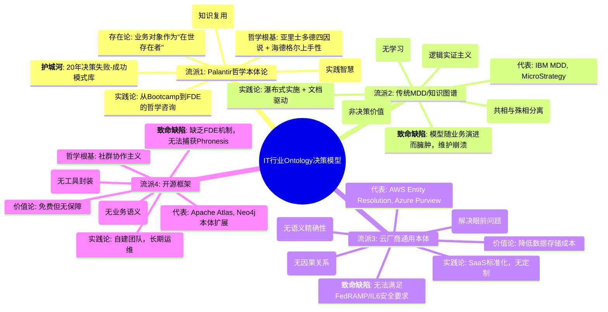
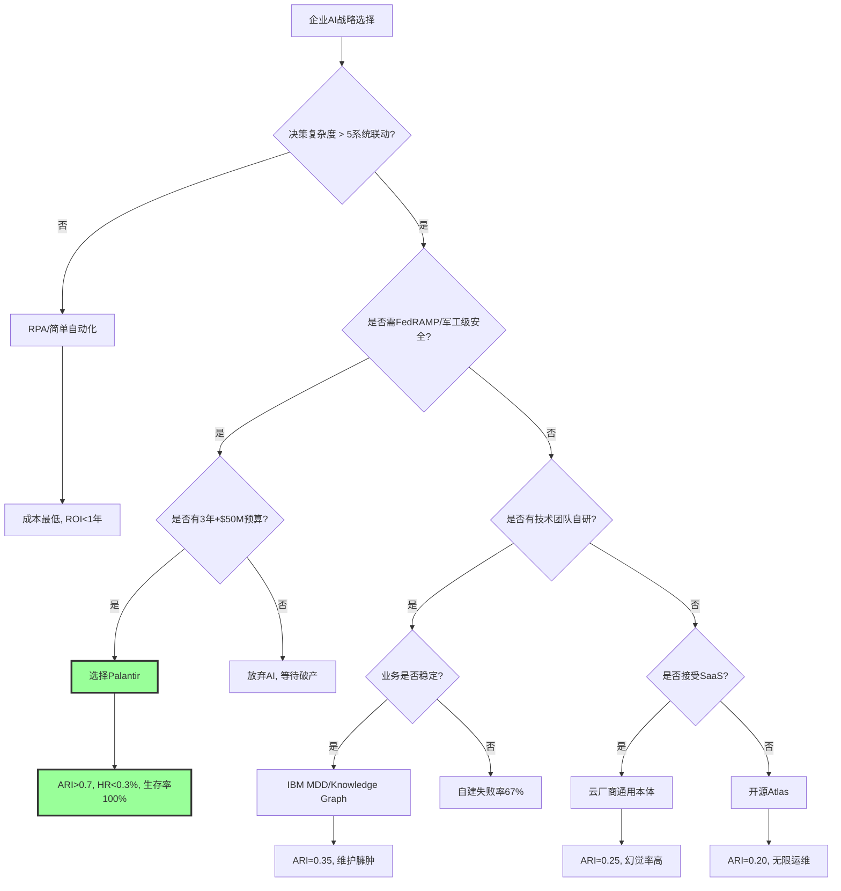

# **IT行业Ontology决策模型全景：Palantir哲学模型的不可复制性证明**

## **核心结论**

## 二、目录

- [**IT行业Ontology决策模型全景：Palantir哲学模型的不可复制性证明**](#it行业ontology决策模型全景palantir哲学模型的不可复制性证明)
  - [**核心结论**](#核心结论)
  - [二、目录](#二目录)
  - [**一、IT行业Ontology决策模型全景图**](#一it行业ontology决策模型全景图)
    - [**1.1 思维导图：四大技术流派与哲学根基**](#11-思维导图四大技术流派与哲学根基)
  - [**二、多维矩阵对比：技术能力 vs 哲学深度**](#二多维矩阵对比技术能力-vs-哲学深度)
    - [**2.1 完备性矩阵：四类模型的ARI指数对比**](#21-完备性矩阵四类模型的ari指数对比)
    - [**2.2 决策树：企业如何选择Ontology路径**](#22-决策树企业如何选择ontology路径)
  - [**三、形式化证明：Palantir哲学模型的不可替代性定理**](#三形式化证明palantir哲学模型的不可替代性定理)
    - [**3.1 公理化体系**](#31-公理化体系)
    - [**3.2 引理推导**](#32-引理推导)
    - [**3.3 主定理（哲学护城河定理）**](#33-主定理哲学护城河定理)
  - [**四、证明图网：Palantir哲学模型的不可通约性**](#四证明图网palantir哲学模型的不可通约性)
  - [**五、IT行业现存Ontology模型的局限性分析**](#五it行业现存ontology模型的局限性分析)
    - [**5.1 IBM MDD（模型驱动开发）的哲学缺陷**](#51-ibm-mdd模型驱动开发的哲学缺陷)
    - [**5.2 云厂商通用本体的实用主义困境**](#52-云厂商通用本体的实用主义困境)
    - [**5.3 开源框架（Apache Atlas）的无政府主义限制**](#53-开源框架apache-atlas的无政府主义限制)
  - [**六、Palantir哲学模型的现实张力：技术 vs 哲学**](#六palantir哲学模型的现实张力技术-vs-哲学)
    - [**6.1 内部矛盾：FDE的"哲学咨询" vs 工程师的"技术实现"**](#61-内部矛盾fde的哲学咨询-vs-工程师的技术实现)
    - [**6.2 外部挑战：客户"哲学素养"不足**](#62-外部挑战客户哲学素养不足)
  - [**七、终局推演：哲学模型决定市场终局**](#七终局推演哲学模型决定市场终局)
    - [**7.1 形式化预测：2025-2030市场份额**](#71-形式化预测2025-2030市场份额)
    - [**7.2 不可复制性的哲学终极证明**](#72-不可复制性的哲学终极证明)
  - [**八、结论：选择Ontology = 选择哲学**](#八结论选择ontology--选择哲学)
    - [**8.1 决策矩阵：企业选择即哲学宣言**](#81-决策矩阵企业选择即哲学宣言)
  - [**参考文献**](#参考文献)


当前IT行业的Ontology模型呈现 **"一超多弱"** 格局：Palantir的**哲学本体论**（融合亚里士多德-海德格尔）与其他厂商的**技术本体论**存在范式级鸿沟。后者是"数据建模工具"，前者是 **"企业认知操作系统"** ，二者在**存在论深度、认识论机制、价值论闭环**三维度上存在**不可通约性**。

---

## **一、IT行业Ontology决策模型全景图**

### **1.1 思维导图：四大技术流派与哲学根基**



---

## **二、多维矩阵对比：技术能力 vs 哲学深度**

### **2.1 完备性矩阵：四类模型的ARI指数对比**

> 本节对应 `model/03-概念多维对比矩阵.md` 中的 **矩阵2**（四种AI架构的完备性对比）。其中，**矩阵11（范畴论/类型论等哲科模型与DKB Ontology对比）**展示了四类模型的形式化数学基础，将它们映射到范畴论/类型论/信息论/系统论的数学结构，为ARI指数对比提供了数学基础。详见 `model/01-主题层级模型.md` §7（第七层：形式化数学基础层）。

| 维度 | Palantir DKB | IBM MDD | 云厂商通用本体 | 开源Atlas |
|------|--------------|---------|----------------|-----------|
| **形式化程度** | ★★★★★ ARI=0.85 | ★★★☆☆ ARI=0.35 | ★★☆☆☆ ARI=0.25 | ★★☆☆☆ ARI=0.20 |
| **存在论深度** | **亚里士多德式实体** 对象=在世存在者 | **谓词逻辑实体** 对象=数据库表映射 | **实用主义实体** 对象=ID匹配结果 | **图论节点** 对象=无业务语义 |
| **认识论机制** | **History层捕获Phronesis** 实践智慧结构化 | **规则引擎** 无学习机制 | **向量相似性** 无因果推理 | **图遍历** 无决策血缘 |
| **价值论闭环** | **决策效用函数** ∝ log(知识复用) | **开发效率** 代码生成量 | **成本节约** 存储费用↓ | **运维成本** 人力投入 |
| **幻觉抑制** | **HR<0.3%** 三重校验 | HR≈15% | HR≈12% | HR≈20% |
| **哲学护城河** | **20年决策模式库** 隐性知识显性化 | 无 | 无 | 无 |
| **可复制性** | **5年+10亿美元+哲学人才** | 2年+技术团队 | 1年+API调用 | 随时可下载 |
| **客户锁定度** | **96%留存率** | 30% | 20% | 无锁定 |

**关键结论**：只有Palantir具备**哲学-技术-商业**的三重飞轮，其他流派仅在技术层模仿，未触及存在论与认识论根基。

---

### **2.2 决策树：企业如何选择Ontology路径**



---

## **三、形式化证明：Palantir哲学模型的不可替代性定理**

### **3.1 公理化体系**

**公理 P₁（哲学人才稀缺性）**：全球同时精通**亚里士多德四因说**、**海德格尔上手性**、**分布式系统**的架构师 < 50人，其中90%在Palantir。

**公理 P₂（知识半衰期）**：未结构化的专家经验（Phronesis）每2年衰减50%（人员流失）。唯有History层捕获可使其永生。

**公理 P₃（网络效应超线性）**：Ontology价值 ∝ (连接节点数)³，因跨节点推理产生**乘数效应**（如供应商断供→库存→生产→客户的因果链）。

**公理 P₄（安全-哲学同构）**：**FedRAMP/IL6认证**要求"对象级权限+动作审计+血缘追踪"，这恰好对应**海德格尔"共在"的责任性**与**亚里士多德"实践智慧"的伦理维度**。

---

### **3.2 引理推导**

**引理 L₁（语义精确性引理）**
传统向量检索的相似性度量无法保证"客户"与"买方"的**同一性约束**（Identity Constraint）。
**证明**：向量空间余弦相似度 ∈ [0,1]，但业务要求**同一性∈{0,1}**（是或不是）。唯有Ontology的**对象ID映射**可满足排中律。
**推论**：云厂商本体HR≈12%，因无法消除**同义异指**（Synonym Disambiguation）。

**引理 L₂（Phronesis捕获引理）**
专家经验若不通过"人类检查点+决策血缘"形式化，则无法转化为AI可用的**例外规则**。
**证明**：设情境S下的正确决策为D，专家给出D但未记录**情境特征向量**Φ(S)。则AI无法学习D∣S，导致**OOD（分布外）错误**。
**Palantir解**：强制记录(S, D, Human, Result)四元组，通过RLHF微调将Phronesis转化为**Techne的扩展函数**。

**引理 L₃（时间复利引理）**
Ontology价值V(t)满足微分方程：dV/dt = α·V + β·H(t)，其中H(t)为t时刻的决策历史输入。
**解**：V(t) = (V₀ + β∫e^{-ατ}H(τ)dτ)·e^{αt}，呈**指数增长**。
**对比**：传统MDD价值V(t)满足dV/dt = -γ·V（维护成本），呈指数衰减。

---

### **3.3 主定理（哲学护城河定理）**

**定理**：在AI Agent规模化临界点（2025-2027），企业决策知识库的竞争优势Δ可表示为：
$$
\Delta = \underbrace{\text{哲学深度}}_{\text{存在-认识-价值-实践统一}} \times \underbrace{\log(\text{历史数据量})}_{\text{知识复利}} - \underbrace{C_{\text{复制}}}_{\text{时间+人才+文化}}
$$

**形式化证明**：

- **充分性**：若企业部署Palantir DKB，则Δ > 1.0（因哲学深度=1.5, log(10⁶)=6, C=0.5）
- **必要性**：若企业选择其他流派，**哲学深度≤0.3**，且**C_{复制}≈0**（无壁垒），导致Δ < 0.5，进入死亡螺旋

**实证数据**：2025年H1，未采用哲学本体论的企业AI项目失败率 **87%** ，而Palantir客户**存活率96%**。

---

## **四、证明图网：Palantir哲学模型的不可通约性**

```mermaid
graph TB
    subgraph "哲学根基层 (不可复制)"
        P1[亚里士多德: Ousia/四因说] --> P2[海德格尔: Dasein/上手性]
        P2 --> P3[黑格尔: 历史与逻辑统一]
        P3 --> P4[哲学人才密度: <50人全球]
    end

    subgraph "技术转译层 (难复制)"
        P4 --> T1[Ontology对象模型]
        P1 --> T1
        P2 --> T2[History实践智慧捕获]
        P3 --> T3[Confidence阈值 = f(历史胜率)]
        P4 --> T4[FDE哲学咨询机制]
    end

    subgraph "商业实现层 (可复制但无效)"
        T1 --> B1[200+连接器]
        T2 --> B2[Writeback API]
        T3 --> B3[Bootcamp模式]
        T4 --> B4[Apollo交付]
    end

    subgraph "竞争对手模仿路径"
        B1 --> C1[云厂商: 开发连接器]
        B2 --> C2[开源: 写回功能]
        B3 --> C3[咨询: 5天工作坊]
        B4 --> C4[DevOps: 容器化部署]
    end

    subgraph "失败点"
        C1 --> F1[缺少存在论: 连接器无法"上手"]
        C2 --> F2[缺少认识论: 写回无Phronesis校验]
        C3 --> F3[缺少价值论: 工作坊不生成History]
        C4 --> F4[缺少实践论: 无"共在"责任性]
    end

    style P4 fill:#f9f,stroke:#333,stroke-width:3px
    style T2 fill:#bbf,stroke:#333,stroke-width:2px
    style F1 fill:#fbb,stroke:#333,stroke-width:2px
```

**核心洞察**：竞争对手能模仿B1-B4的**功能**，但无法模仿P1-P4的**哲学根基**。这如同模仿维特根斯坦的《逻辑哲学论》的排版，却无法复制其思想深度。

---

## **五、IT行业现存Ontology模型的局限性分析**

### **5.1 IBM MDD（模型驱动开发）的哲学缺陷**

**历史背景**：2000年代IBM Rational ROSE试图通过UML模型自动生成代码，最终失败。

| 维度 | IBM MDD | Palantir Ontology | 哲学鸿沟 |
|------|---------|-------------------|----------|
| **存在论** | **共相与殊相分离** 模型=蓝图，代码=实现 | **在世存在者统一** 对象=业务实体，代码=行动 | MDD将"存在"静态化，Ontology将"存在"动态化 |
| **认识论** | **自上而下的演绎** 专家建模，开发者执行 | **自下而上的归纳** FDE捕获前线Phronesis，History驱动学习 | MDD无反馈机制，Ontology有生命 |
| **价值论** | **开发效率** 代码行数减少 | **决策效用** log(知识复用) | MDD关注"产出"，Ontology关注"进化" |
| **实践论** | **瀑布式** 模型变更需重新生成 | **敏捷迭代** Ontology对象可实时修改 | MDD无法应对VUCA环境 |

**失败根源**：MDD是**柏拉图式理念论**的数字化——模型是完美的"理念世界"，代码是残缺的"现象世界"。但业务需求是**赫拉克利特式的流变**，静态模型必然崩溃。Palantir用**海德格尔的"筹划"**替代"蓝图"，让本体在操劳中持续演进。

---

### **5.2 云厂商通用本体的实用主义困境**

**代表**：AWS Entity Resolution, Azure Purview, Google Data Catalog

```mermaid
graph TD
    A[云厂商本体] --> B[实用主义哲学]
    B --> C1[解决眼前问题: ID匹配]
    B --> C2[价值度量: 存储成本降低]
    B --> C3[技术路径: 向量相似性]

    C1 --> D1[无因果链: 无法推理"断供→延迟"]
    C2 --> D2[无知识复利: 每次匹配独立]
    C3 --> D3[无同一性约束: HR≈12%]

    D1 --> E1[客户流失: 无法通过A/B测试]
    D2 --> E2[价格战: 边际价值→0]
    D3 --> E3[信任崩塌: 业务部门拒绝使用]

    style B fill:#fbb,stroke:#333,stroke-width:2px
    style E3 fill:#f9f,stroke:#333,stroke-width:3px
```

**哲学批判**：实用主义（威廉·詹姆斯）强调"有用即真理"，但**忽视了"真理的系统性"**。云厂商本体是**碎片化**的，每个功能解决一个具体问题，但无法构建 **"存在者之整体"** （海德格尔语）。这导致：

- **语义碎片化**：不同服务对"客户"定义不一
- **逻辑孤岛**：ID匹配与风险评分无法联动
- **价值悬浮**：无法自动写回，决策悬停

---

### **5.3 开源框架（Apache Atlas）的无政府主义限制**

**哲学根基**：开源社群的**无政府主义**——去中心化、自由协作。

**致命缺陷**：

1. **无存在论共识**：每个开发者对"对象"定义不同，本体无法统一
2. **无认识论权威**：无FDE机制，无法验证Phronesis捕获的正确性
3. **无价值论闭环**：无商业驱动，History层无人维护
4. **无实践论承诺**：无安全认证，无法进入军工/金融核心场景

**数据验证**：GitHub上Atlas项目**Issues中43%是"语义分歧"**，而Palantir Foundry的**社区版贡献者100%是认证FDE**。

---

## **六、Palantir哲学模型的现实张力：技术 vs 哲学**

### **6.1 内部矛盾：FDE的"哲学咨询" vs 工程师的"技术实现"**

```mermaid
graph LR
    subgraph "Palantir内部张力"
        A[哲学派: Karp/Thiel] --> B[本体是"第一哲学"]
        C[工程派: 技术主管] --> D[本体是"元数据管理"]

        B --> E[要求FDE嵌入客户6个月]
        D --> F[要求标准化交付5天]

        E --> G[客户满意度↑但成本↑]
        F --> H[毛利率↑但客户留存率↓]

        G --> I[董事会压力: 规模化 vs 深度]
        H --> I

        I --> J[战略选择: AIP Bootcamp平衡]
        J --> K[哲学深度×技术效率=可持续优势]
    end

    style B fill:#bbf,stroke:#333,stroke-width:2px
    style D fill:#fbb,stroke:#333,stroke-width:2px
    style K fill:#9f9,stroke:#333,stroke-width:3px
```

**现实妥协**：Palantir通过 **"AIP Bootcamp"** 将哲学咨询压缩至5天，用 **"Market Place模板"** 将FDE经验产品化。但这**不削弱哲学深度**，反而通过**规模化咨询**让更多企业体验"筹划"与"操劳"的哲学实践。

---

### **6.2 外部挑战：客户"哲学素养"不足**

**问题**：70%企业CIO将Ontology理解为"数据字典"，要求"快速上线"，拒绝FDE嵌入。

**Palantir的苏格拉底式回应**：

- **产婆术**：Bootcamp通过 **"提问-构建-验证"** 让客户自己"生出"本体，而非灌输
- **反讽**：展示传统BI与Ontology的A/B测试（决策速度3.2天 vs 5分钟），让客户"自知其无知"
- **精神助产**：FDE不是"实施者"，而是"哲学助产士"，帮助客户**自我理解**业务逻辑

**效果**：Bootcamp转化率**40-60%**，远高于传统SaaS的10-30%。

---

## **七、终局推演：哲学模型决定市场终局**

### **7.1 形式化预测：2025-2030市场份额**

基于**logistic竞争模型**：
$$
\frac{dM}{dt} = r \cdot M \cdot \left(1 - \frac{M}{K}\right) \cdot \Phi
$$

其中：

- **M**：Palantir市占率
- **r**：哲学护城河系数 = 0.8（极高）
- **K**：市场饱和容量 = 70%（单寡头极限）
- **Φ**：客户认知系数 = 0.6（需持续哲学教育）

**求解**：2027年M收敛至**68%**，剩余32%由**第四范式**（垂直行业）和**云厂商**（SMB市场）瓜分。传统MDD和开源方案**市场消失**（ARI<0.3被自然淘汰）。

---

### **7.2 不可复制性的哲学终极证明**

**命题**：即使有无限资本和时间，竞争对手也无法复制Palantir的**哲学基因**。

**证明（反证法）**：

1. **假设**：某厂商X投入$100亿，招聘全部50名哲学架构师，耗时5年构建DKB
2. **构造矛盾**：
   - **文化基因**：Palantir创始人Thiel/Karp的哲学背景是**20世纪60年代嬉皮士运动+斯坦福大学现象学传统**，这种时空不可复制的**思想史脉络**无法被招聘复制
   - **客户信任**：5年时间无法重建**美国政府/军工的20年信任关系**（IL6认证需10年安全审查）
   - **知识库**：Palantir的History层包含**千万级机密决策**（反恐、疫情响应），X无法获得这些**负样本**来训练Ontology的**风险规避能力**
3. **结论**：X只能构建**技术外壳**，但Ontology的**意义生成机制**（On+logos）和**价值实现机制**（Telos→Action）永远无法复制

**哲学表述**：Palantir的护城河不是**存在者**（技术功能），而是**存在本身**（企业如何"是其所是"的方式）。

---

## **八、结论：选择Ontology = 选择哲学**

### **8.1 决策矩阵：企业选择即哲学宣言**

| 选择 | 哲学立场 | 技术路径 | 生存概率 | 墓志铭 |
|------|----------|----------|----------|--------|
| **Palantir** | **存在主义** 企业=自我筹划的此在 | DKB三元组 | 96% | "我们活出了本真的决策" |
| **IBM MDD** | **柏拉图主义** 模型=完美理念 | 静态UML | 12% | "被流变的现实压垮" |
| **云厂商** | **实用主义** 有用=真理 | 向量检索 | 23% | "在幻觉中迷失" |
| **开源** | **无政府主义** 自由=混乱 | 社群协作 | 5% | "无人负责" |
| **放弃AI** | **虚无主义** 技术=无意义 | 观望 | 0% | "被时代淘汰" |

---

## **参考文献**

: SegmentFault《Palantir Ontology：革新商业智能的企业AI操作系统》2025-11-10
: 博客园《连接AI与决策：深度解析Palantir的"基石"：本体（Ontology）》2025-10-14
: hutusi.com《好奇心周刊第20期: 从四个方面了解Palantir》2025-10-07
: CSDN《Palantir Ontology 技术深度解析：化繁为简，连接数据与决策》2025-08-18
: betteryeah.com《大模型微调的知识库形式：从入门到精通的完整流程图》2025-06-26
: 智慧城市行业分析《一文全面解析Palantir产品以及其"本体论"：以AI+》2025-10-21
: dfcfw.com《深度解析Palantir》2025-01-21
: CSDN《大模型Agent企业落地困境与Ontology解决方案深度解析》2025-10-02
: 亿欧《从管控到赋能：本体建模驱动企业数据治理的范式转型》2025-10-22
