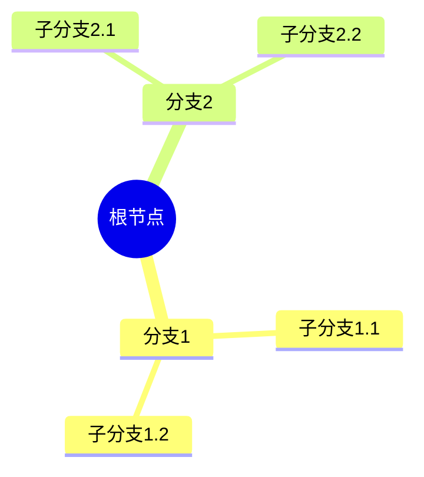
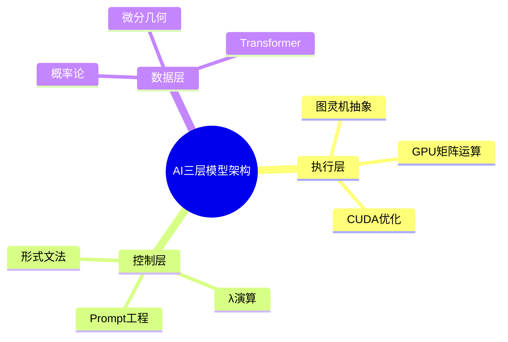
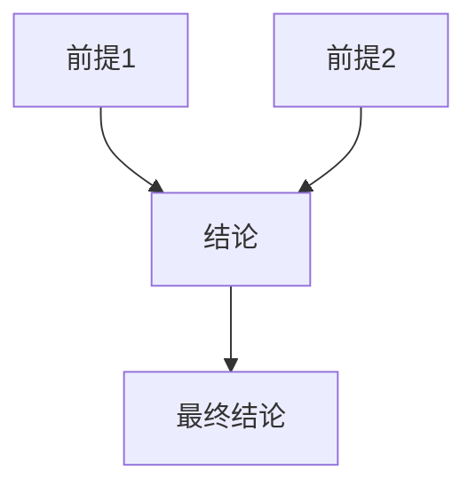
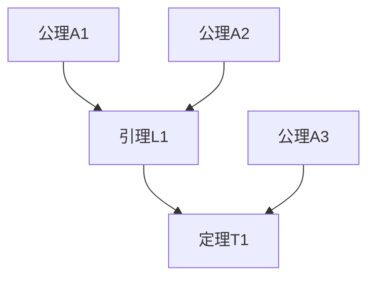
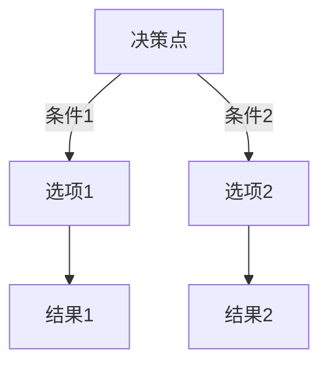
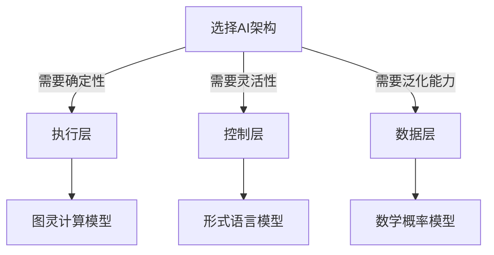
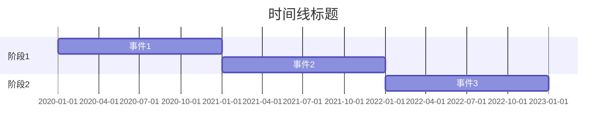
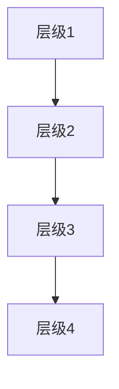

# 思维表征格式和规范

**创建日期**：2025-11-10
**最后更新**：2025-11-10
**维护者**：FormalAI项目组
**文档版本**：v1.0
**状态**：🔄 持续更新中

---

## 📋 执行摘要

本文档定义FormalAI项目中所有思维表征方式的统一格式和规范，包括：

1. **思维导图格式规范**
2. **对比矩阵格式规范**
3. **证明树格式规范**
4. **决策树格式规范**
5. **时间线格式规范**
6. **层级模型格式规范**

---

## 一、思维导图格式规范

### 1.1 Mermaid思维导图格式

**基本格式**：

```markdown


```

**示例**：
```markdown


```

### 1.2 思维导图元数据

**格式**：
```markdown
## X.X 思维导图名称

**主题**：主题描述


**关联文档**：

- [文档1](./path1.md#章节)
- [文档2](./path2.md#章节)

```

### 1.3 思维导图编号规范

**编号格式**：`思维导图X`（按文档内顺序编号）

**示例**：
- 思维导图1：DKB架构全景
- 思维导图2：哲学谱系转译
- 思维导图3：IT技术哲学四重结构

---

## 二、对比矩阵格式规范

### 2.1 基本矩阵格式

**格式**：
```markdown
| 维度 | **选项1** | **选项2** | **选项3** |
|------|----------|----------|----------|
| **维度1** | 值1 | 值2 | 值3 |
| **维度2** | 值1 | 值2 | 值3 |
```

### 2.2 矩阵元数据

**格式**：

```markdown
### X.X 矩阵名称

**来源**：文档路径 §章节

| 维度 | **选项1** | **选项2** | **选项3** |
|------|----------|----------|----------|
| ... | ... | ... | ... |

**关键发现**：矩阵分析的关键结论
```

### 2.3 矩阵编号规范

**编号格式**：`矩阵X`（按文档内顺序编号）

**示例**：

- 矩阵1：Ontology能力维度对比
- 矩阵2：AI架构完备性对比
- 矩阵3：应用差异对比

---

## 三、证明树格式规范

### 3.1 Mermaid证明树格式

**基本格式**：

```markdown


```

**示例**：
```markdown


```

### 3.2 证明树元数据

**格式**：
```markdown
### X.X 证明树名称

**证明目标**：要证明的定理/引理


**证明步骤**：

1. 步骤1：...
2. 步骤2：...
3. 步骤3：...

**关联文档**：

- [定理定义](./path.md#定理)
- [公理定义](./path.md#公理)

```

### 3.3 证明树编号规范

**编号格式**：`证明树X`（按文档内顺序编号）

**示例**：
- 证明树1：DKB公理证明
- 证明树2：ARI指数证明
- 证明树3：Phronesis捕获证明

---

## 四、决策树格式规范

### 4.1 Mermaid决策树格式

**基本格式**：
```markdown


```

**示例**：
```markdown


```

### 4.2 决策树元数据

**格式**：
```markdown
### X.X 决策树名称

**决策场景**：决策场景描述


**决策规则**：

- 规则1：...
- 规则2：...
- 规则3：...

**关联文档**：

- [相关文档](./path.md#章节)

```

### 4.3 决策树编号规范

**编号格式**：`决策树X`（按文档内顺序编号）

**示例**：
- 决策树1：AI架构选择
- 决策树2：收敛策略选择
- 决策树3：反实践判定流程

---

## 五、时间线格式规范

### 5.1 Mermaid时间线格式

**基本格式**：
```markdown


```

### 5.2 时间线元数据

**格式**：
```markdown
### X.X 时间线名称

**时间范围**：起始时间 - 结束时间

```mermaid
gantt
  ...
```

**关键事件**：

- 事件1（时间）：描述
- 事件2（时间）：描述

**关联文档**：

- [相关文档](./path.md#章节)

```

---

## 六、层级模型格式规范

### 6.1 Mermaid层级模型格式

**基本格式**：
```markdown


```

### 6.2 层级模型元数据

**格式**：
```markdown
### X.X 层级模型名称

**层级结构**：层级描述


**层级说明**：

- 层级1：...
- 层级2：...
- 层级3：...

**关联文档**：

- [相关文档](./path.md#章节)

```

---

## 七、统一格式要求

### 7.1 文档结构要求

所有思维表征文档应包含：
1. **标题**：思维表征方式名称
2. **元数据**：创建日期、最后更新、维护者、文档版本
3. **执行摘要**：文档内容概述
4. **主体内容**：思维表征方式的具体内容
5. **参考文档**：关联文档链接

### 7.2 编号规范

- **思维导图**：思维导图1, 思维导图2, ...
- **对比矩阵**：矩阵1, 矩阵2, ...
- **证明树**：证明树1, 证明树2, ...
- **决策树**：决策树1, 决策树2, ...
- **时间线**：时间线1, 时间线2, ...
- **层级模型**：层级模型1, 层级模型2, ...

### 7.3 引用规范

**格式**：`[思维表征名称](../文档路径.md#章节)`

**示例**：
- `[思维导图1](../Philosophy/model/02-思维导图总览.md#思维导图1)`
- `[矩阵1](../Philosophy/model/03-概念多维对比矩阵.md#矩阵1)`
- `[证明树1](../Philosophy/model/04-证明树图总览.md#证明树1)`

---

## 八、质量检查清单

### 8.1 格式检查

- [ ] Mermaid图表语法正确
- [ ] 表格格式正确
- [ ] 编号规范统一
- [ ] 元数据完整

### 8.2 内容检查

- [ ] 内容准确无误
- [ ] 关联文档链接有效
- [ ] 关键发现明确
- [ ] 编号连续无重复

### 8.3 一致性检查

- [ ] 跨文档编号一致
- [ ] 引用格式统一
- [ ] 术语使用一致
- [ ] 风格统一

---

## 九、参考文档

### 9.1 思维表征方式文档

- [PROJECT_THINKING_REPRESENTATIONS.md](./PROJECT_THINKING_REPRESENTATIONS.md) - 思维表征方式索引
- [docs/DOCS_MIND_MAPS_INDEX.md](./docs/DOCS_MIND_MAPS_INDEX.md) - Docs模块思维导图索引
- [Philosophy/model/02-思维导图总览.md](./Philosophy/model/02-思维导图总览.md) - Philosophy模块思维导图
- [Philosophy/model/03-概念多维对比矩阵.md](./Philosophy/model/03-概念多维对比矩阵.md) - Philosophy模块对比矩阵

### 9.2 相关规范文档

- [CONCEPT_REFERENCE_STANDARD.md](./CONCEPT_REFERENCE_STANDARD.md) - 概念引用规范
- [docs/0-总览与导航/0.2-交叉引用与本地跳转说明.md](./docs/0-总览与导航/0.2-交叉引用与本地跳转说明.md) - 交叉引用说明

---

**最后更新**：2025-11-10
**维护者**：FormalAI项目组
**文档版本**：v1.0（初始版本 - 创建思维表征格式和规范文档）
