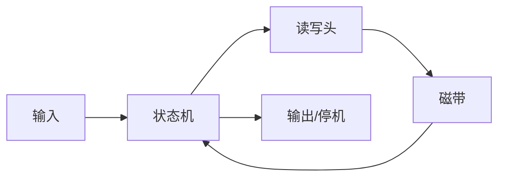
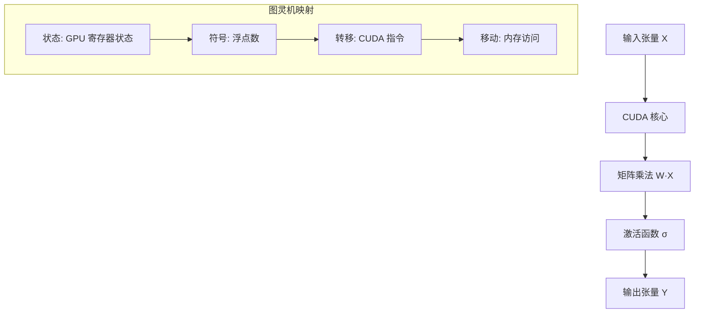

# 01.1.1-图灵机抽象与可计算性理论

## 目录

- [01.1.1-图灵机抽象与可计算性理论](#0111-图灵机抽象与可计算性理论)
  - [目录](#目录)
  - [一、概述](#一概述)
  - [二、图灵机抽象](#二图灵机抽象)
    - [2.1 图灵机基本定义](#21-图灵机基本定义)
    - [2.2 图灵机工作原理](#22-图灵机工作原理)
  - [三、可计算性理论](#三可计算性理论)
    - [3.1 可计算函数](#31-可计算函数)
    - [3.2 图灵完备性](#32-图灵完备性)
    - [3.3 停机问题](#33-停机问题)
  - [四、执行层的图灵机抽象](#四执行层的图灵机抽象)
    - [4.1 GPU 矩阵运算作为图灵机实例](#41-gpu-矩阵运算作为图灵机实例)
    - [4.2 可计算性边界](#42-可计算性边界)
  - [五、与三层模型的关系](#五与三层模型的关系)
    - [5.1 执行层 → 控制层](#51-执行层--控制层)
    - [5.2 执行层 → 数据层](#52-执行层--数据层)
  - [六、核心结论](#六核心结论)
  - [七、相关主题](#七相关主题)
  - [八、参考文档](#八参考文档)

---

## 一、概述

图灵机抽象是执行层（图灵计算模型）的理论基础，提供了可计算性理论的数学框架。本文档阐述图灵机抽象、可计算性理论及其在 AI 执行层中的应用。

---

## 二、图灵机抽象

### 2.1 图灵机基本定义

图灵机（Turing Machine）是一个抽象的数学模型，由以下组件构成：

- **状态集合** Q：有限状态集合
- **输入字母表** Σ：输入符号集合
- **磁带字母表** Γ：磁带符号集合（Σ ⊆ Γ）
- **转移函数** δ：Q × Γ → Q × Γ × {L, R}
- **初始状态** q₀
- **接受状态** F ⊆ Q

### 2.2 图灵机工作原理

**核心机制**：

1. **状态转移**：根据当前状态和读取的符号，决定下一个状态
2. **符号写入**：在磁带上写入新符号
3. **移动方向**：读写头向左（L）或向右（R）移动

---

## 三、可计算性理论

### 3.1 可计算函数

**定义**：一个函数 f: N → N 是可计算的，当且仅当存在图灵机 M，使得对于任意输入 x，M 在有限步内停机，且输出 f(x)。

### 3.2 图灵完备性

**定义**：一个计算模型是图灵完备的，当且仅当它可以模拟任意图灵机的行为。

**图灵完备系统示例**：

- **Lambda 演算**：函数式编程的理论基础
- **通用图灵机**：可以模拟任意图灵机
- **现代编程语言**：Python、C++、Rust 等
- **神经网络**：在理论上可以模拟任意计算

### 3.3 停机问题

**定理**：不存在算法可以判定任意图灵机在给定输入上是否会停机。

**证明**（归约到自指悖论）：

1. 假设存在停机判定器 H(M, x)
2. 构造图灵机 D，当 H(D, D) = "停机"时，D 进入死循环
3. 当 H(D, D) = "不停机"时，D 立即停机
4. 矛盾，故 H 不存在 ∎

**工程意义**：AI 系统的安全性判定等价于停机问题，**不可判定**。

---

## 四、执行层的图灵机抽象

### 4.1 GPU 矩阵运算作为图灵机实例

现代 GPU 的矩阵运算可以视为图灵机的物理实现：

**映射关系**：

- **状态** → GPU 寄存器状态
- **符号** → 浮点数（FP32/FP16/FP8）
- **转移函数** → CUDA 指令序列
- **磁带** → GPU 显存（HBM）

### 4.2 可计算性边界

**执行层的可判定性**：

| **问题类型**       | **可判定性**  | **复杂度**   | **工程意义** |
| ------------------ | ------------- | ------------ | ------------ |
| **矩阵乘法正确性** | ✅ 完全可判定 | O(n²)        | 可自动验证   |
| **数值精度误差**   | ✅ 完全可判定 | O(1)         | 可设定阈值   |
| **显存溢出**       | ✅ 完全可判定 | O(1)         | 可自动检测   |
| **梯度爆炸**       | ✅ 完全可判定 | O(1)         | 可自动停止   |
| **训练收敛性**     | ⚠️ 半可判定   | O(n)         | 需统计验证   |
| **AGI 安全性**     | ❌ 不可判定   | 等价停机问题 | 需人工审核   |

---

## 五、与三层模型的关系

### 5.1 执行层 → 控制层

- **可计算性约束**：控制层的 Prompt 必须在图灵可计算范围内
- **复杂度限制**：控制层的状态机复杂度受执行层算力限制

### 5.2 执行层 → 数据层

- **梯度计算**：反向传播依赖执行层的精确微分能力
- **采样实现**：概率采样需要执行层的随机数生成器

---

## 六、核心结论

1. **图灵机抽象是执行层的理论基础**：GPU 矩阵运算本质上是图灵机的物理实现
2. **可计算性理论定义了执行层的能力边界**：某些问题（如 AGI 安全性）在理论上不可判定
3. **执行层是完全可判定的区域**：矩阵运算、数值误差、显存管理等都可以机械验证

---

## 七、相关主题

- [01.1.2-GPU 矩阵运算与 CUDA 优化](01.1.2-GPU矩阵运算与CUDA优化.md)
- [01.4.1-三层协同机制](01.4.1-三层协同机制.md)
- [06.1.1-图灵停机问题到实践判别](../06-AI反实践判定系统/06.1.1-图灵停机问题到实践判别.md)

---

## 八、参考文档

- [工程实践核心逻辑下的 AI 三层模型全景解构](../../view/ai_engineer_view.md)
- [分层解构视角](../../view/ai_models_view.md)
