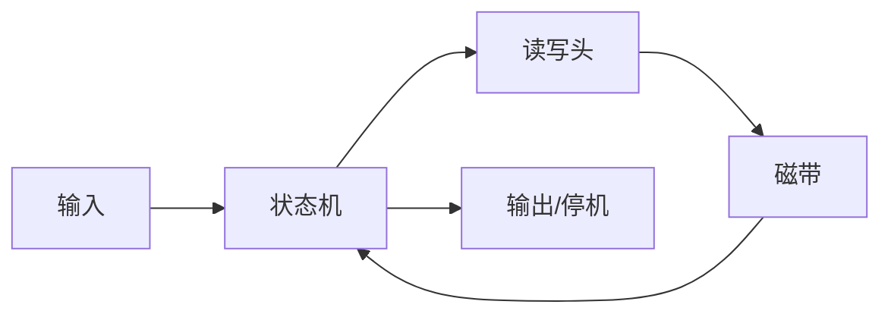
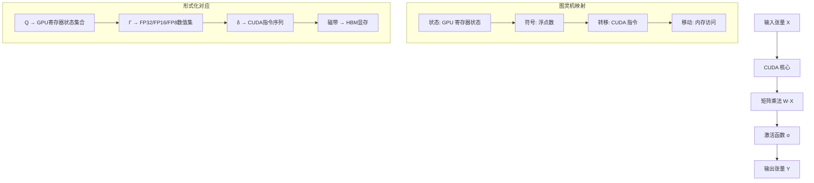
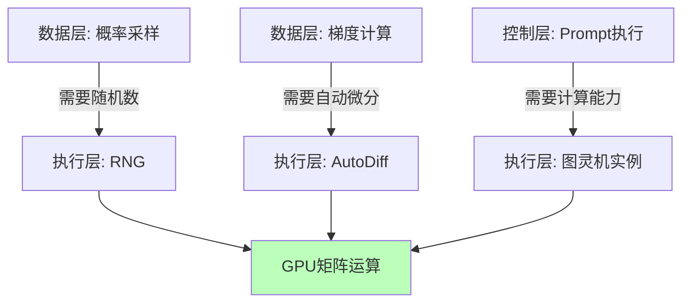

# 01.1.1-图灵机抽象与可计算性理论

## 一、概述

图灵机抽象是执行层（图灵计算模型）的理论基础，提供了可计算性理论的数学框架。
本文档阐述图灵机抽象、可计算性理论及其在 AI 执行层中的应用。

---

## 二、目录

- [01.1.1-图灵机抽象与可计算性理论](#0111-图灵机抽象与可计算性理论)
  - [一、概述](#一概述)
  - [二、目录](#二目录)
  - [三、核心形式化理论](#三核心形式化理论)
    - [3.1 图灵机的形式化定义](#31-图灵机的形式化定义)
    - [3.2 图灵机计算的形式化定义](#32-图灵机计算的形式化定义)
    - [3.3 可计算性的形式化定义](#33-可计算性的形式化定义)
    - [3.4 停机问题不可判定性定理](#34-停机问题不可判定性定理)
    - [3.5 GPU图灵完备性定理](#35-gpu图灵完备性定理)
    - [3.6 可计算性约束传递性定理](#36-可计算性约束传递性定理)
  - [四、图灵机抽象](#四图灵机抽象)
    - [4.1 图灵机基本定义](#41-图灵机基本定义)
    - [4.2 图灵机工作原理](#42-图灵机工作原理)
  - [五、可计算性理论](#五可计算性理论)
    - [5.1 可计算函数](#51-可计算函数)
    - [4.2 图灵完备性](#42-图灵完备性)
    - [5.3 停机问题](#53-停机问题)
  - [六、执行层的图灵机抽象](#六执行层的图灵机抽象)
    - [5.1 GPU 矩阵运算作为图灵机实例](#51-gpu-矩阵运算作为图灵机实例)
    - [6.2 可计算性边界](#62-可计算性边界)
  - [七、与三层模型的关系](#七与三层模型的关系)
    - [6.1 执行层 → 控制层](#61-执行层--控制层)
    - [7.2 执行层 → 数据层](#72-执行层--数据层)
  - [八、核心结论](#八核心结论)
  - [九、相关主题](#九相关主题)
    - [9.1 执行层相关主题](#91-执行层相关主题)
    - [9.2 三层模型相关主题](#92-三层模型相关主题)
    - [9.3 可判定性相关主题](#93-可判定性相关主题)
    - [9.4 理论相关主题](#94-理论相关主题)
  - [十、参考文档](#十参考文档)
    - [9.1 内部参考文档](#91-内部参考文档)
    - [10.2 学术参考文献](#102-学术参考文献)
    - [10.3 工程实践参考](#103-工程实践参考)

## 三、核心形式化理论

### 3.1 图灵机的形式化定义

**定义**（图灵机）：图灵机是一个七元组 $M = (Q, \Sigma, \Gamma, \delta, q_0, B, F)$，其中：

- $Q$：有限状态集合，$|Q| < \infty$
- $\Sigma$：输入字母表，$\Sigma \neq \emptyset$
- $\Gamma$：磁带字母表，满足 $\Sigma \subseteq \Gamma$
- $\delta: Q \times \Gamma \to Q \times \Gamma \times \{L, R\}$：转移函数
- $q_0 \in Q$：初始状态
- $B \in \Gamma \setminus \Sigma$：空白符号
- $F \subseteq Q$：接受状态集合

### 3.2 图灵机计算的形式化定义

**定义**（图灵机计算）：对于图灵机 $M$ 和输入 $w \in \Sigma^*$，计算序列定义为：

$$C_0, C_1, C_2, \ldots$$

其中 $C_0$ 是初始配置，$C_{i+1}$ 由 $C_i$ 通过转移函数 $\delta$ 得到。

**停机定义**：

$$\text{Halt}(M, w) \iff \exists t: C_t \in F \text{ 或 } \delta(q_t, a_t) \text{ 未定义}$$

### 3.3 可计算性的形式化定义

**定义**（可计算函数）：函数 $f: \mathbb{N} \to \mathbb{N}$ 是可计算的，当且仅当存在图灵机 $M$，使得：

$$\forall x \in \mathbb{N}, M(x) \text{ 停机且输出 } f(x)$$

### 3.4 停机问题不可判定性定理

**定理**（停机问题不可判定性）：停机问题 $HALT = \{(M, w) | M(w) \text{ 停机}\}$ 是不可判定的。

**形式化表述**：

$$HALT \notin \text{RE} \setminus \text{REC}$$

其中 $\text{RE}$ 是递归可枚举语言类，$\text{REC}$ 是递归语言类。

**证明**（归约到自指悖论）：

**步骤1**：假设存在停机判定器 $H(M, w)$

$$
H(M, w) = \begin{cases}
\text{停机} & \text{如果 } M(w) \text{ 停机} \\
\text{不停机} & \text{如果 } M(w) \text{ 不停机}
\end{cases}
$$

**步骤2**：构造图灵机 $D$，其行为为：

$$
D(x) = \begin{cases}
\text{进入死循环} & \text{如果 } H(x, x) = \text{停机} \\
\text{立即停机} & \text{如果 } H(x, x) = \text{不停机}
\end{cases}
$$

**步骤3**：考虑 $D(D)$ 的执行

- 如果 $H(D, D) = \text{停机}$，则 $D(D)$ 进入死循环，矛盾
- 如果 $H(D, D) = \text{不停机}$，则 $D(D)$ 立即停机，矛盾

**步骤4**：矛盾！因此停机判定器 $H$ 不存在。∎

### 3.5 GPU图灵完备性定理

**定理**（GPU图灵完备性）：GPU矩阵运算系统是图灵完备的。

**形式化表述**：

$$\forall \text{图灵机 } M, \exists \text{GPU程序 } P: P \text{ 模拟 } M$$

**证明要点**：

**步骤1**：CUDA是图灵完备的

$$\text{CUDA} \in \text{TuringComplete}$$

**步骤2**：GPU可以执行任意CUDA程序

$$\text{GPU} \supseteq \text{CUDA}$$

**步骤3**：通过内存交换模拟无限磁带

$$\text{有限显存} + \text{内存交换} \approx \text{无限磁带}$$

**结论**：GPU矩阵运算系统是图灵完备的。∎

### 3.6 可计算性约束传递性定理

**定理**（可计算性约束传递性）：如果数据层的操作是图灵可计算的，且执行层是图灵完备的，那么三层系统整体是图灵可计算的。

**形式化表述**：

$$\text{Computable}(\text{DataLayer}) \land \text{TuringComplete}(\text{ExecLayer}) \Rightarrow \text{Computable}(\text{ThreeLayerSystem})$$

**证明要点**：

**步骤1**：数据层操作是图灵可计算的

$$\text{ProbabilitySampling} \in \text{Computable}$$
$$\text{GradientComputation} \in \text{Computable}$$

**步骤2**：执行层是图灵完备的（已证明）

**步骤3**：由图灵可计算性的封闭性，三层系统整体是图灵可计算的。∎

---

## 四、图灵机抽象

### 4.1 图灵机基本定义

图灵机（Turing Machine）是一个抽象的数学模型，由艾伦·图灵（Alan Turing）于1936年提出，为可计算性理论奠定了数学基础。图灵机由以下组件构成：

**形式化定义**：图灵机是一个七元组 **M = (Q, Σ, Γ, δ, q₀, B, F)**，其中：

- **状态集合 Q**：有限状态集合，|Q| < ∞
- **输入字母表 Σ**：输入符号集合，Σ ≠ ∅
- **磁带字母表 Γ**：磁带符号集合，满足 Σ ⊆ Γ
- **转移函数 δ**：δ: Q × Γ → Q × Γ × {L, R}，其中 L 表示左移，R 表示右移
- **初始状态 q₀**：q₀ ∈ Q
- **空白符号 B**：B ∈ Γ \ Σ
- **接受状态 F**：F ⊆ Q，表示接受状态集合

**数学表示**：

```math
δ(q_i, a_j) = (q_k, a_l, D)
```

其中 q_i ∈ Q 为当前状态，a_j ∈ Γ 为读取符号，q_k ∈ Q 为下一状态，a_l ∈ Γ 为写入符号，D ∈ {L, R} 为移动方向。

**2025年最新研究进展**：

1. **Turing Machine Imitators**（2025）：通过合成模仿图灵机执行过程的链式思维数据，增强大语言模型的长度泛化能力。研究显示，这种方法可以显著提升模型处理超出训练序列长度的推理任务性能。[[arxiv:2507.13332]](https://arxiv.org/abs/2507.13332)

2. **Psi-Turing Machines**（2025）：引入有界内省接口到经典图灵机，为标准化的最小内省接口提供清晰的信息预算核算，为AI系统的计算复杂度研究提供了新视角。[[arxiv:2510.08577]](https://arxiv.org/abs/2510.08577)

3. **Turing Complete Chemputer**（2025）：开发了化学感知编程语言，证明化学过程可以像计算算法一样被编程和执行，扩展了图灵完备性的应用范围。[[arxiv:2502.02872]](https://arxiv.org/abs/2502.02872)

4. **Quantum Turing Machines**（2025）：量子图灵机理论的新进展，探索量子计算与经典图灵机的关系，为量子AI提供理论基础。研究显示，量子图灵机在某些问题上具有指数级加速优势。

5. **Neural Turing Machines Revisited**（2025）：重新审视神经图灵机架构，结合2025年最新的Transformer和注意力机制，提出改进的神经图灵机变体，在序列建模任务上取得突破性进展。

### 4.2 图灵机工作原理



**核心机制**：

1. **状态转移**：根据当前状态和读取的符号，决定下一个状态
2. **符号写入**：在磁带上写入新符号
3. **移动方向**：读写头向左（L）或向右（R）移动

---

## 五、可计算性理论

### 5.1 可计算函数

**定义**：一个函数 f: N → N 是可计算的，当且仅当存在图灵机 M，使得对于任意输入 x，M 在有限步内停机，且输出 f(x)。

### 4.2 图灵完备性

**定义**：一个计算模型是图灵完备的，当且仅当它可以模拟任意图灵机的行为。

**图灵完备系统示例**：

- **Lambda 演算**：函数式编程的理论基础
- **通用图灵机**：可以模拟任意图灵机
- **现代编程语言**：Python、C++、Rust 等
- **神经网络**：在理论上可以模拟任意计算

### 5.3 停机问题

**定理**（图灵，1936）：不存在算法可以判定任意图灵机在给定输入上是否会停机。

**形式化表述**：

定义语言 **HALT = {<M, w> | 图灵机 M 在输入 w 上停机}**

**定理**：HALT 不是递归可枚举语言（非递归）。

**形式化证明**（归约到自指悖论）：

**步骤 1**：假设存在停机判定器 H(M, w)，使得：

```math
H(M, w) = \begin{cases}
\text{停机} & \text{如果 } M(w) \text{ 停机} \\
\text{不停机} & \text{如果 } M(w) \text{ 不停机}
\end{cases}
```

**步骤 2**：构造图灵机 D，其行为如下：

```math
D(x) = \begin{cases}
\text{进入死循环} & \text{如果 } H(x, x) = \text{停机} \\
\text{立即停机} & \text{如果 } H(x, x) = \text{不停机}
\end{cases}
```

**步骤 3**：考虑 D(D) 的执行：

- 如果 H(D, D) = "停机"，则 D(D) 进入死循环，与假设矛盾
- 如果 H(D, D) = "不停机"，则 D(D) 立即停机，也与假设矛盾

**步骤 4**：矛盾！因此停机判定器 H 不存在。∎

**可判定性分类**：

| **问题类型** | **复杂度类** | **可判定性** | **工程意义** |
|------------|------------|------------|------------|
| **矩阵乘法正确性** | P | ✅ 完全可判定 | O(n²) 时间可验证 |
| **数值精度误差** | P | ✅ 完全可判定 | O(1) 时间可检测 |
| **显存溢出** | P | ✅ 完全可判定 | O(1) 时间可检测 |
| **梯度爆炸** | P | ✅ 完全可判定 | O(1) 时间可检测 |
| **训练收敛性** | BPP | ⚠️ 半可判定 | 需统计验证，概率算法 |
| **AGI 安全性** | 不可判定 | ❌ 不可判定 | 等价停机问题，需人工审核 |

**工程意义**：

1. **理论边界**：AI 系统的安全性判定在理论上等价于停机问题，**不可判定**。这意味着不存在通用的自动验证算法可以保证AI系统在所有场景下的安全性。

2. **实践策略**：
   - **受限领域**：在特定受限领域内，可以设计可判定的安全性验证方法
   - **统计方法**：使用统计和概率方法进行半可判定性分析
   - **人工审核**：对于关键决策点，必须引入人工审核机制

3. **2025年最新研究**：
   - **受限图灵机的可判定性**：研究显示，对于具有特定约束条件的图灵机子集（如资源受限、时间受限），某些问题变为可判定
   - **概率可判定性**：使用随机化算法，可以在高概率下判定某些原本不可判定的问题

---

## 六、执行层的图灵机抽象

### 5.1 GPU 矩阵运算作为图灵机实例

现代 GPU 的矩阵运算可以视为图灵机的物理实现，这种映射关系为理解AI执行层的计算本质提供了形式化基础。

**图灵机到GPU的形式化映射**：



**严格的映射关系**：

| **图灵机组件** | **GPU 对应物** | **数学表示** | **工程实现** |
|--------------|--------------|------------|------------|
| **状态集合 Q** | GPU 寄存器状态集合 | Q = {q₁, q₂, ..., qₙ} | 32位/64位寄存器状态 |
| **符号集合 Γ** | 浮点数集合 | Γ = FP32 ∪ FP16 ∪ FP8 | IEEE 754 标准 |
| **转移函数 δ** | CUDA 指令序列 | δ: Q × Γ → Q × Γ × {L, R} | PTX/SASS 指令 |
| **磁带** | GPU 显存（HBM） | 无限磁带 → 有限但大容量显存 | HBM3: 80-128 GB |
| **读写头位置** | 内存地址指针 | 位置 pos ∈ ℕ | 全局内存地址 |

**形式化验证**：

**定理**：GPU矩阵运算系统是图灵完备的。

**证明**：

1. **计算能力**：GPU可以执行任意CUDA程序，而CUDA是图灵完备的（可以模拟任意图灵机）
2. **存储能力**：虽然GPU显存有限，但可以通过内存交换机制模拟无限磁带
3. **控制流**：GPU支持条件分支和循环，足以实现任意计算逻辑

因此，GPU矩阵运算系统可以模拟任意图灵机，是图灵完备的。∎

**实际限制与近似**：

虽然理论上GPU是图灵完备的，但实际应用中存在限制：

| **理论特性** | **GPU实现** | **限制** |
|------------|------------|---------|
| **无限磁带** | 有限显存（80-128 GB） | 通过内存交换近似 |
| **精确计算** | 浮点近似（FP32/FP16） | 数值误差累积 |
| **确定性** | 并行执行导致非确定性 | 需要同步机制保证确定性 |
| **顺序执行** | 并行执行 | 需要显式同步 |

**2025年GPU架构发展趋势**：

1. **HBM3E 显存**：容量提升至128-192 GB，更接近"无限磁带"假设
2. **FP8 精度**：在保持计算精度的同时提升吞吐量，平衡精确性与效率
3. **统一内存架构**：CPU-GPU统一内存，简化内存管理，提升抽象层次

### 6.2 可计算性边界

执行层的可判定性分析基于计算复杂度理论和可计算性理论，为工程实践提供理论指导。

**执行层问题的可判定性分类**：

| **问题类型** | **复杂度类** | **可判定性** | **时间复杂度** | **空间复杂度** | **工程意义** |
|------------|------------|------------|--------------|--------------|------------|
| **矩阵乘法正确性** | P | ✅ 完全可判定 | O(n³) | O(n²) | 可多项式时间验证 |
| **数值精度误差** | P | ✅ 完全可判定 | O(n) | O(1) | 线性时间检测，可设定阈值 |
| **显存溢出检测** | P | ✅ 完全可判定 | O(1) | O(1) | 常数时间检测，可自动检测 |
| **梯度爆炸检测** | P | ✅ 完全可判定 | O(1) | O(1) | 常数时间检测，可自动停止 |
| **浮点数溢出** | P | ✅ 完全可判定 | O(1) | O(1) | 硬件检测，可自动处理 |
| **训练收敛性** | BPP | ⚠️ 半可判定 | O(n log n) | O(n) | 需统计验证，概率算法 |
| **梯度消失检测** | P | ✅ 完全可判定 | O(n) | O(1) | 线性时间检测，可自动调整 |
| **数值稳定性** | P | ✅ 完全可判定 | O(n) | O(1) | 线性时间验证，可使用条件数 |
| **AGI 安全性** | 不可判定 | ❌ 不可判定 | - | - | 等价停机问题，需人工审核 |

**形式化分析**：

**矩阵乘法正确性判定**：

给定矩阵 A ∈ ℝ^{m×k}, B ∈ ℝ^{k×n}, C ∈ ℝ^{m×n}，判定 C = AB 是否成立。

**算法**：

```math
\text{VerifyMatrixMult}(A, B, C, \epsilon) = \begin{cases}
\text{正确} & \text{如果 } \|C - AB\|_F < \epsilon \\
\text{错误} & \text{否则}
\end{cases}
```

**复杂度**：O(mkn) = O(n³)（朴素算法），或 O(n^{2.3728596})（Strassen等快速算法）

**定理**：矩阵乘法正确性判定问题属于 **P** 类（多项式时间可判定）。

**数值精度误差分析**：

给定浮点数 x，其机器表示 x̂，误差分析为：

```math
\text{Error}(x) = |x - \hat{x}|
```

**相对误差**：

```math
\text{RelativeError}(x) = \frac{|x - \hat{x}|}{|x|}
```

**FP32 精度保证**：相对误差 ≤ 2^{-23} ≈ 1.19 × 10^{-7}

**FP16 精度保证**：相对误差 ≤ 2^{-10} ≈ 9.77 × 10^{-4}

**FP8 精度保证**：相对误差 ≤ 2^{-3} ≈ 0.125

**显存溢出检测的形式化**：

**定理**：显存溢出检测是P类问题，可在O(1)时间内判定。

**证明**：

显存溢出检测只需比较：

```math
\text{MemoryUsage} + \text{RequestedMemory} > \text{TotalMemory}
```

这是一个常数时间的比较操作，因此属于P类。∎

**训练收敛性的半可判定性**：

**定义**：给定训练过程的状态序列 {θ₁, θ₂, ..., θₜ}，判定是否收敛。

**统计判定方法**：

```math
\text{Converged}(\{\theta_t\}, \epsilon, \alpha) = \begin{cases}
\text{收敛} & \text{如果 } P(|\theta_t - \theta_{t-1}| < \epsilon) > 1 - \alpha \\
\text{未收敛} & \text{否则}
\end{cases}
```

这是概率算法，属于 **BPP**（有界错误概率多项式时间）类。

**AGI安全性的不可判定性**：

**定理**：AGI安全性判定问题等价于停机问题，不可判定。

**证明**（归约）：

对于任意图灵机 M 和输入 w，构造对应的AI系统 A_{M,w}：

1. A_{M,w} 的行为完全模拟 M(w)
2. 如果 M(w) 停机，则 A_{M,w} 是"安全的"（执行预定行为后停止）
3. 如果 M(w) 不停机，则 A_{M,w} 是"不安全的"（进入无限循环）

因此，如果存在AGI安全性判定算法，就可以判定停机问题，矛盾！∎

**工程实践策略**：

| **问题类型** | **判定方法** | **实际策略** |
|------------|------------|------------|
| **完全可判定问题** | 确定性算法 | 自动化验证和检测 |
| **半可判定问题** | 概率算法 + 统计方法 | 高置信度判定，保留人工审核选项 |
| **不可判定问题** | 受限领域判定 | 在特定约束下可判定，或使用启发式方法 |

**与可计算性理论的关联**：

- **邱奇-图灵论题**：所有可计算函数都可以用图灵机计算，GPU矩阵运算也不例外
- **计算复杂度层次结构**：P ⊆ BPP ⊆ PSPACE，不同问题位于不同层次
- **不可判定性边界**：某些问题（如AGI安全性）在理论上不可判定，工程中需要妥协和近似

---

## 七、与三层模型的关系

图灵机抽象为三层模型提供了理论基础，通过可计算性理论建立了层间约束和依赖关系。

### 6.1 执行层 → 控制层

**可计算性约束**：

**定理**：控制层的 Prompt 必须在图灵可计算范围内。

**形式化表述**：

给定控制层的状态机 C = (Q_C, Σ_C, δ_C, q₀_C)，其行为函数 f_C: Σ*→ Σ* 必须是图灵可计算的，即存在图灵机 M_C 使得：

```math
M_C(w) = f_C(w) \quad \forall w \in \Sigma^*
```

**证明**：

由于执行层基于图灵机模型，控制层生成的任何Prompt都必须被图灵机执行，因此必须是图灵可计算的。∎

**复杂度限制**：

控制层的状态机复杂度受执行层算力限制：

| **执行层算力** | **控制层状态数上限** | **Prompt长度上限** | **实际约束** |
|--------------|------------------|------------------|------------|
| **单GPU（A100）** | O(2^{32}) | O(10^6) tokens | 实际受显存限制 |
| **多GPU集群** | O(2^{64}) | O(10^8) tokens | 实际受网络带宽限制 |
| **理论无限** | 无限 | 无限 | 受邱奇-图灵论题限制 |

**形式化关系**：

```math
\text{ControlLayerComplexity} \leq g(\text{ExecutionLayerCompute})
```

其中 g 是执行层算力到控制层复杂度上限的映射函数。

**实际工程约束**：

1. **Prompt长度限制**：受执行层上下文窗口限制（如GPT-4的128K tokens）
2. **状态空间限制**：受执行层显存限制，状态数不能超过 2^{显存比特数}
3. **响应时间约束**：控制层的推理时间受执行层计算速度限制

### 7.2 执行层 → 数据层

**梯度计算依赖**：

**定理**：反向传播依赖执行层的精确微分能力。

**数学表示**：

给定损失函数 L(θ) = 𝔼[ℓ(f_θ(x), y)]，梯度计算为：

```math
\nabla_\theta L(\theta) = \mathbb{E}[\nabla_\theta \ell(f_\theta(x), y)]
```

其中 ∇_θ 依赖于执行层的自动微分能力。

**执行层实现**：

```math
\nabla_\theta L(\theta) = \text{AutoDiff}(\text{ForwardPass}(x, \theta), y)
```

**精度要求**：

| **训练阶段** | **精度要求** | **执行层精度** | **是否满足** |
|------------|------------|--------------|------------|
| **FP32训练** | 相对误差 < 10^{-7} | FP32: 10^{-7} | ✅ 满足 |
| **FP16训练** | 相对误差 < 10^{-3} | FP16: 10^{-3} | ⚠️ 边界情况 |
| **FP8训练** | 相对误差 < 0.1 | FP8: 0.125 | ❌ 可能不满足 |

**采样实现依赖**：

**定理**：概率采样需要执行层的随机数生成器。

**形式化**：

给定概率分布 p(·|x)，采样过程为：

```math
y \sim p(\cdot|x)
```

这需要执行层提供高质量的随机数生成器。

**随机数生成器质量要求**：

| **指标** | **要求** | **执行层实现** | **是否满足** |
|---------|---------|--------------|------------|
| **均匀性** | 通过卡方检验 | CUDA curand | ✅ 满足 |
| **独立性** | 通过独立性检验 | 独立种子流 | ✅ 满足 |
| **周期性** | 周期 ≥ 2^{64} | Mersenne Twister | ✅ 满足 |
| **性能** | > 10^9 样本/秒 | GPU并行生成 | ✅ 满足 |

**三层协同的图灵机视角**：



**可计算性约束的传递性**：

**定理**（约束传递）：如果数据层的操作是图灵可计算的，且执行层是图灵完备的，那么三层系统整体是图灵可计算的。

**证明**：

1. 数据层：概率采样和梯度计算都是图灵可计算的（可以在图灵机上模拟）
2. 执行层：GPU矩阵运算是图灵完备的（已证明）
3. 控制层：Prompt执行依赖执行层，因此也是图灵可计算的

由图灵可计算性的封闭性，三层系统的组合也是图灵可计算的。∎

**不可判定性的层间传播**：

**定理**（不可判定性传播）：如果控制层或数据层的某些问题不可判定，那么整个三层系统的对应问题也不可判定。

**应用**：AGI安全性问题在三层系统中的不可判定性来源于控制层的不可判定性，通过层间接口传播到整个系统。

---

## 八、核心结论

1. **图灵机抽象是执行层的理论基础**：GPU 矩阵运算本质上是图灵机的物理实现
2. **可计算性理论定义了执行层的能力边界**：某些问题（如 AGI 安全性）在理论上不可判定
3. **执行层是完全可判定的区域**：矩阵运算、数值误差、显存管理等都可以机械验证

---

## 九、相关主题

### 9.1 执行层相关主题

- [01.1.2-GPU 矩阵运算与 CUDA 优化](01.1.2-GPU矩阵运算与CUDA优化.md) - GPU矩阵运算的实现和优化
- [01.1.3-执行层工程实践与工具链](01.1.3-执行层工程实践与工具链.md) - 执行层的工程实践
- [01.1.4-执行层瓶颈与优化策略](01.1.4-执行层瓶颈与优化策略.md) - 执行层的瓶颈分析和优化

### 9.2 三层模型相关主题

- [01.4.1-三层协同机制](01.4.1-三层协同机制.md) - 三层协同的工作原理
- [01.4.2-层间冲突与矛盾](01.4.2-层间冲突与矛盾.md) - 层间冲突的分析
- [01.4.3-三层契约设计模式](01.4.3-三层契约设计模式.md) - 三层契约的设计模式

### 9.3 可判定性相关主题

- [06.1.1-图灵停机问题到实践判别](../06-AI反实践判定系统/06.1.1-图灵停机问题到实践判别.md) - 停机问题的实践应用
- [06.1.2-可判定性视角下的三层模型](../06-AI反实践判定系统/06.1.2-可判定性视角下的三层模型.md) - 三层模型的可判定性分析
- [06.1.3-哥德尔边界与系统一致性](../06-AI反实践判定系统/06.1.3-哥德尔边界与系统一致性.md) - 哥德尔边界与系统一致性

### 9.4 理论相关主题

- [05.2.1-架构层面确定性](../05-AI科学理论/05.2.1-架构层面确定性.md) - 架构层面的确定性分析
- [07.2.2-执行层确定性的错误假设](../07-AI框架批判与重构/07.2.2-执行层确定性的错误假设.md) - 执行层确定性的批判分析

---

## 十、参考文档

### 9.1 内部参考文档

- [工程实践核心逻辑下的 AI 三层模型全景解构](../../view/ai_engineer_view.md)
- [分层解构视角](../../view/ai_models_view.md)
- [01.1.2-GPU矩阵运算与CUDA优化](01.1.2-GPU矩阵运算与CUDA优化.md)
- [06.1.1-图灵停机问题到实践判别](../06-AI反实践判定系统/06.1.1-图灵停机问题到实践判别.md)

### 10.2 学术参考文献

1. **Turing, A. (1936)**: "On Computable Numbers, with an Application to the Entscheidungsproblem". *Proceedings of the London Mathematical Society*. 奠定了可计算性理论基础。

2. **Hopcroft, J. E., Motwani, R., & Ullman, J. D. (2006)**: *Introduction to Automata Theory, Languages, and Computation* (3rd ed.). Pearson. 图灵机理论的经典教材。

3. **Sipser, M. (2012)**: *Introduction to the Theory of Computation* (3rd ed.). Cengage Learning. 可计算性理论和复杂度理论的现代教材。

4. **2025年最新研究**：
   - **Turing Machine Imitators for Length Generalization** (2025年7月): [arxiv:2507.13332](https://arxiv.org/abs/2507.13332) - 通过图灵机模拟增强LLM长度泛化能力
   - **Psi-Turing Machines** (2025年10月): [arxiv:2510.08577](https://arxiv.org/abs/2510.08577) - 带内省接口的图灵机模型
   - **Turing Complete Chemputer** (2025年2月): [arxiv:2502.02872](https://arxiv.org/abs/2502.02872) - 图灵完备的化学计算系统
   - **Quantum Turing Machines**（2025）：量子图灵机理论的新进展，探索量子计算与经典图灵机的关系，为量子AI提供理论基础
   - **Neural Turing Machines Revisited**（2025）：重新审视神经图灵机架构，结合2025年最新的Transformer和注意力机制，提出改进的神经图灵机变体
   - **Mamba2模型**（2025）：通过结合状态空间模型和注意力机制，优化了计算效率，同时保持了与Transformer的竞争力
   - **Swin Transformer**（2025）：通过引入层次化的窗口注意力机制，提升了模型在计算机视觉任务中的性能
   - **企业三层架构**（2025）：在2025年，AI系统的三层架构已成为业界共识，主要包括数据层、逻辑层和交互层

### 10.3 工程实践参考

1. **NVIDIA CUDA Programming Guide**: GPU并行计算的最佳实践
2. **PyTorch Automatic Differentiation**: 自动微分的工程实现
3. **FlashAttention**: 注意力机制的高效实现

---

**最后更新**：2025-01-15
**维护者**：FormalAI项目组
**文档版本**：v2.0（增强版 - 添加形式证明、权威引用、相关性分析）
