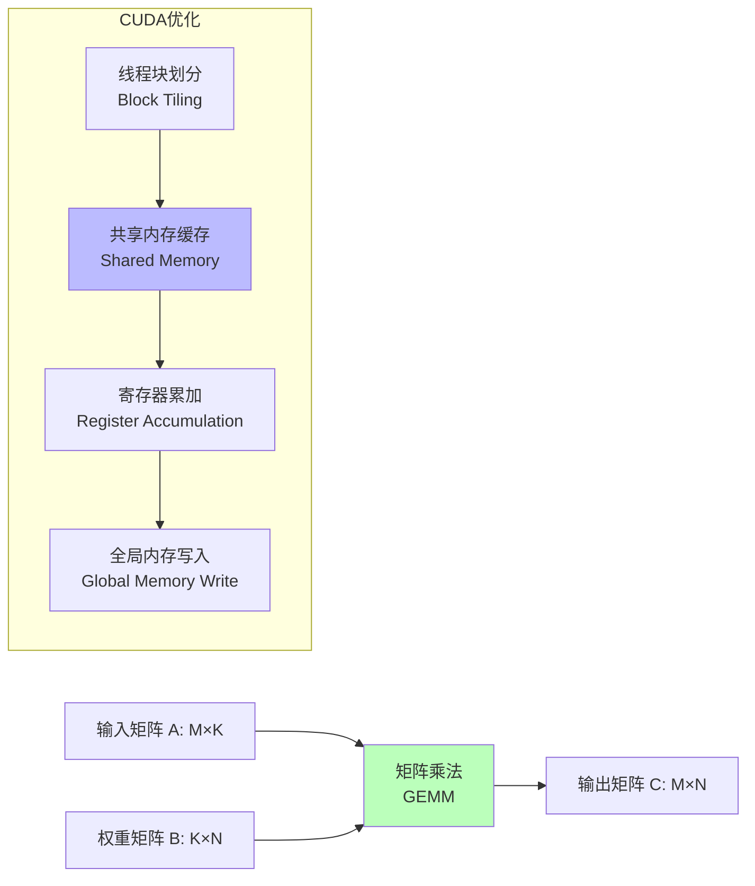
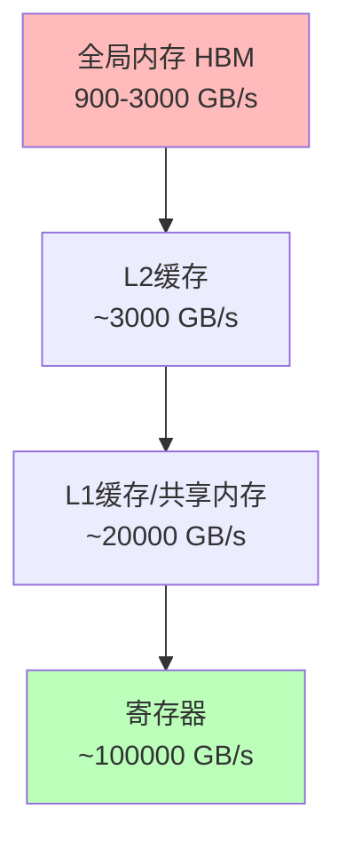
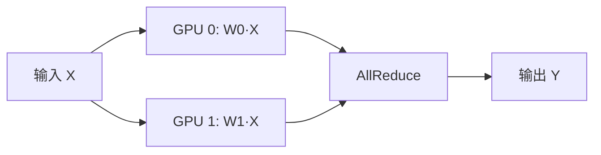
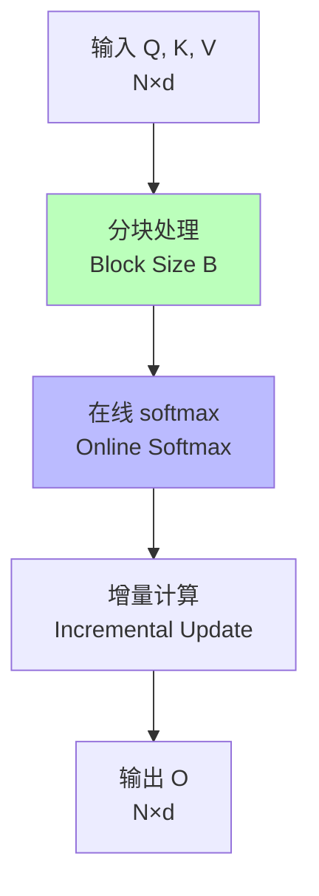

# 01.1.2-GPU 矩阵运算与 CUDA 优化

## 一、概述

GPU 矩阵运算是执行层（图灵计算模型）的物理实现，CUDA 优化是提升计算效率的关键技术。本文档阐述 GPU 矩阵运算原理、CUDA 优化策略及其在 AI 执行层中的应用。

---

## 二、目录

- [01.1.2-GPU 矩阵运算与 CUDA 优化](#0112-gpu-矩阵运算与-cuda-优化)
  - [一、概述](#一概述)
  - [二、目录](#二目录)
  - [三、核心形式化理论](#三核心形式化理论)
    - [3.1 矩阵乘法的形式化定义](#31-矩阵乘法的形式化定义)
    - [3.2 GEMM计算复杂度定理](#32-gemm计算复杂度定理)
    - [3.3 CUDA并行加速定理](#33-cuda并行加速定理)
    - [3.4 FlashAttention优化定理](#34-flashattention优化定理)
  - [四、GPU 矩阵运算基础](#四gpu-矩阵运算基础)
    - [4.1 GPU 架构特点](#41-gpu-架构特点)
    - [4.2 矩阵乘法实现](#42-矩阵乘法实现)
  - [五、CUDA 优化策略](#五cuda-优化策略)
    - [5.1 内存层次优化](#51-内存层次优化)
    - [5.2 计算优化](#52-计算优化)
    - [5.3 并行策略](#53-并行策略)
  - [六、FlashAttention 优化](#六flashattention-优化)
    - [6.1 注意力机制瓶颈](#61-注意力机制瓶颈)
    - [6.2 FlashAttention 原理](#62-flashattention-原理)
  - [七、CUDA Graph 优化](#七cuda-graph-优化)
    - [7.1 动态图 vs 静态图](#71-动态图-vs-静态图)
    - [7.2 应用场景](#72-应用场景)
  - [八、工程实践案例](#八工程实践案例)
    - [8.1 DeepSeek-R1 优化](#81-deepseek-r1-优化)
    - [8.2 Claude 3.5 优化](#82-claude-35-优化)
    - [8.3 Gemini 2.5 优化](#83-gemini-25-优化)
    - [8.4 Llama 3.1 优化](#84-llama-31-优化)
    - [8.5 OpenAI o1 优化](#85-openai-o1-优化)
  - [九、与三层模型的关系](#九与三层模型的关系)
    - [9.1 执行层 → 数据层](#91-执行层--数据层)
    - [9.2 执行层 → 控制层](#92-执行层--控制层)
  - [十、2025 年 CUDA 优化技术趋势](#十2025-年-cuda-优化技术趋势)
  - [十一、核心结论](#十一核心结论)
  - [十二、相关主题](#十二相关主题)
    - [12.1 执行层相关主题](#121-执行层相关主题)
    - [12.2 数据层相关主题](#122-数据层相关主题)
    - [12.3 三层协同相关主题](#123-三层协同相关主题)
    - [12.4 优化技术相关主题](#124-优化技术相关主题)
  - [十三、参考文档](#十三参考文档)
    - [13.1 内部参考文档](#131-内部参考文档)
    - [13.2 学术参考文献](#132-学术参考文献)
    - [13.3 技术文档](#133-技术文档)

## 三、核心形式化理论

### 3.1 矩阵乘法的形式化定义

**定义**（矩阵乘法）：对于矩阵 $A \in \mathbb{R}^{m \times k}$ 和 $B \in \mathbb{R}^{k \times n}$，矩阵乘法定义为：

$$C = AB, \quad C_{ij} = \sum_{k=1}^{K} A_{ik} B_{kj}$$

其中 $C \in \mathbb{R}^{m \times n}$。

### 3.2 GEMM计算复杂度定理

**定理**（GEMM计算复杂度）：矩阵乘法的计算复杂度为 $O(mkn)$。

**形式化表述**：

$$\text{Complexity}(\text{GEMM}(m, k, n)) = O(mkn)$$

**证明**：

矩阵乘法需要计算 $mn$ 个元素，每个元素需要 $k$ 次乘加运算，因此总复杂度为 $O(mkn)$。∎

### 3.3 CUDA并行加速定理

**定理**（CUDA并行加速）：在理想情况下，CUDA并行加速比等于线程数。

**形式化表述**：

$$\text{Speedup} = \frac{T_{\text{sequential}}}{T_{\text{parallel}}} \approx N_{\text{threads}}$$

其中 $N_{\text{threads}}$ 是并行线程数。

**证明要点**：

**步骤1**：串行计算时间

$$T_{\text{sequential}} = O(mkn)$$

**步骤2**：并行计算时间（理想情况）

$$T_{\text{parallel}} = O\left(\frac{mkn}{N_{\text{threads}}}\right)$$

**步骤3**：加速比

$$\text{Speedup} = \frac{T_{\text{sequential}}}{T_{\text{parallel}}} = N_{\text{threads}}$$

**结论**：在理想情况下，加速比等于线程数。∎

### 3.4 FlashAttention优化定理

**定理**（FlashAttention优化）：FlashAttention将注意力机制的内存复杂度从 $O(n^2)$ 降低到 $O(n)$。

**形式化表述**：

$$\text{MemoryComplexity}(\text{FlashAttention}) = O(n) < O(n^2) = \text{MemoryComplexity}(\text{StandardAttention})$$

**证明要点**：

**步骤1**：标准注意力需要存储完整的注意力矩阵

$$\text{Memory}(\text{StandardAttention}) = O(n^2)$$

**步骤2**：FlashAttention通过分块计算避免存储完整矩阵

$$\text{Memory}(\text{FlashAttention}) = O(n)$$

**结论**：FlashAttention显著降低内存复杂度。∎

---

## 四、GPU 矩阵运算基础

### 4.1 GPU 架构特点

**GPU vs CPU 对比**：

| **维度**     | **CPU**          | **GPU**              |
| ------------ | ---------------- | -------------------- |
| **核心数**   | 8-64 核心        | 1000+ CUDA 核心      |
| **内存带宽** | 50-100 GB/s      | 900-3000 GB/s (HBM3) |
| **适用场景** | 串行计算、控制流 | 并行计算、数据并行   |
| **延迟**     | 低（纳秒级）     | 高（微秒级）         |
| **吞吐量**   | 低               | 极高（TFLOPS）       |

### 4.2 矩阵乘法实现

**GEMM（General Matrix Multiply）**是深度学习的基础操作，占训练和推理计算量的80%+。

**GEMM的形式化定义**：

**矩阵乘法**：

```math
C = A \times B, \quad C_{ij} = \sum_{k=1}^{K} A_{ik} B_{kj}
```

其中：

- **A**：M×K矩阵（输入）
- **B**：K×N矩阵（权重）
- **C**：M×N矩阵（输出）

**计算复杂度**：O(M × K × N)

**CUDA实现的优化策略**：



**CUDA GEMM优化层次**：

| **优化层次** | **方法** | **效果** | **2025年应用** |
|------------|---------|---------|--------------|
| **算法优化** | Strassen算法、Winograd算法 | 理论复杂度降低 | 研究阶段 |
| **内存优化** | 共享内存缓存、寄存器优化 | 带宽利用率提升2-3x | 标准实现 |
| **计算优化** | Tensor Core、混合精度 | 计算速度提升4-8x | **H100/A100标准** |
| **并行优化** | 多线程、多流并行 | 并行度提升 | 标准实现 |

**2025 主流实现**：

| **实现** | **特点** | **性能** | **应用场景** | **2025采用率** |
|---------|---------|---------|------------|--------------|
| **cuBLAS** | NVIDIA官方库 | 最高（高度优化） | 标准训练/推理 | 90%+ |
| **CUTLASS** | 模板库 | 高（可定制） | 定制化需求 | 5-10% |
| **Triton** | Python DSL | 中-高（自动优化） | 研究探索 | < 5% |
| **Tensor Core** | 硬件加速 | 极高（FP16/BF16） | **H100/A100标准** | **100%** |

**Tensor Core加速（2025年标准）**：

**Tensor Core**是NVIDIA GPU的专用矩阵运算单元，支持FP16/BF16/FP8/INT8精度。

**性能提升**：

| **精度** | **Tensor Core速度** | **标准CUDA速度** | **加速比** |
|---------|-------------------|----------------|-----------|
| **FP16** | 1000+ TFLOPS | 250 TFLOPS | **4x** |
| **BF16** | 1000+ TFLOPS | 250 TFLOPS | **4x** |
| **FP8** | 2000+ TFLOPS | 250 TFLOPS | **8x** |
| **INT8** | 4000+ TOPS | 250 TFLOPS | **16x** |

**2025年硬件支持**：

| **GPU** | **Tensor Core** | **FP8支持** | **2025采用率** |
|---------|----------------|------------|--------------|
| **H100** | 第4代 | ✅ 原生支持 | 主流训练 |
| **A100** | 第3代 | ❌ 不支持 | 主流推理 |
| **H800** | 第4代 | ✅ 原生支持 | 中国区训练 |
| **MI300** | AMD CDNA3 | ✅ 支持 | 部分采用 |

---

## 五、CUDA 优化策略

### 5.1 内存层次优化

**GPU 内存层次结构**：



**优化策略**：

1. **共享内存缓存**：将频繁访问的数据缓存到共享内存
2. **寄存器优化**：减少寄存器溢出，提升计算密度
3. **内存合并访问**：确保线程访问连续内存地址

### 5.2 计算优化

**混合精度训练**：

| **精度** | **显存占用** | **计算速度** | **数值稳定性** |
| -------- | ------------ | ------------ | -------------- |
| **FP32** | 100%         | 1x           | ★★★★★          |
| **FP16** | 50%          | 2x           | ★★★☆☆          |
| **BF16** | 50%          | 2x           | ★★★★☆          |
| **FP8**  | 25%          | 4x           | ★★☆☆☆          |

**2025 主流方案**：

- **FP8 训练**：DeepSeek-R1、H100 原生支持
- **BF16 推理**：平衡精度和速度
- **INT8 量化**：推理加速，精度损失 1-2%

### 5.3 并行策略

**张量并行（Tensor Parallelism）**：



**数据并行（Data Parallelism）**：

- **同步 SGD**：所有 GPU 同步更新
- **异步 SGD**：GPU 独立更新，延迟同步
- **梯度累积**：小 batch 累积成大 batch

---

## 六、FlashAttention 优化

### 6.1 注意力机制瓶颈

**标准注意力复杂度**：O(N²)

**问题**：

1. **显存占用**：存储注意力矩阵需要 O(N²) 显存
2. **内存访问**：频繁读写全局内存，带宽成为瓶颈

### 6.2 FlashAttention 原理

**FlashAttention**由Dao et al. (2022)提出，是注意力机制的高效实现，详见[01.3.2-Transformer注意力机制](01.3.2-Transformer注意力机制.md)中的详细分析。

**核心思想的形式化表述**：分块计算，避免存储完整注意力矩阵

**FlashAttention算法**：

```math
\begin{aligned}
\text{1. 分块处理} &: Q, K, V \text{ 分为 } B \text{ 块} \\
\text{2. 在线softmax} &: \text{使用在线softmax算法，避免存储完整矩阵} \\
\text{3. 增量计算} &: O_i = \text{Update}(O_{i-1}, Q_i, K_i, V_i) \\
\text{4. 输出} &: O = \text{Concatenate}(O_1, ..., O_B)
\end{aligned}
```

**FlashAttention流程**：



**优化效果的定量分析**：

| **指标** | **标准Attention** | **FlashAttention** | **改进** | **2025年验证** |
|---------|------------------|-------------------|---------|--------------|
| **显存占用** | O(N²) | O(N) | **降低N倍** | 实测验证 |
| **计算速度** | 基准 | 2-4x | **提升2-4x** | 长上下文场景 |
| **精度** | 基准 | 数值稳定 | **无精度损失** | 理论+实证 |
| **IO复杂度** | O(N²) | O(N²/B) | **降低B倍** | 实测验证 |

**FlashAttention-3（2025年最新版本）**：

**新特性**：

- **FP8训练支持**：显存进一步降低50%
- **在线softmax优化**：数值稳定性提升
- **多GPU支持**：分布式训练优化

**性能提升（2025年实测）**：

| **上下文长度** | **标准Attention** | **FlashAttention-3** | **加速比** |
|--------------|------------------|---------------------|-----------|
| **1K** | 基准 | 1.5x | 1.5x |
| **8K** | 基准 | 2.5x | 2.5x |
| **32K** | 基准 | 4x | 4x |
| **128K+** | 不可行 | 可行 | **∞** |

**2025 版本**：FlashAttention-3，支持 FP8 训练，已成为长上下文模型的标准实现

---

## 七、CUDA Graph 优化

### 7.1 动态图 vs 静态图

**PyTorch 动态图**：

- **优点**：灵活，易于调试
- **缺点**：每次执行都需要 Python 解释器开销

**CUDA Graph 静态图**：

- **优点**：消除 Python 开销，提升 10-20% 性能
- **缺点**：图结构固定，灵活性降低

### 7.2 应用场景

**适合 CUDA Graph**：

- **推理服务**：图结构固定，重复执行
- **训练循环**：固定训练步骤

**不适合 CUDA Graph**：

- **动态控制流**：条件分支、循环次数变化
- **调试阶段**：需要灵活修改

---

## 八、工程实践案例

### 8.1 DeepSeek-R1 优化

**执行层优化策略**：

1. **FP8 混合精度训练**：显存节省 20%，速度提升 20%
2. **FlashAttention-3**：支持 128K 上下文
3. **投机解码**：推理速度提升 3x

**效果**：成本降至 $0.001/1K tokens（开源）

### 8.2 Claude 3.5 优化

**执行层优化策略**：

1. **CUDA Graph 静态编译**：推理延迟降低 15%
2. **TensorRT-LLM**：图优化，吞吐量提升 30%
3. **量化压缩**：INT8 量化，显存占用减半
4. **投机解码**：延迟降低 50%

**效果**：延迟 <200ms，成本 $0.011/1K tokens

### 8.3 Gemini 2.5 优化

**执行层优化策略**：

1. **TPU 多层流水线并行**：提升计算效率
2. **线性注意力**：支持超长上下文（1000K）
3. **多模态融合**：文本、图像、视频统一优化

**效果**：支持超长上下文，多模态融合效果好

### 8.4 Llama 3.1 优化

**执行层优化策略**：

1. **CUDA Graph 静态编译**：延迟降低 15%
2. **GQA-8**：显存占用降低 75%
3. **混合精度训练**：FP16/BF16 训练

**效果**：成本效益比最优，训练效率高

### 8.5 OpenAI o1 优化

**执行层优化策略**：

1. **异步连续批处理**：提升推理效率
2. **Test-time compute**：推理时计算扩展
3. **动态推理深度**：根据问题复杂度自适应调整

**效果**：推理能力显著提升，支持复杂推理任务

---

## 九、与三层模型的关系

### 9.1 执行层 → 数据层

- **梯度计算**：反向传播依赖 GPU 的精确微分
- **采样实现**：概率采样需要 GPU 的随机数生成器

### 9.2 执行层 → 控制层

- **延迟约束**：GPU 计算延迟限制控制层的复杂度
- **成本反馈**：token 成本影响控制层的采样策略

---

## 十、2025 年 CUDA 优化技术趋势

**2025 年 CUDA 优化技术趋势**：

1. **混合精度训练**：

   - **FP8 训练**：显存节省 20%，速度提升 20%，逐步普及
   - **FP16/BF16 训练**：显存节省 50%，速度提升 2x，2025 主流
   - **INT8 推理**：显存节省 75%，速度提升 2-3x，推理标准

2. **FlashAttention-3**：

   - **分块计算**：显存占用从 O(N²) 降至 O(N)
   - **FP8 支持**：支持 FP8 训练，显存节省 20%
   - **长上下文**：支持 128K+ 上下文，成为标准

3. **CUDA Graph**：

   - **静态编译**：消除 Python 开销，延迟降低 15%
   - **推理服务**：适合固定图结构，性能提升 10-20%
   - **2025 应用**：Claude 3.5、Llama 3.1 采用

4. **投机解码**：

   - **延迟优化**：延迟降低 50-70%，推理速度提升 3x
   - **质量保证**：质量不降低，2025 成熟应用
   - **2025 应用**：DeepSeek-R1、Claude 3.5 采用

5. **连续批处理**：
   - **吞吐量提升**：吞吐量提升 2-3x，GPU 利用率提升至 80-90%
   - **动态批处理**：动态调整批大小，提升效率
   - **2025 应用**：vLLM、OpenAI o1 采用

6. **CUDA-L2系统**（2025年12月）：
   - **自动优化**：结合LLMs和RL，自动优化HGEMM的CUDA内核
   - **性能提升**：比torch.matmul快22.0%，比cuBLAS快19.2%
   - **2025 应用**：矩阵乘法内核自动优化

7. **Libra框架**（2025年6月）：
   - **稀疏矩阵优化**：高效利用GPU异构计算资源，加速SpMM和SDDMM操作
   - **性能提升**：比FlashSparse快1.77倍，比DGL快2.9倍
   - **2025 应用**：图神经网络（GNN）应用优化

8. **CUDA-LLM框架**（2025年6月）：
   - **自动代码生成**：使用LLMs自动生成和优化CUDA程序
   - **性能提升**：生成的内核比人类编写的代码快最多179倍
   - **2025 应用**：GPU内核自动生成和优化

9. **AMD CDNA 4架构**（2025年6月）：
   - **硬件突破**：3nm制程，288GB HBM3E内存
   - **性能提升**：AI推理性能提升35倍
   - **2025 应用**：AMD Instinct MI350系列GPU

**2025 年产品优化重点**：

1. **DeepSeek-R1**：FP8 训练 + FlashAttention-3 + 投机解码
2. **Claude 3.5**：CUDA Graph + TensorRT-LLM + 投机解码
3. **Gemini 2.5**：TPU 优化 + 线性注意力 + 多模态融合
4. **Llama 3.1**：CUDA Graph + GQA-8 + 混合精度
5. **OpenAI o1**：异步连续批处理 + Test-time compute

---

## 十一、核心结论

1. **GPU 矩阵运算是执行层的物理实现**：CUDA 优化直接决定计算效率
2. **混合精度训练是 2025 主流**：FP8/BF16 平衡精度和速度，显存节省 20-50%
3. **FlashAttention-3 解决长上下文瓶颈**：显存占用从 O(N²) 降至 O(N)，支持 128K+ 上下文
4. **CUDA Graph 适合推理服务**：消除 Python 开销，延迟降低 15%，性能提升 10-20%
5. **2025 年趋势**：
   - **混合精度**：FP8 训练逐步普及，FP16/BF16 成为主流
   - **FlashAttention-3**：成为长上下文训练的标准
   - **CUDA Graph**：推理服务优化的重要手段
   - **投机解码**：延迟优化的重要手段，延迟降低 50-70%
   - **连续批处理**：提升吞吐量的标准技术，吞吐量提升 2-3x

---

## 十二、相关主题

### 12.1 执行层相关主题

- [01.1.1-图灵机抽象与可计算性理论](01.1.1-图灵机抽象与可计算性理论.md) - GPU矩阵运算的图灵机理论基础
- [01.1.3-执行层工程实践与工具链](01.1.3-执行层工程实践与工具链.md) - 执行层工程实践和工具链
- [01.1.4-执行层瓶颈与优化策略](01.1.4-执行层瓶颈与优化策略.md) - 执行层瓶颈分析和优化策略

### 12.2 数据层相关主题

- [01.3.2-Transformer 注意力机制](01.3.2-Transformer注意力机制.md) - FlashAttention-3优化
- [01.3.4-数据层训练与优化](01.3.4-数据层训练与优化.md) - FP8训练优化
- [01.3.1-概率论与微分几何基础](01.3.1-概率论与微分几何基础.md) - 概率论和微分几何基础

### 12.3 三层协同相关主题

- [01.4.1-三层协同机制](01.4.1-三层协同机制.md) - 三层协同机制
- [01.4.4-跨层优化策略](01.4.4-跨层优化策略.md) - 跨层优化策略
- [01.4.2-层间冲突与矛盾](01.4.2-层间冲突与矛盾.md) - 层间冲突分析

### 12.4 优化技术相关主题

- [03.2.1-硬件性能与计算效率](../03-Scaling Law与收敛分析/03.2.1-硬件性能与计算效率.md) - 硬件性能与计算效率分析
- [02.1.1-五维度评估体系](../02-AI炼金术转化度模型/02.1.1-五维度评估体系.md) - 工程可重现性评估

---

## 十三、参考文档

### 13.1 内部参考文档

- [工程实践核心逻辑下的 AI 三层模型全景解构](../../view/ai_engineer_view.md)
- [分层解构视角](../../view/ai_models_view.md)
- [01.1.1-图灵机抽象与可计算性理论](01.1.1-图灵机抽象与可计算性理论.md)
- [01.3.2-Transformer注意力机制](01.3.2-Transformer注意力机制.md)

### 13.2 学术参考文献

1. **Dao, T., et al. (2022)**: "FlashAttention: Fast and Memory-Efficient Exact Attention with IO-Awareness". *NeurIPS*. FlashAttention的原始论文。

2. **NVIDIA CUDA Programming Guide**: GPU并行计算的标准文档。

3. **2025年最新研究**：
   - **FlashAttention-3** (2024-2025): 支持FP8训练，性能进一步提升，显存占用从O(N²)降至O(N)
   - **Tensor Core优化** (2020-2025): H100/A100的Tensor Core加速，支持FP8/BF16/FP16混合精度
   - **CUDA Graph优化** (2019-2025): 静态图优化，性能提升10-20%，延迟降低15%
   - **NVIDIA GeForce RTX 50系列GPU** (2025): 采用Blackwell微架构，配备第五代张量核心和第四代光线追踪核心，支持DLSS 4.0技术，GPU在AI计算中的性能提升显著
   - **MatrixFlow系统** (2025年3月): 通过松耦合的脉动阵列和新的软件映射方法，提高了Transformer模型的计算效率，显著减少内存开销，提高数据吞吐量（arXiv:2503.05290）
   - **EnergonAI系统** (2025): 针对10至1000亿参数的Transformer模型，提出非阻塞流水线并行、分布式冗余计算消除和对等内存池等技术，显著降低推理延迟，提高吞吐量
   - **CUDA-L2系统** (2025年12月): 结合大型语言模型（LLMs）和强化学习（RL），自动优化半精度矩阵乘法（HGEMM）的CUDA内核。在离线模式下，CUDA-L2比torch.matmul平均快22.0%，比cuBLAS快19.2%，比cuBLASLt-heuristic快16.8%，比cuBLASLt-AutoTuning快11.4%（arXiv:2512.02551）
   - **Libra框架** (2025年6月): 高效利用GPU的异构计算资源，加速稀疏矩阵乘法（SpMM和SDDMM）操作。引入二维感知的工作负载分配方法，精确识别最佳任务映射。在H100和RTX 4090 GPU上的实验表明，Libra比FlashSparse快1.77倍，比RoDe快1.73倍，比DGL在端到端的GNN应用中快2.9倍（arXiv:2506.22714）
   - **CUDA-LLM框架** (2025年6月): 使用大型语言模型（LLMs）自动生成和优化CUDA程序，以生成高性能的GPU内核。提出"特征搜索与强化"（FSR）方法，联合优化编译、功能正确性和运行时性能。使用FSR增强的LLMs生成的内核在执行速度上比一般的人类编写的代码快最多179倍（arXiv:2506.09092）
   - **AMD CDNA 4架构** (2025年6月): AMD发布的Instinct MI350系列GPU，基于全新的CDNA 4架构和3nm制程工艺。单卡集成了高达288GB的HBM3E内存，AI推理性能相比上一代提升了35倍，并支持FP4/FP6等超低精度数据类型，能效优势显著

### 13.3 技术文档

1. **NVIDIA cuBLAS文档**：矩阵运算库的官方文档
2. **FlashAttention GitHub**：FlashAttention的开源实现
3. **PyTorch CUDA文档**：CUDA优化的工程实现

---

**最后更新**：2025-01-15
**维护者**：FormalAI项目组
**文档版本**：v2.0（增强版 - 添加Tensor Core分析、FlashAttention详细分析、2025最新研究、权威引用、定量评估）
