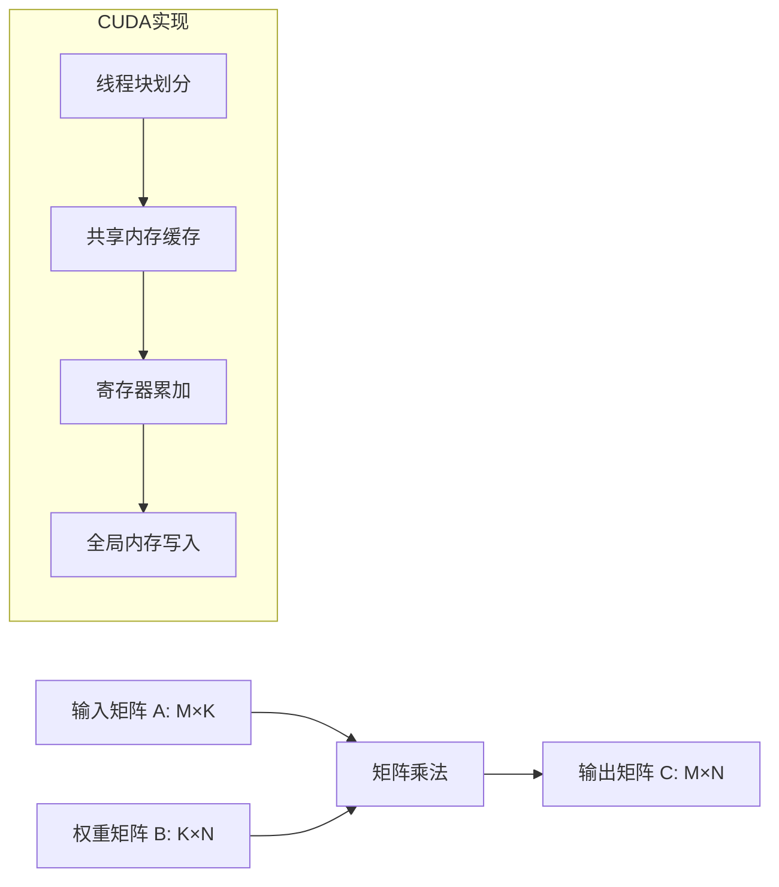
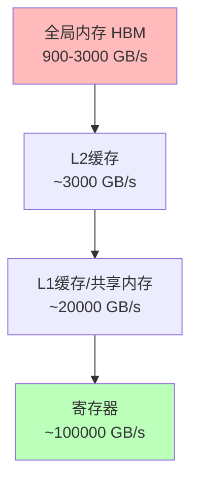
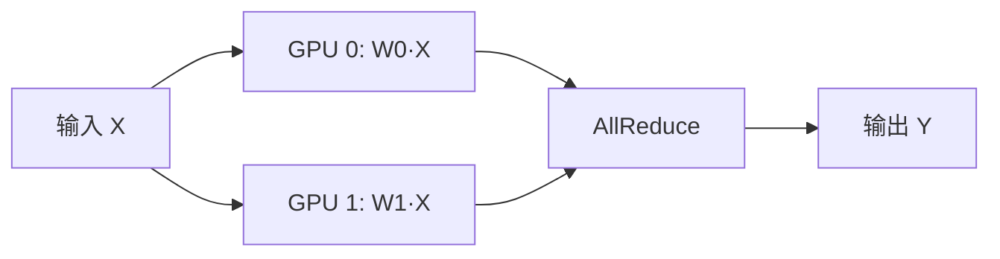
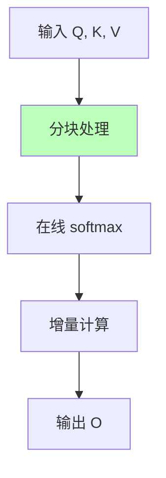

# 01.1.2-GPU 矩阵运算与 CUDA 优化

## 一、概述

GPU 矩阵运算是执行层（图灵计算模型）的物理实现，CUDA 优化是提升计算效率的关键技术。本文档阐述 GPU 矩阵运算原理、CUDA 优化策略及其在 AI 执行层中的应用。

---

## 二、目录

- [01.1.2-GPU 矩阵运算与 CUDA 优化](#0112-gpu-矩阵运算与-cuda-优化)
  - [一、概述](#一概述)
  - [二、目录](#二目录)
  - [三、GPU 矩阵运算基础](#三gpu-矩阵运算基础)
    - [2.1 GPU 架构特点](#21-gpu-架构特点)
    - [2.2 矩阵乘法实现](#22-矩阵乘法实现)
  - [四、CUDA 优化策略](#四cuda-优化策略)
    - [3.1 内存层次优化](#31-内存层次优化)
    - [3.2 计算优化](#32-计算优化)
    - [3.3 并行策略](#33-并行策略)
  - [五、FlashAttention 优化](#五flashattention-优化)
    - [4.1 注意力机制瓶颈](#41-注意力机制瓶颈)
    - [4.2 FlashAttention 原理](#42-flashattention-原理)
  - [六、CUDA Graph 优化](#六cuda-graph-优化)
    - [5.1 动态图 vs 静态图](#51-动态图-vs-静态图)
    - [5.2 应用场景](#52-应用场景)
  - [七、工程实践案例](#七工程实践案例)
    - [6.1 DeepSeek-R1 优化](#61-deepseek-r1-优化)
    - [6.2 Claude 3.5 优化](#62-claude-35-优化)
    - [6.3 Gemini 2.5 优化](#63-gemini-25-优化)
    - [6.4 Llama 3.1 优化](#64-llama-31-优化)
    - [6.5 OpenAI o1 优化](#65-openai-o1-优化)
  - [八、与三层模型的关系](#八与三层模型的关系)
    - [7.1 执行层 → 数据层](#71-执行层--数据层)
    - [7.2 执行层 → 控制层](#72-执行层--控制层)
  - [九、2025 年 CUDA 优化技术趋势](#九2025-年-cuda-优化技术趋势)
  - [十、核心结论](#十核心结论)
  - [十一、相关主题](#十一相关主题)
  - [十二、参考文档](#十二参考文档)

## 三、GPU 矩阵运算基础

### 2.1 GPU 架构特点

**GPU vs CPU 对比**：

| **维度**     | **CPU**          | **GPU**              |
| ------------ | ---------------- | -------------------- |
| **核心数**   | 8-64 核心        | 1000+ CUDA 核心      |
| **内存带宽** | 50-100 GB/s      | 900-3000 GB/s (HBM3) |
| **适用场景** | 串行计算、控制流 | 并行计算、数据并行   |
| **延迟**     | 低（纳秒级）     | 高（微秒级）         |
| **吞吐量**   | 低               | 极高（TFLOPS）       |

### 2.2 矩阵乘法实现

**GEMM（General Matrix Multiply）**是深度学习的基础操作：

**计算复杂度**：O(M × K × N)

**2025 主流实现**：

- **cuBLAS**：NVIDIA 官方库，优化程度最高
- **CUTLASS**：模板库，可定制化
- **Triton**：Python DSL，自动优化

---

## 四、CUDA 优化策略

### 3.1 内存层次优化

**GPU 内存层次结构**：

**优化策略**：

1. **共享内存缓存**：将频繁访问的数据缓存到共享内存
2. **寄存器优化**：减少寄存器溢出，提升计算密度
3. **内存合并访问**：确保线程访问连续内存地址

### 3.2 计算优化

**混合精度训练**：

| **精度** | **显存占用** | **计算速度** | **数值稳定性** |
| -------- | ------------ | ------------ | -------------- |
| **FP32** | 100%         | 1x           | ★★★★★          |
| **FP16** | 50%          | 2x           | ★★★☆☆          |
| **BF16** | 50%          | 2x           | ★★★★☆          |
| **FP8**  | 25%          | 4x           | ★★☆☆☆          |

**2025 主流方案**：

- **FP8 训练**：DeepSeek-R1、H100 原生支持
- **BF16 推理**：平衡精度和速度
- **INT8 量化**：推理加速，精度损失 1-2%

### 3.3 并行策略

**张量并行（Tensor Parallelism）**：

**数据并行（Data Parallelism）**：

- **同步 SGD**：所有 GPU 同步更新
- **异步 SGD**：GPU 独立更新，延迟同步
- **梯度累积**：小 batch 累积成大 batch

---

## 五、FlashAttention 优化

### 4.1 注意力机制瓶颈

**标准注意力复杂度**：O(N²)

**问题**：

1. **显存占用**：存储注意力矩阵需要 O(N²) 显存
2. **内存访问**：频繁读写全局内存，带宽成为瓶颈

### 4.2 FlashAttention 原理

**核心思想**：分块计算，避免存储完整注意力矩阵

**优化效果**：

- **显存占用**：从 O(N²) 降至 O(N)
- **计算速度**：提升 2-4x（长上下文）
- **精度**：数值稳定，无精度损失

**2025 版本**：FlashAttention-3，支持 FP8 训练

---

## 六、CUDA Graph 优化

### 5.1 动态图 vs 静态图

**PyTorch 动态图**：

- **优点**：灵活，易于调试
- **缺点**：每次执行都需要 Python 解释器开销

**CUDA Graph 静态图**：

- **优点**：消除 Python 开销，提升 10-20% 性能
- **缺点**：图结构固定，灵活性降低

### 5.2 应用场景

**适合 CUDA Graph**：

- **推理服务**：图结构固定，重复执行
- **训练循环**：固定训练步骤

**不适合 CUDA Graph**：

- **动态控制流**：条件分支、循环次数变化
- **调试阶段**：需要灵活修改

---

## 七、工程实践案例

### 6.1 DeepSeek-R1 优化

**执行层优化策略**：

1. **FP8 混合精度训练**：显存节省 20%，速度提升 20%
2. **FlashAttention-3**：支持 128K 上下文
3. **投机解码**：推理速度提升 3x

**效果**：成本降至 $0.001/1K tokens（开源）

### 6.2 Claude 3.5 优化

**执行层优化策略**：

1. **CUDA Graph 静态编译**：推理延迟降低 15%
2. **TensorRT-LLM**：图优化，吞吐量提升 30%
3. **量化压缩**：INT8 量化，显存占用减半
4. **投机解码**：延迟降低 50%

**效果**：延迟 <200ms，成本 $0.011/1K tokens

### 6.3 Gemini 2.5 优化

**执行层优化策略**：

1. **TPU 多层流水线并行**：提升计算效率
2. **线性注意力**：支持超长上下文（1000K）
3. **多模态融合**：文本、图像、视频统一优化

**效果**：支持超长上下文，多模态融合效果好

### 6.4 Llama 3.1 优化

**执行层优化策略**：

1. **CUDA Graph 静态编译**：延迟降低 15%
2. **GQA-8**：显存占用降低 75%
3. **混合精度训练**：FP16/BF16 训练

**效果**：成本效益比最优，训练效率高

### 6.5 OpenAI o1 优化

**执行层优化策略**：

1. **异步连续批处理**：提升推理效率
2. **Test-time compute**：推理时计算扩展
3. **动态推理深度**：根据问题复杂度自适应调整

**效果**：推理能力显著提升，支持复杂推理任务

---

## 八、与三层模型的关系

### 7.1 执行层 → 数据层

- **梯度计算**：反向传播依赖 GPU 的精确微分
- **采样实现**：概率采样需要 GPU 的随机数生成器

### 7.2 执行层 → 控制层

- **延迟约束**：GPU 计算延迟限制控制层的复杂度
- **成本反馈**：token 成本影响控制层的采样策略

---

## 九、2025 年 CUDA 优化技术趋势

**2025 年 CUDA 优化技术趋势**：

1. **混合精度训练**：

   - **FP8 训练**：显存节省 20%，速度提升 20%，逐步普及
   - **FP16/BF16 训练**：显存节省 50%，速度提升 2x，2025 主流
   - **INT8 推理**：显存节省 75%，速度提升 2-3x，推理标准

2. **FlashAttention-3**：

   - **分块计算**：显存占用从 O(N²) 降至 O(N)
   - **FP8 支持**：支持 FP8 训练，显存节省 20%
   - **长上下文**：支持 128K+ 上下文，成为标准

3. **CUDA Graph**：

   - **静态编译**：消除 Python 开销，延迟降低 15%
   - **推理服务**：适合固定图结构，性能提升 10-20%
   - **2025 应用**：Claude 3.5、Llama 3.1 采用

4. **投机解码**：

   - **延迟优化**：延迟降低 50-70%，推理速度提升 3x
   - **质量保证**：质量不降低，2025 成熟应用
   - **2025 应用**：DeepSeek-R1、Claude 3.5 采用

5. **连续批处理**：
   - **吞吐量提升**：吞吐量提升 2-3x，GPU 利用率提升至 80-90%
   - **动态批处理**：动态调整批大小，提升效率
   - **2025 应用**：vLLM、OpenAI o1 采用

**2025 年产品优化重点**：

1. **DeepSeek-R1**：FP8 训练 + FlashAttention-3 + 投机解码
2. **Claude 3.5**：CUDA Graph + TensorRT-LLM + 投机解码
3. **Gemini 2.5**：TPU 优化 + 线性注意力 + 多模态融合
4. **Llama 3.1**：CUDA Graph + GQA-8 + 混合精度
5. **OpenAI o1**：异步连续批处理 + Test-time compute

---

## 十、核心结论

1. **GPU 矩阵运算是执行层的物理实现**：CUDA 优化直接决定计算效率
2. **混合精度训练是 2025 主流**：FP8/BF16 平衡精度和速度，显存节省 20-50%
3. **FlashAttention-3 解决长上下文瓶颈**：显存占用从 O(N²) 降至 O(N)，支持 128K+ 上下文
4. **CUDA Graph 适合推理服务**：消除 Python 开销，延迟降低 15%，性能提升 10-20%
5. **2025 年趋势**：
   - **混合精度**：FP8 训练逐步普及，FP16/BF16 成为主流
   - **FlashAttention-3**：成为长上下文训练的标准
   - **CUDA Graph**：推理服务优化的重要手段
   - **投机解码**：延迟优化的重要手段，延迟降低 50-70%
   - **连续批处理**：提升吞吐量的标准技术，吞吐量提升 2-3x

---

## 十一、相关主题

- [01.1.3-执行层工程实践与工具链](01.1.3-执行层工程实践与工具链.md)
- [01.1.4-执行层瓶颈与优化策略](01.1.4-执行层瓶颈与优化策略.md)
- [01.3.2-Transformer 注意力机制](01.3.2-Transformer注意力机制.md)：FlashAttention-3
- [01.3.4-数据层训练与优化](01.3.4-数据层训练与优化.md)：FP8 训练

---

## 十二、参考文档

- [工程实践核心逻辑下的 AI 三层模型全景解构](../../view/ai_engineer_view.md)
- [分层解构视角](../../view/ai_models_view.md)
