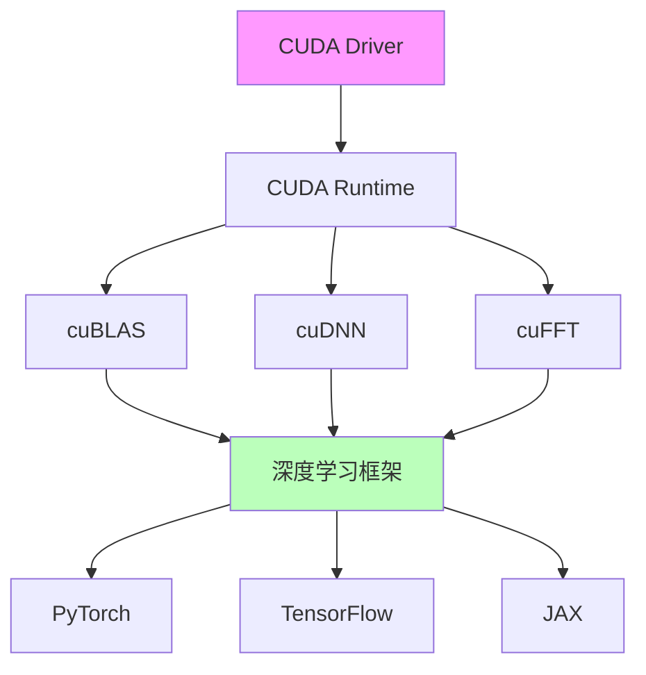
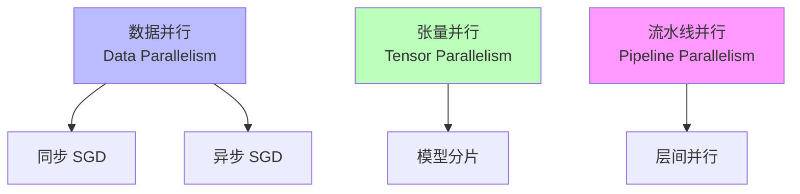
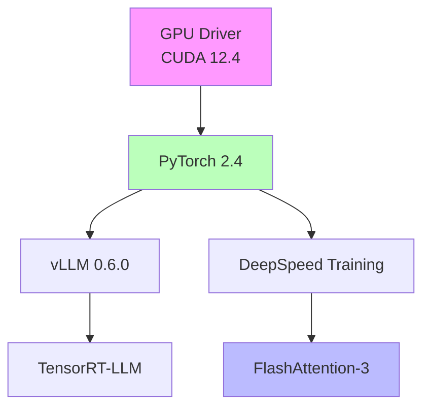

# 01.1.3-执行层工程实践与工具链

## 目录

- [01.1.3-执行层工程实践与工具链](#0113-执行层工程实践与工具链)
  - [目录](#目录)
  - [一、概述](#一概述)
  - [二、GPU 工具链](#二gpu-工具链)
    - [2.1 CUDA 生态](#21-cuda-生态)
    - [2.2 深度学习框架](#22-深度学习框架)
  - [三、工程实践](#三工程实践)
    - [3.1 分布式训练](#31-分布式训练)
    - [3.2 推理优化](#32-推理优化)
  - [四、工具链依赖](#四工具链依赖)
    - [4.1 依赖关系](#41-依赖关系)
    - [4.2 冲突与解决](#42-冲突与解决)
  - [五、工程实践案例](#五工程实践案例)
    - [5.1 DeepSeek-R1 工具链](#51-deepseek-r1-工具链)
    - [5.2 Claude 3.5 工具链](#52-claude-35-工具链)
  - [六、与三层模型的关系](#六与三层模型的关系)
    - [6.1 执行层 → 数据层](#61-执行层--数据层)
    - [6.2 执行层 → 控制层](#62-执行层--控制层)
  - [七、核心结论](#七核心结论)
  - [八、相关主题](#八相关主题)
  - [九、参考文档](#九参考文档)

---

## 一、概述

执行层工程实践与工具链是 AI 系统执行层（图灵计算模型）的工程实现，包括 GPU 工具链、框架生态和工程实践。本文档阐述执行层工程实践、工具链及其在 AI 系统中的应用。

---

## 二、GPU 工具链

### 2.1 CUDA 生态

**CUDA 生态体系**：

**CUDA 核心组件**：

- **CUDA Driver**：底层驱动，管理 GPU 资源
- **CUDA Runtime**：运行时库，提供 API
- **cuBLAS**：矩阵运算库
- **cuDNN**：深度学习库
- **cuFFT**：快速傅里叶变换库

### 2.2 深度学习框架

**主流框架对比**：

| **框架**       | **特点**         | **优势**           | **劣势**     |
| -------------- | ---------------- | ------------------ | ------------ |
| **PyTorch**    | 动态图，易调试   | 灵活，易用         | 性能略低     |
| **TensorFlow** | 静态图，性能高   | 性能优秀，生态完善 | 学习曲线陡峭 |
| **JAX**        | 函数式，自动微分 | 性能优秀，可组合   | 生态较小     |

**2025 主流**：PyTorch 2.4（动态图 + 静态图优化）

---

## 三、工程实践

### 3.1 分布式训练

**分布式训练策略**：

**分布式训练工具**：

- **DeepSpeed**：微软开源，支持 ZeRO 优化
- **Megatron-LM**：NVIDIA 开源，支持张量并行
- **FSDP**：PyTorch 原生，支持全分片数据并行

### 3.2 推理优化

**推理优化策略**：

| **策略**     | **方法**             | **效果**            | **成本**       |
| ------------ | -------------------- | ------------------- | -------------- |
| **量化**     | INT8/FP16 量化       | 显存-50%，速度+2x   | 精度损失 1-2%  |
| **剪枝**     | 结构化/非结构化剪枝  | 模型-30%，速度+1.5x | 精度损失 2-5%  |
| **蒸馏**     | 知识蒸馏             | 模型-50%，速度+2x   | 精度损失 5-10% |
| **编译优化** | TensorRT/TorchScript | 速度+2-3x           | 灵活性降低     |

**推理服务框架**：

- **vLLM**：PagedAttention，支持长上下文
- **TensorRT-LLM**：NVIDIA 优化，性能最高
- **Triton**：Python DSL，自动优化

---

## 四、工具链依赖

### 4.1 依赖关系

**执行层工具链依赖**：

**版本兼容性**：

- **CUDA 12.4+**：支持 FlashAttention-3
- **PyTorch 2.4+**：支持 CUDA Graph
- **vLLM 0.6.0+**：支持 PagedAttention

### 4.2 冲突与解决

**工具链冲突**：

| **冲突**                   | **原因**                     | **解决方案**      |
| -------------------------- | ---------------------------- | ----------------- |
| **vLLM vs PyTorch**        | vLLM 不支持某些 PyTorch 算子 | 使用 TensorRT-LLM |
| **FlashAttention vs CUDA** | 需要 CUDA 12.4+              | 升级 CUDA 驱动    |
| **DeepSpeed vs FSDP**      | 两者不兼容                   | 选择其一          |

---

## 五、工程实践案例

### 5.1 DeepSeek-R1 工具链

**执行层工具链**：

1. **GPU**：H800（FP8 支持）
2. **框架**：PyTorch 2.4
3. **优化**：FlashAttention-3 + FP8 训练
4. **推理**：vLLM（PagedAttention）

**效果**：成本降至 $0.001/1K tokens

### 5.2 Claude 3.5 工具链

**执行层工具链**：

1. **GPU**：H100（TensorRT 支持）
2. **框架**：TensorRT-LLM
3. **优化**：CUDA Graph 静态编译
4. **推理**：投机解码（Speculative Decoding）

**效果**：延迟 <200ms，成本 $0.011/1K tokens

---

## 六、与三层模型的关系

### 6.1 执行层 → 数据层

- **梯度计算**：执行层提供 Autograd 能力
- **采样实现**：执行层提供随机数生成器
- **并行策略**：执行层支持分布式训练

### 6.2 执行层 → 控制层

- **延迟约束**：执行层延迟限制控制层复杂度
- **成本反馈**：执行层成本影响控制层策略
- **错误注入**：执行层错误触发控制层回滚

---

## 七、核心结论

1. **CUDA 生态是执行层的基础**：提供 GPU 计算能力
2. **PyTorch 是 2025 主流框架**：动态图 + 静态图优化
3. **分布式训练是训练大模型的关键**：数据并行 + 张量并行
4. **推理优化是降低成本的关键**：量化 + 编译优化

---

## 八、相关主题

- [01.1.2-GPU 矩阵运算与 CUDA 优化](01.1.2-GPU矩阵运算与CUDA优化.md)
- [01.1.4-执行层瓶颈与优化策略](01.1.4-执行层瓶颈与优化策略.md)
- [01.4.1-三层协同机制](01.4.1-三层协同机制.md)

---

## 九、参考文档

- [工程实践核心逻辑下的 AI 三层模型全景解构](../../view/ai_engineer_view.md)
