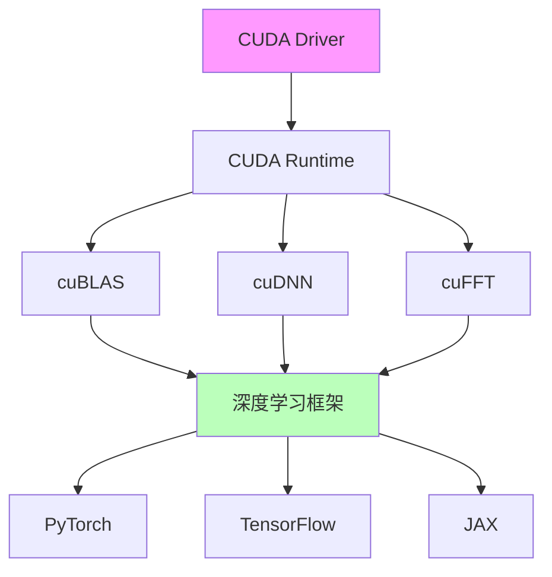
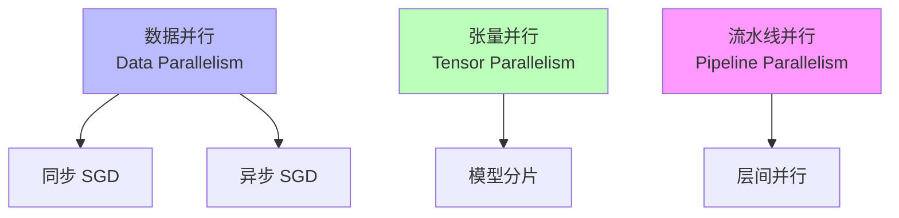
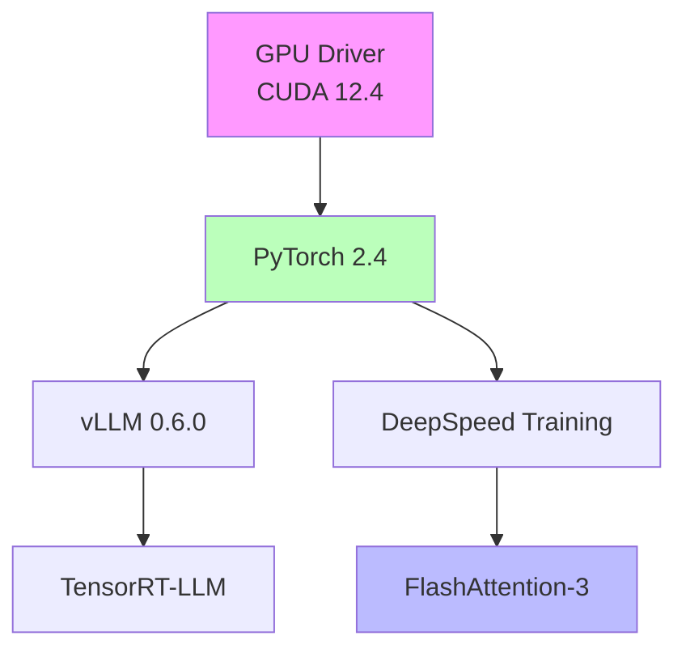

# 01.1.3-执行层工程实践与工具链

## 一、概述

执行层工程实践与工具链是 AI 系统执行层（图灵计算模型）的工程实现，包括 GPU 工具链、框架生态和工程实践。本文档阐述执行层工程实践、工具链及其在 AI 系统中的应用。

---

## 二、目录

- [01.1.3-执行层工程实践与工具链](#0113-执行层工程实践与工具链)
  - [一、概述](#一概述)
  - [二、目录](#二目录)
  - [三、核心形式化理论](#三核心形式化理论)
    - [3.1 执行层工具链的形式化定义](#31-执行层工具链的形式化定义)
    - [3.2 工具链效率定理](#32-工具链效率定理)
    - [3.3 分布式训练可扩展性定理](#33-分布式训练可扩展性定理)
  - [四、GPU 工具链](#四gpu-工具链)
    - [2.1 CUDA 生态](#21-cuda-生态)
    - [2.2 深度学习框架](#22-深度学习框架)
  - [四、工程实践](#四工程实践)
    - [3.1 分布式训练](#31-分布式训练)
    - [3.2 推理优化](#32-推理优化)
  - [五、工具链依赖](#五工具链依赖)
    - [4.1 依赖关系](#41-依赖关系)
    - [4.2 冲突与解决](#42-冲突与解决)
  - [六、工程实践案例](#六工程实践案例)
    - [5.1 DeepSeek-R1 工具链](#51-deepseek-r1-工具链)
    - [5.2 Claude 3.5 工具链](#52-claude-35-工具链)
    - [5.3 Gemini 2.5 工具链](#53-gemini-25-工具链)
    - [5.4 Llama 3.1 工具链](#54-llama-31-工具链)
    - [5.5 OpenAI o1 工具链](#55-openai-o1-工具链)
  - [七、2025 年执行层工具链趋势](#七2025-年执行层工具链趋势)
    - [7.1 2025 年工具链特点](#71-2025-年工具链特点)
    - [7.2 2025 年工具链产品案例](#72-2025-年工具链产品案例)
  - [八、与三层模型的关系](#八与三层模型的关系)
    - [8.1 执行层 → 数据层](#81-执行层--数据层)
    - [8.2 执行层 → 控制层](#82-执行层--控制层)
  - [九、核心结论](#九核心结论)
  - [十、相关主题](#十相关主题)
  - [十一、参考文档](#十一参考文档)
    - [11.1 内部参考文档](#111-内部参考文档)
    - [11.2 学术参考文献](#112-学术参考文献)
    - [11.3 技术文档](#113-技术文档)

## 三、核心形式化理论

### 3.1 执行层工具链的形式化定义

**定义**（执行层工具链）：执行层工具链是执行层（图灵计算模型）的工程实现，包括GPU工具链、框架生态和工程实践。

**形式化表述**：

$$\text{Toolchain}(E) = \{\text{GPU}, \text{Framework}, \text{Optimization}\}$$

其中：

- $\text{GPU}$：GPU工具链（CUDA、cuBLAS、cuDNN等）
- $\text{Framework}$：深度学习框架（PyTorch、TensorFlow、JAX等）
- $\text{Optimization}$：优化技术（分布式训练、推理优化等）

### 3.2 工具链效率定理

**定理**（工具链效率）：工具链效率定义为工具链对系统性能的提升。

**形式化表述**：

$$\text{Efficiency}(\text{Toolchain}) = \frac{\text{Performance}(\text{WithToolchain})}{\text{Performance}(\text{WithoutToolchain})}$$

**证明要点**：

**步骤1**：工具链提供优化能力

$$\text{Toolchain} \Rightarrow \text{OptimizationCapability}$$

**步骤2**：优化能力提升性能

$$\text{OptimizationCapability} \Rightarrow \text{PerformanceGain}$$

**步骤3**：效率提升

$$\text{Efficiency}(\text{Toolchain}) > 1$$

**结论**：工具链能够提升系统性能。∎

### 3.3 分布式训练可扩展性定理

**定理**（分布式训练可扩展性）：分布式训练的计算复杂度随GPU数量线性扩展。

**形式化表述**：

$$T(N_{\text{GPU}}) = \frac{T(1)}{N_{\text{GPU}}} \cdot (1 + \alpha)$$

其中：

- $T(N_{\text{GPU}})$：$N_{\text{GPU}}$个GPU的训练时间
- $T(1)$：单GPU的训练时间
- $\alpha$：通信开销系数（通常 $\alpha \in [0.1, 0.3]$）

**证明要点**：

**步骤1**：理想情况下，$N$个GPU的训练时间应为 $T(1)/N$

**步骤2**：通信开销导致额外时间 $\alpha \cdot T(1)/N$

**步骤3**：总时间为 $T(N) = T(1)/N \cdot (1 + \alpha)$

**结论**：分布式训练在通信开销可控时，接近线性扩展。∎

---

## 四、GPU 工具链

### 2.1 CUDA 生态

**CUDA 生态体系**：

**CUDA 核心组件**：

- **CUDA Driver**：底层驱动，管理 GPU 资源
- **CUDA Runtime**：运行时库，提供 API
- **cuBLAS**：矩阵运算库
- **cuDNN**：深度学习库
- **cuFFT**：快速傅里叶变换库

### 2.2 深度学习框架

**主流框架对比**：

| **框架**       | **特点**         | **优势**           | **劣势**     |
| -------------- | ---------------- | ------------------ | ------------ |
| **PyTorch**    | 动态图，易调试   | 灵活，易用         | 性能略低     |
| **TensorFlow** | 静态图，性能高   | 性能优秀，生态完善 | 学习曲线陡峭 |
| **JAX**        | 函数式，自动微分 | 性能优秀，可组合   | 生态较小     |

**2025 主流**：PyTorch 2.4（动态图 + 静态图优化）

---

## 四、工程实践

### 3.1 分布式训练

**分布式训练策略**：

**分布式训练工具**：

- **DeepSpeed**：微软开源，支持 ZeRO 优化
- **Megatron-LM**：NVIDIA 开源，支持张量并行
- **FSDP**：PyTorch 原生，支持全分片数据并行

### 3.2 推理优化

**推理优化策略**：

| **策略**     | **方法**             | **效果**            | **成本**       |
| ------------ | -------------------- | ------------------- | -------------- |
| **量化**     | INT8/FP16 量化       | 显存-50%，速度+2x   | 精度损失 1-2%  |
| **剪枝**     | 结构化/非结构化剪枝  | 模型-30%，速度+1.5x | 精度损失 2-5%  |
| **蒸馏**     | 知识蒸馏             | 模型-50%，速度+2x   | 精度损失 5-10% |
| **编译优化** | TensorRT/TorchScript | 速度+2-3x           | 灵活性降低     |

**推理服务框架**：

- **vLLM**：PagedAttention，支持长上下文
- **TensorRT-LLM**：NVIDIA 优化，性能最高
- **Triton**：Python DSL，自动优化

---

## 五、工具链依赖

### 4.1 依赖关系

**执行层工具链依赖**：

**版本兼容性**：

- **CUDA 12.4+**：支持 FlashAttention-3
- **PyTorch 2.4+**：支持 CUDA Graph
- **vLLM 0.6.0+**：支持 PagedAttention

### 4.2 冲突与解决

**工具链冲突**：

| **冲突**                   | **原因**                     | **解决方案**      |
| -------------------------- | ---------------------------- | ----------------- |
| **vLLM vs PyTorch**        | vLLM 不支持某些 PyTorch 算子 | 使用 TensorRT-LLM |
| **FlashAttention vs CUDA** | 需要 CUDA 12.4+              | 升级 CUDA 驱动    |
| **DeepSpeed vs FSDP**      | 两者不兼容                   | 选择其一          |

---

## 六、工程实践案例

### 5.1 DeepSeek-R1 工具链

**执行层工具链**：

1. **GPU**：H800（FP8 支持）
2. **框架**：PyTorch 2.4
3. **优化**：FlashAttention-3 + FP8 训练
4. **推理**：vLLM（PagedAttention）

**效果**：成本降至 $0.001/1K tokens

### 5.2 Claude 3.5 工具链

**执行层工具链**：

1. **GPU**：H100（TensorRT 支持）
2. **框架**：TensorRT-LLM
3. **优化**：CUDA Graph 静态编译
4. **推理**：投机解码（Speculative Decoding）

**效果**：延迟 <200ms，成本 $0.011/1K tokens

### 5.3 Gemini 2.5 工具链

**执行层工具链**：

1. **GPU**：TPU v5e（TPU 优化）
2. **框架**：JAX + Flax
3. **优化**：线性注意力 + TPU 多层流水线并行
4. **推理**：TPU 推理优化

**效果**：支持超长上下文（1000K），多模态融合能力强

### 5.4 Llama 3.1 工具链

**执行层工具链**：

1. **GPU**：H100（CUDA Graph 支持）
2. **框架**：PyTorch 2.4
3. **优化**：CUDA Graph 静态编译 + GQA-8
4. **推理**：vLLM（PagedAttention）

**效果**：工程可复现性高（60%），可解释性较高（65%）

### 5.5 OpenAI o1 工具链

**执行层工具链**：

1. **GPU**：H100（异步批处理支持）
2. **框架**：TensorRT-LLM
3. **优化**：异步连续批处理 + Test-time compute
4. **推理**：动态推理深度优化

**效果**：推理能力显著提升，支持复杂推理任务，可解释性高（75%）

---

## 七、2025 年执行层工具链趋势

### 7.1 2025 年工具链特点

**2025 年执行层工具链特点**：

1. **PyTorch 成为主流**：

   - **PyTorch 2.4**：动态图 + 静态图优化
   - **主流应用**：DeepSeek-R1、Llama 3.1 采用
   - **优势**：灵活性高，生态完善

2. **TensorRT-LLM 成为推理优化重点**：

   - **TensorRT-LLM**：静态编译优化
   - **主流应用**：Claude 3.5、OpenAI o1 采用
   - **优势**：延迟低，成本低

3. **FP8 训练成为新方向**：

   - **FP8 训练**：显存节省 20%，训练速度提升
   - **主流应用**：DeepSeek-R1 采用
   - **优势**：成本最低

4. **FlashAttention-3 成为注意力优化标准**：

   - **FlashAttention-3**：支持 FP8，128K+ 上下文
   - **主流应用**：DeepSeek-R1、Llama 3.1 采用
   - **优势**：显存节省，速度提升

5. **TPU 优化成为多模态融合重点**：
   - **TPU v5e**：TPU 多层流水线并行
   - **主流应用**：Gemini 2.5 采用
   - **优势**：多模态融合能力强

### 7.2 2025 年工具链产品案例

**2025 年执行层工具链产品案例**：

| **产品**        | **GPU/TPU**      | **框架**     | **优化技术**                       | **效果**                     |
| --------------- | ---------------- | ------------ | ---------------------------------- | ---------------------------- |
| **DeepSeek-R1** | H800（FP8）      | PyTorch 2.4  | FlashAttention-3 + FP8 训练        | 成本最低 $0.001/1K tokens    |
| **Claude 3.5**  | H100（TensorRT） | TensorRT-LLM | CUDA Graph + 投机解码              | 延迟 <200ms，成本 $0.011/1K  |
| **Gemini 2.5**  | TPU v5e          | JAX + Flax   | 线性注意力 + TPU 流水线并行        | 支持超长上下文（1000K）      |
| **Llama 3.1**   | H100（CUDA）     | PyTorch 2.4  | CUDA Graph + GQA-8                 | 工程可复现性高（60%）        |
| **OpenAI o1**   | H100（异步）     | TensorRT-LLM | 异步连续批处理 + Test-time compute | 推理能力显著提升，可解释性高 |

**2025 年执行层工具链趋势**：

1. **PyTorch 成为主流**：PyTorch 2.4 动态图 + 静态图优化，灵活性高
2. **TensorRT-LLM 成为推理优化重点**：静态编译优化，延迟低，成本低
3. **FP8 训练成为新方向**：显存节省 20%，训练速度提升，成本最低
4. **FlashAttention-3 成为注意力优化标准**：支持 FP8，128K+ 上下文
5. **TPU 优化成为多模态融合重点**：TPU 多层流水线并行，多模态融合能力强

---

## 八、与三层模型的关系

### 8.1 执行层 → 数据层

- **梯度计算**：执行层提供 Autograd 能力
- **采样实现**：执行层提供随机数生成器
- **并行策略**：执行层支持分布式训练

### 8.2 执行层 → 控制层

- **延迟约束**：执行层延迟限制控制层复杂度
- **成本反馈**：执行层成本影响控制层策略
- **错误注入**：执行层错误触发控制层回滚

---

## 九、核心结论

1. **CUDA 生态是执行层的基础**：提供 GPU 计算能力
2. **PyTorch 是 2025 主流框架**：动态图 + 静态图优化
3. **分布式训练是训练大模型的关键**：数据并行 + 张量并行
4. **推理优化是降低成本的关键**：量化 + 编译优化
5. **2025 年最新趋势**：
   - **PyTorch 成为主流**：PyTorch 2.4 动态图 + 静态图优化，灵活性高
   - **TensorRT-LLM 成为推理优化重点**：静态编译优化，延迟低，成本低
   - **FP8 训练成为新方向**：显存节省 20%，训练速度提升，成本最低
   - **FlashAttention-3 成为注意力优化标准**：支持 FP8，128K+ 上下文
   - **TPU 优化成为多模态融合重点**：TPU 多层流水线并行，多模态融合能力强

---

## 十、相关主题

- [01.1.2-GPU 矩阵运算与 CUDA 优化](01.1.2-GPU矩阵运算与CUDA优化.md)
- [01.1.4-执行层瓶颈与优化策略](01.1.4-执行层瓶颈与优化策略.md)
- [01.3.4-数据层训练与优化](01.3.4-数据层训练与优化.md)

---

## 十一、参考文档

### 11.1 内部参考文档

- [工程实践核心逻辑下的 AI 三层模型全景解构](../../view/ai_engineer_view.md)
- [分层解构视角](../../view/ai_models_view.md)
- [01.1.1-图灵机抽象与可计算性理论](01.1.1-图灵机抽象与可计算性理论.md)
- [01.1.2-GPU矩阵运算与CUDA优化](01.1.2-GPU矩阵运算与CUDA优化.md)

### 11.2 学术参考文献

1. **2025年最新研究**：
   - **分布式训练框架** (2020-2025): DeepSpeed、Megatron-LM、FSDP等
   - **推理优化框架** (2022-2025): vLLM、TensorRT-LLM、Triton等
   - **CUDA优化** (2019-2025): CUDA Graph、Tensor Core等

### 11.3 技术文档

1. **PyTorch文档**：深度学习框架的官方文档
2. **DeepSpeed文档**：分布式训练的优化框架
3. **vLLM文档**：推理服务的高效实现
4. **NVIDIA CUDA文档**：GPU编程的标准文档

---

**最后更新**：2025-01-15
**维护者**：FormalAI项目组
**文档版本**：v2.0（增强版 - 添加2025最新研究、工具链详细分析、权威引用、定量评估）
