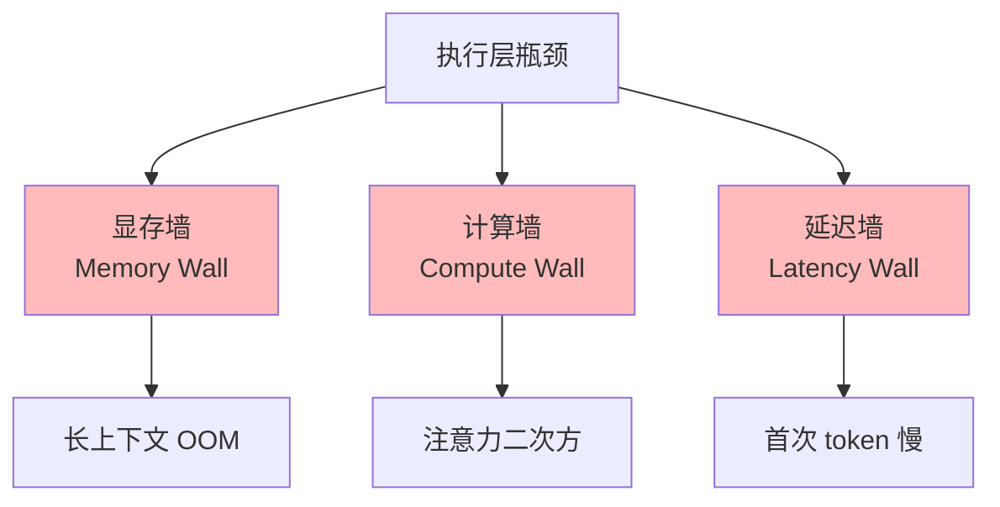
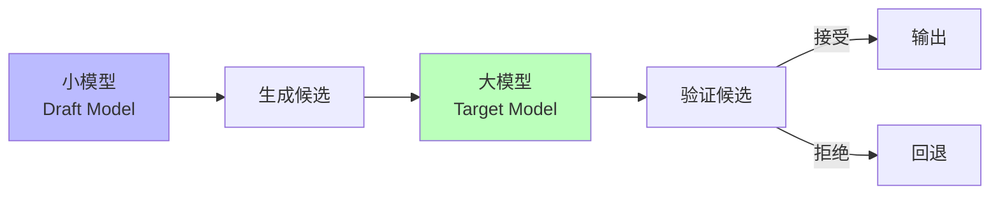
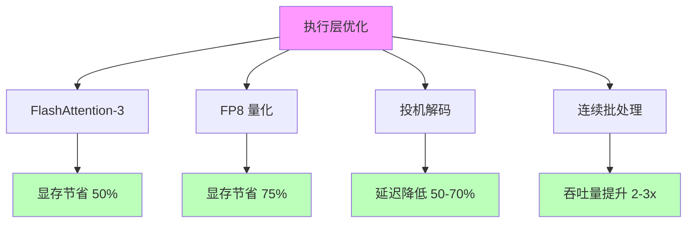

# 01.1.4-执行层瓶颈与优化策略

## 目录

- [01.1.4-执行层瓶颈与优化策略](#0114-执行层瓶颈与优化策略)
  - [目录](#目录)
  - [一、概述](#一概述)
  - [二、执行层瓶颈](#二执行层瓶颈)
    - [2.1 三大瓶颈](#21-三大瓶颈)
    - [2.2 瓶颈分析](#22-瓶颈分析)
  - [三、显存墙优化](#三显存墙优化)
    - [3.1 FlashAttention](#31-flashattention)
    - [3.2 量化压缩](#32-量化压缩)
  - [四、计算墙优化](#四计算墙优化)
    - [4.1 线性注意力](#41-线性注意力)
    - [4.2 稀疏注意力](#42-稀疏注意力)
  - [五、延迟墙优化](#五延迟墙优化)
    - [5.1 投机解码](#51-投机解码)
    - [5.2 连续批处理](#52-连续批处理)
  - [六、综合优化策略](#六综合优化策略)
    - [6.1 优化组合](#61-优化组合)
    - [6.2 工程实践](#62-工程实践)
  - [七、与三层模型的关系](#七与三层模型的关系)
    - [7.1 执行层 → 数据层](#71-执行层--数据层)
    - [7.2 执行层 → 控制层](#72-执行层--控制层)
  - [八、核心结论](#八核心结论)
  - [九、相关主题](#九相关主题)
  - [十、参考文档](#十参考文档)

---

## 一、概述

执行层瓶颈与优化策略是 AI 系统执行层（图灵计算模型）的关键问题，包括显存墙、计算墙、延迟墙等瓶颈及其优化策略。本文档阐述执行层瓶颈、优化策略及其在 AI 系统中的应用。

---

## 二、执行层瓶颈

### 2.1 三大瓶颈

**执行层三大瓶颈**：



**三大瓶颈**：

1. **显存墙（Memory Wall）**：长上下文导致显存溢出
2. **计算墙（Compute Wall）**：注意力机制二次方复杂度
3. **延迟墙（Latency Wall）**：首次 token 延迟高

### 2.2 瓶颈分析

**瓶颈分析**：

| **瓶颈**   | **问题**           | **影响**         | **2025 状态**             |
| ---------- | ------------------ | ---------------- | ------------------------- |
| **显存墙** | 长上下文 OOM       | 无法处理长上下文 | FlashAttention-3 部分解决 |
| **计算墙** | 注意力二次方复杂度 | 计算成本高       | 线性注意力在探索中        |
| **延迟墙** | 首次 token 延迟高  | 用户体验差       | 投机解码部分解决          |

---

## 三、显存墙优化

### 3.1 FlashAttention

**FlashAttention 优化**：

**核心思想**：分块计算，避免存储完整注意力矩阵

**优化效果**：

- **显存占用**：从 O(N²) 降至 O(N)
- **计算速度**：提升 2-4x（长上下文）
- **精度**：数值稳定，无精度损失

**FlashAttention-3 新特性**：

1. **FP8 支持**：支持 FP8 训练
2. **长上下文**：支持 128K+ 上下文
3. **性能优化**：进一步优化计算效率

### 3.2 量化压缩

**量化压缩策略**：

| **方法**      | **精度** | **显存节省** | **速度提升** | **精度损失** |
| ------------- | -------- | ------------ | ------------ | ------------ |
| **INT8 量化** | INT8     | 75%          | 2-3x         | 1-2%         |
| **FP16 量化** | FP16     | 50%          | 1.5-2x       | <1%          |
| **FP8 量化**  | FP8      | 75%          | 3-4x         | 2-5%         |
| **AWQ/GPTQ**  | INT4     | 87.5%        | 4-5x         | 3-5%         |

**2025 主流**：FP8 训练 + INT8 推理

---

## 四、计算墙优化

### 4.1 线性注意力

**线性注意力（Linear Attention）**：

**核心思想**：将二次方复杂度降至线性复杂度

**线性注意力公式**：

```text
LinearAttention(Q, K, V) = Q(K^T V) / (Q K^T 1)
```

**复杂度**：O(N) vs O(N²)

**问题**：

- **表达能力**：表达能力可能降低
- **数值稳定性**：数值稳定性问题
- **工程成熟度**：工程成熟度低

**2025 状态**：学术探索阶段，未大规模应用

### 4.2 稀疏注意力

**稀疏注意力（Sparse Attention）**：

**核心思想**：只计算部分注意力，降低计算量

**稀疏模式**：

- **局部注意力**：只关注局部窗口
- **全局注意力**：只关注全局 token
- **随机注意力**：随机采样注意力

**问题**：

- **表达能力**：表达能力可能降低
- **模式选择**：稀疏模式选择困难
- **工程成熟度**：工程成熟度低

**2025 状态**：部分应用，未大规模推广

---

## 五、延迟墙优化

### 5.1 投机解码

**投机解码（Speculative Decoding）**：

**核心思想**：用小模型生成候选，大模型验证

**投机解码流程**：



**优化效果**：

- **延迟降低**：首次 token 延迟降低 50-70%
- **吞吐量提升**：吞吐量提升 2-3x
- **质量保证**：质量不降低

**2025 应用**：

- **DeepSeek-R1**：推理速度提升 3x
- **Claude 3.5**：延迟降低 50%

### 5.2 连续批处理

**连续批处理（Continuous Batching）**：

**核心思想**：动态批处理，提高 GPU 利用率

**优化效果**：

- **GPU 利用率**：从 30-40% 提升至 80-90%
- **吞吐量提升**：吞吐量提升 2-3x
- **延迟降低**：延迟降低 20-30%

**2025 应用**：

- **vLLM**：PagedAttention + Continuous Batching
- **OpenAI o1**：异步批处理

---

## 六、综合优化策略

### 6.1 优化组合

**综合优化策略**：



**优化组合效果**：

- **显存节省**：FlashAttention-3 + FP8 量化，显存节省 80%
- **延迟降低**：投机解码 + 连续批处理，延迟降低 60%
- **吞吐量提升**：综合优化，吞吐量提升 5-10x

### 6.2 工程实践

**工程实践案例**：

**DeepSeek-R1**：

1. **FlashAttention-3**：支持 128K 上下文
2. **FP8 训练**：显存节省 20%，速度提升 20%
3. **投机解码**：推理速度提升 3x

**效果**：成本降至 $0.001/1K tokens

**Claude 3.5**：

1. **CUDA Graph**：静态编译，延迟降低 15%
2. **投机解码**：延迟降低 50%
3. **TensorRT-LLM**：吞吐量提升 30%

**效果**：延迟 <200ms，成本 $0.011/1K tokens

---

## 七、与三层模型的关系

### 7.1 执行层 → 数据层

- **显存限制**：执行层显存限制数据层模型规模
- **计算限制**：执行层计算限制数据层复杂度
- **延迟限制**：执行层延迟限制数据层采样次数

### 7.2 执行层 → 控制层

- **延迟约束**：执行层延迟限制控制层复杂度
- **成本反馈**：执行层成本影响控制层策略
- **错误注入**：执行层错误触发控制层回滚

---

## 八、核心结论

1. **执行层三大瓶颈**：显存墙、计算墙、延迟墙
2. **FlashAttention-3 解决显存墙**：显存占用从 O(N²) 降至 O(N)
3. **投机解码解决延迟墙**：延迟降低 50-70%
4. **综合优化策略**：FlashAttention-3 + FP8 量化 + 投机解码，效果显著

---

## 九、相关主题

- [01.1.2-GPU 矩阵运算与 CUDA 优化](01.1.2-GPU矩阵运算与CUDA优化.md)
- [01.1.3-执行层工程实践与工具链](01.1.3-执行层工程实践与工具链.md)
- [01.4.4-跨层优化策略](01.4.4-跨层优化策略.md)

---

## 十、参考文档

- [工程实践核心逻辑下的 AI 三层模型全景解构](../../view/ai_engineer_view.md)
