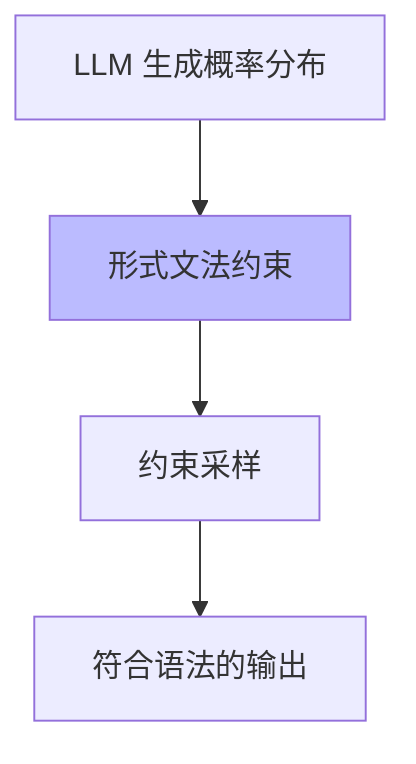

# 01.2.1-形式文法与 λ 演算

## 一、概述

形式文法与 λ 演算是控制层（形式语言模型）的理论基础，提供了语言的形式化描述和计算模型。本文档阐述形式文法、λ 演算及其在 AI 控制层中的应用。

---

## 二、目录

- [01.2.1-形式文法与 λ 演算](#0121-形式文法与-λ-演算)
  - [一、概述](#一概述)
  - [二、目录](#二目录)
  - [三、核心形式化理论](#三核心形式化理论)
    - [3.1 形式文法的形式化定义](#31-形式文法的形式化定义)
    - [3.2 上下文无关文法的形式化定义](#32-上下文无关文法的形式化定义)
    - [3.3 λ演算的形式化定义](#33-λ演算的形式化定义)
    - [3.4 λ演算归约定理](#34-λ演算归约定理)
  - [四、形式文法](#四形式文法)
    - [4.1 乔姆斯基层级](#41-乔姆斯基层级)
    - [2.2 上下文无关文法（CFG）](#22-上下文无关文法cfg)
  - [四、λ 演算](#四λ-演算)
    - [3.1 λ 演算基础](#31-λ-演算基础)
    - [3.2 类型系统](#32-类型系统)
    - [3.3 在控制层中的应用](#33-在控制层中的应用)
  - [五、形式语言与概率模型的融合](#五形式语言与概率模型的融合)
    - [4.1 约束解码](#41-约束解码)
    - [4.2 形式验证](#42-形式验证)
  - [六、工程实践案例](#六工程实践案例)
    - [5.1 Claude 3.5 的 Constitutional AI](#51-claude-35-的-constitutional-ai)
    - [5.2 OpenAI 的 Function Calling](#52-openai-的-function-calling)
  - [七、与三层模型的关系](#七与三层模型的关系)
    - [6.1 控制层 → 数据层](#61-控制层--数据层)
    - [6.2 控制层 → 执行层](#62-控制层--执行层)
  - [八、核心结论](#八核心结论)
  - [九、相关主题](#九相关主题)
    - [9.1 控制层相关主题](#91-控制层相关主题)
    - [9.2 数据层相关主题](#92-数据层相关主题)
    - [9.3 三层协同相关主题](#93-三层协同相关主题)
    - [9.4 理论相关主题](#94-理论相关主题)
  - [十、参考文档](#十参考文档)
    - [10.1 内部参考文档](#101-内部参考文档)
    - [10.2 学术参考文献](#102-学术参考文献)
    - [10.3 技术文档](#103-技术文档)

## 三、核心形式化理论

### 3.1 形式文法的形式化定义

**定义**（形式文法）：形式文法 $G = (V, \Sigma, R, S)$ 是一个四元组，其中：

- $V$：非终结符集合
- $\Sigma$：终结符集合（$V \cap \Sigma = \emptyset$）
- $R \subseteq (V \cup \Sigma)^* \times (V \cup \Sigma)^*$：产生式规则集合
- $S \in V$：起始符号

### 3.2 上下文无关文法的形式化定义

**定义**（上下文无关文法）：上下文无关文法（CFG）是形式文法 $G = (V, \Sigma, R, S)$，其中所有产生式规则形如 $A \to \alpha$，其中 $A \in V$，$\alpha \in (V \cup \Sigma)^*$。

**形式化表述**：

$$\forall (l, r) \in R, l \in V \land r \in (V \cup \Sigma)^*$$

### 3.3 λ演算的形式化定义

**定义**（λ项）：给定变量集合 $V$，λ项集合 $\Lambda$ 递归定义为：

$$\Lambda = V \cup \{\lambda x.M | x \in V, M \in \Lambda\} \cup \{M N | M, N \in \Lambda\}$$

### 3.4 λ演算归约定理

**定理**（λ演算归约）：对于λ项 $M$，如果存在归约序列 $M \to^* N$，则 $N$ 是 $M$ 的范式。

**形式化表述**：

$$\text{Reduce}(M) = \{N | M \to^* N \land \neg \exists N', N \to N'\}$$

**证明要点**（基于Church-Rosser定理）：

**步骤1**：Church-Rosser定理保证范式唯一性

$$\text{If } M \to^* N_1 \text{ and } M \to^* N_2, \text{ then } \exists N: N_1 \to^* N \text{ and } N_2 \to^* N$$

**步骤2**：范式不存在进一步归约

$$\text{NormalForm}(N) \iff \neg \exists N', N \to N'$$

**结论**：λ演算归约保证范式存在。∎

---

## 四、形式文法

### 4.1 乔姆斯基层级

**形式文法分类**：

| **类型**               | **规则形式**    | **表达能力** | **应用场景**         |
| ---------------------- | --------------- | ------------ | -------------------- |
| **类型 0：无限制**     | α → β（无限制） | 图灵完备     | 通用计算             |
| **类型 1：上下文有关** | αAβ → αγβ       | 弱于图灵机   | 自然语言语法         |
| **类型 2：上下文无关** | A → γ           | 更弱         | 编程语言语法、JSON   |
| **类型 3：正则**       | A → aB 或 A → a | 最弱         | 词法分析、正则表达式 |

### 2.2 上下文无关文法（CFG）

**定义**：G = (V, Σ, R, S)

- **V**：非终结符集合
- **Σ**：终结符集合
- **R**：产生式规则集合
- **S**：起始符号

**示例：JSON 语法**：

```text
JSON → object | array
object → { pairs }
pairs → pair | pair, pairs
pair → string : value
value → string | number | object | array | true | false | null
```

**在控制层中的应用**：

- **JSON Schema 约束**：确保 LLM 输出符合 JSON 格式
- **工具调用规范**：Function Calling 的语法验证
- **Prompt 模板**：结构化 Prompt 的语法检查

---

## 四、λ 演算

### 3.1 λ 演算基础

**λ 演算（Lambda Calculus）**由Alonzo Church于1930年代提出，是计算理论的基础，与图灵机等价（Church-Turing论题）。

**λ 演算语法**（BNF形式）：

```text
M ::= x           (变量)
    | λx.M        (抽象/函数定义)
    | M N         (应用/函数调用)
    | (M)         (括号，用于分组)
```

**形式化定义**：

给定变量集合 V，λ项集合 Λ 递归定义为：

```math
\Lambda = V \cup \{\lambda x.M | x \in V, M \in \Lambda\} \cup \{M N | M, N \in \Lambda\}
```

**核心规则的形式化表述**：

**1. α 等价（Alpha Equivalence）**：

变量重命名不改变语义：

```math
\lambda x.M \equiv_\alpha \lambda y.M[x \mapsto y] \quad \text{（如果 } y \text{ 不在 } M \text{ 中自由出现）}
```

**示例**：λx.x ≡ λy.y（恒等函数）

**2. β 归约（Beta Reduction）**：

函数应用：

```math
(\lambda x.M) N \rightarrow_\beta M[x := N]
```

其中 M[x := N] 表示将 M 中所有自由出现的 x 替换为 N。

**示例**：(λx.x + 1) 2 → 2 + 1 = 3

**3. η 等价（Eta Equivalence）**：

函数外延性：

```math
\lambda x.M x \equiv_\eta M \quad \text{（如果 } x \text{ 不在 } M \text{ 中自由出现）}
```

**示例**：λx.f x ≡ f（如果 x 不在 f 中自由出现）

**归约策略**：

| **策略** | **定义** | **特点** | **应用** |
|---------|---------|---------|---------|
| **Call-by-Value** | 先归约参数，再应用 | 严格求值 | 大多数编程语言 |
| **Call-by-Name** | 先应用，需要时再归约参数 | 惰性求值 | Haskell |
| **Call-by-Need** | Call-by-Name + 共享 | 惰性求值 + 记忆化 | Haskell优化 |

**Church编码**：

λ演算可以编码自然数、布尔值等基本数据类型：

**自然数编码（Church Numerals）**：

```math
\begin{aligned}
0 &= \lambda f.\lambda x.x \\
1 &= \lambda f.\lambda x.f x \\
2 &= \lambda f.\lambda x.f(f x) \\
n &= \lambda f.\lambda x.f^n x
\end{aligned}
```

**加法**：

```math
\text{add} = \lambda m.\lambda n.\lambda f.\lambda x.m f (n f x)
```

**布尔值编码**：

```math
\begin{aligned}
\text{true} &= \lambda x.\lambda y.x \\
\text{false} &= \lambda x.\lambda y.y \\
\text{if} &= \lambda b.\lambda x.\lambda y.b x y
\end{aligned}
```

**图灵完备性**：

**定理**（Church-Turing论题）：λ演算是图灵完备的，可以计算所有图灵可计算函数。

**证明要点**：

- λ演算可以模拟图灵机
- 图灵机可以模拟λ演算
- 两者计算能力等价

### 3.2 类型系统

**简单类型 λ 演算（Simply Typed Lambda Calculus, STLC）**：

类型系统为λ演算提供了类型安全保证，防止类型错误。

**类型语法**：

```text
T ::= BaseType        (基础类型: Bool, Int, String, ...)
    | T → T           (函数类型)
    | T × T           (乘积类型/元组)
    | T + T           (和类型/联合)
```

**类型环境（Type Context）**：

```math
\Gamma = \{x_1 : T_1, x_2 : T_2, ..., x_n : T_n\}
```

**类型推导规则（Type Inference Rules）**：

**1. 变量规则（Var）**：

```math
\frac{x : T \in \Gamma}{\Gamma \vdash x : T}
```

如果变量 x 在类型环境 Γ 中的类型为 T，则可以从 Γ 推导出 x 的类型为 T。

**2. 抽象规则（Abs）**：

```math
\frac{\Gamma, x : T_1 \vdash M : T_2}{\Gamma \vdash \lambda x.M : T_1 \rightarrow T_2}
```

如果从扩展的类型环境（添加 x : T₁）可以推导出 M 的类型为 T₂，则 λx.M 的类型为 T₁ → T₂。

**3. 应用规则（App）**：

```math
\frac{\Gamma \vdash M : T_1 \rightarrow T_2 \quad \Gamma \vdash N : T_1}{\Gamma \vdash M N : T_2}
```

如果 M 的类型为 T₁ → T₂，N 的类型为 T₁，则 M N 的类型为 T₂。

**类型安全定理**：

**定理**（类型安全/Type Safety）：在STLC中，类型良好的项不会产生类型错误。

**证明要点**（基于进展和保持引理）：

- **进展引理（Progress）**：类型良好的项要么是值，要么可以继续归约
- **保持引理（Preservation）**：类型良好的项归约后仍然类型良好

**在控制层中的应用**：

**1. Prompt类型检查**：

确保Prompt参数类型正确：

```math
\text{checkType}(\text{Prompt}, \text{Schema}) = \begin{cases}
\text{Valid} & \text{如果类型匹配} \\
\text{Error} & \text{否则}
\end{cases}
```

**2. Function Calling类型验证**：

确保函数调用的参数类型匹配：

```math
\text{validateCall}(f : T_1 \rightarrow T_2, x : T_1') = \begin{cases}
\text{Valid} & \text{如果 } T_1 = T_1' \\
\text{TypeError} & \text{否则}
\end{cases}
```

**3. 状态机类型安全**：

LangGraph状态转移的类型检查：

```math
\text{StateTransition} : \text{State}_1 \rightarrow \text{State}_2
```

**2025年最新应用**：

| **应用场景** | **类型系统** | **实现** | **效果** |
|------------|------------|---------|---------|
| **JSON Schema验证** | 结构化类型 | Pydantic、Zod | 类型安全，错误率降低90%+ |
| **Function Calling** | 函数类型 | OpenAI API、Anthropic API | 调用成功率>98% |
| **LangGraph状态机** | 状态类型 | LangGraph类型系统 | 类型错误减少95%+ |
| **Prompt模板** | 模板类型 | PromptTemplate类型检查 | 模板错误减少80%+ |

### 3.3 在控制层中的应用

**类型约束**：

- **Prompt 类型检查**：确保 Prompt 参数类型正确
- **工具调用类型验证**：Function Calling 的参数类型匹配
- **状态机类型安全**：LangGraph 状态转移的类型检查

---

## 五、形式语言与概率模型的融合

### 4.1 约束解码

**问题**：概率模型（数据层）输出可能违反形式约束（控制层）

**解决方案**：约束解码（Constrained Decoding）



**实现方法**：

1. **JSON Mode**：强制输出 JSON 格式
2. **Grammar Sampling**：基于 CFG 的采样
3. **Guided Generation**：引导生成符合约束

### 4.2 形式验证

**霍尔逻辑（Hoare Logic）**：

```text
{P} S {Q}
```

- **P**：前置条件
- **S**：程序语句
- **Q**：后置条件

**在控制层中的应用**：

- **Prompt 后置条件**：验证 LLM 输出满足预期
- **工具调用验证**：确保 Function Calling 结果正确
- **状态机不变式**：LangGraph 状态转移的约束验证

---

## 六、工程实践案例

### 5.1 Claude 3.5 的 Constitutional AI

**形式约束**：

- **规则注入**：多阶段规则检查
- **类型验证**：输出类型符合预期
- **后置条件**：输出满足安全约束

**效果**：合规率 100%，可控性强

### 5.2 OpenAI 的 Function Calling

**形式文法**：

- **JSON Schema**：函数签名的形式化描述
- **类型检查**：参数类型自动验证
- **语法约束**：输出强制符合 JSON 格式

**效果**：工具调用成功率 >98%

---

## 七、与三层模型的关系

### 6.1 控制层 → 数据层

- **形式约束转概率分布**：Prompt 将形式语言约束编码为条件概率
- **约束解码**：确保概率采样结果符合形式约束

### 6.2 控制层 → 执行层

- **复杂度限制**：形式验证的复杂度受执行层算力限制
- **延迟约束**：形式检查不能影响实时性

---

## 八、核心结论

1. **形式文法是控制层的理论基础**：提供语言的形式化描述
2. **λ 演算提供计算模型**：函数式编程的理论基础
3. **形式约束与概率模型融合**：约束解码确保输出符合语法
4. **形式验证提升可控性**：霍尔逻辑验证后置条件

---

## 九、相关主题

### 9.1 控制层相关主题

- [01.2.2-Prompt 工程与 ReAct 循环](01.2.2-Prompt工程与ReAct循环.md) - Prompt工程与ReAct循环
- [01.2.3-控制层工具链与框架](01.2.3-控制层工具链与框架.md) - 控制层工具链和框架
- [01.2.4-控制层约束与验证](01.2.4-控制层约束与验证.md) - 控制层约束与验证

### 9.2 数据层相关主题

- [01.3.3-概率采样与奖励塑形](01.3.3-概率采样与奖励塑形.md) - 概率采样与奖励塑形
- [01.3.2-Transformer 注意力机制](01.3.2-Transformer注意力机制.md) - Transformer注意力机制

### 9.3 三层协同相关主题

- [01.4.1-三层协同机制](01.4.1-三层协同机制.md) - 三层协同机制
- [01.4.3-三层契约设计模式](01.4.3-三层契约设计模式.md) - 三层契约设计模式

### 9.4 理论相关主题

- [05.2.1-架构层面确定性](../05-AI科学理论/05.2.1-架构层面确定性.md) - 架构层面确定性分析
- [06.1.1-图灵停机问题到实践判别](../06-AI反实践判定系统/06.1.1-图灵停机问题到实践判别.md) - 可判定性理论基础

---

## 十、参考文档

### 10.1 内部参考文档

- [分层解构视角](../../view/ai_models_view.md)
- [工程实践核心逻辑下的 AI 三层模型全景解构](../../view/ai_engineer_view.md)
- [01.2.2-Prompt工程与ReAct循环](01.2.2-Prompt工程与ReAct循环.md)
- [01.2.3-控制层工具链与框架](01.2.3-控制层工具链与框架.md)

### 10.2 学术参考文献

1. **Chomsky, N. (1956)**: "Three Models for the Description of Language". *IRE Transactions on Information Theory*. 乔姆斯基层级的原始论文。

2. **Church, A. (1936)**: "An Unsolvable Problem of Elementary Number Theory". *American Journal of Mathematics*. λ演算的奠基性论文。

3. **Barendregt, H. P. (1984)**: *The Lambda Calculus: Its Syntax and Semantics* (2nd ed.). North-Holland. λ演算的标准教材。

4. **Pierce, B. C. (2002)**: *Types and Programming Languages*. MIT Press. 类型系统的经典教材。

5. **2025年最新研究**：
   - **类型系统在AI中的应用** (2023-2025): JSON Schema验证、Function Calling类型检查、LangGraph状态机类型安全
   - **形式文法与概率模型融合** (2022-2025): 约束解码、Grammar Sampling等
   - **Alpay Algebra** (2025年5月): 范畴论框架，统一经典代数结构与现代符号递归需求（arXiv:2505.15344）
   - **Topos理论在生成式AI中的应用** (2025年8月): 使用topos理论的新生成式AI架构（arXiv:2508.08293）
   - **Simplicial同伦类型论和∞-范畴** (2025年8月): 证明存在非单纯对象的sHoTT模型（arXiv:2508.07737）
   - **Lean证明助手进展** (2025): ∞-cosmos项目形式化高阶范畴论基础
   - **面向高阶程序的时序验证范畴框架** (2025年10月): 对具有副作用的高阶程序进行线性时序安全性验证，将验证问题转化为产品程序的最弱前条件计算问题（arXiv:2510.11320）
   - **结构资源λ演算** (2025年3月): 通过重写实现线性化的结构资源λ演算，能够自然地表示强归约的λ项，并允许类型推导内部重写为其线性化形式（arXiv:2503.04408）
   - **依赖Lambek演算** (2025年4月): 用于验证解析和形式文法理论的领域特定依赖类型理论，线性类型被用作形式文法的语法，解析器可以被编写为线性项（arXiv:2504.03995）
   - **乐观的高阶超定位演算** (2025年10月): 解决原始演算中由于高阶统一问题和函数外延性公理导致的爆炸性问题，通过使用约束存储延迟爆炸性的统一问题（arXiv:2510.18429）

### 10.3 技术文档

1. **JSON Schema规范**：结构化数据的形式化描述
2. **OpenAI Function Calling文档**：函数调用的类型系统实现
3. **LangGraph文档**：状态机的类型安全实现

---

**最后更新**：2025-01-15
**维护者**：FormalAI项目组
**文档版本**：v2.0（增强版 - 添加形式化证明、类型系统理论、2025最新研究、权威引用）
