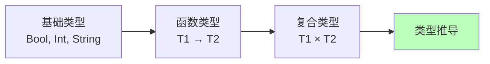
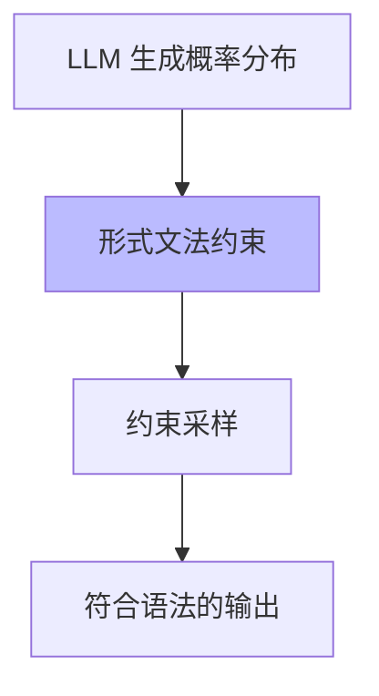

# 01.2.1-形式文法与 λ 演算

## 目录

- [01.2.1-形式文法与 λ 演算](#0121-形式文法与-λ-演算)
  - [目录](#目录)
  - [一、概述](#一概述)
  - [二、形式文法](#二形式文法)
    - [2.1 乔姆斯基层级](#21-乔姆斯基层级)
    - [2.2 上下文无关文法（CFG）](#22-上下文无关文法cfg)
  - [三、λ 演算](#三λ-演算)
    - [3.1 λ 演算基础](#31-λ-演算基础)
    - [3.2 类型系统](#32-类型系统)
    - [3.3 在控制层中的应用](#33-在控制层中的应用)
  - [四、形式语言与概率模型的融合](#四形式语言与概率模型的融合)
    - [4.1 约束解码](#41-约束解码)
    - [4.2 形式验证](#42-形式验证)
  - [五、工程实践案例](#五工程实践案例)
    - [5.1 Claude 3.5 的 Constitutional AI](#51-claude-35-的-constitutional-ai)
    - [5.2 OpenAI 的 Function Calling](#52-openai-的-function-calling)
  - [六、与三层模型的关系](#六与三层模型的关系)
    - [6.1 控制层 → 数据层](#61-控制层--数据层)
    - [6.2 控制层 → 执行层](#62-控制层--执行层)
  - [七、核心结论](#七核心结论)
  - [八、相关主题](#八相关主题)
  - [九、参考文档](#九参考文档)

---

## 一、概述

形式文法与 λ 演算是控制层（形式语言模型）的理论基础，提供了语言的形式化描述和计算模型。本文档阐述形式文法、λ 演算及其在 AI 控制层中的应用。

---

## 二、形式文法

### 2.1 乔姆斯基层级

**形式文法分类**：

| **类型**               | **规则形式**    | **表达能力** | **应用场景**         |
| ---------------------- | --------------- | ------------ | -------------------- |
| **类型 0：无限制**     | α → β（无限制） | 图灵完备     | 通用计算             |
| **类型 1：上下文有关** | αAβ → αγβ       | 弱于图灵机   | 自然语言语法         |
| **类型 2：上下文无关** | A → γ           | 更弱         | 编程语言语法、JSON   |
| **类型 3：正则**       | A → aB 或 A → a | 最弱         | 词法分析、正则表达式 |

### 2.2 上下文无关文法（CFG）

**定义**：G = (V, Σ, R, S)

- **V**：非终结符集合
- **Σ**：终结符集合
- **R**：产生式规则集合
- **S**：起始符号

**示例：JSON 语法**：

```text
JSON → object | array
object → { pairs }
pairs → pair | pair, pairs
pair → string : value
value → string | number | object | array | true | false | null
```

**在控制层中的应用**：

- **JSON Schema 约束**：确保 LLM 输出符合 JSON 格式
- **工具调用规范**：Function Calling 的语法验证
- **Prompt 模板**：结构化 Prompt 的语法检查

---

## 三、λ 演算

### 3.1 λ 演算基础

**λ 演算语法**：

```text
M ::= x           (变量)
    | λx.M        (抽象/函数定义)
    | M N         (应用/函数调用)
```

**核心规则**：

1. **α 等价**：变量重命名，λx.x ≡ λy.y
2. **β 归约**：(λx.M) N → M[x:=N]
3. **η 等价**：λx.M x ≡ M（如果 x 不在 M 中自由出现）

### 3.2 类型系统

**简单类型 λ 演算（Simply Typed Lambda Calculus）**：



**类型规则**：

- **变量**：Γ ⊢ x : T（如果 x:T ∈ Γ）
- **抽象**：Γ, x:T1 ⊢ M : T2 ⇒ Γ ⊢ λx.M : T1 → T2
- **应用**：Γ ⊢ M : T1 → T2, Γ ⊢ N : T1 ⇒ Γ ⊢ M N : T2

### 3.3 在控制层中的应用

**类型约束**：

- **Prompt 类型检查**：确保 Prompt 参数类型正确
- **工具调用类型验证**：Function Calling 的参数类型匹配
- **状态机类型安全**：LangGraph 状态转移的类型检查

---

## 四、形式语言与概率模型的融合

### 4.1 约束解码

**问题**：概率模型（数据层）输出可能违反形式约束（控制层）

**解决方案**：约束解码（Constrained Decoding）



**实现方法**：

1. **JSON Mode**：强制输出 JSON 格式
2. **Grammar Sampling**：基于 CFG 的采样
3. **Guided Generation**：引导生成符合约束

### 4.2 形式验证

**霍尔逻辑（Hoare Logic）**：

```text
{P} S {Q}
```

- **P**：前置条件
- **S**：程序语句
- **Q**：后置条件

**在控制层中的应用**：

- **Prompt 后置条件**：验证 LLM 输出满足预期
- **工具调用验证**：确保 Function Calling 结果正确
- **状态机不变式**：LangGraph 状态转移的约束验证

---

## 五、工程实践案例

### 5.1 Claude 3.5 的 Constitutional AI

**形式约束**：

- **规则注入**：多阶段规则检查
- **类型验证**：输出类型符合预期
- **后置条件**：输出满足安全约束

**效果**：合规率 100%，可控性强

### 5.2 OpenAI 的 Function Calling

**形式文法**：

- **JSON Schema**：函数签名的形式化描述
- **类型检查**：参数类型自动验证
- **语法约束**：输出强制符合 JSON 格式

**效果**：工具调用成功率 >98%

---

## 六、与三层模型的关系

### 6.1 控制层 → 数据层

- **形式约束转概率分布**：Prompt 将形式语言约束编码为条件概率
- **约束解码**：确保概率采样结果符合形式约束

### 6.2 控制层 → 执行层

- **复杂度限制**：形式验证的复杂度受执行层算力限制
- **延迟约束**：形式检查不能影响实时性

---

## 七、核心结论

1. **形式文法是控制层的理论基础**：提供语言的形式化描述
2. **λ 演算提供计算模型**：函数式编程的理论基础
3. **形式约束与概率模型融合**：约束解码确保输出符合语法
4. **形式验证提升可控性**：霍尔逻辑验证后置条件

---

## 八、相关主题

- [01.2.2-Prompt 工程与 ReAct 循环](01.2.2-Prompt工程与ReAct循环.md)
- [01.2.3-控制层工具链与框架](01.2.3-控制层工具链与框架.md)
- [01.2.4-控制层约束与验证](01.2.4-控制层约束与验证.md)

---

## 九、参考文档

- [分层解构视角](../../view/ai_models_view.md)
