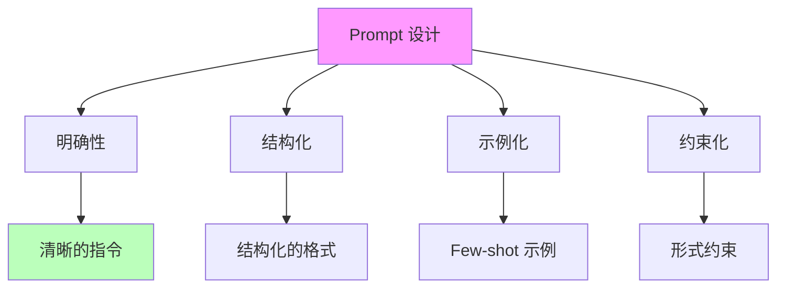
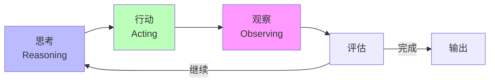
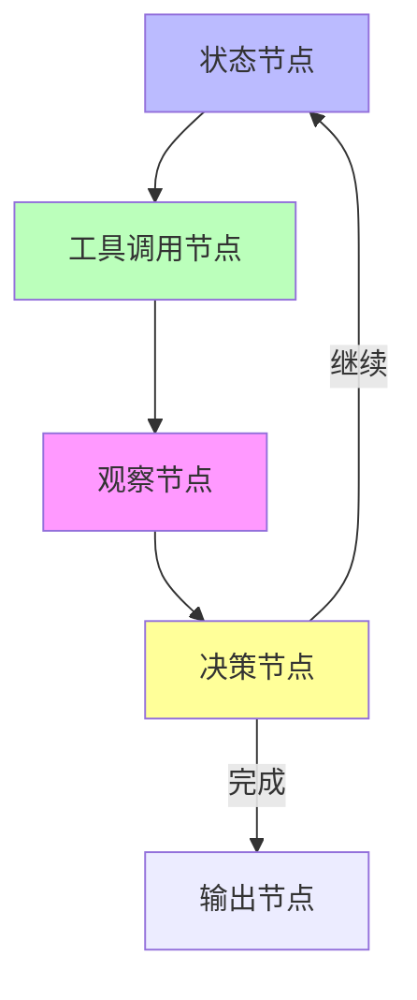

# 01.2.2-Prompt 工程与 ReAct 循环

## 目录

- [01.2.2-Prompt 工程与 ReAct 循环](#0122-prompt-工程与-react-循环)
  - [目录](#目录)
  - [一、概述](#一概述)
  - [二、Prompt 工程](#二prompt-工程)
    - [2.1 Prompt 设计原则](#21-prompt-设计原则)
    - [2.2 Prompt 模板](#22-prompt-模板)
    - [2.3 Prompt 优化策略](#23-prompt-优化策略)
  - [三、ReAct 循环](#三react-循环)
    - [3.1 ReAct 定义](#31-react-定义)
    - [3.2 ReAct 实现](#32-react-实现)
    - [3.3 ReAct 优势与局限](#33-react-优势与局限)
  - [四、工程实践](#四工程实践)
    - [4.1 LangGraph 实现](#41-langgraph-实现)
    - [4.2 工程实践案例](#42-工程实践案例)
  - [五、与三层模型的关系](#五与三层模型的关系)
    - [5.1 控制层 → 数据层](#51-控制层--数据层)
    - [5.2 控制层 → 执行层](#52-控制层--执行层)
  - [六、核心结论](#六核心结论)
  - [七、相关主题](#七相关主题)
  - [八、参考文档](#八参考文档)

---

## 一、概述

Prompt 工程与 ReAct 循环是控制层（形式语言模型）的核心技术，通过 Prompt 工程注入形式约束，通过 ReAct 循环实现思考-行动-观察的迭代过程。本文档阐述 Prompt 工程、ReAct 循环及其在 AI 系统中的应用。

---

## 二、Prompt 工程

### 2.1 Prompt 设计原则

**Prompt 设计原则**：



**Prompt 设计原则**：

1. **明确性**：指令清晰，避免歧义
2. **结构化**：使用结构化格式（JSON、Markdown）
3. **示例化**：提供 Few-shot 示例
4. **约束化**：添加形式约束（JSON Schema）

### 2.2 Prompt 模板

**Prompt 模板结构**：

```text
系统角色：定义 AI 的角色和职责
用户输入：用户的请求
上下文：相关背景信息
约束条件：形式约束（JSON Schema）
输出格式：期望的输出格式
```

**示例**：

````text
你是一个专业的代码审查助手。

用户输入：请审查以下代码
```python
def add(a, b):
    return a + b
````

约束条件：输出必须是 JSON 格式
{
"issues": [...],
"suggestions": [...]
}

输出格式：JSON

### 2.3 Prompt 优化策略

**Prompt 优化策略**：

| **策略**     | **方法**         | **效果**       | **成本**     |
| ------------ | ---------------- | -------------- | ------------ |
| **Few-shot** | 提供示例         | 准确率+10-20%  | 计算成本+20% |
| **CoT**      | 强制生成中间步骤 | 准确率+30-50%  | 计算成本+2x  |
| **角色扮演** | 定义角色和场景   | 准确率+5-10%   | 计算成本+10% |
| **约束解码** | JSON Schema 约束 | 格式正确率+95% | 计算成本+5%  |

---

## 三、ReAct 循环

### 3.1 ReAct 定义

**ReAct（Reasoning + Acting）循环**：

**核心思想**：思考 → 行动 → 观察 → 思考的迭代过程

**循环流程**：



**ReAct 循环步骤**：

1. **思考（Reasoning）**：分析问题，制定计划
2. **行动（Acting）**：执行动作（工具调用、查询等）
3. **观察（Observing）**：观察结果，评估效果
4. **迭代**：根据观察结果调整策略，继续循环

### 3.2 ReAct 实现

**ReAct 实现框架**：

```python
class ReActAgent:
    def __init__(self, model, tools):
        self.model = model
        self.tools = tools
        self.history = []

    def react_loop(self, question, max_iter=10):
        for i in range(max_iter):
            # 思考：生成推理和行动
            reasoning, action = self.model.generate(
                prompt=self.build_prompt(question, self.history)
            )

            # 行动：执行工具调用
            if action.type == "tool_call":
                observation = self.tools.execute(action)
            else:
                observation = action.result

            # 观察：记录结果
            self.history.append({
                "reasoning": reasoning,
                "action": action,
                "observation": observation
            })

            # 评估：判断是否完成
            if self.is_complete(observation):
                return self.extract_answer(observation)

        return "无法完成"
```

### 3.3 ReAct 优势与局限

**ReAct 优势**：

1. **可解释性**：推理过程可解释
2. **可控性**：可控制推理步骤
3. **灵活性**：可动态调整策略

**ReAct 局限**：

1. **循环失控**：可能陷入死循环
2. **计算成本**：多次迭代增加计算成本
3. **状态管理**：需要管理历史状态

---

## 四、工程实践

### 4.1 LangGraph 实现

**LangGraph 框架**：



**LangGraph 特点**：

- **状态机**：基于状态机的 ReAct 实现
- **持久化**：支持状态持久化
- **可视化**：支持可视化调试

### 4.2 工程实践案例

**案例 1：代码生成 Agent**：

```python
# ReAct 循环实现代码生成
def code_generation_agent(requirement):
    history = []
    for i in range(5):
        # 思考：分析需求
        reasoning = analyze_requirement(requirement, history)

        # 行动：生成代码
        code = generate_code(reasoning)

        # 观察：测试代码
        test_result = test_code(code)

        # 评估：判断是否完成
        if test_result.passed:
            return code

        history.append({
            "reasoning": reasoning,
            "code": code,
            "test_result": test_result
        })

    return "无法生成有效代码"
```

**案例 2：数据分析 Agent**：

```python
# ReAct 循环实现数据分析
def data_analysis_agent(question, data):
    history = []
    for i in range(10):
        # 思考：分析问题
        reasoning = analyze_question(question, data, history)

        # 行动：执行查询
        query = generate_query(reasoning)
        result = execute_query(query, data)

        # 观察：分析结果
        observation = analyze_result(result)

        # 评估：判断是否完成
        if observation.answerable:
            return observation.answer

        history.append({
            "reasoning": reasoning,
            "query": query,
            "result": result,
            "observation": observation
        })

    return "无法回答"
```

---

## 五、与三层模型的关系

### 5.1 控制层 → 数据层

- **Prompt 转概率分布**：Prompt 将形式约束编码为条件概率
- **采样控制**：控制层控制采样策略（温度、top-k 等）

### 5.2 控制层 → 执行层

- **延迟约束**：控制层复杂度受执行层延迟限制
- **成本反馈**：控制层根据执行层成本调整策略

---

## 六、核心结论

1. **Prompt 工程是控制层的核心技术**：通过 Prompt 注入形式约束
2. **ReAct 循环实现迭代推理**：思考 → 行动 → 观察的循环
3. **LangGraph 是 ReAct 的工程实现**：基于状态机的框架
4. **工程实践需要平衡灵活性和可控性**：避免循环失控

---

## 七、相关主题

- [01.2.1-形式文法与 λ 演算](01.2.1-形式文法与λ演算.md)
- [01.2.3-控制层工具链与框架](01.2.3-控制层工具链与框架.md)
- [01.2.4-控制层约束与验证](01.2.4-控制层约束与验证.md)

---

## 八、参考文档

- [工程实践核心逻辑下的 AI 三层模型全景解构](../../view/ai_engineer_view.md)
- [分层解构视角](../../view/ai_models_view.md)
