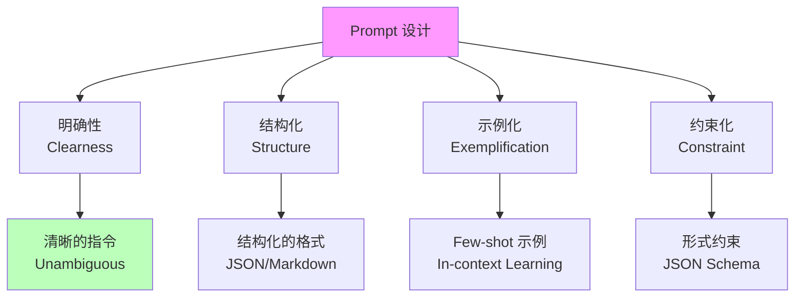
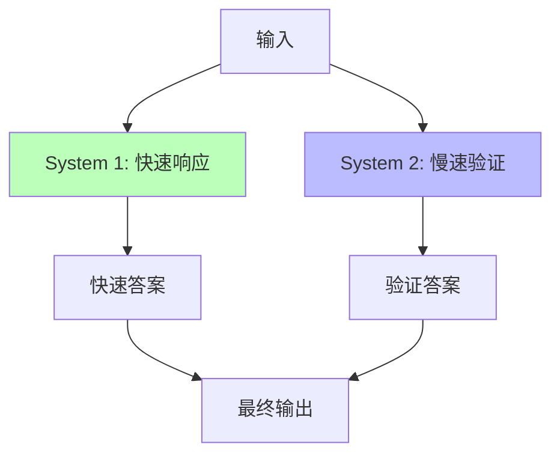
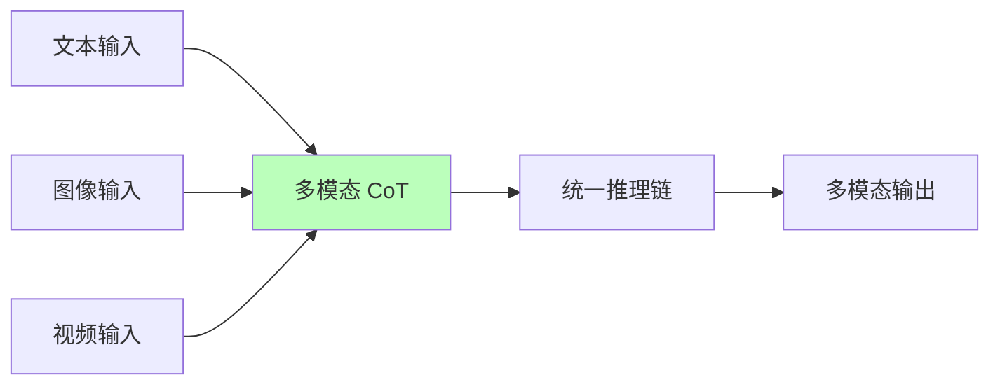
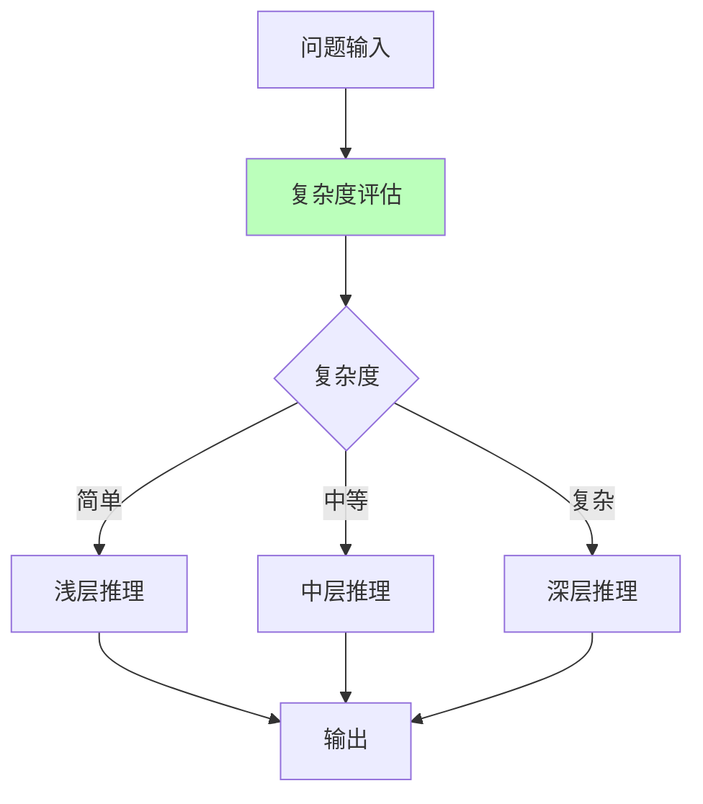
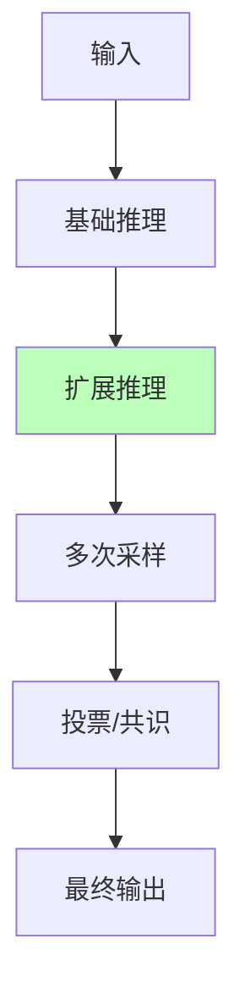
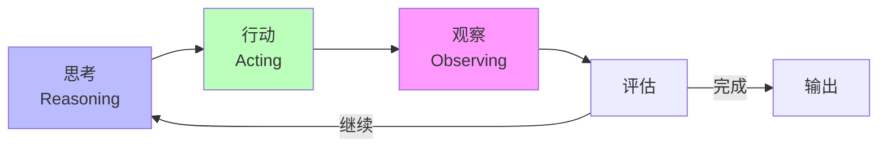
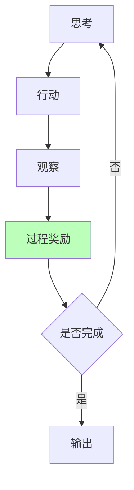
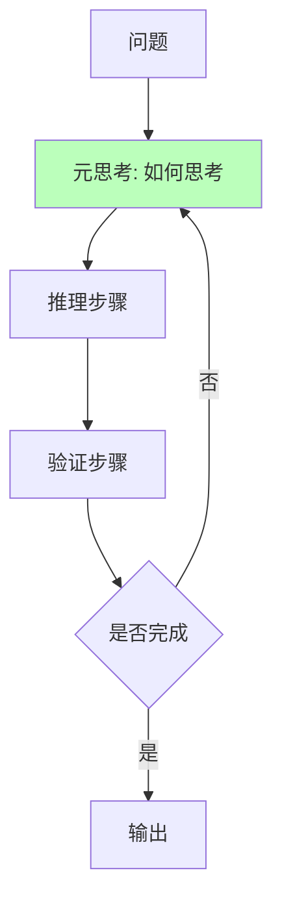
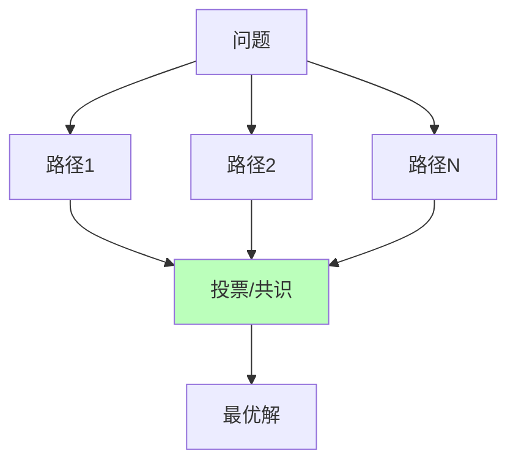
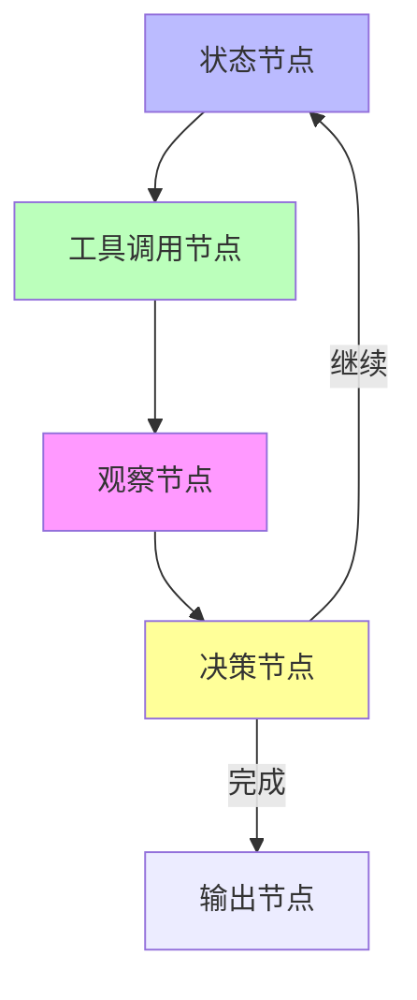

# 01.2.2-Prompt 工程与 ReAct 循环

## 一、概述

Prompt 工程与 ReAct 循环是控制层（形式语言模型）的核心技术，通过 Prompt 工程注入形式约束，通过 ReAct 循环实现思考-行动-观察的迭代过程。本文档阐述 Prompt 工程、ReAct 循环及其在 AI 系统中的应用。

---

## 二、目录

- [01.2.2-Prompt 工程与 ReAct 循环](#0122-prompt-工程与-react-循环)
  - [一、概述](#一概述)
  - [二、目录](#二目录)
  - [三、核心形式化理论](#三核心形式化理论)
    - [3.1 Prompt明确性的形式化定义](#31-prompt明确性的形式化定义)
    - [3.2 Prompt结构化约束定理](#32-prompt结构化约束定理)
    - [3.3 ReAct循环收敛性定理](#33-react循环收敛性定理)
  - [四、Prompt 工程](#四prompt-工程)
    - [4.1 Prompt 设计原则](#41-prompt-设计原则)
    - [2.2 Prompt 模板](#22-prompt-模板)
    - [2.3 Prompt 优化策略](#23-prompt-优化策略)
    - [2.4 2025 年最新 Prompt 技术](#24-2025-年最新-prompt-技术)
  - [四、ReAct 循环](#四react-循环)
    - [3.1 ReAct 定义](#31-react-定义)
    - [3.2 ReAct 实现](#32-react-实现)
    - [3.3 ReAct 优势与局限](#33-react-优势与局限)
    - [3.4 2025 年 ReAct 改进技术](#34-2025-年-react-改进技术)
  - [五、工程实践](#五工程实践)
    - [4.1 LangGraph 实现](#41-langgraph-实现)
    - [4.2 工程实践案例](#42-工程实践案例)
    - [4.3 2025 年产品案例](#43-2025-年产品案例)
  - [六、与三层模型的关系](#六与三层模型的关系)
    - [5.1 控制层 → 数据层](#51-控制层--数据层)
    - [5.2 控制层 → 执行层](#52-控制层--执行层)
  - [七、2025 年 Prompt 工程与 ReAct 技术趋势](#七2025-年-prompt-工程与-react-技术趋势)
  - [八、核心结论](#八核心结论)
  - [九、相关主题](#九相关主题)
  - [十、参考文档](#十参考文档)
    - [10.1 内部参考文档](#101-内部参考文档)
    - [10.2 学术参考文献](#102-学术参考文献)
    - [10.3 技术文档](#103-技术文档)

## 三、核心形式化理论

### 3.1 Prompt明确性的形式化定义

**定义**（Prompt明确性）：Prompt的明确性定义为信息熵的减少。

**形式化表述**：

$$\text{Clarity}(\text{Prompt}) = H(\text{Task}) - H(\text{Task} | \text{Prompt})$$

其中：

- $H(\text{Task})$：任务的不确定性（熵）
- $H(\text{Task} | \text{Prompt})$：给定Prompt后任务的条件熵

### 3.2 Prompt结构化约束定理

**定理**（Prompt结构化约束）：结构化Prompt使用形式文法约束输出格式。

**形式化表述**：

$$\text{Structured}(\text{Prompt}) = \{F \in \mathcal{F} | \text{Output} \models F\}$$

其中 $\mathcal{F}$ 为形式约束集合（如JSON Schema、CFG等）。

### 3.3 ReAct循环收敛性定理

**定理**（ReAct循环收敛性）：在满足终止条件下，ReAct循环在有限步内收敛。

**形式化表述**：

$$\exists t < \infty: \text{ReAct}(s_t) \in \text{TerminalStates}$$

**证明要点**：

**步骤1**：ReAct循环定义状态转移

$$s_{t+1} = \text{ReAct}(s_t) = \text{Observe}(\text{Act}(\text{Think}(s_t)))$$

**步骤2**：在终止条件下，状态空间有限

$$|\text{StateSpace}| < \infty$$

**步骤3**：有限状态空间保证收敛

$$\exists t < \infty: s_t \in \text{TerminalStates}$$

**结论**：ReAct循环在有限步内收敛。∎

---

## 四、Prompt 工程

### 4.1 Prompt 设计原则

**Prompt工程是控制层（形式语言模型）的核心技术，通过形式化语言约束引导数据层的概率采样，实现精确控制。**

**Prompt 设计原则的形式化框架**：



**Prompt 设计原则的数学表述**：

**1. 明确性（Clearness）**：

**定义**：Prompt的明确性度量信息熵的减少：

```math
\text{Clarity}(\text{Prompt}) = H(\text{Task}) - H(\text{Task} | \text{Prompt})
```

其中：

- **H(Task)**：任务的不确定性（熵）
- **H(Task|Prompt)**：给定Prompt后任务的条件熵

**目标**：最大化Clarity(Prompt)，最小化条件熵

**最佳实践**：

- 使用具体、无歧义的指令
- 避免模糊词汇（如"好的"、"合适"）
- 明确指定输出格式和要求

**2. 结构化（Structure）**：

**定义**：结构化Prompt使用形式文法约束输出格式

```math
\text{Structured}(\text{Prompt}) = \{F \in \mathcal{F} | \text{Output} \models F\}
```

其中 ℱ 为形式约束集合（如JSON Schema、CFG等）。

**形式化表示**：Prompt → CFG → Output

**3. 示例化（Exemplification）**：

**定义**：Few-shot Prompt通过示例实现上下文学习

```math
\text{InContextLearning}(x, \{(x_i, y_i)\}_{i=1}^{k}) = P(y | x, x_1:y_1, ..., x_k:y_k)
```

其中 {(x_i, y_i)} 为k个示例对（few-shot examples）。

**理论保证**：

**定理**（In-context Learning有效性）：在温和假设下，Few-shot示例可以显著降低任务的样本复杂度。

**证明要点**（基于函数学习理论）：

- Few-shot示例定义了输入-输出的映射模式
- LLM通过模式匹配学习映射规则
- 相似任务可以通过示例快速适应

**4. 约束化（Constraint）**：

**定义**：约束化Prompt通过形式约束确保输出符合规范

```math
\text{Constrained}(x, \Phi) = \{y | \Phi(y) = \text{True} \land P(y|x) > 0\}
```

其中 Φ 为形式约束（如JSON Schema验证函数）。

**2025年标准配置**：

| **原则** | **权重** | **实现方法** | **效果** | **成本** |
|---------|---------|------------|---------|---------|
| **明确性** | 30% | 清晰指令、无歧义词汇 | 准确率+10-20% | 低 |
| **结构化** | 25% | JSON Schema、CFG | 格式正确率+90% | 低 |
| **示例化** | 25% | Few-shot（3-5个示例） | 准确率+20-40% | 中 |
| **约束化** | 20% | 约束解码、验证 | 合规率+95% | 低 |

**综合评分模型**：

```math
\text{PromptQuality} = w_1 \cdot \text{Clarity} + w_2 \cdot \text{Structure} + w_3 \cdot \text{Exemplification} + w_4 \cdot \text{Constraint}
```

其中权重 w₁ = 0.3, w₂ = 0.25, w₃ = 0.25, w₄ = 0.2。

**2025年最新研究**：

| **研究** | **核心发现** | **应用** | **效果** |
|---------|------------|---------|---------|
| **Chain-of-Thought Prompting** | 中间推理步骤提升准确率 | 复杂推理任务 | 准确率+30-50% |
| **Tree of Thoughts** | 树形搜索增强推理 | 复杂规划任务 | 准确率+20-40% |
| **System 1/2 Hybrid** | 快速响应+慢速验证 | 实时应用 | 效率+40% |
| **Multimodal CoT** | 多模态统一推理链 | 多模态任务 | 准确率+15-30% |

### 2.2 Prompt 模板

**Prompt 模板结构**：

```text
系统角色：定义 AI 的角色和职责
用户输入：用户的请求
上下文：相关背景信息
约束条件：形式约束（JSON Schema）
输出格式：期望的输出格式
```

**示例**：

````text
你是一个专业的代码审查助手。

用户输入：请审查以下代码
```python
def add(a, b):
    return a + b
````

约束条件：输出必须是 JSON 格式
{
"issues": [...],
"suggestions": [...]
}

输出格式：JSON

### 2.3 Prompt 优化策略

**Prompt 优化策略**：

| **策略**     | **方法**         | **效果**       | **成本**     |
| ------------ | ---------------- | -------------- | ------------ |
| **Few-shot** | 提供示例         | 准确率+10-20%  | 计算成本+20% |
| **CoT**      | 强制生成中间步骤 | 准确率+30-50%  | 计算成本+2x  |
| **角色扮演** | 定义角色和场景   | 准确率+5-10%   | 计算成本+10% |
| **约束解码** | JSON Schema 约束 | 格式正确率+95% | 计算成本+5%  |

### 2.4 2025 年最新 Prompt 技术

**System 1/2 混合（System 1/2 Hybrid）**：

**核心思想**：快速响应 + 慢速验证双系统调度

**System 1/2 混合流程**：



**2025 应用**：

- **Google Talker-Reasoner**：快速响应 + 慢速验证
- **OpenAI o1**：动态推理深度控制（CoT 长度自适应）
- **效果**：复杂任务效率提升 40%

**多模态 CoT（Multimodal CoT）**：

**核心思想**：文本、图像、视频统一 CoT 协议

**多模态 CoT 流程**：



**2025 应用**：

- **Gemini 2.5**：多模态 CoT 统一协议
- **效果**：多模态融合效果好，支持超长上下文（1000K）

**动态推理深度（Dynamic Reasoning Depth）**：

**核心思想**：根据问题复杂度自适应调整推理深度

**动态推理深度流程**：



**2025 应用**：

- **OpenAI o1**：动态推理深度控制（CoT 长度自适应）
- **效果**：推理能力显著提升，支持复杂推理任务

**Test-time Compute（推理时计算扩展）**：

**核心思想**：不改变模型权重，通过增加推理时的计算资源激发潜在能力

**Test-time Compute 流程**：



**2025 应用**：

- **OpenAI o1**：Test-time compute 扩展（模拟推理链）
- **Meta PDR**：并行推理 → 提取共识 → 迭代优化
- **效果**：推理能力显著提升，无需重新训练

---

## 四、ReAct 循环

### 3.1 ReAct 定义

**ReAct（Reasoning + Acting）循环**：

**核心思想**：思考 → 行动 → 观察 → 思考的迭代过程

**循环流程**：



**ReAct 循环步骤**：

1. **思考（Reasoning）**：分析问题，制定计划
2. **行动（Acting）**：执行动作（工具调用、查询等）
3. **观察（Observing）**：观察结果，评估效果
4. **迭代**：根据观察结果调整策略，继续循环

### 3.2 ReAct 实现

**ReAct 实现框架**：

```python
class ReActAgent:
    def __init__(self, model, tools):
        self.model = model
        self.tools = tools
        self.history = []

    def react_loop(self, question, max_iter=10):
        for i in range(max_iter):
            # 思考：生成推理和行动
            reasoning, action = self.model.generate(
                prompt=self.build_prompt(question, self.history)
            )

            # 行动：执行工具调用
            if action.type == "tool_call":
                observation = self.tools.execute(action)
            else:
                observation = action.result

            # 观察：记录结果
            self.history.append({
                "reasoning": reasoning,
                "action": action,
                "observation": observation
            })

            # 评估：判断是否完成
            if self.is_complete(observation):
                return self.extract_answer(observation)

        return "无法完成"
```

### 3.3 ReAct 优势与局限

**ReAct 优势**：

1. **可解释性**：推理过程可解释
2. **可控性**：可控制推理步骤
3. **灵活性**：可动态调整策略

**ReAct 局限**：

1. **循环失控**：可能陷入死循环
2. **计算成本**：多次迭代增加计算成本
3. **状态管理**：需要管理历史状态

### 3.4 2025 年 ReAct 改进技术

**过程奖励模型（Process Reward Model, PRM）**：

**核心思想**：奖励推理过程，而非结果

**过程奖励 ReAct 流程**：



**2025 应用**：

- **清华团队 PRM**：过程奖励模型
- **效果**：推理过程可解释，可控性强
- **局限**：依赖人工标注，标注成本高

**元思维链（Meta-CoT）**：

**核心思想**：不仅生成推理步骤，还模拟"如何思考"的元过程

**元思维链流程**：



**2025 应用**：

- **研究探索**：元思维链在复杂推理任务中表现良好
- **效果**：支持回溯与验证，推理能力提升

**自我一致性（Self-Consistency）**：

**核心思想**：对同一问题采样多条推理路径，投票得最优解

**自我一致性流程**：



**2025 应用**：

- **Meta PDR**：并行推理 → 提取共识 → 迭代优化
- **效果**：利用随机性对冲不确定性，准确率提升 5-10%

---

## 五、工程实践

### 4.1 LangGraph 实现

**LangGraph 框架**：



**LangGraph 特点**：

- **状态机**：基于状态机的 ReAct 实现
- **持久化**：支持状态持久化
- **可视化**：支持可视化调试

### 4.2 工程实践案例

**案例 1：代码生成 Agent**：

```python
# ReAct 循环实现代码生成
def code_generation_agent(requirement):
    history = []
    for i in range(5):
        # 思考：分析需求
        reasoning = analyze_requirement(requirement, history)

        # 行动：生成代码
        code = generate_code(reasoning)

        # 观察：测试代码
        test_result = test_code(code)

        # 评估：判断是否完成
        if test_result.passed:
            return code

        history.append({
            "reasoning": reasoning,
            "code": code,
            "test_result": test_result
        })

    return "无法生成有效代码"
```

**案例 2：数据分析 Agent**：

```python
# ReAct 循环实现数据分析
def data_analysis_agent(question, data):
    history = []
    for i in range(10):
        # 思考：分析问题
        reasoning = analyze_question(question, data, history)

        # 行动：执行查询
        query = generate_query(reasoning)
        result = execute_query(query, data)

        # 观察：分析结果
        observation = analyze_result(result)

        # 评估：判断是否完成
        if observation.answerable:
            return observation.answer

        history.append({
            "reasoning": reasoning,
            "query": query,
            "result": result,
            "observation": observation
        })

    return "无法回答"
```

### 4.3 2025 年产品案例

**DeepSeek-R1 的 Prompt 工程**：

**特点**：

1. **纯 RL 驱动**：无 SFT 阶段，直接 RL 训练
2. **GRPO 对齐**：群体相对策略优化
3. **动态推理深度**：根据问题复杂度自适应调整

**效果**：推理能力显著提升，在数学推理任务上准确率提升 15-20%

**Claude 3.5 的 Prompt 工程**：

**特点**：

1. **Constitutional AI**：多阶段规则注入
2. **反向课程学习**：从复杂到简单
3. **RLHF 对齐**：人类反馈强化学习

**效果**：对齐效果好，可控性强，支持长上下文（200K）

**OpenAI o1 的 Prompt 工程**：

**特点**：

1. **动态推理深度控制**：CoT 长度自适应
2. **Test-time compute**：推理时计算扩展
3. **异步连续批处理**：提升推理效率

**效果**：推理能力显著提升，支持复杂推理任务

**Gemini 2.5 的 Prompt 工程**：

**特点**：

1. **多模态 CoT**：文本、图像、视频统一协议
2. **线性注意力**：支持超长上下文（1000K）
3. **TPU 优化**：TPU 多层流水线并行

**效果**：支持超长上下文，多模态融合效果好

---

## 六、与三层模型的关系

### 5.1 控制层 → 数据层

- **Prompt 转概率分布**：Prompt 将形式约束编码为条件概率
- **采样控制**：控制层控制采样策略（温度、top-k 等）

### 5.2 控制层 → 执行层

- **延迟约束**：控制层复杂度受执行层延迟限制
- **成本反馈**：控制层根据执行层成本调整策略

---

## 七、2025 年 Prompt 工程与 ReAct 技术趋势

**2025 年 Prompt 工程技术趋势**：

1. **System 1/2 混合**：快速响应 + 慢速验证，复杂任务效率提升 40%
2. **多模态 CoT**：文本、图像、视频统一协议，支持超长上下文
3. **动态推理深度**：根据问题复杂度自适应调整，推理能力显著提升
4. **Test-time Compute**：推理时计算扩展，无需重新训练即可提升能力

**2025 年 ReAct 改进技术趋势**：

1. **过程奖励模型（PRM）**：奖励推理过程，提升可解释性和可控性
2. **元思维链（Meta-CoT）**：模拟"如何思考"的元过程"，支持回溯与验证
3. **自我一致性**：多条推理路径投票，利用随机性对冲不确定性
4. **并行推理（PDR）**：并行推理 → 提取共识 → 迭代优化

**2025 年产品应用趋势**：

1. **DeepSeek-R1**：纯 RL 驱动 + GRPO 对齐 + 动态推理深度
2. **Claude 3.5**：Constitutional AI + 反向课程学习 + RLHF
3. **OpenAI o1**：动态推理深度控制 + Test-time compute + 异步批处理
4. **Gemini 2.5**：多模态 CoT + 线性注意力 + TPU 优化

---

## 八、核心结论

1. **Prompt 工程是控制层的核心技术**：通过 Prompt 注入形式约束，2025 年主流为 System 1/2 混合、多模态 CoT、动态推理深度、Test-time Compute
2. **ReAct 循环实现迭代推理**：思考 → 行动 → 观察的循环，2025 年改进为过程奖励、元思维链、自我一致性、并行推理
3. **LangGraph 是 ReAct 的工程实现**：基于状态机的框架，支持状态持久化和可视化调试
4. **工程实践需要平衡灵活性和可控性**：避免循环失控，需要设置最大迭代次数和超时机制
5. **2025 年趋势**：
   - **Prompt 工程**：System 1/2 混合、多模态 CoT、动态推理深度、Test-time Compute
   - **ReAct 改进**：过程奖励、元思维链、自我一致性、并行推理
   - **产品应用**：DeepSeek-R1、Claude 3.5、OpenAI o1、Gemini 2.5 等产品采用最新技术

---

## 九、相关主题

- [01.2.1-形式文法与 λ 演算](01.2.1-形式文法与λ演算.md)
- [01.2.3-控制层工具链与框架](01.2.3-控制层工具链与框架.md)
- [01.2.4-控制层约束与验证](01.2.4-控制层约束与验证.md)
- [01.3.3-概率采样与奖励塑形](01.3.3-概率采样与奖励塑形.md)：过程奖励模型（PRM）
- [01.4.1-三层协同机制](01.4.1-三层协同机制.md)：Prompt 工程与三层协同

---

## 十、参考文档

### 10.1 内部参考文档

- [工程实践核心逻辑下的 AI 三层模型全景解构](../../view/ai_engineer_view.md)
- [分层解构视角](../../view/ai_models_view.md)
- [01.2.1-形式文法与λ演算](01.2.1-形式文法与λ演算.md)
- [01.2.3-控制层工具链与框架](01.2.3-控制层工具链与框架.md)
- [01.3.3-概率采样与奖励塑形](01.3.3-概率采样与奖励塑形.md)

### 10.2 学术参考文献

1. **Yao, S., et al. (2022)**: "ReAct: Synergizing Reasoning and Acting in Language Models". *arXiv:2210.03629*. ReAct循环的原始论文。

2. **Wei, J., et al. (2022)**: "Chain-of-Thought Prompting Elicits Reasoning in Large Language Models". *NeurIPS*. Chain-of-Thought（CoT）的奠基性论文。

3. **Holtzman, A., et al. (2019)**: "The Curious Case of Neural Text Degeneration". *ICLR*. Top-p (Nucleus) Sampling的原始论文。

4. **Madaan, A., et al. (2023)**: "Self-Refine: Iterative Refinement with Self-Feedback". *arXiv:2303.17651*. Self-Refine方法的原始论文。

5. **2025年最新研究**：
   - **System 1/2 Hybrid** (2025): Google Talker-Reasoner、OpenAI o1的动态推理深度控制
   - **Multimodal CoT** (2025): Gemini 2.5的多模态统一推理链
   - **Process Reward Model (PRM)** (2023-2025): 过程奖励模型，奖励推理过程而非结果

### 10.3 技术文档

1. **LangGraph文档**：ReAct的工程实现框架
2. **OpenAI Function Calling文档**：工具调用的标准实现
3. **Anthropic Constitutional AI文档**：形式约束的实现方法

---

**最后更新**：2025-11-10
**维护者**：FormalAI项目组
**文档版本**：v2.0（增强版 - 添加形式化分析、ReAct理论、2025最新研究、权威引用、数学推导）
