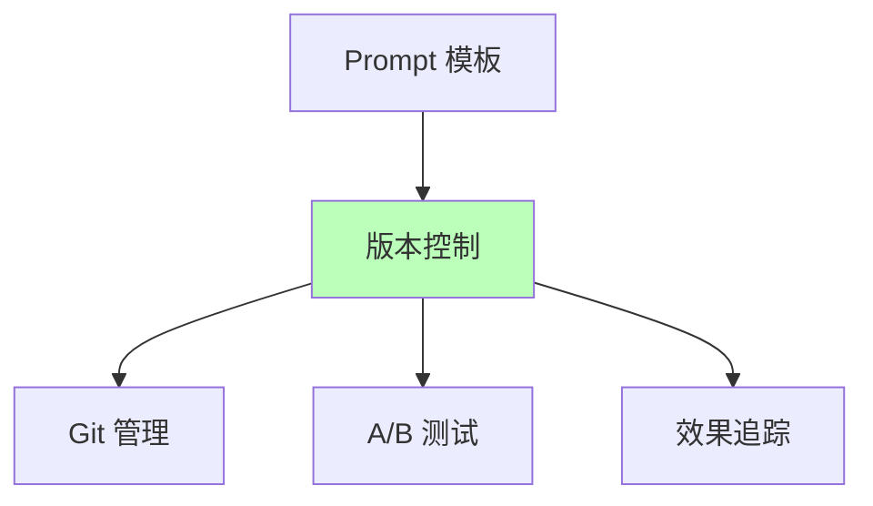
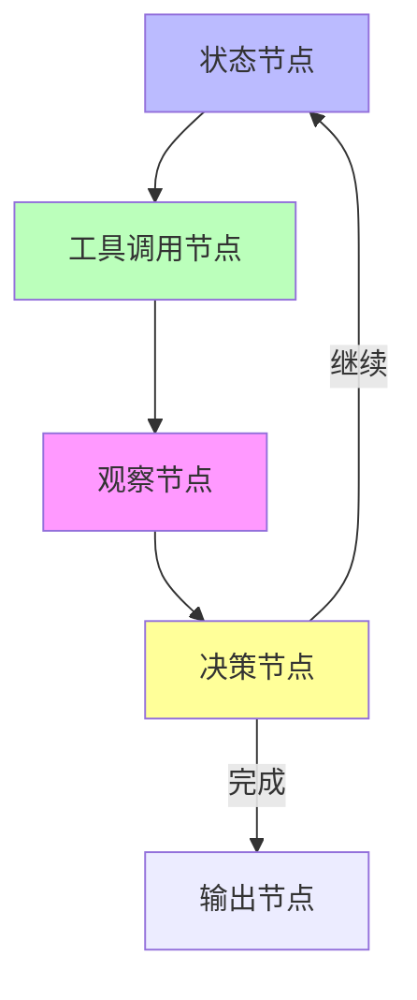
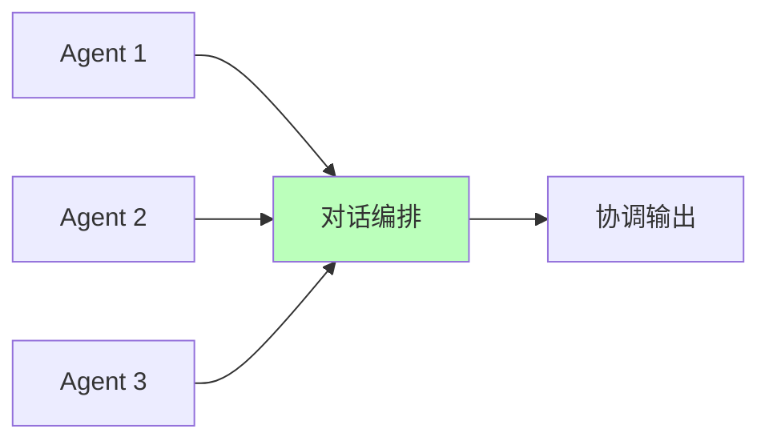
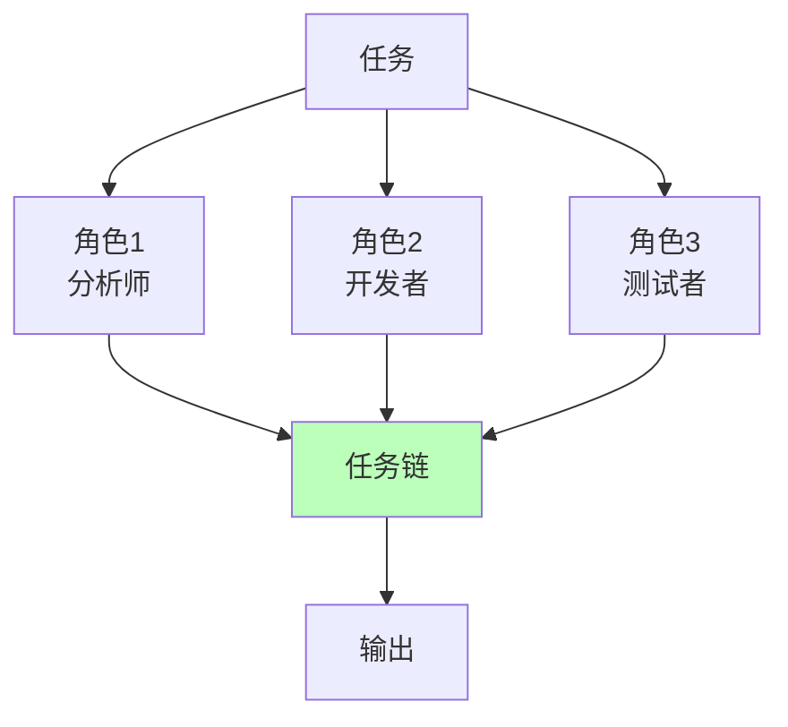
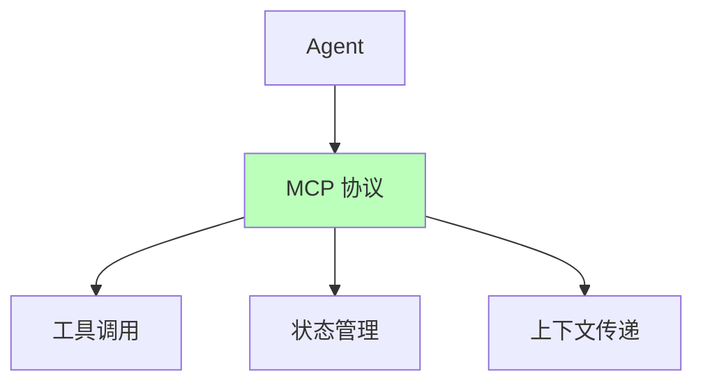
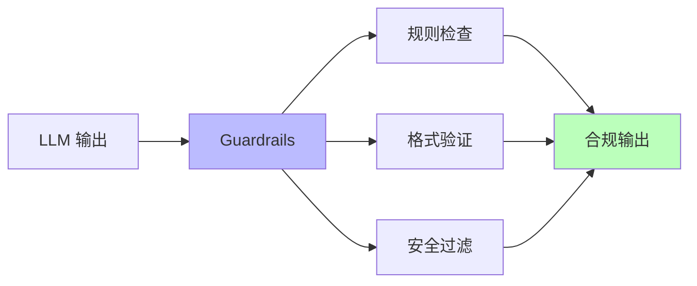

# 01.2.3-控制层工具链与框架

## 目录

- [01.2.3-控制层工具链与框架](#0123-控制层工具链与框架)
  - [目录](#目录)
  - [一、概述](#一概述)
  - [二、Prompt 框架](#二prompt-框架)
    - [2.1 Prompt 模板库](#21-prompt-模板库)
    - [2.2 Prompt 版本控制](#22-prompt-版本控制)
  - [三、Agent 框架](#三agent-框架)
    - [3.1 LangGraph](#31-langgraph)
    - [3.2 AutoGen](#32-autogen)
    - [3.3 CrewAI](#33-crewai)
  - [四、工具链](#四工具链)
    - [4.1 MCP 协议](#41-mcp-协议)
    - [4.2 Guardrails](#42-guardrails)
  - [五、工程实践案例](#五工程实践案例)
    - [5.1 Claude 3.5 的工具链](#51-claude-35-的工具链)
    - [5.2 OpenAI o1 的工具链](#52-openai-o1-的工具链)
  - [六、与三层模型的关系](#六与三层模型的关系)
    - [6.1 控制层 → 数据层](#61-控制层--数据层)
    - [6.2 控制层 → 执行层](#62-控制层--执行层)
  - [七、核心结论](#七核心结论)
  - [八、相关主题](#八相关主题)
  - [九、参考文档](#九参考文档)

---

## 一、概述

控制层工具链与框架是 AI 系统控制层（形式语言模型）的工程实现，包括 Prompt 框架、Agent 框架和工具链。本文档阐述控制层工具链、框架及其在 AI 系统中的应用。

---

## 二、Prompt 框架

### 2.1 Prompt 模板库

**Prompt 模板库**：

| **框架**          | **特点**         | **优势**       | **劣势**     |
| ----------------- | ---------------- | -------------- | ------------ |
| **Dify**          | 低代码工作流     | 易用，模板丰富 | 性能天花板低 |
| **Coze**          | 字节跳动生态集成 | 生态完善       | 平台锁定风险 |
| **PromptPerfect** | Prompt 优化工具  | 自动优化       | 成本高       |
| **LangChain**     | Prompt 模板库    | 模板丰富       | 性能一般     |

**2025 主流**：Dify（低代码）、Coze（生态集成）

### 2.2 Prompt 版本控制

**Prompt 版本控制**：

**版本控制策略**：

1. **Git 管理**：使用 Git 管理 Prompt 版本
2. **A/B 测试**：A/B 测试 Prompt 效果
3. **效果追踪**：追踪 Prompt 效果变化

---

## 三、Agent 框架

### 3.1 LangGraph

**LangGraph 框架**：

**核心特点**：代码优先的状态机框架

**框架架构**：

**LangGraph 特点**：

- **状态机**：基于状态机的 ReAct 实现
- **持久化**：支持状态持久化
- **可视化**：支持可视化调试
- **检查点**：支持检查点恢复

**2025 应用**：

- **GitHub 28k+ stars**：社区活跃
- **企业版许可**：商业支持

### 3.2 AutoGen

**AutoGen 框架**：

**核心特点**：多 Agent 对话编排

**框架架构**：

**AutoGen 特点**：

- **多 Agent**：支持多 Agent 协作
- **对话编排**：自动编排对话流程
- **Azure 集成**：微软 Azure 原生集成
- **云服务订阅**：商业支持

**2025 应用**：

- **微软官方支持**：企业级应用
- **云服务订阅**：商业模式

### 3.3 CrewAI

**CrewAI 框架**：

**核心特点**：角色扮演任务分解

**框架架构**：

**CrewAI 特点**：

- **角色扮演**：角色扮演任务分解
- **任务链**：任务链可视化
- **团队订阅**：团队订阅制
- **企业用户**：企业用户活跃

**2025 应用**：

- **企业用户活跃**：企业级应用
- **团队订阅制**：商业模式

---

## 四、工具链

### 4.1 MCP 协议

**MCP（Model Context Protocol）**：

**核心特点**：标准化 Agent 协议

**MCP 协议架构**：

**MCP 协议特点**：

- **标准化**：标准化 Agent 协议
- **工具调用**：标准化工具调用接口
- **状态管理**：标准化状态管理
- **上下文传递**：标准化上下文传递

**2025 应用**：

- **2026 Q2 预计收敛**：将成为 Agent 的事实标准
- **生态建设**：生态建设进行中

### 4.2 Guardrails

**Guardrails 框架**：

**核心特点**：输出约束和验证

**Guardrails 架构**：

**Guardrails 特点**：

- **规则检查**：规则检查输出
- **格式验证**：格式验证输出
- **安全过滤**：安全过滤输出
- **合规性**：合规性保障

**2025 应用**：

- **金融/医疗**：合规性要求高的场景
- **合规率 100%**：合规率保障

---

## 五、工程实践案例

### 5.1 Claude 3.5 的工具链

**控制层工具链**：

1. **Constitutional AI**：多阶段规则注入
2. **MCP 协议**：标准化 Agent 协议
3. **Guardrails**：输出约束和验证

**效果**：合规率 100%，可控性强

### 5.2 OpenAI o1 的工具链

**控制层工具链**：

1. **动态 CoT**：CoT 长度自适应
2. **Function Calling**：标准化工具调用
3. **JSON Schema**：输出格式约束

**效果**：工具调用成功率 >98%

---

## 六、与三层模型的关系

### 6.1 控制层 → 数据层

- **Prompt 转概率分布**：Prompt 框架将形式约束编码为条件概率
- **采样控制**：控制层框架控制采样策略

### 6.2 控制层 → 执行层

- **延迟约束**：控制层框架复杂度受执行层延迟限制
- **成本反馈**：控制层框架根据执行层成本调整策略

---

## 七、核心结论

1. **控制层工具链是控制层的工程实现**：Prompt 框架、Agent 框架、工具链
2. **LangGraph、AutoGen、CrewAI**：是主流 Agent 框架
3. **MCP 协议是标准化方向**：2026 Q2 预计收敛
4. **Guardrails 保障合规性**：合规率 100%

---

## 八、相关主题

- [01.2.2-Prompt 工程与 ReAct 循环](01.2.2-Prompt工程与ReAct循环.md)
- [01.2.4-控制层约束与验证](01.2.4-控制层约束与验证.md)
- [01.4.1-三层协同机制](01.4.1-三层协同机制.md)

---

## 九、参考文档

- [工程实践核心逻辑下的 AI 三层模型全景解构](../../view/ai_engineer_view.md)
