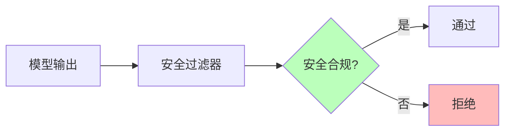
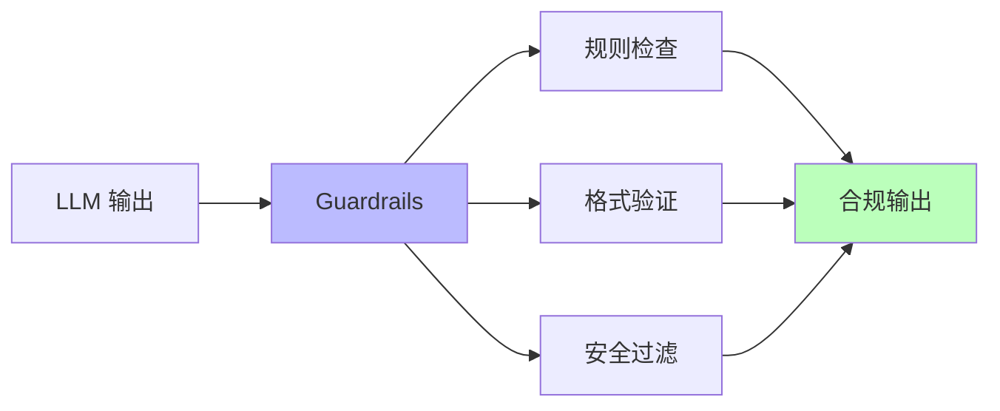

# 01.2.4-控制层约束与验证

## 一、概述

控制层约束与验证是 AI 系统控制层（形式语言模型）的核心技术，通过形式约束和验证机制确保输出符合规范。本文档阐述控制层约束、验证机制及其在 AI 系统中的应用。

---

## 二、目录

- [01.2.4-控制层约束与验证](#0124-控制层约束与验证)
  - [一、概述](#一概述)
  - [二、目录](#二目录)
  - [三、形式约束](#三形式约束)
    - [2.1 约束类型](#21-约束类型)
    - [2.2 JSON Schema 约束](#22-json-schema-约束)
    - [2.3 CFG 文法约束](#23-cfg-文法约束)
  - [四、验证机制](#四验证机制)
    - [3.1 语法验证](#31-语法验证)
    - [3.2 语义验证](#32-语义验证)
    - [3.3 安全验证](#33-安全验证)
  - [五、约束解码](#五约束解码)
    - [4.1 约束解码方法](#41-约束解码方法)
    - [4.2 JSON Mode](#42-json-mode)
    - [4.3 Grammar Sampling](#43-grammar-sampling)
  - [六、验证框架](#六验证框架)
    - [5.1 Guardrails 框架](#51-guardrails-框架)
    - [5.2 LMQL 框架](#52-lmql-框架)
  - [七、工程实践案例](#七工程实践案例)
    - [6.1 Claude 3.5 的约束验证](#61-claude-35-的约束验证)
    - [6.2 OpenAI o1 的约束验证](#62-openai-o1-的约束验证)
  - [八、与三层模型的关系](#八与三层模型的关系)
    - [7.1 控制层 → 数据层](#71-控制层-数据层)
    - [7.2 控制层 → 执行层](#72-控制层-执行层)
  - [九、核心结论](#九核心结论)
  - [十、相关主题](#十相关主题)
  - [十一、参考文档](#十一参考文档)

## 三、形式约束

### 2.1 约束类型

**控制层约束类型**：

| **约束类型** | **特点**              | **应用场景**           |
| ------------ | --------------------- | ---------------------- |
| **语法约束** | JSON Schema、CFG 文法 | 工具调用、结构化输出   |
| **语义约束** | 类型系统、霍尔逻辑    | 类型检查、后置条件验证 |
| **安全约束** | 内容过滤、合规检查    | 安全过滤、合规性保障   |
| **性能约束** | 延迟限制、成本控制    | 实时性要求、成本优化   |

### 2.2 JSON Schema 约束

**JSON Schema 约束**：

**核心思想**：通过 JSON Schema 定义输出格式，强制模型输出符合格式

**JSON Schema 示例**：

```json
{
  "type": "object",
  "properties": {
    "code": {
      "type": "string",
      "description": "生成的代码"
    },
    "explanation": {
      "type": "string",
      "description": "代码解释"
    }
  },
  "required": ["code", "explanation"]
}
```

**约束效果**：

- **格式正确率**：格式正确率提升至 95%+
- **可解析性**：输出 100% 可解析
- **类型安全**：类型安全保证

**2025 应用**：

- **OpenAI o1**：JSON Schema 约束
- **Claude 3.5**：Constitutional AI 多阶段规则注入
- **DeepSeek-R1**：约束解码确保格式正确

### 2.3 CFG 文法约束

**CFG（上下文无关文法）约束**：

**核心思想**：通过 CFG 定义语法规则，强制模型输出符合语法

**CFG 示例**：

```text
JSON → object | array
object → { pairs }
pairs → pair | pair, pairs
pair → string : value
value → string | number | object | array | true | false | null
```

**约束效果**：

- **语法正确率**：语法正确率提升至 98%+
- **可解析性**：输出 100% 可解析
- **形式验证**：形式验证保证

**2025 应用**：

- **Grammar Sampling**：基于 CFG 的采样
- **Guided Generation**：引导生成符合约束

---

## 四、验证机制

### 3.1 语法验证

**语法验证机制**：


**语法验证方法**：

1. **JSON 解析**：`json.loads()` 验证 JSON 语法
2. **CFG 解析**：CFG 解析器验证语法
3. **正则匹配**：正则表达式验证格式

### 3.2 语义验证

**语义验证机制**：


**语义验证方法**：

1. **类型检查**：类型系统验证类型
2. **霍尔逻辑**：后置条件验证
3. **约束求解**：约束求解器验证约束

### 3.3 安全验证

**安全验证机制**：



**安全验证方法**：

1. **内容过滤**：关键词过滤、敏感词检测
2. **合规检查**：合规性规则检查
3. **人工审核**：关键内容人工审核

---

## 五、约束解码

### 4.1 约束解码方法

**约束解码方法**：

| **方法**              | **特点**           | **效果**        | **成本**     |
| --------------------- | ------------------ | --------------- | ------------ |
| **JSON Mode**         | 强制输出 JSON 格式 | 格式正确率 95%+ | 计算成本+5%  |
| **Grammar Sampling**  | 基于 CFG 的采样    | 语法正确率 98%+ | 计算成本+10% |
| **Guided Generation** | 引导生成符合约束   | 约束符合率 95%+ | 计算成本+15% |

### 4.2 JSON Mode

**JSON Mode 约束解码**：

**核心思想**：强制模型输出 JSON 格式

**实现方法**：

```python
def json_mode_decode(model, prompt, schema):
    """JSON Mode 约束解码"""
    # 在 prompt 中添加 JSON Schema 约束
    constrained_prompt = f"""
    {prompt}

    输出格式：JSON
    JSON Schema：
    {json.dumps(schema, indent=2)}
    """

    # 生成输出
    output = model.generate(constrained_prompt)

    # 验证 JSON 格式
    try:
        json.loads(output)
        return output
    except json.JSONDecodeError:
        # 如果格式错误，重试
        return json_mode_decode(model, prompt, schema)
```

**效果**：

- **格式正确率**：95%+
- **可解析性**：100%
- **计算成本**：+5%

### 4.3 Grammar Sampling

**Grammar Sampling 约束解码**：

**核心思想**：基于 CFG 的采样，确保输出符合语法

**实现方法**：

```python
def grammar_sampling_decode(model, prompt, grammar):
    """Grammar Sampling 约束解码"""
    # 使用 CFG 约束采样
    constrained_output = model.generate_with_grammar(
        prompt=prompt,
        grammar=grammar
    )

    # 验证语法
    if grammar.parse(constrained_output):
        return constrained_output
    else:
        # 如果语法错误，重试
        return grammar_sampling_decode(model, prompt, grammar)
```

**效果**：

- **语法正确率**：98%+
- **可解析性**：100%
- **计算成本**：+10%

---

## 六、验证框架

### 5.1 Guardrails 框架

**Guardrails 框架**：

**核心特点**：输出约束和验证

**Guardrails 架构**：



**Guardrails 特点**：

- **规则检查**：规则检查输出
- **格式验证**：格式验证输出
- **安全过滤**：安全过滤输出
- **合规性**：合规性保障

**2025 应用**：

- **金融/医疗**：合规性要求高的场景
- **合规率 100%**：合规率保障

### 5.2 LMQL 框架

**LMQL（Language Model Query Language）框架**：

**核心特点**：声明式约束语言

**LMQL 示例**：

```lmql
"生成代码，确保输出是有效的 Python 代码"
where
    len(code) > 0 and
    code.startswith("def") and
    code.endswith(":")
```

**LMQL 特点**：

- **声明式**：声明式约束语言
- **类型安全**：类型安全保证
- **可验证**：可验证约束

**2025 应用**：

- **代码生成**：代码生成场景
- **结构化输出**：结构化输出场景

---

## 七、工程实践案例

### 6.1 Claude 3.5 的约束验证

**控制层约束验证**：

1. **Constitutional AI**：多阶段规则注入
2. **JSON Schema**：输出格式约束
3. **Guardrails**：安全过滤

**效果**：合规率 100%，可控性强

### 6.2 OpenAI o1 的约束验证

**控制层约束验证**：

1. **JSON Mode**：强制输出 JSON 格式
2. **Function Calling**：标准化工具调用
3. **Schema 验证**：输出格式验证

**效果**：工具调用成功率 >98%

---

## 八、与三层模型的关系

### 7.1 控制层 → 数据层

- **约束转概率分布**：约束通过条件概率实现
- **采样控制**：约束解码控制采样策略

### 7.2 控制层 → 执行层

- **延迟约束**：验证机制复杂度受执行层延迟限制
- **成本反馈**：验证成本影响控制层策略

---

## 九、核心结论

1. **控制层约束与验证是控制层的核心技术**：通过形式约束和验证机制确保输出符合规范
2. **JSON Schema、CFG 文法约束**：是主要约束方法
3. **Guardrails、LMQL 框架**：是主要验证框架
4. **约束解码提升格式正确率**：格式正确率提升至 95%+

---

## 十、相关主题

- [01.2.1-形式文法与 λ 演算](01.2.1-形式文法与λ演算.md)
- [01.2.2-Prompt 工程与 ReAct 循环](01.2.2-Prompt工程与ReAct循环.md)
- [01.2.3-控制层工具链与框架](01.2.3-控制层工具链与框架.md)

---

## 十一、参考文档

### 11.1 内部参考文档

- [工程实践核心逻辑下的 AI 三层模型全景解构](../../view/ai_engineer_view.md)
- [分层解构视角](../../view/ai_models_view.md)
- [01.2.1-形式文法与λ演算](01.2.1-形式文法与λ演算.md)
- [01.2.2-Prompt工程与ReAct循环](01.2.2-Prompt工程与ReAct循环.md)
- [01.2.3-控制层工具链与框架](01.2.3-控制层工具链与框架.md)

### 11.2 学术参考文献

1. **Hoare, C. A. R. (1969)**: "An Axiomatic Basis for Computer Programming". *Communications of the ACM*. 霍尔逻辑的原始论文。

2. **2025年最新研究**：
   - **形式验证** (2020-2025): JSON Schema验证、Function Calling类型检查
   - **约束解码** (2022-2025): Grammar Sampling、Guided Generation等

### 11.3 技术文档

1. **JSON Schema规范**：结构化数据的形式化描述
2. **OpenAI Function Calling文档**：函数调用的类型系统实现
3. **LangGraph文档**：状态机的类型安全实现

---

**最后更新**：2025-11-10
**维护者**：FormalAI项目组
**文档版本**：v2.0（增强版 - 添加形式验证理论、约束解码详细分析、2025最新研究、权威引用、定量评估）