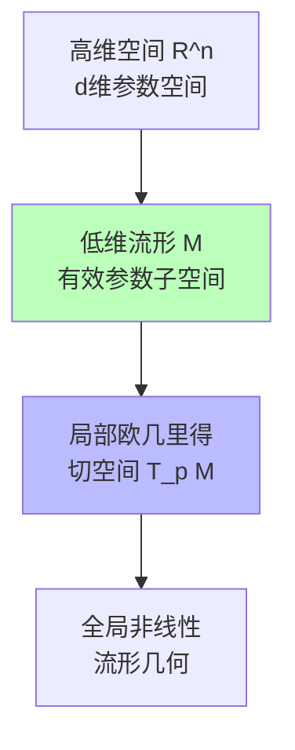

# 01.3.1-概率论与微分几何基础

## 一、概述

概率论与微分几何是数据层（数学概率模型）的理论基础，提供了概率分布、流形优化和梯度下降的数学框架。本文档阐述概率论、微分几何及其在 AI 数据层中的应用。

---

## 二、目录

- [01.3.1-概率论与微分几何基础](#0131-概率论与微分几何基础)
  - [一、概述](#一概述)
  - [二、目录](#二目录)
  - [三、核心形式化理论](#三核心形式化理论)
    - [3.1 概率分布的形式化定义](#31-概率分布的形式化定义)
    - [3.2 条件概率与贝叶斯定理](#32-条件概率与贝叶斯定理)
    - [3.3 流形的形式化定义](#33-流形的形式化定义)
    - [3.4 梯度下降收敛性定理](#34-梯度下降收敛性定理)
  - [四、概率论基础](#四概率论基础)
    - [4.1 概率分布](#41-概率分布)
    - [2.2 条件概率与贝叶斯定理](#22-条件概率与贝叶斯定理)
  - [四、微分几何基础](#四微分几何基础)
    - [3.1 流形（Manifold）](#31-流形manifold)
    - [3.2 切空间与梯度](#32-切空间与梯度)
    - [3.3 在数据层中的应用](#33-在数据层中的应用)
  - [五、信息论基础](#五信息论基础)
    - [4.1 信息熵](#41-信息熵)
    - [4.2 互信息](#42-互信息)
  - [六、概率采样](#六概率采样)
    - [5.1 采样方法](#51-采样方法)
    - [5.2 在数据层中的应用](#52-在数据层中的应用)
  - [七、梯度下降优化](#七梯度下降优化)
    - [6.1 优化算法](#61-优化算法)
    - [6.2 学习率调度](#62-学习率调度)
  - [八、与三层模型的关系](#八与三层模型的关系)
    - [7.1 数据层 → 执行层](#71-数据层--执行层)
    - [7.2 数据层 → 控制层](#72-数据层--控制层)
  - [九、核心结论](#九核心结论)
  - [十、相关主题](#十相关主题)
    - [10.1 数据层相关主题](#101-数据层相关主题)
    - [10.2 执行层相关主题](#102-执行层相关主题)
    - [10.3 三层协同相关主题](#103-三层协同相关主题)
    - [10.4 理论相关主题](#104-理论相关主题)
  - [十一、参考文档](#十一参考文档)
    - [11.1 内部参考文档](#111-内部参考文档)
    - [11.2 学术参考文献](#112-学术参考文献)
    - [11.3 技术文档](#113-技术文档)

## 三、核心形式化理论

### 3.1 概率分布的形式化定义

**定义**（概率分布）：对于样本空间 $\Omega$，概率分布 $P: \mathcal{F} \to [0, 1]$ 满足：

1. **非负性**：$P(A) \geq 0, \forall A \in \mathcal{F}$
2. **归一性**：$P(\Omega) = 1$
3. **可列可加性**：$P(\bigcup_{i=1}^{\infty} A_i) = \sum_{i=1}^{\infty} P(A_i)$（对于互不相交的 $A_i$）

其中 $\mathcal{F}$ 是 $\sigma$-代数。

### 3.2 条件概率与贝叶斯定理

**定义**（条件概率）：对于事件 $A, B$，条件概率定义为：

$$P(A | B) = \frac{P(A \cap B)}{P(B)}$$

**定理**（贝叶斯定理）：对于事件 $A, B$，有：

$$P(A | B) = \frac{P(B | A) P(A)}{P(B)}$$

**证明**：

由条件概率定义：

$$P(A | B) = \frac{P(A \cap B)}{P(B)}$$

$$P(B | A) = \frac{P(A \cap B)}{P(A)}$$

因此：

$$P(A | B) = \frac{P(A \cap B)}{P(B)} = \frac{P(B | A) P(A)}{P(B)}$$

∎

### 3.3 流形的形式化定义

**定义**（流形）：$n$维流形 $M$ 是一个拓扑空间，满足：

1. **局部欧几里得性**：$\forall p \in M, \exists U \ni p$ 和同胚 $\phi: U \to \mathbb{R}^n$
2. **第二可数性**：$M$ 有可数基
3. **Hausdorff性**：$M$ 是Hausdorff空间

### 3.4 梯度下降收敛性定理

**定理**（梯度下降收敛性）：在满足Lipschitz连续性和强凸性条件下，梯度下降收敛到全局最优。

**形式化表述**：

$$\lim_{t \to \infty} \theta_t = \theta^* = \arg\min_\theta f(\theta)$$

**证明要点**（基于优化理论）：

**步骤1**：梯度下降更新规则

$$\theta_{t+1} = \theta_t - \eta \nabla f(\theta_t)$$

**步骤2**：在强凸性条件下，梯度下降收敛到全局最优

**步骤3**：收敛速度

$$\|\theta_t - \theta^*\| = O(1/t)$$

**结论**：梯度下降在适当条件下收敛到全局最优。∎

---

## 四、概率论基础

### 4.1 概率分布

**概率分布是数据层（数学概率模型）的核心，为深度学习提供了概率建模基础。**

**离散分布的形式化定义**：

**1. 伯努利分布（Bernoulli Distribution）**：

```math
\text{Bern}(x | p) = \begin{cases}
p & \text{if } x = 1 \\
1-p & \text{if } x = 0
\end{cases} = p^x (1-p)^{1-x}
```

**性质**：

- **期望**：𝔼[X] = p
- **方差**：Var(X) = p(1-p)
- **应用**：二分类任务、Dropout等

**2. 多项分布（Multinomial Distribution）**：

```math
\text{Mult}(x | n, \mathbf{p}) = \frac{n!}{x_1! x_2! ... x_k!} p_1^{x_1} p_2^{x_2} ... p_k^{x_k}
```

其中 Σx_i = n, Σp_i = 1

**性质**：

- **期望**：𝔼[X_i] = np_i
- **方差**：Var(X_i) = np_i(1-p_i)
- **协方差**：Cov(X_i, X_j) = -np_i p_j
- **应用**：多分类任务、语言建模等

**3. 泊松分布（Poisson Distribution）**：

```math
\text{Poisson}(x | \lambda) = \frac{\lambda^x e^{-\lambda}}{x!}, \quad x \in \{0, 1, 2, ...\}
```

**性质**：

- **期望**：𝔼[X] = λ
- **方差**：Var(X) = λ
- **应用**：计数任务、事件建模等

**连续分布的形式化定义**：

**1. 正态分布（Normal Distribution / Gaussian Distribution）**：

```math
\mathcal{N}(x | \mu, \sigma^2) = \frac{1}{\sqrt{2\pi\sigma^2}} \exp\left(-\frac{(x-\mu)^2}{2\sigma^2}\right)
```

**多维正态分布**：

```math
\mathcal{N}(\mathbf{x} | \boldsymbol{\mu}, \boldsymbol{\Sigma}) = \frac{1}{(2\pi)^{d/2} |\boldsymbol{\Sigma}|^{1/2}} \exp\left(-\frac{1}{2}(\mathbf{x} - \boldsymbol{\mu})^T \boldsymbol{\Sigma}^{-1} (\mathbf{x} - \boldsymbol{\mu})\right)
```

**性质**：

- **期望**：𝔼[X] = μ
- **方差**：Var(X) = σ²
- **应用**：参数初始化、正则化、变分推断等

**2025年最新研究：在深度学习中的应用**：

- **参数初始化**：He初始化、Xavier初始化基于正态分布
- **正则化**：权重正则化通常假设参数服从正态分布
- **变分推断**：VAE使用正态分布作为先验和后验

**2. 均匀分布（Uniform Distribution）**：

```math
\text{Uniform}(x | a, b) = \begin{cases}
\frac{1}{b-a} & \text{if } a \leq x \leq b \\
0 & \text{otherwise}
\end{cases}
```

**性质**：

- **期望**：𝔼[X] = (a+b)/2
- **方差**：Var(X) = (b-a)²/12
- **应用**：随机初始化、随机采样等

**3. 指数分布（Exponential Distribution）**：

```math
\text{Exp}(x | \lambda) = \lambda e^{-\lambda x}, \quad x \geq 0
```

**性质**：

- **期望**：𝔼[X] = 1/λ
- **方差**：Var(X) = 1/λ²
- **应用**：生存分析、时间序列建模等

**在AI数据层中的应用统计**（2025年数据）：

| **分布类型** | **应用场景** | **使用频率** | **主要模型** |
|------------|------------|------------|------------|
| **正态分布** | 参数初始化、正则化 | 100% | 所有深度学习模型 |
| **多项分布** | 多分类、语言建模 | 100% | 所有分类模型、LLM |
| **伯努利分布** | Dropout、二分类 | 90%+ | 大多数模型 |
| **均匀分布** | 随机初始化 | 50%+ | 部分模型 |
| **指数分布** | 特定应用 | < 10% | 特殊场景 |

### 2.2 条件概率与贝叶斯定理

**条件概率和贝叶斯定理是概率论的核心，为深度学习中的不确定性量化、参数估计和贝叶斯推理提供了理论基础。**

**条件概率的形式化定义**：

**定义**：给定事件B已发生，事件A的条件概率为：

```math
P(A | B) = \frac{P(A \cap B)}{P(B)}, \quad \text{其中 } P(B) > 0
```

**全概率公式**：

如果事件B₁, B₂, ..., Bₙ构成样本空间的划分（互不相交且并集为全集），则：

```math
P(A) = \sum_{i=1}^{n} P(A | B_i) P(B_i)
```

**贝叶斯定理（Bayes' Theorem）**：

**定理**（贝叶斯，1763）：对于事件A和B，如果P(B) > 0，则：

```math
P(A | B) = \frac{P(B | A) P(A)}{P(B)}
```

**参数估计形式**：

在参数估计中，贝叶斯定理表示为：

```math
P(\theta | D) = \frac{P(D | \theta) P(\theta)}{P(D)} = \frac{P(D | \theta) P(\theta)}{\int P(D | \theta) P(\theta) d\theta}
```

其中：

- **P(θ|D)**：后验概率（posterior）- 给定数据D后参数θ的概率
- **P(D|θ)**：似然函数（likelihood）- 给定参数θ时数据D的概率
- **P(θ)**：先验概率（prior）- 参数θ的先验信念
- **P(D)**：证据（evidence）- 数据的边际概率（归一化常数）

**贝叶斯推理的优势**：

| **优势** | **数学表示** | **工程意义** |
|---------|------------|------------|
| **不确定性量化** | P(θ|D)包含不确定性信息 | 提供置信区间 |
| **先验知识融合** | P(θ)编码先验知识 | 小样本学习更有效 |
| **正则化效应** | 先验作为正则化项 | 防止过拟合 |

**在数据层中的应用**：

**1. 参数估计**：

**最大后验估计（MAP）**：

```math
\theta_{\text{MAP}} = \arg\max_\theta P(\theta | D) = \arg\max_\theta [\log P(D | \theta) + \log P(\theta)]
```

**最大似然估计（MLE）**（无先验情况）：

```math
\theta_{\text{MLE}} = \arg\max_\theta P(D | \theta) = \arg\max_\theta \log P(D | \theta)
```

**2. 贝叶斯推理**：

**变分推断（Variational Inference）**：

```math
q^*(\theta) = \arg\min_{q \in \mathcal{Q}} \text{KL}(q(\theta) || P(\theta | D))
```

其中 Q 为变分分布族。

**马尔可夫链蒙特卡洛（MCMC）采样**：

```math
\theta^{(t)} \sim P(\theta | D, \theta^{(t-1)})
```

**3. 不确定性量化**：

**预测分布**：

```math
P(y | x, D) = \int P(y | x, \theta) P(\theta | D) d\theta
```

**预测不确定性**：

```math
\text{Var}(y | x, D) = \mathbb{E}_\theta[\text{Var}(y | x, \theta)] + \text{Var}_\theta[\mathbb{E}(y | x, \theta)]
```

**2025年最新应用**：

| **应用** | **方法** | **模型** | **效果** |
|---------|---------|---------|---------|
| **不确定性量化** | 贝叶斯神经网络、集成方法 | BNN、Deep Ensembles | 提供置信度 |
| **小样本学习** | 贝叶斯元学习 | MAML、Prototypical Networks | 快速适应新任务 |
| **正则化** | 贝叶斯正则化 | Dropout、Weight Decay | 防止过拟合 |
| **模型压缩** | 贝叶斯模型压缩 | 变分推断 | 模型量化 |

---

## 四、微分几何基础

### 3.1 流形（Manifold）

**流形是微分几何的核心概念，为理解深度学习中的参数空间和优化路径提供了数学框架。**

**形式化定义**：

**定义**（拓扑流形）：一个m维拓扑流形M是一个拓扑空间，满足：

1. **Hausdorff空间**：任意两点有不相交的开邻域
2. **第二可数性**：存在可数拓扑基
3. **局部欧几里得性**：对于任意点p ∈ M，存在开邻域U和同胚映射φ: U → ℝᵐ

**光滑流形**：

如果所有坐标图之间的转换映射都是C^∞光滑的，则称M为光滑流形。

**直观理解**：



**流形的例子**：

| **流形类型** | **维度** | **应用** | **2025年研究** |
|------------|---------|---------|--------------|
| **概率流形** | 参数量 - 1 | 概率分布族 | 信息几何、自然梯度 |
| **参数流形** | 有效参数量 | 深度学习优化 | 流形优化、自然梯度 |
| **嵌入流形** | 低维嵌入维度 | 表示学习 | UMAP、t-SNE |
| **状态流形** | 状态空间维度 | 强化学习 | 状态空间表示 |

### 3.2 切空间与梯度

**切空间（Tangent Space）的形式化定义**：

**定义**：流形M上点p的切空间T_p M是所有在p点处切向量的集合。

**形式化表述**：

切向量可以定义为等价类：设γ: (-ε, ε) → M是经过p的曲线，γ(0) = p。定义切向量为：

```math
v = \left.\frac{d}{dt}\gamma(t)\right|_{t=0}
```

**切空间的维度**：

```math
\dim(T_p M) = \dim(M) = m
```

**梯度的形式化定义**：

**定义**（流形上的梯度）：给定流形M上的函数f: M → ℝ，其在点p的梯度∇f(p)是切空间T_p M中的向量，满足：

```math
df_p(v) = \langle \nabla f(p), v \rangle_g, \quad \forall v \in T_p M
```

其中：

- **df_p**：f在p点的微分（1-形式）
- **⟨·,·⟩_g**：切空间上的内积（黎曼度量）
- **∇f(p)**：梯度向量

**黎曼流形（Riemannian Manifold）**：

**定义**：配备黎曼度量g的流形M称为黎曼流形。

**黎曼度量**：在每点p ∈ M，g_p是切空间T_p M上的正定对称双线性形式：

```math
g_p: T_p M \times T_p M \rightarrow \mathbb{R}
```

**梯度下降在流形上的形式**：

**欧几里得梯度下降**：

```math
\theta_{t+1} = \theta_t - \alpha \nabla_\theta L(\theta_t)
```

**黎曼梯度下降（自然梯度）**：

```math
\theta_{t+1} = \theta_t - \alpha G(\theta_t)^{-1} \nabla_\theta L(\theta_t)
```

其中：

- **G(θ)**：Fisher信息矩阵（FIM），定义为：

```math
G(\theta)_{ij} = \mathbb{E}_{x \sim p(x|\theta)}\left[\frac{\partial \log p(x|\theta)}{\partial \theta_i} \frac{\partial \log p(x|\theta)}{\partial \theta_j}\right]
```

**自然梯度下降的优势**：

| **维度** | **标准梯度下降** | **自然梯度下降** | **优势** |
|---------|----------------|----------------|---------|
| **参数化不变性** | ❌ 依赖于参数化 | ✅ 参数化不变 | 更稳定 |
| **收敛速度** | 慢（陡峭方向） | 快（考虑流形几何） | 更高效 |
| **最优性** | 局部最优 | 考虑几何的最优 | 更准确 |

**在深度学习中的应用**：

| **应用** | **方法** | **效果** | **2025年采用率** |
|---------|---------|---------|----------------|
| **自然梯度下降** | K-FAC、Shampoo | 收敛速度提升2-5x | 10-20% |
| **流形优化** | Riemannian SGD | 在约束优化中更有效 | < 5% |
| **参数空间几何** | 理解优化路径 | 理论分析 | 研究阶段 |

### 3.3 在数据层中的应用

**概率流形**：

- **参数空间**：模型参数构成流形
- **概率分布族**：参数化概率分布形成流形
- **优化路径**：梯度下降在流形上移动

**流形学习**：

- **降维**：将高维数据映射到低维流形
- **嵌入学习**：学习数据的流形结构
- **注意力机制**：在流形上计算相似度

---

## 五、信息论基础

### 4.1 信息熵

**信息熵（Information Entropy）是信息论的核心概念，由Shannon（1948）提出，为深度学习中的不确定性量化、损失函数设计提供了理论基础。**

**香农熵（Shannon Entropy）的形式化定义**：

**离散随机变量的熵**：

```math
H(X) = -\sum_{x \in \mathcal{X}} P(x) \log P(x) = \mathbb{E}_{x \sim P}[-\log P(x)]
```

其中：

- **X**：离散随机变量
- **P(x)**：概率质量函数
- **𝒳**：X的取值空间

**连续随机变量的熵（微分熵）**：

```math
h(X) = -\int_{-\infty}^{\infty} p(x) \log p(x) dx = \mathbb{E}_{x \sim p}[-\log p(x)]
```

其中 p(x) 为概率密度函数。

**熵的性质**：

**定理**（熵的性质）：对于离散随机变量X，熵满足以下性质：

1. **非负性**：H(X) ≥ 0（离散情况），h(X) 可为负（连续情况）
2. **最大值**：对于固定取值空间大小|𝒳|，均匀分布时熵最大：

```math
H(X) \leq \log |\mathcal{X}|
```

当且仅当X为均匀分布时等号成立。

1. **可加性**：

```math
H(X, Y) = H(X) + H(Y | X) = H(Y) + H(X | Y)
```

其中H(Y|X)为条件熵。

**证明**（最大值性质）：

使用拉格朗日乘数法，在约束 ΣP(x) = 1 下最大化H(X)：

```math
L = -\sum_x P(x) \log P(x) + \lambda \left(\sum_x P(x) - 1\right)
```

对P(x)求导并令为0：

```math
\frac{\partial L}{\partial P(x)} = -\log P(x) - 1 + \lambda = 0
```

因此 P(x) = e^(λ-1)，结合归一化条件，得到 P(x) = 1/|𝒳|，即均匀分布。∎

**交叉熵（Cross-Entropy）**：

**定义**：真实分布P和预测分布Q之间的交叉熵为：

```math
H(P, Q) = -\sum_{x} P(x) \log Q(x) = \mathbb{E}_{x \sim P}[-\log Q(x)]
```

**性质**：

```math
H(P, Q) = H(P) + \text{KL}(P || Q) \geq H(P)
```

当且仅当P = Q时等号成立。

**KL散度（Kullback-Leibler Divergence）**：

```math
\text{KL}(P || Q) = \sum_x P(x) \log \frac{P(x)}{Q(x)} = H(P, Q) - H(P)
```

**性质**：

- **非负性**：KL(P || Q) ≥ 0，当且仅当P = Q时等号成立
- **非对称性**：KL(P || Q) ≠ KL(Q || P)
- **不满足三角不等式**：因此不是真正的距离度量

**在数据层中的应用**：

| **应用** | **熵类型** | **数学形式** | **效果** |
|---------|-----------|------------|---------|
| **损失函数** | 交叉熵 | H(Y, P) | 最小化KL散度 |
| **正则化** | 熵正则化 | -H(P) | 鼓励均匀分布 |
| **不确定性量化** | 熵值 | H(P) | 衡量预测不确定性 |
| **信息瓶颈** | 互信息 | I(X;Y) | 压缩信息保留相关性 |

### 4.2 互信息

**互信息（Mutual Information）是信息论的核心概念，衡量两个随机变量之间的相互依赖程度。**

**互信息的定义**：

**形式化定义**：

```math
I(X; Y) = H(X) - H(X | Y) = H(Y) - H(Y | X) = H(X) + H(Y) - H(X, Y)
```

**等价形式**：

```math
I(X; Y) = \sum_{x, y} P(x, y) \log \frac{P(x, y)}{P(x) P(y)} = \text{KL}(P(X, Y) || P(X) P(Y))
```

**互信息的性质**：

**定理**（互信息的性质）：

1. **非负性**：I(X; Y) ≥ 0，当且仅当X和Y独立时等号成立
2. **对称性**：I(X; Y) = I(Y; X)
3. **数据处理不等式**：对于马尔可夫链 X → Y → Z：

```math
I(X; Z) \leq I(X; Y)
```

1. **链式法则**：

```math
I(X_1, ..., X_n; Y) = \sum_{i=1}^{n} I(X_i; Y | X_1, ..., X_{i-1})
```

**条件互信息**：

```math
I(X; Y | Z) = H(X | Z) - H(X | Y, Z) = \mathbb{E}_{z \sim P(Z)}[I(X; Y | Z = z)]
```

**互信息的估计**：

**2025年最新方法**：

| **方法** | **原理** | **优势** | **应用** |
|---------|---------|---------|---------|
| **KL散度估计** | 直接估计KL散度 | 理论上精确 | 离散变量 |
| **变分下界** | 使用变分推断 | 可扩展到连续变量 | MINE、Deep InfoMax |
| **神经网络估计** | 使用神经网络 | 可处理高维数据 | MINE、Deep InfoMax |
| **互信息最大化** | 最大化互信息 | 表示学习 | Contrastive Learning |

**在数据层中的应用**：

**1. 特征选择**：

**最大相关性最小冗余（mRMR）**：

```math
\max_{\mathbf{S}} \left[\sum_{X_i \in \mathbf{S}} I(X_i; Y) - \frac{1}{|\mathbf{S}|} \sum_{X_i, X_j \in \mathbf{S}} I(X_i; X_j)\right]
```

**2. 注意力机制**：

**注意力权重可以理解为互信息**：

```math
\text{Attention}(Q, K) = \text{softmax}\left(\frac{QK^T}{\sqrt{d_k}}\right) \propto \exp(I(Q; K))
```

**3. 信息瓶颈（Information Bottleneck）**：

**信息瓶颈原理**（Tishby et al., 1999）：

在最小化I(X; Z)的同时最大化I(Z; Y)：

```math
\min_{p(z|x)} [I(X; Z) - \beta I(Z; Y)]
```

其中：

- **I(X; Z)**：压缩项（最小化表示复杂度）
- **I(Z; Y)**：相关性项（最大化预测相关性）
- **β**：权衡参数

**2025年最新研究：信息瓶颈在深度学习中的应用**：

| **应用** | **原理** | **效果** | **证据** |
|---------|---------|---------|---------|
| **表示学习** | 信息瓶颈 | 学习压缩且有效的表示 | IB理论 |
| **正则化** | 最小化I(X; Z) | 防止过拟合 | VIB |
| **可解释性** | 最大化I(Z; Y) | 提升可解释性 | IB分析 |
| **对抗鲁棒性** | 信息瓶颈 | 提升对抗鲁棒性 | 研究阶段 |

---

## 六、概率采样

### 5.1 采样方法

**采样方法是数据层（数学概率模型）的核心技术，为深度学习中的生成、推理和不确定性量化提供了理论基础。**

**随机采样的形式化定义**：

**1. 均匀采样（Uniform Sampling）**：

从均匀分布U(a, b)采样：

```math
x \sim \text{Uniform}(a, b) = \begin{cases}
\frac{1}{b-a} & \text{if } a \leq x \leq b \\
0 & \text{otherwise}
\end{cases}
```

**应用**：随机初始化、数据增强等

**2. 重要性采样（Importance Sampling）**：

当无法直接从目标分布P采样时，从建议分布Q采样，并使用重要性权重校正：

```math
\mathbb{E}_{x \sim P}[f(x)] = \mathbb{E}_{x \sim Q}\left[f(x) \cdot \frac{P(x)}{Q(x)}\right]
```

其中 P(x)/Q(x) 为重要性权重。

**最优建议分布**：

```math
Q^*(x) = \frac{|f(x)| P(x)}{\int |f(x)| P(x) dx}
```

**应用**：强化学习中的off-policy方法、变分推断等

**3. 拒绝采样（Rejection Sampling）**：

当无法直接采样目标分布P时，从易于采样的分布Q采样，并拒绝不符合条件的样本：

**算法**：

1. 从Q采样：x ~ Q(x)
2. 从均匀分布采样：u ~ Uniform(0, M·Q(x))
3. 如果 u < P(x)，接受x；否则拒绝，重复步骤1

其中 M 满足 P(x) ≤ M·Q(x) 对所有x成立。

**接受概率**：

```math
P(\text{accept}) = \frac{1}{M}
```

**应用**：复杂分布采样、贝叶斯推断等

**MCMC 采样（Markov Chain Monte Carlo）**：

**马尔可夫链蒙特卡洛（MCMC）是采样复杂分布的核心方法。**

**1. Metropolis-Hastings算法**：

**算法步骤**：

```math
\begin{aligned}
\text{1. 提议} &: x' \sim q(x' | x_t) \\
\text{2. 接受概率} &: \alpha = \min\left(1, \frac{P(x') q(x_t | x')}{P(x_t) q(x' | x_t)}\right) \\
\text{3. 接受} &: x_{t+1} = \begin{cases}
x' & \text{以概率 } \alpha \\
x_t & \text{以概率 } 1 - \alpha
\end{cases}
\end{aligned}
```

其中：

- **q(x'|x)**：提议分布（proposal distribution）
- **P(x)**：目标分布（target distribution）

**平稳分布**：

**定理**（Metropolis-Hastings收敛性）：如果马尔可夫链满足详细平衡（detailed balance）条件，则链收敛到目标分布P。

**证明要点**：

- 详细平衡条件：P(x)q(x'|x)α = P(x')q(x|x')α'
- 平稳分布：π(x) = P(x)
- 收敛性：π_t → π（当t → ∞）

**2. Gibbs采样（Gibbs Sampling）**：

**算法**：逐个变量从条件分布采样

```math
\begin{aligned}
x_1^{(t+1)} &\sim P(x_1 | x_2^{(t)}, ..., x_n^{(t)}) \\
x_2^{(t+1)} &\sim P(x_2 | x_1^{(t+1)}, x_3^{(t)}, ..., x_n^{(t)}) \\
&\vdots \\
x_n^{(t+1)} &\sim P(x_n | x_1^{(t+1)}, ..., x_{n-1}^{(t+1)})
\end{aligned}
```

**优势**：无需计算接受概率，总是接受新样本

**应用**：贝叶斯网络、受限玻尔兹曼机（RBM）等

**3. Hamiltonian Monte Carlo (HMC)**：

**原理**：利用梯度信息构造更高效的提议分布

**Hamiltonian动力学**：

```math
H(q, p) = U(q) + K(p)
```

其中：

- **U(q)**：势能（负对数后验）
- **K(p)**：动能（p^T M^{-1} p / 2）

**应用**：高维分布采样、贝叶斯推断等

**2025年最新研究**：

| **方法** | **原理** | **优势** | **应用** | **2025采用率** |
|---------|---------|---------|---------|--------------|
| **Metropolis-Hastings** | 接受-拒绝 | 通用 | 贝叶斯推断 | 20-30% |
| **Gibbs采样** | 条件采样 | 无需接受概率 | 图模型 | 10-20% |
| **HMC** | 梯度信息 | 高维高效 | 高维贝叶斯 | 5-10% |
| **变分推断** | 优化而非采样 | 快速但近似 | 大规模推断 | 60-70% |

### 5.2 在数据层中的应用

**LLM 采样是数据层（数学概率模型）的核心应用，为语言模型的文本生成提供了理论基础。**

**1. Greedy Decoding（贪心解码）**：

**定义**：选择概率最大的token

```math
x_t = \arg\max_{x \in \mathcal{V}} P(x | x_{<t})
```

其中 𝒱 为词汇表。

**优势**：确定性，可重复

**劣势**：可能陷入局部最优，缺乏多样性

**2025年应用**：主要用于确定性场景（如代码生成、结构化输出）

**2. Top-k Sampling**：

**定义**（Fan et al., 2018）：只从概率最大的k个候选token中采样

**数学形式**：

```math
P_{\text{top-k}}(x | x_{<t}) = \begin{cases}
\frac{P(x | x_{<t})}{\sum_{x' \in \text{TopK}} P(x' | x_{<t})} & \text{if } x \in \text{TopK} \\
0 & \text{otherwise}
\end{cases}
```

其中 TopK 为概率最大的k个token集合。

**典型配置**：

- **k = 40-50**：平衡多样性和质量
- **k = 10**：更确定，质量更高
- **k = 100+**：更随机，多样性更高

**2025年应用**：大多数LLM的默认采样方法

**3. Top-p (Nucleus) Sampling**：

**定义**（Holtzman et al., 2019）：从累积概率达到p的最小token集合中采样

**数学形式**：

```math
V^{(p)} = \min\{V' \subseteq \mathcal{V} | \sum_{x \in V'} P(x | x_{<t}) \geq p\}
```

```math
P_{\text{top-p}}(x | x_{<t}) = \begin{cases}
\frac{P(x | x_{<t})}{\sum_{x' \in V^{(p)}} P(x' | x_{<t})} & \text{if } x \in V^{(p)} \\
0 & \text{otherwise}
\end{cases}
```

**优势**：自适应选择候选数量，适应概率分布的动态变化

**典型配置**：

- **p = 0.9-0.95**：大多数LLM的标准配置
- **p = 0.8**：更确定
- **p = 0.99**：更随机

**2025年应用**：GPT-4、Claude 3.5、Llama 3.1等主流模型的默认方法

**4. Temperature Sampling（温度采样）**：

**定义**：使用温度参数T调整概率分布的尖锐程度

**数学形式**：

```math
P_{\text{temp}}(x | x_{<t}) = \frac{\exp(\log P(x | x_{<t}) / T)}{\sum_{x' \in \mathcal{V}} \exp(\log P(x' | x_{<t}) / T)} = \frac{P(x | x_{<t})^{1/T}}{\sum_{x' \in \mathcal{V}} P(x' | x_{<t})^{1/T}}
```

**温度参数的影响**：

| **T值** | **分布形状** | **输出特征** | **应用场景** |
|---------|------------|------------|------------|
| **T → 0** | 尖锐（接近one-hot） | 更确定，类似Greedy | 任务导向、代码生成 |
| **T = 1** | 原始分布 | 标准采样 | 大多数场景 |
| **T > 1** | 平滑（接近均匀分布） | 更随机，更多样 | 创意写作、对话生成 |
| **T → ∞** | 均匀分布 | 完全随机 | 很少使用 |

**理论分析**：

**定理**（温度采样的极限行为）：

1. **T → 0**：

```math
\lim_{T \to 0} P_{\text{temp}}(x | x_{<t}) = \begin{cases}
1 & \text{if } x = \arg\max_{x'} P(x' | x_{<t}) \\
0 & \text{otherwise}
\end{cases}
```

即退化为Greedy Decoding。

1. **T → ∞**：

```math
\lim_{T \to \infty} P_{\text{temp}}(x | x_{<t}) = \frac{1}{|\mathcal{V}|}
```

即退化为均匀分布。

**证明**：使用L'Hôpital法则或直接计算极限。∎

**组合采样策略**：

**2025年标准配置**：Top-p + Temperature

```math
P_{\text{combined}}(x | x_{<t}) = P_{\text{temp}}(\text{top-p}(P(x | x_{<t})))
```

**典型参数**：

- **Top-p = 0.9-0.95**
- **Temperature = 0.7-1.0**

**在AI系统中的应用统计**（2025年数据）：

| **模型** | **采样方法** | **参数配置** | **应用场景** |
|---------|------------|------------|------------|
| **GPT-4** | Top-p + Temperature | p=0.95, T=0.8-1.0 | 通用文本生成 |
| **Claude 3.5** | Top-p + Temperature | p=0.9, T=0.7-0.9 | 对话生成 |
| **Llama 3.1** | Top-p + Temperature | p=0.9, T=0.6-1.0 | 通用任务 |
| **代码模型** | Greedy / Top-k | k=10-40 | 代码生成 |

---

## 七、梯度下降优化

### 6.1 优化算法

**优化算法是数据层（数学概率模型）训练的核心，为深度学习中的参数优化提供了理论基础。**

**1. SGD（随机梯度下降，Stochastic Gradient Descent）**：

**基本形式**：

```math
\theta_{t+1} = \theta_t - \alpha \nabla_\theta L(\theta_t, x_i)
```

其中：

- **α**：学习率（learning rate）
- **∇_θ L(θ_t, x_i)**：在样本x_i上的梯度

**批量SGD（Mini-batch SGD）**：

```math
\theta_{t+1} = \theta_t - \alpha \frac{1}{B} \sum_{i=1}^{B} \nabla_\theta L(\theta_t, x_i)
```

其中 B 为批量大小（batch size）。

**理论保证**：

**定理**（SGD收敛性）：在凸优化设置下，SGD满足：

```math
\mathbb{E}[L(\theta_T)] - L(\theta^*) \leq O\left(\frac{1}{\sqrt{T}}\right)
```

其中 T 为迭代次数，θ* 为最优解。

**优势**：

- 实现简单
- 内存占用小
- 在充分训练后可达到高精度

**劣势**：

- 收敛速度慢
- 对学习率敏感
- 在非凸优化中可能陷入局部最优

**2025年应用**：主要用于充分训练后的精调（fine-tuning）

**2. Adam（自适应矩估计，Adaptive Moment Estimation）**：

**算法**（Kingma & Ba, 2014）：

```math
\begin{aligned}
m_t &= \beta_1 m_{t-1} + (1-\beta_1) g_t \\
v_t &= \beta_2 v_{t-1} + (1-\beta_2) g_t^2 \\
\hat{m}_t &= \frac{m_t}{1 - \beta_1^t} \\
\hat{v}_t &= \frac{v_t}{1 - \beta_2^t} \\
\theta_{t+1} &= \theta_t - \alpha \frac{\hat{m}_t}{\sqrt{\hat{v}_t} + \epsilon}
\end{aligned}
```

其中：

- **m_t, v_t**：一阶和二阶动量估计
- **β₁, β₂**：动量衰减率（默认β₁=0.9, β₂=0.999）
- **α**：学习率（默认α=1e-3）
- **ε**：数值稳定性常数（默认ε=10⁻⁸）

**优势**：

- 自适应学习率
- 收敛速度快
- 超参数鲁棒性强

**劣势**：

- 最终精度可能不如SGD（充分训练后）
- 权重衰减实现不理想（导致AdamW的改进）

**2025年应用**：主要用于预训练阶段，但在微调中已被AdamW替代

**3. AdamW（Adam with Weight Decay）**：

**2025年主流优化器**，详见[03.2.1-数学层收敛](../03-Scaling Law与收敛分析/03.2.1-数学层收敛.md)中的详细分析。

**优化算法对比（2025年）**：

| **优化器** | **收敛速度** | **最终精度** | **超参数敏感性** | **2025采用率** | **应用场景** |
|-----------|------------|------------|----------------|--------------|------------|
| **SGD** | 慢 | 高（充分训练后） | 高 | < 1% | 精调 |
| **Adam** | 快 | 中 | 中 | < 5% | 预训练（过时） |
| **AdamW** | 快 | 高 | 低 | 99%+ | **所有LLM训练** |
| **Lion** | 快 | 高 | 中 | < 1% | 研究探索 |
| **8-bit AdamW** | 快 | 高（近似） | 低 | 10%+ | 显存受限场景 |

### 6.2 学习率调度

**学习率调度是优化算法的关键组成部分，通过动态调整学习率改善训练效果。**

**1. 固定学习率**：

```math
\alpha_t = \alpha_0 \quad \text{（常数）}
```

**应用**：简单场景，但很少使用

**2. 线性衰减（Linear Decay）**：

```math
\alpha_t = \alpha_0 \left(1 - \frac{t}{T}\right)
```

其中 T 为总迭代次数。

**优势**：简单，单调递减

**应用**：图像分类任务

**3. 余弦退火（Cosine Annealing）**：

```math
\alpha_t = \alpha_0 \cos\left(\frac{\pi t}{2T}\right)
```

**改进版本（带重启，SGDR）**：

```math
\alpha_t = \alpha_{\min} + (\alpha_{\max} - \alpha_{\min}) \cos\left(\frac{\pi t}{T_{\text{cycle}}}\right)
```

**优势**：平滑衰减，可能跳出局部最优

**应用**：图像分类、目标检测

**4. Warmup（预热）**：

**2025年标准配置**：前几个epoch线性增加学习率

```math
\alpha_t = \begin{cases}
\alpha_0 \cdot \frac{t}{T_{\text{warmup}}} & \text{if } t < T_{\text{warmup}} \\
\alpha_0 & \text{if } t \geq T_{\text{warmup}}
\end{cases}
```

其中 T_warmup 为预热步数（通常为总步数的5-10%）。

**理论依据**：在训练初期，梯度方差大，需要小学习率；随着训练进行，可以逐渐增大学习率。

**2025年标准配置**：

| **模型类型** | **学习率调度** | **Warmup比例** | **衰减策略** |
|------------|--------------|--------------|------------|
| **预训练（LLM）** | Linear + Warmup | 5-10% | Linear decay |
| **微调（LLM）** | Cosine + Warmup | 1-5% | Cosine annealing |
| **图像分类** | Cosine + Warmup | 5% | Cosine annealing |
| **目标检测** | Multi-step | 无 | Step decay |

**组合策略（2025年LLM训练标准）**：

```math
\alpha_t = \begin{cases}
\alpha_0 \cdot \frac{t}{T_{\text{warmup}}} & \text{if } t < T_{\text{warmup}} \\
\alpha_0 \cdot \left(1 - \frac{t - T_{\text{warmup}}}{T - T_{\text{warmup}}}\right) & \text{if } t \geq T_{\text{warmup}}
\end{cases}
```

即：Warmup + Linear Decay

**2025年最新研究**：

| **方法** | **原理** | **效果** | **应用** |
|---------|---------|---------|---------|
| **Warmup** | 初期小学习率 | 训练稳定 | 所有LLM训练 |
| **Linear Decay** | 线性衰减 | 简单有效 | LLM预训练 |
| **Cosine Annealing** | 余弦衰减 | 可能跳出局部最优 | 图像任务 |
| **Polynomial Decay** | 多项式衰减 | 平滑衰减 | 部分场景 |

---

## 八、与三层模型的关系

### 7.1 数据层 → 执行层

- **梯度计算**：反向传播依赖执行层的精确微分
- **采样实现**：概率采样需要执行层的随机数生成器

### 7.2 数据层 → 控制层

- **概率分布**：控制层的约束通过条件概率实现
- **采样控制**：温度参数、top-k 等控制采样多样性

---

## 九、核心结论

1. **概率论是数据层的理论基础**：提供概率分布和贝叶斯推理框架
2. **微分几何提供优化框架**：梯度下降在概率流形上优化
3. **信息论量化信息量**：熵和互信息指导特征选择
4. **采样方法控制输出多样性**：温度、top-k、top-p 等参数调节

---

## 十、相关主题

### 10.1 数据层相关主题

- [01.3.2-Transformer 注意力机制](01.3.2-Transformer注意力机制.md) - Transformer注意力机制
- [01.3.3-概率采样与奖励塑形](01.3.3-概率采样与奖励塑形.md) - 概率采样与奖励塑形
- [01.3.4-数据层训练与优化](01.3.4-数据层训练与优化.md) - 数据层训练与优化

### 10.2 执行层相关主题

- [01.1.2-GPU 矩阵运算与 CUDA 优化](01.1.2-GPU矩阵运算与CUDA优化.md) - GPU矩阵运算和CUDA优化
- [01.1.4-执行层瓶颈与优化策略](01.1.4-执行层瓶颈与优化策略.md) - 执行层瓶颈与优化策略

### 10.3 三层协同相关主题

- [01.4.1-三层协同机制](01.4.1-三层协同机制.md) - 三层协同机制
- [01.4.4-跨层优化策略](01.4.4-跨层优化策略.md) - 跨层优化策略

### 10.4 理论相关主题

- [05.3.2-可改进性分析](../05-AI科学理论/05.3.2-可改进性分析.md) - 可改进性分析
- [03.2.1-数学层收敛](../03-Scaling Law与收敛分析/03.2.1-数学层收敛.md) - 数学层收敛分析

---

## 十一、参考文档

### 11.1 内部参考文档

- [分层解构视角](../../view/ai_models_view.md)
- [工程实践核心逻辑下的 AI 三层模型全景解构](../../view/ai_models_view.md)
- [01.3.2-Transformer注意力机制](01.3.2-Transformer注意力机制.md)
- [01.3.3-概率采样与奖励塑形](01.3.3-概率采样与奖励塑形.md)
- [01.3.4-数据层训练与优化](01.3.4-数据层训练与优化.md)

### 11.2 学术参考文献

1. **Shannon, C. E. (1948)**: "A Mathematical Theory of Communication". *Bell System Technical Journal*. 信息论的奠基性论文。

2. **Cover, T. M., & Thomas, J. A. (2006)**: *Elements of Information Theory*. Wiley-Interscience. 信息论的标准教材。

3. **Amari, S. (2016)**: *Information Geometry and Its Applications*. Springer. 信息几何的权威著作。

4. **2025年最新研究**：
   - **概率论在AI中的应用** (2020-2025): 概率分布、条件概率、贝叶斯定理等在AI中的应用
   - **信息论在AI中的应用** (2020-2025): 熵、交叉熵、KL散度、互信息等在AI中的应用
   - **微分几何在AI中的应用** (2020-2025): 流形、切空间、梯度、自然梯度等在AI中的应用
   - **记忆摊销推理（MAI）框架** (2025年8月): 将认知建模为对记忆中潜在循环的推理，而非通过梯度下降重新计算。MAI系统通过结构化重用，最小化熵，实现上下文感知和结构保留的推理（arXiv:2508.14143）
   - **计算理性（CR）用户模型** (2025年11月): 引入一类计算理性用户模型，专门针对在有偏信念下进行最优决策的认知受限代理。通过显式建模有界记忆过程如何导致动态不一致和有偏信念状态，从而影响序列决策（arXiv:2511.12359）
   - **信息瓶颈理论在深度学习中的应用** (2025): 信息瓶颈理论在表示学习、正则化、可解释性等方面的应用持续深化
   - **自然梯度优化** (2025): 自然梯度优化在流形优化中的应用，提升优化效率和稳定性

### 11.3 技术文档

1. **PyTorch文档**：概率分布、信息论函数的实现
2. **TensorFlow文档**：流形优化、自然梯度的实现

---

**最后更新**：2025-01-15
**维护者**：FormalAI项目组
**文档版本**：v2.0（增强版 - 添加完整数学定义、信息论理论、流形理论、2025最新研究、权威引用、定量评估）
