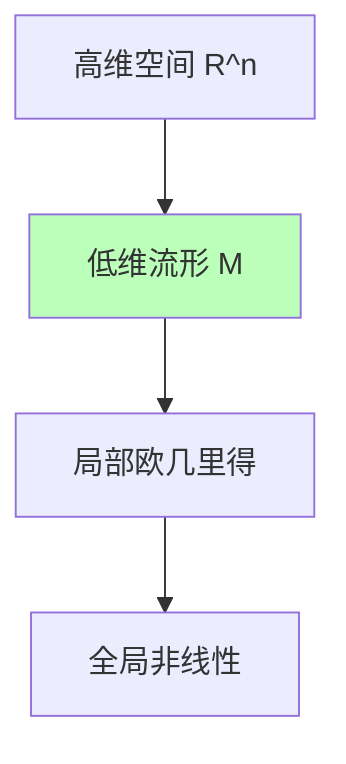

# 01.3.1-概率论与微分几何基础

## 一、概述

概率论与微分几何是数据层（数学概率模型）的理论基础，提供了概率分布、流形优化和梯度下降的数学框架。本文档阐述概率论、微分几何及其在 AI 数据层中的应用。

---

## 二、目录

- [01.3.1-概率论与微分几何基础](#0131-概率论与微分几何基础)
  - [一、概述](#一概述)
  - [二、目录](#二目录)
  - [三、概率论基础](#三概率论基础)
    - [2.1 概率分布](#21-概率分布)
    - [2.2 条件概率与贝叶斯定理](#22-条件概率与贝叶斯定理)
  - [四、微分几何基础](#四微分几何基础)
    - [3.1 流形（Manifold）](#31-流形manifold)
    - [3.2 切空间与梯度](#32-切空间与梯度)
    - [3.3 在数据层中的应用](#33-在数据层中的应用)
  - [五、信息论基础](#五信息论基础)
    - [4.1 信息熵](#41-信息熵)
    - [4.2 互信息](#42-互信息)
  - [六、概率采样](#六概率采样)
    - [5.1 采样方法](#51-采样方法)
    - [5.2 在数据层中的应用](#52-在数据层中的应用)
  - [七、梯度下降优化](#七梯度下降优化)
    - [6.1 优化算法](#61-优化算法)
    - [6.2 学习率调度](#62-学习率调度)
  - [八、与三层模型的关系](#八与三层模型的关系)
    - [7.1 数据层 → 执行层](#71-数据层--执行层)
    - [7.2 数据层 → 控制层](#72-数据层--控制层)
  - [九、核心结论](#九核心结论)
  - [十、相关主题](#十相关主题)
  - [十一、参考文档](#十一参考文档)

## 三、概率论基础

### 2.1 概率分布

**离散分布**：

- **伯努利分布**：Bernoulli(p)
- **多项分布**：Multinomial(n, p)
- **泊松分布**：Poisson(λ)

**连续分布**：

- **正态分布**：N(μ, σ²)
- **均匀分布**：Uniform(a, b)
- **指数分布**：Exponential(λ)

### 2.2 条件概率与贝叶斯定理

**条件概率**：P(A|B) = P(A ∩ B) / P(B)

**贝叶斯定理**：

```text
P(θ|D) = P(D|θ) P(θ) / P(D)
```

- **P(θ|D)**：后验概率
- **P(D|θ)**：似然函数
- **P(θ)**：先验概率
- **P(D)**：证据（归一化常数）

**在数据层中的应用**：

- **参数估计**：从数据推断模型参数
- **贝叶斯推理**：不确定性量化
- **后验采样**：MCMC 采样

---

## 四、微分几何基础

### 3.1 流形（Manifold）

**定义**：局部同胚于欧几里得空间的拓扑空间

**直观理解**：高维空间中的低维曲面



### 3.2 切空间与梯度

**切空间**：流形上某点的线性近似空间

**梯度**：函数在流形上的方向导数

**梯度下降**：

```text
θ_{t+1} = θ_t - α ∇_θ L(θ_t)
```

- **α**：学习率
- **∇_θ L**：损失函数的梯度

### 3.3 在数据层中的应用

**概率流形**：

- **参数空间**：模型参数构成流形
- **概率分布族**：参数化概率分布形成流形
- **优化路径**：梯度下降在流形上移动

**流形学习**：

- **降维**：将高维数据映射到低维流形
- **嵌入学习**：学习数据的流形结构
- **注意力机制**：在流形上计算相似度

---

## 五、信息论基础

### 4.1 信息熵

**香农熵**：

```text
H(X) = -Σ P(x) log P(x)
```

**性质**：

- **非负性**：H(X) ≥ 0
- **最大值**：均匀分布时熵最大
- **可加性**：H(X, Y) = H(X) + H(Y|X)

### 4.2 互信息

**定义**：

```text
I(X; Y) = H(X) - H(X|Y) = H(Y) - H(Y|X)
```

**意义**：X 和 Y 之间的信息量

**在数据层中的应用**：

- **特征选择**：选择与目标变量互信息大的特征
- **注意力机制**：计算 token 之间的互信息
- **信息瓶颈**：压缩信息同时保留相关性

---

## 六、概率采样

### 5.1 采样方法

**随机采样**：

- **均匀采样**：从均匀分布采样
- **重要性采样**：从重要分布采样
- **拒绝采样**：拒绝不符合条件的样本

**MCMC 采样**：

- **Metropolis-Hastings**：接受-拒绝机制
- **Gibbs 采样**：逐个变量采样
- **Hamiltonian Monte Carlo**：利用梯度信息

### 5.2 在数据层中的应用

**LLM 采样**：

- **Greedy Decoding**：选择概率最大的 token
- **Top-k Sampling**：从 top-k 候选采样
- **Top-p (Nucleus) Sampling**：从累积概率 p 的候选采样
- **Temperature Sampling**：调整概率分布的尖锐程度

**温度参数**：

```text
P'(x) = P(x)^{1/T} / Σ P(x)^{1/T}
```

- **T < 1**：分布更尖锐，输出更确定
- **T > 1**：分布更平滑，输出更多样

---

## 七、梯度下降优化

### 6.1 优化算法

**SGD（随机梯度下降）**：

```text
θ_{t+1} = θ_t - α ∇_θ L(θ_t, x_i)
```

**Adam（自适应矩估计）**：

```text
m_t = β₁ m_{t-1} + (1-β₁) g_t
v_t = β₂ v_{t-1} + (1-β₂) g_t²
θ_{t+1} = θ_t - α m_t / (√v_t + ε)
```

**2025 主流**：AdamW（权重衰减的 Adam）

### 6.2 学习率调度

**策略**：

- **固定学习率**：α = constant
- **线性衰减**：α_t = α₀ (1 - t/T)
- **余弦退火**：α_t = α₀ cos(πt/2T)
- **Warmup**：前几个 epoch 线性增加学习率

---

## 八、与三层模型的关系

### 7.1 数据层 → 执行层

- **梯度计算**：反向传播依赖执行层的精确微分
- **采样实现**：概率采样需要执行层的随机数生成器

### 7.2 数据层 → 控制层

- **概率分布**：控制层的约束通过条件概率实现
- **采样控制**：温度参数、top-k 等控制采样多样性

---

## 九、核心结论

1. **概率论是数据层的理论基础**：提供概率分布和贝叶斯推理框架
2. **微分几何提供优化框架**：梯度下降在概率流形上优化
3. **信息论量化信息量**：熵和互信息指导特征选择
4. **采样方法控制输出多样性**：温度、top-k、top-p 等参数调节

---

## 十、相关主题

- [01.3.2-Transformer 注意力机制](01.3.2-Transformer注意力机制.md)
- [01.3.3-概率采样与奖励塑形](01.3.3-概率采样与奖励塑形.md)
- [01.3.4-数据层训练与优化](01.3.4-数据层训练与优化.md)

---

## 十一、参考文档

- [分层解构视角](../../view/ai_models_view.md)
