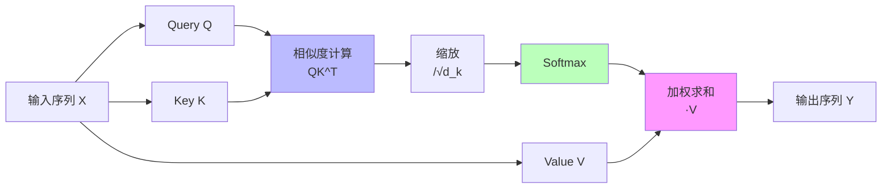
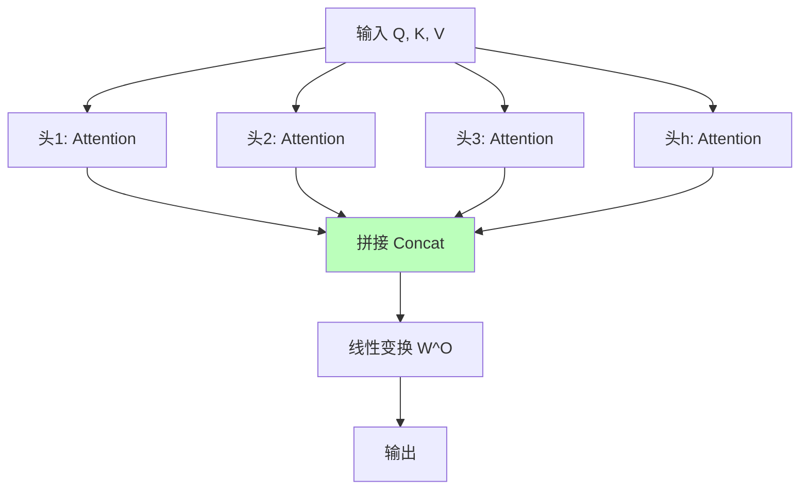
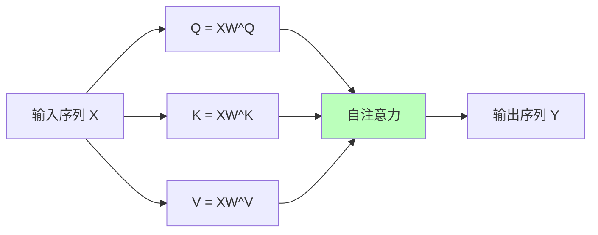
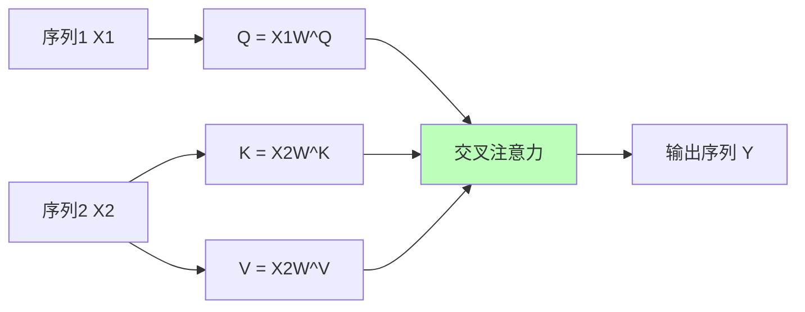
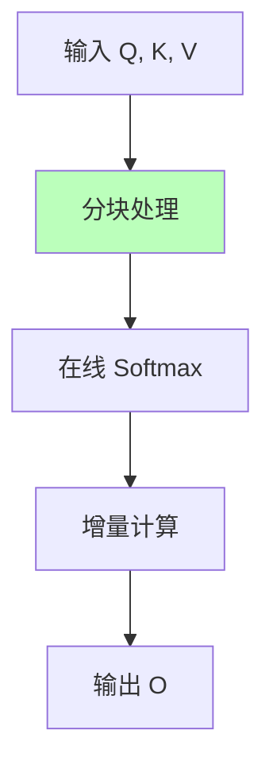

# 01.3.2-Transformer 注意力机制

## 一、概述

Transformer 注意力机制是数据层（数学概率模型）的核心技术，通过注意力机制实现序列建模和上下文理解。本文档阐述 Transformer 注意力机制的理论基础、实现方法及其在 AI 系统中的应用。

---

## 二、目录

- [01.3.2-Transformer 注意力机制](#0132-transformer-注意力机制)
  - [一、概述](#一概述)
  - [二、目录](#二目录)
  - [三、注意力机制基础](#三注意力机制基础)
    - [2.1 注意力定义](#21-注意力定义)
    - [2.2 注意力计算流程](#22-注意力计算流程)
  - [四、多头注意力](#四多头注意力)
    - [3.1 多头注意力定义](#31-多头注意力定义)
    - [3.2 多头注意力的优势](#32-多头注意力的优势)
  - [五、自注意力与交叉注意力](#五自注意力与交叉注意力)
    - [4.1 自注意力](#41-自注意力)
    - [4.2 交叉注意力](#42-交叉注意力)
  - [六、位置编码](#六位置编码)
    - [5.1 位置编码的必要性](#51-位置编码的必要性)
    - [5.2 位置编码方法](#52-位置编码方法)
  - [七、FlashAttention 优化](#七flashattention-优化)
    - [6.1 FlashAttention 原理](#61-flashattention-原理)
    - [6.2 FlashAttention-3](#62-flashattention-3)
  - [八、与三层模型的关系](#八与三层模型的关系)
    - [7.1 数据层 → 执行层](#71-数据层--执行层)
    - [7.2 数据层 → 控制层](#72-数据层--控制层)
  - [九、核心结论](#九核心结论)
  - [十、相关主题](#十相关主题)
  - [十一、参考文档](#十一参考文档)

## 三、注意力机制基础

### 2.1 注意力定义

**注意力机制（Attention Mechanism）**：

**核心思想**：根据查询（Query）和键（Key）的相似度，对值（Value）进行加权求和

**注意力公式**：

```text
Attention(Q, K, V) = softmax(QK^T / √d_k) V
```

**其中**：

- **Q（Query）**：查询向量
- **K（Key）**：键向量
- **V（Value）**：值向量
- **d_k**：键向量的维度

### 2.2 注意力计算流程

**注意力计算流程**：



**计算步骤**：

1. **相似度计算**：QK^T 计算查询和键的相似度
2. **缩放**：除以 √d_k 防止梯度消失
3. **Softmax**：归一化得到注意力权重
4. **加权求和**：用注意力权重对 V 加权求和

---

## 四、多头注意力

### 3.1 多头注意力定义

**多头注意力（Multi-Head Attention）**：

**核心思想**：使用多个注意力头，从不同角度理解序列

**多头注意力公式**：

```text
MultiHead(Q, K, V) = Concat(head_1, ..., head_h) W^O

其中 head_i = Attention(QW_i^Q, KW_i^K, VW_i^V)
```

**多头注意力流程**：



### 3.2 多头注意力的优势

**多头注意力的优势**：

1. **多角度理解**：不同头关注不同方面
2. **表达能力**：增强模型表达能力
3. **并行计算**：多个头可并行计算

**典型配置**：

- **GPT-4**：128 层，每层 32 头
- **Llama 3.1**：80 层，每层 32 头
- **Claude 3.5**：128 层，每层 32 头

---

## 五、自注意力与交叉注意力

### 4.1 自注意力

**自注意力（Self-Attention）**：

**定义**：Q、K、V 都来自同一个输入序列

**应用场景**：

- **编码器**：理解序列内部关系
- **解码器**：理解已生成序列

**自注意力流程**：



### 4.2 交叉注意力

**交叉注意力（Cross-Attention）**：

**定义**：Q 来自一个序列，K、V 来自另一个序列

**应用场景**：

- **编码器-解码器**：解码器关注编码器输出
- **多模态融合**：文本关注图像特征

**交叉注意力流程**：



---

## 六、位置编码

### 5.1 位置编码的必要性

**位置编码的必要性**：

- **注意力机制无位置信息**：注意力机制是置换不变的
- **序列顺序重要**：自然语言序列顺序很重要
- **位置编码注入位置信息**：通过位置编码注入位置信息

### 5.2 位置编码方法

**位置编码方法**：

| **方法**         | **公式**                            | **特点**           |
| ---------------- | ----------------------------------- | ------------------ |
| **正弦位置编码** | PE(pos, 2i) = sin(pos/10000^(2i/d)) | 固定编码，不可学习 |
| **学习位置编码** | PE = Embedding(pos)                 | 可学习，灵活性高   |
| **相对位置编码** | 相对位置关系                        | 泛化能力强         |

**2025 主流**：学习位置编码（RoPE - Rotary Position Embedding）

---

## 七、FlashAttention 优化

### 6.1 FlashAttention 原理

**FlashAttention 核心思想**：分块计算，避免存储完整注意力矩阵

**FlashAttention 流程**：



**优化效果**：

- **显存占用**：从 O(N²) 降至 O(N)
- **计算速度**：提升 2-4x（长上下文）
- **精度**：数值稳定，无精度损失

### 6.2 FlashAttention-3

**FlashAttention-3 新特性**：

1. **FP8 支持**：支持 FP8 训练
2. **长上下文**：支持 128K+ 上下文
3. **性能优化**：进一步优化计算效率

**2025 应用**：

- **DeepSeek-R1**：支持 128K 上下文
- **Claude 3.5**：支持 200K 上下文
- **GPT-4o**：支持 128K 上下文

---

## 八、与三层模型的关系

### 7.1 数据层 → 执行层

- **矩阵运算**：注意力计算依赖执行层的矩阵运算
- **并行计算**：多头注意力可并行计算

### 7.2 数据层 → 控制层

- **上下文理解**：注意力机制提供上下文理解能力
- **序列建模**：注意力机制实现序列建模

---

## 九、核心结论

1. **注意力机制是数据层的核心技术**：实现序列建模和上下文理解
2. **多头注意力增强表达能力**：从不同角度理解序列
3. **FlashAttention 解决长上下文瓶颈**：显存占用从 O(N²) 降至 O(N)
4. **位置编码注入位置信息**：RoPE 是 2025 主流

---

## 十、相关主题

- [01.3.1-概率论与微分几何基础](01.3.1-概率论与微分几何基础.md)
- [01.3.3-概率采样与奖励塑形](01.3.3-概率采样与奖励塑形.md)
- [01.3.4-数据层训练与优化](01.3.4-数据层训练与优化.md)

---

## 十一、参考文档

- [分层解构视角](../../view/ai_models_view.md)
- [工程实践核心逻辑下的 AI 三层模型全景解构](../../view/ai_engineer_view.md)
