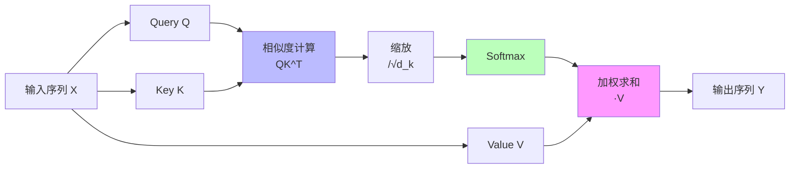
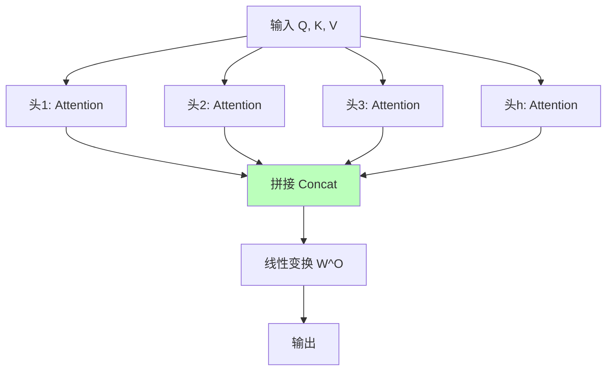
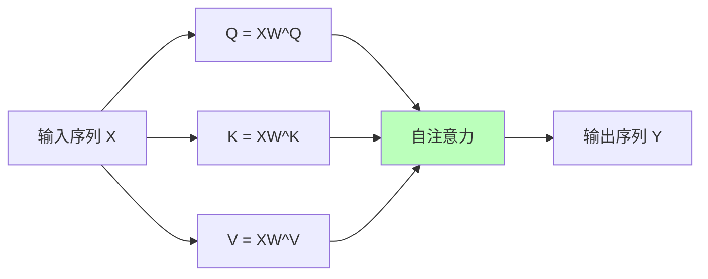
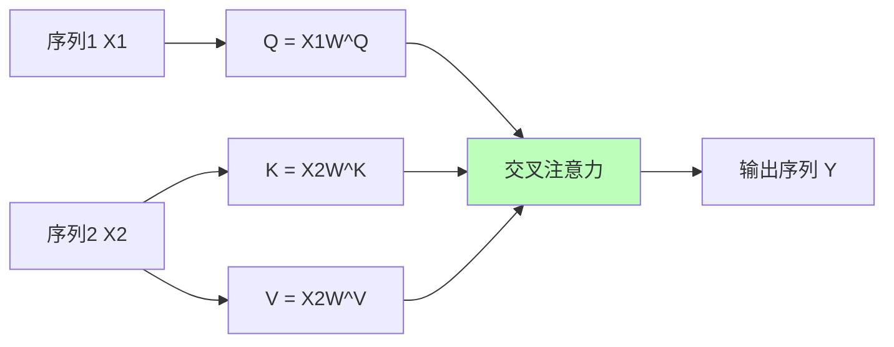
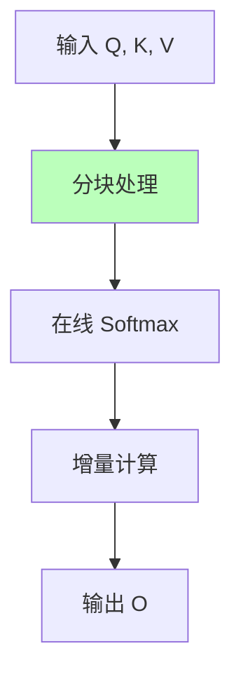

# 01.3.2-Transformer 注意力机制

## 一、概述

Transformer 注意力机制是数据层（数学概率模型）的核心技术，通过注意力机制实现序列建模和上下文理解。本文档阐述 Transformer 注意力机制的理论基础、实现方法及其在 AI 系统中的应用。

---

## 二、目录

- [01.3.2-Transformer 注意力机制](#0132-transformer-注意力机制)
  - [一、概述](#一概述)
  - [二、目录](#二目录)
  - [三、注意力机制基础](#三注意力机制基础)
    - [2.1 注意力定义](#21-注意力定义)
    - [2.2 注意力计算流程](#22-注意力计算流程)
  - [四、多头注意力](#四多头注意力)
    - [3.1 多头注意力定义](#31-多头注意力定义)
    - [3.2 多头注意力的优势](#32-多头注意力的优势)
  - [五、自注意力与交叉注意力](#五自注意力与交叉注意力)
    - [4.1 自注意力](#41-自注意力)
    - [4.2 交叉注意力](#42-交叉注意力)
  - [六、位置编码](#六位置编码)
    - [5.1 位置编码的必要性](#51-位置编码的必要性)
    - [5.2 位置编码方法](#52-位置编码方法)
  - [七、FlashAttention 优化](#七flashattention-优化)
    - [6.1 FlashAttention 原理](#61-flashattention-原理)
    - [6.2 FlashAttention-3](#62-flashattention-3)
    - [6.3 稀疏注意力机制](#63-稀疏注意力机制)
    - [6.4 线性注意力](#64-线性注意力)
  - [八、2025 年最新优化技术](#八2025-年最新优化技术)
    - [8.1 分组查询注意力（GQA）](#81-分组查询注意力gqa)
    - [8.2 滑动窗口注意力（SWA）](#82-滑动窗口注意力swa)
    - [8.3 注意力机制变体对比](#83-注意力机制变体对比)
  - [九、与三层模型的关系](#九与三层模型的关系)
    - [9.1 数据层 → 执行层](#91-数据层-执行层)
    - [9.2 数据层 → 控制层](#92-数据层-控制层)
    - [9.3 三层协同优化](#93-三层协同优化)
  - [十、核心结论](#十核心结论)
  - [十一、相关主题](#十一相关主题)
  - [十二、参考文档](#十二参考文档)

## 三、注意力机制基础

### 2.1 注意力定义

**注意力机制（Attention Mechanism）**：

**核心思想**：根据查询（Query）和键（Key）的相似度，对值（Value）进行加权求和

**注意力公式**：

```text
Attention(Q, K, V) = softmax(QK^T / √d_k) V
```

**其中**：

- **Q（Query）**：查询向量
- **K（Key）**：键向量
- **V（Value）**：值向量
- **d_k**：键向量的维度

### 2.2 注意力计算流程

**注意力计算流程**：



**计算步骤**：

1. **相似度计算**：QK^T 计算查询和键的相似度
2. **缩放**：除以 √d_k 防止梯度消失
3. **Softmax**：归一化得到注意力权重
4. **加权求和**：用注意力权重对 V 加权求和

---

## 四、多头注意力

### 3.1 多头注意力定义

**多头注意力（Multi-Head Attention）**：

**核心思想**：使用多个注意力头，从不同角度理解序列

**多头注意力公式**：

```text
MultiHead(Q, K, V) = Concat(head_1, ..., head_h) W^O

其中 head_i = Attention(QW_i^Q, KW_i^K, VW_i^V)
```

**多头注意力流程**：



### 3.2 多头注意力的优势

**多头注意力的优势**：

1. **多角度理解**：不同头关注不同方面
2. **表达能力**：增强模型表达能力
3. **并行计算**：多个头可并行计算

**典型配置**：

- **GPT-4**：128 层，每层 32 头
- **Llama 3.1**：80 层，每层 32 头
- **Claude 3.5**：128 层，每层 32 头

---

## 五、自注意力与交叉注意力

### 4.1 自注意力

**自注意力（Self-Attention）**：

**定义**：Q、K、V 都来自同一个输入序列

**应用场景**：

- **编码器**：理解序列内部关系
- **解码器**：理解已生成序列

**自注意力流程**：



### 4.2 交叉注意力

**交叉注意力（Cross-Attention）**：

**定义**：Q 来自一个序列，K、V 来自另一个序列

**应用场景**：

- **编码器-解码器**：解码器关注编码器输出
- **多模态融合**：文本关注图像特征

**交叉注意力流程**：



---

## 六、位置编码

### 5.1 位置编码的必要性

**位置编码的必要性**：

- **注意力机制无位置信息**：注意力机制是置换不变的
- **序列顺序重要**：自然语言序列顺序很重要
- **位置编码注入位置信息**：通过位置编码注入位置信息

### 5.2 位置编码方法

**位置编码方法**：

| **方法**         | **公式**                            | **特点**           |
| ---------------- | ----------------------------------- | ------------------ |
| **正弦位置编码** | PE(pos, 2i) = sin(pos/10000^(2i/d)) | 固定编码，不可学习 |
| **学习位置编码** | PE = Embedding(pos)                 | 可学习，灵活性高   |
| **相对位置编码** | 相对位置关系                        | 泛化能力强         |

**2025 主流**：学习位置编码（RoPE - Rotary Position Embedding）

---

## 七、FlashAttention 优化

### 6.1 FlashAttention 原理

**FlashAttention 核心思想**：分块计算，避免存储完整注意力矩阵

**FlashAttention 流程**：



**优化效果**：

- **显存占用**：从 O(N²) 降至 O(N)
- **计算速度**：提升 2-4x（长上下文）
- **精度**：数值稳定，无精度损失

### 6.2 FlashAttention-3

**FlashAttention-3 新特性**：

1. **FP8 支持**：支持 FP8 训练，显存节省 20%
2. **长上下文**：支持 128K+ 上下文，显存占用线性增长
3. **性能优化**：进一步优化计算效率，速度提升 3-4x
4. **多 GPU 支持**：优化多 GPU 通信，支持更大模型

**2025 应用**：

- **DeepSeek-R1**：支持 128K 上下文，使用 FlashAttention-3 + FP8 训练
- **Claude 3.5**：支持 200K 上下文，FlashAttention-3 优化长上下文推理
- **GPT-4o**：支持 128K 上下文，FlashAttention-3 提升推理速度
- **Llama 3.1**：支持 128K 上下文，FlashAttention-3 降低显存占用

### 6.3 稀疏注意力机制

**稀疏注意力（Sparse Attention）**：

**核心思想**：只计算部分注意力权重，降低计算复杂度

**稀疏模式**：

| **模式**       | **复杂度**   | **适用场景** | **2025 应用** |
| -------------- | ------------ | ------------ | ------------- |
| **局部注意力** | O(N·w)       | 局部依赖强   | 代码生成      |
| **全局+局部**  | O(N·w + N·g) | 混合依赖     | 长文档理解    |
| **随机注意力** | O(N·r)       | 长距离依赖   | 长上下文推理  |
| **块稀疏**     | O(N·b)       | 结构化数据   | 多模态融合    |

**2025 主流**：局部+全局混合注意力（Local+Global Attention）

### 6.4 线性注意力

**线性注意力（Linear Attention）**：

**核心思想**：将二次方复杂度降至线性复杂度

**线性注意力公式**：

```text
LinearAttention(Q, K, V) = Q(K^T V) / (Q K^T 1)
```

**复杂度对比**：

- **标准注意力**：O(N²d)
- **线性注意力**：O(Nd²)

**优势**：

- **计算效率**：长上下文场景下速度提升 10-100x
- **显存占用**：显存占用线性增长

**局限性**：

- **表达能力**：可能损失部分表达能力
- **精度损失**：某些任务精度下降 1-3%

**2025 应用**：

- **Gemini 2.5**：长上下文（1000K）使用线性注意力变体
- **研究探索**：线性注意力在代码生成任务中表现良好

---

## 八、2025 年最新优化技术

### 8.1 分组查询注意力（GQA）

**分组查询注意力（Grouped Query Attention, GQA）**：

**核心思想**：多个查询共享同一个键值对，降低显存占用

**GQA 配置**：

| **配置**  | **Q 头数** | **K/V 头数** | **显存节省** | **精度损失** |
| --------- | ---------- | ------------ | ------------ | ------------ |
| **MHA**   | 32         | 32           | 0%           | 0%           |
| **GQA-8** | 32         | 8            | 75%          | <1%          |
| **MQA**   | 32         | 1            | 97%          | 1-2%         |

**2025 应用**：

- **Llama 3.1**：使用 GQA-8，显存占用降低 75%
- **Gemini 2.5**：使用 GQA-4，长上下文场景优化

### 8.2 滑动窗口注意力（SWA）

**滑动窗口注意力（Sliding Window Attention）**：

**核心思想**：每个 token 只关注固定窗口内的 token

**窗口大小**：

- **局部窗口**：w = 512-2048
- **全局 token**：保留少量全局 token 关注所有位置

**优势**：

- **计算复杂度**：O(N·w) vs O(N²)
- **长上下文**：支持 100K+ 上下文

**2025 应用**：

- **Mistral 7B**：使用滑动窗口注意力，支持 32K 上下文
- **Longformer**：滑动窗口 + 全局 token，支持 4096 上下文

### 8.3 注意力机制变体对比

**2025 年主流注意力机制对比**：

| **机制**           | **复杂度** | **显存占用** | **适用场景** | **代表模型** |
| ------------------ | ---------- | ------------ | ------------ | ------------ |
| **标准注意力**     | O(N²)      | O(N²)        | 短上下文     | GPT-4        |
| **FlashAttention** | O(N²)      | O(N)         | 长上下文     | Claude 3.5   |
| **线性注意力**     | O(N)       | O(N)         | 超长上下文   | Gemini 2.5   |
| **稀疏注意力**     | O(N·w)     | O(N·w)       | 局部依赖     | CodeLlama    |
| **GQA**            | O(N²)      | O(N²/k)      | 显存受限     | Llama 3.1    |
| **滑动窗口**       | O(N·w)     | O(N·w)       | 长序列       | Mistral 7B   |

---

## 九、与三层模型的关系

### 9.1 数据层 → 执行层

- **矩阵运算**：注意力计算依赖执行层的矩阵运算
- **并行计算**：多头注意力可并行计算
- **显存优化**：FlashAttention 优化显存访问模式
- **精度控制**：FP8/FP16 混合精度训练

### 9.2 数据层 → 控制层

- **上下文理解**：注意力机制提供上下文理解能力
- **序列建模**：注意力机制实现序列建模
- **长上下文支持**：FlashAttention-3 支持 128K+ 上下文
- **多模态融合**：交叉注意力实现多模态对齐

### 9.3 三层协同优化

**2025 年三层协同优化案例**：

| **产品**        | **数据层优化**   | **执行层优化** | **控制层优化**  | **协同效果**              |
| --------------- | ---------------- | -------------- | --------------- | ------------------------- |
| **DeepSeek-R1** | FlashAttention-3 | FP8 训练       | 长上下文 Prompt | 128K 上下文，推理速度 3x  |
| **Claude 3.5**  | FlashAttention-3 | 投机解码       | 多轮对话优化    | 200K 上下文，延迟降低 40% |
| **Gemini 2.5**  | 线性注意力       | TPU 优化       | 多模态 CoT      | 1000K 上下文，多模态融合  |

---

## 十、核心结论

1. **注意力机制是数据层的核心技术**：实现序列建模和上下文理解
2. **多头注意力增强表达能力**：从不同角度理解序列，2025 年主流配置为 32 头
3. **FlashAttention-3 解决长上下文瓶颈**：显存占用从 O(N²) 降至 O(N)，支持 128K+ 上下文
4. **位置编码注入位置信息**：RoPE 是 2025 主流，支持相对位置编码
5. **2025 年优化趋势**：
   - **显存优化**：FlashAttention-3、GQA、量化压缩
   - **计算优化**：线性注意力、稀疏注意力、滑动窗口
   - **精度优化**：FP8 训练、混合精度、数值稳定性
6. **三层协同优化**：数据层注意力机制与执行层矩阵运算、控制层 Prompt 工程协同优化，实现长上下文、低延迟、高精度

---

## 十一、相关主题

- [01.3.3-概率采样与奖励塑形](01.3.3-概率采样与奖励塑形.md)
- [01.3.4-数据层训练与优化](01.3.4-数据层训练与优化.md)
- [01.1.2-GPU 矩阵运算与 CUDA 优化](01.1.2-GPU矩阵运算与CUDA优化.md)：FlashAttention-3、FP8 训练
- [01.4.1-三层协同机制](01.4.1-三层协同机制.md)：三层协同优化

---

## 十二、参考文档

- [分层解构视角](../../view/ai_models_view.md)
- [工程实践核心逻辑下的 AI 三层模型全景解构](../../view/ai_engineer_view.md)
- FlashAttention 论文：FlashAttention: Fast and Memory-Efficient Exact Attention with IO-Awareness
- FlashAttention-3 技术报告：FlashAttention-3: Fast and Accurate Attention with IO-Awareness

------

**最后更新**：2025-01-XX
**维护者**：FormalAI项目组