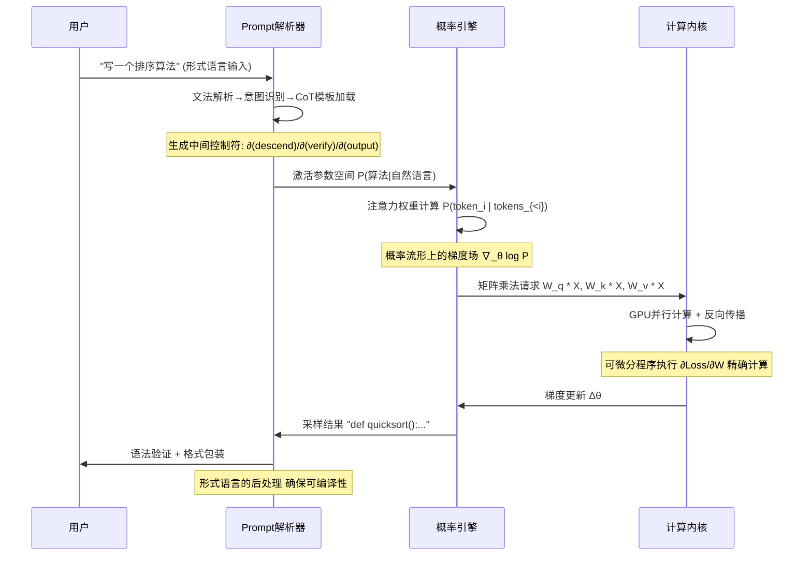
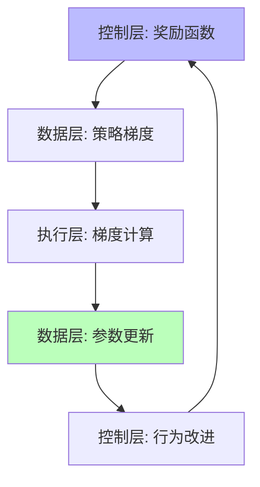
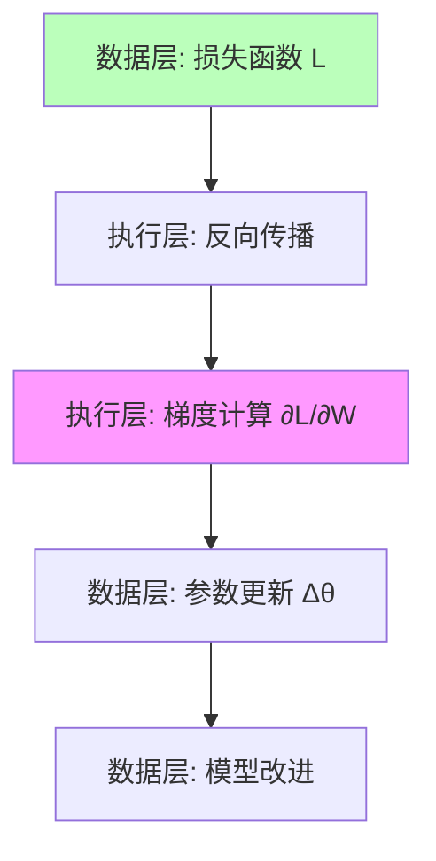
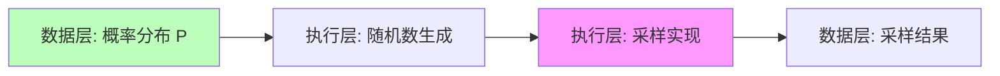
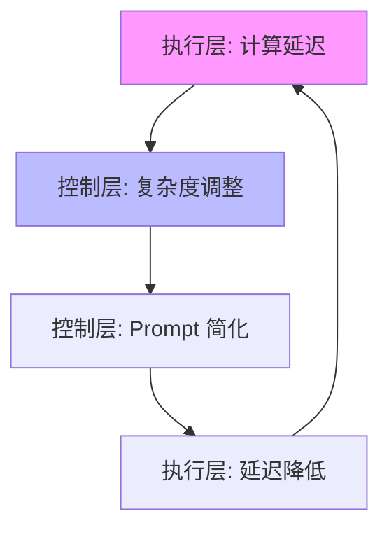
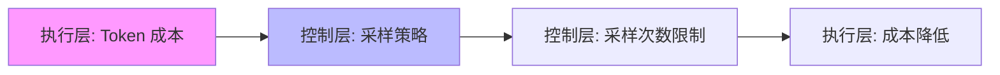

# 01.4.1-三层协同机制

## 一、概述

三层协同机制是 AI 系统实现复杂功能的关键，描述了执行层、控制层和数据层之间的交互方式和协同模式。本文档阐述三层协同机制、交互流程及其在 AI 系统中的应用。

---

## 二、目录

- [01.4.1-三层协同机制](#0141-三层协同机制)
  - [一、概述](#一概述)
  - [二、目录](#二目录)
  - [三、三层协同流程](#三三层协同流程)
    - [2.1 从 Prompt 到输出的完整流程](#21-从-prompt-到输出的完整流程)
  - [四、控制层 → 数据层协同](#四控制层--数据层协同)
    - [3.1 Prompt 到概率分布](#31-prompt-到概率分布)
    - [3.2 RLHF 反馈循环](#32-rlhf-反馈循环)
  - [五、数据层 → 执行层协同](#五数据层--执行层协同)
    - [4.1 梯度计算](#41-梯度计算)
    - [4.2 采样实现](#42-采样实现)
  - [六、执行层 → 控制层协同](#六执行层--控制层协同)
    - [5.1 延迟反馈](#51-延迟反馈)
    - [5.2 成本反馈](#52-成本反馈)
  - [七、三层协同模式](#七三层协同模式)
    - [6.1 强耦合模式](#61-强耦合模式)
    - [6.2 解耦模式](#62-解耦模式)
  - [八、工程实践案例](#八工程实践案例)
    - [7.1 DeepSeek-R1 的三层协同](#71-deepseek-r1-的三层协同)
    - [7.2 Claude 3.5 的三层协同](#72-claude-35-的三层协同)
  - [九、与三层模型的关系](#九与三层模型的关系)
    - [8.1 协同 vs 冲突](#81-协同-vs-冲突)
    - [8.2 协同优化](#82-协同优化)
  - [十、核心结论](#十核心结论)
  - [十一、相关主题](#十一相关主题)
  - [十二、参考文档](#十二参考文档)

## 三、三层协同流程

### 2.1 从 Prompt 到输出的完整流程



**协同关键点**：

1. **控制层 → 数据层**：Prompt 将形式语言约束编码为**条件概率** P(输出|提示+规则)
2. **数据层 → 执行层**：概率模型的梯度计算依赖执行层的**精确微分能力**（Autograd）
3. **执行层 → 控制层**：反向传播的误差信号影响 RLHF 的奖励塑形，形成**反馈闭环**

---

## 四、控制层 → 数据层协同

### 3.1 Prompt 到概率分布

**形式约束转概率分布**：

```mermaid
graph LR
    A[Prompt: 形式语言约束] --> B[Embedding: 连续向量]
    B --> C[条件概率 P(输出|Prompt)]
    C --> D[概率采样]

    style A fill:#bbf
    style C fill:#bfb
```

**实现机制**：

1. **Prompt 编码**：将形式语言转换为向量表示
2. **条件激活**：激活参数空间中的相关区域
3. **概率约束**：通过条件概率实现形式约束

### 3.2 RLHF 反馈循环

**奖励信号注入**：



**协同机制**：

- **奖励塑形**：控制层定义奖励函数，指导数据层优化
- **策略梯度**：数据层通过策略梯度更新参数
- **行为改进**：执行层计算梯度，数据层更新参数，控制层观察改进

---

## 五、数据层 → 执行层协同

### 4.1 梯度计算

**反向传播流程**：



**协同机制**：

- **精确微分**：执行层提供 Autograd 能力，精确计算梯度
- **梯度累积**：小 batch 累积成大 batch，节省显存
- **混合精度**：FP8/BF16 训练，平衡精度和速度

### 4.2 采样实现

**概率采样流程**：



**协同机制**：

- **随机数生成**：执行层提供高质量随机数生成器
- **采样算法**：Greedy、Top-k、Top-p、Temperature 等
- **并行采样**：多 GPU 并行采样，提升吞吐量

---

## 六、执行层 → 控制层协同

### 5.1 延迟反馈

**实时性约束**：



**协同机制**：

- **延迟监控**：执行层监控计算延迟
- **动态调整**：控制层根据延迟调整 Prompt 复杂度
- **降级策略**：延迟过高时，控制层简化 Prompt

### 5.2 成本反馈

**Token 成本控制**：



**协同机制**：

- **成本监控**：执行层监控每个 token 的成本
- **策略调整**：控制层根据成本调整采样策略
- **预算控制**：设置 token 预算，控制层在预算内优化

---

## 七、三层协同模式

### 6.1 强耦合模式

**特点**：三层深度耦合，端到端训练

**代表**：OpenAI o1、DeepSeek-R1

**优势**：

- **性能最优**：三层协同优化，性能最佳
- **端到端训练**：统一优化目标

**劣势**：

- **调试困难**：三层耦合，难以定位问题
- **灵活性低**：难以单独优化某一层

### 6.2 解耦模式

**特点**：三层接口清晰，模块化设计

**代表**：Claude 3.5、Llama 3.1

**优势**：

- **易于调试**：三层解耦，问题定位清晰
- **灵活性强**：可以单独优化某一层

**劣势**：

- **性能次优**：三层解耦，性能略低
- **接口开销**：层间接口带来额外开销

---

## 八、工程实践案例

### 7.1 DeepSeek-R1 的三层协同

**协同机制**：

1. **控制层**：纯 RL 驱动，无 SFT 阶段
2. **数据层**：GRPO 群体相对优化
3. **执行层**：FP8 混合精度训练

**效果**：三层协同，推理能力显著提升

### 7.2 Claude 3.5 的三层协同

**协同机制**：

1. **控制层**：Constitutional AI 多阶段规则注入
2. **数据层**：反向课程学习 + RLHF
3. **执行层**：投机解码（Speculative Decoding）

**效果**：三层解耦，可控性强，性能稳定

---

## 九、与三层模型的关系

### 8.1 协同 vs 冲突

**协同机制**：三层协同实现复杂功能

**冲突机制**：三层冲突导致系统不稳定

**平衡策略**：在协同和冲突之间找到平衡点

### 8.2 协同优化

**优化目标**：

- **性能**：提升系统整体性能
- **可控性**：保持系统可控性
- **效率**：提升计算效率

**优化策略**：

- **端到端训练**：统一优化目标
- **模块化设计**：分层优化，接口清晰
- **混合策略**：关键路径端到端，其他路径模块化

---

## 十、核心结论

1. **三层协同是 AI 系统的核心机制**：通过协同实现复杂功能
2. **控制层 → 数据层**：Prompt 转概率分布，RLHF 反馈循环
3. **数据层 → 执行层**：梯度计算，概率采样
4. **执行层 → 控制层**：延迟反馈，成本反馈
5. **协同模式选择**：强耦合 vs 解耦，根据场景选择

---

## 十一、相关主题

- [01.4.2-层间冲突与矛盾](01.4.2-层间冲突与矛盾.md)
- [01.4.3-三层契约设计模式](01.4.3-三层契约设计模式.md)
- [01.4.4-跨层优化策略](01.4.4-跨层优化策略.md)

---

## 十二、参考文档

- [工程实践核心逻辑下的 AI 三层模型全景解构](../../view/ai_engineer_view.md)
- [分层解构视角](../../view/ai_models_view.md)
