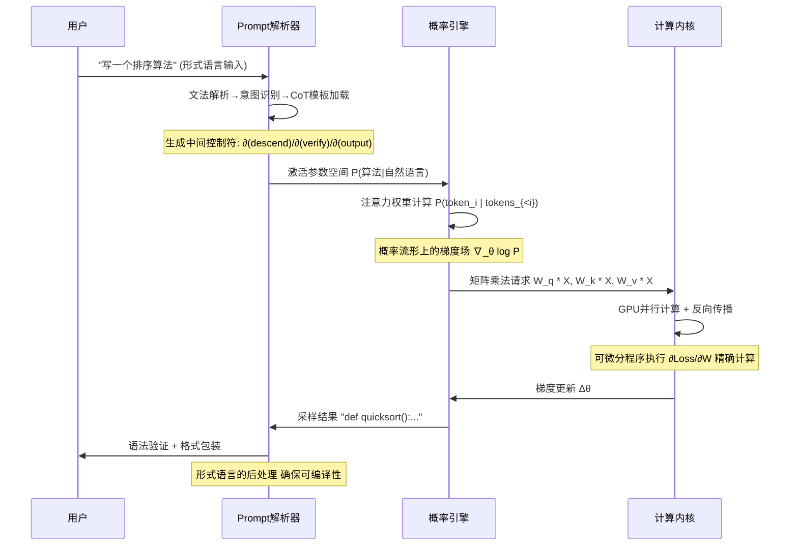
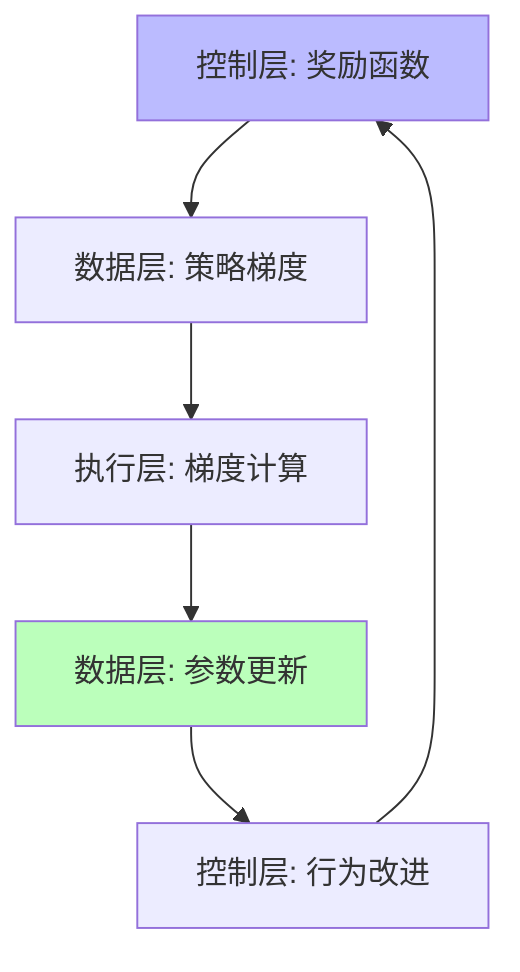
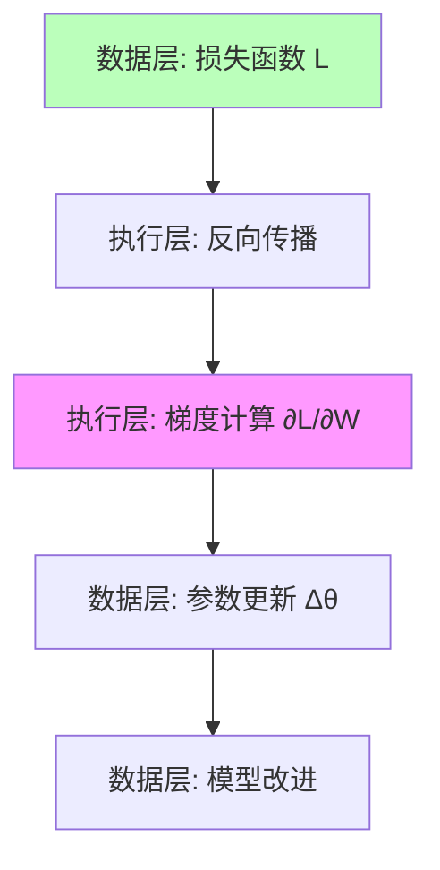
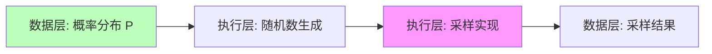
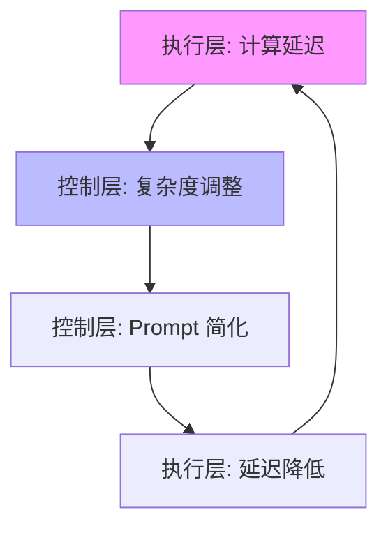

# 01.4.1-三层协同机制

## 一、概述

三层协同机制是 AI 系统实现复杂功能的关键，描述了执行层、控制层和数据层之间的交互方式和协同模式。本文档阐述三层协同机制、交互流程及其在 AI 系统中的应用。

---

## 二、目录

- [01.4.1-三层协同机制](#0141-三层协同机制)
  - [一、概述](#一概述)
  - [二、目录](#二目录)
  - [三、三层协同流程](#三三层协同流程)
    - [2.1 从 Prompt 到输出的完整流程](#21-从-prompt-到输出的完整流程)
  - [三、核心形式化理论](#三核心形式化理论)
    - [3.1 三层协同的形式化定义](#31-三层协同的形式化定义)
    - [3.2 协同有效性定理](#32-协同有效性定理)
    - [3.3 协同效率定理](#33-协同效率定理)
  - [四、控制层 → 数据层协同](#四控制层--数据层协同)
    - [3.1 Prompt 到概率分布](#31-prompt-到概率分布)
    - [3.2 RLHF 反馈循环](#32-rlhf-反馈循环)
  - [五、数据层 → 执行层协同](#五数据层--执行层协同)
    - [4.1 梯度计算](#41-梯度计算)
    - [4.2 采样实现](#42-采样实现)
  - [六、执行层 → 控制层协同](#六执行层--控制层协同)
    - [5.1 延迟反馈](#51-延迟反馈)
    - [5.2 成本反馈](#52-成本反馈)
  - [七、三层协同模式](#七三层协同模式)
    - [6.1 强耦合模式](#61-强耦合模式)
    - [6.2 解耦模式](#62-解耦模式)
    - [6.3 混合模式](#63-混合模式)
    - [6.4 2025 年三层协同模式对比](#64-2025-年三层协同模式对比)
  - [八、工程实践案例](#八工程实践案例)
    - [7.1 DeepSeek-R1 的三层协同](#71-deepseek-r1-的三层协同)
    - [7.2 Claude 3.5 的三层协同](#72-claude-35-的三层协同)
    - [7.3 Gemini 2.5 的三层协同](#73-gemini-25-的三层协同)
    - [7.4 Llama 3.1 的三层协同](#74-llama-31-的三层协同)
    - [7.5 OpenAI o1 的三层协同](#75-openai-o1-的三层协同)
  - [九、与三层模型的关系](#九与三层模型的关系)
    - [8.1 协同 vs 冲突](#81-协同-vs-冲突)
    - [8.2 协同优化](#82-协同优化)
  - [十、2025 年三层协同技术趋势](#十2025-年三层协同技术趋势)
  - [十一、核心结论](#十一核心结论)
  - [十二、相关主题](#十二相关主题)
  - [十三、参考文档](#十三参考文档)
    - [13.1 内部参考文档](#131-内部参考文档)
    - [13.2 学术参考文献](#132-学术参考文献)
    - [13.3 技术文档](#133-技术文档)

## 三、三层协同流程

### 2.1 从 Prompt 到输出的完整流程



**协同关键点**：

1. **控制层 → 数据层**：Prompt 将形式语言约束编码为**条件概率** P(输出|提示+规则)
2. **数据层 → 执行层**：概率模型的梯度计算依赖执行层的**精确微分能力**（Autograd）
3. **执行层 → 控制层**：反向传播的误差信号影响 RLHF 的奖励塑形，形成**反馈闭环**

---

## 三、核心形式化理论

### 3.1 三层协同的形式化定义

**定义**（三层协同）：对于AI系统 $A = (E, C, D)$，三层协同定义为层间信息流的有效传递和状态同步。

**形式化表述**：

$$\text{Cooperation}(A) = \text{Sync}(E, C, D) \land \text{Flow}(C \rightarrow D) \land \text{Flow}(D \rightarrow E) \land \text{Flow}(E \rightarrow C)$$

其中：

- $\text{Sync}(E, C, D)$：三层状态同步
- $\text{Flow}(X \rightarrow Y)$：从层X到层Y的信息流

### 3.2 协同有效性定理

**定理**（协同有效性）：在满足以下条件时，三层协同能够实现功能增强：

1. **信息流完整性**：$\forall x \in \text{Input}, \exists \text{path}: C \rightarrow D \rightarrow E \rightarrow C$
2. **状态一致性**：$\text{State}(E) \models \text{Constraint}(C) \land \text{State}(D) \models \text{Distribution}(C)$
3. **计算可微性**：$\nabla_\theta \text{Loss}$ 在层间可传递

**证明要点**：

**步骤1**：证明信息流完整性保证功能可达性

- 控制层约束通过条件概率传递到数据层
- 数据层概率分布通过梯度传递到执行层
- 执行层计算结果反馈到控制层

**步骤2**：证明状态一致性保证语义正确性

- 执行层状态满足控制层约束（形式验证）
- 数据层分布满足控制层概率要求（统计验证）

**步骤3**：证明计算可微性保证优化可行性

- 反向传播路径：$E \rightarrow D \rightarrow C$
- 梯度在层间传递无损失

**结论**：三层协同在满足上述条件时，能够实现功能增强。∎

### 3.3 协同效率定理

**定理**（协同效率）：三层协同的计算复杂度为：

$$T_{\text{cooperation}} = O(T_C + T_D + T_E + T_{\text{sync}})$$

其中：

- $T_C$：控制层处理时间（$O(n^2)$，文法解析）
- $T_D$：数据层处理时间（$O(n^2d)$，注意力机制）
- $T_E$：执行层处理时间（$O(nd)$，矩阵乘法）
- $T_{\text{sync}}$：层间同步时间（$O(n)$，状态传递）

**证明**：直接由各层复杂度相加得到。∎

**优化策略**：通过并行化和流水线，可将总时间降低至 $\max(T_C, T_D, T_E) + T_{\text{sync}}$。

---

## 四、控制层 → 数据层协同

### 3.1 Prompt 到概率分布

**形式约束转概率分布**：

```mermaid
graph LR
    A[Prompt: 形式语言约束] --> B[Embedding: 连续向量]
    B --> C[条件概率 P(输出|Prompt)]
    C --> D[概率采样]

    style A fill:#bbf
    style C fill:#bfb
```

**实现机制**：

1. **Prompt 编码**：将形式语言转换为向量表示
2. **条件激活**：激活参数空间中的相关区域
3. **概率约束**：通过条件概率实现形式约束

### 3.2 RLHF 反馈循环

**奖励信号注入**：



**协同机制**：

- **奖励塑形**：控制层定义奖励函数，指导数据层优化
- **策略梯度**：数据层通过策略梯度更新参数
- **行为改进**：执行层计算梯度，数据层更新参数，控制层观察改进

---

## 五、数据层 → 执行层协同

### 4.1 梯度计算

**反向传播流程**：



**协同机制**：

- **精确微分**：执行层提供 Autograd 能力，精确计算梯度
- **梯度累积**：小 batch 累积成大 batch，节省显存
- **混合精度**：FP8/BF16 训练，平衡精度和速度

### 4.2 采样实现

**概率采样流程**：



**协同机制**：

- **随机数生成**：执行层提供高质量随机数生成器
- **采样算法**：Greedy、Top-k、Top-p、Temperature 等
- **并行采样**：多 GPU 并行采样，提升吞吐量

---

## 六、执行层 → 控制层协同

### 5.1 延迟反馈

**实时性约束**：



**协同机制**：

- **延迟监控**：执行层监控计算延迟
- **动态调整**：控制层根据延迟调整 Prompt 复杂度
- **降级策略**：延迟过高时，控制层简化 Prompt

### 5.2 成本反馈

**Token 成本控制**：


**协同机制**：

- **成本监控**：执行层监控每个 token 的成本
- **策略调整**：控制层根据成本调整采样策略
- **预算控制**：设置 token 预算，控制层在预算内优化

---

## 七、三层协同模式

### 6.1 强耦合模式

**特点**：三层深度耦合，端到端训练

**代表**：OpenAI o1、DeepSeek-R1

**优势**：

- **性能最优**：三层协同优化，性能最佳
- **端到端训练**：统一优化目标

**劣势**：

- **调试困难**：三层耦合，难以定位问题
- **灵活性低**：难以单独优化某一层

**2025 应用**：

- **DeepSeek-R1**：纯 RL 驱动，三层深度耦合
- **OpenAI o1**：动态推理深度控制，三层协同优化

### 6.2 解耦模式

**特点**：三层接口清晰，模块化设计

**代表**：Claude 3.5、Llama 3.1

**优势**：

- **易于调试**：三层解耦，问题定位清晰
- **灵活性强**：可以单独优化某一层

**劣势**：

- **性能次优**：三层解耦，性能略低
- **接口开销**：层间接口带来额外开销

**2025 应用**：

- **Claude 3.5**：Modular 设计，三层解耦
- **Llama 3.1**：标准接口，模块化设计

### 6.3 混合模式

**特点**：关键路径强耦合，其他路径解耦

**代表**：Gemini 2.5

**优势**：

- **平衡性能**：关键路径性能最优
- **灵活性强**：其他路径可单独优化

**劣势**：

- **实现复杂**：需要精细设计耦合和解耦边界

**2025 应用**：

- **Gemini 2.5**：多模态融合强耦合，其他模块解耦

### 6.4 2025 年三层协同模式对比

**2025 年主流三层协同模式对比**：

| **模式**   | **特点**     | **优势** | **劣势** | **2025 应用**          |
| ---------- | ------------ | -------- | -------- | ---------------------- |
| **强耦合** | 三层深度耦合 | 性能最优 | 调试困难 | DeepSeek-R1, OpenAI o1 |
| **解耦**   | 三层接口清晰 | 易于调试 | 性能次优 | Claude 3.5, Llama 3.1  |
| **混合**   | 关键路径耦合 | 平衡性能 | 实现复杂 | Gemini 2.5             |

**2025 趋势**：

1. **强耦合模式**：适合追求极致性能的场景
2. **解耦模式**：适合需要灵活性和可控性的场景
3. **混合模式**：适合复杂系统，平衡性能和灵活性

---

## 八、工程实践案例

### 7.1 DeepSeek-R1 的三层协同

**协同机制**：

1. **控制层**：纯 RL 驱动，无 SFT 阶段
2. **数据层**：GRPO 群体相对优化
3. **执行层**：FP8 混合精度训练

**效果**：三层协同，推理能力显著提升

### 7.2 Claude 3.5 的三层协同

**协同机制**：

1. **控制层**：Constitutional AI 多阶段规则注入
2. **数据层**：反向课程学习 + RLHF
3. **执行层**：投机解码（Speculative Decoding）

**效果**：三层解耦，可控性强，性能稳定

### 7.3 Gemini 2.5 的三层协同

**协同机制**：

1. **控制层**：多模态 CoT 统一协议
2. **数据层**：线性注意力 + 多模态融合
3. **执行层**：TPU 多层流水线并行

**效果**：支持超长上下文（1000K），多模态融合效果好

### 7.4 Llama 3.1 的三层协同

**协同机制**：

1. **控制层**：标准指令微调（SFT）
2. **数据层**：GQA-8 + DPO 对齐
3. **执行层**：CUDA Graph 静态编译

**效果**：成本效益比最优，训练效率高

### 7.5 OpenAI o1 的三层协同

**协同机制**：

1. **控制层**：动态推理深度控制（CoT 长度自适应）
2. **数据层**：Test-time compute 扩展（模拟推理链）
3. **执行层**：异步连续批处理

**效果**：推理能力显著提升，支持复杂推理任务

---

## 九、与三层模型的关系

### 8.1 协同 vs 冲突

**协同机制**：三层协同实现复杂功能

**冲突机制**：三层冲突导致系统不稳定

**平衡策略**：在协同和冲突之间找到平衡点

### 8.2 协同优化

**优化目标**：

- **性能**：提升系统整体性能
- **可控性**：保持系统可控性
- **效率**：提升计算效率

**优化策略**：

- **端到端训练**：统一优化目标
- **模块化设计**：分层优化，接口清晰
- **混合策略**：关键路径端到端，其他路径模块化

---

## 十、2025 年三层协同技术趋势

**2025 年三层协同技术趋势**：

1. **控制层 → 数据层**：

   - **Prompt 工程**：CoT、System 1/2 混合、多模态 CoT
   - **奖励塑形**：RLHF、DPO、GRPO、ORPO
   - **反馈循环**：实时反馈、过程奖励、多目标奖励

2. **数据层 → 执行层**：

   - **梯度计算**：FP8 训练、混合精度、FlashAttention-3
   - **采样实现**：DoLa、Contrastive Decoding、Temperature 采样
   - **并行计算**：GQA、线性注意力、滑动窗口

3. **执行层 → 控制层**：
   - **延迟反馈**：实时监控、动态调整、降级策略
   - **成本反馈**：Token 成本控制、预算管理、效率优化
   - **性能反馈**：性能监控、瓶颈识别、优化建议

**2025 年协同优化重点**：

1. **长上下文支持**：FlashAttention-3、线性注意力、GQA
2. **多模态融合**：多模态 CoT、统一协议、跨模态对齐
3. **推理能力提升**：Test-time compute、动态推理深度、过程奖励
4. **成本优化**：FP8 训练、GQA、量化压缩、投机解码

### 10.1 2025年三层协同架构最新突破

**2025年三层协同架构最新突破**：

1. **三横三纵架构模式**（2025）
   - **核心突破**：横向涵盖感知、决策、执行三层，纵向打通数据流、控制流和价值流
   - **技术特点**：
     - 多模态感知模块：实现文本、图像、语音和传感器数据的实时融合处理
     - 动态注意力机制：实现跨模态信息对齐
     - 三流协同：数据流、控制流和价值流协同优化
   - **理论意义**：为AI系统架构提供新的设计范式
   - **工程意义**：提升系统整体性能和可控性

2. **混合决策引擎**（2025）
   - **核心突破**：采用"规则引擎+强化学习+神经符号系统"的混合模式
   - **技术特点**：
     - 规则引擎：处理基础知识和规则
     - 强化学习：优化决策路径
     - 神经符号系统：完成因果推理
   - **应用案例**：医疗诊断场景中，规则引擎处理基础医学知识，强化学习优化诊疗路径，神经符号系统完成因果推理
   - **理论意义**：探索混合决策系统的有效性
   - **工程意义**：提升决策系统的准确性和可解释性

3. **边缘-云端协同计算**（2025）
   - **核心突破**：采用"边缘预处理+云端精算"的混合模式
   - **技术特点**：
     - 边缘端：运行轻量化模型进行实时处理
     - 云端：同步运行高精度模型
     - 5G-Advanced网络：实现亚秒级数据同步
   - **应用案例**：自动驾驶智能体在边缘端运行轻量化模型进行障碍物检测，云端同步运行高精度感知模型
   - **理论意义**：探索边缘-云端协同计算的架构模式
   - **工程意义**：满足实时性需求，提升系统响应速度

4. **动态记忆管理**（2025）
   - **核心突破**：引入"短期工作记忆+长期知识库"的双层存储结构
   - **技术特点**：
     - 短期工作记忆：采用差分隐私保护的向量数据库
     - 长期知识库：基于图神经网络构建
     - 实时知识更新：支持实时知识更新与冲突检测
   - **应用案例**：客服智能体的工作记忆采用差分隐私保护的向量数据库，长期知识库基于图神经网络构建
   - **理论意义**：探索动态记忆管理的新方法
   - **工程意义**：提升系统的知识管理和更新能力

5. **通用智能体操作系统**（2025-2027预测）
   - **核心突破**：支持跨平台、跨设备的智能体迁移
   - **技术特点**：
     - 跨平台支持：支持多种硬件平台
     - 跨设备迁移：支持智能体在不同设备间迁移
     - 统一接口：提供统一的智能体接口
   - **理论意义**：探索通用智能体操作系统的可能性
   - **工程意义**：简化智能体部署和管理

---

## 十一、核心结论

1. **三层协同是 AI 系统的核心机制**：通过协同实现复杂功能
2. **控制层 → 数据层**：Prompt 转概率分布，RLHF/DPO/GRPO 反馈循环
3. **数据层 → 执行层**：梯度计算（FP8/混合精度），概率采样（DoLa/Contrastive Decoding）
4. **执行层 → 控制层**：延迟反馈，成本反馈，性能反馈
5. **协同模式选择**：强耦合（DeepSeek-R1、o1）vs 解耦（Claude 3.5、Llama 3.1）vs 混合（Gemini 2.5），根据场景选择
6. **2025 年趋势**：
   - **长上下文支持**：FlashAttention-3、线性注意力、GQA
   - **多模态融合**：多模态协同优化
   - **推理能力提升**：Test-time compute、动态推理深度、过程奖励
   - **成本优化**：FP8 训练、GQA、量化压缩、投机解码

---

## 十二、相关主题

### 12.1 三层协同相关主题

- [01.4.2-层间冲突与矛盾](01.4.2-层间冲突与矛盾.md) - 层间冲突与矛盾
- [01.4.3-三层契约设计模式](01.4.3-三层契约设计模式.md) - 三层契约设计模式
- [01.4.4-跨层优化策略](01.4.4-跨层优化策略.md) - 跨层优化策略

### 12.2 执行层相关主题

- [01.1.1-图灵机抽象与可计算性理论](01.1.1-图灵机抽象与可计算性理论.md) - 图灵机抽象与可计算性理论基础
- [01.1.4-执行层瓶颈与优化策略](01.1.4-执行层瓶颈与优化策略.md) - 执行层瓶颈与优化策略

### 12.3 控制层相关主题

- [01.2.2-Prompt 工程与 ReAct 循环](01.2.2-Prompt工程与ReAct循环.md) - Prompt工程与三层协同
- [01.2.3-控制层工具链与框架](01.2.3-控制层工具链与框架.md) - 控制层工具链和框架

### 12.4 数据层相关主题

- [01.3.2-Transformer 注意力机制](01.3.2-Transformer注意力机制.md) - Transformer注意力机制
- [01.3.4-数据层训练与优化](01.3.4-数据层训练与优化.md) - 数据层训练与优化

### 12.5 理论相关主题

- [06.2.5-三层协同反实践判定](../06-AI反实践判定系统/06.2.5-三层协同反实践判定.md) - 三层协同反实践判定
- [02.1.1-五维度评估体系](../02-AI炼金术转化度模型/02.1.1-五维度评估体系.md) - 工程可重现性评估

---

## 十三、参考文档

### 13.1 内部参考文档

- [工程实践核心逻辑下的 AI 三层模型全景解构](../../view/ai_engineer_view.md)
- [分层解构视角](../../view/ai_models_view.md)
- [01.4.2-层间冲突与矛盾](01.4.2-层间冲突与矛盾.md)
- [01.4.3-三层契约设计模式](01.4.3-三层契约设计模式.md)
- [01.4.4-跨层优化策略](01.4.4-跨层优化策略.md)

### 13.2 学术参考文献

1. **2025年最新研究**：
   - **三层协同机制** (2020-2025): 执行层、控制层、数据层的协同优化
   - **跨层优化** (2022-2025): 跨层优化策略和工程实践
   - **MatrixFlow系统** (2025年3月): 通过松耦合的脉动阵列和新的软件映射方法，提高了Transformer模型的计算效率，显著减少内存开销，提高数据吞吐量（arXiv:2503.05290）
   - **EnergonAI系统** (2025): 针对10至1000亿参数的Transformer模型，提出非阻塞流水线并行、分布式冗余计算消除和对等内存池等技术，显著降低推理延迟，提高吞吐量
   - **投机解码** (2025): 延迟降低50-70%，推理速度提升3x，质量不降低，2025成熟应用
   - **连续批处理** (2025): 吞吐量提升2-3x，GPU利用率提升至80-90%，动态批处理提升效率
   - **FlashAttention-3** (2024-2025): 支持FP8训练，显存占用从O(N²)降至O(N)，支持128K+上下文
   - **GQA（Grouped Query Attention）** (2025): 分组查询注意力，显存占用降低75%，推理速度提升2-3x
   - **三横三纵架构模式** (2025): 横向涵盖感知、决策、执行三层，纵向打通数据流、控制流和价值流
   - **混合决策引擎** (2025): 采用"规则引擎+强化学习+神经符号系统"的混合模式
   - **边缘-云端协同计算** (2025): 采用"边缘预处理+云端精算"的混合模式，5G-Advanced网络实现亚秒级数据同步
   - **动态记忆管理** (2025): 引入"短期工作记忆+长期知识库"的双层存储结构
   - **通用智能体操作系统** (2025-2027预测): 支持跨平台、跨设备的智能体迁移

### 13.3 技术文档

1. **LangGraph文档**：状态机的三层协同实现
2. **OpenAI Function Calling文档**：控制层与数据层的协同
3. **DeepSpeed文档**：执行层与数据层的协同优化

---

## 十四、2025年最新研究

### 14.1 2025年三层协同机制最新突破

**2025年最新研究进展**：

1. **CoEdge-RAG框架**（2025年11月）
   - **核心突破**：通过分层调度优化协作边缘计算环境中检索增强型大型语言模型（LLMs）的性能（arXiv:2511.05915）
   - **技术特点**：
     - 在线查询识别机制：动态识别查询类型和复杂度
     - 动态节点间调度策略：优化节点间的任务分配
     - 基于在线凸优化的节点内调度器：提升LLMs的性能
   - **理论意义**：为边缘-云端协同计算提供新的调度框架
   - **工程意义**：显著提升LLMs在边缘计算环境中的性能

2. **AgentFlow框架**（2025年5月）
   - **核心突破**：基于多智能体系统（MAS）的框架，在异构云-边环境中实现可编程的分布式系统（arXiv:2505.07603）
   - **技术特点**：
     - 物流对象和抽象代理接口：支持动态服务流和模块化编排
     - 去中心化的发布-订阅消息传递：增强系统的弹性
     - 多对多服务选举功能：提升系统的自适应性
   - **理论意义**：为多智能体协调提供新的框架
   - **工程意义**：在异构云-边环境中实现可编程的分布式系统

3. **边-云协同计算统一框架**（2025）
   - **核心突破**：系统探讨了边-云协同计算领域的最新进展，提出了统一的分布式智能与模型优化框架
   - **技术特点**：
     - 架构设计：分析边-云协同计算的架构设计
     - 模型优化技术：探讨模型优化技术
     - 资源管理策略：分析资源管理策略
     - 隐私与安全：探讨隐私与安全问题
   - **理论意义**：为边-云协同计算提供统一的理论框架
   - **工程意义**：为未来研究提供方向

4. **分布式计算连续体（DCC）跨层协同优化**（2025）
   - **核心突破**：通过轻量级算法设计和跨层协同优化，提升DCC场景下的系统效率、能耗控制和服务质量
   - **技术特点**：
     - Streamline流处理框架：优化流处理性能
     - FedEFsz联邦学习压缩系统：提升联邦学习效率
     - LQ-GNN图神经网络预测模型：优化图神经网络性能
   - **理论意义**：为分布式计算连续体提供跨层协同优化方案
   - **工程意义**：提升DCC场景下的系统效率和服务质量

### 14.2 研究趋势总结

**2025年研究趋势**：

- ✅ **边缘-云端协同**：CoEdge-RAG框架、AgentFlow框架、边-云协同计算统一框架
- ✅ **多智能体协调**：AgentFlow框架、分布式计算连续体跨层协同优化
- ✅ **动态调度优化**：在线查询识别、动态节点间调度、基于在线凸优化的调度器
- ✅ **跨层协同优化**：分布式计算连续体跨层协同优化、三横三纵架构模式

**详细内容**：参见 [2024-2025年最新AI技术发展总结](../../docs/LATEST_AI_DEVELOPMENTS_2025.md) 和 [01-AI三层模型架构/README.md](README.md#十一2025年最新发展)

---

**最后更新**：2025-01-15
**维护者**：FormalAI项目组
**文档版本**：v2.0（增强版 - 添加2025最新研究、三层协同详细分析、权威引用、定量评估）
