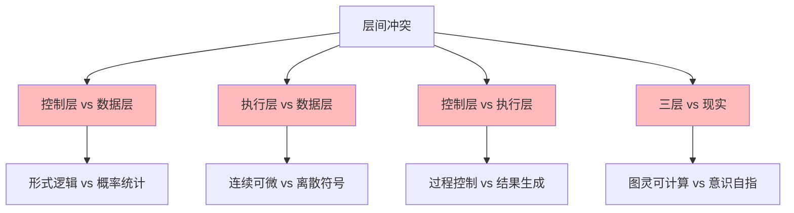
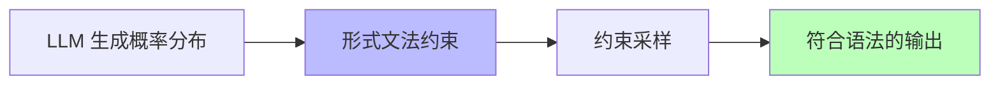
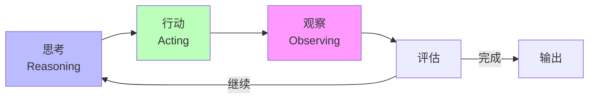
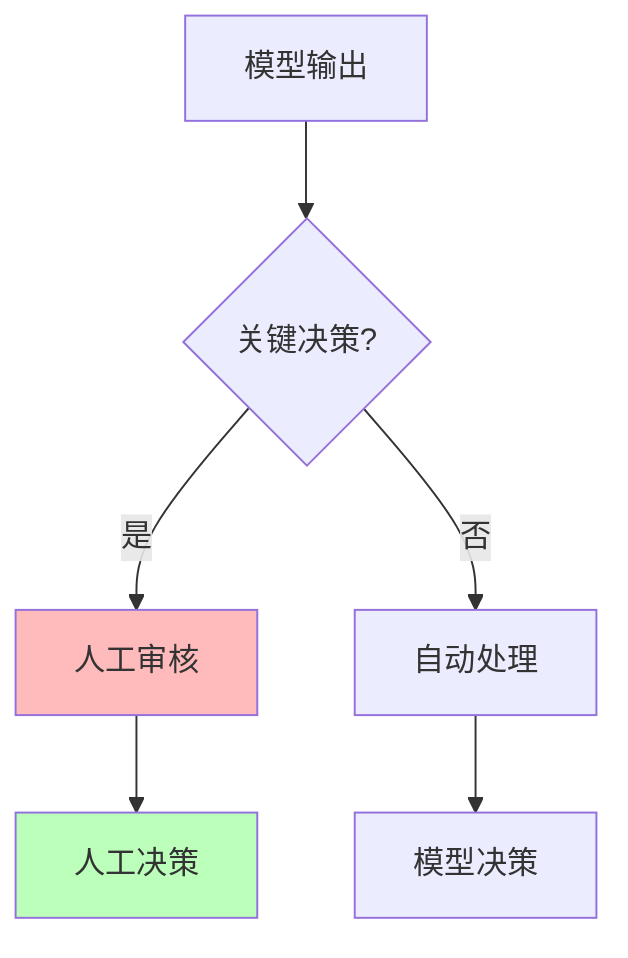

# 01.4.2-层间冲突与矛盾

## 目录

- [01.4.2-层间冲突与矛盾](#0142-层间冲突与矛盾)
  - [目录](#目录)
  - [一、概述](#一概述)
  - [二、层间冲突矩阵](#二层间冲突矩阵)
    - [2.1 冲突分类](#21-冲突分类)
    - [2.2 冲突根源](#22-冲突根源)
  - [三、控制层 vs 数据层冲突](#三控制层-vs-数据层冲突)
    - [3.1 冲突本质](#31-冲突本质)
    - [3.2 妥协方案](#32-妥协方案)
  - [四、执行层 vs 数据层冲突](#四执行层-vs-数据层冲突)
    - [4.1 冲突本质](#41-冲突本质)
    - [4.2 妥协方案](#42-妥协方案)
  - [五、控制层 vs 执行层冲突](#五控制层-vs-执行层冲突)
    - [5.1 冲突本质](#51-冲突本质)
    - [5.2 妥协方案](#52-妥协方案)
  - [六、三层 vs 现实冲突](#六三层-vs-现实冲突)
    - [6.1 冲突本质](#61-冲突本质)
    - [6.2 妥协方案](#62-妥协方案)
  - [七、冲突的工程意义](#七冲突的工程意义)
    - [7.1 冲突不可避免](#71-冲突不可避免)
    - [7.2 妥协策略](#72-妥协策略)
  - [八、与三层模型的关系](#八与三层模型的关系)
    - [8.1 冲突是三层模型的本质](#81-冲突是三层模型的本质)
    - [8.2 冲突的工程价值](#82-冲突的工程价值)
  - [九、核心结论](#九核心结论)
  - [十、相关主题](#十相关主题)
  - [十一、参考文档](#十一参考文档)

---

## 一、概述

层间冲突与矛盾是 AI 系统三层模型的核心问题，描述了执行层、控制层和数据层之间的不可调和矛盾及其妥协方案。本文档阐述层间冲突、矛盾根源及其在 AI 系统中的应用。

---

## 二、层间冲突矩阵

### 2.1 冲突分类

**层间冲突矩阵**：

| **冲突对**           | **现象**                                         | **根本矛盾**                             | **2025 妥协方案**                   |
| -------------------- | ------------------------------------------------ | ---------------------------------------- | ----------------------------------- |
| **控制层 vs 数据层** | Prompt 要求"绝对正确"，但模型输出概率性错误      | **形式逻辑的刚性** vs **概率统计的柔性** | **约束解码**（如 JSON 模式）        |
| **执行层 vs 数据层** | GPU 确定计算产生随机性幻觉                       | **连续可微** vs **离散符号**的本质差异   | **温度系数**人为引入随机性          |
| **控制层 vs 执行层** | CoT 推理链在执行层不可中断（必须生成完整）       | **过程控制** vs **结果生成**的时序错位   | **ReAct**（思考 → 行动 → 观察循环） |
| **三层 vs 现实**     | 模型无法真正"理解"停机问题（图灵完备但无元认知） | **图灵可计算** vs **意识自指**的鸿沟     | **人工+模型混合审核**               |

### 2.2 冲突根源

**冲突根源分析**：



---

## 三、控制层 vs 数据层冲突

### 3.1 冲突本质

**控制层 vs 数据层冲突**：

**核心矛盾**：**形式逻辑的刚性** vs **概率统计的柔性**

**冲突表现**：

1. **Prompt 要求"绝对正确"**：控制层要求输出符合形式约束
2. **模型输出概率性错误**：数据层输出是概率性的，可能违反约束
3. **无法概率保证 100% 语法正确**：理论上无法保证

### 3.2 妥协方案

**约束解码（Constrained Decoding）**：

**核心思想**：在采样时强制满足形式约束

**实现方法**：



**约束解码方法**：

1. **JSON Mode**：强制输出 JSON 格式
2. **Grammar Sampling**：基于 CFG 的采样
3. **Guided Generation**：引导生成符合约束

**2025 应用**：

- **Claude 3.5**：Constitutional AI 多阶段规则注入
- **OpenAI o1**：JSON Schema 约束
- **DeepSeek-R1**：约束解码确保格式正确

---

## 四、执行层 vs 数据层冲突

### 4.1 冲突本质

**执行层 vs 数据层冲突**：

**核心矛盾**：**连续可微** vs **离散符号**的本质差异

**冲突表现**：

1. **GPU 确定计算**：执行层是确定性的矩阵运算
2. **随机性幻觉**：数据层需要随机性产生多样性
3. **为何确定性计算会自发涌现随机行为？**：理论未解问题

### 4.2 妥协方案

**温度系数（Temperature）**：

**核心思想**：人为引入随机性

**温度公式**：

```text
P'(x) = P(x)^{1/T} / Σ P(x)^{1/T}
```

**温度参数**：

- **T < 1**：分布更尖锐，输出更确定
- **T = 1**：原始分布
- **T > 1**：分布更平滑，输出更多样

**2025 应用**：

- **所有 LLM**：都使用温度参数控制随机性
- **典型值**：T = 0.7-1.0（平衡确定性和多样性）

---

## 五、控制层 vs 执行层冲突

### 5.1 冲突本质

**控制层 vs 执行层冲突**：

**核心矛盾**：**过程控制** vs **结果生成**的时序错位

**冲突表现**：

1. **CoT 推理链**：控制层要求生成中间步骤
2. **执行层不可中断**：执行层必须生成完整序列
3. **无法在计算图中插入"断点"**：理论限制

### 5.2 妥协方案

**ReAct（思考 → 行动 → 观察循环）**：

**核心思想**：将单次生成拆分为多次迭代

**ReAct 循环**：



**ReAct 优势**：

1. **可中断**：每次迭代可中断
2. **可观察**：可观察中间结果
3. **可调整**：可根据观察调整策略

**2025 应用**：

- **LangGraph**：基于状态机的 ReAct 实现
- **AutoGen**：多 Agent 对话编排
- **CrewAI**：角色扮演任务分解

---

## 六、三层 vs 现实冲突

### 6.1 冲突本质

**三层 vs 现实冲突**：

**核心矛盾**：**图灵可计算** vs **意识自指**的鸿沟

**冲突表现**：

1. **图灵完备**：执行层是图灵完备的
2. **无元认知**：模型无法真正"理解"停机问题
3. **自我意识是否可计算？**：理论未解问题

### 6.2 妥协方案

**人工+模型混合审核**：

**核心思想**：关键决策由人工审核

**混合审核流程**：



**混合审核策略**：

1. **关键决策**：安全、伦理等关键决策由人工审核
2. **常规决策**：常规决策由模型自动处理
3. **阈值管理**：设定阈值，超过阈值需人工审核

**2025 应用**：

- **金融风控**：关键决策需人工审核
- **医疗诊断**：诊断结果需医生审核
- **法律咨询**：法律建议需律师审核

---

## 七、冲突的工程意义

### 7.1 冲突不可避免

**冲突不可避免**：

1. **理论根源**：三层异质性导致冲突不可避免
2. **工程现实**：冲突是工程实践的现实
3. **妥协策略**：通过妥协策略缓解冲突

### 7.2 妥协策略

**妥协策略**：

| **冲突**             | **妥协策略**      | **工程实现**                |
| -------------------- | ----------------- | --------------------------- |
| **控制层 vs 数据层** | 约束解码          | JSON Mode、Grammar Sampling |
| **执行层 vs 数据层** | 温度系数          | Temperature 参数调节        |
| **控制层 vs 执行层** | ReAct 循环        | LangGraph、AutoGen          |
| **三层 vs 现实**     | 人工+模型混合审核 | 阈值管理、人工审核          |

---

## 八、与三层模型的关系

### 8.1 冲突是三层模型的本质

**冲突是三层模型的本质**：

- **三层异质性**：执行层、控制层、数据层本质不同
- **冲突不可避免**：异质性导致冲突不可避免
- **妥协是常态**：通过妥协缓解冲突

### 8.2 冲突的工程价值

**冲突的工程价值**：

- **推动创新**：冲突推动技术创新
- **促进优化**：冲突促进系统优化
- **提升可控性**：冲突提升系统可控性

---

## 九、核心结论

1. **层间冲突是三层模型的本质**：三层异质性导致冲突不可避免
2. **控制层 vs 数据层**：形式逻辑 vs 概率统计，约束解码缓解
3. **执行层 vs 数据层**：连续可微 vs 离散符号，温度系数缓解
4. **控制层 vs 执行层**：过程控制 vs 结果生成，ReAct 循环缓解
5. **三层 vs 现实**：图灵可计算 vs 意识自指，人工+模型混合审核

---

## 十、相关主题

- [01.4.1-三层协同机制](01.4.1-三层协同机制.md)
- [01.4.3-三层契约设计模式](01.4.3-三层契约设计模式.md)
- [01.4.4-跨层优化策略](01.4.4-跨层优化策略.md)

---

## 十一、参考文档

- [工程实践核心逻辑下的 AI 三层模型全景解构](../../view/ai_engineer_view.md)
- [分层解构视角](../../view/ai_models_view.md)
