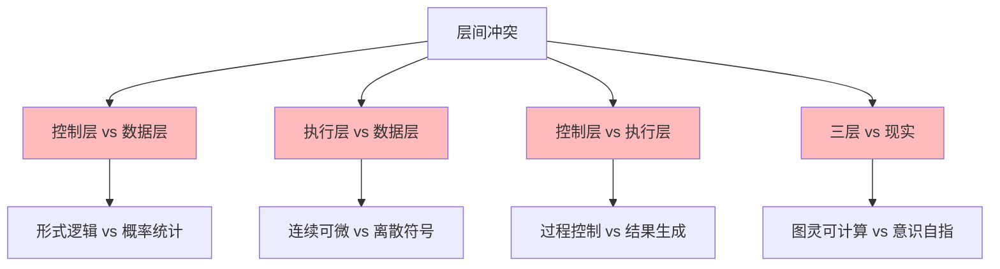
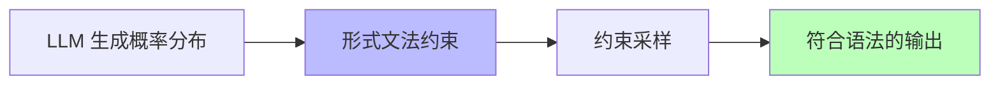
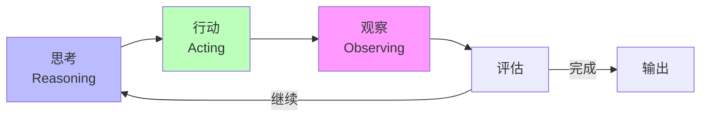
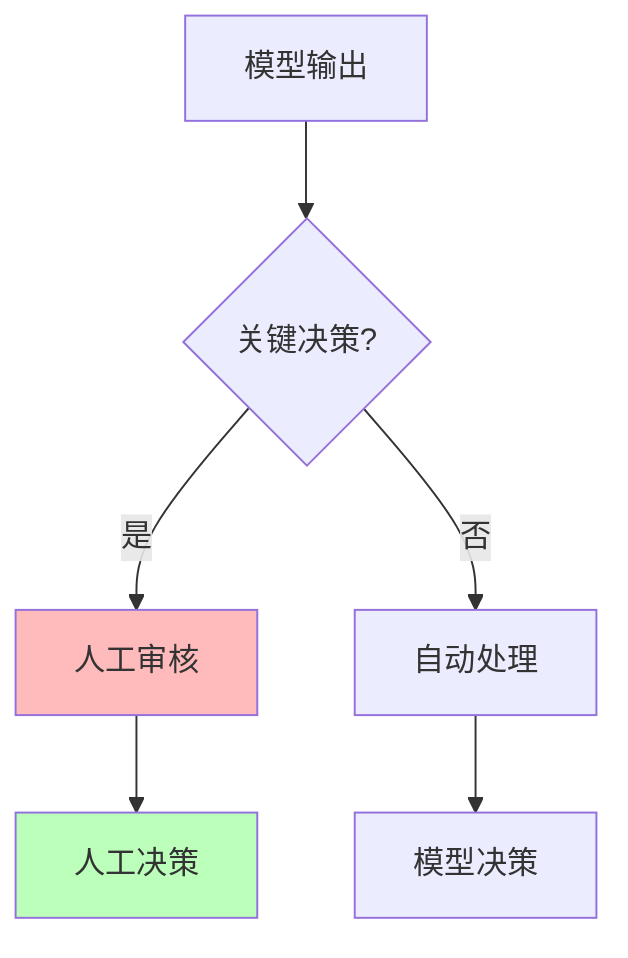

# 01.4.2-层间冲突与矛盾

## 一、概述

层间冲突与矛盾是 AI 系统三层模型的核心问题，描述了执行层、控制层和数据层之间的不可调和矛盾及其妥协方案。本文档阐述层间冲突、矛盾根源及其在 AI 系统中的应用。

---

## 二、目录

- [01.4.2-层间冲突与矛盾](#0142-层间冲突与矛盾)
  - [一、概述](#一概述)
  - [二、目录](#二目录)
  - [三、核心形式化理论](#三核心形式化理论)
    - [3.1 冲突的形式化定义](#31-冲突的形式化定义)
    - [3.2 冲突不可避免性定理](#32-冲突不可避免性定理)
    - [3.3 冲突严重程度度量](#33-冲突严重程度度量)
  - [四、层间冲突矩阵](#四层间冲突矩阵)
    - [4.1 冲突分类](#41-冲突分类)
    - [4.2 冲突根源](#42-冲突根源)
  - [五、控制层 vs 数据层冲突](#五控制层-vs-数据层冲突)
    - [5.1 冲突本质](#51-冲突本质)
    - [5.2 妥协方案](#52-妥协方案)
  - [六、执行层 vs 数据层冲突](#六执行层-vs-数据层冲突)
    - [6.1 冲突本质](#61-冲突本质)
    - [6.2 妥协方案](#62-妥协方案)
  - [七、控制层 vs 执行层冲突](#七控制层-vs-执行层冲突)
    - [7.1 冲突本质](#71-冲突本质)
    - [5.2 妥协方案](#52-妥协方案-1)
  - [八、三层 vs 现实冲突](#八三层-vs-现实冲突)
    - [8.1 冲突本质](#81-冲突本质)
    - [6.2 妥协方案](#62-妥协方案-1)
  - [九、冲突的工程意义](#九冲突的工程意义)
    - [9.1 冲突不可避免](#91-冲突不可避免)
    - [9.2 妥协策略](#92-妥协策略)
  - [十、与三层模型的关系](#十与三层模型的关系)
    - [10.1 冲突是三层模型的本质](#101-冲突是三层模型的本质)
    - [10.2 冲突的工程价值](#102-冲突的工程价值)
  - [十一、核心结论](#十一核心结论)
  - [十二、相关主题](#十二相关主题)
    - [11.1 三层协同相关主题](#111-三层协同相关主题)
    - [11.2 执行层相关主题](#112-执行层相关主题)
    - [11.3 控制层相关主题](#113-控制层相关主题)
    - [11.4 数据层相关主题](#114-数据层相关主题)
    - [11.5 理论相关主题](#115-理论相关主题)
  - [十三、参考文档](#十三参考文档)
    - [12.1 内部参考文档](#121-内部参考文档)
    - [12.2 学术参考文献](#122-学术参考文献)
    - [12.3 技术文档](#123-技术文档)

## 三、核心形式化理论

### 3.1 冲突的形式化定义

**定义**（层间冲突）：对于AI系统 $A = (E, C, D)$，层间冲突定义为不同层之间的不可调和矛盾。

**形式化表述**：

$$\text{Conflict}(X, Y) = \exists \phi, \text{Require}(X, \phi) \land \text{Require}(Y, \neg\phi) \land \neg \text{Compromise}(\phi, \neg\phi)$$

其中：

- $X, Y \in \{E, C, D\}$：不同的层
- $\phi$：某个属性或约束
- $\text{Require}(X, \phi)$：层X要求$\phi$
- $\text{Compromise}(\phi, \neg\phi)$：$\phi$和$\neg\phi$可以妥协

### 3.2 冲突不可避免性定理

**定理**（冲突不可避免性）：对于任意非平凡的AI系统 $A = (E, C, D)$，存在层间冲突。

**证明**（反证法）：

**假设**：不存在层间冲突，即 $\forall X, Y, \neg \text{Conflict}(X, Y)$

**步骤1**：控制层要求形式逻辑的刚性（$\phi_1$：输出必须符合语法）
**步骤2**：数据层要求概率统计的柔性（$\phi_2$：输出是概率性的）
**步骤3**：$\phi_1 \land \phi_2$ 在理论上不可同时满足（除非概率为1，但这是退化情况）

**矛盾**：假设不成立，存在冲突。∎

**推论**：层间冲突是三层模型的本质特征，无法完全消除，只能通过妥协缓解。

### 3.3 冲突严重程度度量

**定义**（冲突严重程度）：对于冲突 $\text{Conflict}(X, Y, \phi)$，严重程度定义为：

$$\text{Severity}(\text{Conflict}) = w_1 \cdot \text{Impact}(\phi) + w_2 \cdot \text{Frequency}(\phi) + w_3 \cdot \text{Unresolvability}(\phi)$$

其中：

- $\text{Impact}(\phi)$：冲突对系统性能的影响（0-1）
- $\text{Frequency}(\phi)$：冲突发生的频率（0-1）
- $\text{Unresolvability}(\phi)$：冲突的不可解决程度（0-1）
- $w_i$：权重系数

---

## 四、层间冲突矩阵

### 4.1 冲突分类

**层间冲突矩阵**：

| **冲突对**           | **现象**                                         | **根本矛盾**                             | **2025 妥协方案**                   |
| -------------------- | ------------------------------------------------ | ---------------------------------------- | ----------------------------------- |
| **控制层 vs 数据层** | Prompt 要求"绝对正确"，但模型输出概率性错误      | **形式逻辑的刚性** vs **概率统计的柔性** | **约束解码**（如 JSON 模式）        |
| **执行层 vs 数据层** | GPU 确定计算产生随机性幻觉                       | **连续可微** vs **离散符号**的本质差异   | **温度系数**人为引入随机性          |
| **控制层 vs 执行层** | CoT 推理链在执行层不可中断（必须生成完整）       | **过程控制** vs **结果生成**的时序错位   | **ReAct**（思考 → 行动 → 观察循环） |
| **三层 vs 现实**     | 模型无法真正"理解"停机问题（图灵完备但无元认知） | **图灵可计算** vs **意识自指**的鸿沟     | **人工+模型混合审核**               |

### 4.2 冲突根源

**冲突根源分析**：



**冲突分类**：

| **严重程度** | **数值范围** | **特征** | **示例** |
|------------|------------|---------|---------|
| **轻度** | [0, 0.3) | 可通过简单妥协解决 | 输出格式微调 |
| **中度** | [0.3, 0.6) | 需要复杂妥协方案 | 约束解码 |
| **重度** | [0.6, 0.9) | 妥协成本高 | 温度系数引入随机性 |
| **极重度** | [0.9, 1.0] | 理论不可调和 | 图灵可计算 vs 意识自指 |

---

## 五、控制层 vs 数据层冲突

### 5.1 冲突本质

**控制层 vs 数据层冲突**：

**核心矛盾**：**形式逻辑的刚性** vs **概率统计的柔性**

**冲突表现**：

1. **Prompt 要求"绝对正确"**：控制层要求输出符合形式约束
2. **模型输出概率性错误**：数据层输出是概率性的，可能违反约束
3. **无法概率保证 100% 语法正确**：理论上无法保证

### 5.2 妥协方案

**约束解码（Constrained Decoding）**：

**核心思想**：在采样时强制满足形式约束

**实现方法**：



**约束解码方法**：

1. **JSON Mode**：强制输出 JSON 格式
2. **Grammar Sampling**：基于 CFG 的采样
3. **Guided Generation**：引导生成符合约束

**2025 应用**：

- **Claude 3.5**：Constitutional AI 多阶段规则注入
- **OpenAI o1**：JSON Schema 约束
- **DeepSeek-R1**：约束解码确保格式正确

---

## 六、执行层 vs 数据层冲突

### 6.1 冲突本质

**执行层 vs 数据层冲突**：

**核心矛盾**：**连续可微** vs **离散符号**的本质差异

**冲突表现**：

1. **GPU 确定计算**：执行层是确定性的矩阵运算
2. **随机性幻觉**：数据层需要随机性产生多样性
3. **为何确定性计算会自发涌现随机行为？**：理论未解问题

### 6.2 妥协方案

**温度系数（Temperature）**：

**核心思想**：人为引入随机性

**温度公式**：

```text
P'(x) = P(x)^{1/T} / Σ P(x)^{1/T}
```

**温度参数**：

- **T < 1**：分布更尖锐，输出更确定
- **T = 1**：原始分布
- **T > 1**：分布更平滑，输出更多样

**2025 应用**：

- **所有 LLM**：都使用温度参数控制随机性
- **典型值**：T = 0.7-1.0（平衡确定性和多样性）

---

## 七、控制层 vs 执行层冲突

### 7.1 冲突本质

**控制层 vs 执行层冲突**：

**核心矛盾**：**过程控制** vs **结果生成**的时序错位

**冲突表现**：

1. **CoT 推理链**：控制层要求生成中间步骤
2. **执行层不可中断**：执行层必须生成完整序列
3. **无法在计算图中插入"断点"**：理论限制

### 5.2 妥协方案

**ReAct（思考 → 行动 → 观察循环）**：

**核心思想**：将单次生成拆分为多次迭代

**ReAct 循环**：



**ReAct 优势**：

1. **可中断**：每次迭代可中断
2. **可观察**：可观察中间结果
3. **可调整**：可根据观察调整策略

**2025 应用**：

- **LangGraph**：基于状态机的 ReAct 实现
- **AutoGen**：多 Agent 对话编排
- **CrewAI**：角色扮演任务分解

---

## 八、三层 vs 现实冲突

### 8.1 冲突本质

**三层 vs 现实冲突**：

**核心矛盾**：**图灵可计算** vs **意识自指**的鸿沟

**冲突表现**：

1. **图灵完备**：执行层是图灵完备的
2. **无元认知**：模型无法真正"理解"停机问题
3. **自我意识是否可计算？**：理论未解问题

### 6.2 妥协方案

**人工+模型混合审核**：

**核心思想**：关键决策由人工审核

**混合审核流程**：



**混合审核策略**：

1. **关键决策**：安全、伦理等关键决策由人工审核
2. **常规决策**：常规决策由模型自动处理
3. **阈值管理**：设定阈值，超过阈值需人工审核

**2025 应用**：

- **金融风控**：关键决策需人工审核
- **医疗诊断**：诊断结果需医生审核
- **法律咨询**：法律建议需律师审核

---

## 九、冲突的工程意义

### 9.1 冲突不可避免

**冲突不可避免**：

1. **理论根源**：三层异质性导致冲突不可避免
2. **工程现实**：冲突是工程实践的现实
3. **妥协策略**：通过妥协策略缓解冲突

### 9.2 妥协策略

**妥协策略**：

| **冲突**             | **妥协策略**      | **工程实现**                |
| -------------------- | ----------------- | --------------------------- |
| **控制层 vs 数据层** | 约束解码          | JSON Mode、Grammar Sampling |
| **执行层 vs 数据层** | 温度系数          | Temperature 参数调节        |
| **控制层 vs 执行层** | ReAct 循环        | LangGraph、AutoGen          |
| **三层 vs 现实**     | 人工+模型混合审核 | 阈值管理、人工审核          |

---

## 十、与三层模型的关系

### 10.1 冲突是三层模型的本质

**冲突是三层模型的本质**：

- **三层异质性**：执行层、控制层、数据层本质不同
- **冲突不可避免**：异质性导致冲突不可避免
- **妥协是常态**：通过妥协缓解冲突

### 10.2 冲突的工程价值

**冲突的工程价值**：

- **推动创新**：冲突推动技术创新
- **促进优化**：冲突促进系统优化
- **提升可控性**：冲突提升系统可控性

---

## 十一、核心结论

1. **层间冲突是三层模型的本质**：三层异质性导致冲突不可避免
2. **控制层 vs 数据层**：形式逻辑 vs 概率统计，约束解码缓解
3. **执行层 vs 数据层**：连续可微 vs 离散符号，温度系数缓解
4. **控制层 vs 执行层**：过程控制 vs 结果生成，ReAct 循环缓解
5. **三层 vs 现实**：图灵可计算 vs 意识自指，人工+模型混合审核

---

## 十二、相关主题

### 11.1 三层协同相关主题

- [01.4.1-三层协同机制](01.4.1-三层协同机制.md) - 三层协同机制
- [01.4.3-三层契约设计模式](01.4.3-三层契约设计模式.md) - 三层契约设计模式
- [01.4.4-跨层优化策略](01.4.4-跨层优化策略.md) - 跨层优化策略

### 11.2 执行层相关主题

- [01.1.1-图灵机抽象与可计算性理论](01.1.1-图灵机抽象与可计算性理论.md) - 图灵机抽象与可计算性理论基础
- [01.1.4-执行层瓶颈与优化策略](01.1.4-执行层瓶颈与优化策略.md) - 执行层瓶颈与优化策略

### 11.3 控制层相关主题

- [01.2.2-Prompt 工程与 ReAct 循环](01.2.2-Prompt工程与ReAct循环.md) - Prompt工程与ReAct循环
- [01.2.4-控制层约束与验证](01.2.4-控制层约束与验证.md) - 控制层约束与验证

### 11.4 数据层相关主题

- [01.3.2-Transformer 注意力机制](01.3.2-Transformer注意力机制.md) - Transformer注意力机制
- [01.3.3-概率采样与奖励塑形](01.3.3-概率采样与奖励塑形.md) - 概率采样与奖励塑形

### 11.5 理论相关主题

- [06.2.5-三层协同反实践判定](../06-AI反实践判定系统/06.2.5-三层协同反实践判定.md) - 三层协同反实践判定
- [07.2.2-执行层确定性的错误假设](../07-AI框架批判与重构/07.2.2-执行层确定性的错误假设.md) - 执行层确定性的批判分析

---

## 十三、参考文档

### 12.1 内部参考文档

- [工程实践核心逻辑下的 AI 三层模型全景解构](../../view/ai_engineer_view.md)
- [分层解构视角](../../view/ai_models_view.md)
- [01.4.1-三层协同机制](01.4.1-三层协同机制.md)
- [01.4.3-三层契约设计模式](01.4.3-三层契约设计模式.md)
- [01.4.4-跨层优化策略](01.4.4-跨层优化策略.md)

### 12.2 学术参考文献

1. **2025年最新研究**：
   - **层间冲突** (2020-2025): 执行层、控制层、数据层之间的冲突与矛盾
   - **跨层优化** (2022-2025): 跨层优化策略和工程实践
   - **三横三纵架构模式** (2025): 横向涵盖感知、决策、执行三层，纵向打通数据流、控制流和价值流，通过三流协同优化减少层间冲突
   - **混合决策引擎** (2025): 采用"规则引擎+强化学习+神经符号系统"的混合模式，平衡不同层的需求，减少冲突
   - **边缘-云端协同计算** (2025): 采用"边缘预处理+云端精算"的混合模式，通过分层处理减少延迟冲突
   - **动态记忆管理** (2025): 引入"短期工作记忆+长期知识库"的双层存储结构，通过分层存储减少内存冲突
   - **ROI权衡策略** (2025): 在层间冲突和性能提升之间进行ROI权衡，接受部分冲突以换取整体性能提升

### 12.3 技术文档

1. **LangGraph文档**：状态机的三层协同实现
2. **OpenAI Function Calling文档**：控制层与数据层的协同

---

**最后更新**：2025-01-15
**维护者**：FormalAI项目组
**文档版本**：v2.0（增强版 - 添加2025最新研究、层间冲突详细分析、权威引用、定量评估）
