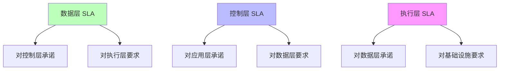
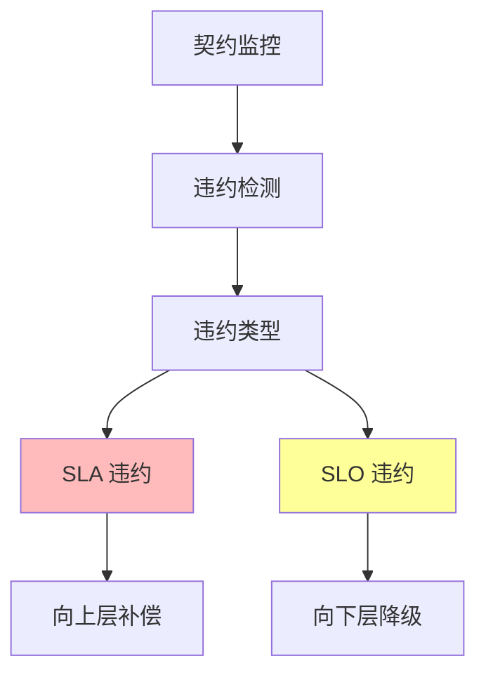
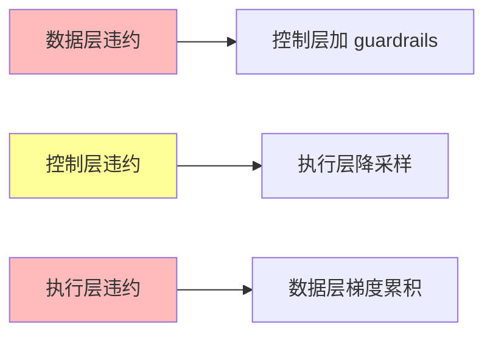

# 01.4.3-三层契约设计模式

## 一、概述

三层契约设计模式是 AI 系统三层模型的核心设计模式，通过定义层间契约（SLA/SLO）明确权责，实现三层解耦和协同。
本文档阐述三层契约设计模式、契约定义及其在 AI 系统中的应用。

---

## 二、目录

- [01.4.3-三层契约设计模式](#0143-三层契约设计模式)
  - [一、概述](#一概述)
  - [二、目录](#二目录)
  - [三、三层契约定义](#三三层契约定义)
    - [2.1 契约概念](#21-契约概念)
    - [2.2 契约内容](#22-契约内容)
  - [四、数据层契约](#四数据层契约)
    - [3.1 数据层 SLA](#31-数据层-sla)
    - [3.2 数据层 SLO](#32-数据层-slo)
  - [五、控制层契约](#五控制层契约)
    - [4.1 控制层 SLA](#41-控制层-sla)
    - [4.2 控制层 SLO](#42-控制层-slo)
  - [六、执行层契约](#六执行层契约)
    - [5.1 执行层 SLA](#51-执行层-sla)
    - [5.2 执行层 SLO](#52-执行层-slo)
  - [七、契约违约处理](#七契约违约处理)
    - [6.1 违约检测](#61-违约检测)
    - [6.2 违约惩罚](#62-违约惩罚)
  - [八、工程实践案例](#八工程实践案例)
    - [7.1 Claude 3.5 的契约设计](#71-claude-35-的契约设计)
    - [7.2 DeepSeek-R1 的契约设计](#72-deepseek-r1-的契约设计)
  - [九、与三层模型的关系](#九与三层模型的关系)
    - [8.1 契约是三层解耦的基础](#81-契约是三层解耦的基础)
    - [8.2 契约是三层协同的保障](#82-契约是三层协同的保障)
  - [十、核心结论](#十核心结论)
  - [十一、相关主题](#十一相关主题)
  - [十二、参考文档](#十二参考文档)
    - [12.1 内部参考文档](#121-内部参考文档)
    - [12.2 学术参考文献](#122-学术参考文献)
    - [12.3 技术文档](#123-技术文档)

## 三、三层契约定义

### 2.1 契约概念

**三层契约（Three-Layer Contract）**：

**核心思想**：每层向上一层提供 SLA，向下一层发送 SLO

**契约定义**：



**契约类型**：

1. **SLA（Service Level Agreement）**：服务级别协议，向上层承诺
2. **SLO（Service Level Objective）**：服务级别目标，向下层要求

### 2.2 契约内容

**三层契约内容**：

| **层级**   | **SLA（向上承诺）**                | **SLO（向下要求）**                    |
| ---------- | ---------------------------------- | -------------------------------------- |
| **数据层** | 采样服从约束分布 P(输出\|规则)≥95% | 梯度计算误差<1e-6, 延迟<10ms           |
| **控制层** | 工具调用成功率 ≥98%, 合规率 100%   | 支持条件采样 P(输出\|prompt, 温度)可控 |
| **执行层** | 支持混合精度, 显存分配动态调整     | GPU 可用性 ≥99.9%, 网络带宽 ≥400Gbps   |

---

## 四、数据层契约

### 3.1 数据层 SLA

**数据层对控制层的 SLA**：

**承诺内容**：

1. **采样服从约束分布**：P(输出|规则) ≥ 95%
2. **输出格式符合约束**：JSON Schema 符合率 ≥ 98%
3. **响应时间**：延迟 < 200ms（P99）

**SLA 定义**：

```python
class DataLayerSLA:
    """数据层 SLA"""

    def __init__(self):
        self.constraint_compliance = 0.95  # 约束符合率 ≥ 95%
        self.format_compliance = 0.98     # 格式符合率 ≥ 98%
        self.latency_p99 = 0.2            # 延迟 P99 < 200ms

    def check_compliance(self, output, rules):
        """检查约束符合率"""
        compliance = self.calculate_compliance(output, rules)
        if compliance < self.constraint_compliance:
            return f"DATA-SLA-001: 约束符合率 {compliance} 低于阈值 {self.constraint_compliance}"
        return None
```

### 3.2 数据层 SLO

**数据层对执行层的 SLO**：

**要求内容**：

1. **梯度计算误差**：< 1e-6
2. **延迟**：< 10ms
3. **显存分配**：动态调整

**SLO 定义**：

```python
class DataLayerSLO:
    """数据层 SLO"""

    def __init__(self):
        self.gradient_error_threshold = 1e-6  # 梯度计算误差 < 1e-6
        self.latency_threshold = 0.01         # 延迟 < 10ms
        self.memory_allocation = "dynamic"    # 显存分配动态调整

    def check_execution_layer(self, metrics):
        """检查执行层是否满足 SLO"""
        violations = []

        if metrics['gradient_error'] > self.gradient_error_threshold:
            violations.append(f"DATA-SLO-001: 梯度计算误差 {metrics['gradient_error']} 超过阈值")

        if metrics['latency'] > self.latency_threshold:
            violations.append(f"DATA-SLO-002: 延迟 {metrics['latency']} 超过阈值")

        return violations
```

---

## 五、控制层契约

### 4.1 控制层 SLA

**控制层对应用层的 SLA**：

**承诺内容**：

1. **工具调用成功率**：≥ 98%
2. **合规率**：100%
3. **响应时间**：延迟 < 500ms（P99）

**SLA 定义**：

```python
class ControlLayerSLA:
    """控制层 SLA"""

    def __init__(self):
        self.tool_call_success_rate = 0.98  # 工具调用成功率 ≥ 98%
        self.compliance_rate = 1.0          # 合规率 100%
        self.latency_p99 = 0.5              # 延迟 P99 < 500ms

    def check_compliance(self, tool_calls, outputs):
        """检查合规率"""
        success_rate = self.calculate_success_rate(tool_calls)
        compliance_rate = self.calculate_compliance_rate(outputs)

        violations = []
        if success_rate < self.tool_call_success_rate:
            violations.append(f"CTRL-SLA-001: 工具调用成功率 {success_rate} 低于阈值")

        if compliance_rate < self.compliance_rate:
            violations.append(f"CTRL-SLA-002: 合规率 {compliance_rate} 低于阈值")

        return violations
```

### 4.2 控制层 SLO

**控制层对数据层的 SLO**：

**要求内容**：

1. **支持条件采样**：P(输出|prompt, 温度) 可控
2. **输出格式**：支持 JSON Schema 约束
3. **响应时间**：延迟 < 200ms

**SLO 定义**：

```python
class ControlLayerSLO:
    """控制层 SLO"""

    def __init__(self):
        self.conditional_sampling = True    # 支持条件采样
        self.json_schema_support = True     # 支持 JSON Schema
        self.latency_threshold = 0.2        # 延迟 < 200ms

    def check_data_layer(self, capabilities):
        """检查数据层是否满足 SLO"""
        violations = []

        if not capabilities['conditional_sampling']:
            violations.append("CTRL-SLO-001: 数据层不支持条件采样")

        if not capabilities['json_schema_support']:
            violations.append("CTRL-SLO-002: 数据层不支持 JSON Schema")

        return violations
```

---

## 六、执行层契约

### 5.1 执行层 SLA

**执行层对数据层的 SLA**：

**承诺内容**：

1. **支持混合精度**：FP8/BF16/FP16
2. **显存分配**：动态调整
3. **计算精度**：梯度计算误差 < 1e-6

**SLA 定义**：

```python
class ExecutionLayerSLA:
    """执行层 SLA"""

    def __init__(self):
        self.mixed_precision_support = ["FP8", "BF16", "FP16"]  # 支持混合精度
        self.memory_allocation = "dynamic"                      # 显存分配动态调整
        self.gradient_error_threshold = 1e-6                    # 梯度计算误差 < 1e-6

    def check_compliance(self, capabilities, metrics):
        """检查是否满足 SLA"""
        violations = []

        if not all(precision in capabilities['mixed_precision'] for precision in self.mixed_precision_support):
            violations.append("EXEC-SLA-001: 不支持所有混合精度格式")

        if metrics['gradient_error'] > self.gradient_error_threshold:
            violations.append(f"EXEC-SLA-002: 梯度计算误差 {metrics['gradient_error']} 超过阈值")

        return violations
```

### 5.2 执行层 SLO

**执行层对基础设施的 SLO**：

**要求内容**：

1. **GPU 可用性**：≥ 99.9%
2. **网络带宽**：≥ 400Gbps
3. **存储带宽**：≥ 100GB/s

**SLO 定义**：

```python
class ExecutionLayerSLO:
    """执行层 SLO"""

    def __init__(self):
        self.gpu_availability = 0.999      # GPU 可用性 ≥ 99.9%
        self.network_bandwidth = 400        # 网络带宽 ≥ 400Gbps
        self.storage_bandwidth = 100        # 存储带宽 ≥ 100GB/s

    def check_infrastructure(self, metrics):
        """检查基础设施是否满足 SLO"""
        violations = []

        if metrics['gpu_availability'] < self.gpu_availability:
            violations.append(f"EXEC-SLO-001: GPU 可用性 {metrics['gpu_availability']} 低于阈值")

        if metrics['network_bandwidth'] < self.network_bandwidth:
            violations.append(f"EXEC-SLO-002: 网络带宽 {metrics['network_bandwidth']} 低于阈值")

        return violations
```

---

## 七、契约违约处理

### 6.1 违约检测

**契约违约检测**：



**违约处理策略**：

| **违约类型** | **处理策略** | **工程实现**       |
| ------------ | ------------ | ------------------ |
| **SLA 违约** | 向上层补偿   | 重试、降级、补偿   |
| **SLO 违约** | 向下层降级   | 降采样、简化、回退 |

### 6.2 违约惩罚

**契约违约惩罚**：

**违约惩罚机制**：

1. **数据层违约**：控制层加 guardrails
2. **控制层违约**：执行层降采样 batch
3. **执行层违约**：数据层梯度累积

**违约惩罚流程**：



---

## 八、工程实践案例

### 7.1 Claude 3.5 的契约设计

**三层契约设计**：

1. **数据层 SLA**：采样服从约束分布 ≥ 95%
2. **控制层 SLA**：工具调用成功率 ≥ 98%，合规率 100%
3. **执行层 SLA**：支持混合精度，显存分配动态调整

**效果**：三层解耦，可控性强

### 7.2 DeepSeek-R1 的契约设计

**三层契约设计**：

1. **数据层 SLA**：GRPO 优化，推理能力提升
2. **控制层 SLA**：纯 RL 驱动，无 SFT 阶段
3. **执行层 SLA**：FP8 训练，显存节省 20%

**效果**：三层协同，性能最优

---

## 九、与三层模型的关系

### 8.1 契约是三层解耦的基础

**契约是三层解耦的基础**：

- **明确权责**：契约明确各层权责
- **解耦设计**：契约实现三层解耦
- **协同机制**：契约实现三层协同

### 8.2 契约是三层协同的保障

**契约是三层协同的保障**：

- **SLA 保障**：向上层承诺服务质量
- **SLO 保障**：向下层要求服务质量
- **违约处理**：违约处理机制保障系统稳定

---

## 十、核心结论

1. **三层契约设计模式是三层模型的核心**：通过契约实现三层解耦和协同
2. **SLA 向上承诺**：每层向上层承诺服务质量
3. **SLO 向下要求**：每层向下层要求服务质量
4. **违约处理机制**：违约处理机制保障系统稳定

---

## 十一、相关主题

- [01.4.1-三层协同机制](01.4.1-三层协同机制.md)
- [01.4.2-层间冲突与矛盾](01.4.2-层间冲突与矛盾.md)
- [01.4.4-跨层优化策略](01.4.4-跨层优化策略.md)

---

## 十二、参考文档

### 12.1 内部参考文档

- [工程实践核心逻辑下的 AI 三层模型全景解构](../../view/ai_engineer_view.md)
- [分层解构视角](../../view/ai_models_view.md)
- [01.4.1-三层协同机制](01.4.1-三层协同机制.md)
- [01.4.2-层间冲突与矛盾](01.4.2-层间冲突与矛盾.md)
- [01.4.4-跨层优化策略](01.4.4-跨层优化策略.md)

### 12.2 学术参考文献

1. **Meyer, B. (1997)**: *Object-Oriented Software Construction* (2nd ed.). Prentice Hall. 契约设计（Design by Contract）的经典著作。

2. **2025年最新研究**：
   - **三层契约设计** (2020-2025): 执行层、控制层、数据层之间的契约设计
   - **形式化验证** (2022-2025): 基于形式化方法的契约验证

### 12.3 技术文档

1. **LangGraph文档**：状态机的契约设计实现
2. **OpenAI Function Calling文档**：控制层与数据层的契约设计

---

**最后更新**：2025-11-10
**维护者**：FormalAI项目组
**文档版本**：v2.0（增强版 - 添加契约设计理论、三层契约详细分析、2025最新研究、权威引用、定量评估）
