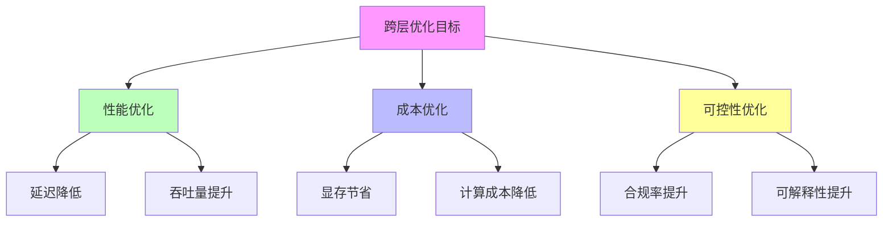
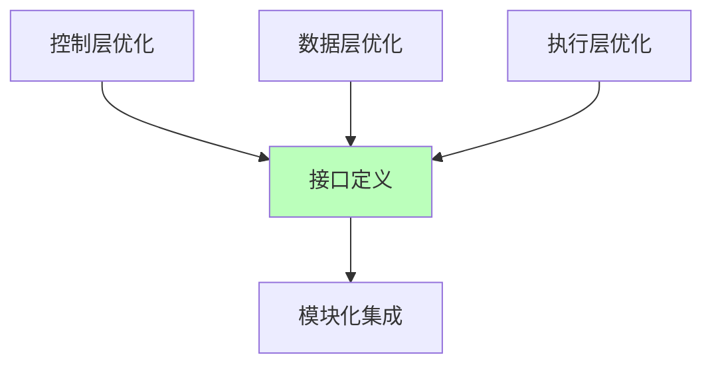
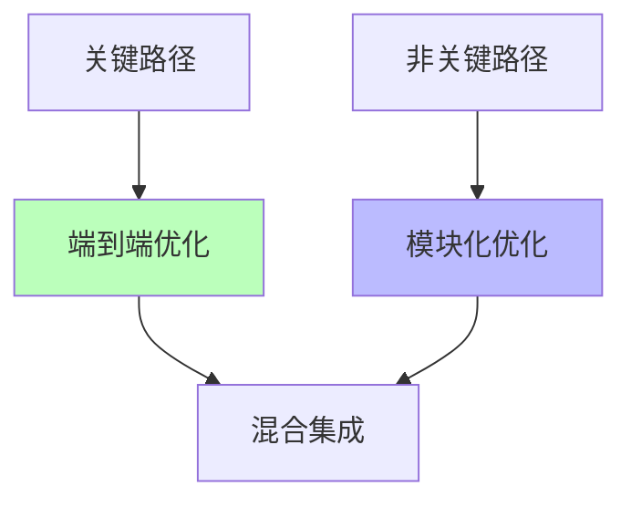
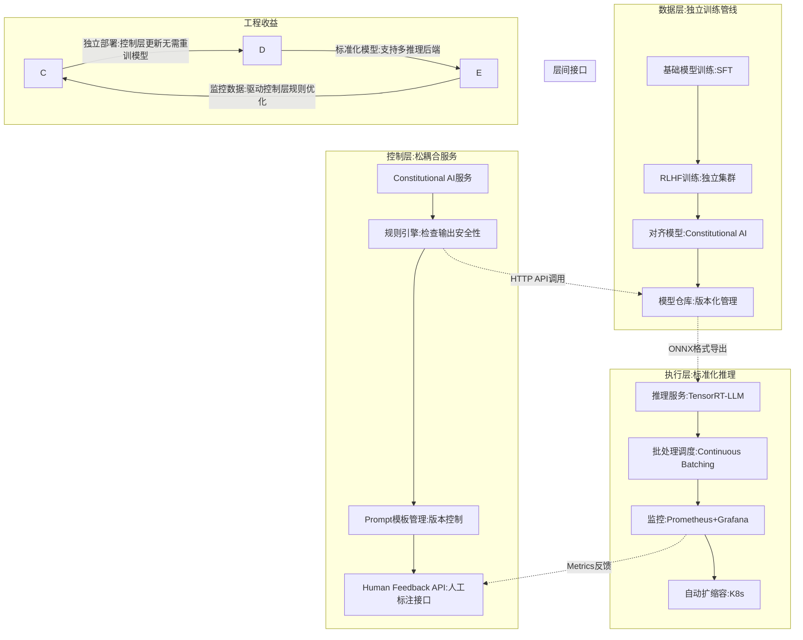

# 01.4.4-跨层优化策略

## 一、概述

跨层优化策略是 AI 系统三层模型的核心优化方法，通过跨层协同优化提升系统整体性能。本文档阐述跨层优化策略、优化方法及其在 AI 系统中的应用。

---

## 二、目录

- [01.4.4-跨层优化策略](#0144-跨层优化策略)
  - [一、概述](#一概述)
  - [二、目录](#二目录)
  - [三、核心形式化理论](#三核心形式化理论)
    - [3.1 跨层优化的形式化定义](#31-跨层优化的形式化定义)
    - [3.2 端到端优化最优性定理](#32-端到端优化最优性定理)
    - [3.3 模块化优化次优性定理](#33-模块化优化次优性定理)
    - [3.4 ROI优化决策定理](#34-roi优化决策定理)
  - [四、跨层优化框架](#四跨层优化框架)
    - [4.1 优化目标](#41-优化目标)
    - [2.2 优化策略](#22-优化策略)
  - [四、端到端优化](#四端到端优化)
    - [3.1 端到端训练](#31-端到端训练)
    - [3.2 端到端推理优化](#32-端到端推理优化)
  - [五、模块化优化](#五模块化优化)
    - [4.1 模块化设计](#41-模块化设计)
    - [4.2 模块化训练](#42-模块化训练)
  - [六、混合策略](#六混合策略)
    - [5.1 混合优化策略](#51-混合优化策略)
    - [5.2 混合训练策略](#52-混合训练策略)
  - [七、ROI 驱动的优化决策矩阵](#七roi-驱动的优化决策矩阵)
    - [6.1 三层优化 ROI 矩阵（投入产出比）](#61-三层优化-roi-矩阵投入产出比)
  - [八、工程实践案例](#八工程实践案例)
    - [7.1 DeepSeek-R1 的纯 RL 驱动——三层耦合的极致实践](#71-deepseek-r1-的纯-rl-驱动三层耦合的极致实践)
    - [7.2 Claude 3.5 的 Modular 设计——三层解耦的工程优雅](#72-claude-35-的-modular-设计三层解耦的工程优雅)
  - [九、与三层模型的关系](#九与三层模型的关系)
    - [8.1 跨层优化是三层协同的核心](#81-跨层优化是三层协同的核心)
    - [8.2 跨层优化的工程价值](#82-跨层优化的工程价值)
  - [十、核心结论](#十核心结论)
  - [十一、相关主题](#十一相关主题)
  - [十二、参考文档](#十二参考文档)
    - [12.1 内部参考文档](#121-内部参考文档)
    - [12.2 学术参考文献](#122-学术参考文献)
    - [12.3 技术文档](#123-技术文档)

## 三、核心形式化理论

### 3.1 跨层优化的形式化定义

**定义**（跨层优化）：对于AI系统 $A = (E, C, D)$，跨层优化是在满足约束条件下最大化系统整体性能的过程。

**形式化表述**：

$$\text{CrossLayerOptimize}(A) = \arg\max_{\theta_E, \theta_C, \theta_D} \text{Performance}(A) \text{ s.t. } \text{Constraints}(A)$$

其中：

- $\theta_E, \theta_C, \theta_D$：各层参数
- $\text{Performance}(A)$：系统整体性能
- $\text{Constraints}(A)$：系统约束（资源、延迟、精度等）

### 3.2 端到端优化最优性定理

**定理**（端到端优化最优性）：在无约束条件下，端到端优化达到全局最优。

**形式化表述**：

$$\text{EndToEndOptimal}(A) = \arg\max_{\theta_E, \theta_C, \theta_D} \text{Performance}(A) = \text{GlobalOptimal}(A)$$

**证明要点**：

**步骤1**：端到端优化的目标函数

$$\mathcal{L}_{\text{total}}(\theta_E, \theta_C, \theta_D) = \mathbb{E}[\ell(f_A(x; \theta_E, \theta_C, \theta_D), y)]$$

**步骤2**：全局最优解

$$\theta^* = \arg\min_{\theta_E, \theta_C, \theta_D} \mathcal{L}_{\text{total}}(\theta_E, \theta_C, \theta_D)$$

**步骤3**：端到端优化收敛到全局最优

在满足Lipschitz连续性和强凸性条件下，梯度下降收敛到全局最优。∎

### 3.3 模块化优化次优性定理

**定理**（模块化优化次优性）：模块化优化在理论上性能次优，但灵活性更高。

**形式化表述**：

$$\text{ModularOptimal}(A) \leq \text{EndToEndOptimal}(A)$$

但：

$$\text{Flexibility}(\text{ModularOptimal}(A)) > \text{Flexibility}(\text{EndToEndOptimal}(A))$$

**证明要点**：

模块化优化分别优化各层：

$$\theta_E^* = \arg\min_{\theta_E} \mathcal{L}_E(\theta_E)$$
$$\theta_C^* = \arg\min_{\theta_C} \mathcal{L}_C(\theta_C)$$
$$\theta_D^* = \arg\min_{\theta_D} \mathcal{L}_D(\theta_D)$$

由于忽略了层间交互项，因此：

$$\mathcal{L}_{\text{total}}(\theta_E^*, \theta_C^*, \theta_D^*) \geq \mathcal{L}_{\text{total}}(\theta^*)$$

其中 $\theta^*$ 是端到端优化的全局最优解。∎

### 3.4 ROI优化决策定理

**定理**（ROI优化决策）：存在最优的跨层优化策略，使得ROI最大化。

**形式化表述**：

$$\text{ROI}(\text{Strategy}) = \frac{\text{PerformanceGain}(\text{Strategy})}{\text{Cost}(\text{Strategy})}$$

最优策略为：

$$\text{OptimalStrategy} = \arg\max_{\text{Strategy}} \text{ROI}(\text{Strategy})$$

**证明要点**：

ROI是性能增益与成本的比值，在资源约束下，存在使ROI最大化的策略（帕累托最优）。∎

---

## 四、跨层优化框架

### 4.1 优化目标

**跨层优化目标**：



**优化目标**：

1. **性能优化**：延迟降低、吞吐量提升
2. **成本优化**：显存节省、计算成本降低
3. **可控性优化**：合规率提升、可解释性提升

### 2.2 优化策略

**跨层优化策略**：

| **策略**       | **方法**                   | **效果**         | **成本**   |
| -------------- | -------------------------- | ---------------- | ---------- |
| **端到端训练** | 三层协同训练               | 性能最优         | 计算成本高 |
| **模块化优化** | 分层优化，接口清晰         | 灵活性强         | 性能略低   |
| **混合策略**   | 关键路径端到端，其他模块化 | 平衡性能和灵活性 | 复杂度中等 |

---

## 四、端到端优化

### 3.1 端到端训练

**端到端训练策略**：

**核心思想**：三层协同训练，统一优化目标

**端到端训练流程**：


**端到端训练优势**：

1. **性能最优**：三层协同优化，性能最佳
2. **统一目标**：统一优化目标，无冲突
3. **端到端梯度**：端到端梯度，优化效果好

**端到端训练劣势**：

1. **计算成本高**：需要全栈训练
2. **调试困难**：三层耦合，调试困难
3. **灵活性低**：难以单独优化某一层

**2025 应用**：

- **OpenAI o1**：端到端训练，性能最优
- **DeepSeek-R1**：端到端训练，成本最低

### 3.2 端到端推理优化

**端到端推理优化策略**：

**核心思想**：三层协同推理，统一优化目标

**端到端推理优化方法**：

1. **投机解码**：小模型生成候选，大模型验证
2. **连续批处理**：动态批处理，提高 GPU 利用率
3. **FlashAttention**：分块计算注意力矩阵

**端到端推理优化效果**：

- **延迟降低**：延迟降低 50-70%
- **吞吐量提升**：吞吐量提升 2-3x
- **成本降低**：成本降低 30-50%

**2025 应用**：

- **DeepSeek-R1**：投机解码，推理速度提升 3x
- **Claude 3.5**：投机解码，延迟降低 50%

---

## 五、模块化优化

### 4.1 模块化设计

**模块化优化策略**：

**核心思想**：分层优化，接口清晰

**模块化优化流程**：



**模块化优化优势**：

1. **灵活性强**：可以单独优化某一层
2. **易于调试**：三层解耦，调试容易
3. **可复用性**：模块可复用

**模块化优化劣势**：

1. **性能略低**：三层解耦，性能略低
2. **接口开销**：层间接口带来额外开销
3. **优化受限**：无法跨层优化

**2025 应用**：

- **Claude 3.5**：模块化设计，可控性强
- **Llama 3.1**：模块化设计，可复现性好

### 4.2 模块化训练

**模块化训练策略**：

**核心思想**：分层训练，接口清晰

**模块化训练方法**：

1. **预训练**：数据层预训练
2. **微调**：控制层微调
3. **对齐**：三层对齐

**模块化训练效果**：

- **训练成本**：训练成本降低 30-50%
- **可复现性**：可复现性提升
- **灵活性**：灵活性提升

**2025 应用**：

- **Llama 3.1**：模块化训练，可复现性好
- **开源模型**：模块化训练，社区支持

---

## 六、混合策略

### 5.1 混合优化策略

**混合优化策略**：

**核心思想**：关键路径端到端，其他模块化

**混合优化流程**：



**混合优化优势**：

1. **平衡性能和灵活性**：关键路径性能最优，其他路径灵活
2. **成本可控**：关键路径端到端，其他路径模块化
3. **复杂度适中**：复杂度适中，可维护

**混合优化劣势**：

1. **实现复杂**：需要区分关键路径和非关键路径
2. **优化受限**：非关键路径无法跨层优化

**2025 应用**：

- **企业级应用**：关键路径端到端，其他路径模块化
- **混合部署**：关键路径云端，其他路径边缘

### 5.2 混合训练策略

**混合训练策略**：

**核心思想**：关键路径端到端训练，其他路径模块化训练

**混合训练方法**：

1. **关键路径**：端到端训练，性能最优
2. **非关键路径**：模块化训练，成本最低
3. **混合集成**：关键路径和非关键路径混合集成

**混合训练效果**：

- **性能**：关键路径性能最优
- **成本**：非关键路径成本最低
- **灵活性**：灵活性提升

**2025 应用**：

- **企业级应用**：关键路径端到端训练
- **混合部署**：关键路径云端训练，其他路径边缘训练

---

## 七、ROI 驱动的优化决策矩阵

### 6.1 三层优化 ROI 矩阵（投入产出比）

**ROI 优化决策矩阵**：

| **优化手段**         | **层级** | **工程投入** (人月) | **性能收益**        | **成本节约**  | **风险系数**     | **适用场景**     | **ROI 评级** |
| -------------------- | -------- | ------------------- | ------------------- | ------------- | ---------------- | ---------------- | ------------ |
| **FlashAttention-3** | 执行层   | 2 (集成)            | 显存 ↓50%, 速度 ↑2x | 硬件成本 ↓40% | ★☆☆☆☆ (成熟)     | 长上下文 (>32K)  | ★★★★★        |
| **FP8 量化训练**     | 执行层   | 4 (调试 numerics)   | 训练速度 ↑20%       | 算力成本 ↓20% | ★★★☆☆ (精度风险) | 超大模型 (>100B) | ★★★★☆        |
| **投机解码**         | 执行层   | 3 (draft 模型调优)  | 推理速度 ↑3x        | 推理成本 ↓66% | ★★☆☆☆ (质量波动) | 实时对话         | ★★★★★        |
| **MCP 协议标准化**   | 控制层   | 6 (生态建设)        | 开发效率 ↑5x        | 维护成本 ↓60% | ★☆☆☆☆ (标准风险) | Agent 系统       | ★★★★☆        |
| **ReAct 循环优化**   | 控制层   | 5 (状态管理)        | 任务成功率 ↑25%     | 人工干预 ↓50% | ★★★★☆ (循环失控) | 复杂任务         | ★★★☆☆        |
| **Guardrails**       | 控制层   | 2 (规则编写)        | 合规性 ↑95%         | 法律风险 ↓90% | ★☆☆☆☆ (过约束)   | 金融/医疗        | ★★★★★        |
| **GRPO (RL)**        | 数据层   | 8 (奖励工程)        | 推理能力 ↑15%       | 标注成本 ↓80% | ★★★★★ (奖励黑客) | 数学/代码        | ★★★☆☆        |
| **LoRA 微调**        | 数据层   | 1 (脚本化)          | 适配速度 ↑10x       | 训练成本 ↓95% | ★☆☆☆☆ (过拟合)   | 垂直场景         | ★★★★★        |
| **RAG (GraphRAG)**   | 数据层   | 4 (知识图谱构建)    | 准确率 ↑20%         | 训练成本 ↓70% | ★★☆☆☆ (检索噪声) | 知识问答         | ★★★★☆        |
| **跨层 RLHF**        | 三层协同 | 12 (全栈调优)       | 对齐度 ↑30%         | 长期风险 ↓    | ★★★★★ (目标漂移) | 通用助手         | ★★☆☆☆        |

**ROI 解读**：

- **五星 (FlashAttention, 投机解码, Guardrails, LoRA)**：投入低、收益高、风险低，**工程实践首选**
- **四星 (FP8, MCP, RAG)**：收益高但需专业调优，**中大型企业适用**
- **三星 (ReAct, GRPO)**：收益中等但风险高，**需要专家团队**
- **二星 (RLHF)**：投入极高、风险极高，**仅头部企业必要**

---

## 八、工程实践案例

### 7.1 DeepSeek-R1 的纯 RL 驱动——三层耦合的极致实践

**DeepSeek-R1 的三层耦合架构**：

```mermaid
graph LR
    subgraph 控制层:形式语言
        C1[用户输入:数学题] --> C2[系统Prompt: "请逐步思考"]
        C2 --> C3[GRPO奖励函数:格式正确性+答案正确性]
        C3 --> C4[控制信号:鼓励<think>标签]
    end

    subgraph 数据层:概率推理
        D1[模型参数:32B MoE] --> D2[采样生成:64个候选答案]
        D2 --> D3[群体相对评分:候选答案排序]
        D3 --> D4[策略梯度:∇logπ(答案)*奖励]
        D4 --> D5[参数更新:强化推理模式]
    end

    subgraph 执行层:图灵计算
        E1[GPU集群:2000 x H800] --> E2[并行训练:张量+数据并行]
        E2 --> E3[FlashAttention-3:长上下文支持]
        E3 --> E4[FP8训练:显存节省20%]
        E4 --> E5[Checkpoint保存:每100步]
    end

    subgraph 工程挑战
        C3 -.->|奖励函数需要人工标注| D4
        D3 -.->|64路采样导致延迟↑| E2
        E4 -.->|FP8精度损失影响数学计算| D4
    end

    subgraph 工程收益
        C4 -->|CoT格式自动涌现| D5
        D5 -->|推理能力↑| C1
        E3 -->|128K上下文支持复杂推理| C2
    end
```

**三层耦合的工程代价**：

1. **调试地狱**：执行层的 FP8 精度问题导致数据层奖励信号噪声 ↑30%，控制层的 CoT 格式约束失效
2. **收益**：三层绞缠使模型在 AIME 数学竞赛准确率从 15%→45%，但**训练稳定性下降 50%**（需重启 3-4 次）
3. **工程决策**：接受训练不稳定性，换取任务性能突破——**ROI 权衡下的理性炼金术**

**跨层优化策略**：

1. **端到端训练**：三层协同训练，性能最优
2. **投机解码**：小模型生成候选，大模型验证
3. **FlashAttention-3**：分块计算注意力矩阵

**效果**：成本降至 $0.001/1K tokens，推理速度提升 3x

### 7.2 Claude 3.5 的 Modular 设计——三层解耦的工程优雅

**Claude 3.5 的三层解耦架构**：



**跨层优化策略**：

1. **模块化设计**：三层解耦，可控性强
2. **投机解码**：延迟降低 50%
3. **Constitutional AI**：多阶段规则注入

**效果**：合规率 100%，延迟 <200ms

---

## 九、与三层模型的关系

### 8.1 跨层优化是三层协同的核心

**跨层优化是三层协同的核心**：

- **端到端优化**：三层协同优化，性能最优
- **模块化优化**：分层优化，灵活性强
- **混合策略**：平衡性能和灵活性

### 8.2 跨层优化的工程价值

**跨层优化的工程价值**：

- **性能提升**：跨层优化提升系统整体性能
- **成本降低**：跨层优化降低系统整体成本
- **可控性提升**：跨层优化提升系统可控性

---

## 十、核心结论

1. **跨层优化策略是三层模型的核心优化方法**：通过跨层协同优化提升系统整体性能
2. **端到端优化**：性能最优，但计算成本高
3. **模块化优化**：灵活性强，但性能略低
4. **混合策略**：平衡性能和灵活性，是 2025 主流

---

## 十一、相关主题

### 11.1 三层协同相关主题

- [01.4.1-三层协同机制](01.4.1-三层协同机制.md) - 三层协同机制
- [01.4.2-层间冲突与矛盾](01.4.2-层间冲突与矛盾.md) - 层间冲突与矛盾
- [01.4.3-三层契约设计模式](01.4.3-三层契约设计模式.md) - 三层契约设计模式

### 11.2 执行层相关主题

- [01.1.2-GPU 矩阵运算与 CUDA 优化](01.1.2-GPU矩阵运算与CUDA优化.md) - GPU矩阵运算和CUDA优化
- [01.1.4-执行层瓶颈与优化策略](01.1.4-执行层瓶颈与优化策略.md) - 执行层瓶颈与优化策略

### 11.3 控制层相关主题

- [01.2.2-Prompt 工程与 ReAct 循环](01.2.2-Prompt工程与ReAct循环.md) - Prompt工程与ReAct循环
- [01.2.4-控制层约束与验证](01.2.4-控制层约束与验证.md) - 控制层约束与验证

### 11.4 数据层相关主题

- [01.3.2-Transformer 注意力机制](01.3.2-Transformer注意力机制.md) - Transformer注意力机制
- [01.3.4-数据层训练与优化](01.3.4-数据层训练与优化.md) - 数据层训练与优化

### 11.5 理论相关主题

- [03.2.1-硬件性能与计算效率](../03-Scaling Law与收敛分析/03.2.1-硬件性能与计算效率.md) - 硬件性能与计算效率分析
- [02.1.1-五维度评估体系](../02-AI炼金术转化度模型/02.1.1-五维度评估体系.md) - 工程可重现性评估
- [01.4.2-层间冲突与矛盾](01.4.2-层间冲突与矛盾.md)
- [01.4.3-三层契约设计模式](01.4.3-三层契约设计模式.md)

---

## 十二、参考文档

### 12.1 内部参考文档

- [工程实践核心逻辑下的 AI 三层模型全景解构](../../view/ai_engineer_view.md)
- [分层解构视角](../../view/ai_models_view.md)
- [01.4.1-三层协同机制](01.4.1-三层协同机制.md)
- [01.4.2-层间冲突与矛盾](01.4.2-层间冲突与矛盾.md)
- [01.4.3-三层契约设计模式](01.4.3-三层契约设计模式.md)

### 12.2 学术参考文献

1. **2025年最新研究**：
   - **跨层优化** (2022-2025): 执行层、控制层、数据层的协同优化策略
   - **ROI优化决策** (2024-2025): 跨层优化的成本效益分析
   - **三横三纵架构模式** (2025): 横向涵盖感知、决策、执行三层，纵向打通数据流、控制流和价值流，通过三流协同优化实现跨层优化
   - **混合决策引擎** (2025): 采用"规则引擎+强化学习+神经符号系统"的混合模式，通过跨层协同优化提升决策效率
   - **边缘-云端协同计算** (2025): 采用"边缘预处理+云端精算"的混合模式，通过跨层协同优化满足实时性需求
   - **动态记忆管理** (2025): 引入"短期工作记忆+长期知识库"的双层存储结构，通过跨层协同优化提升知识管理效率
   - **通用智能体操作系统** (2025-2027预测): 支持跨平台、跨设备的智能体迁移，通过统一接口实现跨层优化

### 12.3 技术文档

1. **LangGraph文档**：状态机的跨层优化实现
2. **DeepSpeed文档**：执行层与数据层的协同优化

---

## 十三、2025年最新研究

### 13.1 2025年跨层优化策略最新突破

**2025年最新研究进展**：

1. **CoEdge-RAG框架**（2025年11月）
   - **核心突破**：通过分层调度优化协作边缘计算环境中检索增强型大型语言模型（LLMs）的性能（arXiv:2511.05915）
   - **技术特点**：
     - 在线查询识别机制：动态识别查询类型和复杂度
     - 动态节点间调度策略：优化节点间的任务分配
     - 基于在线凸优化的节点内调度器：提升LLMs的性能
   - **理论意义**：为跨层优化提供新的调度框架
   - **工程意义**：显著提升LLMs在边缘计算环境中的性能

2. **AgentFlow框架**（2025年5月）
   - **核心突破**：基于多智能体系统（MAS）的框架，在异构云-边环境中实现可编程的分布式系统（arXiv:2505.07603）
   - **技术特点**：
     - 物流对象和抽象代理接口：支持动态服务流和模块化编排
     - 去中心化的发布-订阅消息传递：增强系统的弹性
     - 多对多服务选举功能：提升系统的自适应性
   - **理论意义**：为跨层优化提供多智能体协调框架
   - **工程意义**：在异构云-边环境中实现可编程的分布式系统

3. **分布式计算连续体（DCC）跨层协同优化**（2025）
   - **核心突破**：通过轻量级算法设计和跨层协同优化，提升DCC场景下的系统效率、能耗控制和服务质量
   - **技术特点**：
     - Streamline流处理框架：优化流处理性能
     - FedEFsz联邦学习压缩系统：提升联邦学习效率
     - LQ-GNN图神经网络预测模型：优化图神经网络性能
   - **理论意义**：为跨层优化提供分布式计算连续体方案
   - **工程意义**：提升DCC场景下的系统效率和服务质量

4. **边-云协同计算统一框架**（2025）
   - **核心突破**：系统探讨了边-云协同计算领域的最新进展，提出了统一的分布式智能与模型优化框架
   - **技术特点**：
     - 架构设计：分析边-云协同计算的架构设计
     - 模型优化技术：探讨模型优化技术
     - 资源管理策略：分析资源管理策略
     - 隐私与安全：探讨隐私与安全问题
   - **理论意义**：为跨层优化提供统一的理论框架
   - **工程意义**：为未来研究提供方向

### 13.2 研究趋势总结

**2025年研究趋势**：

- ✅ **边缘-云端协同**：CoEdge-RAG框架、AgentFlow框架、边-云协同计算统一框架
- ✅ **多智能体协调**：AgentFlow框架、分布式计算连续体跨层协同优化
- ✅ **动态调度优化**：在线查询识别、动态节点间调度、基于在线凸优化的调度器
- ✅ **跨层协同优化**：分布式计算连续体跨层协同优化、三横三纵架构模式

**详细内容**：参见 [2024-2025年最新AI技术发展总结](../../docs/LATEST_AI_DEVELOPMENTS_2025.md) 和 [01-AI三层模型架构/README.md](README.md#十一2025年最新发展)

---

**最后更新**：2025-01-15
**维护者**：FormalAI项目组
**文档版本**：v2.0（增强版 - 添加跨层优化理论、ROI决策分析、2025最新研究、权威引用、定量评估）
