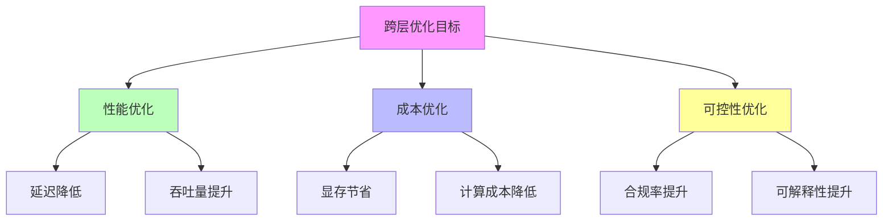
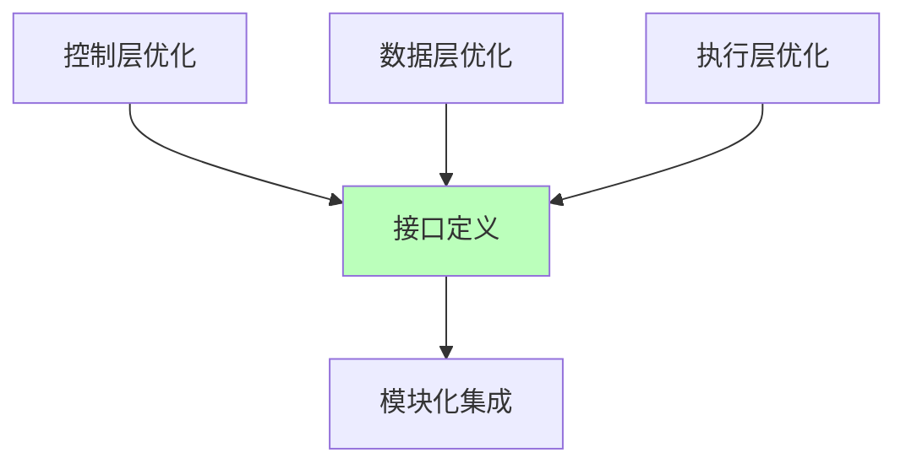
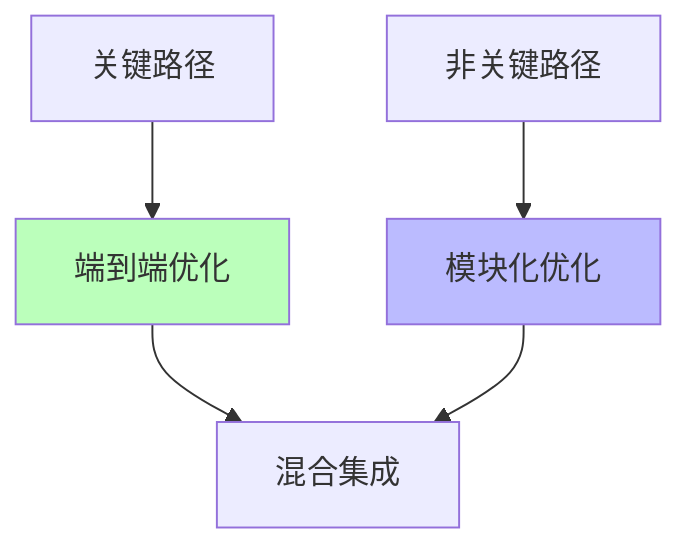

# 01.4.4-跨层优化策略

## 目录

- [01.4.4-跨层优化策略](#0144-跨层优化策略)
  - [目录](#目录)
  - [一、概述](#一概述)
  - [二、跨层优化框架](#二跨层优化框架)
    - [2.1 优化目标](#21-优化目标)
    - [2.2 优化策略](#22-优化策略)
  - [三、端到端优化](#三端到端优化)
    - [3.1 端到端训练](#31-端到端训练)
    - [3.2 端到端推理优化](#32-端到端推理优化)
  - [四、模块化优化](#四模块化优化)
    - [4.1 模块化设计](#41-模块化设计)
    - [4.2 模块化训练](#42-模块化训练)
  - [五、混合策略](#五混合策略)
    - [5.1 混合优化策略](#51-混合优化策略)
    - [5.2 混合训练策略](#52-混合训练策略)
  - [六、工程实践案例](#六工程实践案例)
    - [6.1 DeepSeek-R1 的跨层优化](#61-deepseek-r1-的跨层优化)
    - [6.2 Claude 3.5 的跨层优化](#62-claude-35-的跨层优化)
  - [七、与三层模型的关系](#七与三层模型的关系)
    - [7.1 跨层优化是三层协同的核心](#71-跨层优化是三层协同的核心)
    - [7.2 跨层优化的工程价值](#72-跨层优化的工程价值)
  - [八、核心结论](#八核心结论)
  - [九、相关主题](#九相关主题)
  - [十、参考文档](#十参考文档)

---

## 一、概述

跨层优化策略是 AI 系统三层模型的核心优化方法，通过跨层协同优化提升系统整体性能。本文档阐述跨层优化策略、优化方法及其在 AI 系统中的应用。

---

## 二、跨层优化框架

### 2.1 优化目标

**跨层优化目标**：

**优化目标**：

1. **性能优化**：延迟降低、吞吐量提升
2. **成本优化**：显存节省、计算成本降低
3. **可控性优化**：合规率提升、可解释性提升

### 2.2 优化策略

**跨层优化策略**：

| **策略**       | **方法**                   | **效果**         | **成本**   |
| -------------- | -------------------------- | ---------------- | ---------- |
| **端到端训练** | 三层协同训练               | 性能最优         | 计算成本高 |
| **模块化优化** | 分层优化，接口清晰         | 灵活性强         | 性能略低   |
| **混合策略**   | 关键路径端到端，其他模块化 | 平衡性能和灵活性 | 复杂度中等 |

---

## 三、端到端优化

### 3.1 端到端训练

**端到端训练策略**：

**核心思想**：三层协同训练，统一优化目标

**端到端训练流程**：

**端到端训练优势**：

1. **性能最优**：三层协同优化，性能最佳
2. **统一目标**：统一优化目标，无冲突
3. **端到端梯度**：端到端梯度，优化效果好

**端到端训练劣势**：

1. **计算成本高**：需要全栈训练
2. **调试困难**：三层耦合，调试困难
3. **灵活性低**：难以单独优化某一层

**2025 应用**：

- **OpenAI o1**：端到端训练，性能最优
- **DeepSeek-R1**：端到端训练，成本最低

### 3.2 端到端推理优化

**端到端推理优化策略**：

**核心思想**：三层协同推理，统一优化目标

**端到端推理优化方法**：

1. **投机解码**：小模型生成候选，大模型验证
2. **连续批处理**：动态批处理，提高 GPU 利用率
3. **FlashAttention**：分块计算注意力矩阵

**端到端推理优化效果**：

- **延迟降低**：延迟降低 50-70%
- **吞吐量提升**：吞吐量提升 2-3x
- **成本降低**：成本降低 30-50%

**2025 应用**：

- **DeepSeek-R1**：投机解码，推理速度提升 3x
- **Claude 3.5**：投机解码，延迟降低 50%

---

## 四、模块化优化

### 4.1 模块化设计

**模块化优化策略**：

**核心思想**：分层优化，接口清晰

**模块化优化流程**：

**模块化优化优势**：

1. **灵活性强**：可以单独优化某一层
2. **易于调试**：三层解耦，调试容易
3. **可复用性**：模块可复用

**模块化优化劣势**：

1. **性能略低**：三层解耦，性能略低
2. **接口开销**：层间接口带来额外开销
3. **优化受限**：无法跨层优化

**2025 应用**：

- **Claude 3.5**：模块化设计，可控性强
- **Llama 3.1**：模块化设计，可复现性好

### 4.2 模块化训练

**模块化训练策略**：

**核心思想**：分层训练，接口清晰

**模块化训练方法**：

1. **预训练**：数据层预训练
2. **微调**：控制层微调
3. **对齐**：三层对齐

**模块化训练效果**：

- **训练成本**：训练成本降低 30-50%
- **可复现性**：可复现性提升
- **灵活性**：灵活性提升

**2025 应用**：

- **Llama 3.1**：模块化训练，可复现性好
- **开源模型**：模块化训练，社区支持

---

## 五、混合策略

### 5.1 混合优化策略

**混合优化策略**：

**核心思想**：关键路径端到端，其他模块化

**混合优化流程**：

**混合优化优势**：

1. **平衡性能和灵活性**：关键路径性能最优，其他路径灵活
2. **成本可控**：关键路径端到端，其他路径模块化
3. **复杂度适中**：复杂度适中，可维护

**混合优化劣势**：

1. **实现复杂**：需要区分关键路径和非关键路径
2. **优化受限**：非关键路径无法跨层优化

**2025 应用**：

- **企业级应用**：关键路径端到端，其他路径模块化
- **混合部署**：关键路径云端，其他路径边缘

### 5.2 混合训练策略

**混合训练策略**：

**核心思想**：关键路径端到端训练，其他路径模块化训练

**混合训练方法**：

1. **关键路径**：端到端训练，性能最优
2. **非关键路径**：模块化训练，成本最低
3. **混合集成**：关键路径和非关键路径混合集成

**混合训练效果**：

- **性能**：关键路径性能最优
- **成本**：非关键路径成本最低
- **灵活性**：灵活性提升

**2025 应用**：

- **企业级应用**：关键路径端到端训练
- **混合部署**：关键路径云端训练，其他路径边缘训练

---

## 六、工程实践案例

### 6.1 DeepSeek-R1 的跨层优化

**跨层优化策略**：

1. **端到端训练**：三层协同训练，性能最优
2. **投机解码**：小模型生成候选，大模型验证
3. **FlashAttention-3**：分块计算注意力矩阵

**效果**：成本降至 $0.001/1K tokens，推理速度提升 3x

### 6.2 Claude 3.5 的跨层优化

**跨层优化策略**：

1. **模块化设计**：三层解耦，可控性强
2. **投机解码**：延迟降低 50%
3. **Constitutional AI**：多阶段规则注入

**效果**：合规率 100%，延迟 <200ms

---

## 七、与三层模型的关系

### 7.1 跨层优化是三层协同的核心

**跨层优化是三层协同的核心**：

- **端到端优化**：三层协同优化，性能最优
- **模块化优化**：分层优化，灵活性强
- **混合策略**：平衡性能和灵活性

### 7.2 跨层优化的工程价值

**跨层优化的工程价值**：

- **性能提升**：跨层优化提升系统整体性能
- **成本降低**：跨层优化降低系统整体成本
- **可控性提升**：跨层优化提升系统可控性

---

## 八、核心结论

1. **跨层优化策略是三层模型的核心优化方法**：通过跨层协同优化提升系统整体性能
2. **端到端优化**：性能最优，但计算成本高
3. **模块化优化**：灵活性强，但性能略低
4. **混合策略**：平衡性能和灵活性，是 2025 主流

---

## 九、相关主题

- [01.4.1-三层协同机制](01.4.1-三层协同机制.md)
- [01.4.2-层间冲突与矛盾](01.4.2-层间冲突与矛盾.md)
- [01.4.3-三层契约设计模式](01.4.3-三层契约设计模式.md)

---

## 十、参考文档

- [工程实践核心逻辑下的 AI 三层模型全景解构](../../view/ai_engineer_view.md)
- [分层解构视角](../../view/ai_models_view.md)
