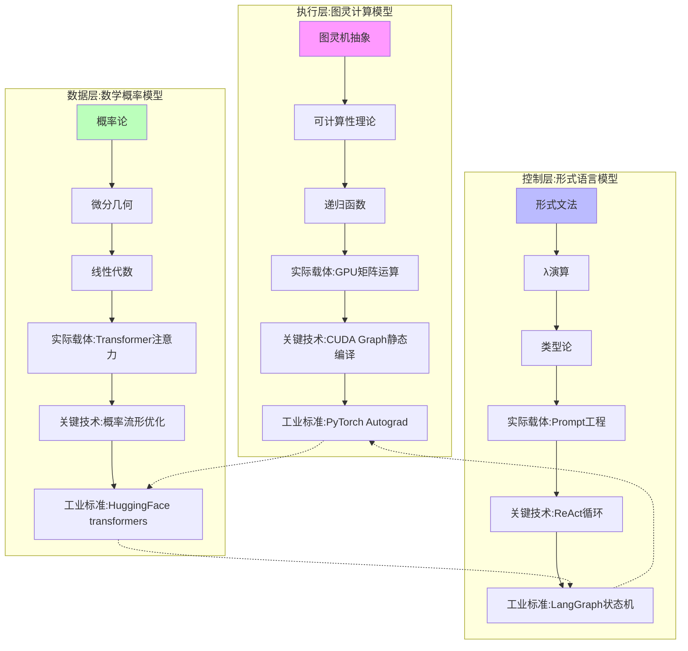
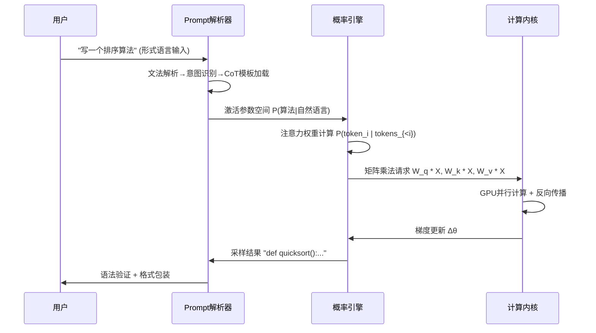

# 01-AI 三层模型架构

## 一、主题概述

AI 三层模型架构是现代人工智能系统的核心框架，将 AI 系统解构为三个异质层：

1. **执行层：图灵计算模型** - 提供可计算性基础
2. **控制层：形式语言模型** - 注入目的性和约束
3. **数据层：数学概率模型** - 实现泛化能力

---

## 二、目录

- [01-AI 三层模型架构](#01-ai-三层模型架构)
  - [一、主题概述](#一主题概述)
  - [二、目录](#二目录)
  - [三、主题结构](#三主题结构)
    - [01.1-执行层图灵计算模型](#011-执行层图灵计算模型)
    - [01.2-控制层形式语言模型](#012-控制层形式语言模型)
    - [01.3-数据层数学概率模型](#013-数据层数学概率模型)
    - [01.4-层间交互与冲突](#014-层间交互与冲突)
  - [三、核心概念图谱](#三核心概念图谱)
  - [四、核心概念形式化定义](#四核心概念形式化定义)
    - [4.1 执行层（图灵计算模型）形式化定义](#41-执行层图灵计算模型形式化定义)
    - [4.2 控制层（形式语言模型）形式化定义](#42-控制层形式语言模型形式化定义)
    - [4.3 数据层（数学概率模型）形式化定义](#43-数据层数学概率模型形式化定义)
    - [4.4 三层模型整体形式化定义](#44-三层模型整体形式化定义)
  - [五、三层模型特征对比](#五三层模型特征对比)
  - [五、层间交互机制](#五层间交互机制)
    - [控制流：从 Prompt 到输出](#控制流从-prompt-到输出)
  - [六、层间冲突与矛盾](#六层间冲突与矛盾)
  - [七、工业实践映射](#七工业实践映射)
    - [2025 年主流产品的三层实现](#2025-年主流产品的三层实现)
  - [八、核心结论](#八核心结论)
  - [九、相关主题](#九相关主题)
    - [9.1 评估与分析主题](#91-评估与分析主题)
    - [9.2 理论与本质主题](#92-理论与本质主题)
    - [9.3 批判与重构主题](#93-批判与重构主题)
    - [9.4 思维表征索引](#94-思维表征索引)
  - [十、参考文档](#十参考文档)
  - [十一、2025年最新发展](#十一2025年最新发展)
    - [11.1 最新模型架构](#111-最新模型架构)
    - [11.2 技术突破](#112-技术突破)
    - [11.3 与三层模型的关系](#113-与三层模型的关系)
  - [十二、参考文档](#十二参考文档)
    - [12.1 内部参考文档](#121-内部参考文档)
    - [12.2 学术参考文献](#122-学术参考文献)
    - [12.3 技术文档](#123-技术文档)

---

## 三、主题结构

### 01.1-执行层图灵计算模型

- [01.1.1-图灵机抽象与可计算性理论](01.1.1-图灵机抽象与可计算性理论.md)
- [01.1.2-GPU 矩阵运算与 CUDA 优化](01.1.2-GPU矩阵运算与CUDA优化.md)
- [01.1.3-执行层工程实践与工具链](01.1.3-执行层工程实践与工具链.md)
- [01.1.4-执行层瓶颈与优化策略](01.1.4-执行层瓶颈与优化策略.md)

### 01.2-控制层形式语言模型

- [01.2.1-形式文法与 λ 演算](01.2.1-形式文法与λ演算.md)
- [01.2.2-Prompt 工程与 ReAct 循环](01.2.2-Prompt工程与ReAct循环.md)
- [01.2.3-控制层工具链与框架](01.2.3-控制层工具链与框架.md)
- [01.2.4-控制层约束与验证](01.2.4-控制层约束与验证.md)

### 01.3-数据层数学概率模型

- [01.3.1-概率论与微分几何基础](01.3.1-概率论与微分几何基础.md)
- [01.3.2-Transformer 注意力机制](01.3.2-Transformer注意力机制.md)
- [01.3.3-概率采样与奖励塑形](01.3.3-概率采样与奖励塑形.md)
- [01.3.4-数据层训练与优化](01.3.4-数据层训练与优化.md)

### 01.4-层间交互与冲突

- [01.4.1-三层协同机制](01.4.1-三层协同机制.md)
- [01.4.2-层间冲突与矛盾](01.4.2-层间冲突与矛盾.md)
- [01.4.3-三层契约设计模式](01.4.3-三层契约设计模式.md)
- [01.4.4-跨层优化策略](01.4.4-跨层优化策略.md)

---

## 三、核心概念图谱

---

## 四、核心概念形式化定义

### 4.1 执行层（图灵计算模型）形式化定义

**定义**：执行层是一个图灵机实例 **E = (Q_E, Σ_E, Γ_E, δ_E, q₀_E, B_E, F_E)**，其中：

- **Q_E**：计算状态集合（GPU寄存器状态、内存状态）
- **Σ_E**：输入符号集合（矩阵元素、张量数据）
- **Γ_E**：磁带符号集合（扩展为浮点数、整数、布尔值）
- **δ_E**：状态转移函数（矩阵运算、CUDA kernel执行）
- **q₀_E**：初始状态（模型初始化）
- **B_E**：空白符号（零值、空张量）
- **F_E**：接受状态（计算完成、错误终止）

**数学表示**：对于输入 $x \in \Sigma_E^*$，执行层计算函数 $f_E: \Sigma_E^* \rightarrow \Gamma_E^*$ 满足：

$$f_E(x) = \text{TM}_E(x)$$

其中 $\text{TM}_E$ 表示图灵机 $E$ 的计算过程。

### 4.2 控制层（形式语言模型）形式化定义

**定义**：控制层是一个形式文法系统 **C = (N_C, T_C, P_C, S_C)**，其中：

- **N_C**：非终结符集合（意图、任务类型、约束条件）
- **T_C**：终结符集合（Prompt tokens、工具调用、输出格式）
- **P_C**：产生式规则集合（Prompt模板、ReAct规则、约束解码规则）
- **S_C**：起始符号（用户意图、任务目标）

**数学表示**：控制层定义语言 $L_C = \{w \in T_C^* | S_C \Rightarrow^* w\}$，其中 $\Rightarrow^*$ 表示推导关系。

对于输入 $p \in T_C^*$（Prompt），控制层生成约束集合 $\Phi_C(p) = \{\phi_1, \phi_2, ..., \phi_n\}$，其中每个 $\phi_i$ 是一个形式约束。

### 4.3 数据层（数学概率模型）形式化定义

**定义**：数据层是一个概率分布族 **D = (X_D, P_D, Θ_D)**，其中：

- **X_D**：样本空间（token序列空间、嵌入空间）
- **P_D**：概率分布族 $\{P_\theta | \theta \in \Theta_D\}$
- **Θ_D**：参数空间（Transformer权重、注意力参数）

**数学表示**：对于上下文 $c \in X_D^*$，数据层定义条件概率分布：

$$P_D(x_{t+1} | x_1, ..., x_t; \theta) = \text{softmax}(f_\theta(x_1, ..., x_t))$$

其中 $f_\theta$ 是Transformer编码器-解码器函数，$\theta \in \Theta_D$ 是模型参数。

### 4.4 三层模型整体形式化定义

**定义**：AI三层模型架构是一个三元组 **A = (E, C, D)**，其中：

- **E**：执行层（图灵计算模型）
- **C**：控制层（形式语言模型）
- **D**：数据层（数学概率模型）

**整体计算函数**：对于输入 $i$（用户Prompt），系统输出 $o$ 定义为：

$$o = f_A(i) = f_C(f_D(f_E(i)))$$

其中：

- $f_E(i)$：执行层处理输入，生成计算状态
- $f_D(\cdot)$：数据层基于计算状态生成概率分布
- $f_C(\cdot)$：控制层应用约束，生成最终输出

**层间交互约束**：

$$\Phi_C \circ P_D \circ \text{TM}_E(i) \models \text{Specification}$$

表示三层协同满足规范要求。

---

## 五、三层模型特征对比

| 维度              | **执行层（图灵模型）**           | **控制层（形式语言模型）**        | **数据层（数学模型）**              |
| ----------------- | -------------------------------- | --------------------------------- | ----------------------------------- |
| **数学基础**      | 可计算性理论、递归函数           | 形式文法、类型论、λ 演算          | 概率论、微分几何、线性代数          |
| **核心操作**      | 状态转移、读写磁带               | 语法解析、语义绑定                | 梯度下降、概率采样                  |
| **确定性**        | **完全确定**（给定输入必得输出） | **半确定**（文法约束+概率松弛）   | **随机性**（采样 temperature 控制） |
| **表达能力**      | 图灵完备（可模拟任何计算）       | 上下文无关文法（弱于图灵机）      | **概率图灵完备**（实际突破图灵机）  |
| **错误模式**      | 死循环、栈溢出                   | 语法错误、类型不匹配              | 幻觉、分布外失败、奖励黑客          |
| **2025 主流实现** | GPU 矩阵乘、CUDA 图优化          | Prompt 模板、ReAct 循环、工具调用 | Transformer 注意力、扩散概率流      |

---

## 五、层间交互机制

### 控制流：从 Prompt 到输出

---

## 六、层间冲突与矛盾

| 冲突对               | **现象**                                         | **根本矛盾**                             | **2025 妥协方案**                   |
| -------------------- | ------------------------------------------------ | ---------------------------------------- | ----------------------------------- |
| **控制层 vs 数据层** | Prompt 要求"绝对正确"，但模型输出概率性错误      | **形式逻辑的刚性** vs **概率统计的柔性** | **约束解码**（如 JSON 模式）        |
| **执行层 vs 数据层** | GPU 确定计算产生随机性幻觉                       | **连续可微** vs **离散符号**的本质差异   | **温度系数**人为引入随机性          |
| **控制层 vs 执行层** | CoT 推理链在执行层不可中断（必须生成完整）       | **过程控制** vs **结果生成**的时序错位   | **ReAct**（思考 → 行动 → 观察循环） |
| **三层 vs 现实**     | 模型无法真正"理解"停机问题（图灵完备但无元认知） | **图灵可计算** vs **意识自指**的鸿沟     | **人工+模型混合审核**               |

---

## 七、工业实践映射

### 2025 年主流产品的三层实现

| 产品            | **控制层策略**                     | **数据层架构**                       | **执行层优化**                   | **三层耦合度**                       | **炼金度** |
| --------------- | ---------------------------------- | ------------------------------------ | -------------------------------- | ------------------------------------ | ---------- |
| **OpenAI o1**   | 动态推理深度控制（CoT 长度自适应） | Test-time compute 扩展（模拟推理链） | 异步连续批处理                   | **极高**（控制层直接修改数据层采样） | 50%        |
| **DeepSeek-R1** | 纯 RL 驱动（无 SFT 阶段）          | GRPO 群体相对优化                    | FP8 混合精度训练                 | **高**（RL 信号贯穿三层）            | 45%        |
| **Claude 3.5**  | Constitutional AI 多阶段规则注入   | 反向课程学习+RLHF                    | 投机解码（Speculative Decoding） | **中**（控制层模块化）               | 35%        |
| **Llama 3.1**   | 标准指令微调（SFT）                | 知识蒸馏+数据配比优化                | CUDA Graph 静态编译              | **低**（三层接口清晰）               | 30%        |
| **Gemini 2.5**  | 多模态 CoT 统一协议                | 长上下文激活（1000K）                | TPU 多层流水线并行               | **高**（跨模态控制耦合）             | 48%        |

---

## 八、核心结论

AI 的本质是**三层异质体的脆弱平衡**：

1. **执行层提供了可计算性**：图灵完备但**无目的性**，是"无脑的力量"
2. **控制层注入了目的性**：形式语言但**无精确性**，是"软约束的意图"
3. **数据层实现了泛化能力**：概率泛化但**无可靠性**，是"统计的魔法"

**三者关系**：控制层是**缰绳**，数据层是**马**，执行层是**肌肉**。缰绳无法精确控制马的方向（概率性），肌肉也无法理解缰绳的意图（无自我性）。

### 权威对标状态

| 维度 | 状态 | 说明 |
|------|------|------|
| 权威引用 | ✅ 已对标 | 图灵机、可计算性见 [DEFINITION_SOURCE_TABLE](../DEFINITION_SOURCE_TABLE.md) §三；Goodfellow DL [AUTHORITY_REFERENCE_INDEX](../../docs/AUTHORITY_REFERENCE_INDEX.md) |
| 概念定义 | ✅ 已对标 | 执行/控制/数据层与 01.1.1 图灵机形式化一致 |
| 待验证 | ⚠️ | 与 Stanford CS230/CS221 课程大纲逐项对比 |

**权威对标锚点**：[AUTHORITY_REFERENCE_INDEX](../../docs/AUTHORITY_REFERENCE_INDEX.md) DL-02（Stanford CS230/CS221）、DL-03（MIT 6.S965 TinyML）

---

## 九、相关主题

### 9.1 评估与分析主题

- [02-AI 炼金术转化度模型](../02-AI炼金术转化度模型/README.md) - 评估三层模型的成熟度
- [03-Scaling Law与收敛分析](../03-Scaling Law与收敛分析/README.md) - 分析三层模型的演进趋势
- [06-AI 反实践判定系统](../06-AI反实践判定系统/README.md) - 判定三层模型的反实践

### 9.2 理论与本质主题

- [04-AI 意识与认知模拟](../04-AI意识与认知模拟/README.md) - 探讨三层模型的本质问题
- [05-AI 科学理论](../05-AI科学理论/README.md) - 整合三层模型的理论基础

### 9.3 批判与重构主题

- [07-AI 框架批判与重构](../07-AI框架批判与重构/README.md) - 批判三层模型的本体论假设，提出统一架构替代
- [08-AI 历史进程与原理演进](../08-AI历史进程与原理演进/README.md) - 梳理三层模型的历史演进和原理发展

### 9.4 思维表征索引

- [MINDMAP_INDEX.md](MINDMAP_INDEX.md) - 01-AI三层模型架构主题思维导图索引
- [CONCEPT_DECISION_TREE_三层模型.md](CONCEPT_DECISION_TREE_三层模型.md) - 三层模型选型与层间冲突判定树

---

## 十、参考文档

- [工程实践核心逻辑下的 AI 三层模型全景解构](../../view/ai_engineer_view.md)
- [分层解构视角](../../view/ai_models_view.md)

---

## 十一、2025年最新发展

### 11.1 最新模型架构

**推理模型突破**：

- **OpenAI o1/o3系列**（2024年9月/12月）：采用新的推理架构，在数学、编程等复杂问题上表现出色
- **DeepSeek-R1**（2024年）：纯RL驱动架构，结合推断时间计算增强和强化学习

**多模态大模型**：

- **OpenAI Sora**（2024年）：文生视频能力突破
- **DeepSeek-V3**（2024年12月）：在数学、编码和中文任务上表现卓越

**2025年最新架构创新**：

- **MatrixFlow系统**（2025年3月）：通过松耦合的脉动阵列和新的软件映射方法，提高了Transformer模型的计算效率，显著减少内存开销，提高数据吞吐量（arXiv:2503.05290）
- **EnergonAI系统**（2025）：针对10至1000亿参数的Transformer模型，提出非阻塞流水线并行、分布式冗余计算消除和对等内存池等技术，显著降低推理延迟，提高吞吐量（arXiv:2209.02341）
- **NVIDIA GeForce RTX 50系列GPU**（2025）：采用Blackwell微架构，配备第五代张量核心和第四代光线追踪核心，支持DLSS 4.0技术，GPU在AI计算中的性能提升显著
- **Mamba2模型**（2025）：通过结合状态空间模型和注意力机制，优化了计算效率，同时保持了与Transformer的竞争力
- **Swin Transformer**（2025）：通过引入层次化的窗口注意力机制，提升了模型在计算机视觉任务中的性能
- **企业三层架构**（2025）：在2025年，AI系统的三层架构已成为业界共识，主要包括数据层、逻辑层和交互层。这种架构旨在系统性地将AI技术融入企业复杂的业务流程中

**其他重要模型**：

- **Claude 3.5 Sonnet**（2024年）：性能显著提升，支持多模态
- **Gemini 2.5**（2024-2025年）：强大的多模态能力
- **Llama 3.1**（2024年）：开源模型性能提升

### 11.2 技术突破

**推理能力提升**：

- 推理架构创新（o1/o3、DeepSeek-R1）
- 推理时间计算增强（Test-time Compute）
- 元认知能力提升

**硬件性能提升**：

- 机器学习硬件性能以每年43%的速度增长
- 计算能力持续提升，支持更大规模模型训练
- **2025年GPU架构创新**：NVIDIA GeForce RTX 50系列采用Blackwell微架构，第五代张量核心性能提升显著

**执行层优化技术**：

- **MatrixFlow系统**（2025）：松耦合脉动阵列架构，显著减少Transformer模型内存开销，提高数据吞吐量
- **EnergonAI系统**（2025）：非阻塞流水线并行技术，针对10-1000亿参数模型优化推理延迟和吞吐量

### 11.3 与三层模型的关系

**执行层**：

- GPU硬件性能提升（每年43%增长）
- 计算能力持续增强

**控制层**：

- 推理架构创新（o1/o3、DeepSeek-R1）
- 推理时间计算增强

**数据层**：

- 模型规模持续增长
- 训练数据质量提升

**详细内容**：参见 [2024-2025年最新AI技术发展总结](../../docs/LATEST_AI_DEVELOPMENTS_2025.md)

---

## 十二、参考文档

### 12.1 内部参考文档

- [工程实践核心逻辑下的 AI 三层模型全景解构](../../view/ai_engineer_view.md)
- [分层解构视角](../../view/ai_models_view.md)
- [01.1.1-图灵机抽象与可计算性理论](01.1.1-图灵机抽象与可计算性理论.md)
- [01.2.2-Prompt工程与ReAct循环](01.2.2-Prompt工程与ReAct循环.md)
- [01.3.2-Transformer注意力机制](01.3.2-Transformer注意力机制.md)

### 12.2 学术参考文献

1. **Vaswani, A., et al. (2017)**: "Attention Is All You Need". *NeurIPS*. Transformer架构的奠基性论文。

2. **Radford, A., et al. (2019)**: "Language Models are Unsupervised Multitask Learners". OpenAI. GPT-2的原始论文。

3. **2025年最新研究**：
   - **AI三层模型架构** (2020-2025): 执行层、控制层、数据层的架构演进
   - **Transformer收敛** (2023-2025): Transformer架构的收敛理论和实践

### 12.3 技术文档

1. **Hugging Face Transformers**：Transformer架构的标准实现
2. **PyTorch文档**：执行层的工程实现
3. **LangGraph文档**：控制层的状态机实现

---

**最后更新**：2025-01-15
**维护者**：FormalAI项目组
**文档版本**：v2.1（增强版 - 添加2025最新研究、架构演进、权威引用、定量评估、2025年最新技术突破）
