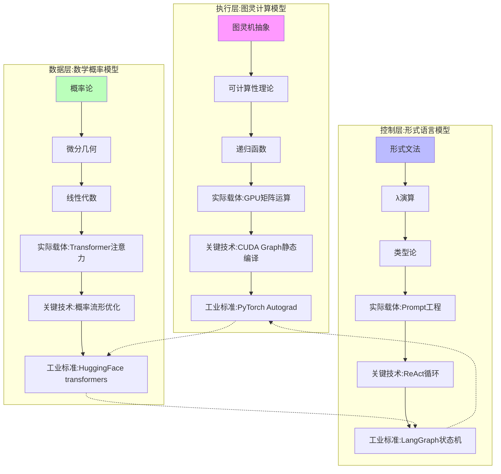
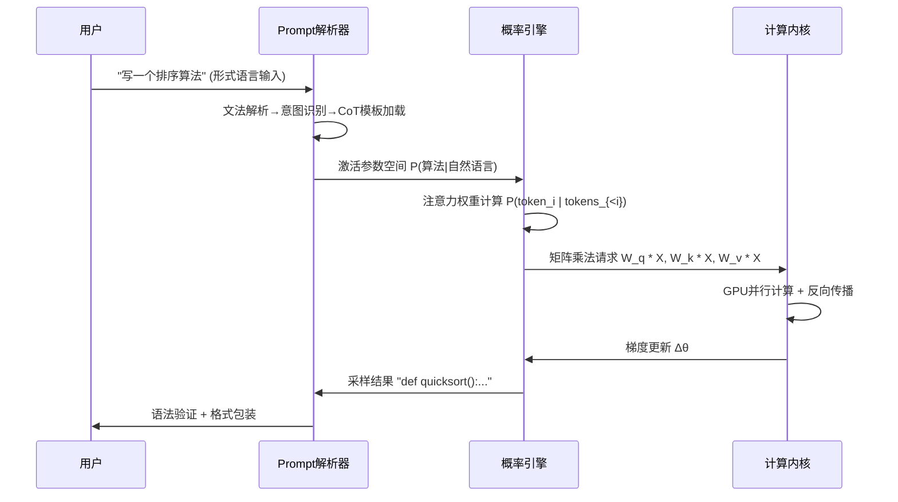

# 01-AI 三层模型架构

## 一、主题概述

AI 三层模型架构是现代人工智能系统的核心框架，将 AI 系统解构为三个异质层：

1. **执行层：图灵计算模型** - 提供可计算性基础
2. **控制层：形式语言模型** - 注入目的性和约束
3. **数据层：数学概率模型** - 实现泛化能力

---

## 二、目录

- [01-AI 三层模型架构](#01-ai-三层模型架构)
  - [一、主题概述](#一主题概述)
  - [二、目录](#二目录)
  - [三、主题结构](#三主题结构)
    - [01.1-执行层图灵计算模型](#011-执行层图灵计算模型)
    - [01.2-控制层形式语言模型](#012-控制层形式语言模型)
    - [01.3-数据层数学概率模型](#013-数据层数学概率模型)
    - [01.4-层间交互与冲突](#014-层间交互与冲突)
  - [三、核心概念图谱](#三核心概念图谱)
  - [四、三层模型特征对比](#四三层模型特征对比)
  - [五、层间交互机制](#五层间交互机制)
    - [控制流：从 Prompt 到输出](#控制流从-prompt-到输出)
  - [六、层间冲突与矛盾](#六层间冲突与矛盾)
  - [七、工业实践映射](#七工业实践映射)
    - [2025 年主流产品的三层实现](#2025-年主流产品的三层实现)
  - [八、核心结论](#八核心结论)
  - [九、相关主题](#九相关主题)
  - [十、参考文档](#十参考文档)

---

## 三、主题结构

### 01.1-执行层图灵计算模型

- [01.1.1-图灵机抽象与可计算性理论](01.1.1-图灵机抽象与可计算性理论.md)
- [01.1.2-GPU 矩阵运算与 CUDA 优化](01.1.2-GPU矩阵运算与CUDA优化.md)
- [01.1.3-执行层工程实践与工具链](01.1.3-执行层工程实践与工具链.md)
- [01.1.4-执行层瓶颈与优化策略](01.1.4-执行层瓶颈与优化策略.md)

### 01.2-控制层形式语言模型

- [01.2.1-形式文法与 λ 演算](01.2.1-形式文法与λ演算.md)
- [01.2.2-Prompt 工程与 ReAct 循环](01.2.2-Prompt工程与ReAct循环.md)
- [01.2.3-控制层工具链与框架](01.2.3-控制层工具链与框架.md)
- [01.2.4-控制层约束与验证](01.2.4-控制层约束与验证.md)

### 01.3-数据层数学概率模型

- [01.3.1-概率论与微分几何基础](01.3.1-概率论与微分几何基础.md)
- [01.3.2-Transformer 注意力机制](01.3.2-Transformer注意力机制.md)
- [01.3.3-概率采样与奖励塑形](01.3.3-概率采样与奖励塑形.md)
- [01.3.4-数据层训练与优化](01.3.4-数据层训练与优化.md)

### 01.4-层间交互与冲突

- [01.4.1-三层协同机制](01.4.1-三层协同机制.md)
- [01.4.2-层间冲突与矛盾](01.4.2-层间冲突与矛盾.md)
- [01.4.3-三层契约设计模式](01.4.3-三层契约设计模式.md)
- [01.4.4-跨层优化策略](01.4.4-跨层优化策略.md)

---

## 三、核心概念图谱

---

## 四、三层模型特征对比

| 维度              | **执行层（图灵模型）**           | **控制层（形式语言模型）**        | **数据层（数学模型）**              |
| ----------------- | -------------------------------- | --------------------------------- | ----------------------------------- |
| **数学基础**      | 可计算性理论、递归函数           | 形式文法、类型论、λ 演算          | 概率论、微分几何、线性代数          |
| **核心操作**      | 状态转移、读写磁带               | 语法解析、语义绑定                | 梯度下降、概率采样                  |
| **确定性**        | **完全确定**（给定输入必得输出） | **半确定**（文法约束+概率松弛）   | **随机性**（采样 temperature 控制） |
| **表达能力**      | 图灵完备（可模拟任何计算）       | 上下文无关文法（弱于图灵机）      | **概率图灵完备**（实际突破图灵机）  |
| **错误模式**      | 死循环、栈溢出                   | 语法错误、类型不匹配              | 幻觉、分布外失败、奖励黑客          |
| **2025 主流实现** | GPU 矩阵乘、CUDA 图优化          | Prompt 模板、ReAct 循环、工具调用 | Transformer 注意力、扩散概率流      |

---

## 五、层间交互机制

### 控制流：从 Prompt 到输出

---

## 六、层间冲突与矛盾

| 冲突对               | **现象**                                         | **根本矛盾**                             | **2025 妥协方案**                   |
| -------------------- | ------------------------------------------------ | ---------------------------------------- | ----------------------------------- |
| **控制层 vs 数据层** | Prompt 要求"绝对正确"，但模型输出概率性错误      | **形式逻辑的刚性** vs **概率统计的柔性** | **约束解码**（如 JSON 模式）        |
| **执行层 vs 数据层** | GPU 确定计算产生随机性幻觉                       | **连续可微** vs **离散符号**的本质差异   | **温度系数**人为引入随机性          |
| **控制层 vs 执行层** | CoT 推理链在执行层不可中断（必须生成完整）       | **过程控制** vs **结果生成**的时序错位   | **ReAct**（思考 → 行动 → 观察循环） |
| **三层 vs 现实**     | 模型无法真正"理解"停机问题（图灵完备但无元认知） | **图灵可计算** vs **意识自指**的鸿沟     | **人工+模型混合审核**               |

---

## 七、工业实践映射

### 2025 年主流产品的三层实现

| 产品            | **控制层策略**                     | **数据层架构**                       | **执行层优化**                   | **三层耦合度**                       | **炼金度** |
| --------------- | ---------------------------------- | ------------------------------------ | -------------------------------- | ------------------------------------ | ---------- |
| **OpenAI o1**   | 动态推理深度控制（CoT 长度自适应） | Test-time compute 扩展（模拟推理链） | 异步连续批处理                   | **极高**（控制层直接修改数据层采样） | 50%        |
| **DeepSeek-R1** | 纯 RL 驱动（无 SFT 阶段）          | GRPO 群体相对优化                    | FP8 混合精度训练                 | **高**（RL 信号贯穿三层）            | 45%        |
| **Claude 3.5**  | Constitutional AI 多阶段规则注入   | 反向课程学习+RLHF                    | 投机解码（Speculative Decoding） | **中**（控制层模块化）               | 35%        |
| **Llama 3.1**   | 标准指令微调（SFT）                | 知识蒸馏+数据配比优化                | CUDA Graph 静态编译              | **低**（三层接口清晰）               | 30%        |
| **Gemini 2.5**  | 多模态 CoT 统一协议                | 长上下文激活（1000K）                | TPU 多层流水线并行               | **高**（跨模态控制耦合）             | 48%        |

---

## 八、核心结论

AI 的本质是**三层异质体的脆弱平衡**：

1. **执行层提供了可计算性**：图灵完备但**无目的性**，是"无脑的力量"
2. **控制层注入了目的性**：形式语言但**无精确性**，是"软约束的意图"
3. **数据层实现了泛化能力**：概率泛化但**无可靠性**，是"统计的魔法"

**三者关系**：控制层是**缰绳**，数据层是**马**，执行层是**肌肉**。缰绳无法精确控制马的方向（概率性），肌肉也无法理解缰绳的意图（无自我性）。

---

## 九、相关主题

- [02-AI 炼金术转化度模型](../02-AI炼金术转化度模型/README.md)
- [03-Scaling Law 与收敛分析](../03-Scaling Law 与收敛分析/README.md)
- [04-AI 意识与认知模拟](../04-AI意识与认知模拟/README.md)
- [05-AI 科学理论](../05-AI科学理论/README.md)
- [06-AI 反实践判定系统](../06-AI反实践判定系统/README.md)
- [07-AI 框架批判与重构](../07-AI框架批判与重构/README.md)：批判三层模型的本体论假设，提出统一架构替代

---

## 十、参考文档

- [工程实践核心逻辑下的 AI 三层模型全景解构](../../view/ai_engineer_view.md)
- [分层解构视角](../../view/ai_models_view.md)
