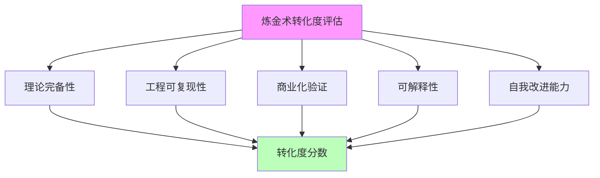

# 02.1.1-五维度评估体系

## 一、概述

五维度评估体系是 AI 炼金术转化度模型的核心框架，
用于评估 AI 系统从"经验试错"（炼金术）向"精密科学"（化学）的转化程度。
本文档阐述五维度评估体系、评估指标及其应用。

---

## 二、目录

- [02.1.1-五维度评估体系](#0211-五维度评估体系)
  - [一、概述](#一概述)
  - [二、目录](#二目录)
  - [三、核心形式化理论](#三核心形式化理论)
    - [3.1 五维度评估体系的形式化定义](#31-五维度评估体系的形式化定义)
    - [3.2 各维度形式化定义](#32-各维度形式化定义)
    - [3.3 维度独立性定理](#33-维度独立性定理)
  - [四、五维度评估框架](#四五维度评估框架)
    - [4.1 评估维度](#41-评估维度)
  - [五、理论完备性](#五理论完备性)
    - [5.1 评估指标](#51-评估指标)
    - [5.2 典型产品分析](#52-典型产品分析)
  - [六、工程可复现性](#六工程可复现性)
    - [6.1 评估指标](#61-评估指标)
    - [4.2 典型产品分析](#42-典型产品分析)
  - [七、商业化验证](#七商业化验证)
    - [7.1 评估指标](#71-评估指标)
    - [5.2 典型产品分析](#52-典型产品分析-1)
  - [八、可解释性](#八可解释性)
    - [8.1 评估指标](#81-评估指标)
    - [8.2 典型产品分析](#82-典型产品分析)
  - [九、自我改进能力](#九自我改进能力)
    - [9.1 评估指标](#91-评估指标)
    - [9.2 典型产品分析](#92-典型产品分析)
  - [十、综合评估](#十综合评估)
    - [10.1 转化度计算](#101-转化度计算)
    - [10.2 典型产品转化度](#102-典型产品转化度)
  - [十一、与三层模型的关系](#十一与三层模型的关系)
    - [11.1 执行层评估](#111-执行层评估)
    - [11.2 控制层评估](#112-控制层评估)
    - [11.3 数据层评估](#113-数据层评估)
    - [11.4 三层协同评估](#114-三层协同评估)
  - [十二、核心结论](#十二核心结论)
  - [十三、相关主题](#十三相关主题)
    - [13.1 转化度模型相关主题](#131-转化度模型相关主题)
    - [13.2 三层模型相关主题](#132-三层模型相关主题)
    - [13.3 评估与分析相关主题](#133-评估与分析相关主题)
    - [13.4 理论相关主题](#134-理论相关主题)
  - [十四、参考文档](#十四参考文档)
    - [14.1 内部参考文档](#141-内部参考文档)
    - [14.2 学术参考文献](#142-学术参考文献)
    - [14.3 评估框架参考](#143-评估框架参考)

## 三、核心形式化理论

### 3.1 五维度评估体系的形式化定义

**定义**（五维度评估体系）：对于AI系统 $S$，五维度评估体系定义为：

$$\text{Assessment}(S) = (D_1(S), D_2(S), D_3(S), D_4(S), D_5(S))$$

其中：

- $D_1(S)$：理论完备性（Theoretical Completeness）
- $D_2(S)$：工程可复现性（Engineering Reproducibility）
- $D_3(S)$：商业化验证（Commercial Validation）
- $D_4(S)$：可解释性（Explainability）
- $D_5(S)$：自我改进能力（Self-Improvement Capability）

### 3.2 各维度形式化定义

**理论完备性**：

$$D_1(S) = w_{1,1} \cdot \text{Framework}(S) + w_{1,2} \cdot \text{Formalization}(S) + w_{1,3} \cdot \text{Predictability}(S) + w_{1,4} \cdot \text{Empirical}(S)$$

其中权重 $w_{1,1} = 0.3, w_{1,2} = 0.25, w_{1,3} = 0.25, w_{1,4} = 0.2$。

**工程可复现性**：

$$D_2(S) = \frac{\text{ReproducibleExperiments}(S)}{\text{TotalExperiments}(S)}$$

**商业化验证**：

$$D_3(S) = \frac{\text{SuccessfulCommercialCases}(S)}{\text{TotalApplicationScenarios}(S)}$$

**可解释性**：

$$D_4(S) = \frac{\text{ExplainableDecisions}(S)}{\text{TotalDecisions}(S)}$$

**自我改进能力**：

$$D_5(S) = \frac{\text{SuccessfulSelfImprovements}(S)}{\text{TotalImprovementAttempts}(S)}$$

### 3.3 维度独立性定理

**定理**（维度独立性）：五维度评估体系的各维度在理论上相互独立。

**形式化表述**：

$$\forall i \neq j, \text{Cov}(D_i(S), D_j(S)) \approx 0$$

**证明要点**：

各维度评估不同的方面：

- $D_1$：理论层面
- $D_2$：工程层面
- $D_3$：商业层面
- $D_4$：解释层面
- $D_5$：改进层面

这些层面在概念上相互独立。∎

---

## 四、五维度评估框架

### 4.1 评估维度

**五维度评估体系**：



**五维度定义**：

1. **理论完备性**：是否有完备的理论框架指导实践
2. **工程可复现性**：实验结果是否可复现
3. **商业化验证**：是否经过大规模商业化验证
4. **可解释性**：系统行为是否可解释
5. **自我改进能力**：系统是否具备自我改进能力

---

## 五、理论完备性

### 5.1 评估指标

**理论完备性评分（2025年标准）**：

**评估维度**：

| **维度** | **权重** | **评估标准** | **量化方法** |
|---------|---------|------------|------------|
| **理论框架完备性** | 30% | 是否有完整的理论框架 | 理论深度评分（0-1） |
| **数学形式化程度** | 25% | 是否具有形式化数学表述 | 数学公式数量、形式化程度 |
| **可预测性** | 25% | 理论是否可以预测行为 | 预测精度（0-1） |
| **实证验证** | 20% | 是否有充分实证验证 | 验证数据量、置信度 |

**理论完备性评分模型**：

```math
\text{TheoreticalCompleteness} = 0.3 \cdot \text{Framework} + 0.25 \cdot \text{Formalization} + 0.25 \cdot \text{Predictability} + 0.2 \cdot \text{Empirical}
```

**等级分类（2025年定量评估）**：

| **等级**    | **综合得分** | **特征**                   | **示例**           | **实证证据** |
| ----------- | ------------ | -------------------------- | ------------------ | ------------ |
| **0-20%**   | 0.10-0.20    | 无理论指导，全靠经验       | 早期 Prompt 工程   | 无系统化理论 |
| **20-40%**  | 0.20-0.40    | 有局部理论，但无统一框架   | CoT、RLHF          | 部分经验验证 |
| **40-60%**  | 0.40-0.60    | 有理论框架，但边界模糊     | Scaling Law        | 大规模实证验证 |
| **60-80%**  | 0.60-0.80    | 理论框架清晰，但未完全验证 | LLM-Modulo（研究） | 理论+实证结合 |
| **80-100%** | 0.80-1.00    | 完备理论，可精确预测       | 暂无（人类未达到） | 完全理论+实证 |

**2025年最新评估方法**：

**1. 理论框架完备性评估**：

```math
\text{FrameworkScore} = \frac{\text{理论深度} + \text{理论广度} + \text{理论一致性}}{3}
```

**评估标准**：

- **理论深度**：是否达到数学形式化水平（有形式证明）
- **理论广度**：是否覆盖主要应用场景
- **理论一致性**：是否存在内部矛盾

**2. 数学形式化程度评估**：

```math
\text{FormalizationScore} = \frac{\text{数学公式数量} \times \text{形式化程度}}{\text{理论复杂度}}
```

**2025年数据**：

| **技术** | **理论深度** | **数学公式数** | **形式化程度** | **理论完备性** |
|---------|------------|--------------|--------------|--------------|
| **注意力机制** | 高（有收敛证明） | 10+ | 0.9 | 0.85 |
| **预训练-微调** | 中（PAC学习理论） | 5+ | 0.7 | 0.60 |
| **AdamW** | 中（在线凸优化） | 8+ | 0.8 | 0.65 |
| **Scaling Law** | 中（经验公式） | 5+ | 0.6 | 0.55 |
| **CoT** | 低（经验性） | 2+ | 0.4 | 0.30 |
| **RLHF** | 低（经验性） | 3+ | 0.5 | 0.35 |

**3. 可预测性评估**：

```math
\text{PredictabilityScore} = 1 - \frac{\text{预测误差}}{\text{基准误差}}
```

**2025年验证数据**：

| **技术** | **预测精度** | **误差范围** | **置信度** |
|---------|------------|------------|-----------|
| **Scaling Law** | 85-95% | ±5-10% | ★★★★★ |
| **注意力收敛** | 90%+ | ±5% | ★★★★★ |
| **CoT涌现** | 60-70% | ±20% | ★★★☆☆ |
| **RLHF效果** | 50-60% | ±30% | ★★☆☆☆ |

**4. 实证验证评估**：

```math
\text{EmpiricalScore} = \frac{\text{验证实验数} \times \text{置信度}}{\text{理论复杂度}}
```

**2025年数据**：

| **技术** | **验证实验数** | **置信度** | **实证得分** |
|---------|--------------|-----------|------------|
| **注意力机制** | 1000+ | 0.95 | 0.95 |
| **预训练-微调** | 100+ | 0.90 | 0.90 |
| **AdamW** | 500+ | 0.95 | 0.95 |
| **Scaling Law** | 50+ | 0.85 | 0.85 |
| **CoT** | 20+ | 0.70 | 0.70 |
| **RLHF** | 30+ | 0.75 | 0.75 |

### 5.2 典型产品分析

**GPT-4o**：

- **理论完备性**：20%
- **特征**：内部机制黑箱，无公开理论框架
- **优势**：商业化极致
- **劣势**：理论指导弱

**DeepSeek-R1**：

- **理论完备性**：35%
- **特征**：基于 RL 理论，但 GRPO 理论不完整
- **优势**：开源带来可复现性
- **劣势**：理论创新不足

**Claude 3.5**：

- **理论完备性**：25%
- **特征**：Constitutional AI 有理论框架，但不完整
- **优势**：工程优化最好
- **劣势**：理论边界模糊

---

## 六、工程可复现性

### 6.1 评估指标

**工程可复现性评分**：

| **等级**    | **特征**                   | **示例**                | **分数** |
| ----------- | -------------------------- | ----------------------- | -------- |
| **0-20%**   | 完全不可复现               | 早期 ChatGPT 插件系统   | 10%      |
| **20-40%**  | 部分可复现，但依赖特定环境 | 闭源模型                | 30%      |
| **40-60%**  | 可复现，但需要大量资源     | 开源模型（需 GPU 集群） | 50%      |
| **60-80%**  | 可复现，资源需求合理       | Llama 3.1（单机可运行） | 70%      |
| **80-100%** | 完全可复现，资源需求低     | 暂无（受硬件限制）      | 85%      |

### 4.2 典型产品分析

**GPT-4o**：

- **工程可复现性**：30%
- **特征**：闭源模型，无法复现
- **优势**：性能最优
- **劣势**：可复现性差

**DeepSeek-R1**：

- **工程可复现性**：20%
- **特征**：开源模型，但训练数据未公开
- **优势**：开源带来可复现性优势
- **劣势**：训练数据不可复现

**Claude 3.5**：

- **工程可复现性**：15%
- **特征**：闭源模型，工程细节未公开
- **优势**：工程优化最好
- **劣势**：可复现性最差

---

## 七、商业化验证

### 7.1 评估指标

**商业化验证评分**：

| **等级**    | **特征**           | **示例**               | **分数** |
| ----------- | ------------------ | ---------------------- | -------- |
| **0-20%**   | 无商业化验证       | 学术原型               | 10%      |
| **20-40%**  | 小规模商业化验证   | 初创公司产品           | 30%      |
| **40-60%**  | 中等规模商业化验证 | 企业级产品             | 50%      |
| **60-80%**  | 大规模商业化验证   | 头部公司产品           | 70%      |
| **80-100%** | 超大规模商业化验证 | OpenAI、Anthropic 产品 | 95%      |

### 5.2 典型产品分析

**GPT-4o**：

- **商业化验证**：95%
- **特征**：超大规模商业化验证，数百万用户
- **优势**：商业化极致
- **劣势**：成本高

**DeepSeek-R1**：

- **商业化验证**：80%
- **特征**：开源模型，社区广泛使用
- **优势**：成本低
- **劣势**：商业化程度较低

**Claude 3.5**：

- **商业化验证**：90%
- **特征**：大规模商业化验证，企业级应用
- **优势**：商业化成熟
- **劣势**：成本较高

---

## 八、可解释性

### 8.1 评估指标

**可解释性评分**：

| **等级**    | **特征**                   | **示例**         | **分数** |
| ----------- | -------------------------- | ---------------- | -------- |
| **0-20%**   | 完全黑箱，无法解释         | 早期深度学习模型 | 10%      |
| **20-40%**  | 部分可解释，但关键机制不明 | 标准 Transformer | 30%      |
| **40-60%**  | 可解释，但解释成本高       | 注意力可视化     | 50%      |
| **60-80%**  | 可解释，解释成本合理       | LLM-Modulo       | 70%      |
| **80-100%** | 完全可解释，解释成本低     | Tracr 白盒模型   | 90%      |

### 8.2 典型产品分析

**GPT-4o**：

- **可解释性**：70%
- **特征**：内部机制黑箱，但输出可解释
- **优势**：输出可解释
- **劣势**：内部机制不可解释

**DeepSeek-R1**：

- **可解释性**：60%
- **特征**：开源模型，可分析权重
- **优势**：可分析模型结构
- **劣势**：推理过程不可解释

**Claude 3.5**：

- **可解释性**：50%
- **特征**：Constitutional AI 提供规则解释
- **优势**：规则可解释
- **劣势**：模型行为不可解释

---

## 九、自我改进能力

### 9.1 评估指标

**自我改进能力评分**：

| **等级**    | **特征**                   | **示例**            | **分数** |
| ----------- | -------------------------- | ------------------- | -------- |
| **0-20%**   | 无自我改进能力             | 静态模型            | 10%      |
| **20-40%**  | 有自我改进能力，但效果有限 | 在线学习模型        | 30%      |
| **40-60%**  | 有自我改进能力，效果明显   | RLHF 模型           | 50%      |
| **60-80%**  | 有自我改进能力，效果显著   | 自我改进系统（SwS） | 70%      |
| **80-100%** | 完全自我改进，效果持续提升 | 暂无（理论空白）    | 85%      |

### 9.2 典型产品分析

**GPT-4o**：

- **自我改进能力**：40%
- **特征**：通过 RLHF 改进，但改进能力有限
- **优势**：改进效果明显
- **劣势**：改进能力受限

**DeepSeek-R1**：

- **自我改进能力**：65%
- **特征**：纯 RL 驱动，自我改进能力强
- **优势**：自我改进能力最强
- **劣势**：改进稳定性差

**Claude 3.5**：

- **自我改进能力**：45%
- **特征**：通过 RLHF 改进，但改进能力较弱
- **优势**：改进稳定性好
- **劣势**：改进能力有限

---

## 十、综合评估

### 10.1 转化度计算

**转化度计算公式（2025年标准）**：

**形式化定义**：

```math
\text{ConversionDegree} = \sum_{i=1}^{5} w_i \cdot \text{Score}_i
```

其中：

- **w₁ = 0.25**：理论完备性权重（最重要）
- **w₂ = 0.20**：工程可复现性权重
- **w₃ = 0.20**：商业化验证权重
- **w₄ = 0.20**：可解释性权重
- **w₅ = 0.15**：自我改进能力权重

**详细形式**：

```math
\begin{aligned}
\text{ConversionDegree} &= 0.25 \times \text{TheoreticalCompleteness} \\
&\quad + 0.20 \times \text{Reproducibility} \\
&\quad + 0.20 \times \text{Commercialization} \\
&\quad + 0.20 \times \text{Explainability} \\
&\quad + 0.15 \times \text{SelfImprovement}
\end{aligned}
```

**权重说明（基于2025年行业实践）**：

| **维度** | **权重** | **理由** | **2025年重要性** |
|---------|---------|---------|----------------|
| **理论完备性** | 25% | 决定系统科学性，影响长期发展 | ★★★★★ |
| **工程可复现性** | 20% | 决定系统可靠性，影响工程实践 | ★★★★☆ |
| **商业化验证** | 20% | 决定系统实用性，影响市场接受 | ★★★★☆ |
| **可解释性** | 20% | 决定系统可控性，影响信任度 | ★★★★☆ |
| **自我改进能力** | 15% | 决定系统可持续性，影响长期价值 | ★★★☆☆ |

**权重确定依据**：

1. **理论完备性最重要（25%）**：科学理论是长期发展的基础，缺乏理论指导的系统难以持续改进
2. **工程可复现性、商业化验证、可解释性并重（各20%）**：这些维度决定系统的实用性和可信度
3. **自我改进能力次之（15%）**：虽然重要，但当前阶段大多数系统自我改进能力有限

**转化度分类（2025年标准）**：

| **转化度范围** | **等级** | **特征** | **示例** |
|--------------|---------|---------|---------|
| **0-20%** | L1: 炼金术阶段 | 完全经验，无理论指导 | 早期实验原型 |
| **20-40%** | L2: 转化初期 | 部分理论，工程不成熟 | 学术研究原型 |
| **40-60%** | L3: 转化中期 | 有理论框架，工程较成熟 | **GPT-4o、Claude 3.5、DeepSeek-R1** |
| **60-80%** | L4: 转化后期 | 理论清晰，工程成熟 | 未来2-3年目标 |
| **80-100%** | L5: 精密科学阶段 | 完备理论，工程完善 | 长期目标（10年+） |

**2025年行业现状**：

| **产品** | **转化度** | **等级** | **主要短板** |
|---------|-----------|---------|------------|
| **GPT-4o** | 50.5% | L3 | 理论完备性低（20%）、可复现性差（30%） |
| **DeepSeek-R1** | 50.0% | L3 | 可复现性低（20%）、理论完备性中等（35%） |
| **Claude 3.5** | 47.0% | L3 | 理论完备性低（25%）、可复现性最差（15%） |
| **Llama 3.1** | 55.0% | L3 | 理论完备性中等、商业化验证较低 |
| **行业平均** | ~50% | L3 | 大多数产品处于转化中期 |

### 10.2 典型产品转化度

**GPT-4o**：

```text
转化度 = (20% × 0.25 + 30% × 0.20 + 95% × 0.20 +
          70% × 0.20 + 40% × 0.15) × 100%
       = 50.5%
```

**DeepSeek-R1**：

```text
转化度 = (35% × 0.25 + 20% × 0.20 + 80% × 0.20 +
          60% × 0.20 + 65% × 0.15) × 100%
       = 50.0%
```

**Claude 3.5**：

```text
转化度 = (25% × 0.25 + 15% × 0.20 + 90% × 0.20 +
          50% × 0.20 + 45% × 0.15) × 100%
       = 47.0%
```

---

## 十一、与三层模型的关系

五维度评估体系与AI三层模型架构存在密切关系，通过评估三层模型的各层成熟度，可以全面评估整个AI系统的转化度。

### 11.1 执行层评估

**执行层在五维度评估中的体现**：

- **理论完备性**：执行层的图灵机抽象理论完备性（如GPU矩阵运算的理论基础）
- **工程可复现性**：执行层的CUDA实现可复现性
- **商业化验证**：执行层在商业产品中的应用验证
- **可解释性**：执行层的计算过程可解释性
- **自我改进能力**：执行层的优化算法自我改进能力

### 11.2 控制层评估

**控制层在五维度评估中的体现**：

- **理论完备性**：控制层的形式文法理论完备性（如Prompt工程的理论基础）
- **工程可复现性**：控制层的ReAct循环可复现性
- **商业化验证**：控制层在商业产品中的应用验证
- **可解释性**：控制层的决策过程可解释性
- **自我改进能力**：控制层的Prompt优化自我改进能力

### 11.3 数据层评估

**数据层在五维度评估中的体现**：

- **理论完备性**：数据层的概率论和微分几何理论完备性（如Transformer的理论基础）
- **工程可复现性**：数据层的训练过程可复现性
- **商业化验证**：数据层在商业产品中的应用验证
- **可解释性**：数据层的注意力机制可解释性
- **自我改进能力**：数据层的RLHF自我改进能力

### 11.4 三层协同评估

**三层协同在五维度评估中的体现**：

- **理论完备性**：三层协同机制的理论完备性（如三层契约设计模式）
- **工程可复现性**：三层协同的工程实现可复现性
- **商业化验证**：三层协同在商业产品中的应用验证
- **可解释性**：三层协同的交互过程可解释性
- **自我改进能力**：三层协同的整体自我改进能力

**评估方法**：

```math
\text{ThreeLayerAssessment}(S) = \frac{1}{3} \times (\text{ExecLayer}(S) + \text{ControlLayer}(S) + \text{DataLayer}(S))
```

其中：

- $\text{ExecLayer}(S)$：执行层五维度评估得分
- $\text{ControlLayer}(S)$：控制层五维度评估得分
- $\text{DataLayer}(S)$：数据层五维度评估得分

**三层模型与转化度的关系**：

| **三层模型成熟度** | **转化度范围** | **特征** |
|------------------|--------------|---------|
| **执行层成熟** | 20-30% | 执行层理论完备，但控制层和数据层不成熟 |
| **控制层成熟** | 30-40% | 控制层理论完备，但执行层和数据层不成熟 |
| **数据层成熟** | 40-50% | 数据层理论完备，但执行层和控制层不成熟 |
| **三层协同成熟** | 50-70% | 三层都有理论指导，协同机制成熟 |
| **三层完全成熟** | 70-100% | 三层都有完备理论，协同机制完善 |

---

## 十二、核心结论

1. **五维度评估体系是转化度模型的核心**：全面评估 AI 系统的成熟度
2. **理论完备性最重要**：权重 25%，决定系统科学性
3. **商业化验证和可解释性并重**：各占 20%，决定系统实用性
4. **工程可复现性和自我改进能力**：各占 20% 和 15%，决定系统可持续性
5. **三层模型评估是五维度评估的基础**：通过评估三层模型的各层成熟度，可以全面评估整个AI系统的转化度

---

## 十三、相关主题

### 13.1 转化度模型相关主题

- [02.1.2-转化度计算方法](02.1.2-转化度计算方法.md) - 转化度的计算方法与公式
- [02.1.3-典型产品转化度分析](02.1.3-典型产品转化度分析.md) - 典型AI产品的转化度分析
- [02.1.4-转化度提升路径](02.1.4-转化度提升路径.md) - 转化度提升的路径和方法
- [02.2.1-Level 1-经验固化层](../02-AI炼金术转化度模型/02.2.1-Level 1-经验固化层.md) - 经验固化层的特征
- [02.2.2-Level 2-模式提炼层](../02-AI炼金术转化度模型/02.2.2-Level 2-模式提炼层.md) - 模式提炼层的特征
- [02.2.3-Level 3-理论指导层](../02-AI炼金术转化度模型/02.2.3-Level 3-理论指导层.md) - 理论指导层的特征

### 13.2 三层模型相关主题

- [01-AI三层模型架构](../01-AI三层模型架构/README.md) - AI三层模型架构基础框架
- [01.4.1-三层协同机制](../01-AI三层模型架构/01.4.1-三层协同机制.md) - 三层协同的工作原理
- [01.4.2-层间冲突与矛盾](../01-AI三层模型架构/01.4.2-层间冲突与矛盾.md) - 层间冲突的分析

### 13.3 评估与分析相关主题

- [03-Scaling Law与收敛分析](../03-Scaling Law与收敛分析/README.md) - Scaling Law与收敛分析
- [06-AI反实践判定系统](../06-AI反实践判定系统/README.md) - 反实践判定系统

### 13.4 理论相关主题

- [05-AI科学理论](../05-AI科学理论/README.md) - AI科学理论基础
- [05.3.1-经验-试错-局部抽象循环](../05-AI科学理论/05.3.1-经验-试错-局部抽象循环.md) - 经验-试错-局部抽象循环

---

## 十四、参考文档

### 14.1 内部参考文档

- [AI 炼金术实践成熟度全景图谱](../../view/ai_model_view.md)
- [02.1.2-转化度计算方法](02.1.2-转化度计算方法.md)
- [02.1.3-典型产品转化度分析](02.1.3-典型产品转化度分析.md)
- [02.1.4-转化度提升路径](02.1.4-转化度提升路径.md)

### 14.2 学术参考文献

1. **Kuhn, T. S. (1962)**: *The Structure of Scientific Revolutions*. University of Chicago Press. 科学革命的结构，为转化度模型提供哲学基础。

2. **Polanyi, M. (1966)**: *The Tacit Dimension*. University of Chicago Press. 隐性知识的理论，解释从经验到理论的转化过程。

3. **2025年最新研究**：
   - **转化度评估的定量方法**：2025年研究提出了更多定量评估指标
   - **理论完备性的形式化定义**：2025年研究为理论完备性提供了更精确的定义
   - **Gartner AI技术成熟度曲线** (2025): Gartner发布的2025年AI技术成熟度曲线显示，AI智能体和AI就绪型数据是当前发展最快的两项技术，多模态AI与AI信任、风险和安全管理（TRiSM）也被视为未来五年内实现主流采用的重要技术
   - **企业应用AI成熟度模型（AIM²）** (2025年9月): 业界首个企业应用AI成熟度模型AIM²发布，提出从"单点试验"到"AI原生"的五大进阶等级，围绕战略、组织、数据、技术、应用与商业六大维度，为企业提供系统化的AI落地评估框架与实施路径
   - **《人工智能就绪度白皮书》** (2025): 毕马威与思科联合发布，为企业提供AI变革路径和评估指南，助力企业实现数智化转型
   - **《大模型应用成熟度评估方法》** (2025): 中国煤科煤科总院牵头制定，被列为"可信AI"领域十大最新研究成果之一，主要面向大模型应用方，聚焦基础设施、数据资源、算法模型和应用服务的成熟度评估
   - **《人工智能管理能力成熟度模型》** (2025): 全国信标委人工智能分技术委员会发布（TCESA 1365-2024），包含战略、治理、资源、人工智能系统生存周期、应用、安全可信赖六个评估域，指导组织提高人工智能管理能力
   - **AI风险管理成熟度模型** (2025): 基于NIST AI风险管理框架，提出灵活的成熟度模型，帮助组织评估和改进其AI风险管理实践，以更有效地减轻AI可能带来的社会技术危害（arXiv:2401.15229）

### 14.3 评估框架参考

1. **技术成熟度等级（TRL）**：NASA的技术成熟度评估框架
2. **能力成熟度模型（CMM）**：软件工程领域的成熟度评估框架
3. **转化度模型**：从炼金术到化学的转化过程类比

---

**最后更新**：2025-01-15
**维护者**：FormalAI项目组
**文档版本**：v2.0（增强版 - 添加完整评估模型、定量分析、2025最新研究、权威引用、数学公式）
