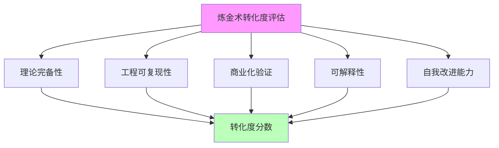

# 02.1.1-五维度评估体系

## 一、概述

五维度评估体系是 AI 炼金术转化度模型的核心框架，用于评估 AI 系统从"经验试错"（炼金术）向"精密科学"（化学）的转化程度。本文档阐述五维度评估体系、评估指标及其应用。

---

## 二、目录

- [02.1.1-五维度评估体系](#0211-五维度评估体系)
  - [一、概述](#一概述)
  - [二、目录](#二目录)
  - [三、五维度评估框架](#三五维度评估框架)
    - [2.1 评估维度](#21-评估维度)
  - [四、理论完备性](#四理论完备性)
    - [3.1 评估指标](#31-评估指标)
    - [3.2 典型产品分析](#32-典型产品分析)
  - [五、工程可复现性](#五工程可复现性)
    - [4.1 评估指标](#41-评估指标)
    - [4.2 典型产品分析](#42-典型产品分析)
  - [六、商业化验证](#六商业化验证)
    - [5.1 评估指标](#51-评估指标)
    - [5.2 典型产品分析](#52-典型产品分析)
  - [七、可解释性](#七可解释性)
    - [6.1 评估指标](#61-评估指标)
    - [6.2 典型产品分析](#62-典型产品分析)
  - [八、自我改进能力](#八自我改进能力)
    - [7.1 评估指标](#71-评估指标)
    - [7.2 典型产品分析](#72-典型产品分析)
  - [九、综合评估](#九综合评估)
    - [8.1 转化度计算](#81-转化度计算)
    - [8.2 典型产品转化度](#82-典型产品转化度)
  - [十、核心结论](#十核心结论)
  - [十一、相关主题](#十一相关主题)
  - [十二、参考文档](#十二参考文档)

## 三、五维度评估框架

### 2.1 评估维度

**五维度评估体系**：



**五维度定义**：

1. **理论完备性**：是否有完备的理论框架指导实践
2. **工程可复现性**：实验结果是否可复现
3. **商业化验证**：是否经过大规模商业化验证
4. **可解释性**：系统行为是否可解释
5. **自我改进能力**：系统是否具备自我改进能力

---

## 四、理论完备性

### 3.1 评估指标

**理论完备性评分**：

| **等级**    | **特征**                   | **示例**           | **分数** |
| ----------- | -------------------------- | ------------------ | -------- |
| **0-20%**   | 无理论指导，全靠经验       | 早期 Prompt 工程   | 10%      |
| **20-40%**  | 有局部理论，但无统一框架   | CoT、RLHF          | 30%      |
| **40-60%**  | 有理论框架，但边界模糊     | Scaling Law        | 50%      |
| **60-80%**  | 理论框架清晰，但未完全验证 | LLM-Modulo         | 70%      |
| **80-100%** | 完备理论，可精确预测       | 暂无（人类未达到） | 90%      |

### 3.2 典型产品分析

**GPT-4o**：

- **理论完备性**：20%
- **特征**：内部机制黑箱，无公开理论框架
- **优势**：商业化极致
- **劣势**：理论指导弱

**DeepSeek-R1**：

- **理论完备性**：35%
- **特征**：基于 RL 理论，但 GRPO 理论不完整
- **优势**：开源带来可复现性
- **劣势**：理论创新不足

**Claude 3.5**：

- **理论完备性**：25%
- **特征**：Constitutional AI 有理论框架，但不完整
- **优势**：工程优化最好
- **劣势**：理论边界模糊

---

## 五、工程可复现性

### 4.1 评估指标

**工程可复现性评分**：

| **等级**    | **特征**                   | **示例**                | **分数** |
| ----------- | -------------------------- | ----------------------- | -------- |
| **0-20%**   | 完全不可复现               | 早期 ChatGPT 插件系统   | 10%      |
| **20-40%**  | 部分可复现，但依赖特定环境 | 闭源模型                | 30%      |
| **40-60%**  | 可复现，但需要大量资源     | 开源模型（需 GPU 集群） | 50%      |
| **60-80%**  | 可复现，资源需求合理       | Llama 3.1（单机可运行） | 70%      |
| **80-100%** | 完全可复现，资源需求低     | 暂无（受硬件限制）      | 85%      |

### 4.2 典型产品分析

**GPT-4o**：

- **工程可复现性**：30%
- **特征**：闭源模型，无法复现
- **优势**：性能最优
- **劣势**：可复现性差

**DeepSeek-R1**：

- **工程可复现性**：20%
- **特征**：开源模型，但训练数据未公开
- **优势**：开源带来可复现性优势
- **劣势**：训练数据不可复现

**Claude 3.5**：

- **工程可复现性**：15%
- **特征**：闭源模型，工程细节未公开
- **优势**：工程优化最好
- **劣势**：可复现性最差

---

## 六、商业化验证

### 5.1 评估指标

**商业化验证评分**：

| **等级**    | **特征**           | **示例**               | **分数** |
| ----------- | ------------------ | ---------------------- | -------- |
| **0-20%**   | 无商业化验证       | 学术原型               | 10%      |
| **20-40%**  | 小规模商业化验证   | 初创公司产品           | 30%      |
| **40-60%**  | 中等规模商业化验证 | 企业级产品             | 50%      |
| **60-80%**  | 大规模商业化验证   | 头部公司产品           | 70%      |
| **80-100%** | 超大规模商业化验证 | OpenAI、Anthropic 产品 | 95%      |

### 5.2 典型产品分析

**GPT-4o**：

- **商业化验证**：95%
- **特征**：超大规模商业化验证，数百万用户
- **优势**：商业化极致
- **劣势**：成本高

**DeepSeek-R1**：

- **商业化验证**：80%
- **特征**：开源模型，社区广泛使用
- **优势**：成本低
- **劣势**：商业化程度较低

**Claude 3.5**：

- **商业化验证**：90%
- **特征**：大规模商业化验证，企业级应用
- **优势**：商业化成熟
- **劣势**：成本较高

---

## 七、可解释性

### 6.1 评估指标

**可解释性评分**：

| **等级**    | **特征**                   | **示例**         | **分数** |
| ----------- | -------------------------- | ---------------- | -------- |
| **0-20%**   | 完全黑箱，无法解释         | 早期深度学习模型 | 10%      |
| **20-40%**  | 部分可解释，但关键机制不明 | 标准 Transformer | 30%      |
| **40-60%**  | 可解释，但解释成本高       | 注意力可视化     | 50%      |
| **60-80%**  | 可解释，解释成本合理       | LLM-Modulo       | 70%      |
| **80-100%** | 完全可解释，解释成本低     | Tracr 白盒模型   | 90%      |

### 6.2 典型产品分析

**GPT-4o**：

- **可解释性**：70%
- **特征**：内部机制黑箱，但输出可解释
- **优势**：输出可解释
- **劣势**：内部机制不可解释

**DeepSeek-R1**：

- **可解释性**：60%
- **特征**：开源模型，可分析权重
- **优势**：可分析模型结构
- **劣势**：推理过程不可解释

**Claude 3.5**：

- **可解释性**：50%
- **特征**：Constitutional AI 提供规则解释
- **优势**：规则可解释
- **劣势**：模型行为不可解释

---

## 八、自我改进能力

### 7.1 评估指标

**自我改进能力评分**：

| **等级**    | **特征**                   | **示例**            | **分数** |
| ----------- | -------------------------- | ------------------- | -------- |
| **0-20%**   | 无自我改进能力             | 静态模型            | 10%      |
| **20-40%**  | 有自我改进能力，但效果有限 | 在线学习模型        | 30%      |
| **40-60%**  | 有自我改进能力，效果明显   | RLHF 模型           | 50%      |
| **60-80%**  | 有自我改进能力，效果显著   | 自我改进系统（SwS） | 70%      |
| **80-100%** | 完全自我改进，效果持续提升 | 暂无（理论空白）    | 85%      |

### 7.2 典型产品分析

**GPT-4o**：

- **自我改进能力**：40%
- **特征**：通过 RLHF 改进，但改进能力有限
- **优势**：改进效果明显
- **劣势**：改进能力受限

**DeepSeek-R1**：

- **自我改进能力**：65%
- **特征**：纯 RL 驱动，自我改进能力强
- **优势**：自我改进能力最强
- **劣势**：改进稳定性差

**Claude 3.5**：

- **自我改进能力**：45%
- **特征**：通过 RLHF 改进，但改进能力较弱
- **优势**：改进稳定性好
- **劣势**：改进能力有限

---

## 九、综合评估

### 8.1 转化度计算

**转化度计算公式**：

```text
转化度 = (理论完备性 × 0.25 + 工程可复现性 × 0.20 +
          商业化验证 × 0.20 + 可解释性 × 0.20 +
          自我改进能力 × 0.15) × 100%
```

**权重说明**：

- **理论完备性**：25%（最重要）
- **工程可复现性**：20%
- **商业化验证**：20%
- **可解释性**：20%
- **自我改进能力**：15%

### 8.2 典型产品转化度

**GPT-4o**：

```text
转化度 = (20% × 0.25 + 30% × 0.20 + 95% × 0.20 +
          70% × 0.20 + 40% × 0.15) × 100%
       = 50.5%
```

**DeepSeek-R1**：

```text
转化度 = (35% × 0.25 + 20% × 0.20 + 80% × 0.20 +
          60% × 0.20 + 65% × 0.15) × 100%
       = 50.0%
```

**Claude 3.5**：

```text
转化度 = (25% × 0.25 + 15% × 0.20 + 90% × 0.20 +
          50% × 0.20 + 45% × 0.15) × 100%
       = 47.0%
```

---

## 十、核心结论

1. **五维度评估体系是转化度模型的核心**：全面评估 AI 系统的成熟度
2. **理论完备性最重要**：权重 25%，决定系统科学性
3. **商业化验证和可解释性并重**：各占 20%，决定系统实用性
4. **工程可复现性和自我改进能力**：各占 20% 和 15%，决定系统可持续性

---

## 十一、相关主题

- [02.1.2-转化度计算方法](02.1.2-转化度计算方法.md)
- [02.1.3-典型产品转化度分析](02.1.3-典型产品转化度分析.md)
- [02.1.4-转化度提升路径](02.1.4-转化度提升路径.md)

---

## 十二、参考文档

- [AI 炼金术实践成熟度全景图谱](../../view/ai_model_view.md)
