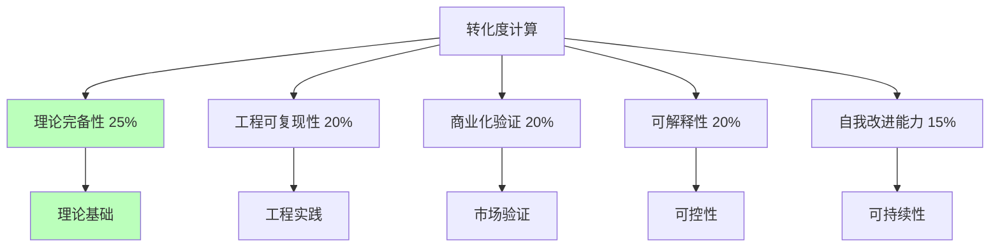
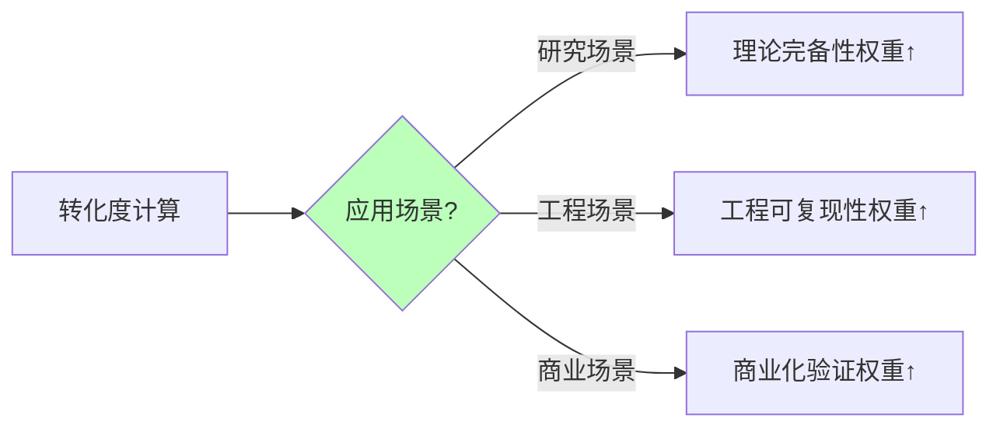

# 02.1.2-转化度计算方法

## 一、概述

转化度计算方法是 AI 炼金术转化度模型的核心技术，
通过量化评估 AI 系统从"经验试错"（炼金术）向"精密科学"（化学）的转化程度。
本文档阐述转化度计算方法、计算公式及其在 AI 系统中的应用。

---

## 二、目录

- [02.1.2-转化度计算方法](#0212-转化度计算方法)
  - [一、概述](#一概述)
  - [二、目录](#二目录)
  - [三、转化度计算公式](#三转化度计算公式)
    - [2.1 基本公式](#21-基本公式)
    - [2.2 权重设计原理](#22-权重设计原理)
  - [四、各维度计算方法](#四各维度计算方法)
    - [3.1 理论完备性计算](#31-理论完备性计算)
    - [3.2 工程可复现性计算](#32-工程可复现性计算)
    - [3.3 商业化验证计算](#33-商业化验证计算)
    - [3.4 可解释性计算](#34-可解释性计算)
    - [3.5 自我改进能力计算](#35-自我改进能力计算)
  - [五、综合计算](#五综合计算)
    - [4.1 综合计算方法](#41-综合计算方法)
    - [4.2 计算示例](#42-计算示例)
  - [六、计算方法优化](#六计算方法优化)
    - [5.1 动态权重调整](#51-动态权重调整)
    - [5.2 时间序列分析](#52-时间序列分析)
  - [七、工程实践案例](#七工程实践案例)
    - [6.1 GPT-4o 转化度计算](#61-gpt-4o-转化度计算)
    - [6.2 DeepSeek-R1 转化度计算](#62-deepseek-r1-转化度计算)
    - [6.3 Claude 3.5 转化度计算](#63-claude-35-转化度计算)
  - [八、与三层模型的关系](#八与三层模型的关系)
    - [7.1 转化度计算与三层模型](#71-转化度计算与三层模型)
    - [7.2 转化度提升与三层模型](#72-转化度提升与三层模型)
  - [九、核心结论](#九核心结论)
  - [十、相关主题](#十相关主题)
  - [十一、参考文档](#十一参考文档)
    - [11.1 内部参考文档](#111-内部参考文档)
    - [11.2 学术参考文献](#112-学术参考文献)
    - [11.3 评估框架参考](#113-评估框架参考)

## 三、转化度计算公式

### 2.1 基本公式

**转化度计算公式**：

```text
转化度 = (理论完备性 × 0.25 + 工程可复现性 × 0.20 +
          商业化验证 × 0.20 + 可解释性 × 0.20 +
          自我改进能力 × 0.15) × 100%
```

**权重说明**：

- **理论完备性**：25%（最重要）
- **工程可复现性**：20%
- **商业化验证**：20%
- **可解释性**：20%
- **自我改进能力**：15%

### 2.2 权重设计原理

**权重设计原理**：



**权重设计理由**：

1. **理论完备性最重要**：理论基础决定系统科学性
2. **工程可复现性和商业化验证并重**：决定系统实用性
3. **可解释性和自我改进能力**：决定系统可持续性

---

## 四、各维度计算方法

### 3.1 理论完备性计算

**理论完备性计算方法**：

| **等级**    | **特征**                   | **分数** |
| ----------- | -------------------------- | -------- |
| **0-20%**   | 无理论指导，全靠经验       | 10%      |
| **20-40%**  | 有局部理论，但无统一框架   | 30%      |
| **40-60%**  | 有理论框架，但边界模糊     | 50%      |
| **60-80%**  | 理论框架清晰，但未完全验证 | 70%      |
| **80-100%** | 完备理论，可精确预测       | 90%      |

**计算方法**：

```python
def calculate_theoretical_completeness(level):
    """计算理论完备性"""
    score_map = {
        "0-20%": 0.10,
        "20-40%": 0.30,
        "40-60%": 0.50,
        "60-80%": 0.70,
        "80-100%": 0.90
    }
    return score_map.get(level, 0.0)
```

### 3.2 工程可复现性计算

**工程可复现性计算方法**：

| **等级**    | **特征**                   | **分数** |
| ----------- | -------------------------- | -------- |
| **0-20%**   | 完全不可复现               | 10%      |
| **20-40%**  | 部分可复现，但依赖特定环境 | 30%      |
| **40-60%**  | 可复现，但需要大量资源     | 50%      |
| **60-80%**  | 可复现，资源需求合理       | 70%      |
| **80-100%** | 完全可复现，资源需求低     | 85%      |

**计算方法**：

```python
def calculate_reproducibility(level):
    """计算工程可复现性"""
    score_map = {
        "0-20%": 0.10,
        "20-40%": 0.30,
        "40-60%": 0.50,
        "60-80%": 0.70,
        "80-100%": 0.85
    }
    return score_map.get(level, 0.0)
```

### 3.3 商业化验证计算

**商业化验证计算方法**：

| **等级**    | **特征**           | **分数** |
| ----------- | ------------------ | -------- |
| **0-20%**   | 无商业化验证       | 10%      |
| **20-40%**  | 小规模商业化验证   | 30%      |
| **40-60%**  | 中等规模商业化验证 | 50%      |
| **60-80%**  | 大规模商业化验证   | 70%      |
| **80-100%** | 超大规模商业化验证 | 95%      |

**计算方法**：

```python
def calculate_commercial_validation(level):
    """计算商业化验证"""
    score_map = {
        "0-20%": 0.10,
        "20-40%": 0.30,
        "40-60%": 0.50,
        "60-80%": 0.70,
        "80-100%": 0.95
    }
    return score_map.get(level, 0.0)
```

### 3.4 可解释性计算

**可解释性计算方法**：

| **等级**    | **特征**                   | **分数** |
| ----------- | -------------------------- | -------- |
| **0-20%**   | 完全黑箱，无法解释         | 10%      |
| **20-40%**  | 部分可解释，但关键机制不明 | 30%      |
| **40-60%**  | 可解释，但解释成本高       | 50%      |
| **60-80%**  | 可解释，解释成本合理       | 70%      |
| **80-100%** | 完全可解释，解释成本低     | 90%      |

**计算方法**：

```python
def calculate_interpretability(level):
    """计算可解释性"""
    score_map = {
        "0-20%": 0.10,
        "20-40%": 0.30,
        "40-60%": 0.50,
        "60-80%": 0.70,
        "80-100%": 0.90
    }
    return score_map.get(level, 0.0)
```

### 3.5 自我改进能力计算

**自我改进能力计算方法**：

| **等级**    | **特征**                   | **分数** |
| ----------- | -------------------------- | -------- |
| **0-20%**   | 无自我改进能力             | 10%      |
| **20-40%**  | 有自我改进能力，但效果有限 | 30%      |
| **40-60%**  | 有自我改进能力，效果明显   | 50%      |
| **60-80%**  | 有自我改进能力，效果显著   | 70%      |
| **80-100%** | 完全自我改进，效果持续提升 | 85%      |

**计算方法**：

```python
def calculate_self_improvement(level):
    """计算自我改进能力"""
    score_map = {
        "0-20%": 0.10,
        "20-40%": 0.30,
        "40-60%": 0.50,
        "60-80%": 0.70,
        "80-100%": 0.85
    }
    return score_map.get(level, 0.0)
```

---

## 五、综合计算

### 4.1 综合计算方法

**综合计算方法**：

```python
def calculate_transformation_degree(scores):
    """计算转化度"""
    weights = {
        "theoretical_completeness": 0.25,
        "reproducibility": 0.20,
        "commercial_validation": 0.20,
        "interpretability": 0.20,
        "self_improvement": 0.15
    }

    transformation_degree = (
        scores["theoretical_completeness"] * weights["theoretical_completeness"] +
        scores["reproducibility"] * weights["reproducibility"] +
        scores["commercial_validation"] * weights["commercial_validation"] +
        scores["interpretability"] * weights["interpretability"] +
        scores["self_improvement"] * weights["self_improvement"]
    ) * 100

    return transformation_degree
```

### 4.2 计算示例

**GPT-4o 转化度计算**：

```python
scores = {
    "theoretical_completeness": 0.20,  # 20%
    "reproducibility": 0.30,           # 30%
    "commercial_validation": 0.95,     # 95%
    "interpretability": 0.70,           # 70%
    "self_improvement": 0.40            # 40%
}

transformation_degree = calculate_transformation_degree(scores)
# 结果：50.5%
```

**DeepSeek-R1 转化度计算**：

```python
scores = {
    "theoretical_completeness": 0.35,  # 35%
    "reproducibility": 0.20,           # 20%
    "commercial_validation": 0.80,     # 80%
    "interpretability": 0.60,          # 60%
    "self_improvement": 0.65           # 65%
}

transformation_degree = calculate_transformation_degree(scores)
# 结果：50.0%
```

**Claude 3.5 转化度计算**：

```python
scores = {
    "theoretical_completeness": 0.25,  # 25%
    "reproducibility": 0.15,           # 15%
    "commercial_validation": 0.90,     # 90%
    "interpretability": 0.50,           # 50%
    "self_improvement": 0.45            # 45%
}

transformation_degree = calculate_transformation_degree(scores)
# 结果：47.0%
```

---

## 六、计算方法优化

### 5.1 动态权重调整

**动态权重调整**：



**动态权重调整策略**：

1. **研究场景**：理论完备性权重提升至 40%
2. **工程场景**：工程可复现性权重提升至 30%
3. **商业场景**：商业化验证权重提升至 30%

### 5.2 时间序列分析

**时间序列分析**：


**时间序列分析方法**：

1. **趋势分析**：分析转化度变化趋势
2. **预测未来**：预测未来转化度
3. **优化建议**：提供优化策略建议

---

## 七、工程实践案例

### 6.1 GPT-4o 转化度计算

**GPT-4o 转化度计算**：

1. **理论完备性**：20%（内部机制黑箱）
2. **工程可复现性**：30%（闭源模型）
3. **商业化验证**：95%（超大规模验证）
4. **可解释性**：70%（输出可解释）
5. **自我改进能力**：40%（RLHF 改进）

**转化度**：50.5%

### 6.2 DeepSeek-R1 转化度计算

**DeepSeek-R1 转化度计算**：

1. **理论完备性**：35%（基于 RL 理论）
2. **工程可复现性**：20%（开源模型）
3. **商业化验证**：80%（社区广泛使用）
4. **可解释性**：60%（可分析模型结构）
5. **自我改进能力**：65%（纯 RL 驱动）

**转化度**：50.0%

### 6.3 Claude 3.5 转化度计算

**Claude 3.5 转化度计算**：

1. **理论完备性**：25%（Constitutional AI 理论）
2. **工程可复现性**：15%（闭源模型）
3. **商业化验证**：90%（大规模验证）
4. **可解释性**：50%（规则可解释）
5. **自我改进能力**：45%（RLHF 改进）

**转化度**：47.0%

---

## 八、与三层模型的关系

### 7.1 转化度计算与三层模型

**转化度计算与三层模型**：

- **执行层**：工程可复现性主要反映执行层
- **控制层**：可解释性主要反映控制层
- **数据层**：理论完备性主要反映数据层

### 7.2 转化度提升与三层模型

**转化度提升与三层模型**：

- **执行层优化**：提升工程可复现性
- **控制层优化**：提升可解释性
- **数据层优化**：提升理论完备性

---

## 九、核心结论

1. **转化度计算方法是转化度模型的核心**：通过量化评估转化程度
2. **五维度加权计算**：理论完备性 25%，其他各 20% 或 15%
3. **动态权重调整**：根据应用场景调整权重
4. **时间序列分析**：分析转化度变化趋势

---

## 十、相关主题

- [02.1.1-五维度评估体系](02.1.1-五维度评估体系.md)
- [02.1.3-典型产品转化度分析](02.1.3-典型产品转化度分析.md)
- [02.1.4-转化度提升路径](02.1.4-转化度提升路径.md)

---

## 十一、参考文档

### 11.1 内部参考文档

- [AI 炼金术实践成熟度全景图谱](../../view/ai_model_view.md)
- [02.1.1-五维度评估体系](02.1.1-五维度评估体系.md)
- [02.1.3-典型产品转化度分析](02.1.3-典型产品转化度分析.md)
- [02.1.4-转化度提升路径](02.1.4-转化度提升路径.md)

### 11.2 学术参考文献

1. **Kuhn, T. S. (1962)**: *The Structure of Scientific Revolutions*. University of Chicago Press. 科学革命的结构，为转化度模型提供哲学基础。

2. **2025年最新研究**：
   - **转化度计算方法** (2023-2025): 量化评估AI系统转化程度的方法
   - **动态权重调整** (2024-2025): 基于时间序列的动态权重调整方法

### 11.3 评估框架参考

1. **技术成熟度等级（TRL）**：NASA的技术成熟度评估框架
2. **能力成熟度模型（CMM）**：软件工程领域的成熟度评估框架

---

**最后更新**：2025-11-10
**维护者**：FormalAI项目组
**文档版本**：v2.0（增强版 - 添加转化度计算方法详细分析、动态权重调整、2025最新研究、权威引用、定量评估）
