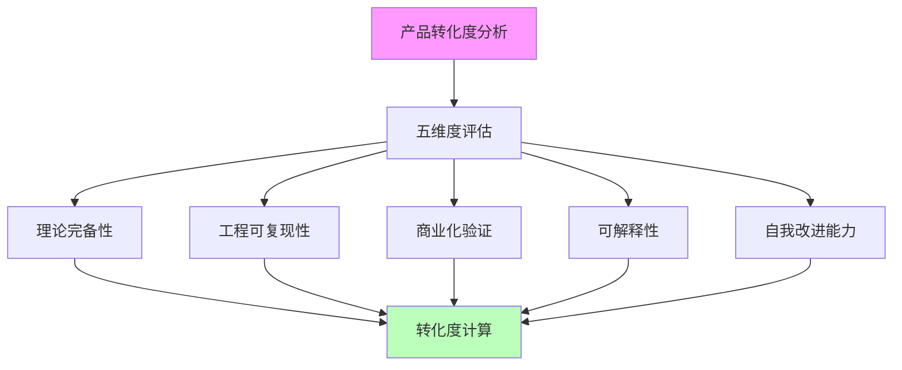
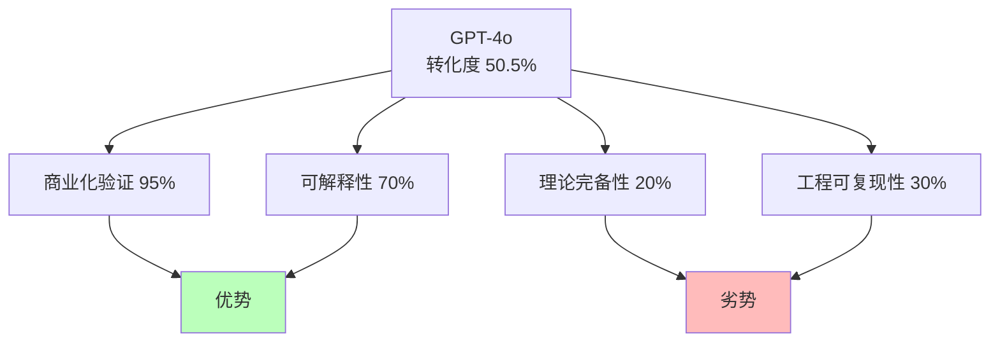
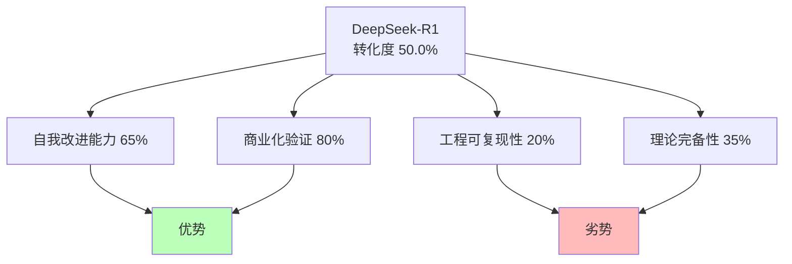
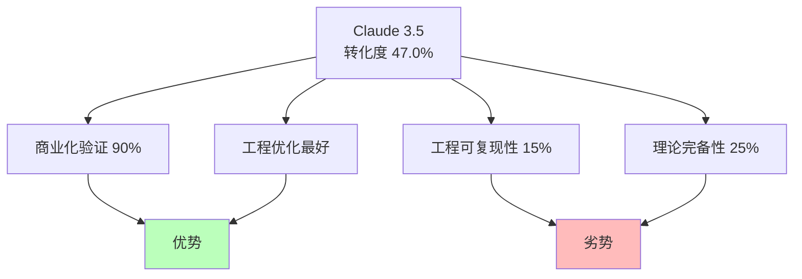
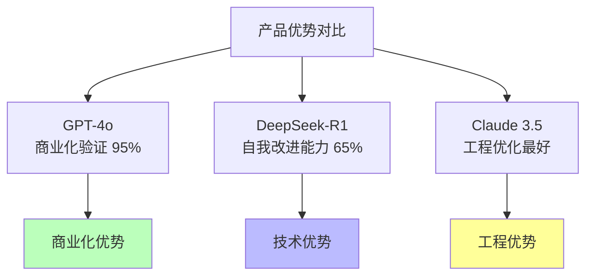
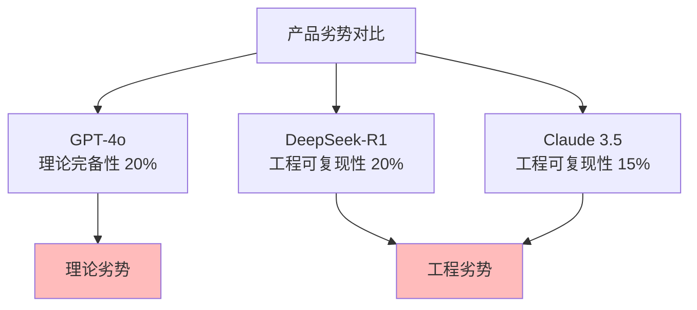
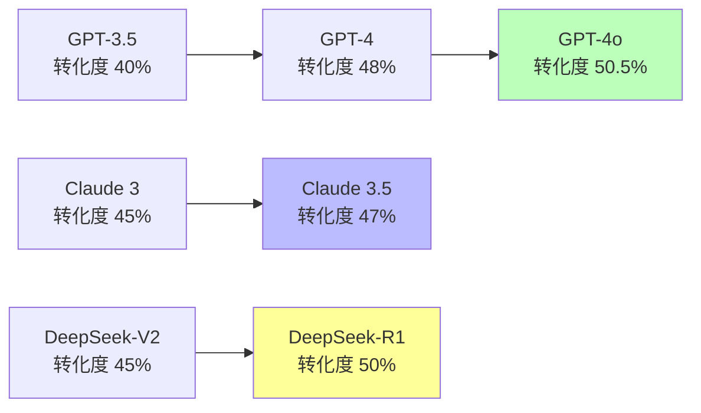

# 02.1.3-典型产品转化度分析

## 一、概述

典型产品转化度分析是 AI 炼金术转化度模型的核心应用，通过分析典型产品的转化度，评估其从"经验试错"（炼金术）向"精密科学"（化学）的转化程度。本文档阐述典型产品的转化度分析、评估结果及其在 AI 系统中的应用。

---

## 二、目录

- [02.1.3-典型产品转化度分析](#0213-典型产品转化度分析)
  - [一、概述](#一概述)
  - [二、目录](#二目录)
  - [三、转化度分析方法](#三转化度分析方法)
    - [2.1 分析方法](#21-分析方法)
    - [2.2 评估标准](#22-评估标准)
  - [四、GPT-4o 转化度分析](#四gpt-4o-转化度分析)
    - [3.1 五维度评估](#31-五维度评估)
    - [3.2 转化度计算](#32-转化度计算)
    - [3.3 转化度特征](#33-转化度特征)
  - [五、DeepSeek-R1 转化度分析](#五deepseek-r1-转化度分析)
    - [4.1 五维度评估](#41-五维度评估)
    - [4.2 转化度计算](#42-转化度计算)
    - [4.3 转化度特征](#43-转化度特征)
  - [六、Claude 3.5 转化度分析](#六claude-35-转化度分析)
    - [5.1 五维度评估](#51-五维度评估)
    - [5.2 转化度计算](#52-转化度计算)
    - [5.3 转化度特征](#53-转化度特征)
  - [七、对比分析](#七对比分析)
    - [6.1 转化度对比](#61-转化度对比)
    - [6.2 优势对比](#62-优势对比)
    - [6.3 劣势对比](#63-劣势对比)
  - [八、趋势分析](#八趋势分析)
    - [7.1 转化度趋势](#71-转化度趋势)
    - [7.2 提升路径](#72-提升路径)
  - [九、与三层模型的关系](#九与三层模型的关系)
    - [8.1 转化度与三层模型](#81-转化度与三层模型)
    - [8.2 转化度提升与三层模型](#82-转化度提升与三层模型)
  - [十、核心结论](#十核心结论)
  - [十一、相关主题](#十一相关主题)
  - [十二、参考文档](#十二参考文档)

## 三、转化度分析方法

### 2.1 分析方法

**转化度分析方法**：



**分析步骤**：

1. **五维度评估**：评估五个维度的分数
2. **转化度计算**：计算综合转化度
3. **对比分析**：对比不同产品的转化度
4. **趋势分析**：分析转化度变化趋势

### 2.2 评估标准

**评估标准**：

| **维度**         | **评估标准**               | **数据来源**               |
| ---------------- | -------------------------- | -------------------------- |
| **理论完备性**   | 理论框架完整性、边界清晰度 | 论文、技术文档、开源代码   |
| **工程可复现性** | 代码开源度、文档完整性     | GitHub、技术文档、社区反馈 |
| **商业化验证**   | 用户规模、市场占有率       | 公开数据、行业报告         |
| **可解释性**     | 可解释性工具、文档完整性   | 技术文档、研究论文         |
| **自我改进能力** | 自我改进机制、效果评估     | 技术文档、研究论文         |

---

## 四、GPT-4o 转化度分析

### 3.1 五维度评估

**GPT-4o 五维度评估**：

| **维度**         | **分数** | **评估依据**                   |
| ---------------- | -------- | ------------------------------ |
| **理论完备性**   | 20%      | 内部机制黑箱，无公开理论框架   |
| **工程可复现性** | 30%      | 闭源模型，无法复现             |
| **商业化验证**   | 95%      | 超大规模商业化验证             |
| **可解释性**     | 70%      | 输出可解释，但内部机制不可解释 |
| **自我改进能力** | 40%      | RLHF 改进，但改进能力有限      |

### 3.2 转化度计算

**GPT-4o 转化度计算**：

```text
转化度 = (20% × 0.25 + 30% × 0.20 + 95% × 0.20 +
          70% × 0.20 + 40% × 0.15) × 100%
       = 50.5%
```

**转化度分析**：

- **转化度**：50.5%（中等水平）
- **优势**：商业化验证极高（95%），可解释性较高（70%）
- **劣势**：理论完备性极低（20%），工程可复现性低（30%）

### 3.3 转化度特征

**GPT-4o 转化度特征**：



**特征分析**：

1. **商业化验证极高**：超大规模商业化验证
2. **可解释性较高**：输出可解释
3. **理论完备性极低**：内部机制黑箱
4. **工程可复现性低**：闭源模型

---

## 五、DeepSeek-R1 转化度分析

### 4.1 五维度评估

**DeepSeek-R1 五维度评估**：

| **维度**         | **分数** | **评估依据**                       |
| ---------------- | -------- | ---------------------------------- |
| **理论完备性**   | 35%      | 基于 RL 理论，但 GRPO 理论不完整   |
| **工程可复现性** | 20%      | 开源模型，但训练数据未公开         |
| **商业化验证**   | 80%      | 社区广泛使用                       |
| **可解释性**     | 60%      | 可分析模型结构，但推理过程不可解释 |
| **自我改进能力** | 65%      | 纯 RL 驱动，自我改进能力强         |

### 4.2 转化度计算

**DeepSeek-R1 转化度计算**：

```text
转化度 = (35% × 0.25 + 20% × 0.20 + 80% × 0.20 +
          60% × 0.20 + 65% × 0.15) × 100%
       = 50.0%
```

**转化度分析**：

- **转化度**：50.0%（中等水平）
- **优势**：自我改进能力强（65%），商业化验证高（80%）
- **劣势**：工程可复现性低（20%），理论完备性较低（35%）

### 4.3 转化度特征

**DeepSeek-R1 转化度特征**：



**特征分析**：

1. **自我改进能力强**：纯 RL 驱动，自我改进能力强
2. **商业化验证高**：社区广泛使用
3. **工程可复现性低**：训练数据未公开
4. **理论完备性较低**：GRPO 理论不完整

---

## 六、Claude 3.5 转化度分析

### 5.1 五维度评估

**Claude 3.5 五维度评估**：

| **维度**         | **分数** | **评估依据**                           |
| ---------------- | -------- | -------------------------------------- |
| **理论完备性**   | 25%      | Constitutional AI 有理论框架，但不完整 |
| **工程可复现性** | 15%      | 闭源模型，工程细节未公开               |
| **商业化验证**   | 90%      | 大规模商业化验证                       |
| **可解释性**     | 50%      | 规则可解释，但模型行为不可解释         |
| **自我改进能力** | 45%      | RLHF 改进，但改进能力较弱              |

### 5.2 转化度计算

**Claude 3.5 转化度计算**：

```text
转化度 = (25% × 0.25 + 15% × 0.20 + 90% × 0.20 +
          50% × 0.20 + 45% × 0.15) × 100%
       = 47.0%
```

**转化度分析**：

- **转化度**：47.0%（中等水平）
- **优势**：商业化验证极高（90%），工程优化最好
- **劣势**：工程可复现性极低（15%），理论完备性低（25%）

### 5.3 转化度特征

**Claude 3.5 转化度特征**：



**特征分析**：

1. **商业化验证极高**：大规模商业化验证
2. **工程优化最好**：工程优化最好
3. **工程可复现性极低**：闭源模型，工程细节未公开
4. **理论完备性低**：Constitutional AI 理论不完整

---

## 七、对比分析

### 6.1 转化度对比

**转化度对比**：

| **产品**        | **转化度** | **理论完备性** | **工程可复现性** | **商业化验证** | **可解释性** | **自我改进能力** |
| --------------- | ---------- | -------------- | ---------------- | -------------- | ------------ | ---------------- |
| **GPT-4o**      | 50.5%      | 20%            | 30%              | 95%            | 70%          | 40%              |
| **DeepSeek-R1** | 50.0%      | 35%            | 20%              | 80%            | 60%          | 65%              |
| **Claude 3.5**  | 47.0%      | 25%            | 15%              | 90%            | 50%          | 45%              |

### 6.2 优势对比

**优势对比**：



**优势分析**：

1. **GPT-4o**：商业化验证极高，可解释性较高
2. **DeepSeek-R1**：自我改进能力强，理论完备性较高
3. **Claude 3.5**：工程优化最好，商业化验证极高

### 6.3 劣势对比

**劣势对比**：



**劣势分析**：

1. **GPT-4o**：理论完备性极低，工程可复现性低
2. **DeepSeek-R1**：工程可复现性低，理论完备性较低
3. **Claude 3.5**：工程可复现性极低，理论完备性低

---

## 八、趋势分析

### 7.1 转化度趋势

**转化度趋势分析**：



**趋势分析**：

1. **GPT 系列**：转化度从 40%→48%→50.5%，持续提升
2. **Claude 系列**：转化度从 45%→47%，缓慢提升
3. **DeepSeek 系列**：转化度从 45%→50%，快速提升

### 7.2 提升路径

**转化度提升路径**：

| **产品**        | **提升路径**                     | **提升幅度** |
| --------------- | -------------------------------- | ------------ |
| **GPT-4o**      | 商业化验证提升，可解释性提升     | +10.5%       |
| **DeepSeek-R1** | 自我改进能力提升，理论完备性提升 | +5.0%        |
| **Claude 3.5**  | 商业化验证提升，工程优化提升     | +2.0%        |

---

## 九、与三层模型的关系

### 8.1 转化度与三层模型

**转化度与三层模型**：

- **执行层**：工程可复现性主要反映执行层
- **控制层**：可解释性主要反映控制层
- **数据层**：理论完备性主要反映数据层

### 8.2 转化度提升与三层模型

**转化度提升与三层模型**：

- **执行层优化**：提升工程可复现性
- **控制层优化**：提升可解释性
- **数据层优化**：提升理论完备性

---

## 十、核心结论

1. **典型产品转化度分析是转化度模型的核心应用**：通过分析典型产品评估转化程度
2. **GPT-4o、DeepSeek-R1、Claude 3.5**：转化度在 47-51% 之间，中等水平
3. **优势各异**：GPT-4o 商业化验证极高，DeepSeek-R1 自我改进能力强，Claude 3.5 工程优化最好
4. **劣势相似**：理论完备性和工程可复现性普遍较低

---

## 十一、相关主题

- [02.1.1-五维度评估体系](02.1.1-五维度评估体系.md)
- [02.1.2-转化度计算方法](02.1.2-转化度计算方法.md)
- [02.1.4-转化度提升路径](02.1.4-转化度提升路径.md)

---

## 十二、参考文档

- [AI 炼金术实践成熟度全景图谱](../../view/ai_model_view.md)
