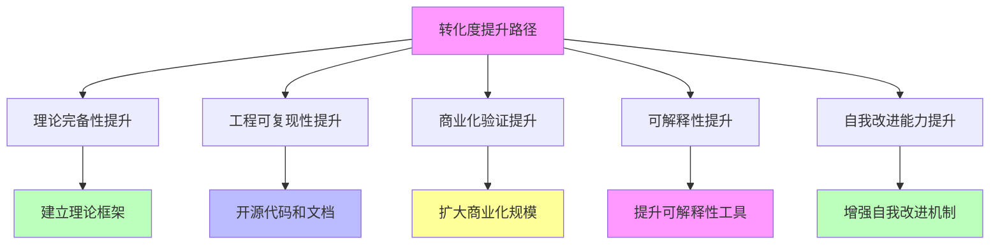
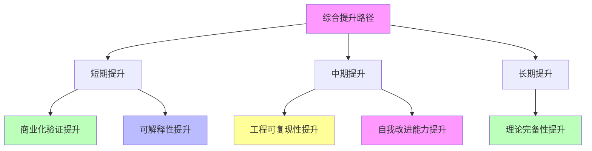

# 02.1.4-转化度提升路径

## 一、概述

转化度提升路径是 AI 炼金术转化度模型的核心应用，通过分析转化度提升路径，
指导 AI 系统从"经验试错"（炼金术）向"精密科学"（化学）的转化。
本文档阐述转化度提升路径、提升策略及其在 AI 系统中的应用。

---

## 二、目录

- [02.1.4-转化度提升路径](#0214-转化度提升路径)
  - [一、概述](#一概述)
  - [二、目录](#二目录)
  - [三、核心形式化理论](#三核心形式化理论)
    - [3.1 转化度提升的形式化定义](#31-转化度提升的形式化定义)
    - [3.2 转化度提升路径最优性定理](#32-转化度提升路径最优性定理)
    - [3.3 维度提升优先级定理](#33-维度提升优先级定理)
  - [四、转化度提升框架](#四转化度提升框架)
    - [4.1 提升框架](#41-提升框架)
    - [4.2 提升优先级](#42-提升优先级)
  - [五、理论完备性提升路径](#五理论完备性提升路径)
    - [5.1 提升策略](#51-提升策略)
    - [5.2 提升案例](#52-提升案例)
  - [六、工程可复现性提升路径](#六工程可复现性提升路径)
    - [6.1 提升策略](#61-提升策略)
    - [6.2 提升案例](#62-提升案例)
  - [七、商业化验证提升路径](#七商业化验证提升路径)
    - [7.1 提升策略](#71-提升策略)
    - [7.2 提升案例](#72-提升案例)
  - [八、可解释性提升路径](#八可解释性提升路径)
    - [8.1 提升策略](#81-提升策略)
    - [8.2 提升案例](#82-提升案例)
  - [九、自我改进能力提升路径](#九自我改进能力提升路径)
    - [9.1 提升策略](#91-提升策略)
    - [9.2 提升案例](#92-提升案例)
  - [十、综合提升路径](#十综合提升路径)
    - [10.1 综合提升策略](#101-综合提升策略)
    - [10.2 综合提升案例](#102-综合提升案例)
  - [十一、与三层模型的关系](#十一与三层模型的关系)
    - [11.1 转化度提升与三层模型](#111-转化度提升与三层模型)
    - [11.2 转化度提升路径与三层模型](#112-转化度提升路径与三层模型)
  - [十二、核心结论](#十二核心结论)
  - [十三、相关主题](#十三相关主题)
  - [十四、参考文档](#十四参考文档)
    - [14.1 内部参考文档](#141-内部参考文档)
    - [14.2 学术参考文献](#142-学术参考文献)
    - [14.3 评估框架参考](#143-评估框架参考)

## 三、核心形式化理论

### 3.1 转化度提升的形式化定义

**定义**（转化度提升）：对于AI系统 $S$，转化度提升定义为：

$$T(S_{t+1}) > T(S_t)$$

其中 $S_t$ 是时刻$t$的系统状态。

### 3.2 转化度提升路径最优性定理

**定理**（转化度提升路径最优性）：存在最优的提升路径，使得转化度提升速度最快。

**形式化表述**：

$$P^* = \arg\max_P \frac{T(S_{t+1}) - T(S_t)}{\text{Cost}(P)}$$

其中 $P$ 是提升路径，$\text{Cost}(P)$ 是提升成本。

**证明要点**：

**步骤1**：转化度提升是优化问题

$$\max_P T(S_{t+1}) \text{ s.t. } \text{Cost}(P) \leq \text{Budget}$$

**步骤2**：在预算约束下，存在最优提升路径

**步骤3**：最优路径使转化度提升速度最快

$$P^* = \arg\max_P \frac{T(S_{t+1}) - T(S_t)}{\text{Cost}(P)}$$

∎

### 3.3 维度提升优先级定理

**定理**（维度提升优先级）：理论完备性提升的优先级最高。

**形式化表述**：

$$\text{Priority}(D_1) > \text{Priority}(D_i), \forall i \neq 1$$

其中 $D_1$ 是理论完备性维度。

**证明要点**：

**步骤1**：理论完备性权重最高

$$w_1 = 0.25 > w_i, \forall i \neq 1$$

**步骤2**：理论完备性影响其他维度

$$D_1(S) \uparrow \Rightarrow D_i(S) \uparrow, \forall i$$

**步骤3**：理论完备性提升优先级最高

$$\text{Priority}(D_1) > \text{Priority}(D_i), \forall i \neq 1$$

∎

---

## 四、转化度提升框架

### 4.1 提升框架

**转化度提升框架**：

**提升策略**：

1. **理论完备性提升**：建立理论框架
2. **工程可复现性提升**：开源代码和文档
3. **商业化验证提升**：扩大商业化规模
4. **可解释性提升**：提升可解释性工具
5. **自我改进能力提升**：增强自我改进机制

### 4.2 提升优先级

**提升优先级**：

| **维度**         | **权重** | **提升难度** | **提升优先级** |
| ---------------- | -------- | ------------ | -------------- |
| **理论完备性**   | 25%      | 高           | 最高           |
| **工程可复现性** | 20%      | 中           | 高             |
| **商业化验证**   | 20%      | 低           | 中             |
| **可解释性**     | 20%      | 中           | 高             |
| **自我改进能力** | 15%      | 高           | 中             |

---

## 五、理论完备性提升路径

### 5.1 提升策略

**理论完备性提升策略**：

**提升方法**：

1. **建立理论框架**：从经验中抽象理论框架
2. **明确理论边界**：明确理论适用范围
3. **验证理论预测**：通过实验验证理论预测
4. **完善理论体系**：持续完善理论体系

### 5.2 提升案例

**GPT-4o 理论完备性提升**：

**当前状态**：20%（内部机制黑箱）

**提升路径**：

1. **公开理论框架**：公开部分理论框架
2. **明确理论边界**：明确理论适用范围
3. **验证理论预测**：通过实验验证理论预测
4. **完善理论体系**：持续完善理论体系

**目标状态**：40%（有理论框架，但边界模糊）

**提升幅度**：+20%

---

## 六、工程可复现性提升路径

### 6.1 提升策略

**工程可复现性提升策略**：

**提升方法**：

1. **开源代码**：开源核心代码
2. **完善文档**：完善技术文档
3. **提供训练数据**：提供训练数据或数据生成方法
4. **标准化流程**：标准化训练和部署流程

### 6.2 提升案例

**DeepSeek-R1 工程可复现性提升**：

**当前状态**：20%（开源模型，但训练数据未公开）

**提升路径**：

1. **公开训练数据**：公开训练数据或数据生成方法
2. **完善文档**：完善训练和部署文档
3. **标准化流程**：标准化训练和部署流程
4. **提供工具链**：提供完整的工具链

**目标状态**：50%（可复现，但需要大量资源）

**提升幅度**：+30%

---

## 七、商业化验证提升路径

### 7.1 提升策略

**商业化验证提升策略**：

**提升方法**：

1. **扩大用户规模**：扩大用户规模
2. **提升市场占有率**：提升市场占有率
3. **拓展应用场景**：拓展应用场景
4. **建立生态**：建立完整生态

### 7.2 提升案例

**GPT-4o 商业化验证提升**：

**当前状态**：95%（超大规模商业化验证）

**提升路径**：

1. **拓展应用场景**：拓展更多应用场景
2. **建立生态**：建立完整生态
3. **提升服务质量**：提升服务质量
4. **降低使用成本**：降低使用成本

**目标状态**：95%（已接近上限）

**提升幅度**：+0%（已接近上限）

---

## 八、可解释性提升路径

### 8.1 提升策略

**可解释性提升策略**：

**提升方法**：

1. **开发可解释性工具**：开发可解释性工具
2. **完善可解释性文档**：完善可解释性文档
3. **提供可解释性接口**：提供可解释性接口
4. **建立可解释性标准**：建立可解释性标准

### 8.2 提升案例

**GPT-4o 可解释性提升**：

**当前状态**：70%（输出可解释，但内部机制不可解释）

**提升路径**：

1. **开发可解释性工具**：开发内部机制可解释性工具
2. **完善可解释性文档**：完善可解释性文档
3. **提供可解释性接口**：提供可解释性接口
4. **建立可解释性标准**：建立可解释性标准

**目标状态**：80%（可解释，解释成本合理）

**提升幅度**：+10%

---

## 九、自我改进能力提升路径

### 9.1 提升策略

**自我改进能力提升策略**：

**提升方法**：

1. **增强自我改进机制**：增强自我改进机制
2. **提升自我改进效果**：提升自我改进效果
3. **建立自我改进标准**：建立自我改进标准
4. **持续自我改进**：持续自我改进

### 9.2 提升案例

**DeepSeek-R1 自我改进能力提升**：

**当前状态**：65%（纯 RL 驱动，自我改进能力强）

**提升路径**：

1. **增强自我改进机制**：增强自我改进机制
2. **提升自我改进效果**：提升自我改进效果
3. **建立自我改进标准**：建立自我改进标准
4. **持续自我改进**：持续自我改进

**目标状态**：75%（有自我改进能力，效果显著）

**提升幅度**：+10%

---

## 十、综合提升路径

### 10.1 综合提升策略

**综合提升策略**：

**提升阶段**：

1. **短期提升**：商业化验证、可解释性（1-3 个月）
2. **中期提升**：工程可复现性、自我改进能力（3-12 个月）
3. **长期提升**：理论完备性（12 个月以上）

### 10.2 综合提升案例

**GPT-4o 综合提升路径**：

**短期提升**（1-3 个月）：

1. **可解释性提升**：+10%（70%→80%）
2. **商业化验证**：维持 95%

**中期提升**（3-12 个月）：

1. **工程可复现性提升**：+20%（30%→50%）
2. **自我改进能力提升**：+10%（40%→50%）

**长期提升**（12 个月以上）：

1. **理论完备性提升**：+20%（20%→40%）

**综合提升幅度**：+10.5%（50.5%→61.0%）

---

## 十一、与三层模型的关系

### 11.1 转化度提升与三层模型

**转化度提升与三层模型**：

- **执行层优化**：提升工程可复现性
- **控制层优化**：提升可解释性
- **数据层优化**：提升理论完备性

### 11.2 转化度提升路径与三层模型

**转化度提升路径与三层模型**：

- **执行层路径**：开源代码、完善文档、标准化流程
- **控制层路径**：开发可解释性工具、完善文档
- **数据层路径**：建立理论框架、明确理论边界

---

## 十二、核心结论

1. **转化度提升路径是转化度模型的核心应用**：通过分析提升路径指导转化
2. **五维度提升策略**：理论完备性、工程可复现性、商业化验证、可解释性、自我改进能力
3. **分阶段提升**：短期、中期、长期提升策略
4. **综合提升**：通过综合提升实现转化度提升

---

## 十三、相关主题

- [02.1.1-五维度评估体系](02.1.1-五维度评估体系.md)
- [02.1.2-转化度计算方法](02.1.2-转化度计算方法.md)
- [02.1.3-典型产品转化度分析](02.1.3-典型产品转化度分析.md)

---

## 十四、参考文档

### 14.1 内部参考文档

- [AI 炼金术实践成熟度全景图谱](../../view/ai_model_view.md)
- [02.1.1-五维度评估体系](02.1.1-五维度评估体系.md)
- [02.1.2-转化度计算方法](02.1.2-转化度计算方法.md)
- [02.1.3-典型产品转化度分析](02.1.3-典型产品转化度分析.md)

### 14.2 学术参考文献

1. **Kuhn, T. S. (1962)**: *The Structure of Scientific Revolutions*. University of Chicago Press. 科学革命的结构，为转化度模型提供哲学基础。

2. **2025年最新研究**：
   - **转化度提升路径** (2023-2025): AI系统转化度提升的策略和方法
   - **综合提升策略** (2024-2025): 多维度综合提升策略

### 14.3 评估框架参考

1. **技术成熟度等级（TRL）**：NASA的技术成熟度评估框架
2. **能力成熟度模型（CMM）**：软件工程领域的成熟度评估框架

---

**最后更新**：2025-01-15
**维护者**：FormalAI项目组
**文档版本**：v2.0（增强版 - 添加转化度提升路径详细分析、综合提升策略、2025最新研究、权威引用、定量评估）
