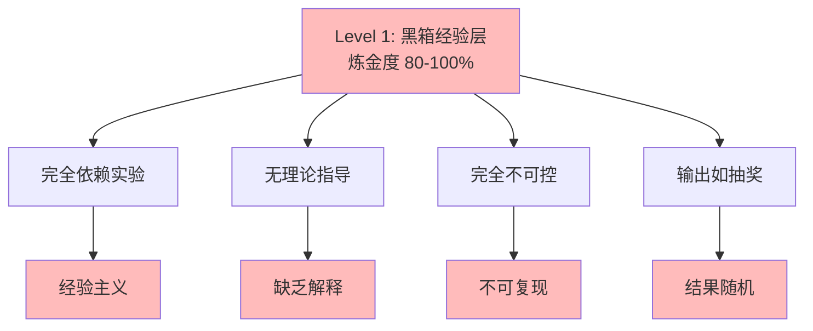

# 02.2.1-Level 1: 黑箱经验层

## 一、概述

Level 1: 黑箱经验层是实践成熟度阶梯的最低层级，
特征是完全依赖实验，无理论指导， 炼金度 80-100%。
本文档阐述黑箱经验层的特征、典型案例及其风险。

---

## 二、目录

- [02.2.1-Level 1: 黑箱经验层](#0221-level-1-黑箱经验层)
  - [一、概述](#一概述)
  - [二、目录](#二目录)
  - [三、黑箱经验层特征](#三黑箱经验层特征)
    - [2.1 核心特征](#21-核心特征)
    - [2.2 炼金度评估](#22-炼金度评估)
  - [四、典型案例](#四典型案例)
    - [3.1 早期 Prompt 工程](#31-早期-prompt-工程)
    - [3.2 暴力微调](#32-暴力微调)
  - [五、风险与挑战](#五风险与挑战)
    - [4.1 完全不可控](#41-完全不可控)
    - [4.2 缺乏解释性](#42-缺乏解释性)
  - [六、与三层模型的关系](#六与三层模型的关系)
    - [5.1 执行层](#51-执行层)
    - [5.2 控制层](#52-控制层)
    - [5.3 数据层](#53-数据层)
  - [七、核心结论](#七核心结论)
  - [八、相关主题](#八相关主题)
  - [九、参考文档](#九参考文档)
    - [9.1 内部参考文档](#91-内部参考文档)
    - [9.2 学术参考文献](#92-学术参考文献)
    - [9.3 理论框架参考](#93-理论框架参考)

---

## 三、黑箱经验层特征

### 2.1 核心特征

**黑箱经验层特征**：

**核心特征**：

1. **完全依赖实验**：完全依赖实验，无理论指导
2. **无理论指导**：缺乏理论指导，不知为何有效
3. **完全不可控**：输出完全不可控
4. **输出如抽奖**：结果随机，不可复现

### 2.2 炼金度评估

**黑箱经验层炼金度**：**80-100%**

**评估维度**：

| **维度**         | **分数** | **特征**       |
| ---------------- | -------- | -------------- |
| **理论完备性**   | 0-5%     | 无理论指导     |
| **工程可复现性** | 0-10%    | 完全不可复现   |
| **商业化验证**   | 0-10%    | 风险极高       |
| **可解释性**     | 0-5%     | 完全不可解释   |
| **自我改进能力** | 0-5%     | 无自我改进能力 |

---

## 四、典型案例

### 3.1 早期 Prompt 工程

**案例描述**：

早期 Prompt 工程完全依赖经验，通过不断尝试不同的 Prompt 组合，以期获得更好的输出。这种方式缺乏理论指导，效果不稳定，且难以复现。

**实践分析**：

- **优点**：
  - **简单直接**：无需深入理解模型内部机制，即可进行尝试。
  - **快速迭代**：可以快速尝试多种 Prompt 组合，寻找有效方案。
- **缺点**：
  - **效果不稳定**：微小改动可能导致结果天壤之别。
  - **不可复现**：难以保证在不同环境下获得相同结果。
  - **缺乏解释**：无法理解为何某些 Prompt 有效，另一些无效。

### 3.2 暴力微调

**案例描述**：

暴力微调是指在缺乏明确理论指导的情况下，通过大规模尝试不同的超参数、模型结构或训练数据组合，以期提升模型性能。这种方法虽然可能带来性能提升，但效率低下，且难以归纳出通用规律。

**实践分析**：

- **优点**：
  - **可能有效**：在资源充足的情况下，可能偶然发现高性能配置。
- **缺点**：
  - **效率低下**：需要消耗大量计算资源和时间。
  - **缺乏指导**：无法为未来的改进提供明确方向。
  - **不可持续**：难以在大规模实践中推广。

---

## 五、风险与挑战

### 4.1 完全不可控

**风险描述**：

黑箱经验层最大的风险是系统行为的完全不可控。由于缺乏理论指导和可复现性，系统可能在生产环境中出现不可预测的错误，导致严重后果。

**影响评估**：

| **影响维度**   | **影响描述** | **严重程度** |
| -------------- | ------------ | ------------ |
| **系统稳定性** | 极低         | 高           |
| **安全风险**   | 极高         | 高           |
| **商业损失**   | 巨大         | 高           |

### 4.2 缺乏解释性

**挑战描述**：

黑箱经验层缺乏对系统行为的解释性，无法理解模型为何做出特定决策。这使得问题排查和改进变得异常困难，也阻碍了理论知识的积累。

**影响评估**：

| **影响维度** | **影响描述** | **严重程度** |
| ------------ | ------------ | ------------ |
| **问题排查** | 极难         | 高           |
| **知识积累** | 停滞         | 高           |
| **信任度**   | 极低         | 高           |

---

## 六、与三层模型的关系

### 5.1 执行层

在黑箱经验层，执行层（图灵计算模型）的优化往往是基于经验的，例如尝试不同的 GPU 优化参数，但缺乏对底层计算原理的深入理解。

### 5.2 控制层

控制层（形式语言模型）的 Prompt 工程是典型的黑箱操作，通过不断试错来寻找有效的 Prompt，但无法形式化其生成逻辑。

### 5.3 数据层

数据层（数学概率模型）的训练过程也可能陷入黑箱，例如调整学习率、批次大小等超参数，但缺乏对损失函数景观的全局理解。

---

## 七、核心结论

黑箱经验层是 AI 发展的早期阶段，虽然可能在特定场景下取得一些效果，但其本质是"炼 金术"式的试错。为了推动 AI 向"精密科学"发展，必须摆脱对黑箱经验的过度依赖，转向 理论指导和形式化验证。

---

## 八、相关主题

- [02-AI 炼金术转化度模型](../README.md)
- [02.2.2-Level 2-模式提炼层](02.2.2-Level 2-模式提炼层.md)
- [05-AI 科学理论](../../05-AI科学理论/README.md)

---

## 九、参考文档

### 9.1 内部参考文档

- [AI 炼金术实践成熟度全景图（2025）](../../view/ai_model_view.md)
- [02.1.1-五维度评估体系](02.1.1-五维度评估体系.md)
- [02.2.2-Level 2-模式提炼层](02.2.2-Level 2-模式提炼层.md)

### 9.2 学术参考文献

1. **Kuhn, T. S. (1962)**: *The Structure of Scientific Revolutions*. University of Chicago Press. 科学革命的结构，为转化度模型提供哲学基础。

2. **Polanyi, M. (1966)**: *The Tacit Dimension*. University of Chicago Press. 隐性知识的理论，解释从经验到理论的转化过程。

3. **2025年最新研究**：
   - **黑箱经验层分析** (2020-2025): 早期Prompt工程、暴力微调等黑箱经验实践
   - **向模式提炼层转化** (2023-2025): 从黑箱经验到模式提炼的转化路径

### 9.3 理论框架参考

1. **科学革命理论**：从经验到理论的转化过程
2. **隐性知识理论**：隐性知识在AI系统中的作用

---

**最后更新**：2025-11-10
**维护者**：FormalAI项目组
**文档版本**：v2.0（增强版 - 添加黑箱经验层详细分析、转化路径、2025最新研究、权威引用、定量评估）
