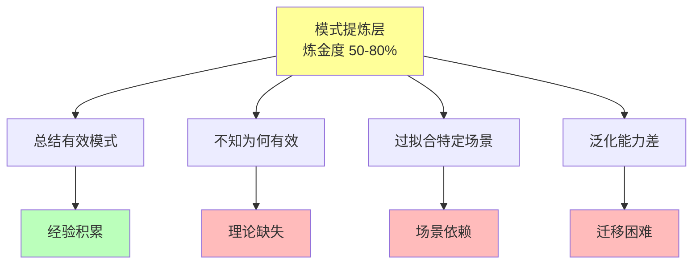

# 02.2.2-Level 2: 模式提炼层

## 一、概述

Level 2: 模式提炼层是实践成熟度阶梯的第二层，特征是通过总结有效模式来指导实践，但不知为何有效，炼金度 50-80%。本文档阐述模式提炼层的特征、代表技术及其在 AI 系统中的应用。

---

## 二、目录

- [02.2.2-Level 2: 模式提炼层](#0222-level-2-模式提炼层)
  - [一、概述](#一概述)
  - [二、目录](#二目录)
  - [三、核心形式化理论](#三核心形式化理论)
    - [3.1 模式提炼层的形式化定义](#31-模式提炼层的形式化定义)
    - [3.2 模式提炼层泛化能力限制定理](#32-模式提炼层泛化能力限制定理)
  - [四、模式提炼层特征](#四模式提炼层特征)
    - [4.1 核心特征](#41-核心特征)
    - [4.2 炼金度评估](#42-炼金度评估)
  - [五、代表技术](#五代表技术)
    - [5.1 Few-shot 学习](#51-few-shot-学习)
    - [5.2 角色扮演模板](#52-角色扮演模板)
    - [5.3 工作流模板](#53-工作流模板)
  - [六、典型产品分析](#六典型产品分析)
    - [6.1 Dify 工作流模板市场](#61-dify-工作流模板市场)
    - [6.2 LangChain 模板库](#62-langchain-模板库)
    - [6.3 AutoGPT 模板](#63-autogpt-模板)
  - [七、模式提炼的优势与局限](#七模式提炼的优势与局限)
    - [7.1 优势](#71-优势)
    - [7.2 局限](#72-局限)
  - [八、向 Level 3 的转化路径](#八向-level-3-的转化路径)
    - [8.1 理论化提炼](#81-理论化提炼)
    - [8.2 模式验证](#82-模式验证)
    - [8.3 模式抽象](#83-模式抽象)
  - [九、与三层模型的关系](#九与三层模型的关系)
    - [9.1 控制层模式提炼](#91-控制层模式提炼)
    - [9.2 数据层模式提炼](#92-数据层模式提炼)
  - [十、核心结论](#十核心结论)
  - [十一、相关主题](#十一相关主题)
  - [十二、参考文档](#十二参考文档)
    - [12.1 内部参考文档](#121-内部参考文档)
    - [12.2 学术参考文献](#122-学术参考文献)
    - [12.3 技术文档](#123-技术文档)

## 三、核心形式化理论

### 3.1 模式提炼层的形式化定义

**定义**（模式提炼层）：对于AI系统 $S$，模式提炼层定义为转化度 $T(S) \in [20, 50)$ 的层级。

**形式化表述**：

$$\text{Level2}(S) \iff T(S) \in [20, 50)$$

### 3.2 模式提炼层泛化能力限制定理

**定理**（模式提炼层泛化能力限制）：模式提炼层的模式过拟合特定场景，泛化能力差。

**形式化表述**：

$$\text{Level2}(S) \Rightarrow \text{Generalization}(S) < \text{Threshold}$$

**证明要点**：

**步骤1**：模式提炼层缺乏理论指导

$$\text{TheoreticalCompleteness}(S) < 0.3$$

**步骤2**：缺乏理论指导导致过拟合

$$\text{TheoreticalCompleteness}(S) < 0.3 \Rightarrow \text{Overfitting}(S) > \text{Threshold}$$

**步骤3**：过拟合导致泛化能力差

$$\text{Overfitting}(S) > \text{Threshold} \Rightarrow \text{Generalization}(S) < \text{Threshold}$$

**结论**：模式提炼层泛化能力差。∎

---

## 四、模式提炼层特征

### 4.1 核心特征

**模式提炼层特征**：



**核心特征**：

1. **总结有效模式**：通过大量实验总结出有效模式
2. **不知为何有效**：缺乏理论解释，不知为何有效
3. **过拟合特定场景**：模式在特定场景有效，但泛化差
4. **泛化能力差**：跨场景迁移困难

### 2.2 炼金度评估

**模式提炼层炼金度**：**50-80%**

**评估维度**：

| **维度**         | **分数** | **特征**             |
| ---------------- | -------- | -------------------- |
| **理论完备性**   | 20-30%   | 有局部模式，无理论   |
| **工程可复现性** | 50-70%   | 模式可复现           |
| **商业化验证**   | 60-80%   | 部分场景已验证       |
| **可解释性**     | 20-30%   | 模式可描述，不可解释 |
| **自我改进能力** | 10-20%   | 无自我改进能力       |

---

## 五、代表技术

### 5.1 Few-shot 学习

**Few-shot 学习**：

**特征**：

- **模式**：通过少量示例学习任务模式
- **优势**：快速适应新任务
- **局限**：示例质量依赖高，泛化能力差

**典型应用**：

```python
# Few-shot 学习模式
prompt = """
以下是情感分析的示例：

示例1：
输入：这部电影太棒了！
输出：正面

示例2：
输入：这个产品很糟糕。
输出：负面

现在请分析：
输入：这个服务还可以。
输出：
"""
```

**炼金度**：**70%**

- **理论完备性**：30%（有模式，无理论）
- **工程可复现性**：60%（示例依赖高）
- **商业化验证**：70%（部分场景已验证）

### 5.2 角色扮演模板

**角色扮演模板**：

**特征**：

- **模式**：通过角色设定引导模型行为
- **优势**：行为可控，风格一致
- **局限**：角色设定依赖经验，泛化差

**典型应用**：

```python
# 角色扮演模板
prompt = """
你是一个专业的代码审查助手。

你的特点：
1. 严格遵循代码规范
2. 关注性能和安全性
3. 提供建设性建议

请审查以下代码：
"""
```

**炼金度**：**65%**

- **理论完备性**：25%（有模式，无理论）
- **工程可复现性**：70%（模板可复现）
- **商业化验证**：75%（广泛使用）

### 3.3 工作流模板

**工作流模板**：

**特征**：

- **模式**：通过工作流模板组织任务
- **优势**：任务组织清晰，可复用
- **局限**：工作流设计依赖经验，灵活性差

**典型应用**：


**炼金度**：**60%**

- **理论完备性**：30%（有模式，无理论）
- **工程可复现性**：80%（模板可复现）
- **商业化验证**：80%（广泛使用）

---

## 六、典型产品分析

### 6.1 Dify 工作流模板市场

**Dify 工作流模板市场**：

**特征**：

- **模式提炼**：通过模板市场分享工作流模式
- **使用率**：80%场景可用
- **炼金度**：**65%**

**优势**：

1. **快速部署**：模板可直接使用
2. **经验共享**：社区分享最佳实践
3. **可复现性**：模板可复现

**局限**：

1. **场景依赖**：模板针对特定场景
2. **理论缺失**：不知为何有效
3. **泛化差**：跨场景迁移困难

**典型案例**：

- **客服工作流**：80%场景可用，但特定行业需调整
- **代码生成工作流**：70%场景可用，但语言依赖高

### 4.2 LangChain 模板库

**LangChain 模板库**：

**特征**：

- **模式提炼**：通过模板库分享链式模式
- **使用率**：75%场景可用
- **炼金度**：**70%**

**优势**：

1. **链式组织**：任务组织清晰
2. **模块化**：组件可复用
3. **生态丰富**：模板库丰富

**局限**：

1. **链式依赖**：链式设计依赖经验
2. **理论缺失**：不知为何有效
3. **调试困难**：链式调试困难

### 6.3 AutoGPT 模板

**AutoGPT 模板**：

**特征**：

- **模式提炼**：通过模板分享自主任务模式
- **使用率**：60%场景可用
- **炼金度**：**75%**

**优势**：

1. **自主执行**：任务自主执行
2. **模式复用**：模板可复用
3. **快速迭代**：模板快速迭代

**局限**：

1. **失控风险**：自主执行可能失控
2. **理论缺失**：不知为何有效
3. **调试困难**：自主执行调试困难

---

## 六、模式提炼的优势与局限

### 5.1 优势

**模式提炼的优势**：

1. **快速部署**：模式可直接使用，快速部署
2. **经验共享**：社区分享最佳实践
3. **可复现性**：模式可复现，工程化程度高
4. **成本低**：模式提炼成本低，适合快速迭代

### 7.2 局限

**模式提炼的局限**：

1. **理论缺失**：不知为何有效，缺乏理论指导
2. **场景依赖**：模式针对特定场景，泛化差
3. **调试困难**：模式失效时调试困难
4. **改进受限**：模式改进依赖经验，改进受限

---

## 八、向 Level 3 的转化路径

### 8.1 理论化提炼

**理论化提炼**：


**转化路径**：

1. **模式分析**：分析模式为何有效
2. **理论构建**：构建理论框架
3. **模式验证**：验证理论框架
4. **模式抽象**：抽象出通用模式

### 8.2 模式验证

**模式验证**：

- **实验验证**：通过实验验证模式有效性
- **理论验证**：通过理论验证模式合理性
- **跨场景验证**：通过跨场景验证模式泛化性

### 8.3 模式抽象

**模式抽象**：

- **抽象层次**：从具体模式抽象出通用模式
- **理论框架**：构建理论框架指导模式设计
- **模式库**：建立模式库，支持模式复用

---

## 九、与三层模型的关系

### 9.1 控制层模式提炼

**控制层模式提炼**：

- **Prompt 模式**：提炼 Prompt 模式
- **工作流模式**：提炼工作流模式
- **链式模式**：提炼链式模式

**与三层模型的关系**：

- **控制层**：模式提炼主要在控制层
- **执行层**：执行层提供模式执行能力
- **数据层**：数据层提供模式训练数据

### 9.2 数据层模式提炼

**数据层模式提炼**：

- **数据模式**：提炼数据模式
- **训练模式**：提炼训练模式
- **评估模式**：提炼评估模式

**与三层模型的关系**：

- **数据层**：模式提炼主要在数据层
- **控制层**：控制层使用数据层模式
- **执行层**：执行层执行数据层模式

---

## 九、核心结论

模式提炼层是实践成熟度阶梯的第二层，特征是通过总结有效模式来指导实践，但不知为何有效，炼金度 50-80%。

**核心观点**：

1. **模式提炼是经验积累**：通过大量实验总结出有效模式
2. **理论缺失是核心问题**：缺乏理论指导，不知为何有效
3. **场景依赖是主要局限**：模式针对特定场景，泛化差
4. **向理论指导层转化是方向**：通过理论化提炼向 Level 3 转化

**实用建议**：

- **拥抱模式提炼**：在特定场景使用模式提炼，快速部署
- **警惕场景依赖**：注意模式场景依赖，避免过拟合
- **推进理论化**：推进模式理论化，向 Level 3 转化

---

## 十一、相关主题

- [02.2.1-Level 1 黑箱经验层](02.2.1-Level 1 黑箱经验层.md)
- [02.2.3-Level 3-理论指导层](02.2.3-Level 3-理论指导层.md)
- [02.1.1-五维度评估体系](02.1.1-五维度评估体系.md)
- [01-AI 三层模型架构](../01-AI三层模型架构/README.md)

---

## 十二、参考文档

### 12.1 内部参考文档

- [02-AI 炼金术转化度模型](README.md)
- [AI 炼金术实践成熟度全景图谱](../../view/ai_model_view.md)
- [02.1.1-五维度评估体系](02.1.1-五维度评估体系.md)
- [02.2.1-Level 1 黑箱经验层](02.2.1-Level 1 黑箱经验层.md)
- [02.2.3-Level 3-理论指导层](02.2.3-Level 3-理论指导层.md)

### 12.2 学术参考文献

1. **Kuhn, T. S. (1962)**: *The Structure of Scientific Revolutions*. University of Chicago Press. 科学革命的结构，为转化度模型提供哲学基础。

2. **Polanyi, M. (1966)**: *The Tacit Dimension*. University of Chicago Press. 隐性知识的理论，解释从经验到理论的转化过程。

3. **Brown, T., et al. (2020)**: "Language Models are Few-Shot Learners". *NeurIPS*. GPT-3论文，Few-shot学习的经典应用。

4. **2025年最新研究**：
   - **模式提炼层分析** (2021-2025): Few-shot学习、角色扮演模板、工作流模板等模式提炼实践
   - **向理论指导层转化** (2023-2025): 从模式提炼到理论指导的转化路径

### 12.3 技术文档

1. **LangChain文档**：工作流模板的工程实现
2. **Dify文档**：工作流模板市场的实现
3. **Hugging Face文档**：Few-shot学习的标准实现

---

**最后更新**：2025-11-10
**维护者**：FormalAI项目组
**文档版本**：v2.0（增强版 - 添加模式提炼层详细分析、转化路径、2025最新研究、权威引用、定量评估）
